# (44 赞)《AI+IP+小红书=变现百万一人公司》

> 原文：[`www.yuque.com/for_lazy/zhoubao/ut1ifzqi90ui1ff2`](https://www.yuque.com/for_lazy/zhoubao/ut1ifzqi90ui1ff2)

## (44 赞)《AI+IP+小红书=变现百万一人公司》

作者： 丁小翼

日期：2025-08-17

你好哇， 我是小翼。

之前说过我**大学毕业后做了 8 年牛马，**

**在 29 岁才觉醒，发现** ***打工就是个死循环，***

于是下班后开始做小红书，实现了 1 年涨粉 10W+，

小红书让我开始辞职不上班，实现了变现百万。

我的小红书经历如下：

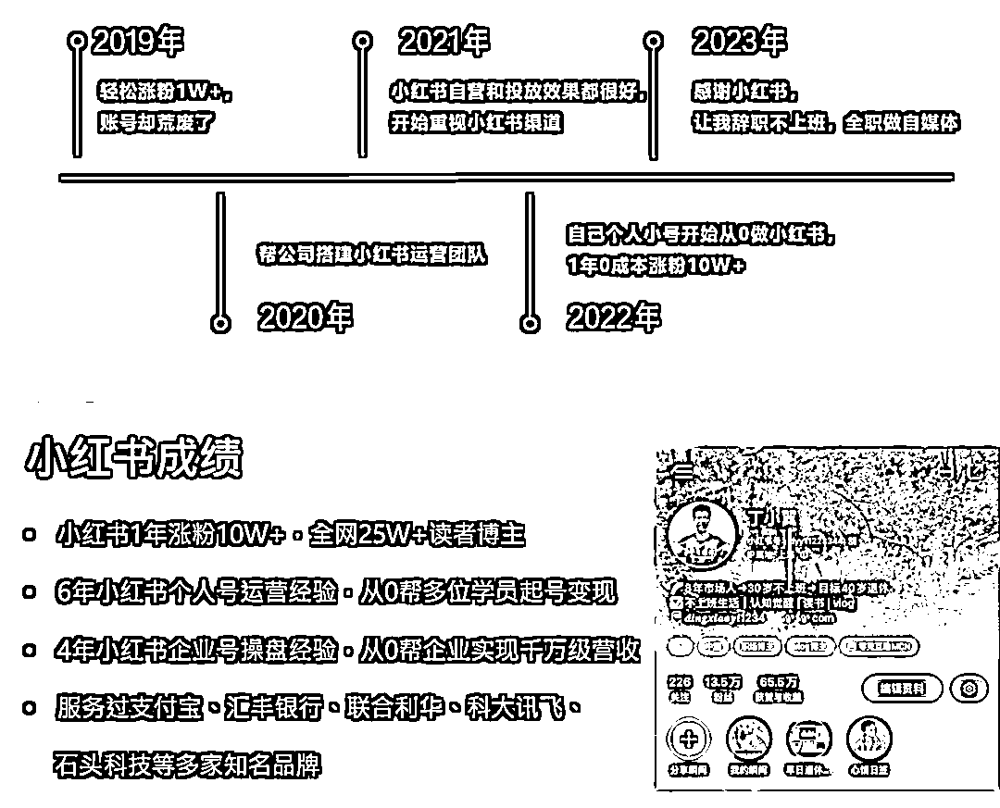

既然认知到位了，想**早日退休，核心就两点：**

**1）是认识到上班没希望**

**2）是一定要进入增长最快的平台**

**什么平台？**

**目前我看到的国内有且仅有两个：1 个是 AI 行业，1 个是小红书。**

*AI 行业:2024-2030 年，年增长率 35.7%*

*小红书：日均搜索 6 亿次，同比增长 100%*

**试问这个增速，现在谁还能超过他们？**

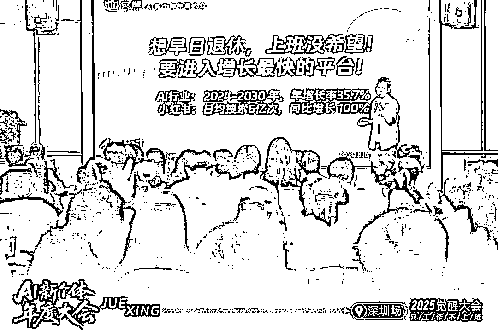

**所以今天来聊下，如何用 AI 和小红书来搞钱？**

## **1、首先是 AI，先讲个自己的故事，**

今年我不是到处旅游嘛，

在 2 月去日本旅行一周的时候，AI 就帮我赚了 1W 块，

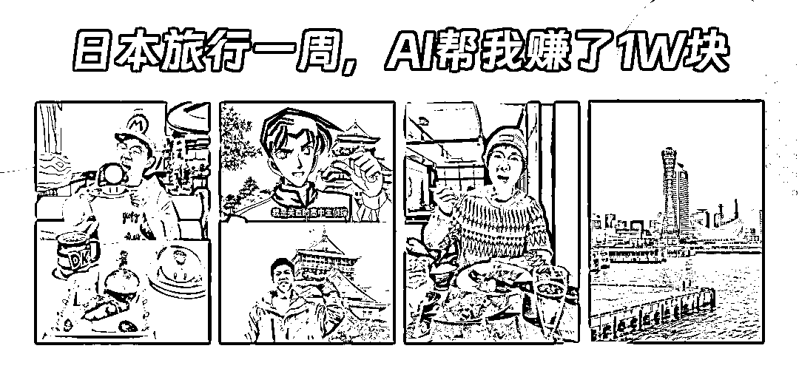

**是怎么赚到的？其实私下很简单，**

**就是边吃烧鸟，边用 AI 写作智能体边语音完成创作，**

**这样一篇攻略笔记就出来了。**

**那不就实现了即使在旅行途中，我的工作效率也没有降低吗？**

**最终接到了 AI 广告和 AI 相关的产品变现。**

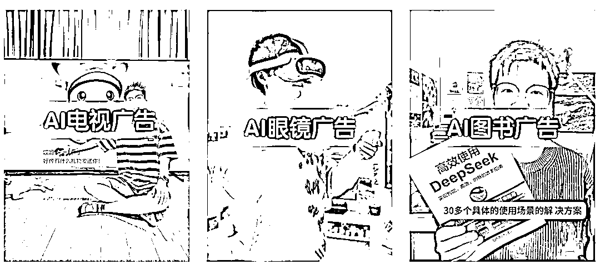

**大家别看这只是个小小的改变，影响是革命性的，也就是说：**

** *AI 能让我们在任何场景下，只要有想法，就可以开启创作！！***

**离开座位，离开电脑，离开工位，**

**但不影响赚钱，这是非常大的思维转变！**

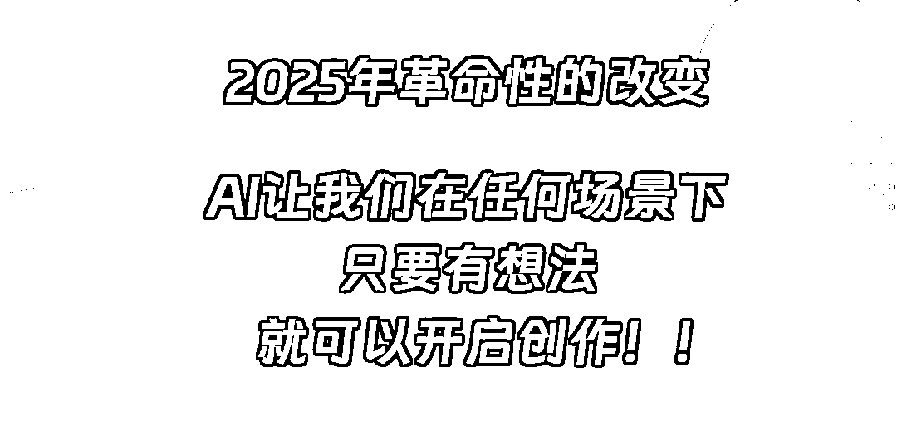

通过 *语音写作* ，直接将我们的思维转变成文字，

而你持续分享什么，就能接到什么样的广告/产品变现。

**不仅是在创作上，都说一人公司，背后真的只有 1 个人吗？**

**其实我背后有 4 个 AI 员工：**

**海报设计师、自媒体助理、语音写作助手、搞钱专业顾问。**

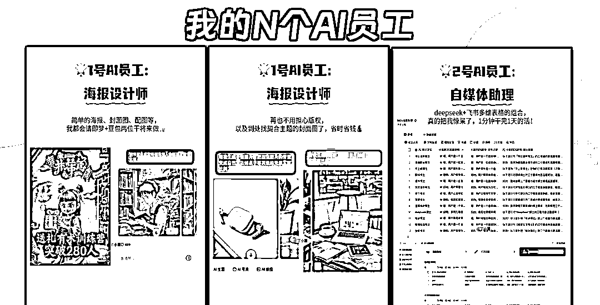

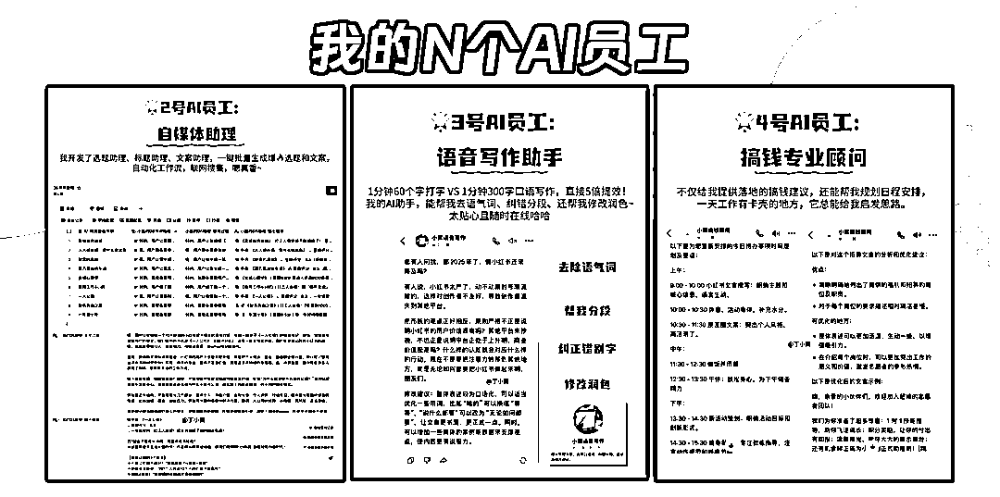

**比如 1 号员工，海报设计师，它已经能实现——**

**像这样的小红书手写体图片、现场活动图片、产品图片、甚至手绘菜谱等等，**

**都能秒生成，解决了 IP 日常绝大部分作图需求。**

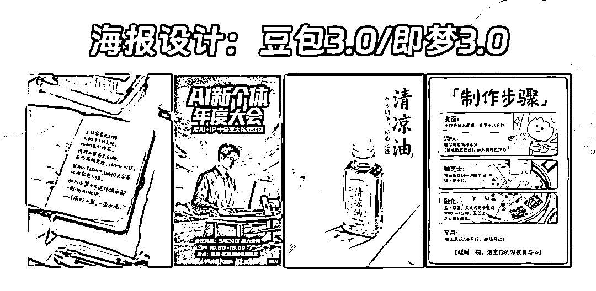

**还有我的自媒体选题标题文案助理、语音写作助手、搞钱顾问等等，**

**大家想不想要拥有？如果你也想拥有，可以保存下这张图，都能简单定制：**

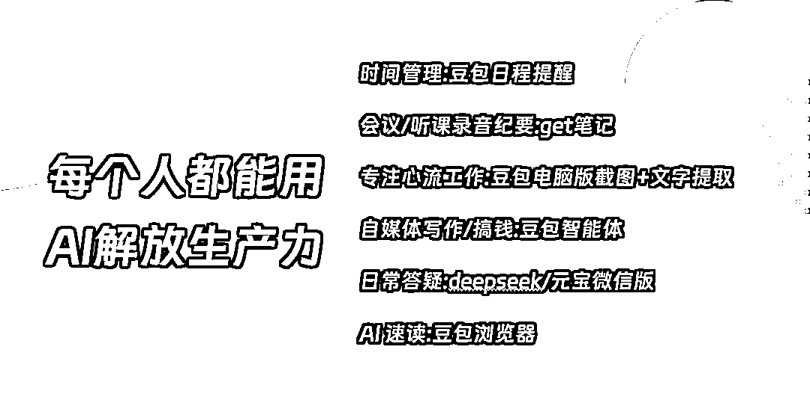

具体展开来来讲，每个工具的应用，可以看下下面的演示：

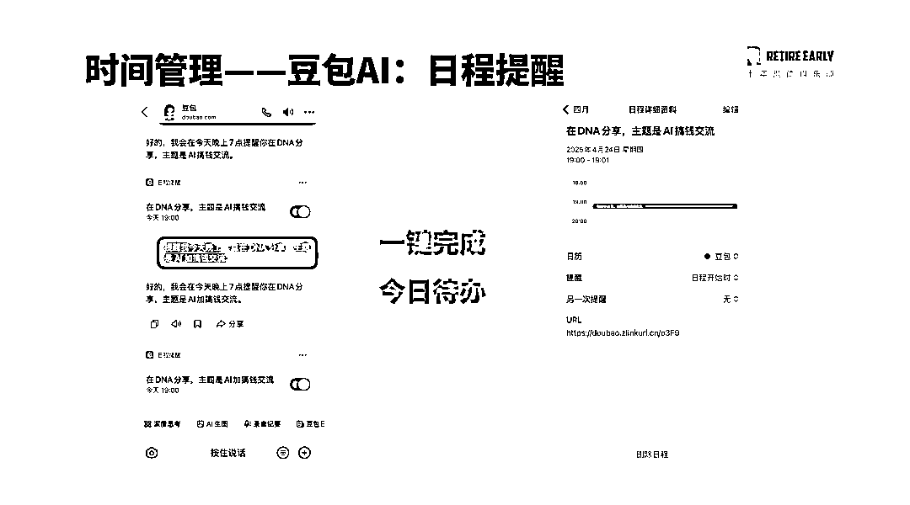

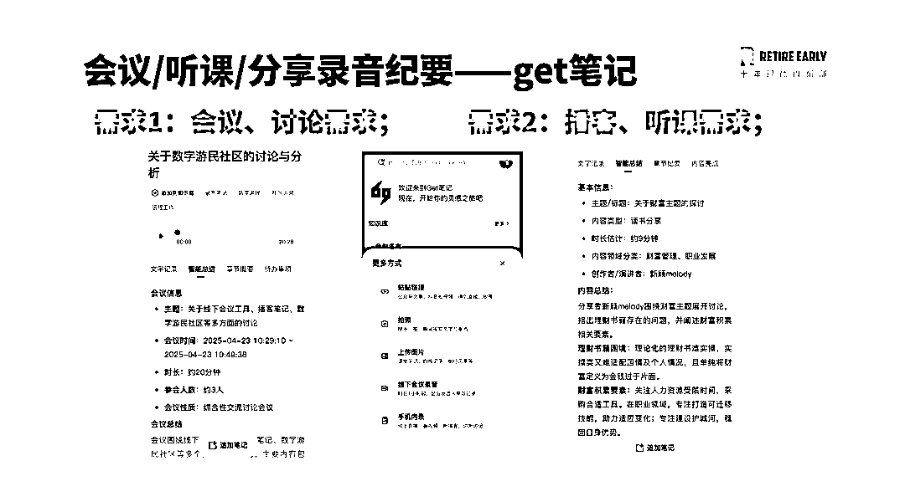

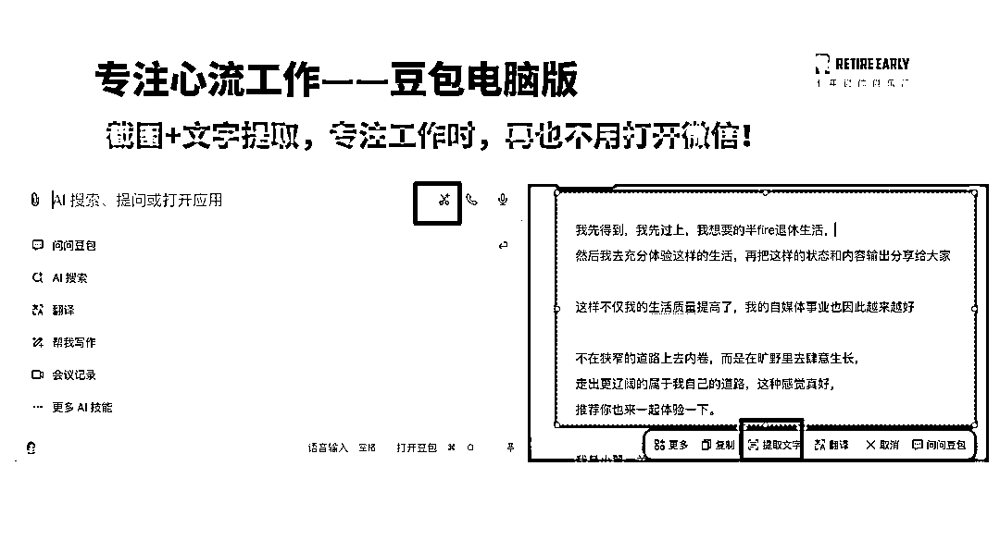

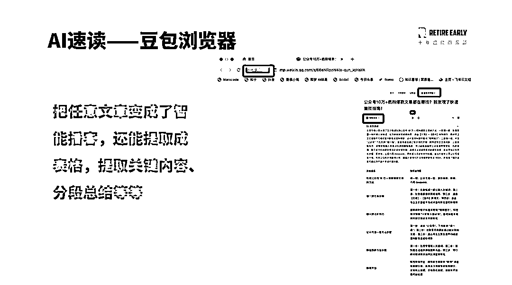

**每个人都可以用 AI 来解放生产力，**

**包括时间管理、会议听课、心流工作、自媒体写作搞钱、日常答疑、AI 速读等。**

**总结一下，** ***我认为现在每个行业，都值得用 AI 重做！***

**信息差永远存在，你越早用，越容易出彩。**

**像我今年的很多小红书机会，都是 AI 给我带来的，**

相信我，**今年一定要把你在做的事，跟 AI 结合，就会有额外的机会涌向你****‼️**

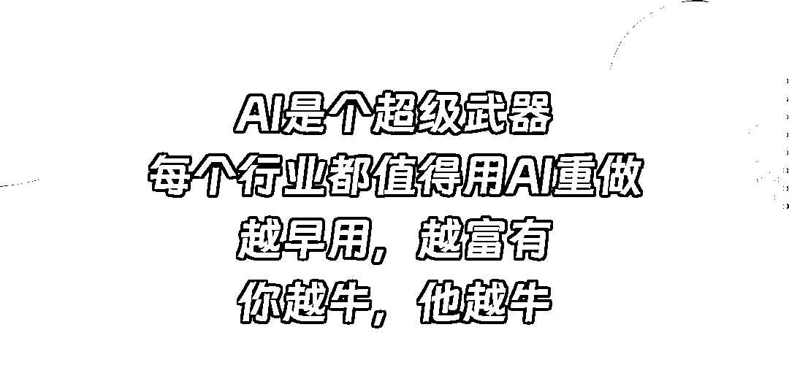

## **2、AI 是如何赋能小红书的：**

**第一个点：定位。**

我最经常被问到的问题：老师我想做自媒体，但是不知道该怎么定位？

然后还没开始做呢，就被自己卡住了，你是不是也是这样？

**我给你的建议是，**

**别再纠结定位了，直接让 AI 给你个养成系定位，然后你直接开干！**

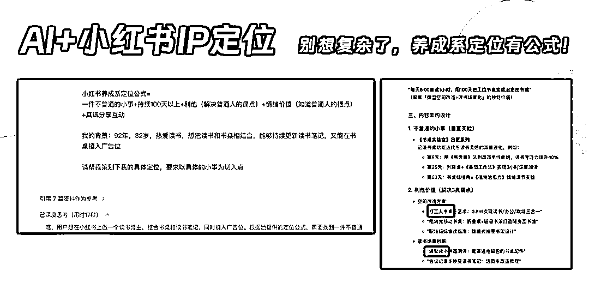

**我的方法是，用一件小事去做定位，而不是人。人是多面的，而事是具体的。**

**普通人有耐心，持续做好一件小事，就不普通。**

小红书养成系定位公式：

*你的身份背景+一件不普通的小事+持续 100 天+利他*  *(解决普通人的痛点)__+情绪价值*  *(知道普通人的槽点)__+真诚分享互动*

把这个公式，加上你的背景给到 AI，让 AI 帮你来定位。

比如很多同学想做读书博主，我们直接用 AI 给到【通勤读书】和【午休读书】这两件事，

作为持续输出的选题，来看下效果是不是很好？

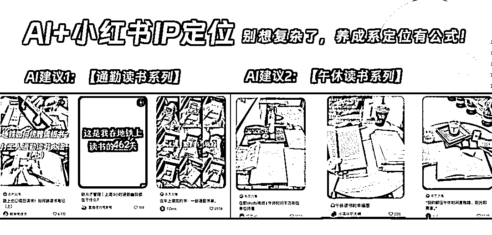

重点是什么？重点不是光分享【书】，

而是把读书这件小事【场景化】【生活化】，重点在于分享你【自己】！

** *如果你想通过接广告变现，无论做读书博主还是女性成长博主，***

** *给我布置好一张书桌！！***

分享什么不重要，重要的是场景，留出广告位，这样起号后可接广变现。

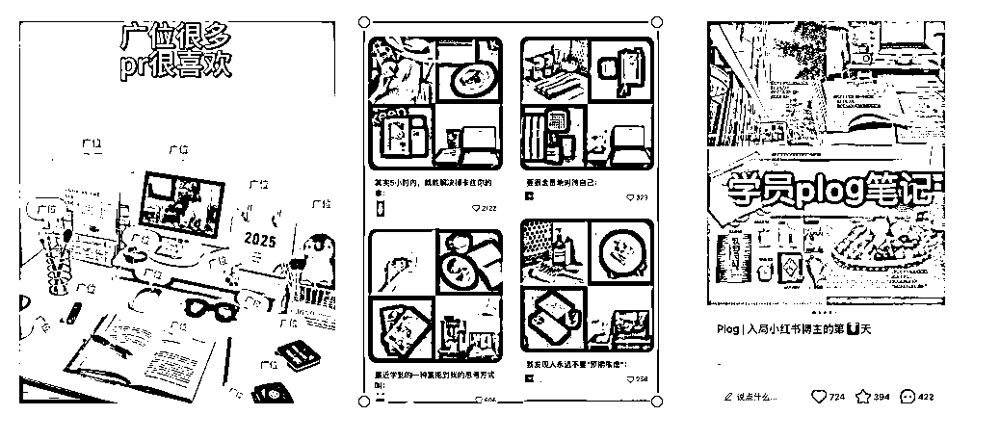

**第二个点：选题。**

选题也是一样的，用 deepseek+飞书的多维表格，

AI 就直接给到了基于我定位的 100 个选题！

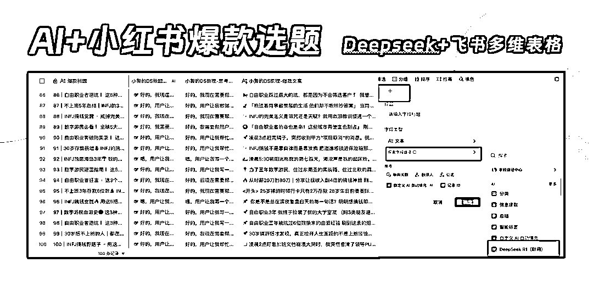

**第三个点：爆款图片。**

还有像这样的封面图，AI1 分钟就搞定，这样我们小白就能够快速起步，

不然起步是最耗心力的，还没看到反馈就放弃了，非常可惜。

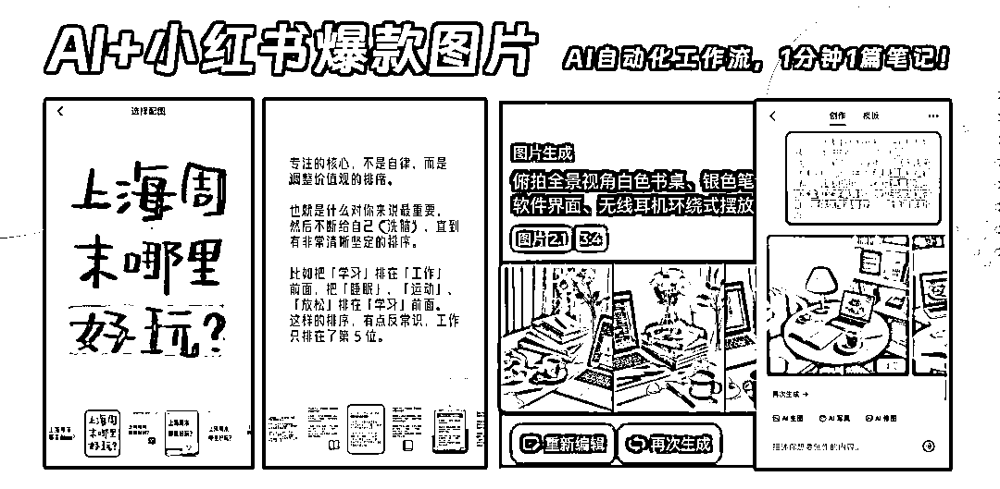

**第四个点：文案。**

这个也是用 deepseek+飞书，我们给到提示词后，

它直接输出多篇读书笔记，不看书都能写出爆款书评。

**简单版提示词参考：**

你是一位 10W 粉的小红书读书博主，请根据文本书名，生成一篇符合小红书风格的低粉爆款笔记，

包括书名，豆瓣评分、书中金句、以及个性化接地气的评价文案！1000 字以内。

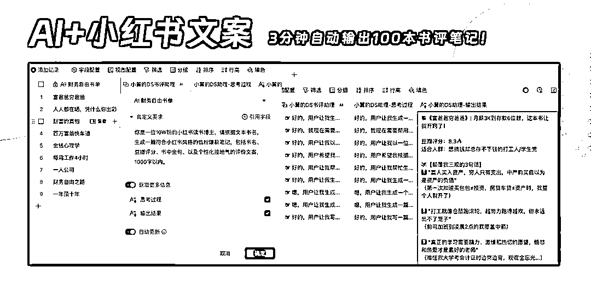

给大家放大看下内容，是不是有些比你自己写的都好？

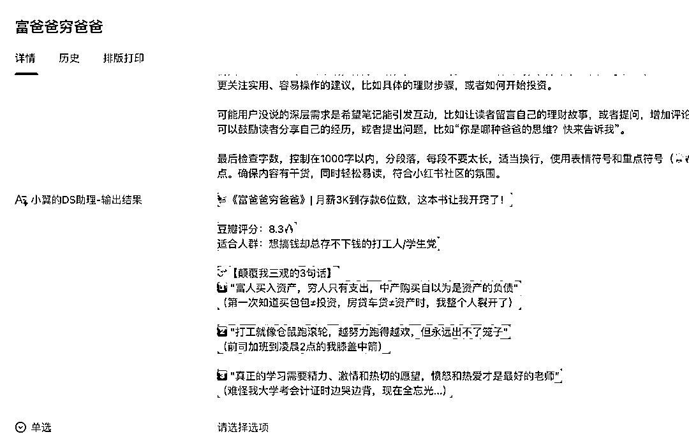

**第五个点：视频。**

想做短视频的同学，现在也是赶上好时候了，

过去我们拍+剪辑耗时很长，有时还要请人帮忙剪，

现在通通交给 AI，帮你一键剪辑，一键包装。

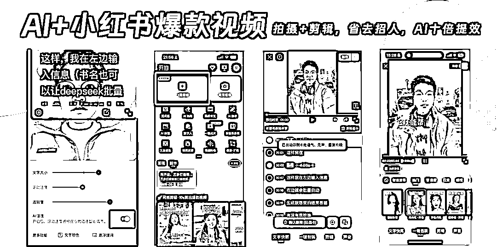

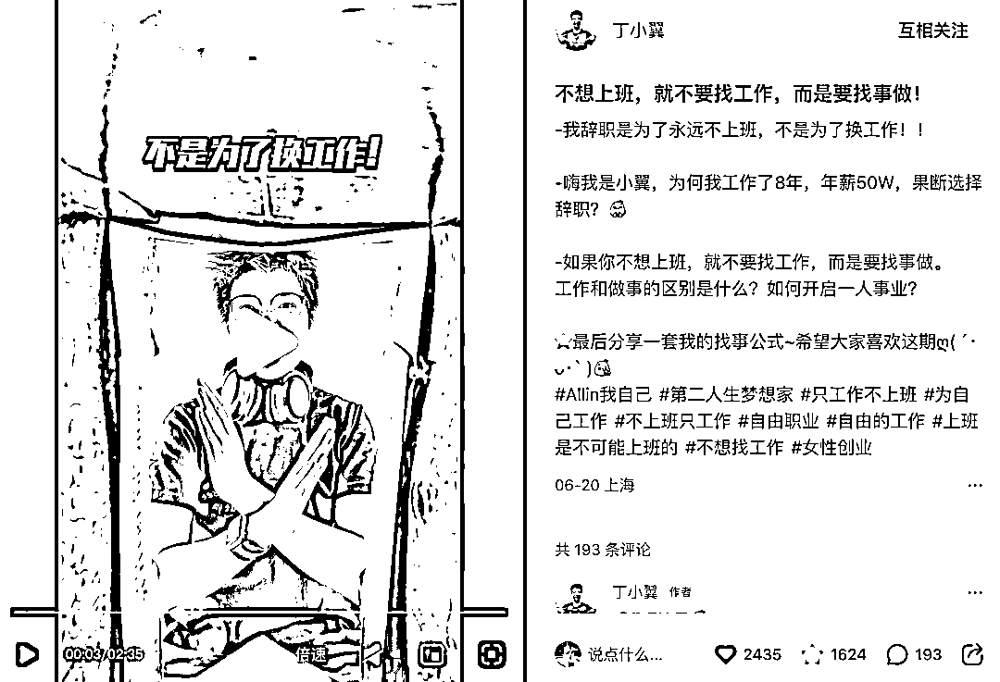

**像我现在的爆款视频，都是用 AI 辅助剪的，省了原先招聘剪辑的钱~**

这样光一年省下的钱，就超过咱们一张俱乐部门票了~

**所以有了 AI 加持，小红书起号的公式就是：**

**养成系定位+低成本+1 天 1 篇以上快执行+低粉爆款复制！**

我们同学就是这样做的，像这个封图输入文字就一键生成，

不需要任何排版，最终成功实现了引流+私域变现过万。

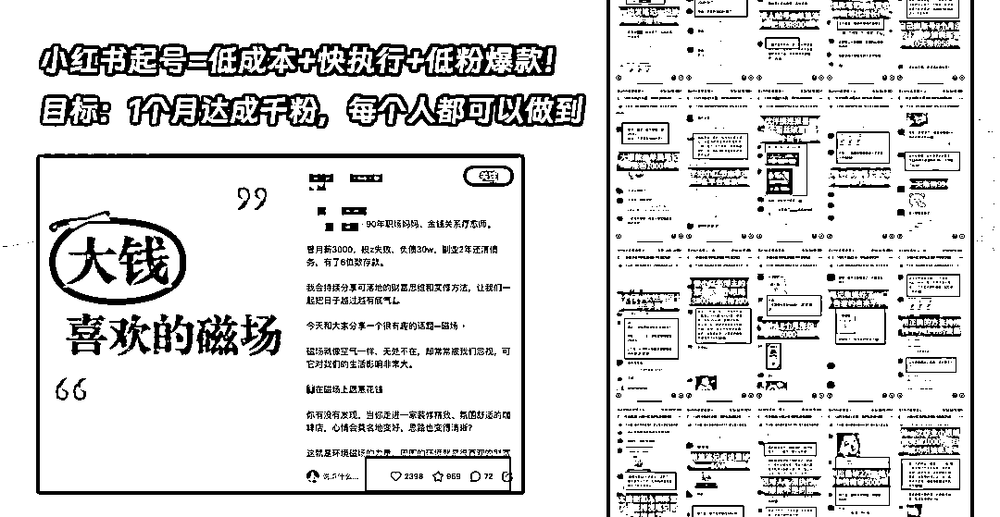

不过，这里也要提醒一下大家，

**不要陷入唯 AI 论的误区** ，什么意思？

我发现有的朋友，很执迷于研究那种，

完全自动化发小红书笔记的工具，希望自己什么都不做，

这样产出的笔记是没有灵魂的，可以变现，但价值不高。

**用 AI 搭框架，用 IP 讲故事，** 就像今天我给大家讲的东西，

是用 AI 搭框架，但是是由我个人经历和经验讲出来，

**做高价值 IP，「快」不是最重要的，你是个「人」才是最重要的。**

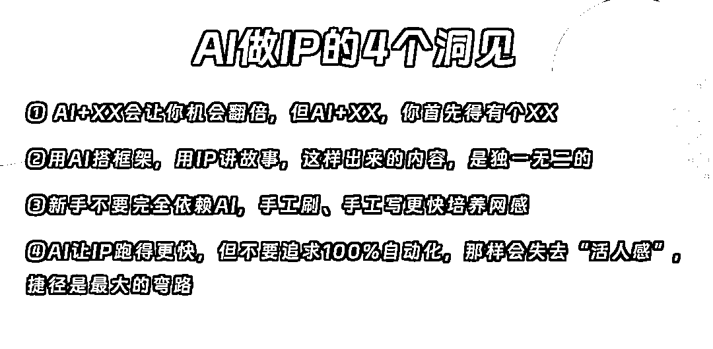

**总结一下，无论从定位、选题、标题、封图、文案还是视频，AI 可以助力我们快速起步。**

** *这个公式，可以收藏保存下：***

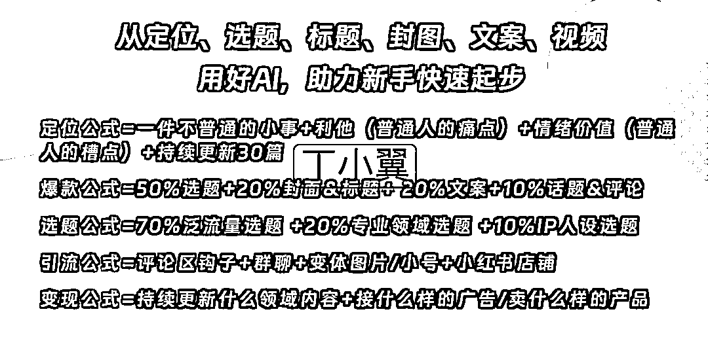

根据我们给到的爆款公式，只要刻意练习，每个人都能写出爆款，比你自己瞎摸索要快太多。

最后我想说，**AI 的确是未来十年的风口，**

**但只有自己用得上的才叫「你的风口」。**

小翼是文科生，不懂技术，但懂逻辑，

哪些地方可以用 AI 替代的，我都会手把手告诉你，

做个小而美的“个体户”，这些功能足够用了。

而一个 IP 的起步和变现，太阳底下无新事，无非就是那些方法，

你能想到的，别人都替你试过了，跟对人，站在成功的肩膀上玩就是了。

每一代人有一代人的红利，

当下抓住 AI+IP+小红书的红利，

逐步实现只工作不上班，

你会发现，世界比你想象得更广阔。

* * *

评论区：

暂无评论