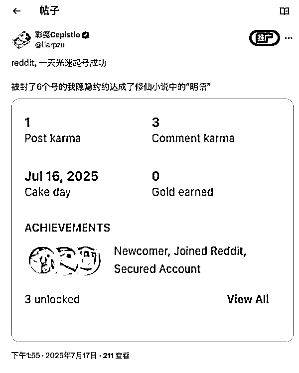

# (28 赞)如何“玩” reddit！

> 原文：[`www.yuque.com/for_lazy/zhoubao/neet92be180zs5kp`](https://www.yuque.com/for_lazy/zhoubao/neet92be180zs5kp)

## (28 赞)如何“玩” reddit！

作者： 彩笺

日期：2025-08-22

**前言：**  我是封了 6 个 reddit 账号的彩笺， 跟大家分享一下我最近爽玩 reddit 的愉快经历！  (本来, 想憋坨大的, 有些东西我还不太懂, 但是不管了, 发!, 大不了后面有内容后面接着发!)

如果让我用一句话总结， 如何起 reddit 账号， 如何在 reddit 上搞流量，做产品推广，那么这句话会是：**爱上 reddit 这个平台**

正如我标题中引号括起来的那样，“玩”是最重要的能量来源。你能把正在干的事情，变得好玩吗？（出自小排老师）

**快速预览：**

*   我如何一天起号的？

*   我总结的现在的起号方式

*   账号评价体系

*   新用户友好的 rubreddit

*   如何在 reddit 上做产品冷启动

*   在做产品的我， 会觉得 reddit 上有什么好玩的？

*   gift

*   参考&引用&常见问题

## 我怎么 1 天起号的？

有图有真相:  

我用过在公众号平台，x 平台，付费小报童的各种方式，但是最终结果都是失败的，例如：

*   养号 20 天，积累徽章

*   养号 x 天，先评论，去 r/meme sub 发猫猫图积攒 karma

*   ...

在同样的网络环境，和电脑设备下，我的新号刚注册之后，第一天就参与评论了一个中文 sub，
浏览内容评论，然后有人给点赞，karma 就涨了，过了几天就开始发帖了，数据都是正常的不少人看  我觉得重点是：**像正常用户一样去使用**

在前面几个账号都失败的时候， 我其实是很功利的去养号的，每天就是随机登录一下，滑动滑动，搜索搜索，攒攒徽章，这次起号成功，我觉得是我真的喜欢上了这里。

很多 subreddit，会有自己设定的规则， 可能包括：不同类型的 karma、账号年龄、贡献者质量评分（CQS），并检查你是否已用 Reddit
验证了邮箱，但是大多数子版块不会透露自己的内容，以免帮助那些他们想要阻止的不良用户。

一般，有这种限制的都是一些比较大的 sub，或者可能会有敏感人群，争议话题的 sub，我下面会列举一些新手友好的, 在这些 sub 评论, 大概率不会出问题

## 我总结的现在的起号方式

用自己的苹果/google 邮箱注册

像正常用户一样去浏览, 找你喜欢的地方(不要是特别大的 sub), 或者新手友好的地方

找时间线上比较新的, 网感上你觉得大概率会有讨论的帖子互动, 评论, 这样大概率会获得评论点赞

7 天之内, 除了发 post, 其他的都像正常用户就好

当你想 post 得时候, 看下自己的 CQS, 达到中等一般就没问题了

不要祈求获得 karma, 在任何地方!

真诚真诚一定要真诚, 要有敬畏之心

这个方式不保证 100%成功, 欢迎找我讨论细节, 以及更好的方式.

总结，我们的目的不外乎是流量，在人家的地盘混圈子，自然要尊重平台，尊重用户，大家也自然会接纳你。

## 账户评价体系

reddit 用 karma 来评价用户，很简单的逻辑， 点赞/踩， 会获得/失去 karma，除此之外 reddit 还有贡献体系（CQS）  你可以在 [`www.reddit.com/r/WhatIsMyCQS/`](https://www.reddit.com/r/WhatIsMyCQS/) 发任意内容的帖子，机器人会自动回复你的 CQS

## 新用户友好的 subreddit

textjavascripttypescriptcsshtmlbashjsonmarkdownpythonjavaccpprubygorustphpsqlyaml
Copy

```
建议/寻求建议: r/Advice r/AmIOverreacting r/AmITheAsshole r/AskAcademico r/AskReddit r/AskTeenAdvice r/CatAdvice r/DogAdvice r/ExplainTheJoke r/NoStupidQuestions (低要求)  

爱好/兴趣: r/animeclouds r/AsianCinema r/bars_pubs_cantinas r/Circus r/CLI r/CSS r/Digital_Art r/distantsocializing (低限制) r/DnD r/DnDart r/drawin r/EuropeEats r/FavoriteCharacter r/FavoriteMedia r/FruitRevolution r/gaming r/HomeDecorating r/houseplants r/IReadABookAndAdoredIt /r/illusions /r/irl /r/IRLEasterEggs r/J_Horror r/Kirby r/language_exchange r/learntodraw r/LearnToReddit r/minimalistphotography r/multitools r/painting r/piercing r/pixelart r/Poetrywritingclub r/powerpopgirls r/PrettyLittleLiars r/readwithme r/Redditinthekitchen (低限制) r/RedditSessions (低限制) /r/SpaceNews r/StarWarsLore r/storms r/television /r/Thatsactuallyverycool r/TheGamerLounge (低限制) r/TheYouShow (低限制) r/Sims4Build r/TheSims4 r/TheTopicOfTheDay r/Thunderstorms r/TodayIlearned r/TruckStopBathroom r/Tunisian_Crochet r/Watercolor r/WaysToPBJ r/whereintheworld (低限制) r/wildart r/Windows, r/Windows10, r/Windows11, & r/WindowsHelp  
爱好/兴趣: r/animeclouds r/AsianCinema r/bars_pubs_cantinas r/Circus r/CLI r/CSS r/Digital_Art r/distantsocializing (低限制) r/DnD r/DnDart r/drawin r/EuropeEats r/FavoriteCharacter r/FavoriteMedia r/FruitRevolution r/gaming r/HomeDecorating r/houseplants r/IReadABookAndAdoredIt /r/幻觉 /r/现实生活 /r/现实生活彩蛋 r/J 恐怖 r/Kirby r/language_exchange r/learntodraw r/LearnToReddit r/minimalistphotography r/multitools r/painting r/piercing r/pixelart r/Poetrywritingclub r/powerpopgirls r/PrettyLittleLiars r/readwithme r/Redditinthekitchen (低限制) r/RedditSessions (低限制) /r/SpaceNews r/StarWarsLore r/storms r/television /r/Thatsactuallyverycool r/TheGamerLounge (低限制) r/TheYouShow (低限制) r/Sims4Build r/TheSims4 r/今日话题 r/雷雨 r/今日所学 r/卡车停靠站卫生间 r/Tunisian_Crochet r/Watercolor r/WaysToPBJ r/whereintheworld (低限制) r/wildart r/Windows, r/Windows10, r/Windows11, & r/WindowsHelp  

可爱的动物: r/AnimalsOnReddit (低限制) r/animalscrossingroads r/Awww r/CatsBeingAdorable r/catsvstechnology r/catswhocrochet r/catswithjobs r/puppies (低限制)  

寻找社区: r/FindAReddit  

趣闻/搞笑: r/confusing_perspective (低限制) r/fauxmoi r/LastThingYouBought r/MadeMeSmile r/Madlads r/me_irl r/mildlyinteresting r/mildyinteresting r/technicallythetruth r/unexpected r/WTFWish  

科技/开发者: r/BTechtards r/developersIndia (低要求) r/IndiaTech r/IndianEngineers  

其他: r/CasualConversation r/InterstellarArt r/KoalaOnesieGang r/MatchingPfps r/MiddleGenZ r/Sea r/JEE r/mht_cet  
其他: r/闲聊 r/星际艺术 r/考拉连体衣帮 r/MatchingPfps r/MiddleGenZ r/Sea r/JEE r/mht_cet  

非英语的低限制或无限制子版块  

葡萄牙语: r/brdev r/Conversas r/Gororoba r/Idiomas

```

## 我如何做冷启动的

reddit 关于营销，有一条公开的规则，91 制，它期望你内容占比 9，营销占比 1，避免过度营销影响正常用户的体验。如果你过度营销，sub 管理员会删帖，甚至会不不允许你在 sub 发帖，我还没经历过这种，我不太敢。

现阶段, 我的账号存活下来了, 我可以在一些 sub 发帖了, 我冷启动的方式就是在一些相关评论区, 尝试发链接引流,
以及在一个我呆的最久的 sub 发了一个带外链的帖子, 可以获取到流量, 但是还很泛, 不够精准, 我想这个操作,你们肯定都会.

上案例吧:

[`www.reddit.com/r/aipromptprogramming/comments/1mc4f82/the_most_powerful_ai_image_generator_ive_seen/`](https://www.reddit.com/r/aipromptprogramming/comments/1mc4f82/the_most_powerful_ai_image_generator_ive_seen/)

[`www.reddit.com/r/InternetIsBeautiful/comments/1mpsvgo/i_built_a_tool_to_navigate_the_emerging_subreddit/`](https://www.reddit.com/r/InternetIsBeautiful/comments/1mpsvgo/i_built_a_tool_to_navigate_the_emerging_subreddit/)

这是我所有的营销帖子了, 真诚分享给你们

现在我还在尝试别的一些方式, 像:

*   什么时候发帖比较好?

*   在哪些 sub 可以真诚的调研: 我有一个 xx 想法, 我想做一个 xx, 大家意见如何?

后续有体感了再分享吧~ 发帖需要间隔冷却, 用户数据需要时间,急不得

## 我最近觉得的好玩的常看的

*   [`www.reddit.com/r/SideProject/`](https://www.reddit.com/r/SideProject/)

*   [`www.reddit.com/r/InternetIsBeautiful/`](https://www.reddit.com/r/InternetIsBeautiful/)

*   [`www.reddit.com/r/BenignExistence/`](https://www.reddit.com/r/BenignExistence/)

*   [`www.reddit.com/r/beermoney/`](https://www.reddit.com/r/beermoney/) 这个是海外网赚, 说不定有很多风向标线索, 是第一手的情报源(亦仁说的)~

## gift

[`www.reddit.com/r/ProductStudy/`](https://www.reddit.com/r/ProductStudy/)  我创建了一个 subreddit  这是一个面向所有想要学习如何构建和发展产品的人的社区。

我们在这里分享：  • 产品研究与竞品分析  • 增长策略：SEO、ASO 和流量渠道  • 如何利用人工智能进行产品开发和研究  • 面向创客和独立开发者的案例研究、工具和框架

无论您是初学者还是独立开发者，这里都是您学习和分享实用见解、打造更优质产品的理想之地。

社区今天刚创建, 我会在其中发一些初始的帖子, 大家可以围绕内容进行**友好, 真诚的评论** , **助力你们的账号冷启动!**

#### small gift

我做了个小工具, 如果你想看看最近刚创建的人数比较多的新的 subreddit, 可以查看:<[`reddflow.com/new-and-`](https://reddflow.com/new-and-) hot-subreddits>

每个 sub 都有自己的规则, 我又看不懂英语, 而且它是下拉菜单, 即使有沉浸式翻译, 也需要一个个点开看, 很麻烦, 我就做了个小工具,
输入 subreddit 名称查找对应的 rules, 然后配合你自己的翻译工具, 直接浏览全部 rules
:[`reddflow.com/subreddit-rules`](https://reddflow.com/subreddit-rules)

## 参考&引用&常见问题

### 如何练习发帖

[`www.reddit.com/r/LearnToReddit/`](https://www.reddit.com/r/LearnToReddit/)

### 新账号去哪评论&发帖？

[`www.reddit.com/r/NewToReddit/wiki/index/newusersubs/`](https://www.reddit.com/r/NewToReddit/wiki/index/newusersubs/)

### 发帖后如何验证帖子存活？

New 时间线可查看， 或者退出登录后可查看

### 索取 karma 的收获, 将不会被累计到个人 karma

### 如何查看账号是不是被封了

[`www.reddit.com/appeals`](https://www.reddit.com/appeals)  打开这个链接，你没有被封禁或影子禁令，你会在页面顶部看到一个红色框“您无法提交申诉”。

### 影子 ban 是什么

[`www.reddit.com/r/NewToReddit/wiki/index/`](https://www.reddit.com/r/NewToReddit/wiki/index/)

### NUFS

[`www.reddit.com/user/solariahues/m/newuser_friendly_subs/`](https://www.reddit.com/user/solariahues/m/newuser_friendly_subs/)

[`www.reddit.com/r/LearnToReddit/wiki/index/`](https://www.reddit.com/r/LearnToReddit/wiki/index/) 在 r/LearnToReddit 上我能做什么？

写在最后:  reddit 太好玩了, 如果你们有什么觉得很好玩的 sub, 或者玩法, 或者更好的在 reddit 上做冷启动, 求你告诉我, 我太饥渴了.

**以及, 你们对 reddit 的需求都有哪些? 评论告诉我, 说不定其中有我的产品机会呢** ~~

* * *

评论区：

谭铁铁 : 刚好不知道 reddit 怎么玩，学习了，感谢分享。

一生荣禄 : 教练出品，必属精品。感谢分享，已加收藏。

向上的塔皮 : 最近也在玩 Reddit，目前只敢发发评论，先熟悉熟悉 [呲牙]

刘小排 : 国内做 reddit 的 IP/产品/课程 一体化