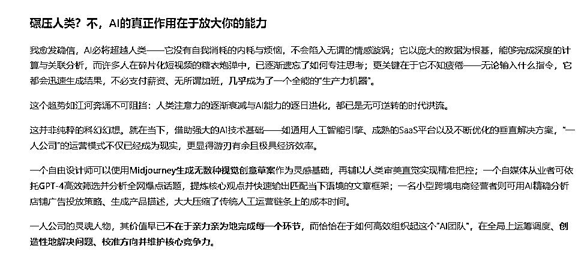

# (58 赞)借力 Ai，可以生产无数的内容（手把手教）

> 原文：[`www.yuque.com/for_lazy/zhoubao/pv1qxy1ateatq4ka`](https://www.yuque.com/for_lazy/zhoubao/pv1qxy1ateatq4ka)

## (58 赞)借力 Ai，可以生产无数的内容（手把手教）

作者： 东山老师

日期：2025-08-15

为了阐述标题的意思，我直接现场举例，看完你就明白 今天早上，在航海家，我看到了一个聊天记录，如下：  images.zsxq.com/FqbI1tQEwcGt02M_DefrEw0inkZ8)

**我把这三句话的聊天记录，丢给 AI，就给我生成了一个朋友圈；**  images.zsxq.com/FrmuEH_o7sIJqxls3m92d7cXa-X8)

**然后，有把这个朋友圈内容复制给 Ai，生成了一篇文章。**  images.zsxq.com/Frznc9hYZmeWUCXHYZgpxvD--Naq)

**这是 AI 生成的文章：**

**但这个文章 AI 味太浓了，于是我重新要求他：**  images.zsxq.com/FuaRFXYlJirWtvWHoCf8GsQ6wO1C)

**然后，我把它生成的文章，复制粘贴到公众号去，就变成了公众号文章：**  images.zsxq.com/FqxxHjHvBzDb0RnM1tnsPIsoY2i3)

**这前后大概就是 10 来分钟的时间！**

甚至，如果我愿意，我还可以把这个公众号文章再改为：口播文案脚本，小红书图文，社群分享脚本.....

还会缺内容吗？

所以，我的想法是： 只要愿意，真的有无穷无尽的内容可以做公众号，发不完，根本发不完.....

* * *

评论区：

阿旭 : 感谢分享很实用的内容输出的方法，对于我这种不知道做什么内容的人来说，很有帮助。