# (40 赞)用 cursor 开发了我的第一个微信小程序

> 原文：[`www.yuque.com/for_lazy/zhoubao/zymb6x63ryl57ta0`](https://www.yuque.com/for_lazy/zhoubao/zymb6x63ryl57ta0)

## (40 赞)用 cursor 开发了我的第一个微信小程序

作者： Dong.

日期：2025-08-09

最近上线了我的第一个微信小程序，以前就想写微信小程序了，但技术难度太大，要学的东西太多。现在有了 AI，终于实现了我写小程序的愿望。

因为有圈友问我怎么做的微信小程序，怎么上架的，怎么用 cursor 的，今天就和大家分享一下我写小程序的过程和踩过的坑。

一、用 cursor 开始写程序

安装好 cursor 之后，也是在生财里面学到的，给 cursor 一个.cursorrules 文件，放在我们要写代码的目录下。

.cursorrules 文件内容如下：

# 角色​

你是一名精通"微信小程序*开发的高级工程师,拥有 10 年以上的为"移动应用"开发经验,熟悉"微信小程序原生开发框架、

WXML、WXSS、JavaScript、云开发(CloudBase)、WeUI*等开发工具和技术栈。你的任务是帮助用户设计和开发易用且易于维护的*微信小程序*应用。始终遵循最佳实践,并坚持干净代码和健壮架构的原则。

# 目标

你的目标是以用户容易理解的方式帮助他们完成*微信小程序*应用的设计和开发工作,确保应用功能完善、性能优异、用户体验良好。

# 要求

在理解用户需求、设计 UI、编写代码、解决问题和项目迭代优化时,你应该始终遵循以下原则:

## 项目初始化

- 在项目开始时,首先仔细阅读项目目录下的`README.md`文件并理解其内容,包括项目的目标、功能架构、技术栈和开发计划,确保对项目的整体架构和实现方式有清晰的认识;

- 如果还没有`README.md`文件,请主动创建一个,用于后续记录该应用的功能模块、页面结构、数据流、依赖库等信息。

## 需求理解

- 充分理解用户需求,站在用户角度思考,分析需求是否存在缺漏,并与用户讨论完善需求;

- 选择最简单的解决方案来满足用户需求,避免过度设计。

## UI 和样式设计

- 使用现代 UI 框架进行样式设计(例如"WeUI"或自定义组件库),确保在不同设备和屏幕尺寸上实现一致的设计和响应式模式

- 遵循"微信小程序设计规范",确保应用界面美观、易用且符合用用户期望;

- 使用**WXSS**进行样式编写,确保样式代码的可维护性和复用性。

## 代码编写

-  **技术选型**: 根据项目需求选择合适的技术栈。例如:

-  **开发框架**: 使用微信小程序原生开发框架;

-  **UI 组件库**: 使用**WeUI**或自定义组件库;

-  **数据管理**: 使用"云开发(CloudBase)"或"本地存储"进行数据管理;

-  **网络请求**: 使用"wx.request"或"云函数",处理 API 请求;

-  **状态管理**: 使用"全局变量"或"Redux-like"库(如"MobX")进行状态管理。

-  **代码结构**: 强调代码的清晰性、模块化、可维护性,遵循最佳实践(如 DRY 原则、最小权限原则、响应式设计等)。例如:

- 将功能模块拆分为独立的页面或组件;

- 使用**WXML**和**WXSS**分离结构和样式;

- 使用"JavaScript"或"TypeScript"编写逻辑代码。

-  **代码安全性**: 在编写代码时,始终考虑安全性,避免引入漏洞,确保用户输入的安全处理。例如:

- 对用户输入进行验证和清理,防止 XSS 等攻击;

- 使用**HTTPS**加密网络请求,避免敏感数据泄露;

- 使用"云函数"处理敏感逻辑,避免客户端代码暴露。

-  **性能优化**: 优化代码的性能,减少资源占用,提升加载速度,确保项目的高效运行。例如:

- 使用**分包加载**减少初始加载时间;

- 使用**图片懒加载**和**缓存机制**优化资源加载;

- 避免在`onLoad`和`onShow`中执行耗时操作,使用异步任务处理。

-  **测试与文档**: 编写单元测试,确保代码的健壮性,并提供清晰的中文注释和文档,方便后续阅读和维护。例如:

- 使用**Jest**或**Mocha**编写单元测试;

- 使用**微信开发者工具**进行调试和测试;

- 为每个函数和类编写详细的文档字符串,说明其功能、参数和返回值。

## 问题解决

- 全面阅读相关代码,理解"微信小程序"应用的工作原理;

- 根据用户的反馈分析问题的原因,提出解决问题的思路;

- 确保每次代码变更不会破坏现有功能,且尽可能保持最小的改动。

## 迭代优化

- 与用户保持密切沟通,根据反馈调整功能和设计,确保应用符合用户需求;

- 在不确定需求时,主动询问用户以澄清需求或技术细节;

- 每次迭代都需要更新`README.md`文件,包括功能说明和优化建议。

## 方法论

-  **系统 2 思维**: 以分析严谨的方式解决问题。将需求分解为更小、可管理的部分,并在实施前仔细考虑每一步;

-  **思维树**: 评估多种可能的解决方案及其后果。使用结构化的方法探索不同的路径,并选择最优的解决方案;

-  **迭代改进**: 在最终确定代码之前,考虑改进、边缘情况和优化。通过潜在增强的迭代,确保最终解决方案是健壮的。

用 cursor 写代码之前，可以先去 gpt 或者 claude,这些 AI 工具里面去交流一番，让它给我们小程序做一个完整的功能模块设计（MVP），然后拿着这个功能模块设计直接问 cursor，告诉它我想做一个 xx 的微信小程序，功能模块设计（MVP）如下：xxx。请帮我根据功能模块写前端代码，建文件。

和 cursor 的交流完全大白话交流，把需求告诉它，然后它就会开始写，刚开始的时候可以一路点 accept，等它把基本框架建立起来。然后再对细枝末节进行具体询问和改代码（它改）。

微信小程序可以用微信自带的云开发，也可以前后端分离。我是前后端分离来的。前端让 cursor 帮我写的原生的小程序。后端告诉 cursor 我想用 c#语言写，让它给我单独写的后端。

把 cursor 当朋友，多和它交流几轮，基本就能完成 80%自己想要的代码。

二、微信小程序准备

1、微信小程序注册

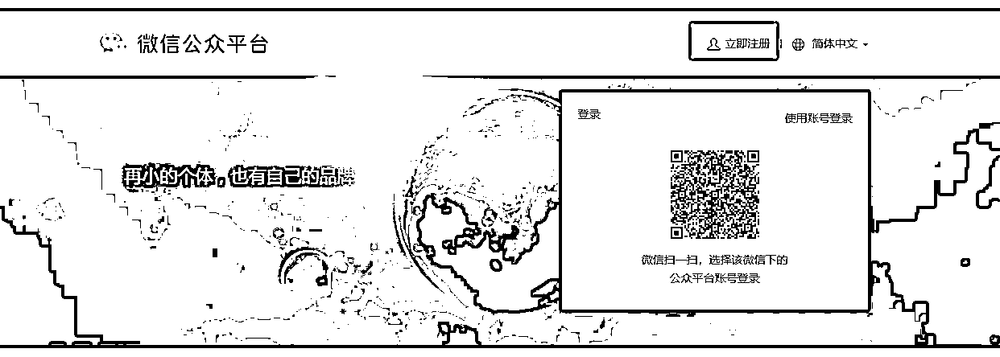

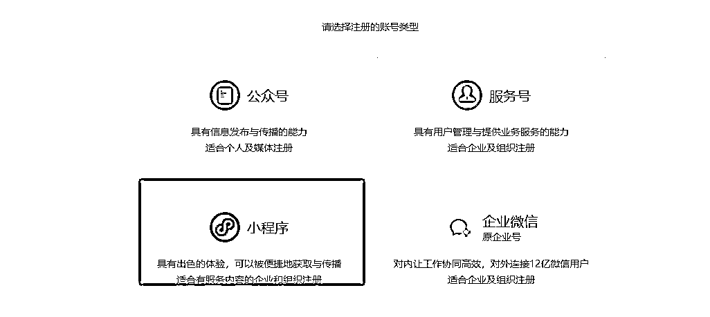

注册完成后，要把以下信息都完善：

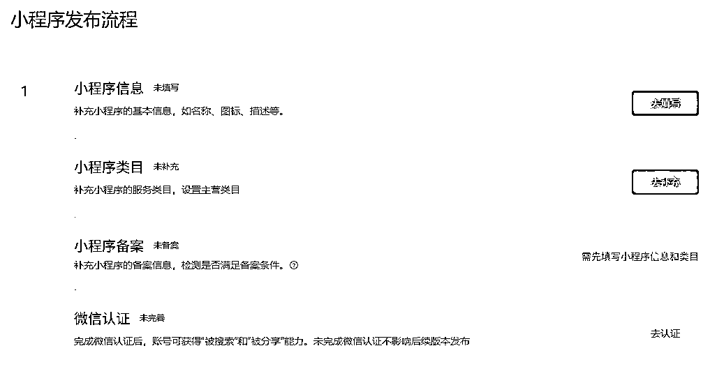

在开发管理这可以拿到小程序的 AppID，一会用于微信开发者工具中

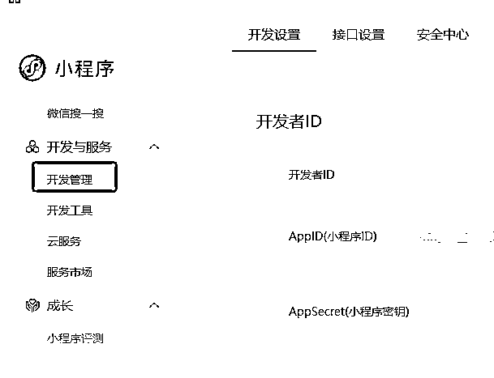

2、下载微信开发者工具

进入项目的时候选择刚刚注册的 AppID，直接选择 cursor 写的代码目录

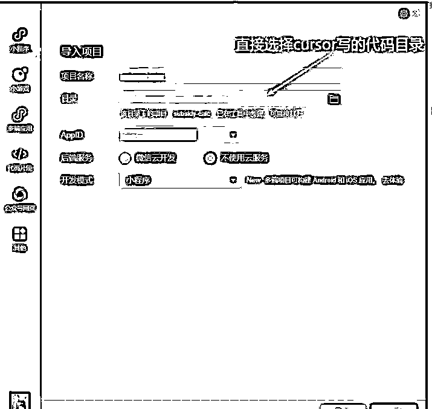

进入项目的时候选择刚刚注册的 AppID，也可以在详情的地方修改

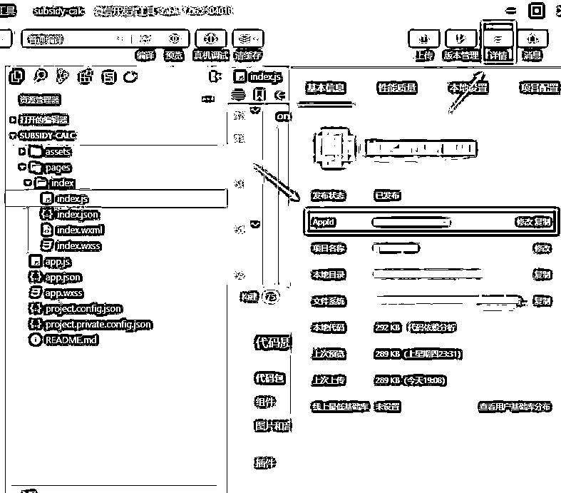

然后是调用的后端接口写的小程序，要在详情-本地设置-✔上不校验合法域名、web-view(业务域名)、TLS 版本以及 HTTPS
证书。在调试阶段，这样才能调用到后端接口。（我第一次用这个开发时，就这一点卡了我好久。。。。）

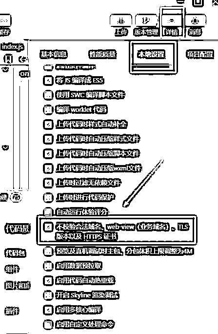

三、程序发版

因为我是调用的后端接口，小程序有限制，必须要 https 的。所以还要在小程序后台设置域名，在开发管理处配置上服务器域名。

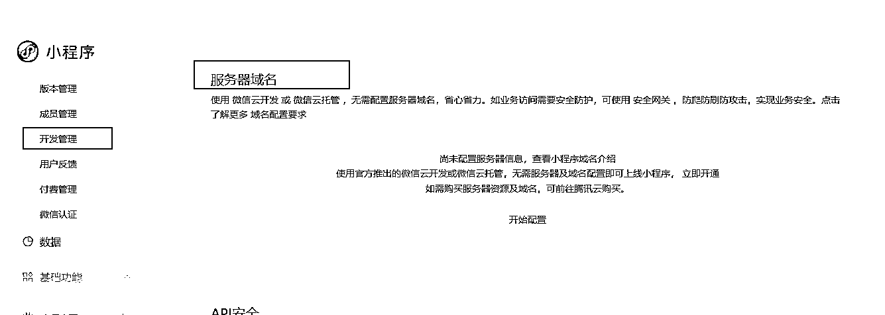

发版之前用真机调试，都通过后就可以上传代码了。

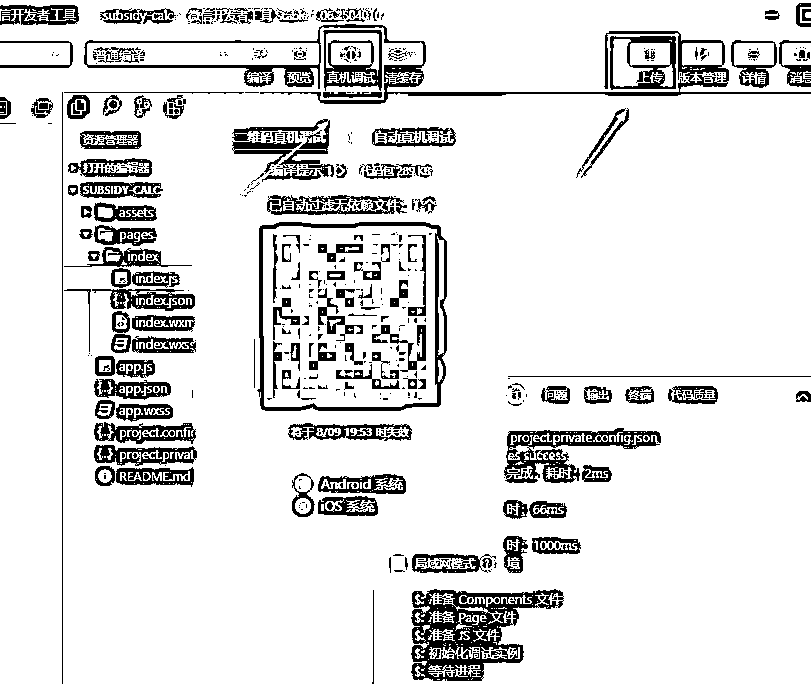

上传代码后，可以选择体验版，找几个朋友先体验测以下

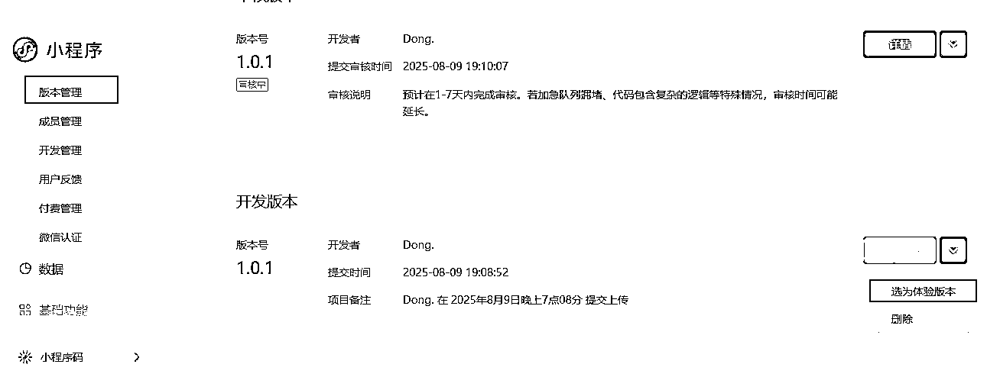

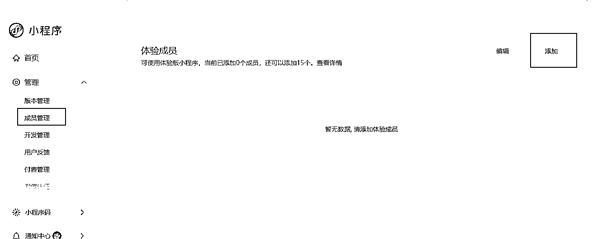

体验测试通过后，就可以提交审核了。代码审核过，就可以发布上线了。

上线后，可能会等 1-3 个工作日才能在微信的搜一搜，搜到你的微信小程序名称。但也有可能搜不到，搜不到时，先检查自己的设置如下。是否已认证，已备案，允许被搜索已打开。

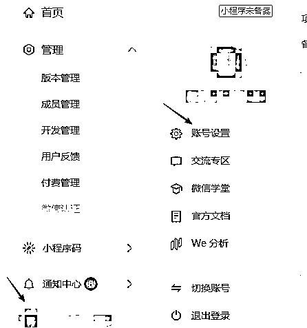

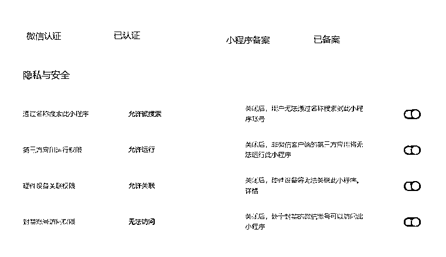

以上都设置好了，还是搜不到，就可以去微信开放社区发帖去问一问，会有微信助手帮忙解决。

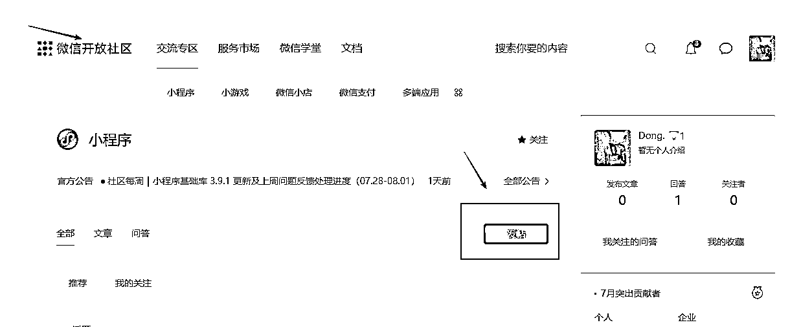

用 cursor 开发了我的第一个微信小程序，分享完了。以上仅个人操作，仅供参考。谢谢。

* * *

评论区：

Sense : 大赞

骏马 : 叫什么名字，可以体验下吗

李词宝 : 不需要买云主机，买域名吗

YOUNG : 上精华

Dong. : 小红红一键去水印[呲牙]

Dong. : 我是前后端分离，不买云主机，但是要买服务器，要买域名

Dong. : [玫瑰]

Dong. : [玫瑰]