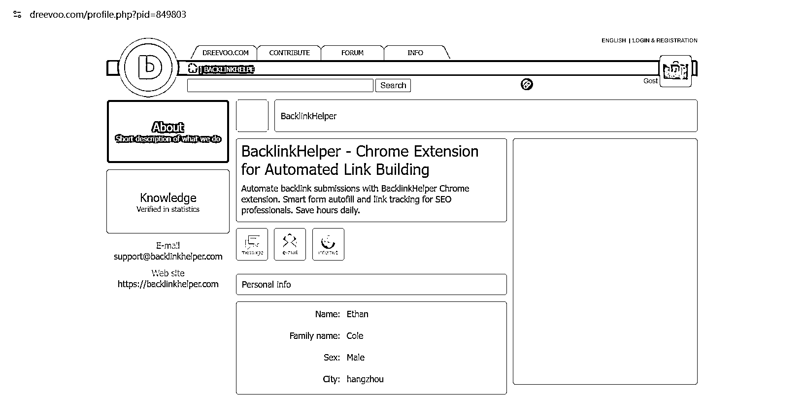
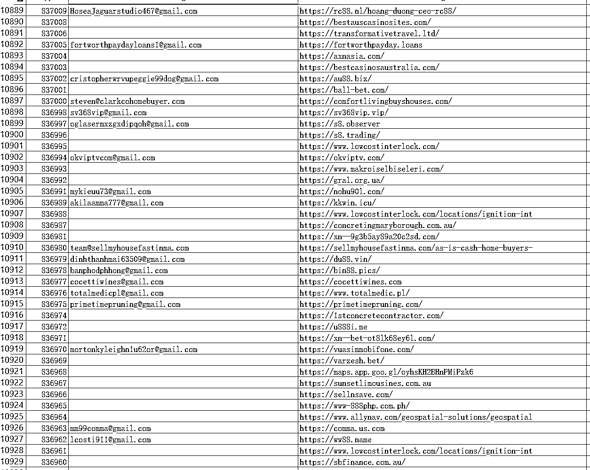
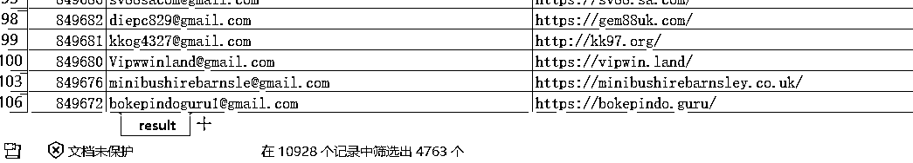

# (30 赞)一次偶遇 + 10 分钟代码，让我拿到上万个潜在客户邮箱

> 原文：[`www.yuque.com/for_lazy/zhoubao/ildizvpwmlam5m72`](https://www.yuque.com/for_lazy/zhoubao/ildizvpwmlam5m72)

## (30 赞)一次偶遇 + 10 分钟代码，让我拿到上万个潜在客户邮箱

作者： 一箭

日期：2025-08-13

大家好，我是一箭。今天想和你们分享一个小故事：我如何用不到 10 分钟的时间，写了个小脚本，就收集到成千上万个精准的意向客户邮箱。

事情的起因很简单。最近我在推广自己新开发的 Chrome
插件——智能外链提交助手。为了让新站尽快被搜索引擎收录，我每天都在提交外链。就在这个过程中，我无意中发现了这个宝藏网站：

这个网站，用户可以选择公开展示自己的邮箱。更妙的是，它的用户数据是通过自增 ID 控制的：只要改变 URL
里的数字，就能访问不同用户的信息。换句话说——只要写个 for 循环，就能一口气遍历所有用户的数据。

更重要的是，这些用户和我插件的目标客户群几乎完全重合，这意味着——这里简直是一个精准客户的邮箱金矿！

于是我立刻开启了 "vide coding"。

由于只是一个脚本，所以都不需要什么 VS Code、Cursor、Claude Code 这些花里胡哨的 IDE，直接在 ChatGPT
里描述需求，让它帮我生成一段简单的脚本。

提示词：

帮我写个 python 脚本，[`dreevoo.com/profile.php?pid={id}`](https://dreevoo.com/profile.php?pid={id}) 读取这个 URL 地址，获取内容中的邮箱： 和 网站地址：，其中 id 从 1 遍历到 849803，输出结果到 csv 文件

返回代码：

import requests

import re

import csv

from bs4 import BeautifulSoup

from time import sleep

BASE_URL = "[`dreevoo.com/profile.php?pid={}`](http://dreevoo.com/profile.php?pid={})"

OUTPUT_FILE = "result.csv"

START_ID = 1

END_ID = 849803

headers = {

"User-Agent": "Mozilla/5.0 (Windows NT 10.0; Win64; x64)"

}

def extract_info(html):

soup = BeautifulSoup(html, "html.parser")

# 提取邮箱（mailto）

email_tag = soup.find("a", href=re.compile(r"^mailto:"))

email = None

if email_tag:

email = email_tag.get("href").replace("mailto:", "").strip()

# 提取网站（排除 mailto）

website = None

for a_tag in soup.find_all("a", href=True):

href = a_tag["href"]

if href.startswith("http") and not href.startswith("mailto"):

website = href.strip()

break

return email, website

def main():

with open(OUTPUT_FILE, "w", newline="", encoding="utf-8") as f:

writer = csv.writer(f)

writer.writerow(["ID", "Email", "Website"])

for pid in range(START_ID, END_ID + 1):

url = BASE_URL.format(pid)

try:

resp = requests.get(url, headers=headers, timeout=10)

if resp.status_code != 200:

print(f"[{pid}] 请求失败: {resp.status_code}")

continue

email, website = extract_info(resp.text)

if email or website:

writer.writerow([pid, email or "", website or ""])

print(f"[{pid}] {email} | {website}")

except Exception as e:

print(f"[{pid}] 出错: {e}")

sleep(0.3) # 防止请求过快被封

if **name** == "**main**":

main()

运行时，发现从 ID=1 开始会遇到很多空数据，于是我让 ChatGPT 修改成倒序遍历，这样可以直接抓到最新的活跃用户数据，提示词：

帮我把代码改成降序遍历

最终代码：

import requests

import re

import csv

from bs4 import BeautifulSoup

from time import sleep

import urllib3

urllib3.disable_warnings(urllib3.exceptions.InsecureRequestWarning)

BASE_URL = "[`dreevoo.com/profile.php?pid={}`](http://dreevoo.com/profile.php?pid={})" # 用 HTTP 避免 SSL 错误

OUTPUT_FILE = "result.csv"

START_ID = 849803

END_ID = 1

headers = {

"User-Agent": "Mozilla/5.0 (Windows NT 10.0; Win64; x64)"

}

def extract_info(html):

soup = BeautifulSoup(html, "html.parser")

# 提取邮箱（mailto）

email_tag = soup.find("a", href=re.compile(r"^mailto:"))

email = None

if email_tag:

email = email_tag.get("href").replace("mailto:", "").strip()

# 提取网站（排除 mailto）

website = None

for a_tag in soup.find_all("a", href=True):

href = a_tag["href"]

if href.startswith("http") and not href.startswith("mailto"):

website = href.strip()

break

return email, website

def main():

with open(OUTPUT_FILE, "w", newline="", encoding="utf-8") as f:

writer = csv.writer(f)

writer.writerow(["ID", "Email", "Website"])

for pid in range(START_ID, END_ID - 1, -1): # 倒序遍历

url = BASE_URL.format(pid)

try:

resp = requests.get(url, headers=headers, timeout=10, verify=False)

if resp.status_code != 200:

print(f"[{pid}] 请求失败: {resp.status_code}")

continue

email, website = extract_info(resp.text)

if email or website:

writer.writerow([pid, email or "", website or ""])

print(f"[{pid}] {email} | {website}")

except Exception as e:

print(f"[{pid}] 出错: {e}")

sleep(0.3) # 防止被封

if **name** == "**main**":

main()

接下来，我把脚本部署到云服务器上，让它自己慢慢跑。ChatGPT 应该是考虑到对方服务可能有反爬功能，所以给脚本加了个 0.3 秒的等待时间。大约 5
个小时后，脚本已经抓到了 1 万多条数据：

当然，并不是每条记录都有邮箱，于是我直接在 Excel 简单筛选后，得到了 4763 个真实可用的邮箱地址：

这个时候脚本才跑到 ID=836960，理论上还有 83 万条记录没抓完——等它完全结束，至少上万个邮箱。

这个过程让我再次体会到：

1.  留意日常中的“小漏洞”，可能就是大机会。

2.  有了想法，不要等，10 分钟的动手，能带来远超预期的收获。

3.  工具（比如 ChatGPT）用得好，很多事情真的是“手到擒来”。

等脚本跑完，我可能就有一个超大的精准客户名单，这对我插件的推广来说，无疑是个巨大的加速器。

顺便安利一下我的工具，如果你也在做 SEO 推广、外链建设，强烈推荐试试我开发的 Chrome
扩展：[`backlinkhelper.com`](https://backlinkhelper.com)，专业的自动化外链助手，支持自动识别定位网站表单、表单智能填充、外链管理等等功能，让你的推广效率提升数倍。

* * *

评论区：

暂无评论