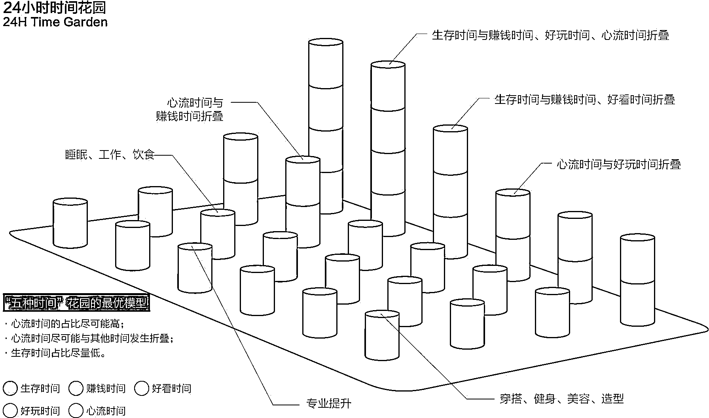

# (31 赞)3 天，20 万字对话，我把自己“扒光”喂给 AI 生成了一份 6 万字的个人剖析报告

> 原文：[`www.yuque.com/for_lazy/zhoubao/gf8og2cht1i0ip1b`](https://www.yuque.com/for_lazy/zhoubao/gf8og2cht1i0ip1b)

## (31 赞)3 天，20 万字对话，我把自己“扒光”喂给 AI 生成了一份 6 万字的个人剖析报告

作者： 鸭先知

日期：2025-08-11

**一套可复制的提问系统，教你如何用 AI 深度的解剖自己，为自己的发展方向找到清晰的路径**

**  **

我花了 3 天时间，跟 AI 聊了 20 万多字，给自己做了一次深度**“解剖”** ，多次精简修改后生成一份 6 万字**个人分析报告** ，与一份针对**发展报告的注意事项，** 我得到的，不只是一份简单的“**个人分析报告** ”，而是一整套只属于我自己的、可执行的**人生操作系统** 在这篇文章，我将毫无保留地向你展示，我是如何通过与 AI 的深度对话，提炼出适合每个人的找到自己合适路径的方法论**  **

**关于战略，我信奉“见路不走”****。** 我将向你展示，我是如何运用这套方法，拒绝所有现成的“**安全路径** ”，为自己构建了一个独一无二的、反脆弱的“**一个人公司** ”商业模式。**  **

**  **

**关于效率，我借用“时间折叠”概念。** 我是如何**“从一边学习一边变现“** ,到实现**"一鱼六吃"** 的过程。

这篇文章，就是我完成这次自我认知重塑的全程实录。

你将学会如何选择大模型，让大模型成为你的私人教练，并最终也为你自己，找到那条**地图上不存在的道路** 。

详情移步飞书阅读：[`wgpt6awo7z.feishu.cn/docx/KPAzd04U1oT3ezxE936c7swpnpc`](https://wgpt6awo7z.feishu.cn/docx/KPAzd04U1oT3ezxE936c7swpnpc)

* * *

评论区：

大西｜高客单 IP * : 先收藏，这周我也做一份