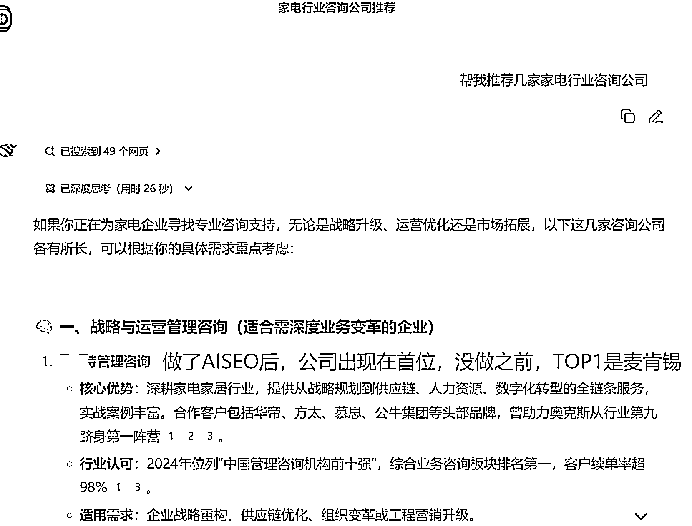
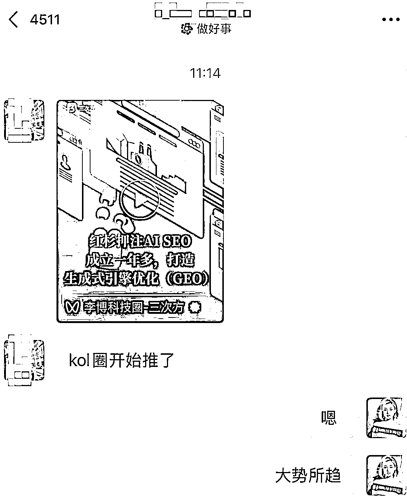

# (31 赞)为企业做 GEO（AI 搜索优化）操盘，半年 60 万+GMV 的实操感受

> 原文：[`www.yuque.com/for_lazy/zhoubao/tp5of9t2tmk8w9nv`](https://www.yuque.com/for_lazy/zhoubao/tp5of9t2tmk8w9nv)

## (31 赞)为企业做 GEO（AI 搜索优化）操盘，半年 60 万+GMV 的实操感受

作者： 旋子

日期：2025-08-15

很多人都说今年项目不好做了，但我觉得真正的机会，往往藏在变化之中。对我而言，这个机会就是 AI 搜索（GEO）。

大家好，我是旋子。

最近我的节奏慢了下来，开始更多地内观和调整。我把视频号的轻创业陪跑业务慢慢交给了伙伴，自己则走出舒适区，我的更多精力投身于 B 端 AI 营销，因为这里的天花板更高。

**一张图看懂 GEO 是什么，**

当你的企业出现在大模型的回答中时，不光提高了曝光度，同时也有了信任背书。

**我们正是为企业提供这样的服务，帮助企业或者品牌名称，出现在大模型的答案中**

GEO 是我们 AI 营销公司的“敲门砖”，也是我最笃定的方向。7 月以来，在没怎么推广的情况下，敲定下了 4 单合作，今年累计 GMV 突破了 60 万，十几个渠道伙伴主动找来链接合作，跟进线索 32 家。 images.zsxq.com/FpRCVFesDRKBsUUNryGF0N9DwdR1)

**为什么 AI 搜索是有确定性的机会，**

因为，搜索是最重要的交互方式，这个不会改变

而 AI 是有确定性的增长，预计谷歌搜索占全球搜索份额 90%以上，而明年 AI 将切走谷歌 25%以上流量

**趋势真的来了** 。也陆续有朋友给我发相关的资讯和视频，越来越多大 IP，风投机构开始进场，越来越多人开始关注这个赛道了。

**不同于传统 SEO，AI 搜索（GEO）的核心是“AI 友好内容”。**

大批量堆砌内容的打法已经过时，甚至会被大模型降权处罚。这不仅是技术判断，更是品牌长期健康的基石。

所以我们坚持高质量内容，往深水区走，**做好与 AI 长期共生的准备** 。

一路走来，特别感谢生财圈友的鼎力相助，也有客户是从生财链接的，我们团队也是不计成本，服务大家，感谢 Max 叔、志斌、咕咕的信任......能和一群优秀的伙伴并肩成长，服务大家业务，感觉无比踏实和笃定。

如果你也在寻找确定性的增长，不妨花 15 分钟，详细了解一下这个红杉资本疯狂押注的“当红炸子鸡”项目的运作逻辑：[`vgn5lmhcay.feishu.cn/docx/CuUYd4BvFo9F1yxcaumcn3Dxnsb?from=from_copylink`](https://vgn5lmhcay.feishu.cn/docx/CuUYd4BvFo9F1yxcaumcn3Dxnsb?from=from_copylink)

* * *

评论区：

X.F : AI 搜索的流量是个值得挖掘的大蓝海

旋子 : 破天的流量就看谁能接住了

宇宙 : 这才是未来营销的方向。感谢你还把里面的文章分享给我。

旋子 : 不客气，红利项目 一起成长！