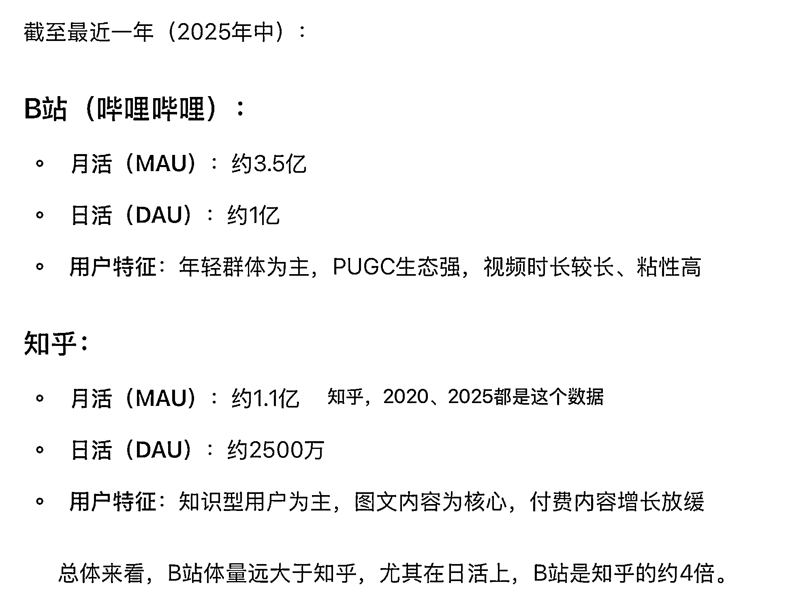
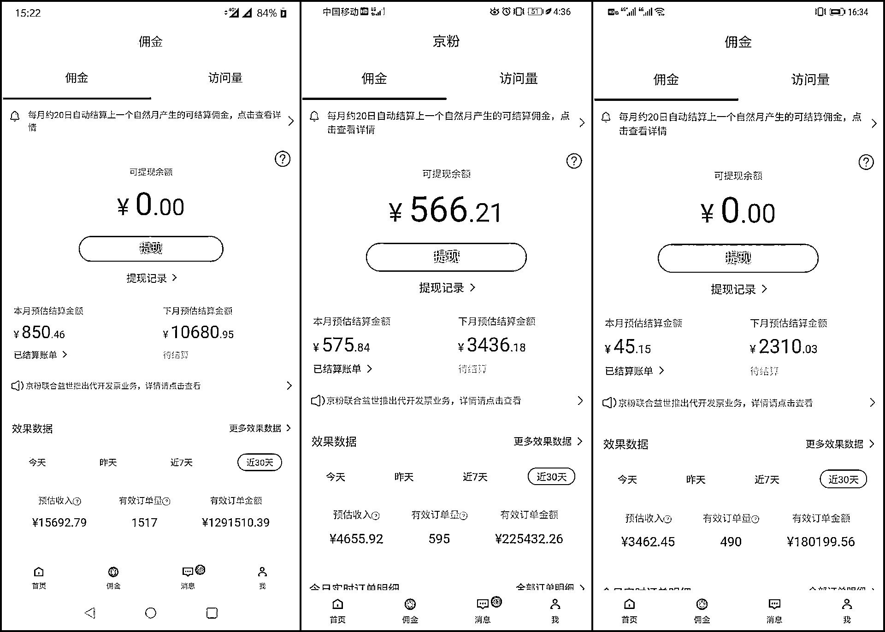
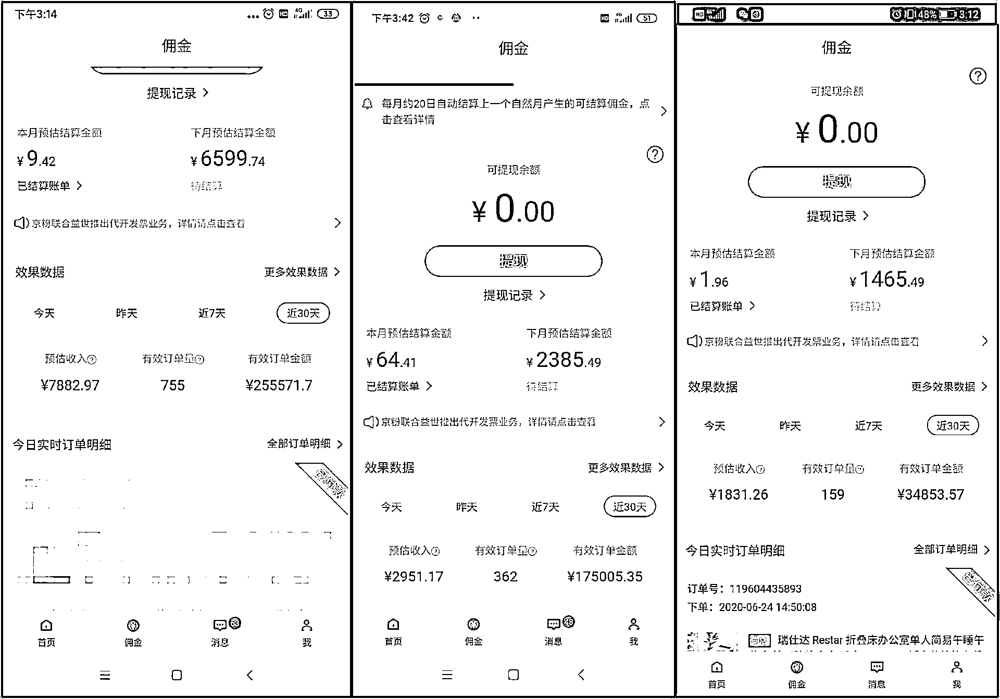
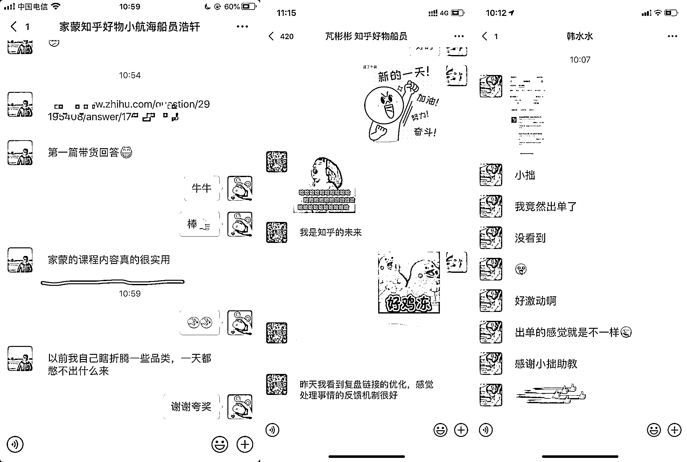
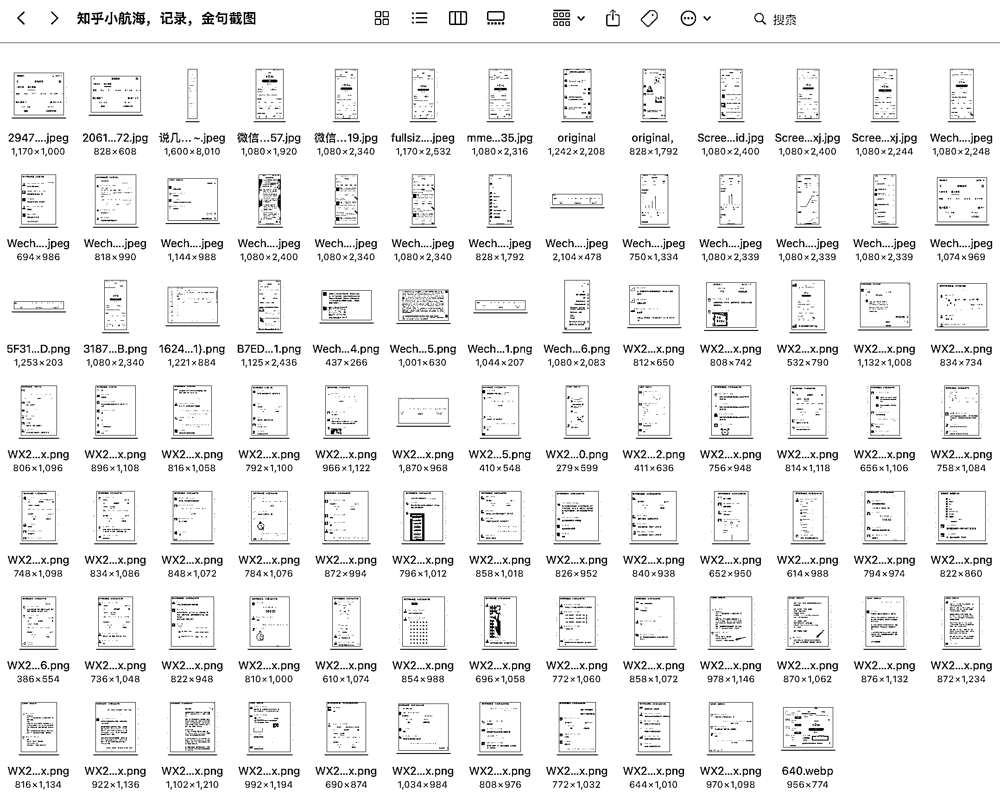
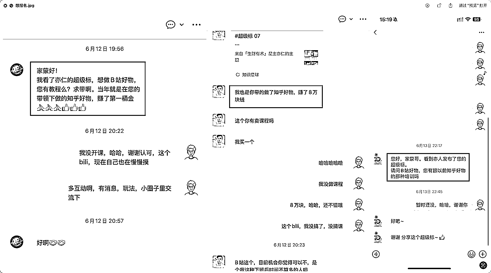

# (精华帖)(246 赞)B 站好物能挣多少钱？项目机会拆解

> 原文：[`www.yuque.com/for_lazy/zhoubao/fsba5z46des9ldal`](https://www.yuque.com/for_lazy/zhoubao/fsba5z46des9ldal)

## (精华帖)(246 赞)B 站好物能挣多少钱？项目机会拆解

作者： 家蒙

日期：2025-08-11

朋友们好，我是家蒙。

生财多年老圈友，以前做知乎好物带货，现在在做 B 站好物带货。

超级风向标发出来之后，B 站好物讨论热度多了很多，有些朋友觉得上手难度很大，不知道怎么开始；也有些朋友已经开始尝试，获得了一些正反馈。

视频带货，听上去是一个非常稀松平常的项目，为什么值得关注，这个项目大概能挣多少钱？

和大家分享一下我们的观察。

## 一、B 站能挣多少钱，平台容量有多大

先说下，能挣多少钱。

b 站官方榜单，每个月大概有 150 个人上榜，他们是带货金额超过 100 万，其中前 15、20 会超过 1000 万。

根据我们的经验，带货金额特别大的那种，佣金比例大概在 1%-1.5%左右。1000 万的规模，也就是 10-15 万的佣金。

百万规模的那种 3-5%左右，也就是 3-5 万元佣金。

这里讨论的只是单独佣金收入，其实成熟的账号，有稳定的带货能力之后，每个月还会有广告商单收入。也就是大家熟悉的做一个博主，在平台恰饭接广告。

这样的报价从几千到大几万都有，根据自己的制作水准来定。经验是，**广告收入往往大于佣金收入。**

**  **

但是请注意，这里说的佣金、广告，指的是营业收入，并非利润。

有的是团队化作战，他要开工资，有办公室场地租金。那他这个 10 万块钱挣下来能不能覆盖成本，不确定，不知道，利润不好说。

单人作战的也就是自由职业个体，可以说几乎没有什么成本，那到手的收入可以说就是纯利润。

我们身边朋友，光带货的佣金收入，一个月 1-2 万，我们还是见到好些的。

更高的也见过，一个月十来二十万的也都知道。

团队一个月搞 100 万营收的，也是有看过的 。

但是我们说这个数据，并不想让大家觉得望而生畏，只是想让大家觉得：**有戏。**

尤其是我们新手刚来做，不要把目标定得太高，**普通人每个月可以多两三千块钱的收入。** 能做到这个水平就非常好了。

好，说完个体收入，我们来看看平台的情况。

平台容量大不大，要看和谁比，拿 5 年前的知乎好物来举例子好了，

当时知乎项目的培训班，多个社群纷纷开课，甚至开 1234 期，保守来看，整个市场的学员 5000-8000 人是有的。

当时知乎项目可是造富了不少圈友，鼎盛一时。

我自己的第一个 100 万（净利润，纯业务收入），就是在知乎项目挣到的。

我们粗略做个算数题，B 站体量本身是知乎的 4 倍，现在是市面上开课程的社群很少很少，在一个 4 倍大的池子里，又没有特别多竞争对手参与进来搞钱。

从我们经历和视角来看，**B 站带货很可能又是一个时代的馈赠。**

这个数据仅做参考，您知晓一下。**  **

**  **

## 二、数据真实吗，是不是在吹牛

5 年前我们就跟生财有术一起开过知乎培训班。

当时的成绩还不错，和多朋友一起挣到了钱。

这里这是一些当时的截图。

还有一整个文件夹是夸夸的截图，太尴尬了，就不一个个放出来了。

所以当生财发布 B 站超级风向标之后，非常多老朋友直接私信，问我有没有 B 站的课程，像当年知乎那样。

由于我总有点不好意思搞培训，专注在业务，第一反应是说没有开课的计划。

后来和生财深入探讨，很多专业的事情他们来做，能做得很好，我只需要负责业务和培训本身，

有了他们的帮助和鼓励，才有了课程研发和后续动作。

B 站好物和知乎好物的带货逻辑，本质没有变化，但是平台和内容载体发生了变化，小小的门槛拦住了很多竞争对手，也释放了竞争压力——就是释放红利呀。

## 三、【深海圈|B 站好物】准备发售，为什么是现在推出

是的，我跟生财有术合作的【深海圈|B 站好物】培训课程，即将在 2025 年 8 月 14 日开始发售，

具体详情，请关注后续生财有术官方的帖子。

可能大家会比较关心，**为什么是现在推出？**

我们应该是第 1 波，把 B 站带货这个项目的信息分享出来的人，自己操作了接近 1 年时间，在项目中实打实拿到了结果。

一线实战经验来评估，B 站带货正处于「**红利释放** 」阶段，适合新人朋友入场。

**时机正确，这是很重要的一个原因。**

我自己入场是在 24 年的 11 月 15 号，敏锐的你会发现，双 11 刚刚结束，这是一个极其糟糕的入场时机。

确实付出了很多努力，收获了很微薄的效果。于是我给自己的预设是，现在努力，半年后，618 收获。

半年看上去很漫长，但做着做着时间过得很快，也确实在 618 取得了还不错的收获。

现在推出培训课程，充分学习，积累账号数据，一个月之后大约是 9 月中旬，正值双十一预热的黄金阶段。

大家可能不知道，对于消费者而言，双十一从 11 月 1 号开始。而对于背后的品牌和创作者而言，背后的准备工作至少要提前 1 个月，10 月 30 日早都已经收尾，等着庆祝了。

谈业务，做准备，基本都是 9 月、10 月的事。

大家现在充分学习，刚毕业就能遇上一波小高峰，正反馈会来得比较快。

**时机真的很重要。**

所以结论上来说，我们懂业务，有成绩，一直在公开表达。

在课程的系统性整理，且能够清晰地教学这一块，

**我们确实很有实力，不是在吹牛。**

如果你看我这篇文章没什么卡顿，听我讲业务，也不会有卡顿。

## 四、B 站有带货榜单，去模仿去对标就好了，为什么还要报课？

知道和做到之间，存在巨大的执行鸿沟。

榜单上的玩家，也许有团队，有多年经验沉淀，有专业制作，有高昂制作成本，甚至背后有资方有对赌，

若不筛选，直接去模仿，可能会感到很挫败：

“为什么我模仿不来”

“为什么模仿这么辛苦，做出来的像垃圾一样”

“模仿起来成本这么高，这玩意真的能挣钱吗？”

模仿、找对标，也是有技巧的。

我们的课程里，会建议大家走**真人露脸风格** ，露脸拍视频的系统教学，目前市面上没有别的培训班做，这是我们首创、自研的课程。

（实在不想露脸，我们也有应对方案）

我们的课件里有大量的案例素材，其中大部分都「**并非** 」榜单上的高手账号。

而是有很多日常积累寻找到的，小而美账号。

**甚至有一些非常粗糙，做工水准都很一般，但是仍然有不错成绩的账号。**

这样的对标案例对于学员而言，非常有参考意义，上手起来成本低，正反馈来得快。

我们筛选过的，适合新手的案例，可以帮助你避坑，少走弯路，

类似这样用时间筛选、沉淀下来的**经验资产** ，我们都称之为：**「课程的含金量」** 。

我们不会做漂亮的 PPT，没有忙前忙后的客服小助理天天鼓励你说好听的话，但这些丝毫不影响课程的含金量。

在准备课件的过程中，我们一直在说，**学会做视频是这堂课最不值钱的部分** 。

尽管如此，制作视频仍是非常有门槛的，持续制作的过程也很寂寞。

所以我们设置了**一个月的集中学习期** ，一口气迈过门槛。

还设计了**5 个月的陪跑期** ，让大家相互交流经验。

B 站 UP 主都很有个性，几乎没有 UP 主集中交流的群、圈子，大家都是默默地闷头做。

希望生财的伙伴们群策群力，做业务的过程中，一起开发工具，一起探索新思路，一起交流时下规则和玩法，一起分享商单资源，在圈子里互相分享，共同进步，

一起把生财打造成**当下交流 B 站带货最专业，最有氛围** 的地方。

## 五、最后补充下

我是自己公司的老板，同时也是一个亲自上班的老板。

业务，是我的主业，培训不是。

在集中培训的第 1 个月里，我提前和伙伴们暂停了业务，腾出时间精力，全力服务大家。

结束之后会和大家一样，继续投入到业务的**第一现场** 。

为了大家参与得更加放心，让课程更有效果。这门课由生财有术官方组织，只对生财有术圈友开放，首期限 400 人。

我没有自己独立开班的计划，非生财圈友无法报名，想要报名必须先加入生财有术社群，

**  **

**不接受直接付费给我插班学习的方式，关系再好也不行。**

那今天就到这，我是家蒙，我们下次再见~

* * *

评论区：

小源 : B 站好物确实是一个很好的机会，一个超越当初知乎好物的机会。我从这两个项目起手的前两个月来看，成绩不仅仅是三四倍的差距。期待可以在家蒙这里获得更大的反馈。

鸢尾花 : 报名

mzl : 怎么报名

胤仔 : 怎么 bm

小马哥 : 现在还不能说，静等 814

吴海晖 : 又一个深海圈 4980 元😂。 b 站不上航海了吗？

YaoYuan : 肯定上啊，但不耽搁深海圈，

小马哥 : 价格不至于这么高，不然也太离谱了

亦仁 : 赶不上航海了，航海开始到 9 月初，会错过最好的双 11 时间段，所以也是催着家蒙更早的把这个深海圈推出来，目的是学习实战抓住双 11 的机会。