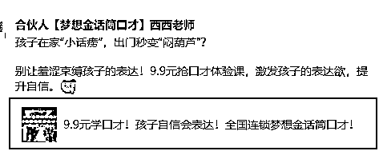

# (48 赞)本地公众号能够持续变现的 8 个方法以及 7 个提升赚钱的小技巧，不玩虚的玄学

> 原文：[`www.yuque.com/for_lazy/zhoubao/wprllwgck4ldbnyg`](https://www.yuque.com/for_lazy/zhoubao/wprllwgck4ldbnyg)

## (48 赞)本地公众号能够持续变现的 8 个方法以及 7 个提升赚钱的小技巧，不玩虚的玄学

作者： 东山老师

日期：2025-08-11

因为今天偶尔一个念头，拉了一个 10 来个人的【公众号搭子】，从很多大咖的身上也挖掘到了各种提升公众号流量的一些方法和窍门，甚至有一些我觉得可能是玄学的方法。

我在搞流量方面其实真的很不擅长，但我知道怎么依靠仅有的流量去变现，这是我很擅长的点，以为你我至今支持了上百个客户去做公众号变现了。

也没有啥邪门歪道，全是能落地的实在方法。今天就把最容易上手的方法掰开揉碎了讲，保证你听完就知道该咋做。

**首先：你需要精心打磨一篇公众号销售信，卖一个看到了不报名就是傻瓜的前端引流品。**

先举个例子：

红色框的公众号文章，就是我强制要求这个合伙人去做的，这是她前年 4 月份写的一篇文章，卖的是一个少儿口才体验课，9.9 元上门体验 1 次，然后到今年，她靠这篇文章起码赚了 50 万元以上。

当然，前段时间我又开了一个训练营，教他们写销售信，用销售信的方式去写，转化率更高.....

你可能不信，说：东山老师吹牛逼，一篇文章咋能这么值钱？我不信！

其实这里面藏着门道，听我慢慢说。

一篇文章怎么能够赚几十万呢？

因为她依靠这篇文章，前后起码招了 200 多个体验生，转化超过 100 来个正价班学员。他们的年费就是 5000 多元，而且后面还有 1.88 万一年的高价产品，也是我支持她打磨出来的。

你打开手机的计算器，算算这账就明白了。

关键是这篇文章阅读量才 7000 多，不算啥爆款，但就是能持续赚钱。所以说，别总想着一篇文章爆火，把一篇好文章的价值榨干，照样能赚大钱。

怎么做？我给大家总结了几个思路，都是经过客户验证的，保证好用。

**第 1 个方法：****简单粗暴但特有效：每天固定时间把这篇文章往朋友圈发 1-2 次，雷打不动，天天发。**

我那个开口才培训班的合伙人就是这么干的。

她每天早上 7 点半发一次，正好是家长送孩子上学刷手机的时候；晚上 8 点再发一次，家长们忙完家务刚坐下。

她说每天都有人从朋友圈看到这篇文章，然后报名，最多的时候一天能报 5-10 个。

你可能觉得天天发朋友圈会被人烦，其实不然。真正有需求的人，看到有价值的东西，不但不反感，还会觉得你靠谱，能持续提供有用的信息。

就像你小区门口那个卖包子的，天天早上出摊，你想吃的时候就知道去哪儿买。这篇文章就像那个包子摊，天天出现在朋友圈，有需求的人自然会找过来。

但这里有个前提，这篇文章得下功夫写。

至少花一个星期以上的时间打磨，把产品的好处说透，把客户的顾虑打消，让人看了就想报名。

要是文章写得稀巴烂，天天发也没人理。

现在，基本上我大部分的客户都有模有样的去抄这篇文章，然后依样画葫芦的去天天发了，效果好得很！

所以，如果我们没办法做到单篇文章有爆发性的流量，那我们就可以放长线钓大鱼，每天发，持续发.....用时间来换流量和钱。

**第 2 个方法是****：用 300 篇文章，为这一篇文章去导流，然后变现；**

这是我教的另外一个做美术客户去做的，效果比这个口才客户做的还要好。

她也是依样画葫芦，把这一篇文章用心打磨好后，然后每天除了发朋友圈外，还做了一件事。

每天都日更一篇文章，有时候写写孩子和家长的优秀案例，有时候写写孩子学习前后对比，有时候写点孩子的有趣的小故事.....

但不管写啥，每篇文章的开头和结尾都带着那篇变现文章的超链接，比如 “想知道孩子是怎么变的越来越专注的？？点这里看看就明白”。

你想想，一天写一篇，三百篇就是三百个入口。

哪怕每篇文章只有几十个流量，加起来也不少了。她那 300 篇文章，累计给变现文章导了 2 万多流量，最后成交了 300 多个体验课学员，你算算这赚了多少。

而且这些新文章内容有意思，容易让人看进去，看的时候顺嘴就点进了变现文章，转化率自然就高了。

最绝的一点是：她经常写一些孩子的故事和前后对比的文章，这样发出去了，家长就会忍不住的转发给自己的朋友圈和一些小群，为了更装逼的炫耀嘛！然后这篇文章就能更进一步的促进了转发和获得新流量。

打给比方就明白了：这就好比你开了家店，不光在店门口挂个招牌，还在周边三百个路口都放了指路牌，路人看到指路牌就知道往你店里走，生意能不好吗？

**第 3 个方法：****用 500 个人去为这一篇文章导流，然后变现**

这也是我支持我的一个做练字和美术的客户去做的，她们那一带少儿艺术培训机构特别的多，特别卷，所以，她就经常要出去地推；
她没认识我之前，去地推的时候总碰壁。很多老师都是直白白的，阿门地推的时候直接就问家长说 “9.9
元一次课练字课，报不报？”，她们这样问家长，被拒绝得特别多，搞得人特别累。

老师被拒绝的多了，就常常离职，其实她自己也很内耗，但又没办法，你可以想象得到那种苦闷。

她加入我的合伙人后，我让她换了个方式：

地推的时候，不带课程宣传单，带些小孩子喜欢的卡通贴纸、手抄报模板，或者家长需要的《儿童练字姓名贴》打印版等。

然后跟家长说 “把这篇文章转发到本地宝妈群或者朋友圈，就能免费领一份”。

以前家长看到老师拿着海报就躲着跑，现在家长们一看，转发个文章就能领东西，不费劲，而且这些东西也确实有用，于是大多愿意帮忙。

慢慢的，这篇文章的转发量就上来了。

她每天下午就带了 3 个老师出去地推，平均一个老师能让家长转发 2-3 次，一天就是 6-9 次，一个月下来就有 200 多次转发。

这些转发带来了不少本地客户，一年下来，这篇文章也招了 300 多个学员，好歹也转化了 120 个正价学员，一年学费 4800 元，这收入可比直接地推强多了。

其实这种思路特别简单，就是做新生家长的转介绍嘛。

**第 4 个方法：****除了以上的低价引流品的文章外，其实我们还可以持续打磨一些带有精准钩子和特定目标的文章，进行多次的裂变转发。**

举例如：

**1）写 10-20 篇带有明显钩子的文章，转发就可以参与活动。**

举个例子，有个做幼小衔接的客户，写了篇《2024 年 XX 市幼小衔接政策解读，附 50
套名校入学测试题》的深度文章，里面详细讲了幼小衔接要注意啥，有哪些实用的方法，最后放个钩子
“想要全套测试题，转发这篇文章到本地宝妈群或者朋友圈，凭截图就能进群领取”。​

真正需要资料的家长，肯定愿意转发。

她这个群最后进了 500 多个人，都是精准的学前儿童家长。然后她在群里每天分享点育儿知识，时不时提一下自己的幼小衔接班，最后招了 180
多个学员，这就是裂变的力量。

而且他们转发的时候，又能带来新的人进群，源源不断，根本不愁没流量。​

不过要注意，裂变一开始得撬动私域。先让自己的朋友、老客户帮忙转发，把第一波流量做起来，后面才能滚雪球似的越做越大。

所以，可以想办法先让机构的老生家长都转发一遍，让老师好好沟通，100 个家长有 40 个帮忙转发都不得了了。

**2）写一些带有很好人设的文章，用同样的方法去宣传**

故事型的文章特别容易裂变，前提是一开始就要先撬动私域进行裂变； **第 5 个方法：****利用公众号的菜单栏和自动回复导流。​**

把那篇变现文章放在公众号菜单栏最显眼的位置，比如 “免费领取” 或者 “孩子练字”。用户点进公众号，一眼就能看到，想了解的话直接就能点进去。​

自动回复也别浪费，用户关注公众号后，自动回复里就带上这篇文章的链接，顺便说一句
“新来的朋友，点击这里了解如何让 4-8 岁的孩子变 XXX，错过孩子就很难改啦”。​

很多人忽略了菜单栏和自动回复，其实这两个地方是天然的导流入口。

就像你去饭店吃饭，菜单上第一个菜往往是招牌菜，大家很容易点。菜单栏和自动回复就像那个招牌菜，把变现文章放在这儿，能抓住不少流量。

**第六个方法：****在相关的社群里 “软植入” 这篇文章。​**

我基本上会让我所有的客户都要想尽一切办法加入一些和自己精准家长相关的社群：

例如幼小衔接群，户外亲子徒步群等等，别一进去就发广告，先在群里混个脸熟，跟大家聊聊天，分享些有用的信息。等大家觉得你靠谱了，再偶尔 “软植入”
一下那篇文章。​

比如在宝妈群里，就可以用小号问 “暑假了，我想给孩子报哪个兴趣班好啊”，你就可以说
“我之前写了篇文章，分析了几种兴趣班的优缺点，还有很多家长的真实反馈，或许能帮到你，我发你看看”。这样发文章，大家不反感，还觉得你是在帮他。​

我有个做约读书房儿童阅读的客户，加了 200
多个本地宝妈群。他每天在群里分享些绘本阅读的小技巧，分享一些几岁孩子应该看什么样的书？二年级孩子的书单等等。有人问绘本推荐，他就顺势发自己的文章。就靠这招，每个月能多招一二十个体验生，累积下来也不错。

但要注意，不能在一个群里发得太勤，不然会被踢。可以多加入几个群，轮流着发，效果也不错。

**第七个方法：****和其他公众号互推导流。​**

这套方法其实在公众号最初就很多人做，其实现在做也不会很差，互推可以用社群进行互推，用朋友圈进行互推，用公众号进行互推。

多在本地找一些和自己公众号定位相似、粉丝量差不多的号主，互相推荐对方的文章。比如你帮他推一篇他的优质文章，他帮你推一篇你的变现文章。​

这样既能给对方带来流量，也能给自己的文章找新入口，是个双赢的事儿。就像两个小店老板互相帮着吆喝，你店里的客人可能去他店里买东西，他店里的客人也可能来你店里逛逛。​

找互推对象的时候，别只看粉丝数量，要看粉丝质量。粉丝画像越像，导流效果越好。要是你卖的是儿童美术课，找一个专门推老年保健品的号互推，那就没啥用了。

**第八个方法****：给文章做些小改动，换个标题再发。** ​

有时候不是文章不好，是标题没吸引力。可以多琢磨几个标题，换着花样发。

比如原来的标题是 “9.9 元体验课，错过等一年”，可以改成 “别再给孩子报贵的课了，9.9 元的体验课效果一样好”，或者 “我家孩子上完这个 9.9
元的课，变化太大了”。​

我那个开书法班的合伙人，就试过换标题。原来的标题是 “少儿书法体验课，9.9 元抢”，效果一般。后来改成 “6 岁孩子学书法 3
节课，就能写自己名字，你信吗？”，报名的人一下子多了不少。​

不同的标题吸引不同的人，多试试总能找到效果最好的那个。就像卖西瓜，有时候喊 “甜掉牙的西瓜，不甜不要钱”，有时候喊
“刚摘的新鲜西瓜，便宜卖了”，总能吸引到不同的买主。

所以，如果你的一篇文章转化率其实还可以，那就想尽一切办法，天天换标题和第一段，甚至内容稍微调整一下就发，也是可以的。

最后，有很多人都会很感兴趣，如何提高公众号文章的转化率？​

毕竟，说了这么多变现方法，关键还是得提高文章的转化率，不然流量再多也白搭。

我前些时间做过一些关于提高文章转化率的训练营，在这里分享几个提高转化率的小技巧：​

首先一定要记得严格按照销售信的 5 步方程式去写，就是典型的 AITDA 模型。

AITDA 模型是一种营销领域的五步消费者行为引导模型，包括吸引注意力（Attention）、激发兴趣（Interest）、建立信任（Trust）、刺激欲望（Desire）和促成行动（Action）五个阶段，主要用于提升用户转化率。

你可以把这 5 个步骤拆开来，然后一步一步的往里面填内容就可以了。

这里有几个小技巧，

**1：标题要抓眼球，** 标题是文章的门面，得让人一眼就想看。

7 月份的杭州航海家大会上，程奕人也说了，要花 2 个小时打磨一个标题。花 20 分钟想内容就可以了。可见标题是多么多么的重要呀。

**2：开头要戳痛点：** 文章开头别啰嗦，直接点出用户的痛点。

比如卖美术课程，开头就说
“你是不是试过很多方法，孩子还是坐不了 5 分钟就到处走动？作业写不完，累的你只想打人.....其实，真的不是孩子天生就好动，而你的方法错了”。这样能一下子抓住用户的注意力，让他想继续看下去。​

**3：多讲故事，少讲道理：** 人们都喜欢听故事，不喜欢听大道理。

多讲些孩子的成功案例、自己的亲身经历，比干巴巴地说课程好强多了。比如卖课程，别说 “我们的课程很好”，而是说
“有个二年级的孩子学员跟我们练了 3 个月的字，就从鸡爪化一样的变成了班主任传阅的范文。​

**4：价值要讲透：** 得让家长明白，买了你的体验课能得到啥好处。

不光说表面看得见的好处，还要说深层看不见的好处。比如卖少儿英语课，表面好处是 “学会英语考高分”，深层好处是
“孩子能够阅读英文原著，能向世界接轨.....”。​

**5：信任要做足：** 家长只有信任你，才会买你的东西。

内容可以放些资质证书、客户评价、对比图、视频等，增加信任感。比如美术课，放些孩子前后的对比照，家长的表扬视频，孩子获奖的照片等，说服力就强多了。​

**6：行动指令要明确：** 文章末尾一定要告诉家长该干啥，别让他猜。

比如 “点击下面的链接报名”“扫描二维码加微信咨询”“现在报名，前 10 名送 XX 赠品”。指令越明确，家长越容易行动。​尤其是低价产品，简直可以无脑下单的。

**7：限时优惠促单：** 人都有损失厌恶心理，怕错过优惠。可以搞些限时、限量的活动，比如 “今天报名立减 100 元，明天就恢复原价了”“仅限前 20
名报名的学员，送价值 99 元的 XX 礼品包”。这样能促使用户尽快下单，避免犹豫。

​

好了，总结一下：

今天我说了这么多公众号变现的方法和案例，其实核心就一个：如果我们实在没办法一口气写一篇 10 万+阅读量的文章，那我们不妨踏踏实实地把一篇变现文章的价值发挥到极致，让这篇文章赚 10 万+大洋。

​

因为，我越爱越觉得：爆文这东西太看运气了，不确定性太大。可能你写了一百篇，也出不了一篇爆文，白白浪费了时间和精力​，但是如果我们能够很用心的打磨一篇变现很高的文章，然后放长线钓鱼，这是确定能够赚到钱的。

这就是我一直以来的变现方法论，所以，我并没有那么的为流量而焦虑。

别觉得这个是讲教培的没有用？

其实换为你的行当也一样可行，例如换为我想要做的一人公司就 OK 呀！

* * *

评论区：

篮子🍀 : 好详细[强]

晓崎 : 很有价值[强]

周小蜗、 : [强][强][强]学习了