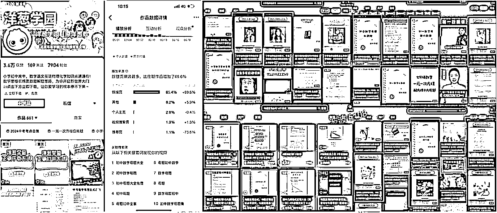

# (精华帖)(48 赞)不投信息流广告，如何让一个工具类 App 日下载破 2 万？

> 原文：[`www.yuque.com/for_lazy/zhoubao/bxnlfpx8gvfgyr15`](https://www.yuque.com/for_lazy/zhoubao/bxnlfpx8gvfgyr15)

## (精华帖)(48 赞)不投信息流广告，如何让一个工具类 App 日下载破 2 万？

作者： 波波@抖查查@爱盈利

日期：2025-08-09

最近自家做了很多 AI 的小工具 App，在推广的过程中，本身我们擅长 ASO，是一条增长的腿。另外近期一直在研究抖音、小红书等平台的流量，也很关注平台的引流。且通过 DSO（抖音搜索优化）拿到了不错的结果。近期看到美图旗下的产品在小红书推广的不错（我们也做了不少关于图片的，所以一下就关注到了），所以叫我的技术合伙人整理了下它的运营思路和数据，这里分析给大家。^_

在流量越来越贵、广告投放成本日益高涨的今天，一款新上线的工具类应用：RoboNeo，**在没有大规模买量的情况下，迅速冲上应用榜单，日均下载突破 2
万。** 这一现象级冷启动背后，它究竟做对了什么？本文将深度解析 RoboNeo 如何通过精准卡位“头像”“emoji 小人”等高热关键词，构建小红书与抖音的
KOC 内容矩阵，完成从热词占位到用户转化的自然流破圈闭环，为工具类产品的增长提供一条新路径。

# **Part.1**

# **RoboNeo 产品介绍**

# 

**开发者** ：Xiamen Meitu Technology Co., Ltd.（美图公司）

美图公司是一家总部位于中国厦门的科技企业，成立于 2008 年，长期专注于图像处理、视觉创意和美业数字化服务，其产品如美图秀秀、美颜相机和 BeautyPlus 在全球拥有广泛用户基础，并通过 AI 技术驱动创新，在影像、美业和设计工具等领域持续拓展业务边界。

**定位** ：一款面向视觉与创意设计的 AI 智能助手，支持自然语言交互，帮助用户进行图像与视频创作处理

**最早发布日期：** 2025 年 6 月 25 日

**最新更新日期** ：2025 年 8 月 1 日（iOS 版本 1.6.1）

2025 年 8 月 7 日，应用总榜 209 名，图形与设计分类榜第 3 名，图形与设计分类畅销榜第 25 名。

RoboNeo 近期的平均日下载量 2w 左右

# **Part.2**

# **RoboNeo 的流量获取分析**

## **

**

## **1****.** **买量为零，少量 ASA+ASO**

根据 AppGrowing 和点点数据的监测，RoboNeo 在冷启动期并未进行大规模广告采买，ASA
投放数量也极少，仅对品牌词做了基本防守，ASO 方面关键词覆盖较窄、优化程度不高。这意味着，其主要流量来源完全依赖自然渠道获取，**核心策略并不在“买”，而在于“种草”。**

**  **

根据 AppGrowing 数据，RoboNeo 最近半年只少量投放过一条广告素材，并没有大量采买广告流量。

根据点点数据，RoboNeo 只进行了少量的 ASA 投放，投放策略以“防守自己品牌词”为主。

ASO 方面也没有做更多的优化，只覆盖了少量的词。

## **2****.** **KOC 矩阵+热词霸屏**

真正支撑其高达每日 2 万次下载量的是其在内容平台上精心构建的 KOC
内容矩阵。在小红书平台，RoboNeo 围绕“头像”与“emoji 小人”等高热关键词进行内容渗透。

“头像”一词是小红书当前月搜索量最高的关键词之一，月均搜索超 4324 万，相关下拉词和关联词的月度覆盖人次超过 2
亿，带来巨大自然流量入口。而“emoji 小人”则作为垂直细分热门词，拥有稳定的中高频搜索量，通过投放矩阵账号持续输出风格多样、内容聚焦的图文笔记，RoboNeo 在该类关键词下形成了“霸屏”效果，有效引导用户主动搜索与转化。

在小红书搜索“RoboNeo”，发现有大量的 KOC 在发布 RoboNeo 相关的营销内容。

营销内容以各类风格的卡通头像为主。“RoboNeo”为何选择“头像”主题作为核心营销点？

工具入口：[AIDSO 爱搜小程序](https://mp.weixin.qq.com/s/jValWfdiFg4yPcdLJrP8Lg)

PC 版本：[www.aidso.com](http://www.aidso.com)

通过据查询，“头像”这个关键词是小红书平台月均搜索量排名第一的关键词，月均搜索量为 4324.93w，最近 7 日搜索人次平均每天有 145.34w 人次在搜索。

下拉词、相关词等关键词月覆盖人次每月超过 2 亿，流量巨大。

通过[AIDSO 爱搜平台](https://www.aidso.com/)数据查询，“emoji 小人”等关键词有着超过 50w 的月搜索流量，平均每天有 2.65w 人次搜索。

在小红书搜索“emoji 小人”，将近 70%的作品都是 KOC 矩阵号发布 RoboNeo 营销内容，实现了“emoji 小人”关键词的霸屏。

在抖音平台，RoboNeo 同样沿用“关键词+矩阵”的打法，聚焦“头像”“emoji 小人”等高频词，通过短视频内容种草触达目标人群。抖音上“头像”关键词月覆盖人次高达
1.31 亿，“emoji 小人”关键词搜索排名前列的内容中，RoboNeo 的营销内容排名第二，仅次于字节系的即梦系列。在该关键词 Top100
的内容中，美图与字节几乎平分江山，显示出其内容矩阵在激烈竞争下依旧具备强大渗透力。

RoboNeo 通过锁定大平台热搜词、布局 KOC 矩阵账号、围绕视觉创意强相关主题持续输出内容，实现了以“热词占位 + 高频露出 +
社交种草”为核心的自然流量获取模型，不依赖广告买量，即达成冷启动破圈效果，为工具类 App 提供了可复制的自然增长范式。

在抖音搜索“RoboNeo”，同样发现有大量的 KOC 在发布 RoboNeo 相关的营销内容。

通过[AIDSO 爱搜平台](https://www.aidso.com/)数据查询，“头像”这个关键词是抖音平台月覆盖人次为 1.31 亿，最近 7 日搜索人次平均每天有 29.51w 人次在搜索。同样流量巨大。

与小红书平台一样，RoboNeo 主打“emoji 小人”这个词

通过[AIDSO 爱搜平台数据](https://www.aidso.com/)查询，“emoji 小人”这个关键词是抖音平台月覆盖人次为 74.56w，最近 7 日搜索人次平均每天有 1.43w 人次在搜索。

在抖音搜索“emoji 小人”，排名第一的是即梦的营销内容，排名第二的就是 RoboNeo 的营销内容。“emoji 小人”关键词排名前 100 的营销内容中，字节系和美图系的营销内容基本上各占一半。

# **Part.3**

# **总结分析**

RoboNeo 的自然流推广模式，归结为三点：

**精准选词：** 选择“emoji 小人”等**高频搜索词** ，卡位用户主动搜索意图

**矩阵内容：** 布局大量 KOC 账号，统一话术与风格，强化关键词下的**内容占位率**

**平台裂变：** 借助小红书和抖音的社交算法与搜索机制，实现**种草—转化—裂变** 闭环

这一打法兼具低成本与高转化优势，特别适合视觉类、轻量型、创意向的工具型 App 进行冷启动。

在增长成本高企、买量难打 ROI 的环境下，RoboNeo
用一套轻量、可复制的自然流打法，成功实现冷启动破圈。它并没有去抢买量红海，而是另辟蹊径，在搜索热词中占位，在内容平台中爆破，最终构建起“**用户主动搜 +
内容精准推”的增长闭环。** 对于其他 AI 工具类应用而言，这无疑是一个值得借鉴和复用的冷启动范本。

**Part.4**

# **一些 DSO 引流 App 的案例**

**  **

**装修 App 搜索引流**

# 

**  **

**小游戏霸榜**

**  **

**教育类 App 搜索词霸榜  **

**  **

**象棋小游戏海量长尾搜索词霸榜**

**  **

**  **

* * *

评论区：

希声 : 先赞后看