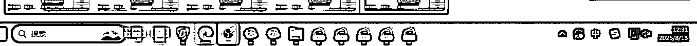

# (85 赞)海外赚 CPM 收益玩法

> 原文：[`www.yuque.com/for_lazy/zhoubao/ruci0wzfz8h0x7g5`](https://www.yuque.com/for_lazy/zhoubao/ruci0wzfz8h0x7g5)

## (85 赞)海外赚 CPM 收益玩法

作者： 幻中说焕

日期：2025-08-13

今天分享的是海外赚 CPM 收益玩法，原理很简单，跟国内联盟玩法类似

很感谢 youyube 深海圈，从三月份就一直在氛围里面熏陶成长变化，也经常麻烦一些教练和圈友的帮忙，获得了很多的收货

一.准备梯子，准备比特浏览器，准备谷歌邮箱等

二.操作流程（包含安装操作流程注册和下载以及上传和取短链）

1.登录[`earnvids.com/`](https://earnvids.com) 先注册

2.用江湖工具箱下载（免费工具，对新人比较友好）

遇到要抄袭的账号他发了图片，或也是搬运其他人的素材，果断就不要这些垃圾素材了

3.开始上传视频取短链

长链换二维码

[`cli.im/`](https://cli.im/)

长链换短链

[`www.urlc.cn/`](https://www.urlc.cn/)

三.流量来源

1.吃自己的流量，我每台电脑都是五开直播，短链直接在直播间，但对梯子网速和电脑配置有点高

2.吃别人的流量

找到这些爆款视频的账号，只要刚发布了新视频就评论，用软件监控（实在不会弄，加关注，当别人发布新视频时候你就有提醒），然后在别人的评论区放短链
，重点：评论区链接在长视频底下转化率会高很多 不要放 shorts

评论词可以设为：

More exciting videos + 短链

Watch paid content for free+短链等

如果遇到经常被作者删链接，那么直接在直接的主页挂短链，依旧是评论内容，让别人进入到你的账号后然后点击你的短链

一些新账号如果爆了 1000W 的播放，你在别人评论区挂了短链，直跳跳转按 1%计算，就是 10Wcpm，按 7.2 汇率折合 RMB 目前是 2000 元左右，间接跳转 1%X0.5=0.5%，按 7.2 汇率折合 RMB 目前是 1000 元左右

四、流量平台

目前可以挂的有 youtube、ins、tik、X 等等

全部都可以用短链挂载，每个账号每天最多不要发布超过 300 条，不然会被限制 24 小时评论

账号可以直接买 google 邮箱，批量注册，批量养号，批量评论引流

只要一个平台跑通了，基本上其他的就会了

五、自我思考

1.这个玩法不属于新项目，跟海外网盟 CPS 一样，出来了很多年了，只不过网盟 CPS 是通过买实物或虚拟货来赚钱，而 CPM 通过在 web、小程序、APP、中通过看广告，看视频来赚钱，类似平时玩小游戏时弹窗出来的小广告一样，理解了原理本质就很简单清晰了

2.earnvids 目前佣金不是最高的，也有其他的平台可以找，一些工具有更合适的也可以找其他的，当然有实力可以自己找源头接

3.海外机会很多，不卷，没那么多破事，专注做产品做流量就很舒服了，以前做国内的时候业务稍微好一点的时候高峰期一天 30-40 个投诉，1-5 个工商投诉，很消耗精力来处理这些事，但做海外后，无论你怎么做都没啥太大事，只要不触碰到雷区，基本上是售后为 0，客诉为 0 正反馈很快

4.海外市场是一个开放试卷，没必要花钱找别人学什么，很多项目的路径，自己走一遍流程，不会的地方多问 AI 就 OK 了，要有乐于开源，开放的精神

5.在海外一定要做 youtube、ins、tik、X+web
公域流量有一定的限制，但在自己的 web 想做什么可以做什么，别人跟你没有任何关系，但自己做什么一定跟自己有关系

6.这件事的天花板很高

海外市场很大，不卷！一千个人心中有一千个哈姆雷特，希望内容能对圈友们有所启发

* * *

评论区：

WILL : 安排

带人炒票 : 有点简单了。大佬可以补充一些细节吗

二渣คิดถึง : ➕1

一鱼两吃 : 没太明白是怎么赚收益的，是搬运别人的视频传到这个平台上，再获取短链接引流赚广告吗。

珊瑚虫 : 可以再写一篇清晰点的吗哈哈