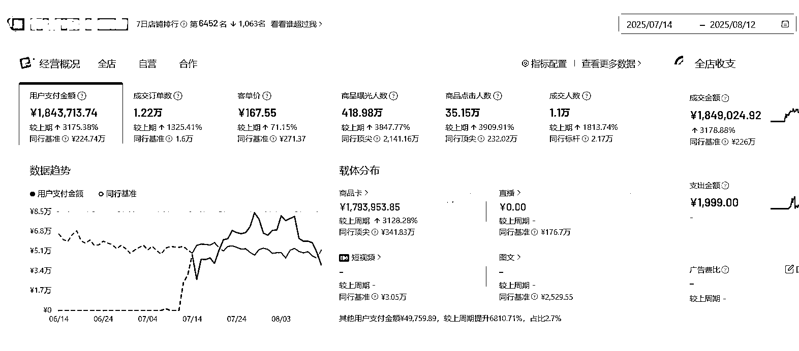
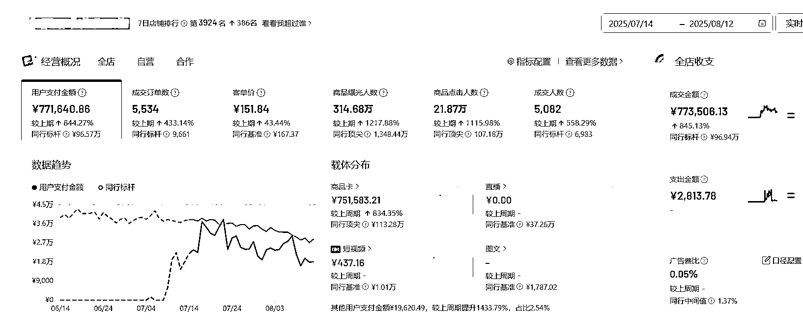
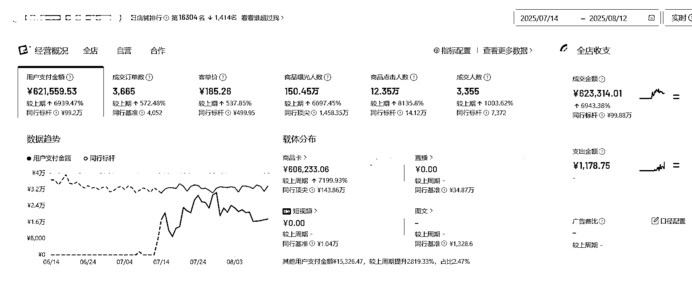

# (精华帖)(79 赞)从小白到老油条的蜕变，在抖音，我是如何从 3 个月亏掉了 50w 到开店一个月做到 184w 营业额的实战经验分享

> 原文：[`www.yuque.com/for_lazy/zhoubao/rumenwgh5h1fzigf`](https://www.yuque.com/for_lazy/zhoubao/rumenwgh5h1fzigf)

## (精华帖)(79 赞)从小白到老油条的蜕变，在抖音，我是如何从 3 个月亏掉了 50w 到开店一个月做到 184w 营业额的实战经验分享

作者： 子贤

日期：2025-08-14

大家好，我是子贤，广州人，刚加入生财 117 天

目前主要深耕抖音电商，主营的赛道有：家具，女装，百货

看到生财很少有讲抖音电商的文章，**决定自己写下这篇保姆级攻略**

这篇文章主要复盘一下自己，如何从电商小白，3 个月亏掉了 50w 的小白到开店第一个月做到 180w 营业额的心路历程，以及自己对当下抖音电商的一些思考，最后献上保姆级攻略

**废话不多说，下面是我近期店铺的数据**

1 号店铺：

2 号店铺：

3 号店铺：

如图可以看到七月份开始起的店，截止到 8.12，跑的最好的店铺**营业额跑到了 184w** ，其中**短视频直播广告成交占比都为 0，** 其他两个店铺也到了**60w 以上，** 操作流程，全部工作均由运营助理根据 sop 流程完成

引用亦仁大佬的一句话：**数据可以默认是假的，但是流程是通的**

**文章主要分为 6 个部分：**

1.  我是如何进入到抖音电商这个赛道，从小白到老油条的整个过程

2.  对于当下流量最大的平台：抖音的一些思考

3.  抖音商品卡项目分析

4.  保姆级开店流程，店铺基础搭建

5.  开店第一个月，我是如何做到 184w 营业额的

6.  项目总结

全文共 4.2k 字，详情请移步下方飞书链接：

[`mq5iejby4xc.feishu.cn/wiki/ZIR6wEHmui1KTDk28V7c7BU7nSb?from=from_copylink`](https://mq5iejby4xc.feishu.cn/wiki/ZIR6wEHmui1KTDk28V7c7BU7nSb?from=from_copylink)

* * *

评论区：

百哥 : 成本没有投流费用吗

子贤 : 这个店铺是 0 投流的

百哥 : 那太香了

智沁💧 : 求是什么上架软件可以一下上这么多[流泪]

H.Y.C : 是走中转仓吗？

子贤 : 智能店长 一刻工具箱等

子贤 : 现在不走中转仓了，中转仓的成本太高了，以及超时赔付太多

大雷 : 去其他平台采集下单 单号怎么填上去的呢