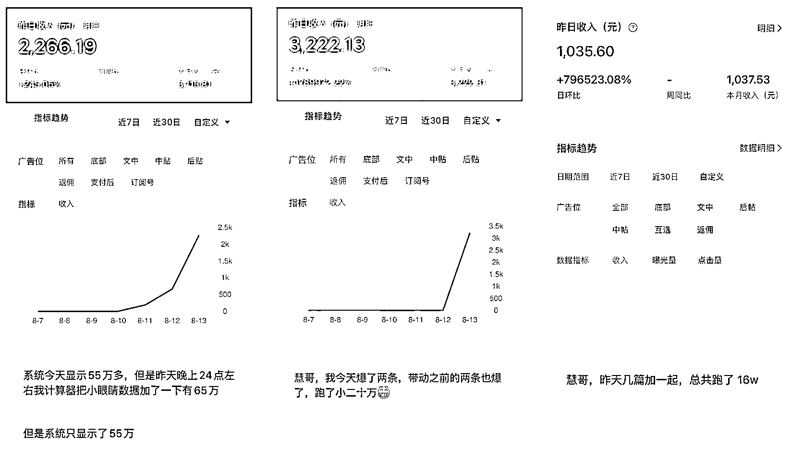
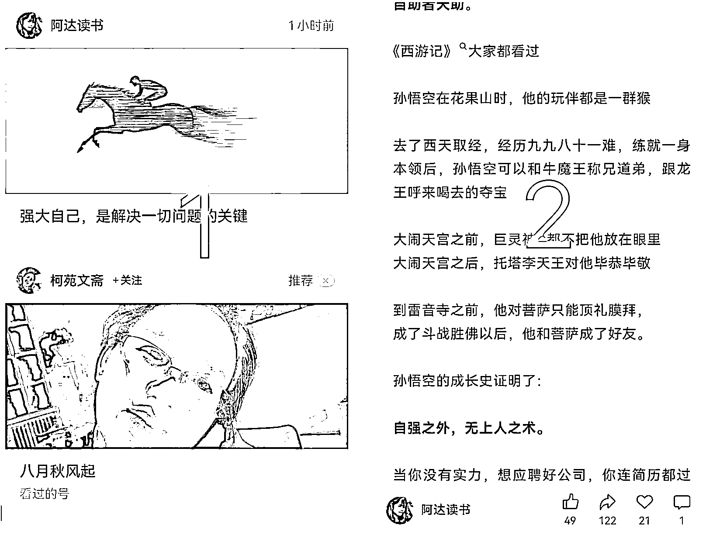
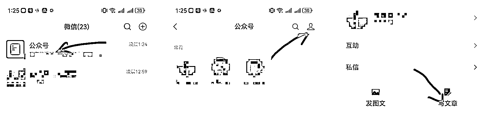

# (精华帖)(262 赞)做了 100 个垂直小号得到的经验：踩在风口，一周内新人也能 10w+,日入 1000

> 原文：[`www.yuque.com/for_lazy/zhoubao/gg7p9ggpz6my00c2`](https://www.yuque.com/for_lazy/zhoubao/gg7p9ggpz6my00c2)

## (精华帖)(262 赞)做了 100 个垂直小号得到的经验：踩在风口，一周内新人也能 10w+,日入 1000

作者： 张集慧

日期：2025-08-15

上个月，亦仁发布了超级标“垂直小号”，正好我这段时间呢，在做公众号相关的内容，前段时间还分享过一篇有关公众号的文章，[借助 AI，ecpm100+单价的公众号实操指南](https://scys.com/articleDetail/xq_topic/8852241188284412) ，感兴趣的可以看看。

今天我要讲的内容，是“垂直小号”相关内容中的一环，普通人怎么吃到这波红利，很多人看到“垂直小号”是兴奋的，知道这是机会，但是自己能写什么垂直内容呢，掰着指头数了一遍，发现没什么特长，没什么可写的，机会在眼前，眼看着机会，自己抓不住也不行啊。

我也是这样的状态，不知道该写什么垂直的内容，于是我找了 100 个号，各种内容都开始测，测出来哪个算哪个，结果数据真的是有惊喜啊。

**为了验证的变量可控，这一批账号都是新号注册的，注册完，实名，完后刷粉，开流量主，发文章，都在一天内完成，下图是选了 14 号当天几个收益不错的号。**

为什么新号，就能在短时间内做到爆文，并且拿到不错的收益，今天下午我在传术师俱乐部群里聊到了这个话题，感觉大家对于公众号的推荐机制，写作方向等等，还是存在很多的误区，我把下午聊的内容，做一个梳理。

**1、推荐机制**

**  **

互联网平台每一次的变革，都会衍生出来新的机会，比如抖音的小黄车带货，比如知乎好物，比如昨天刚刚发布的的深海圈-
B 站好物带货，等等。这些机会，都是在变革中诞生的，变是好事，不要怕，一成不变，阶级固化才是最可怕的，回到公众号，如果不是公众号推荐机制的变化，我是绝对不会碰公众号的，因为我一个新号，在哪个领域都会遇到几十万粉，几百万粉的大号，我完全没有机会。

那么，现在机会来了，公众号的推荐逻辑变了，以前，你要有阅读，必须先涨粉，但是我新人，我去哪涨粉啊，只能写了文章，自己转发，找朋友转发，求爷爷告奶奶低三下四的，好不容易有点粉丝，好生伺候着，指望着这批种子用户给你转发，让你的内容火起来，这都是算是成功人士，99%的人，拉几十个粉，写一篇个位数阅读，再写一篇还是个位数阅读，就心死了。

在这个过程中，大家就有了一个概念，**要涨粉，要垂直**

**  **

**为什么要涨粉，涨粉才有阅读，才有转发，才有更多的阅读**

**为什么要垂直，垂直才能讨好这批粉丝，把他们伺候好了，他们才会给你转发，你才有阅读**

**  **

**从 23 年开始（具体时间我不是很清楚）这个模式开始有了变化。为什么他会变呢，因为字节系用他的成功证明了，内容推公域流量池，是比推粉丝更科学的模式，腾讯不得已也开始做转变。**

公众号放弃自己做了多年的粉丝模式，从只推粉丝的类私域模式，开始转变为给到内容公域流量的模式，就是你的文章出来，我直接给你扔公域流量的池子里面，你哪怕 0 粉丝，你在公域池子里也能捞到阅读量。

完后，在赛马机制下，只要你的内容互动等等数据好，就会一次次获得流量，几千，几万，几十万一级级给到你。这也就是为什么很多大号写不过小号的原因，大号还是在讨好自己的那点粉丝，对于其他人，天然的内容不友好，小号呢，我管你那么多呢，我反正没粉丝，我内容想怎么写怎么写，直接进入公域，在几亿人的大池子里捞阅读量，可比你那几十万粉丝里面捞的阅读量多了去了。

另外一点，是关于垂直的，大家常规中认为的垂直，就是内容垂直，我写育儿就一直是育儿，内容不能换，我写体育就是体育，内容也不能换，为什么会有这样的问题呢，因为粉丝模式下，你的粉丝就是因为你垂直的内容关注你的，你的内容不垂直，他们自然就不会看了
，这种情况下，就要去账号，内容必须垂直，账号就是标签里面的最小颗粒度。

到了公域流量机制下，最小颗粒度的从账号变成了单篇的文章，这时候内容垂直，可以变到人物垂直，看育儿的宝妈，她也会看美食，也会看穿搭，这时候，你的账号内容，就不一定是非要在育儿上死磕，你可以多样化的尝试。

**2、吃到流量**

**  **

既然知道了流量机制变了，那么我们要做的就是怎么很好的利用这个机制，才能能吃到更多的流量。在粉丝模式的时代，大家最关心的是转发，因为只有转发，才能让你的内容出现在朋友圈，群里面，才能拿到裂变的流量，其他互动数据，只是个参考，没什么实际的作用，所以，内容中经常出现让大家关注，转发等等的提示，为的就是让用户帮你把转发这个节点，做上去，用户要是那么听话，那还转发什么啊，留个银行卡号，让他直接打钱不是更快么。

在推荐模式下，一篇文章好不好，不像上面
，是粉丝来判定，粉丝说好，就给你转发，不好，就不转，现在你扔到公域的流量池里面，到底该给你多少流量呢，是大家都给 30，还是都给 500 呢，如何区分好坏内容，好的内容让他 10w+，这时候就有了**赛马机制。**

**  **

系统无法判断内容好坏这种很主观的东西，他需要参数化的数据这种客观的东西才行，那这个参数怎么来呢，就是要屏幕前的你给提供，一篇内容扔到公域流量池，完后来观察用户看到这些内容的数据。

这些内容，会推送到公众号栏目中，我们第一眼看到的，是封面图+标题，在这一环节，考验的是图片+标题的吸引力，点击率高，你第一步就胜出了。所以现在内容特别要注意封面图+标题，宁可标题党一点，也不能在标题上随意。

点开你的正文后，可考核的数据就多了，文章的完播率，点赞，转发，再看，评论等等这些用户可以互动的数据，都会被系统记录，作为一个评判你文章好坏的客观数据组，这些数据做好了。你就在赛马机制中胜出了，你的文章离爆就只有一步之遥。

针对这些数据，文章能短就没必要长，完播率你长文失败的概率更大，能花小技巧跳动大家吵吵，就不要用平和的语气，谁也不得罪，你宁可写的有点争议，让评论区吵起来更好。

** *啰嗦了这么一大段，核心其实就一点，推荐机制变了，别拿着以前学到的那些所谓的技巧，在现在推荐模式下努力了，越努力，里成功越远。现在，让自己做一个小白，从零开始，感受公众号全新的推荐逻辑，和全新的内容创作方向。***

**3、发布入口**

推荐机制的改变，只是公众号利好的一个点，微信为了让大家更好的写文章，为了更好的把新推荐机制的威力发挥到最大，直接在微信端打开了一个公众号的入口。这个入口，藏着巨大的流量，我经过测试，单篇文章封顶有 5w+阅读，当然，不是说你随便写什么都有，内容还是要在赛马机制中胜出才行。

这波流量，有点类似新人大礼包，你从他这个新功能入口写，就送你流量，比起公众号助手，网页版微信，这里对新人来说，起步阶段就很友好，很容易就能拿到几千，几万甚至几十万的阅读量，让你直接赢在起跑线。

**重点强调一下，这个流量，只有在下面这个入口发布才有流量倾斜，不要为了方便，用公众号助手，或者网页版发布，无效。**

下图是找到微信端公众号入口的方法：

因为这个功能更新没几个月，有的用户微信可能是因为版本的问题，没有推送更新，遇到这种情况，上滑退出微信，多退几次，一般都可以找到入口，实在不行，就换个手机，换个微信，就可以找到。

以上就是我测试 100 个微信号，发现的流量方法，掌握了推荐逻辑，并且在微信端发布，你的成功率将会大大增加。希望一周后，有人来评论区报喜，等你们哦！

* * *

评论区：

脆啵啵 : 非常感谢慧哥的分享[强][强][强]

惠琳 Lindy : 100 个号的买号和买粉需要多少钱成本

菜头 : 哪里可以搞到 100 个号[呲牙]

晨曲 : 非常感谢分享，至宝[强]

小胖 : 入口找到了，感谢分享[强]

宁做我 : 你好 发布入口那里只显示一个公众号 有多个公众号的话怎么切换呢

金天 : 感谢，写得很详细啊

Dong. : 问+1[呲牙]