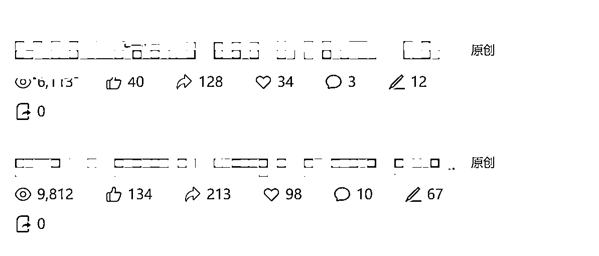
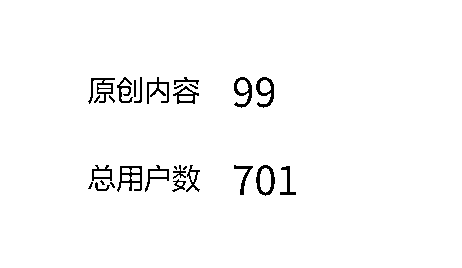
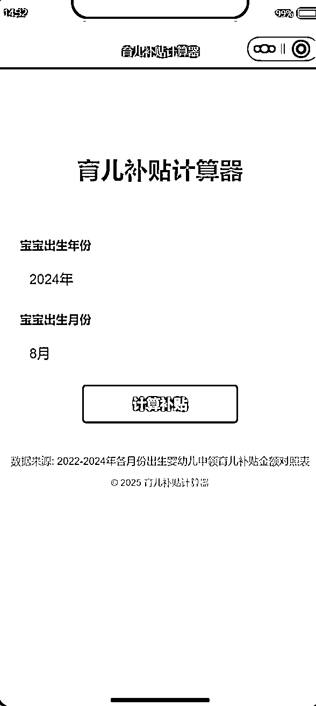

# (精华帖)(121 赞)垂直小号+小程序，只要抓住风口就能狠狠赚一波米

> 原文：[`www.yuque.com/for_lazy/zhoubao/daguo4ncsmhbdnl0`](https://www.yuque.com/for_lazy/zhoubao/daguo4ncsmhbdnl0)

## (精华帖)(121 赞)垂直小号+小程序，只要抓住风口就能狠狠赚一波米

作者： 盟主君

日期：2025-08-14

大家好，我是盟主君，一个靠 AI 赚钱养家的 90 后。

最近一年我一直在研究怎样用 AI 写短篇小说，目前几个账号也是稳定赚稿费中。

最近看社群里一直在推微信垂直小号的项目，正好我在 2 年前有幸赶上微信公众号流量红利，赚了一些米。

我决定拿出一个小号做了一个专注于怀孕妈妈的账号，每天分享怀孕期间注意的问题，应该需要补充什么？

刚开始的流量只有十位数，没有进入流量池，这些内容我也不好分享在朋友圈，再者我的朋友也没有这部分用户。

那我只能利用平台推荐功能了，7 月底发布了育儿补贴政策，我顺手写了几篇这方面的热门话题，没想到爆了！

你能想象这个号只有 700 个用户，大部分流量都来自推荐流量，也就是说微信正在大力扶持这种垂直类的账号。

接下来我又写了很多篇类似的文章，很多用户留言自己的孩子出生能领多少钱，去年的宝宝能不能领补贴，我顺势就做了一个小程序，专门计算育儿补贴的，上线以后流量也是让我很意外。

下面我跟大家汇报一下到底怎么抓住这波风口。

[`rcn71rsvb3w5.feishu.cn/wiki/F7QjwMLkMiKftAkbmOucthmHnpd?from=from_copylink`](https://rcn71rsvb3w5.feishu.cn/wiki/F7QjwMLkMiKftAkbmOucthmHnpd?from=from_copylink)

* * *

评论区：

金天 : 看完很有启发

加麻 : 感谢分享

哈哈哈 : 感谢分享，能链接您吗？想向您请教！

Jenny 快速输出 : 感谢分享

Jenny 快速输出 : 小程序怎么变现的？

sheng : 哪个小程序呢，我也做了一个，取名一直受限制，名字里面不能包含育儿补贴

Dong. : 我也做了个，有育儿就审核不过😂

盟主君 : 流量主