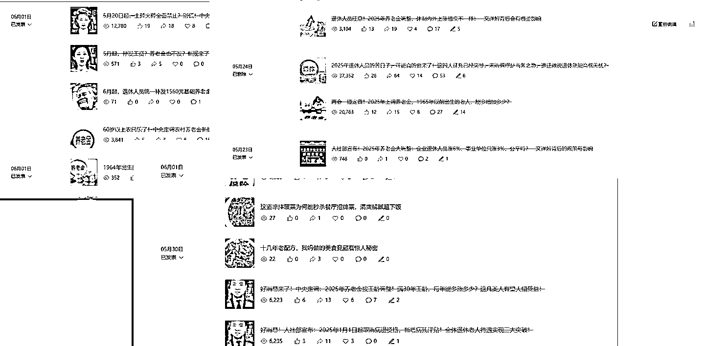
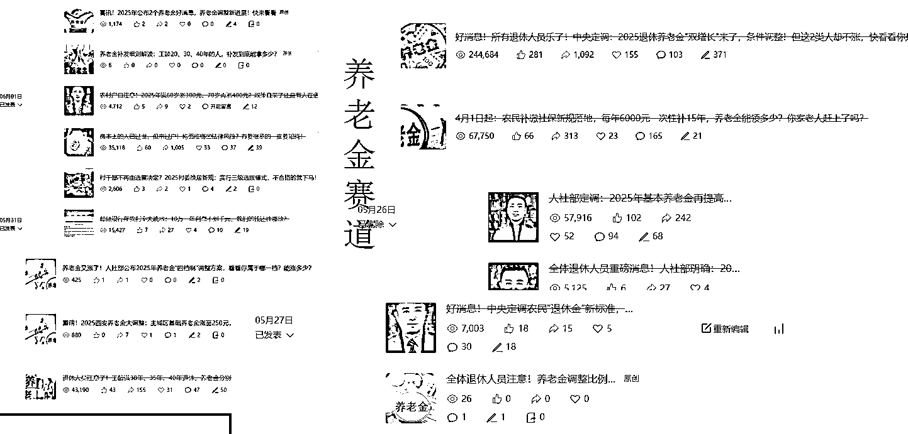

# (精华帖)(81 赞)公众号流量主民生赛道，小绿书起号转型，万阅读，十万加爆款很多，一次 6-8 条

> 原文：[`www.yuque.com/for_lazy/zhoubao/noya5w20wpma7ov5`](https://www.yuque.com/for_lazy/zhoubao/noya5w20wpma7ov5)

## (精华帖)(81 赞)公众号流量主民生赛道，小绿书起号转型，万阅读，十万加爆款很多，一次 6-8 条

作者： 辰风

日期：2025-08-12

大家好，我是辰风，今天跟大家分享一个非常“暴力”的流量主起号方法——**小绿书起号 + 转型爆款，适用于民生，养老，社会热点相关赛道。**

**  **

我自己是亲身实测过的，效果确实惊人，尤其是在流量主这条赛道，掌握这个方法，你真的能在很短时间内看到钱进账。

不过这种方法，比较适合成熟的，有提示词支持的矩阵大佬，个人号作战可能小有成效。**我主要分享的内容就是关于平台规则的认识，小绿书起号办法，以及具体实操经验中踩的坑和我的方法论。**

**  **

我们当时投入了几十个账号，变现没能达到预期，但是方法论的确落地可行，也有单条几千的收益数据，跑了几十万的爆款。

以下数据为 5 月份，6 月份左右的测试数据，最新的账号对标和这类型是否可以玩，请继续往下：

以下是正文内容：[`k874t2qh8w.feishu.cn/docx/UKEDdsTPZodQNnx17kpcEJcen7g`](https://k874t2qh8w.feishu.cn/docx/UKEDdsTPZodQNnx17kpcEJcen7g)

* * *

评论区：

金天 : 很有启发。

poppy 杨 : 最近也在这么玩，但是发小绿书有流量，发文章就没流量。

辰风 : 还是跟长文章定位有关

喜东东 : 你好辰老师，关于垂直小号的定位问题我一直拿不准，公众号注册完半个月出过一篇浏览量过 w 的，但是不能持续输出，想和你交流一下，方便找鱼丸链接一下你嘛～

辰风 : 当然可以，当然可以

芷蓝 : 这个好，关键是这类内容直接就可以从各种新闻网站或者公众号获取，其实就是用 ai 来改造新闻信息，而且每天都有持续性的内容来源，太有启发啦

辰风 : 谢谢芷蓝姐