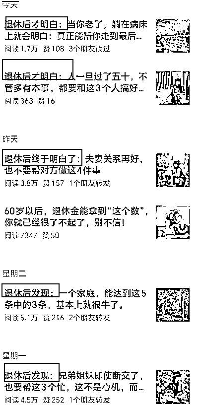

# (37 赞)垂类公众号的新思考：垂直于“人”！

> 原文：[`www.yuque.com/for_lazy/zhoubao/lxtfzs943ny0avdw`](https://www.yuque.com/for_lazy/zhoubao/lxtfzs943ny0avdw)

## (37 赞)垂类公众号的新思考：垂直于“人”！

作者： 一来

日期：2025-08-15

前一段时间亦仁老大，发布了公众号超级标的帖子，这让很多人开始入场公众号。

只要入场了能够持续下去，后期会慢慢的发现到公众号的巨大价值，无论是带给自己的思考还是变现层面。

# **一.先说一个现象，很多厉害的人都在写公众号。**

目前我们在市场上经常会听到抖音小红书或者是视频号，关于公众号这一块，很少有人会提到，也参加了很多线下的大会，公众号方面的分享更是非常少的。

但是一个有趣的现象，就是我观察到，比如说知识星球创始人吴鲁加老师，更新公众号的频率非常高。

山顶会的波波老师，群响的刘思毅更新的也是非常频繁，还有润宇老师，盗坤老师，还有生财很多老师也在更新着公众号。

很多人在那么忙的情况下，还在常年累月更新，有的甚至已经更新好几年了，有这个时间能够做很多的事情，但他们还在写着，一定是有着他们坚持的理由。

所以我们可以想一想这样的一个原因，虽然有不少人唱衰公众号，但实际上依然有人在用公众号做业务，做思考，到底是什么原因？

# **二.垂直小众类公众号，机会是非常多的。**

在做公众号的过程中，发现很多行业都是在利用垂类公众号来给自己引流，然后私域变现，而且公众号文章底部放二维码，引流非常丝滑。

举例来说：

# **1.减肥行业 （这一类账号非常多，都在引流私域）**

 images.zsxq.com/FooVITkzoA0V8yRFOPo8UEtZifSV) images.zsxq.com/Fuyc9sN6pZFHYlRLlJqZdoapEqc4)

 images.zsxq.com/FgJnAJcVLn24Ilyc11LxyHa7-wor) images.zsxq.com/FnbKHxZ-9qlVpTlFkimnsu4laj6D)

# **2.心理学行业（文末引流，嫁接私域）**

 images.zsxq.com/FrA82-U7GFCTXnN4W4BJWvuGMUyz) images.zsxq.com/FhDboVSW5YuEk0DRlY6YpN60DWFv)

# **3.情感行业：回避型人格**

 images.zsxq.com/Fk9o4fLqEkhbhCmX774xjwwcuBxG) images.zsxq.com/Fi-IAGE5yry18pRPJQVUu4Do6sRf)

# **4.垂直类关键词打法：**

【可以想一想，我们的业务能不能用关键词的方式来测试）

 images.zsxq.com/FoYukjqsQDYSF4gc7LqtTGIgV_0B) images.zsxq.com/FuwxZbtixbwKl_9vLcyYpjaOgMop)

 IHQx)

# **5.职业身份类垂直打法：（我们的业务是否可以从身份去写垂类文章）**

 images.zsxq.com/Fph8q3VPTgW3aIP36w6J2XufkoJE) images.zsxq.com/Fg28OAgFacjC8PKi8Z1RVE1YSCS_)

 images.zsxq.com/FqMnL1N_BS_RD81r4f7X9Ibs4saM) images.zsxq.com/FqtY3UyVmFO5ZoFe5bniBCnmkrv3)

# **三.如何才能够做一个长久的公众号？垂直于“人”，个人类公众号。**

这 4 年我一直在做公众号这个事情，然后也在运营自己的公众号个人 IP，有个深刻的感受。

**很多普通创作者最头疼的问题，就是账号没有办法持续获得流量。**

我们注册注销了几百个账号，测试下来，很难有账号能够一直持续获得系统推荐。

即使是非常垂直的账号，一不小心也会出现没有了推荐的情况。

虽然一个账号还能够获得二次推荐，但是时间是不确定的，创作的成本也会变大。

有一些能够持续获得推荐的账号，也基本上一直在追爆款的标题，最后即使粉丝很多流量很大，但是一旦账号没有了系统的推荐，粉丝阅读就非常少。

这样的账号到后期变现能力就非常差。

所以我就经常在想，什么样的账号能够持久的做下去？今年会写着，明年还在写着，甚至还会想 10 年后还在写着。

那么这样的账号，一定不是纯流量文，纯标题文，因为这种类型的写着写着自己也会厌倦。到哪一天自己的业务好一点的时候，或许这样的账号就不更新了。

**后来我看了很多的账号，那么也得出了一个很深刻的感受，就是这个账号，我注册下来以后，我始终围绕着“人”去写，垂直于“人”，垂直于自己，做一个个人 IP 类的公众号。**

那么这个公众号就能够持续下去了。因为这样的公众号，我可以去写自己的生活，自己的故事，自己的思考，自己的产品，自己的创业史和工作史。

因为人是鲜活的，写出来的文章的话，也会有个性的成分，那么看文章的人是愿意看下去的。

而且个人 IP 账号是有非常大的机会的。

尤其是能够卖客单价高的产品，因为解决了信任度的问题。

# 1.阅读习惯的影响。

很多人在抖音或者小红书上打造视频内的个人 IP，但基本上基于阅读习惯，大部分人是很懒的，即使喜欢一个 IP，也懒得每天去抖音或者是小红书专门搜这个人的视频看。

但是如果公众号一发布的话，在微信上就直接看到了，只要对方看到你的文字，那么就有更多的机会。

# 2.文字的魅力是潜移默化的。

你如果经常看一个人的文章，慢慢的就会吸收他的一些思想，或者通过文字知道对方大概是一个什么样的人。

这种影响是非常持久的，时间长了以后，对于这个人的认可也就越来越高。

# 3.市场上有抖音 IP，有小红书 IP，那么也能有公众号 IP。

公众号 IP，作为文字类的平台代表，依然能够为个人和企业赋能。

甚至影响力不亚于短视频和直播。

# **四.垂类赛道的个人 IP，个人的一些思考和感受。**

如果你有自己的业务，就可以利用公众号这个平台，来做自己的业务，来成长自己。

如果一个公众号的话一直写干货，或者是专业知识的分享，这种公众号往往让人难以看下去。

如果一个公众号的话写的是个人的琐碎之事，没有变现，对于很多普通人来说，也难以坚持下去。

所以利用公众号和将业务和生活结合，是最爽的了。

# 1.先对自己有帮助，再对别人有帮助。

咱们写这个公众号，要想能够很好的持续下去，那么最好的方式，就是花时间写完这一篇公众号，最大的收获是自己。相当于花时间给自己写了一篇复盘，自己在写的过程中就有了思考，这是给到自己一个最快的正反馈。

# 2.对于有私域的人，公众号可以先解决信任度的问题，再解决流量。

大部分账号最终都是没有了推荐流量，阅读变成了个位数或者两位数，这时候很多人就没有了动力，没有了阅读量，也就没有了流量。

但如果前期能够把公众号作为自己解决信任度的一个出发点，那么运营公众号起来就会好很多。

**比如说外部的客户进入到私域，这时候我们用朋友圈承接，用短视频承接，如果再能够用公众号的长文字承接，那么信任度能够更高，长文字能够有更多信息。**

今天很多客户买东西，喜欢冲这个人来买，如果他能够通过你的公众号文字看出你大概是一个什么样的人，那么就能够增加成交的概率。

所以我们如果有业务，可以这样来规划自己的公众号内容。

**1.关于自己的生活。**

就用大白话来描述，目的是让别人看完你的文章，大概知道你是一个什么样的人，关于你的一些小事。因为人都是对于别人隐私的事情比较关注。

**2.关于自己的业务和思考。**

可以在公众号上写一写自己在做的业务，以及在做业务中的一些思考，一些感受，以及和业务相关的事情。

这样的话能够让他人看完文章之后知道你是做什么的。有了信任，别人知道你是做什么的，有合适的就购买了。

**3.业务的一些广告或反馈。**

偶尔也可以打一打相对应的广告，或者是业务的一些反馈，增加变现。

按照这样的形式以人为核心，去规划账号内容的时候，那么写起来就不会厌倦，还能够有变现，就可以很好的持续下去。

写一年，写两年，当精准粉丝越来越多的时候，我们可以做的事情空间也越来越大。

# **五.垂类公众号延伸赛道，普通人的小生意，公众号流量主。**

对于很多没有自己完整业务的，还在上班的人来说，那么就锁定公众号的某一个垂直领域，就做流量的变现。

之前我们在做美食养生赛道的时候，真的就是两个普通的人，运气好，但愿做到了单号单月 8-10 万块钱的收益，虽然不是说每个人都能够做到，但毕竟还是有这样的机会。

而且公众号流量主的变现逻辑很简单，你有这个阅读量，平台就给广告费。

而且投入成本也很低，基本上 500 粉丝开通流量主之后就可以了。

门槛不高，多花时间研究，不一定能够作为主要收入，但也有可能一两个月挣到一年的钱，这大概就是这个项目的魅力。

当然了，接受它的优势，也要接受它的劣势，比较考验心态，有时候需要频繁的注销重来。

* * *

评论区：

辰风 : 向一来老师学习

金天 : 有启发

晨曲 : “垂直于人”实在是醍醐灌顶呀！ 谢谢🙏