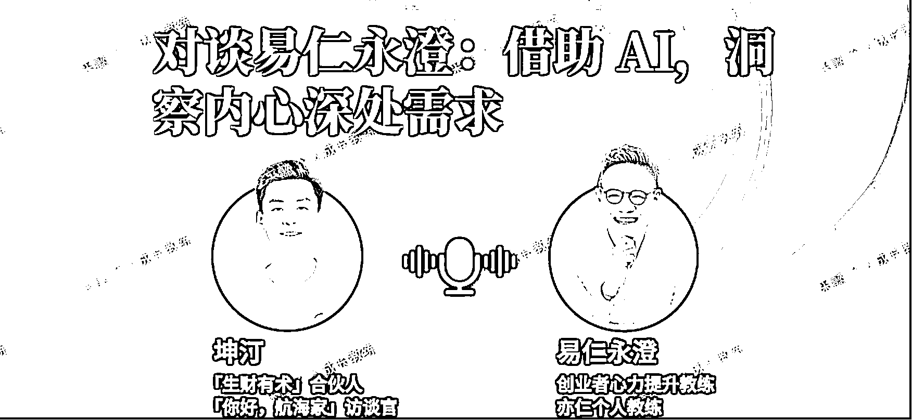

# (精华帖)(151 赞)借助 AI，洞察内心需求

> 原文：[`www.yuque.com/for_lazy/zhoubao/hw6ryd106d8z4c99`](https://www.yuque.com/for_lazy/zhoubao/hw6ryd106d8z4c99)

## (精华帖)(151 赞)借助 AI，洞察内心需求

作者： 易仁永澄

日期：2025-07-31

## **

**

各位生财的圈友们，大家好~

我是易仁永澄，在陪伴很多创业者成长的过程中，我发现一个现象：压垮一个创业者的，往往不是没钱、没资源，而是内心持续的煎熬和消耗。我们总在谈增长、谈模式、谈搞钱，却很少谈及如何处理我们作为创始人，自身的“情绪内耗”。

实际上，创始人自身的状态，才是一家公司最核心的资产。

而 AI 的发展为我们提供了一个绝佳的“情绪解药”。在过去的一段时间里，我一直在实践和完善一套方法，那就是借助 AI，来扮演我们的“心力教练”。它不仅能帮我们解决问题，更能点燃我们内在的能量。

我将这套方法整理成了一份完整的行动路线图，将带你依次探索以下几个方面：

1.  创业者常见的“情绪困扰”

2.  情绪问题的“本质认知”

3.  AI 教练的“解决方案“

4.  具体“实操指南”

5.  高效“工具推荐”

6.  实际“效果案例”

7.  给创业者的“特别提醒”

8.  核心“提示词模板”

希望它能成为你创业工具箱里，那个最特别、也最贴心的工具。让我们一起，成为自己情绪的主人。

## **一、创业者常见的情绪困扰**

### **创业过程中的典型心理问题**

**  **

在创业过程中，我们经常会遇到很多心理和情绪层面的问题。创业的本质是什么？其实不是看你做什么，而是你有没有"创造"的能力。就是你能不能调动各种资源——包括你的内心能量、你手里的资源、人脉、机会——然后把你心里那个想法真的干出来。创业的核心就是：把你脑子里的东西，在现实中做出来。

在这个过程中，大概会遇到三类关键问题：

1.  第一类问题，是**缺认知** 。你连这件事是什么都不知道，那就只能靠蒙。成了可能是运气，但也不一定是好事。

2.  第二类问题，是**缺条件** 。你可能缺钱、缺人、缺资源、缺信心等等。但真正的创业者，其实不会特别关心"我缺什么"，而是会直接上去补。缺什么就去解决什么。

3.  第三类问题，是**情绪问题** 。明明知道自己缺，能力也有，为什么就是不去补？原因是，内心怂了。明明知道该起身去做，明明也知道该怎么做，但就是有些事，让自己怂了。

### **具体案例分析**

很多朋友都在问：一个人创业很焦虑，容易内耗，犹豫不决怎么办？怎么了解自己的优势？感觉创业团队各干各的，推进和结果都很难产出，看不到希望，像是被放弃了。还有人说，自己好像不擅长内容创作，但内容创作又是基本技能，一直拖着，特别挫败。

让我们看几个大家提的几个具体案例：

**案例 1：** 我想了很久才有一个好点子，但刚有效果就被别人复制了，感觉很郁闷。

**回答：** 按照道理，这个时候你应该继续想新点子、提升落地能力，或者反思自己哪里没跟上。但现在的状态是，原本该伸出去的那只手被"郁闷"拉住了。这背后真正的需求是什么？是被尊重，是被认可；以及——我需要一些帮助，帮我把点子落地。

**案例 2：** 我对自己的评价很低。

**回答：** 按说这个时候应该去做点实际的事情，但他却把注意力放在"评价"自己，而且评价还不往好了想，总是贬低。这时候的真实需求其实是——实事求是。我到底处在什么水平？我要去的地方和我的能力匹不匹配？我该怎么走才合适？所以说，看似是"自我评价低"，本质是缺乏实践路径，是没有行动中的反馈，所以才评价不准。

**案例 3：** 我想表达我对你的喜欢，但又不敢表达。

**回答：** 他的问题本质很清晰：需要勇气。那你就去找能滋养勇气的事物，和那些人、那些场景在一起。

**案例 4：** 我老觉得自己没准备好，产品不够完美，能力也不够，怎么办？

**回答：** 这个时候就是左手在拉，拉着你不让你开始。为什么？因为你希望一开始就做到理想中的"完美"状态。但真相是——你得先把那只手放开，先做起来。

**案例 5：** 如何克服惰性？怎么保持持续执行？有没有现实中有人带着一起干？

**回答：** 这个问题其实是：我想找一个能带着我拿结果的人。但现实是，这种人很稀缺。所以他会说，"没有这样的人"，于是我可以"合理摆烂"。但他真正的需求是：我希望有人为我负责任。就像爸爸妈妈那样——你来拍板、你来帮我决定，我听你的就好。

### **"Yes, but"现象**

我给大家讲一个比喻。大家可以试一下，把右手伸出来，然后把食指指向前方。这个"前方"就代表你的目标，比如说你要去赚钱、看项目、吃午饭——不管是什么，你都在"指向"一个目标。但问题来了，我们还有一只左手。这只左手本来应该协助你前进，但它反而把右手拉住了、拉偏了。结果是：你明明知道目标在哪里，但就是动不了。

这在我们语言中就叫 "Yes, but"——我当然想去，但……这个"yes but"的结构，其实就是情绪拉扯造成的内在冲突，是一种典型的心理阻碍。

所以我想总结一句话：**看上去所有"我不会""我没办法"的问题，本质上都是内心那股劲没了。是情绪出了问题，是状态不好导致的。**

## **二、情绪问题的本质认知**

### **三个核心认知**

这个部分我建议大家可以拿出笔记一下。

**第一句话：情绪不是问题。** 如果你把情绪当成问题，那你这辈子都解决不了它。因为人只要活着，就会有情绪。只有两种人没情绪，一个是植物人，一个是死人。情绪，是人之所以能活到今天的重要功能。比如说在大草原上遇到老虎，你吓得一跳，赶紧跑，这才能活下来。情绪让我们知道什么是对的，帮我们生存下来。所以第一句话：情绪不是问题。以后谁再跟你说"情绪是个问题"，你就让他来生财听听永澄怎么说。

**第二句话：我有情绪，说明我有追求。** 比如你在职场、在生活中，一旦有了追求，就会有情绪。你看看那些没追求的人，他们情绪淡如水，整天刷短视频，麻木不仁。所以，有情绪，说明你还有"生命力"。你看两口子吵架，吵得最凶的那会儿，其实关系还在。等到什么都吵不起来了，才是真的没救了。所以，有冲突，代表还有连接，有追求。

**第三句话：情绪是一个信号，它在告诉你："我有一个需要，需要被看见。"**

**请记住这三句话：**

1.  **情绪不是问题。**

2.  **有情绪说明我有追求。**

3.  **情绪说明我有一个需要需要被看见。**

我建议大家把这三句话变成"咒语"一样背下来。

### **中国文化中的情绪压抑**

说实话，大多数人虽然有情绪问题，但他们并不真的想解决。很多人是选择和问题共处，不把这事当回事。情绪问题其实并不难解决，只要你找到了正确的方法，很快就能改善。但为什么大家明明知道情绪问题，却迟迟不动手解决？

主要原因有两个：

**第一，中国文化的影响。**

比如那句老话："男儿有泪不轻弹"，什么意思？就是你的情绪要收起来、压住。我举个例子，我去做针灸，只要针碰到我，我就会喊出声。旁边医生还说："你这么年轻叫什么？"但我觉得，我不是不能忍，我只是选择释放，为什么要忍？在很多人看来，压抑是为了尊重别人，是为了获得社会认可。但你压抑的代价，是失去了自己。情绪压久了，会出病。胃痛、脱发、皮肤问题，都是从情绪压抑开始的。

**第二，市面上的解决方案从不讲"本质"。** 他们会教你怎么做情绪力，怎么沟通，怎么处理关系，但他们不告诉你一句最重要的话：情绪的本质，就是未被满足的需要。

**人们因为不懂这个"本质"，所以：**

1.  **看不见（视而不见）；**

2.  **感觉麻木（反正一直这样）；**

3.  **当成理所当然（谁不难谁不苦？）。**

所以，我们总是在就事论事地解决情绪，却没有回到它最关键的源头：你到底想要什么？你的需要是什么？

### **受害者思维的危害**

我还发现一个特别"玄"的点：人在负面情绪里，其实很难赚到钱。有一本书叫《有钱人和你想的不一样》，它开篇就说了一句话——"没有有钱的受害者"。

没错，没有有钱的受害者。这句话真的太有力了。你要是老觉得自己是受害者，那你注定赚不到钱。

受害者思维通常有三个表现：

1.  第一，爱抱怨，来回抱怨个不停；

2.  第二，爱指责，动不动就说"都怪他"；

3.  第三，找借口，"我就是没有一个帅气的合伙人"……

当你预设自己是被伤害的，就很难再去行动，自然也就离赚钱越来越远。

所以朋友们，记住下这句话：祝你又有钱又没情绪！

## **三、AI 教练解决方案**

**  **

### **AI 在情绪处理中的革命性作用**

有了 AI 以后，情绪问题的解决发生了什么样的变化？这是一个好问题。

我们刚才说，除了大家对情绪本身的认知有误，还有另一个关键点：**情绪，其实是一种语言。** 它就像英语一样，需要你学。只要你说出一句话，我们就可以去理解你背后的需要。

但问题是，这门"情绪语言"，过去很少有人有机会系统学习。想真正掌握它，少说也得有一个心理咨询师的基础，最好再干个两三年。你得理解：焦虑，说明你的眼睛放大了；愤怒，说明你有力量想要改变；懊恼，说明你本来可以，但没认真去做。你看——情绪是有语法和含义的。

可过去，人们要么没精力学、要么没人教、要么方法太重太贵。但现在 AI 出来了，它改变了一切。

你看前面说的，很多人一用 GPT
聊天，就像跟微信朋友聊天一样自然。你问问他，他学过情绪语言吗？没有。他学了什么？没学什么，就是用了"当微信聊"的方式，这就是现在中国人最熟悉、最自然的交流习惯。

所以，**AI 现在可以理解你的需要，因为你终于有办法"用你的方式表达"，然后它帮你解码成"你真正的需要"。**

为什么说 AI
在这里的作用，是"解码器"或"翻译器"？因为它可以把你心里的情绪话、那些模糊的感受，翻译成"需要"。只要你能把它翻译成"需要"，你就能看懂自己，明白自己要什么。一旦理解了，就能用更合适的方式满足它。

### **三步核心方法**

我先把最重要的三步方法告诉你，虽然一开始你可能还不完全理解，但请你先记下来，三个字：攒好处。

我之前教过很多人，他们总以为最重要的是「表达」那一步，其实不是，**真正的关键是攒好处。**

这整个流程就三步：

1.  **感觉充分表达** ：把你内心的感觉、情绪说出来，不是想法，是身体的感受。

2.  **问 AI** ：把你说的内容发给 AI，让它识别你的需要、意图和挑战。

3.  **攒好处** ：把从 AI 反馈中获得的好处记录下来，比如释放、认清问题、理清思路、找到方法……

如果你问一个九岁小孩会不会做，我告诉你，我家孩子都会用了。我教他用了五分钟。比如说昨天他在和 AI 对话之后，AI 直接帮他整理了他做错的八道数学题，他妈妈都惊了。

## **四、具体实操指南**

### **感觉充分表达技巧**

"感觉充分表达"很多人会觉得陌生、不习惯，尤其中国人比较内敛，不习惯表达感受。但你可以先自己练，不用让别人看见。

我给大家演示一下：比如说我此刻最大的感觉是额头这块在冒汗，后背也热，腿有点紧，我会放松一下，我内心就像着火一样，有一股劲想把这股火变成输出，想把我体会到的好表达出来。

这就是「感觉充分表达」，注意：不是说"我认为、我觉得"，而是描述身体的感受。

你看，很多人跟 AI 聊完觉得 AI 夸得太虚，就是因为他们只是说了头脑中的想法，而没有说出内心真正的感受。感受是身体的，只有身体才有需要。就像你饿了，才知道要吃饭。只有说出真实的感受，AI 才能真正识别出你的需要。

那接下来，如果你能够理解"攒好处"这个事，我再说说"感觉充分表达"里面的几个条目：

1.  第一句话，推荐用："**此刻我感觉想要说的是……"这个句式开头。** 你只要用这个句子来开始，表达就会比较容易进入状态。

2.  **第二点，****多说一些"感觉"类的词** ，比如：冷热酸甜、冰麻紧胀、重、坠。如果你不知道这些身体感觉词，也可以说情绪词，比如："我现在让你努力"这个话 AI 是听不懂的，但你可以说"我现在非常生气，我希望你努力"，把"生气"这个词带进去。

3.  还有一个隐性但很重要的点：**表达的时候要带肢体动作。** 这真的很重要。带上身体动作，能更真实地调动你的感受。

### **表达注意事项**

再接下来，请大家停止自我批评和自我攻击，比如"你不礼貌""你没教养""你太情绪化"等等。这些都会阻碍表达。你只要攻击自己，表达就被压抑住了。

像我刚才在演示里说的那些话，其实在公开场合说出来是有些"不要脸"的。但自己跟自己表达的时候，就不需要在乎这些奇怪的"面子"。要了脸面，反而不真实。

说完是唯一的标准。就像一瓶水，感受一下瓶子里还有没有东西没倒出来？有就继续倒。反正现在 Get 笔记 10 分钟免费，你可以说上十来分钟，一般人都能把东西说清楚。

如果你非要结构，可以按照下面这个结构来：

1.  发生了什么事？

2.  我有什么感受？

3.  我的需要是什么？

4.  我希望谁来满足我的需要？

**但我建议一开始不要加结构，因为结构来自于大脑，会限制感受流动。刚开始最重要的是：体会、感受、情绪的充分表达。**

### **深挖技巧**

再说一个非常有用的技巧：提问自己。

比如：

1.  "还有呢？"（注意是"还有呢"，不是"还有吗"，后者容易让人抗拒）

2.  "言外之意是什么？"

3.  "更深层的是什么？"

这些问题非常好用。你说着说着可以问："我刚才说的言外之意是什么？"又可以接着说。"更深层的是什么？"又接着说。这两个问题，一个是拉阔（展开），一个是拉深（深入），非常有效，能帮助 AI 扩大你意识识别的范围。

还有一个特别实用的技巧：**"****我"字加重音****。**

比如：

1.  "我现在很生气。"（一般）

2.  "**我** 现在很生气！"（主体明确）

你可以试试自己读出来，关注点是不是完全不同？你越强调"我"，你的表达越能从内在真实地出来。这是我们常用的"挖掘主体性"的方法——我字加重音训练法。

### **每日练习安排**

我建议大家做一个固定动作：每天固定表达三次。

1.  **早上起床说一次** ：上洗手间的时候

2.  **中午清空状态说一次** ：刚结束工作立刻说

3.  **晚上临睡前总结说一次** ：睡前一个半小时

每次三分钟以上就可以。关键是：攒好处。

只要你开始得到好处，你就愿意继续做。有的人开始一天只表达 3 次，后来变成一天 7、8 次。不是因为勤奋，是因为有好处。所以这不是一个任务，而是一个带来正反馈的心法结构。

## **五、工具推荐**

### **Get 笔记**

推荐的工具主要是 Get 笔记。Get
笔记最大的好处就是：安全。安全体现在哪？在你感受充分表达的那个当下，这些内容是你此刻最重要的资产。如果突然崩溃或者没保存住，那是致命的。我以前用过很多工具，但最后还是觉得"得到"这家公司做的更靠谱，它不会突然啪地断掉，非常稳定。

它的特点是：

1.  说话自动转文字

2.  沉浸式表达，断电也不会丢

3.  可以设置快捷方式，比如我就是双击手机背面就打开

举个例子：你可以一边走路一边说："今天杭州太热了，热得我满身是汗，感觉这地方哪像天堂啊。但是路上的小姐姐真好看，换个城市心情也不一样……"

或者你说："我出差两天，晚上没人陪，刷手机刷到了十点多，有点情绪……"

这些话只要你愿意说出来，AI 就能读懂你的需要，从而给予反馈。

### **AI 选择**

至于用哪个 AI，其实都可以，我都试过。现在我用得最多的就是
GPT，直接用语音跟它聊天，它会转成文字。这个方式的效率有时候会出问题，说实话，有些时候会卡顿。

所以我觉得 Get 笔记那个方式更好。你可以在一个沉浸式的状态下，手舞足蹈地把该说的全部说完，然后再把这些内容喂给 AI。

你只要表达三四天，AI 就开始慢慢认识你了。你有任何问题，只要用这个方式表达自己的感受，说给 AI，AI 反馈之后你再接着说，循环几次，你就拥有了一个随身的 AI 教练。

## **六、实际效果案例**

### **个人成长案例**

我有一个同事，他用最简单的方式对着手机说了一大堆话——就是「张嘴就说」那种，然后 AI 就把他说的内容自动生成了一篇小红书文案，一发就爆了，拿到四百多个点赞。

他刚开始玩小红书，完全没经验，但就是通过每天早上对着手机随便说几句，AI 就能帮他把里面的感受和情绪提炼出来，转化成具体内容。

你看这个案例的反馈也非常好，AI 还会帮他分析：

1.  用户视角是什么

2.  图片效果怎么样

3.  你的问题可能在哪

4.  平台算法大概是什么逻辑

**一步步帮他把内容结构搭起来。这个同事就很有信心了，觉得「我也可以做小红书」。**

更多同事反馈：

1.  有人之前写内容总是太理性太官话，现在加入了情绪，表达就自然多了，不需要模仿谁，自己感受里就带内容。

2.  有人是失业之后转型自由职业，不会写文章，结果用这种方式说说话，AI 帮他把内容生成了，一下子就能用。

3.  还有个是创业的妈妈，带娃压力大，情绪波动大，原来总是压着，现在重新表达情绪之后，工作效率提升明显，以前七天才能完成的事，现在几个小时就搞定了。

### **AI 识别能力展示**

来看个实际效果。比如说我把自己的一段内容发给 AI，它可以马上分析出我的专业结构、业务结构、我的组织和人脉网络，甚至能判断出我的偏好和工作流：

1.  我的信息密度

2.  我的时间节点习惯

3.  我常用的平台工具

4.  我的内容来源、输出格式、语言风格、沟通方式

5.  我现在正在推进的项目（比如 2025 年 Q2-Q3）

6.  我的模式、信仰、习惯、情绪、团队特征…

这些内容，AI 只用了几天时间就掌握得一清二楚。

另外，AI 还能识别出我可能会失败的地方。这一点尤其有用——AI 告诉你什么能成功也许帮助不大，但如果它能提前告诉你「你大概率会在某件事上失败」，那你就可以避开那些坑，成功率就会显著提升。

## **七、创业者的特别提醒**

### **身份认同的重要性**

说到底，这一切都指向一个身份：创业者。请记住，**创业者其实是这个世界上少数真正有价值的人。**

如果你真的把自己定义为创业者，请你好好对待自己。创业者最需要的，是把精力用在创造上，而不是"抓"上。那个"抓"是情绪干扰，不是价值创造。抓只是在提醒你：有些需要还没被看见。

为什么"身份"这么重要？因为根据 NLP（神经语言程序学）的理论，在我们行为动机结构中，最上面是精神系统，其次是身份，然后才是价值观、目标和行为方式。

你给自己一个什么样的身份，你的人生系统就是什么样。所以，如果你真的认为自己是一个创业者，那么你最首要的目标就是——创造。除了创造，其他的事都不重要。甚至可以说："我活着就是为了创造。"

当你有这样的理念在，刷什么手机、累不累，其实都不重要了。

### **能量管理原则**

很多人追求的是"我要更多"，但更重要的一个视角，其实是"我不输"，我们可以换个词来表达——叫"成本领先策略"。

什么意思呢？就是我的行动成本能不能比别人更低，甚至有没有可能低到接近为零？就是每件事都发自内心地喜欢、愿意去做，越做越轻松。

但现实中，很多人做事的成本太高，往往在最后"可持续"这一步卡住了。所以我们更需要在复杂的过程中找到那些稳定可行的规律，比如说复利是一定能走通的。

再比如说，有人不知道该怎么判断方向，那就反过来问自己："什么事我做了会死？什么事我做了至少不会后悔？"把"不后悔"作为判断标准，反而能让内心更稳定。

### **长期复利效应**

"感觉充分表达"，不是一句空话，它的本质就是值得说一段。你会慢慢发现，练习"真实"一段时间后，你敢说"我不会"，你敢说"我需要帮助"。如果你连对自己都无法诚实，又怎么能真诚面对别人呢？这不可能。所以第一步就是诚实地面对自己。

哪怕一开始只是对着 AI、对着 Get 笔记，一个人说。先训练自己变得诚实、自然，慢慢地，你就能面对生活、面对别人。这是一个长期的价值，这个价值是复利的，非常值得投资。

再往后，当你表达完一段情绪之后，AI 就能识别你的需要。接着，它会越来越了解你，你会变成一个什么样的人？

你会清晰地知道自己的需要，敢于请求别人帮助。比如说你可以真诚地说："我其实不太敢请求你帮忙。"但你说出来了，对方听见这种表达，谁不愿意伸手帮一把呢？

## **八、核心提示词模板**

### **基础版**

我准备了一些提示词模板，简化之后大家都可以直接拿去用。三个关键词：需要（或饥饿）、意图（或目的）、挑战（或困难）。

需要是感性的、潜意识层面的；意图目的是理性层面要实现的；挑战是阻碍达成目标的困难。这三个东西组合成一个人的工作逻辑。

基础版提示词： "请根据我的表达，帮我识别：

1.  我的需要（未被满足的、缺乏的、干扰的）

2.  我的意图（积极正向创造的、有价值的）

3.  我的挑战（困难、阻碍达成目标的）"

### **进阶版**

高阶版包含：身份定位、价值观、资源识别。

"你是掌握国际教练联盟技术的 XXX，我认为 XXX 很重要（价值观），感受中藏着内在资源。请帮我整理需要、想要、要求。你觉得我有哪些盲区和误区？"

### **攒好处的方法**

接下来我要讲的是这个方法体系最重要的一点：攒好处。

一个事情能不能做得长久，最关键的，不是方法有多好，不是 AI 多智能，而是——它有没有好处。你之所以会坚持，是因为你从中得到了东西。

比如说你想让 AI 成为你的教练，有一个前提：AI 得知道你是谁。如果你只练了一次，发了一段话，然后就再也不管了，那 AI 根本不了解你，自然也就无法帮到你。这是个有来有回的过程：你越愿意练、愿意表达，AI 越了解你；AI 越了解你，它给你的反馈就越精准；你从中获得的好处也就越多。这是个正向循环。

这不仅是方法论，这是常识。人为什么干活？因为有好处。

我自己是怎么做的？我就会很认真地攒这些好处。我念几条我自己的"好处记录"给你听：

1.  释放和清空大脑：做完一件事立刻表达，把目的、过程、结果、感受、经验一次性讲清楚。

2.  提炼有效方法：表达之后能清晰判断这件事有没有用，方法对不对。

3.  情绪处理：今天我到底是为什么烦？背后是什么需要没被满足？

4.  需求与意图的澄清：原来我真正想做的事是这个。

5.  形成全局视角：我现在在遇到的是什么问题？周边的关联因素有哪些？

6.  明确自身发展模式：我在哪儿卡住了？我做事的模式是什么？

7.  创业孵化：我的想法有没有可能做成产品？我可以问 AI："谁还有和我一样的需要？"这可能就是一次市场验证。

8.  自我认知：我从这段表达中又看见了自己一个隐藏的模式。

9.  学习沉淀：从日常表达中总结出一个理念，变成知识。

10.  辅助家庭沟通：比如我看到孩子很棒的时候，我就说："哇，你太厉害了！"说完之后就可以积累成孩子的夸奖清单，打印出来给他看，强化他的自信。

你看，我随便一列，就是这么多。我们很多妈妈就是靠这个方式去和孩子正向沟通的。

所以，请务必记住：攒反馈、攒好处，是整个练习中最核心的关键。因为——**只要你感受到"有好处"，你就会想继续；你一旦开始想继续，你就会主动改进；一旦开始改进，你就会快速进步。** 反过来讲，没有好处，是不会有人愿意坚持的。这才是我最想给你讲清楚的部分：不是你和 AI 聊了多久，而是你有没有攒到好处。这才是关键中的关键。

## **结语**

我在《生财宝典》里写道：用热爱构建系统，用系统承接价值。我觉得这句话的核心特别适合用在三个场景上：创业、生活、职场。

我们今天讲的核心内容，一开始是以"情绪问题"的名义进入的。表面上是情绪问题，其实无论你是创业者、职场人士，还是只是在家里照顾孩子，这都无所谓。只要你真正在意你的生活，它其实就会形成一种干扰。

但这个"干扰"本身并不是问题——你不要把它当成问题。它出现，是因为你有追求，而这种追求背后，是内心有一个未被满足的需要。

所以，最关键的不是"怎么解决情绪问题"，而是你要有一个方法，去理解这个需要究竟是什么。不要总把情绪当问题，要转化为看见需要。

怎么做？**给自己配一个 AI 教练。**

你每天就去说，说自己的感受。这个做久了是有复利的。我们今天其实还没完全展开它的复利效应。但你只要坚持去表达感受，保持诚实和真诚，把价值、主张、创造结合进来，那是后面的事了。到了那一步，你会越来越发现：AI
懂你。

一旦 AI 懂你，它就能真正支持你。

**祝你又有钱又没情绪！**

**  **

**  **

三个半小时我们聊的很开心，也有好多生财全友、我的老朋友现场支持

最有意思的是，亦仁中途跑来上镜啦，超级开心啊~~

* * *

评论区：

Yye-柏寒 : 看前先点赞评论，分享一下使用一个月的感受。
首先感谢永澄老师的分享，直播之后到现在体验了一个月，基本每天都会用这个方法跟 ai 聊一次，不止是聊做项目的，还会聊我人生各方面纬度，收获非常大！现在比起之前有能量，更平和。相比起之前每次一想到做项目就难受拖延有情绪，现在慢慢的转变为这就是一件很自然的好像吃饭喝水一样的事情，非常棒！非常推荐！

九月的椰子树 : 狠狠记住了！攒好处👍谢谢大佬分享

nancy : 原来我没看直播，错过了一个亿

张云金 _GISer : 浓缩图文版

文少 : 感谢永澄老师，看完之后很有收获，心态平和了很多[666]