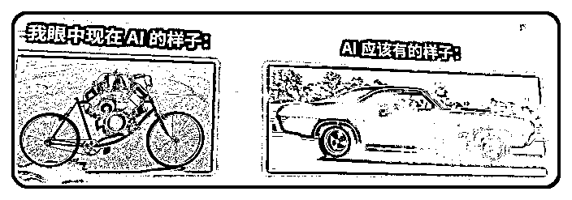

# (精华帖)(47 赞)国平老师分享总结：重新定义游戏规则，AI 如何重构我们的商业逻辑

> 原文：[`www.yuque.com/for_lazy/zhoubao/ha0cabyexlzar5gs`](https://www.yuque.com/for_lazy/zhoubao/ha0cabyexlzar5gs)

## (精华帖)(47 赞)国平老师分享总结：重新定义游戏规则，AI 如何重构我们的商业逻辑

作者： 松

日期：2025-07-28

这是我在生财发的第一篇帖子，一直没有动笔，只是在看大家的分享；从前参加这类大会听完就结束了，吸收了一些知识，一直也没什么沉淀；当这次我觉得很震撼又想给小伙伴们分享的时候，总觉得一言两语没办法讲清楚其中真谛；

所以尝试通过“关于 AI、商业认知、视野与战略思维”这三个大维度，梳理总结了国平老师的分享、夜话、大家感悟的各种内容，其中也用上了非常多生财大佬们总结的内容，如希声、超人、白先生、LY🍒等大佬的总结；所以文章内容和其他人分享的可能会有重叠；

而我写这篇文章的思路，主要是把这些内容进行了分类，重新梳理，以便读者或者我能更好的能给其他伙伴进行分享和吸收。

# 一、关于 AI

## 1.1 关于 AI 的全新理解

### 1.1.1 AI 作为引擎而非工具

**一句话总结：** 我们当前对 AI 的理解和应用存在很多误区。真正有价值的 AI 应用不是简单的内容生成，而是能真正影响物理世界，帮助实现业务目标的应用。

这次来生财私域大会是为了私域而来，但震撼于对 AI 的理解，国平老师对 AI 的理解远超一般认知。他把 AI 比作 200 年前的蒸汽机，在蒸汽机发明出来的 20 多年当中，很多人不知道它能做什么用，但有些人找到了应用场景，比如挖煤要排水。蒸汽机最大的优点就是有特别大的蛮力，力气特别大，动力很足，可以 24 小时不停地工作。这都跟今天的 AI 非常类似。

即使在今天的中国还有地方在用蒸汽发动机，比如用在汽车上或火车上，因为它扭矩特别大，在青藏高原修铁路、运超级大的桥梁时，还会用蒸汽火车。所以 AI 不是给你小打小闹的，不是对话框里的小东西。

### 1.1.2AI 不只是生图生文

**一句话总结：** 它能返回标准化的 JSON 格式。这意味着它可以驱动任何能通过 API 或程序控制的动作。

现在很多人对 AI 的理解，还停留在对话框里。

一键成片、一键成文、一键生图…

国平老师说：Al 不是这么用的。

“看到这种用法，就像看到为了烧开一杯水，把纸币点燃在下面烧。”

“每个时代发财的人，都是理解透了新技术，然后找到了最好的应用场景。”Al 也一样。它不仅能返回文本、图片、视频，更**重要的是：它能返回标准化的 JSON 格式。这意味着它可以驱动任何能通过 API 或程序控制的动作。** 让 Al 去控制浏览器、App、手机、电脑来完成真实的工作任务。让 AI 从一个信息工具，变为一个执行工具。无人轮船、无人货车、无人工厂……任何能动的东西，都可以用大模型来操作。

所以，他说：想象一下，如果你有 1 万名员工，你要安排他们做什么？这才是 AI 时代最重要的思考方式。

### 1.1.3AI 提高了资源利用率

AI 做的事情是什么？

所谓的算力其实是提高了资源的利用率。

以前我们人类去做一件事情，我们需要花 100%的精力去做，但是有了 AI 之后它能够诞生一个模式，只要 10%的资源就能够解决这个事情。

所以 MCP 可能会给我们的惊喜就在于，它能够用 10%的资源就能够解决我们原本需要 100%资源才能解决的问题。这才是他真正有魅力的地方。

## 1.2 为什么不要做 AIGC

**一句话总结：** 当所有人都用 AI 来生产内容，内容质量会在内卷中不断下降。用 AI 写文章、做图片，本质上是在一条注定拥挤且下滑的道路上内卷。AI 内容泛滥后，必然会被用户抛弃。我们要做的是利用 AI 建立深度粘性，给用户持续提供价值。

国平老师提出了一个颠覆性观点：不要碰 AIGC。这一观点的逻辑基础在于竞争壁垒的急剧下降。如他所言，"现在十万人在做 AIGC，下个阶段就 100 万人去做，它是一个没有竞争力的东西。"对于创业者而言，AIGC 领域的壁垒会越来越低，竞争会越来越大，这意味着在这个维度上很难建立可持续的商业优势。

更深层的问题在于，我们做的所有视频、文章、内容创作，本质上都是在给平台提供内容，为用户提供消费，这是一次性的买卖。虽然表面上看是在建立个人设，但实际上是在为平台打工，缺乏真正的商业闭环。

相比之下，国平老师通过 AI 私域实现了完整的商业闭环。他以舌诊和热量计算为例，展示了 AI 在私域中的深度应用。这种模式的核心在于：**基于用户粘性的持续需求，比如舌诊或卡路里计算，这些都是持续不断产生需求的场景。通过 AI 来解决这些问题，不仅仅是解决问题本身，更是建立深度粘性。**

国平老师的团队做了一个舌诊 AI，本意是帮用户分析舌苔看健康。但后来发生了什么？用户开始问情感问题，甚至把 AI 当成情感树洞了。

人性是很有意思的，因为用户知道对方是 AI，反而更愿意分享隐私。

AI 记住了用户几天前的情感困扰，2 天之后主动给出深度思考后的回应。

真的把用户感动到哭了。

用 AI 在私域建立深度粘性的同时，能够源源不断地给客户推产品。这比做 AIGC 更有价值，**因为 AIGC 的本质是消耗内容，而 AI 私域则完成了整个闭环** 。

AI 每天都在和用户聊天，很了解用户。用户说的每一句话都可以挖掘出一堆商机。比如用户无意间提到搬了新房子，这里面有多少个需求？搬新房之后要除甲醛等各种需求。

## 1.3 标签已经过时了--终身记忆的商业价值

**一句话总结：** 给客户做分类，做标签，这是过去的玩法。太僵化了。Al 时代，每一个客户都应该有一个档案库。

对于做私域来说，标签是必备的东西，

但国平老师提到了一个重要概念：终身知识库，更准确地说是终身记忆。

这意味着客户一旦流进他的 AI 私域，这个客户就一辈子都是他的。

他已经在做这件事情了，现在已经造了 13000 个贾维斯，任何一个人进去，都让他出不来。

这种终身记忆的能力让 AI 能够持续开发客户价值，理解客户的深层需求，提供持续的服务和产品推荐。

这比传统的一次性交易模式更有巨大的商业价值优势。

## 1.4 用 AI 管理 1.3 万 KOL 情绪价值

**一句话总结：** 用 300 个 Agent 服务一个人，AI 一定能替代人，因为情绪价值这一块 AI 完全能做到。

他以大疆的案例说明，不是简单的钱、虚荣心等表面需求，而是要抓住基于热度、基于博主虚荣心的深层需求点。

大疆在火的时候，华强北做了 17 块钱的无人机，直接送给海外的优秀博主。因为抓住了流量主的虚荣心，他们觉得这么好玩的东西一定会去拍，拍完之后又露出了 logo 和外包装。关键是第一，不花钱，不会给任何一个 KOL 说要花钱让你帮我拍视频。第二，包装上面 6 个面都是 logo，但凡有一个开箱的动作都会露出 logo。

甚至有博主直接自主地找到他们 17 块钱无人机的链接，直接挂在视频下面，无形就给他们带货了。

同时，

国平老师展示了 AI 应用的另一个层面：用 300 个 Agent 服务一个人。不是 300 个人，而是 300 个 Agent 服务一个人。他拆解了所有的工作流，当你跟一个人聊天时，实际上后面有 300 个 Agent 在服务。比如你提到某个吃的，马上某个 Agent 就开始提供美食相关的服务；提到穿的，又有 Agent 去处理相关需求。

他强调 AI 一定能替代人，因为情绪价值这一块 AI 完全能做到。**他会让 AI 来做情绪价值的这部分事情，找 60 篇最近这个人发的视频，丢给 AI，AI 找数据最好的一条，然后让 AI 夸死他，夸爆他。一天就能聊 1.3 万个 KOL。**

他当时写那个策略里面两句话，一句叫“严禁谈钱，永远用情怀驱动”。然后还有一个就“永远不要谈让他做什么事情”，他基本不会说“你要帮我拍”，他不会讲这句话。

“AI 一定能代替人”。

## 1.5 用 AI 来进行私域运营-产生价值而非消耗内容

**一句话总结：** 用 AI 给用户创造价值，我们的终极命题都是在解决客户的问题。

国平老师分享了一个关于 AI 进行私域运营的成功案例，不是简单替代人工客服，而是创造全新的体验：“我们发现我们创造了一个新世界“。例如，当用户知道对话的是 AI 而而非真人时，反而更愿意分享隐私问题，因为“他知道我是 AI 很放心，以后什么地方长了个什么疙瘩也拍给我"。

他强调 AI 应用的情感维度：“**我说我们要服务的客户，让他感动的流眼泪，如果不达到这个标准就不应该骚扰他。”** 例如，通过记住用户之前提到的问题，并在几天后主动提供更深入的答案和建议，创造惊喜和情感连接。

他的逻辑就是他通过用 AI 的能力去实现私域被验证过的自动转化销售的逻辑。这个逻辑就是基于用户的粘性的诉求，去做黏性和需求满足，比如说这个舌诊或者是卡路里这个东西，它是持续不断地在产生需求的。然后他用 AI 来解决这个问题，而且同时不仅仅是解决问题，而是深度的粘性。他用 AI 在私域建立了深的粘性，而且它能够源源不断地给这个客户推产品。那这个东西就比你做 AIGC 更有价值，因为 AIGC 的本质就是消耗内容。

AI 私域这个事情能盘活的东西很大的。他就举了个贝壳的例子，贝壳手上有多少私域资源？但是没有被盘活。但是他全部交给 AI，不需要消耗人力的，就 AI 自己去跑。整座金山躺在那里给他跑，这个就很夸张了。

然后我每天都在和你聊天，我很了解你。

用户说的每一句话我都可以挖掘出来一堆的商机。比如说你可能无意间提了一嘴，我搬了新房子。我搬了新房子这里面有多少个需求？那他可以把这个需求给多少的？搬新房之后要除甲醛……

**说白了我们现在用 AI 都不创造价值。**

我们回过头来想，就是我们现在创作了很多什么 AIGC 文档、AI 数字人，全部都是为平台服务的，它其实本质上不怎么创造价值，它不是直观地给用户创造价值的。

我们其实终极命题都是在解决客户的问题。包括他的逻辑也是一样的，我其实是在用 AI 来解决消费者的问题，在私域里面就服务到你，很感动的这种感觉。那其中一个点就是说那怎么样能够让消费者感动，就对于你理解消费者的需求是很有关系的。

## 1.6 抢占用户时长的新战场

**一句话总结：** 通过一个切入点，成为用户在某个垂直领域的唯一入口

以前大家抢占用户的视觉/时间，在小红书/抖音里面去抢占。现在要做的事情是用 AI 去抢占用户时长，找到一个切入点，比如做健康的，就找到一个小的切入点，让用户用你的 AI 去关注健康，未来你可以给他服务很多东西，甚至替代掉他以后去别的平台上搜索健康相关的东西。

这种思路的核心在于，通过 AI 建立与用户的深度连接，成为**用户在某个垂直领域的唯一入口** ，从而获得持续的商业价值。

## 1.7 MCP 的革命性意义

**一句话总结：** coze，n8n
等这类工作流必然会被淘汰。因为不够灵活，太僵硬了，只能僵化地执行固定流程。如果你精通 MCP，那么就不需要任何工作流了。

国平老师特别强调了 MCP 的重要性，这是一个被严重低估的技术。他用乐高积木做类比：我们当下做事情是先有塑料粉末，做成乐高积木，再搭成楼房或坦克。MCP 就相当于有个房子，房子里有人，你是局外人，去告诉里面的人要搭房子或坦克，里面的人帮你干活，你是发指令的人。

MCP 的出现会让手机软件这个概念消失，现有的软件只会变成服务。比如支付宝有个 MCP 服务，AI 直接调用 MCP 就可以使用支付宝，不需要打开支付宝，手机上大量的 APP 就根本没有存在的必要了。

未来各种 APP 软件都会有各种各样的 MCP 出现，我们要做的事情是让 AI 去调度这些 MCP，软件的概念就会越来越模糊，全部变成后端的服务。

# 二、商业认知

## 2.1 美团与饿了么的流量战争-流量资金运转效率

**一句话总结：** 谁能用同样的投入产出更多价值，谁就能最终胜出。

国平老师分享了一个经典的商业战争案例，深度剖析了**流量资金使用效率** 的概念。美团发现自己在流量资金使用效率上比饿了么高 20%，这意味着同样的投入能产生更高的收入。基于这个优势，美团采用了一种极其聪明的策略。

他们发现市场上有 60 个月活过亿的 APP，而普通人只知道在微信、抖音、淘宝、百度上买流量。美团找到了 B 站这样的新渠道，通过与 B 站小二沟通，了解到饿了么一个月在 B 站投 100 万。美团立即提出 110 万购买同样的广告位，通过价高者得的竞价逻辑，把饿了么从 B 站赶出去。

这种策略的精妙之处在于，美团哪怕花了 110 万，因为其 20%的效率优势，这 10 万的差价是能够赚回来的。通过这种方式，美团在很多平台实现了一网打尽。

在流量运营领域，最核心的指标是流量资金的运转效率。你往里面扔多少钱，那边出来多少钱，关键是看这个效率如何。真正的成功者不是在意战术细节，而是关注这一核心指标。

“你想成为一个行业老大，你的流量资金的运转效率，就必须是整个行业的老大。哪怕只是一个第 50 名的小弟，如果流量资源的影响效率是整个行业最高，那这个老大最终也是他的。“这是一个纯粹的数字游戏，谁能用同样的投入产出更多价值，谁就能最终胜出。

## 2.2 窒息理论

然而，美团的策略在一段时间后停止了，背后体现的是王兴的更深层思考。王兴在爬珠穆朗玛峰后有了感悟，意识到这种互相抬价的竞争模式本质上是比谁更长命的游戏。就像在水里憋气，你掐我一下，我打你一下，比的是谁能坚持更久。

基于 20%的效率优势，最后确实还是美团会获胜。但更重要的战略思考是：**先把竞争对手留着，先不打他，而是让他一起参与到培养用户习惯这个事情中来，把蛋糕、把这个局做大。做大完成后，再用同样的招式把对手干掉。**

这体现了王兴一直宣称的"竞合"理念。竞指的是竞争关系，合指的是在外卖市场培养用户习惯这个层面上的合作关系。在合作关系里，没有必要把对手杀掉，大家一起花钱，一起把市场做大。而饿了么关注的是绵羊市场，让饿了么花钱去养着，到最后养得很肥了，再直接把饿了么收购。这就是商业版的"草船借箭"。

## 2.3 水滴筹的杠杆策略

**一句话总结：** “真正成功的商业策略是找到杠杆点，通过少量投入撬动巨大结果。

另一个精彩的案例是水滴筹如何击败轻松筹。轻松筹作为先行者，占据了 90%的份额，但水滴筹通过一个巧妙的杠杆点实现了逆袭。

水滴筹发现轻松筹一个月只能投 200 万的广告费用，产生 400 万的收入，大概是两倍的转化效率。但水滴筹做了一件聪明的事情：他们不赚病人的钱，给病人做筹款，包括手续费都帮病人承担，在这个手续费上一年会亏损几千万。

水滴筹的盈利点在于卖保险。他们想到了一个关键洞察：在阿里卖保险的平均转化率是 3%，但在什么场景下人们最愿意买保险？当你看到一个人生白血病，需要筹 100 万，很惨，你给他捐了 50 块钱，在这个时间点突然跳出个广告，告诉你有一个重病保险，转化率能达到 25%。

基于这个 25%的超高转化率，水滴筹实现了梭哈式的投入：投入 2 亿，得到 7 亿的收入。这就是找准杠杆点的威力，25%的转化率确实非常恐怖（其他平台的预计在 3%）。

“真正成功的商业策略是找到杠杆点，通过少量投入撬动巨大结果。老师指出，许多企业在做战术优化时过于平均发力，导致“平均实力就是平全面平庸”。应该找到一个“巨大杠杆”，将资源全力投入，然后再让其他方面达到平均水平。

## 2.4 150 万关键词的降维打击

**一句话总结：** 数据挖掘和 AI 分析，管理 150 万个关键词，不在最热门的词上内卷，找到更高效的词

国平老师分享了一个震撼的流量获取方法。他通过数据挖掘和 AI 分析，能够管理 150 万个关键词，而普通人可能只能想到 10 个、50 个、100 个、200 个、500 个关键词。

他的方法是把整个行业所有的平台、所有的文章全部下载下来，然后做数据清洗，把所有的关键词提取出来，再把无用的关键词剔除掉。从这 150 万个关键词里面去做测试，再一次校验哪些是高转化率的。

他的核心策略不是去和大家抢流量，不是投最热门的词，而是挖掘那些转化率高但投流价格只有 3 毛钱的词，而别人投的是 5 块钱。他把所有费用投到那个 3 毛钱的池子上面去。比如 Anker 充电宝，他投圣诞节送礼、投相机、母亲节送礼，不是投手机充电、容量等直接相关的词。

对于普通人怎么用这套方法，国平老师给出了具体的解决方案：不懂技术没关系，淘宝是万能的，去买。10 块钱买一万篇小红书笔记，把所有数据下载下来，然后用 AI 去清洗和分析。

虽然普通人做不到 150 万字的投放，但能做的是通过这个方式找到一些别人花 10 块钱去投的词，但你只需要花 3 毛钱就可以拿到比别人花 1000 块钱、1 万块钱更好的效果。

他的标准是投产比不能低于 1:6，就是投一块钱至少要拿到 6 块钱回来。他们的最大能力是投一块钱能赚 1000 块钱。

## 2.5 爆款重复利用

**一句话总结：** 我们做爆款之后，做完之后总会还想下一个爆款在哪里。他说不要去找下一个爆款在哪里，而是怎么样让你的爆款成为常青树？

爆款成为常青树的难度，小于做下一个爆款

案例：比如说《赢在中国》那个节目，最开始是史玉柱的，然后第一期没有请马云，他就去参加了。之后就开始疯狂地走软文植入，就对方一个什么项目上来，然后他可能简单一两分钟先点评一下，然后转到自己。然后会讲说：“但是我们阿里是怎么做的？”然后来到第二期的时候，40 分钟的节目，马云能讲个十来分钟。且，这个软广一直到 2024 年还在用。

# 三、视野与战略思维

## 3.1 框架思维的局限性

国平老师反复强调视野的重要性。他指出，我们很多时候停留在框架上去思考问题，比如流量、转化、交付的传统框架。面对流量问题，惯性思维是公域不好就去做公域，私域转化不行就提高转化率，各种私域运营。这就是在框架上思考问题。

但他举的很多例子，都是在框架以外的解决方案。他站在更高的角度，AI 可能是他做闭环的一个动作而已。我们现在发现有时候太纠结于用 AI 去生产一些内容，用 AI 去提效，这些都比较浅层。

“上牌桌的那一刻你就输了，因为那个牌桌就是为你设的一个局。所以你再问我这个牌桌怎么玩下去，我就说不要玩了。他说不玩了，我们还有前途吗？我说有啊，把牌桌掀了就有前途了。"—
国平老师

## 3.2AI 时代最重要的能力

第一，是理解 AI 的能力。

深刻理解它是一个引擎，是一个推理引擎，你提供的上下文内容越丰富，它能做的事情越多。

第二，找到非常好的应用场景。

第三，要有足够大的野心。要相信自己是能干成大事的。

国平老师说：“成功真的有时候就是个玄学。很多人之所以做得不好，都是因为不敢想导致的。”

他见过很多大佬级创始人，有的时候不服气，为什么这么普通的人也能做个几万人的公司？“但接触久了发现他们都有共同点：

有的人心念很强；

有的人韧劲很大；

同时无一例外的拥有好运气。

国平老师感慨：

“我终于意识到，勇气是人类最可贵的一种品质，甚至比智慧还要高。”什么是勇气？“你明知道这个东西很危险，成功几率可能为零。但你依然觉得：我就是想搞。”

他反思自己：“我太强调智慧这个东西了。我现在觉得智慧不那么重要，勇气大于智慧。”

国平老师强调了一个重要观点：创始人的性格、创始人的习惯，基本上就决定了这个平台。这些创始人哪怕能力再差，有一项能力是非常突出的，就是勇气。他们可能啥都不会，但因为够莽，最后莽得活下来了，就成为了老大。

他总结了三个关键要素：理解力、野心、勇气。

野心更多体现在很多大品牌的 CEO 身上，而勇气是人类最可贵的能力。

## 3.3 粉丝是虚假繁荣

流量行业有个指标叫触达率，也就是你发出去的内容，触达了多少用户。创作者不停地增加，用户已经到顶了，所以触达率会不停下降，每年你的粉丝都必须上涨 50%，才能维持和今年一样的业绩。我有 100w
粉丝，但触达率可能只有 1%。你有 10w 粉丝，但触达率可能是 10%。这是个黑盒。平台可以掌控是否给你的粉丝推流。

# 重新定义 AI 时代的商业逻辑

国平老师的分享展现了一个完全不同的 AI 商业应用视角，令人醍醐灌顶，极其震撼；

他不是在用 AI 优化现有的业务流程，而是在用 AI 重新定义商业模式本身。

从技术突破到商业战略，从需求洞察到平台规则，他构建了一个完整的 AI 时代的商业生态思考框架。

他告诉我们，AI 不应该被视为一个简单的工具，而应该被视为一个重新构建商业逻辑的引擎。

正如他所说，我们对 AI 的理解还停留在对话框的层面，但 AI 的真正价值在于能够创造全新的商业模式和用户体验。

对于我们普通人或者公司而言，关键不在于追随当前的 AI 热点，而在于找到那个能够用 AI 颠覆的细分场景，建立真正的竞争壁垒，创造持续的商业价值。这需要的不仅仅是技术能力，更需要的是商业洞察力、战略思维和执行勇气。

在 AI 时代，真正的赢家不是那些最会使用 AI 的人，而是那些最能理解 AI 本质、找到 AI 与商业结合点的人。

* * *

评论区：

猫哥 : 很棒，学到了。