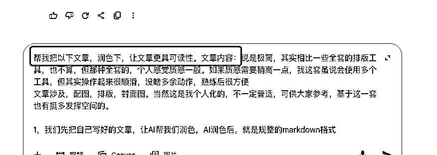
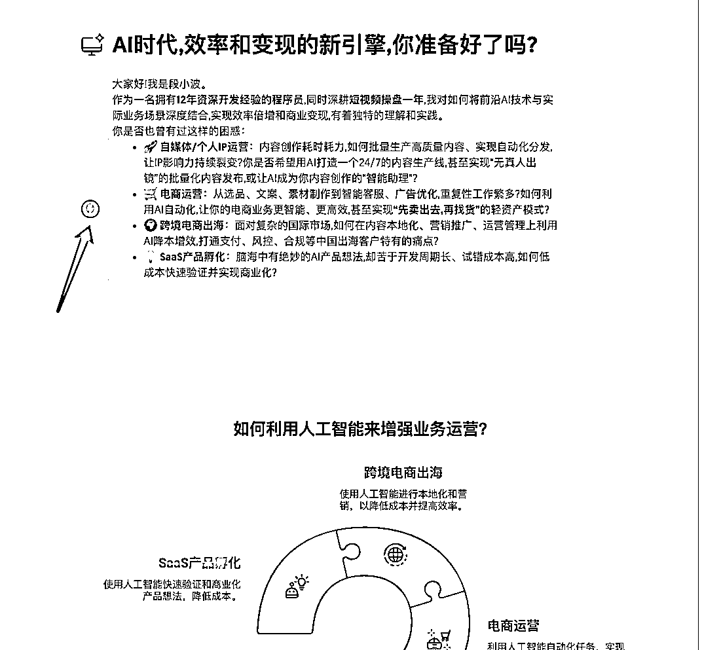
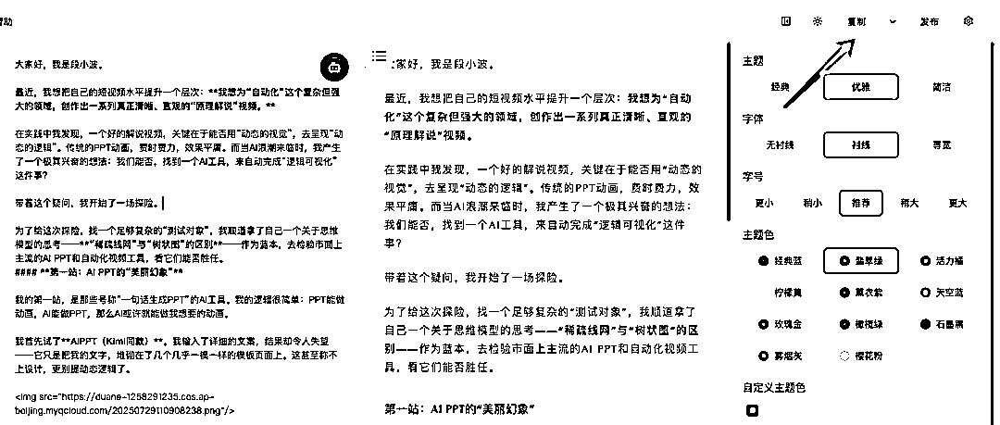
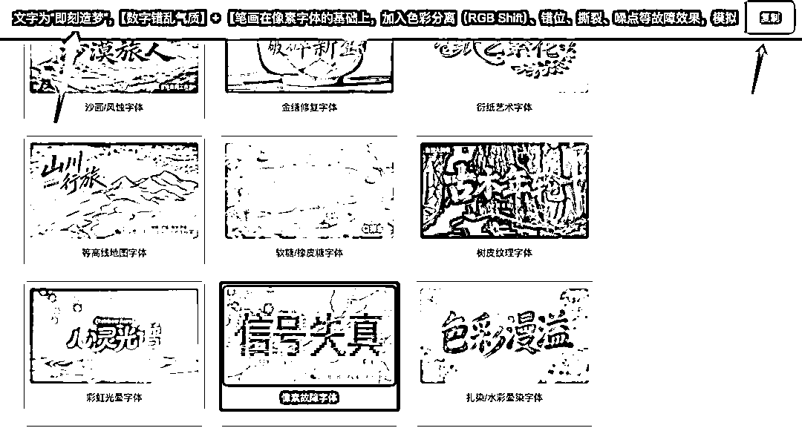
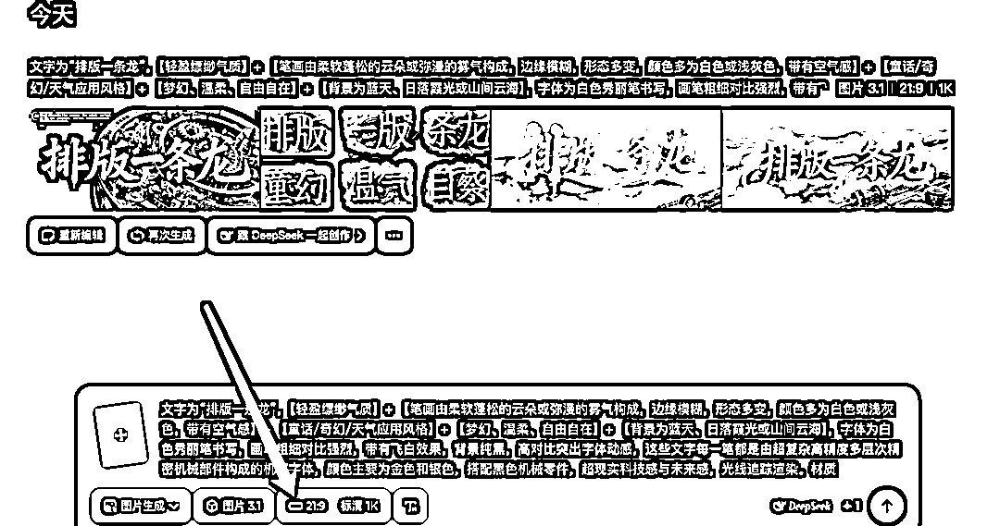

# (67 赞)8 分钟搞定一篇“高奢感”公众号图文

> 原文：[`www.yuque.com/for_lazy/zhoubao/ugr4z691tn00u9qz`](https://www.yuque.com/for_lazy/zhoubao/ugr4z691tn00u9qz)

## (67 赞)8 分钟搞定一篇“高奢感”公众号图文

作者： 段小波-AI

日期：2025-08-01

最近不少人，提到公众号排版配文，我有一个比较简化的方案，可供大家参考

大家好，我是段小波。

作为一名“效率炼金术士”，我一直在寻找一个能完美平衡“创作效率”与“内容质感”的工作流。市面上有很多全能的排版工具，但我总感觉它们的出品，缺少了一丝灵性和高级感。

经过大量的侦察和实践，我为自己，打磨出了一套由多个“小而美”的工具组成的、极简的 AI 图文工作流。

这套流程，操作起来如丝般顺滑，几乎没有多余动作。一旦熟练，你可以在 8 分钟内，将一篇粗糙的文字初稿，变成一篇图文并茂、排版精致的公众号文章。

这套方法非常个人化，不一定适合所有人，但希望能为你提供一个值得参考的、充满可能性的解决方案。

#### **第一步：AI 文本精炼 (1 分钟) - 思想的“结构化”**

**核心工具：** 任何一个你用得顺手的大语言模型（Deepseek，ChatGPT, Kimi, Gemini 等）。

**操作流程：** 我们创作的起点，通常是一份思路清晰但语言略显粗糙的初稿。第一步，就是把这份初稿，交给 AI 进行“精加工”。

1.  • **我的指令：** “请帮我润色以下文章，让语言更精炼、更具可读性，并以标准的 Markdown 格式输出。”

2.  • **核心优势：** AI 会自动帮你梳理文章的逻辑层级，用标准的标题、列表、引用等格式，完成思想的第一次“结构化”。这是后续所有美化的坚实基础。

#### **第二步：Napkin.ai 一键配图 (5 分钟) - 概念的“可视化”**

**核心工具：** Napkin.ai

网址[`napkin.ai`](https://napkin.ai)

**操作流程：** 一篇优秀的文章，需要“画龙点睛”的配图。相比 ChatGPT
o3 那种充满艺术感但生成缓慢的工具，Napkin 更像一个“思想可视化”的效率神器。当然，如果对图片质量有高度要求，ChatGPT o3 更好。

Napkin 尤其擅长将**对比、关联、流程** 这类抽象的逻辑关系，转化为简洁、直观的示意图。

1.  • **我的用法：** 在润色好的 Markdown 文本中，选中你想要可视化的段落，点击 Napkin 的蓝色小按钮，它就能立刻为你生成一张与文意高度相关的配图。

2.  • **核心优势：** 极大降低了将“文字”转化为“图形”的认知成本，让你的文章更易理解、更具说服力。

#### **第三步：Doocs 格式转换 (1 分钟) - 美学的“标准化”**

**核心工具：** Doocs ([`md.doocs.org`](https://md.doocs.org))

**操作流程：** 这是从“草稿”到“成品”的、最惊艳的一步。

1.  • **我的用法：** 将已经配好图的完整 Markdown 文档，直接复制粘贴到 Doocs 的左侧编辑区。

2.  • **核心优势：** Doocs 内置了多套经过专业设计师调试的、极具美感的 CSS 样式。你可以在右侧进行主题、字体等微调，然后点击“复制”，就能得到一段可以直接粘贴到公众号后台的、已经完美渲染的 HTML 代码。

#### **第四步：AI 封面图生成 (1 分钟) - 颜值的“临门一脚”**

**核心工具：** 提示词库[如 edui123.com/jm/] + AI 绘画工具[如即梦]

**操作流程：** 封面，是文章的“脸面”。

1.  1.  **寻找灵感：** 我会先去 [`edui123.com/jm/`](https://edui123.com/jm) 这个网站，寻找与我文章主题和风格相匹配的、高质量的封面提示词。

1.  2.  **AI 生成：** 然后，将这些提示词，拿到我偏好的 AI 绘画工具（比如“即梦”）中进行生成。

2.  3.  **关键参数：** 记得将图片比例设定为**21:9** ，这与公众号封面要求的 2.35:1 非常接近，可以避免关键元素的裁切。

好了，到此，一篇从思想到文字、从图片到排版都极具“质感”的文章，就完成了。

这套工作流的核心，是把我从所有“重复性”的、“低价值”的排版和美工工作中解放出来，让我能 100%地专注于**思想** 这个核心价值本身。

工具，永远是为思想服务的。希望这套“小而美”的工具链，也能为你带来效率和创作的乐趣。

* * *

评论区：

是清欢呀 : 排版很美观，重点也很突出，比正文全是黑字的版面看着用心[强]感谢分享

邓瑜 : 好一个“灵性和高级感”[强][强][强]

大鱼一梦趁风起 : 晚上用用

三千 Zen : 有点意思，等下实操看看效果，

劳模姐|零碳园区 : 感谢，这个尝试了，确实有帮助，可以把 135 编辑器退掉了~