# (精华帖)(52 赞)一篇文章九千字带你学会如何用 AITDK 来分析网站

> 原文：[`www.yuque.com/for_lazy/zhoubao/mbahzuob42c4ahas`](https://www.yuque.com/for_lazy/zhoubao/mbahzuob42c4ahas)

## (精华帖)(52 赞)一篇文章九千字带你学会如何用 AITDK 来分析网站

作者： 王珣

日期：2025-07-27

做 AI 编程的伙伴越来越多，必然少不了，我们去研究那些做的好的网站或者竞品网站，他们到底哪里做的好。其实有一款工具，对于我们去学习研究一个网站来说，非常强大且免费，它就是 AITDK。

我之前在微信公众号上分析了两百多款 AI 榜单产品，看过我前面做 AI 榜单产品分析文章的伙伴，应该会留意到，每个 AI 产品的深度分析都会有一张网站的 AITDK 的截图，其实这张截图对于我们分析网站来说，是非常重要的工具，其实我之前也仅仅是在用它来看网站的流量、来源、目标用户这几个关键数据，后来我发现，这个工具其实有很多有价值的信息，值得我们去学习目标网站。

下面用 remove.bg 这个网站的 AITDK 数据，来带大家一起了解一下，AITDK 给我们传递了哪些信息，以及我们可以如何更好的利用这些信息来优化我们的网站。

**1、Overview（概览）**

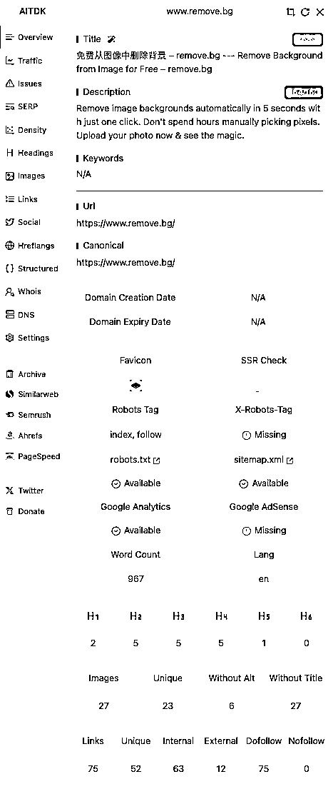

这个页面提供了网站最核心的 SEO 元素摘要。

1.  **Title（标题）** ：页面标题是“免费从图像中删除背景- remove.bg--Remove Background from Image for Free-remove.bg”。工具提示标题长度为 76 个字符，而最佳长度是 40-60 个字符。

2.  **Description（描述）** ：页面的元描述，长度为 154 个字符，在 160 个字符的推荐范围内，长度良好 。

3.  **Url & Canonical (网址与权威链接)**: 显示了当前页面的 URL 和其指定的权威（Canonical）URL，两者一致，这能避免搜索引擎因重复内容而产生困惑 。

4.  **Robots Tag & robots.txt**: index, follow 标签告诉搜索引擎可以收录和跟踪这个页面上的链接。网站也提供了 robots.txt 和 sitemap.xml 文件，这都是 SEO 的最佳实践 。

5.  **Google Analytics** : 显示该网站安装了谷歌分析，用于追踪用户行为，但没有安装谷歌广告（Google AdSense）。

** *从这里面我们能学到什么？***

1.  这个页面是 SEO 的基石。一个好的标题和描述能直接影响用户在搜索结果中的点击率。remove.bg 的标题虽然长，但包含了中英文核心关键词，覆盖面比较广。

2.  这个页面，其实非常有利于我们去学习目标网站的技巧，前期不会的可以模仿他们的写法。

**2、Traffic（流量）**

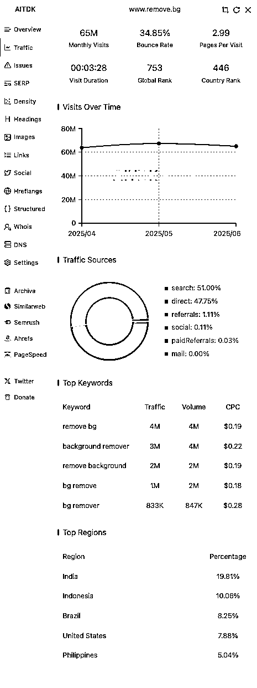

看过我前面产品分析文章的，这个页面应该不陌生了，这个页面展示了网站的流量估算数据，能让我们对一个网站的受欢迎程度、用户规模、用户来源等方面有个宏观的了解。

1.  **Monthly Visits (月访问量)** : 这个数值代表网站的月访问量，这个网站的月访问高达 6500 万，说明这是一个流量极高的网站。

2.  按照小排老师的说法，如果我们的工具站的月访问能做到 1M=100 万流量，差不多能月入 5 千美刀了。

3.  **Bounce Rate (跳出率)** : 34.85%，这个数值相当低，说明大部分用户访问后会继续浏览其他页面，用户粘性好 。

4.  这里我发现很多单页网站的跳出率非常高，因为一个页面很容易就探索结束了，于是很多网站会做很多内页，像 blog，或者多工具等页面，增加用户的停留，避免用户进来就走了。

5.  **Pages Per Visit (每次访问页数)** : 平均每次访问浏览 2.99 个页面 。

6.  这个数值就是用户对你的网站是否感兴趣，和跳出率相辅相成，一般网站做得好，用户都会点点这，点点那，也能代表网站对于用户的吸引力。

7.  **Visits Over Time (访问量趋势)** : 图表显示在 2025 年 4 月到 6 月期间，流量稳定在 6000 万以上 。

8.  一般 AITDK 会展示网站近 3 个月的流量数据。最近几个月有不少新 AI 工具站推出，会看到很多是上个月数据还是 0，突然通过各种冷启动的方法，暴涨访问量的，这种网站一般是通过了一些手段来进行了冷启动，也值得我们去和 AI 深度探讨学习；

9.  比如之前 bolt.new 就是搞了几次周末免费使用的活动来吸引一大波用户的加入；还有 Gemini 和 cursor 之前就和 edu 邮箱合作，弄了学生优惠，可以大幅度低价来使用产品等等，都是一些启动策略。

10.  **Traffic Sources (流量来源)** :

11.  前三名分别是：搜索 (Search): 51.00% 、直接访问 (Direct): 47.75% 、推荐 (Referrals): 1.11%

12.  这说明该网站一半的流量来自用户主动搜索，SEO 做得非常成功；另一半来自直接输入网址，证明品牌知名度极高。

13.  流量来源是帮助我们分析目标网站的用户，主要通过什么方式来的，Direct 高说明回头客很多，也说明了网站的价值很高，用户用了还回来；而 Search 的搜索流量如果做得高，说明 SEO 做的很好，这部分也是我们要重点学习的，因为说明，网站在 SEO 方面做了大量工作。

14.  **Top Keywords (热门关键词)** : “remove bg”, “background remover” 等关键词带来了百万级的流量，是网站的核心流量来源 。

15.  Top Keywords 应该是网站最有价值的几个关键词，代表了通过这几个关键词，给网站带来了多少流量，同时看一个 word 的 Traffic 和 Volume 的占比，能感知到这个 word，网站拿了多少的流量，以及还有多少的空间可以去竞争，这是一个很重要的信号。

16.  如果说 traffic=volume，基本说明这个 word 已经被完全垄断了。所以我们可以从 remove.bg 的 Top keywords 看出，“remove bg”、“remove background”、“bg remover”这三个词基本上已经完全垄断，而“background remover”、“bg remove”这两个词也垄断了一半以上。如果要去和网站竞争，那么这几个词就不用再碰了。

17.  **Top Regions (主要地区)** : 用户来源中排名前五的国家是印度 (19.81%)、印度尼西亚 (10.06%)、巴西 (8.25%) 、美国（7.88%）和菲律宾（5.04%）

18.  这里主要代表了网站的用户主要来自于哪些国家，也代表了工具对应的核心用户市场是在哪里；因为做海外工具站，每个国家的消费能力不同，国家的基建水平和竞争环境不同，相同的工具，打不同的国家，策略和难易程度都不一样，所以我觉得这也是做 AI 出海的魅力所在，不用拘泥于一个国家的人群去竞争，而是可以有更多的空间去挖掘某个国家某个语言的流量洼地，找到突破口。

19.  另外有一个很重要的点，不同的国家人群，也代表了大家的消费能力和习惯，一般来说，大家最喜欢美国的用户，因为用户人群价值更高，付费意愿和消费能力更强。

** *从这里面我们能学到什么？***

1.  traffic 这个页面算是网站最核心的数据，能让我们快速直观的看到网站的用户情况，所以每个网站必须要好好研究

2.  好的工具站，除了产品功能好用以外，如何做流量，如何选人群，这些都值得我们去挖掘和学习，目标网站做的越好，其实我们能学到的东西就越多。当然如果目标网站的数据太好，比如 remove.bg 在图片背景这个领域已经做到近乎垄断的地位，我们就不要再进去竞争了。

**  **

**3、Issues（问题）**

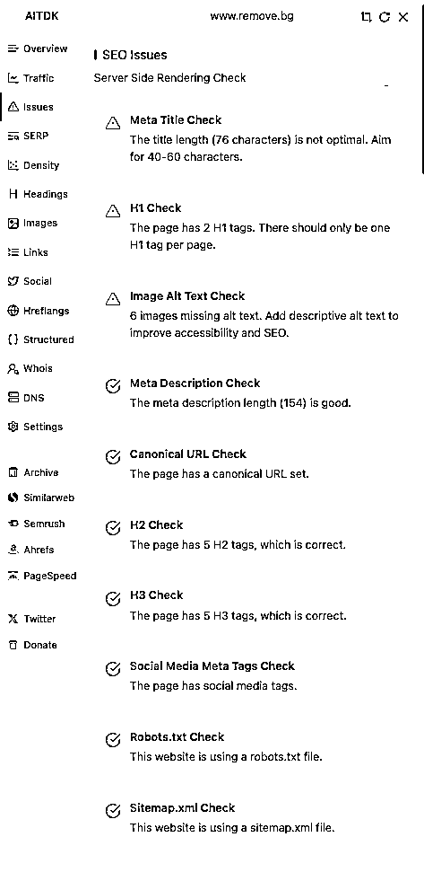

这是一个自动化的 SEO 审查工具，它会直接列出网站存在的问题。

这里显示的问题是：

1.  **Meta Title Check** : 指出标题 76 个字符过长的问题 。

2.  **H1 Check** : 页面有 2 个 H1 标签，而一个页面只应该有 1 个 H1 标签 。这是常见的 SEO 错误。

3.  **Image Alt Text Check** : 有 6 张图片缺少 alt 文本。alt 文本有助于图片 SEO 和可访问性 。

这个页面我用的比较少，主要是一份由 AITDK 提供的“网站优化任务清单”。它指出的问题都非常具体，可以直接拿着去修改。

**  **

**4、SERP（Search Engine Results Page 搜索引擎结果页面）**

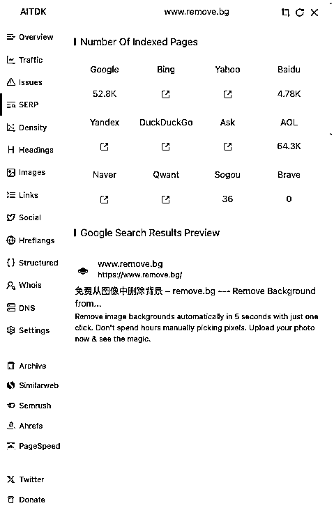

此页面展示了网站在不同搜索引擎中的收录情况和在谷歌搜索结果中的预览。

1.  **Number Of Indexed Pages (索引页面数)** : 谷歌收录了约 5.28 万个页面，而 Baidu 收录了 4780 个，AOL6.43 万个页面，Sogou 只有 36 个，收录量非常少 。

2.  在谷歌上来说，这表明其主要针对谷歌进行优化，使得网站在 Google 上的可见度很高。而 AOL 的数据出乎意料的高，可能与 AOL 使用的搜索引擎技术或数据采集方式有关。

3.  **Google Search Results Preview (谷歌搜索结果预览)** : 模拟了网站在谷歌搜索中的样子，包括标题、链接和描述。

4.  这个部分，我记得在哥飞大佬公众号有篇文章提过在 Google 的搜索结果页可以展示的 10 种结构化样式，如果感兴趣可以了解一下，还挺有意思的。

** *从这里我们能学到什么？***

1.  索引数量可以反映一个网站在搜索引擎中的权重和内容规模。这个能反映网站的 SEO 能力做的如何，如果我们要超过目标网站，可能我们就要思考，是否我们可以增加这么多的页面去做竞争？

2.  谷歌搜索结果预览，这里的样式大家如果后期有时间，建站熟练了以后，可以试一下，采用不同的呈现方式去展示网站，或许能提升一定的用户点击率。

**  **

**5、Density（关键词密度）**

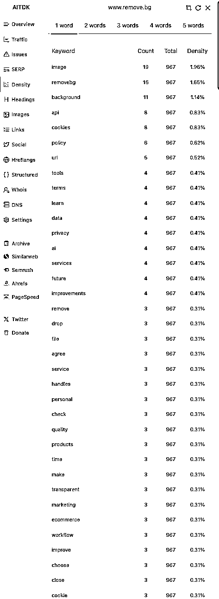

这个页面分析了网页上所有词语的出现频率，上面代表的是 1 个 word、2 个 word...5 个 word 的密度情况

1.  页面总词数是 967 个。

2.  1word 中最高频的词是 "image" (1.96%), "removebg" (1.65%), "background" (1.14%) 。

** *从这里我们能学到什么？***

1.  我们可以分析目标网站的关键词词榜，可以看它核心的词语的密度和分布，一般来说，主关键词密度最好是 1%-2%之间，超过 3%就会被谷歌视为堆砌关键词。

2.  从这个页面可以验证页面的主题是否聚焦。remove.bg 的高频词和它的核心功能“移除图片背景”高度相关，说明页面内容非常专注，这有利于 SEO。

3.  在写文章或制作页面时，可以用这个功能检查自己的关键词布局是否合理，核心关键词的密度是否足够。

**6、H Headings (H 标签)**

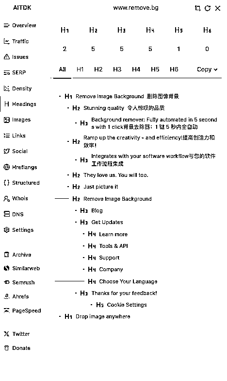

这个页面清晰地展示了网页的页面大纲结构（H1-H6 标签）。

1.  页面有 2 个 H1，5 个 H2，5 个 H3，5 个 H4，1 个 H5

2.  H1 一个是 "Remove Image Background" ，另一个是 "Drop image anywhere" 。

3.  H2 用于介绍核心功能和优势，如 "Stunning quality" 。

4.  H3 用于更次要的功能分区，如 "Blog"。

** *从这里我们能学到什么？***

1.  H 标签结构就像一本书的目录，它帮助搜索引擎和用户理解页面的层次结构。一个逻辑清晰的 H 标签结构对 SEO 至关重要。

2.  通过分析竞争对手的 H 标签，我们可以了解他们的内容组织方式和逻辑，这样也方便我们进行更好的优化迭代。

**7、Images（图片）**

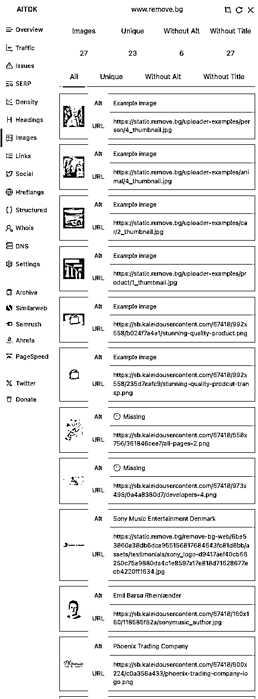

这里列出了页面上所有的图片资源

1.  总共有 27 张图片，其中 23 张是唯一的。有 6 张图片缺少 alt 文本，27 张图片缺少 title 文本 。

2.  列表详细展示了每张图片的 URL 和 alt 文本内容。例如，有些图片的 alt 文本是 "Example image" ，有些则具体描述了图片内容，如 "Sony Music Entertainment Denmark"。

** *从这里我们能学到什么？***

1.  alt 文本是图片 SEO 的核心。当图片无法加载时，alt 文本会显示出来；同时，搜索引擎也会读取它来理解图片内容。

2.  我们可以用这个功能快速检查自己网站的图片 alt 文本是否都填写完整且具有描述性，而不是空白或无意义的文字。

3.  这里有个关键信息，就是图片 SEO，我记得在哥飞大佬的文章里有提过，可以通过图片 SEO 的优化，来增加自己网站在图片 SEO 环境下，被检索的概率，从而提到网站的曝光，这个思路也是不错的。

**8、Links（链接）**

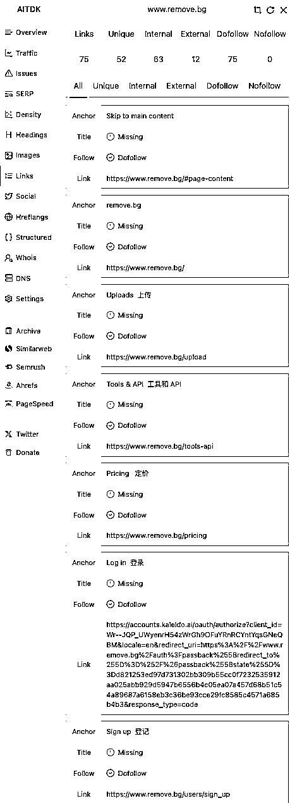

Links 菜单，分析了页面上所有的链接。

1.  Links（总链接数）是 75，表示该网站上发现的可点击链接的总数。

2.  Unique（独立链接数）是 52，表示在这 75 个链接中，有 52 个是指向不同 URL 的独立链接。这意味着有些 URL 可能被多次引用。

3.  Internal（内部链接）是 63，这些链接指向 [www.remove.bg](http://www.remove.bg) 网站内部的其他页面。内部链接对于网站的导航、用户体验以及搜索引擎对网站结构的理解都非常重要。

4.  External（外部链接）是 12，这些链接指向 [www.remove.bg](http://www.remove.bg) 网站以外的其他网站。外部链接通常用于引用来源、推荐资源或作为广告/合作伙伴链接。

5.  Dofollow 是 75，表示在该网站上发现的所有 75 个链接都是 dofollow 链接。这意味着该网站没有使用 rel="nofollow" 属性。这是一个非常重要的发现。

6.  这里 Dofollow 链接是网页上最常见的默认链接类型，他会将网站的链接汁“Link Juice”和权重“Authority”传递给链接目标网站，搜索引擎会将此作为判断目标网站可信度和重要性的因素之一。

7.  Nofollow 是 0，表示没有发现任何 nofollow 链接。

8.  Nofollow 链接是在链接中添加了 rel="nofollow" 属性的链接。这个属性向搜索引擎发出“提示”，告知它们不要追踪此链接。主要用来为了防止评论垃圾邮件和付费链接的滥用。

列表解释：

下方表表格列出了每个被检测到的链接的详细信息：

1.  **Anchor (锚文本):** 用户点击链接时看到的文本。这是搜索引擎理解链接目标内容的重要信号。

2.  **Title (标题属性):** 链接的 title 属性，通常在鼠标悬停时显示。它提供了链接的额外描述信息，对用户体验和可访问性有益。

3.  **Follow (跟随属性):** 显示链接是 Dofollow 还是 Nofollow。

4.  **Link (链接 URL):** 链接指向的完整 URL。

** *从这里我们能学到什么？***

1.  通过 Links，可以快速了解网站有多少链接、内部链接和外部链接的比例，以及独立性；

2.  可以清晰的知道网站的内部链接和外部链接具体指向了哪里，可以帮助我们更好的了解它的链接的质量和合理性，目标网站能拿到这些外链资源，那么我们是否也可以？

3.  分析目标网站的锚文本，看看是否具有描述性，是否包含关键词，并且与链接目标内容相关。因为良好的锚文本有助于搜索引擎理解链接目标的上下文，并提升相关页面的排名。

4.  如果是有竞品网站，我们可以把对方的内链和外链做个详细的分析，这样我们能针对性的模仿和超越。

**9、Social（社交）**

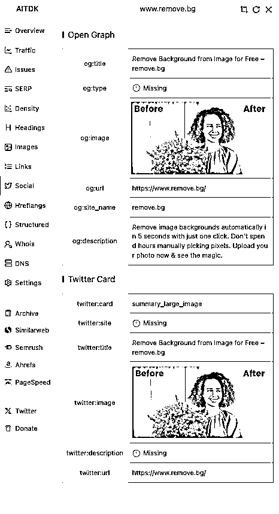

这个页面是检查为社交媒体分享而设置的特殊标签（目前是 2 个 Open Graph 和 Twitter Card）。

1.  **Open Graph (用于 Facebook, LinkedIn 等)** : 设置了标题、图片、URL 等 ，但缺少 og:type 属性。

2.  **Twitter Card (用于 Twitter)** : 设置了卡片类型为 summary_large_image ，但缺少 twitter:site (网站的 Twitter 账号) 和 twitter:description (描述) 。

** *从这里我们能学到什么？***

1.  这些标签决定了当我们的网页链接被分享到社交媒体上时，会以什么样的卡片形式展现（标题、描述、预览图）。一个美观的分享卡片能大大提高点击率。

2.  在做营销推广前，一定要用这个功能检查并完善社交标签，确保分享效果最佳。

3.  一个配有吸引力标题、描述和高质量预览图的社交分享，比仅仅一个裸链接更容易吸引用户点击。remove.bg 的 og:image 和 twitter:image 就做得非常好，直观展示了产品功能，极大地提升了点击意愿。

4.  品牌形象一致性，确保无论在哪里分享，网站的标题和描述都保持一致，强化品牌信息，避免误解。

**10、Hreflangs（多语言）**

这里 remove.bg 的 Hreflangs 的数据为空，我找一个其它网站 pixai.art 的界面来举例说明

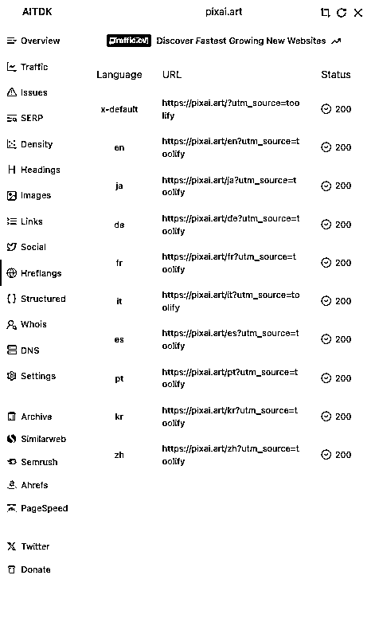

这个菜单专门用来检查网站的多语言和多区域设置。hreflang
标签的作用是告诉搜索引擎：“嘿，我这个页面有多个不同语言或针对不同地区的版本，请根据用户的语言和地区，在搜索结果里展示最合适的那个版本。”

1.  图中显示了 pixai.art 为多种语言设置了对应的 URL。

2.  language（语言）：列出了包括 en (英语), ja (日语), de (德语), zh (中文) 在内的 9 种语言版本。

3.  URL：每种语言都对应一个独立的 URL，例如英语是“[`pixai.art/en?utm_source=toolify”`](https://pixai.art/en)

4.  Status（状态码）：所有 URL 的状态码都是 200，这表示所有语言版本的页面都工作正常，可以被成功访问。

** *从这里我们能学到什么？***

1.  提升用户体验：当一个日本用户在谷歌搜索时，hreflang 标签会建议谷歌直接向他展示日语版本的页面，而不是默认的英语或中文页面。这大大提升了用户的亲切感和使用体验。

2.  精准的 SEO：它可以帮助我们在不同国家的谷歌搜索结果中获得更好的排名。

3.  避免重复内容惩罚：如果没有 hreflang 标签，搜索引擎可能会认为这些不同语言的页面内容相似（尤其是在图片、布局上），从而判定为“重复内容”，影响网站权重。hreflang 明确告知搜索引擎这些是合法的、针对不同用户的替代版本，而非恶意复制。

**11、Structured Data（结构化数据）**

这里同样使用 pixai.art 的界面来举例说明

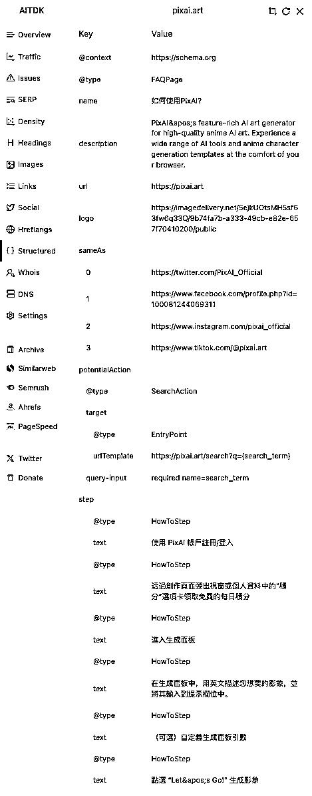

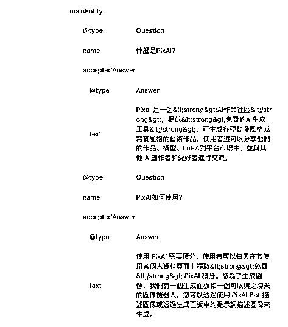

结构化数据（通常使用 Schema.org
的词汇）是一种标准化的格式，用来向搜索引擎提供关于页面内容的明确信息，并对页面内容进行分类。你可以把它理解成是给搜索引擎看的“内容注释”，帮助它百分之百地理解你的页面在讲什么。这能带来在搜索结果中显示“富媒体搜索结果”（Rich
Results）的巨大好处。

** *从这里我们能学到什么？***

1.  获得富媒体搜索结果 (Rich Results): 这是添加结构化数据最重要的目的。当用户搜索“如何使用 PixAI”或相关问题时，谷歌可能会直接在搜索结果页面把 pixai.art 的 FAQ 问答或 How-to 步骤展示出来。 这种展示方式比普通蓝字链接抢眼得多，能极大地提高点击率 (CTR)。

2.  提升搜索引擎的理解: 没有让搜索引擎去“猜”网站的内容，而是直接把标准答案喂给它。这种确定性有助于搜索引擎更信任我们的网站，可能给予更好的排名。

3.  分析对手，我们可以分析排名靠前的竞争对手都使用了哪些类型的结构化数据（FAQ? How-to? Product? Recipe?），然后“见贤思齐”，在我们的同类页面上也部署相应的数据。

**12、Whois（域名注册信息）**

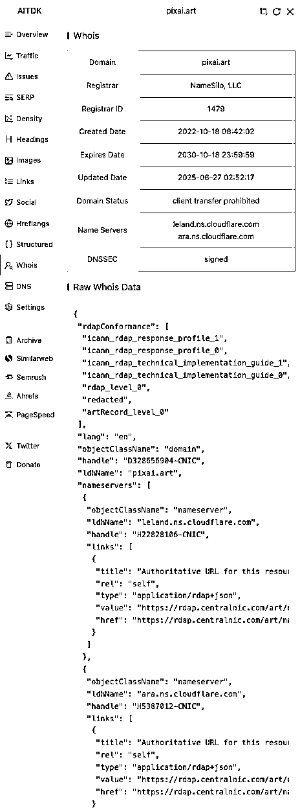

Whois 是一个公开的互联网记录查询协议，你可以把它理解成一个域名的“身份证”或“户籍信息”。它包含了这个域名是谁注册的、通过哪个公司注册的、何时注册、何时到期以及一些关键的技术设置。

1.  Domain (域名)、Registrar (注册商)、Created Date (创建日期)、Expires Date (过期日期)、Updated Date (更新日期)、Domain Status (域名状态)、Name Servers (域名服务器)、DNSSEC (域名系统安全扩展)、Raw Whois Data (原始数据)

***从这里我们能学到什么？***

1.  **了解技术栈** : 通过查看域名服务器，你可以知道竞争对手在用哪家服务商（如 Cloudflare, AWS, Google Cloud）。pixai.art 使用 Cloudflare 就暗示了他们对性能和安全的投入。

2.  **判断其投入和认真程度** : 查看创建日期和过期日期，可以推测项目的历史和所有者的长期承诺。像 pixai.art 这样长期续费，说明他们对这个项目很有信心。

**13、DNS（域名系统）**

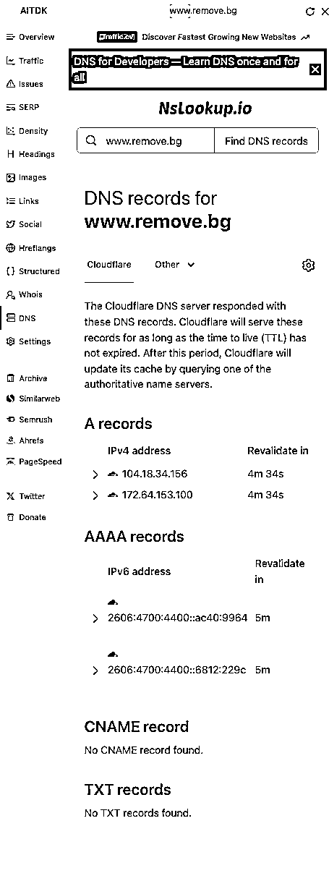

DNS (Domain Name System) 是互联网的核心服务之一。这个部分过于技术，对于我们分析网站来说用处不大，就不详细解说了。

**14、Settings（设置）**

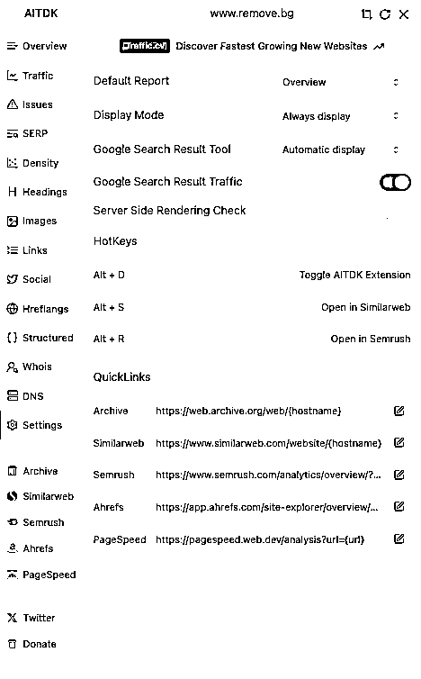

【Settings】菜单不是用来分析 [www.remove.bg](http://www.remove.bg) 的。相反，它是用来设置和配置 AITDK 这个扩展工具本身的，是为你自己服务的“控制面板”。

下面是 AI 提供的一些 settings 介绍说明，我贴在下方，平时我用的比较少，大家作为科普就好。

**常规设置**

1.  Default Report (默认报告): 这里设置为“Overview” 。这意味着每当你打开 AITDK 扩展时，它将默认首先展示【Overview】菜单的内容 。你可以根据自己的习惯将它改为“Traffic”或“Issues”。

2.  Display Mode (显示模式): 设置为“Always display” ，这可能控制着工具界面的显示方式。

3.  Google Search Result Tool (谷歌搜索结果工具): 设置为“Automatic display” ，这意味着当你在谷歌搜索页面时，AITDK 可能会自动显示一些相关的数据或工具。

4.  Google Search Result Traffic (谷歌搜索结果流量): 这个开关处于“打开”状态 。这是一个非常有用的功能，它可能会直接在谷歌的搜索结果列表里，为每个网站旁边显示预估的流量数据，让你在搜索时就能快速评估各个网站的实力。

5.  Server Side Rendering Check (服务器端渲染检查): 这个开关处于“关闭”状态 。这是一个针对特定技术（SSR）的检查功能，可以按需开启。

**HotKeys (快捷键)**

1.  Alt + D: 切换（打开/关闭）AITDK 扩展界面 。Alt + S: 在 Similarweb 中打开当前正在分析的网站 。Alt + R: 在 Semrush 中打开当前正在分析的网站 ()。

**QuickLinks (快速链接)**

实现快速跳转下面的工具网站

1.  **Archive** : 在 web.archive.org (网站时光机) 中查看该网站的历史快照 。

2.  **Similarweb** : 跳转到 Similarweb 查看更详细的流量分析报告 。

3.  **Semrush** : 跳转到 Semrush 进行全面的 SEO 分析 。

4.  **Ahrefs** : 跳转到 Ahrefs，这是一款强大的竞争对手研究和外链分析工具 。

5.  **PageSpeed** : 跳转到谷歌的 PageSpeed Insights 工具，分析网站的加载速度和性能表现。

**最后附加说明，AITDK 的下载方式**

针对 Chrome 浏览器用户：

1.  打开你的 Chrome 浏览器。

2.  访问 **Chrome 应用商店** 。

3.  在商店的搜索框中输入“**AITDK** ”。

4.  在搜索结果中找到 AITDK 扩展程序，通常会带有官方的图标。

5.  点击“**添加到 Chrome** ” (Add to Chrome) 按钮。

6.  在弹出的确认窗口中，点击“添加扩展程序” (Add extension)。

7.  安装完成后，AITDK 的图标通常会出现在浏览器右上角的工具栏中。

* * *

评论区：

希声 : 牛牛牛

王珣 : 感谢大佬支持[嘿哈]