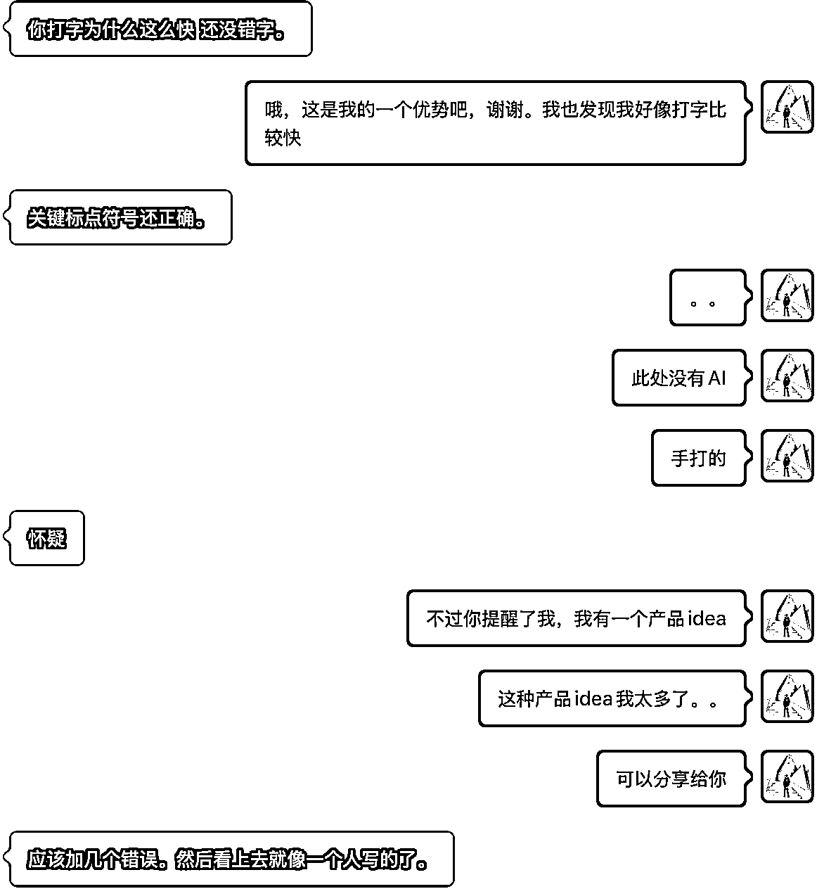
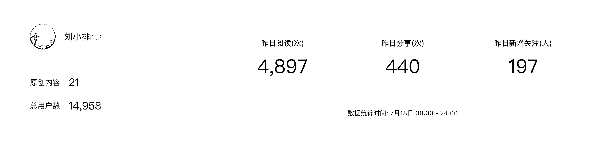
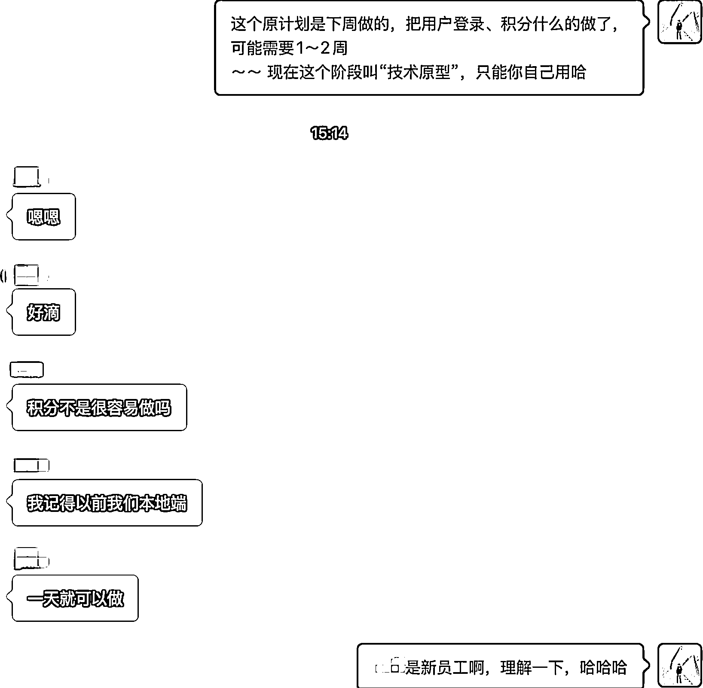

# (精华帖)(482 赞)人生提效方法：时间折叠

> 原文：[`www.yuque.com/for_lazy/zhoubao/gt5asfiyq96wkklm`](https://www.yuque.com/for_lazy/zhoubao/gt5asfiyq96wkklm)

## (精华帖)(482 赞)人生提效方法：时间折叠

作者： 刘小排

日期：2025-07-19

大家好，我是刘小排。

很多朋友觉得我工作效率很高，想知道我有什么窍门。还有些朋友觉得我是海王，因为他曾经误以为我在全心全意帮助他，没想到我还同时在帮助很多人，先骂了一声“渣男”，然后特别想知道我是如何有这么多时间的……

好的，我告诉大家。 答案就是——时间折叠。

“时间折叠”这个词，我是从潇洒姐王潇《五种时间》里学习到的。结合我自己的生活和工作，我做了一点点延伸。

# 一、原版的“时间折叠”是什么意思？

在潇洒姐原版的“时间折叠”里，她把时间分为了五种。分别是生存时间、赚钱时间、好看时间、好玩时间、心流世界。

原版的“时间折叠”，是尽量让自己把时间花到有多份收获的事情上。

**让同一段时间“多线并行”而非“分心并用”。**

例如

1.  做饭时练正念呼吸，兼顾营养和身材 → 同时兼顾了 生存 + 好看

2.  家庭远足时拍短视频并剪辑 → 同时兼顾了 好玩 + 赚钱 + 心流

潇洒姐是位美女，她的时间分类里还有一个叫“好看时间”。作为一个糙汉子，非常遗憾，我似乎不是特别能复用她的分类方式……
但这一点也不影响“时间折叠”方法论的含金量，这套方法论深深影响了我。

在 AI 时代，每个人的能力都可以被极度放大。 AI 让我们 90%的技能一文不值，让剩余 10%的技能价值百倍。

结合 AI 时代的特点，我对潇洒姐的时间折叠方法做了一点点升级。

# 二、基础提效

在我们正式进行之前，除了理解上文潇洒姐的原版“时间折叠”以外，你还需要用 AI 武装一下自己

请确保你已经完成了以下基础提效

1.  **使用语音输入法，而不是手动打字** 。 手机上，微信自带语音转文字，效果还不错；电脑上，国内最好语音输入法是豆包电脑版自带的语音输入法（请你自己安装豆包电脑版，找一找如何设置）。

2.  **保证每天你与 AI 沟通的时间，大于你与任何碳基生物沟通的时间** 。 请至少开通 ChatGPT Plus 会员。我同时开通了 Claude Max、ChatGPT Pro、Google AI Ultra，也用豆包和 Kimi。 我听说亦仁更狠，他每天使用 ChatGPT 的时间已经超过使用微信的时间了。

3.  **在你日常工作中，** 总结出几套能够充分**释放你注意力和时间的工作流程****。** 我是做软件产品的，因此我只需要用 AI 编程类工具就足够满足我工作了，例如 Cursor/Claude Code/AugmentCode/V0。如果你的工作处于其它领域，你可能需要 coze、豆包、RPA 等等。

以上是前提。 缺一不可。时间折叠，前提是你有时间可以被折叠，你说对吧？

如果你还没有准备好，下面的内容对你可能帮助不大，没有操作空间。建议你多看看生财有术的有关各类把日常工作用 AI 赋能的帖子，其中强烈推荐包子老师。

当准备好这些，就可以往下阅读了。

PS：关于打字，被 SCAI 一位创业者看出来了，哈哈哈哈 。 当时我噼里啪啦口喷了很多很多，回复速度极快，连一个标点符号都没错，漏出了马脚。_

# **三、第一次升级：把自己不得不做的事，折叠到喜欢做的事里。**

生财有术 SCAI 实验室的一位创业者，他有一个还不错的科技新闻类产品，有一些存量用户。上个月，他有一些纠结，一方面觉得自己手上这产品还不错、想要投入时间继续打磨，一方面又对 AI
Agent 感兴趣、想要投入时间钻研。不知道时间应该如何分配，他询问我的建议。

我告诉他：**你可以考虑用 AI Agent 的方法继续迭代新闻产品，把两件事变成同一件事。**

如果能把自己不得不做的事情，折叠喜欢的事情里，那你就完成了第一层时间折叠的升级。

我也一样。对我而言，唯一重要的事情是做产品，做产品，同时是我的优势、兴趣、赚钱、成就感的交集。

为什么我能同时做课程、SCAI 实验室、自己的产品呢？ 因为它们被我折叠到了同一件事情里：做产品。一切都是为了做产品。

做过产品的草根创业者很容易发现，做产品的一个秘密是“数量”。
例如生财出海卷王良辰美，在他还是新手的时候，短短一个季度之内上线了超过 100 个网站，一个季度内就实现了月入万刀，这是一个用数量踏平概率的游戏。

我没有良辰美那么卷，而且我希望做出更有质感的好产品。

那怎么在保证“品质”的前提下解决我的“数量”问题呢？ 我的答案就是把课程和 SCAI 折叠进来。

通过做课程，培养更多的人才；其中优秀的同学，我们可以邀请到 SCAI；其中再有缘分的同学，我们可以进行孵化和合作做产品。从而，三件事情，折叠成为了一件事情。

如果我发现某件事情无法折叠到我的主线任务里，我会毫不犹豫放弃。

例如，也有朋友觉得我写文章还可以，让我再开个写作的课程；再比如，由于处于生财有术这个环境，有非常多唾手可得能赚点快点的小生意；再比如，还有人觉得我用 AI 工具比较溜，让我去给企业做 AI 培训或者再开使用 AI 的课程
；再比如，有人觉得我用 Claude Code 有些影响力，建议我做中转版 Claude Code 的代理，少说每天可以躺赚千元……

以上这些的事情，我都不会动心，因为它们不能被折叠到我“做产品”这个主线任务里。

……

这一招，我们可以称之为“被动升级”。

还有“主动升级”吗？有的，请你接着看。

# **四、第二次升级：围绕主线，主动折叠更多的事为之赋能**

“做产品”是我的主线任务，那我 7 月的主线任务是什么呢？

7 月的主线任务是“发布 fast3d.io 这一款产品”。

现在的 AI 写代码真的太方便了，只要逻辑清晰，它可以自己卷自己很久的时间，其间并不需要我的参与。

那么，在 AI 工作的间隙，我还可以做些什么呢？

没错，我可以围绕主线，这多功能折叠更多的事情，帮助主线。

哪些事情可以帮助到主线呢？

我首先想到的是做自己的公众号，因为公众号可以成为发布我自己产品、发布 SCAI 创业者产品的阵地，能够赋能到主线。

因此，本月我顺便写了一下公众号。 一个月时间，从 2000 粉丝涨到了 1.5 万粉丝。其中阅读量最高的帖子单篇有 4.7 万阅读。

写公众号文章对我来说很轻松，不需要占用额外的时间，我也不需要去洗稿。（ 倒是有很多其他人洗我的稿，洗得比我原版还火，有些人连标题都不改一下。）

因为我只是正常用 AI 工具来帮我做产品而已，顺手记录一下对新工具使用的心得、截图，就可以发布了。

我从来没忘记自己 7 月的主线任务是“发布 fast3d.io 这一款产品”，因此，即便在我写公众号文章的时候，遇到机会，我也会顺便宣传一下新产品。

你可以点击[这里](https://mp.weixin.qq.com/s/5O3Yd2iyxV-2gN7zuucd1A)和[这里](https://mp.weixin.qq.com/s/Fmc87uTvDp1kz5dt0EvI7A)，看看我是怎么顺便把自己的新产品预埋进去的。

**读者并不反感我的在文章里写自己的产品，相反，它们还期待我写更多。**

因为，国内绝大部分 AI 自媒体，根本不会自己写代码、也做不出来能赚钱的产品，它们的公众号文章只不过是随便写几个小的 demo、做几个小学生级别的功能，就已经可以获取流量了。
像我这样，用真实世界能赚钱的产品来评测 AI 编程工具的人，屈指可数，这便成为我的独特之处。

还有哪些事情可以被折叠进来，帮助到主线呢？

我想到的第二件事是培养员工。

团队已经有 7 个人了，没有人是专职程序员，大部分是和我有缘、愿意相信我的朋友。他们还有一个共同点：完全不会写代码，需要现学。

员工需要时间学习和培养，怎么办呢？

我的方法是让他们直接动手做产品。

哪怕这个过程慢一点，但是可以锻炼到他们，从而可以加速到我下一次的产品研发过程。

正好，生财有术有一位多年老友，他最近总是找我咨询他的行业如何用 AI 赋能，告诉我市面上的工具都满足不了他的需求。了解完他的需求后，我决定直接让新员工帮他做了。全程我不参与，只提供频率为每两天一次的思路指导。
没想到做得还不错，这位朋友初步表示满意，目前看来，似乎有希望做成真实产品去服务更多用户。

（这位朋友是谁，具体做的啥，暂时不方便透露。我得先等产品做完。没准两周后你就知道了。如果两周后你还不知道，说明这个产品做失败了，那就让我偷偷失败吧，嘿嘿。）

短期内进度较慢，客户甚至有些困惑，如下图所示）。但是长期内可以帮助我更快。

当我们认清了自己的主线任务，就有足够的耐心。

好了，员工也给照顾好了，朋友也给照顾了。

我还有时间，

还可以干什么吗？

我折叠进来的第三件事情，是关注新的 AI 产品、新的 AI 技术。

在我写代码的同时，打开了很多很多的网页，有的是电子书，有的是论文，有的是其他优秀 AI 产品。

不过，我一段时间只能干一件事。我也建议你这样做。

上午时段，主要是看新技术和论文；下午时段，主要是看别人的优秀 AI 产品；到了晚上如果还有时间，就看看书。

AI 写代码很慢，我时间竟然还有富余。

还有哪些事情可以被我折叠进来，进一步帮助到主线呢？

我想到了第四件事，帮助 SCAI 的创业者。

前面讲过，帮助 SCAI 的创业者，最终也可以帮助到我。

近期我招聘了一个以前在奇绩创坛工作过的员工，并且给她安排了任务，鼓励她和 SCAI 的每个同学交流。希望能够从投资人、从市场的角度，帮助到这些创业者。

更巧的是，SCAI 里有一位创业者，上周正好接到了奇绩创坛的面试邀约。刚才她俩通话了一小时，双方都觉得很有收获，都觉得得到了帮助。

只不过是牵线了一下，顺便又成海王了。

不重要了。

我们继续。

AI 写代码实在是太慢了，忍不了。

还有哪些事情可以被我折叠进来，进一步帮助到主线呢？

我想到了第五件事—— 顺便在生财有术做个分享吧。

一方面，在生财有术做分享，我很开心，如果有幸能够帮助到你，我就更开心了；一方面，希望能够吸引更多有缘的创业者进入 SCAI 实验室；最后，我也许可以在里面顺便提一提我的 Fast3D 产品……

于是，在我兴高采烈写代码的一个平凡的日子，你看到了本文。 😄

# **总结**

1.  人生提效的方法是“时间折叠”。

2.  “时间折叠”的前提是“你突然有了更多时间”。如果没有，请先完成基础提效部分，尊重这个时代。

3.  在 AI 时代，每个人的能力都可以被极度放大。 AI 让我们 90%的技能一文不值，让剩余 10%的技能价值千倍。 因此，我们可以折叠更多时间。

4.  聚焦是万能之法。一定要围绕自己的主线任务。如果某件事情无法被折叠到你的主线任务里，应该果断放弃。

5.  原版：让同一段时间“多线并行”而非“分心并用”。

6.  第一层升级：被动升级。把自己不得不做的事，折叠到喜欢做的事里。

7.  第二层升级：主动升级。围绕主线，主动折叠更多的事为之赋能。

* * *

评论区：

大猫 Coral : 语音转文字用了挺久了，用过就回不去的功能。 感谢分享❤️ 让同一段时间“多线并行”而非“分心并 用 第一层升级:被动升级。把自己不得不做的
事，折叠到喜欢做的事里。 ·第二层升级:主动升级。围绕主线，主动折叠更多的事为之赋能。 焦是万能之法。一定要围绕自己的主线任
务。如果某件事情无法被折叠到你的主线任务里，应该果断放弃。

欢欢@生财有术 : 时间折叠大法好哇[强]

Ash 焚芯 : 但凡能够做成什么事 有惊人之举的 一定是以自我意识为主导

桑葚 : 太有用了，刚好需要

李先飞 : 小排老师每一篇都是精品，很有收获[强]

斯斯超 nice : 看了小排老师的文章，我想成为那个有缘的创业者进入 SCAI 实验室，不知道怎么才有机会[呲牙]

刘小排 : 在生财有术搜索「SCAI」

斯斯超 nice : 好的，刘老师

DHJ : 「每日学习刘小排」之今日份，已收到！