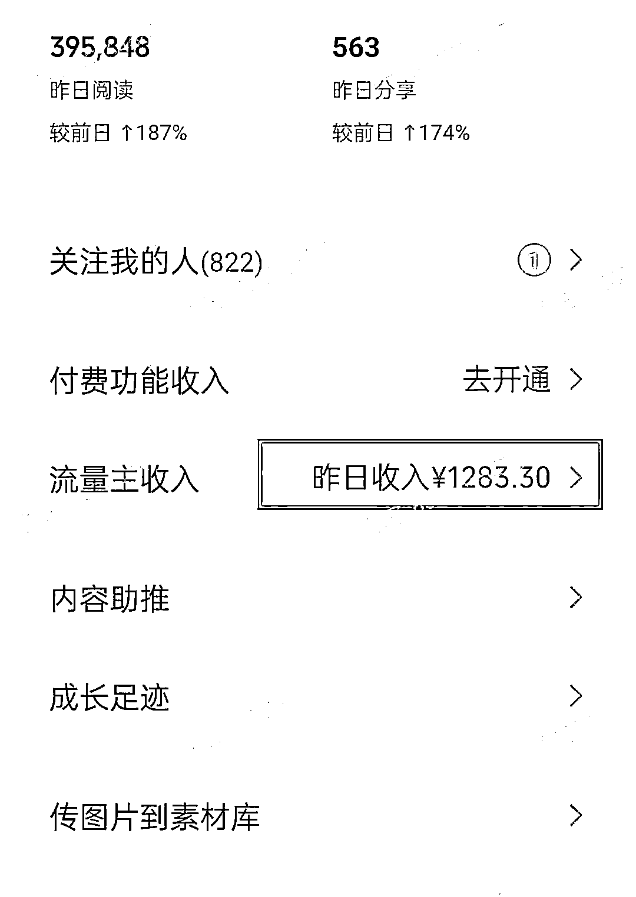

# (精华帖)(98 赞)公众号流量主：不卷长文，豆包+剪映，分分钟搞定 AI 漫画，也能日入四位数？

> 原文：[`www.yuque.com/for_lazy/zhoubao/mioyucnfuhpl442g`](https://www.yuque.com/for_lazy/zhoubao/mioyucnfuhpl442g)

## (精华帖)(98 赞)公众号流量主：不卷长文，豆包+剪映，分分钟搞定 AI 漫画，也能日入四位数？

作者： 格子

日期：2025-07-23

hi，各位圈友们大家好，我是格子，做自媒体三年来一直聚焦于公众号流量主变现。

**今天这篇内容，我觉得价值千金，就看它能不能等到有缘人了。**

**最近公众号流量主，我在测试 AI 漫画领域，并且测试了自己做内容 VS 搭建工作流创建智能体做内容，日入 1000+很轻松。**

**AI 漫画真的是一个被大多数人忽视的新风口，这个领域潜力巨大，而且正处于爆发前夜！**

这种漫画，不是指那种复杂连载漫画，而是几张图配几句点睛文字的“轻漫画”形式。

标题通常带数字盘点感：**“这 5 位明星的逆袭之路”、“00 后最赚钱的 10 种职业”、“情侣相处最忌讳的 3 件事”……**

**最惊人的是，这种形式正在席卷公众号的流量池，平台对这种展现形式的内容正在拼命地给流量，有些号真的是天天 10w+大爆款。**

**那些曾经依赖长文打天下的领域，现在正被 AI 漫画强势重构！**

**  **

内容比较长，更详细的内容请移步飞书阅读：[`p2tkpuv6qm.feishu.cn/docx/R4rodS884oPwuhxFbFQcfb93nCe?from=from_copylink`](https://p2tkpuv6qm.feishu.cn/docx/R4rodS884oPwuhxFbFQcfb93nCe?from=from_copylink)

* * *

评论区：

o 泡 : 👍

o 泡 : 赞

锦拾年（同路人） : 先赞后看