# (39 赞)你让 AI 生成的配图很丑？因为你从第一步就错了！3 步做出专业设计师级配图！

> 原文：[`www.yuque.com/for_lazy/zhoubao/ehkkml06f4s9cr7n`](https://www.yuque.com/for_lazy/zhoubao/ehkkml06f4s9cr7n)

## (39 赞)你让 AI 生成的配图很丑？因为你从第一步就错了！3 步做出专业设计师级配图！

作者： sky 陈天

日期：2025-07-25

各位生财圈友大家好，我是 sky 陈天，一名 AI 企业培训讲师、企业 AI 业务提效顾问。

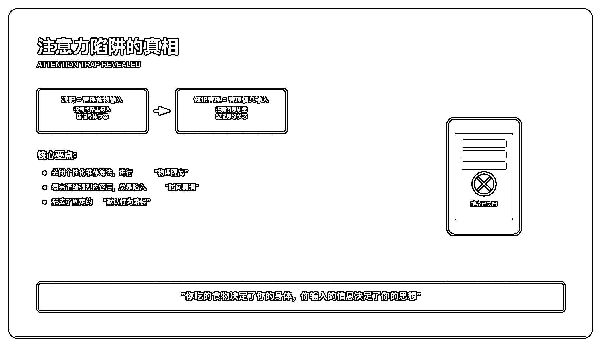

很多小伙伴反馈上周写的文章的配图还挺好看的[一个简单的提示词，ChatGPT 帮我打破了 5
年的行为惯性](https://uyna8i1s6g.feishu.cn/wiki/JXfiwcTsEir8yrkAfyVc4xF9nFc?fromScene=spaceOverview)，问我是怎么做的，作为一个
AI 博主，我肯定是用 AI 生成的啊，其实背后的方法非常简单。

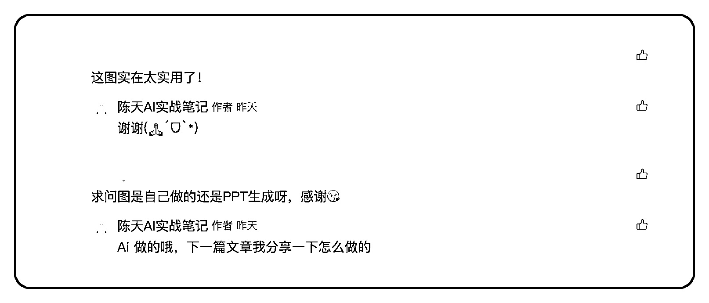

而且更重要的是——这个方法不只是做图，几乎所有内容输出（文章、方案、PPT、营销页），都能用同样的方法快速完成。

**所以今天我不仅分享这个图是怎么做的，我还教会大家底层的方法** ，以后所有风格的图都可以用类似的方法来实现。

具体做法只有三个步骤：

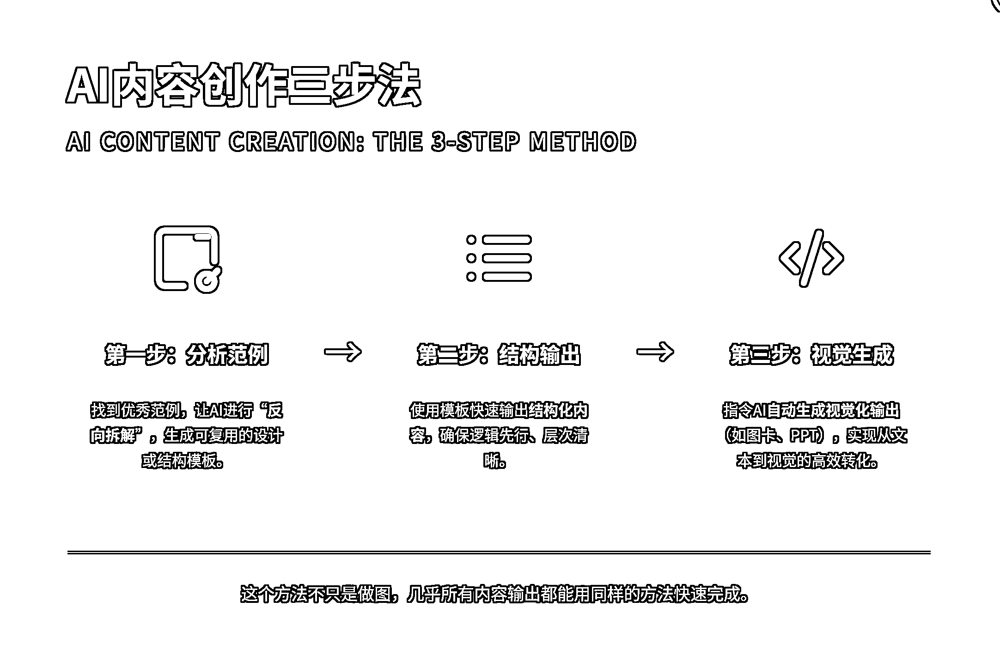

## 第一步：找到优秀范例，让 AI“反向拆解”

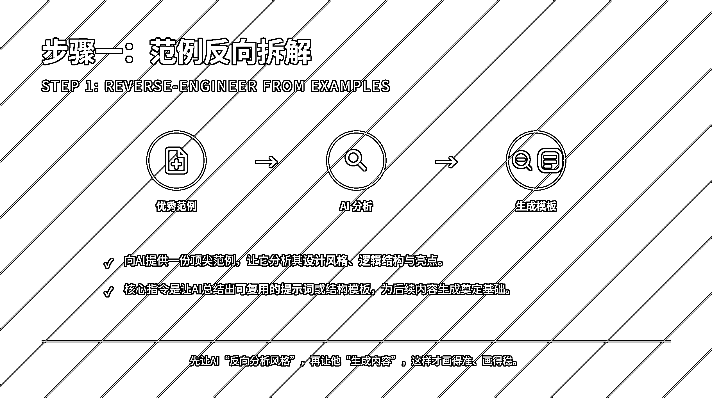

不管你要写文章、做 PPT 还是设计产品页面，最聪明的做法都是：

1.  找到一份你觉得做得非常优秀的范例。

2.  让 AI 对这份优秀的内容进行分析，总结出它的结构、逻辑、风格、亮点。

你只需要对 AI 说一句话：

“请你分析这份内容，告诉我它是如何设计的，并总结出可复用的模板。”

这样 AI 就能自动生成一份清晰、可复用的提示词或结构模板。

比如这个案例，我就是找了一份看起来视觉效果很好的图片，发给了 AI，让他帮我总结风格写提示词

你是一个专业的 UI 设计师，我现在想让 AI 帮我生成类似于这样的一个知识卡片，我发送一段内容，AI
帮我拆解生成这样风格的卡片，我需要你帮我逆向这个风格，并且生成一段通用的提示词，用 Markdown 格式给到我

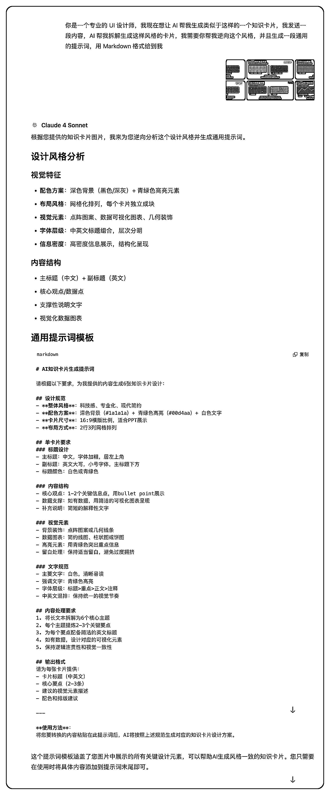

这样我们就快速得到了一个科技风格的提示词

# AI 知识卡片生成提示词

请根据以下要求，为我提供的内容生成知识卡片设计：

## 设计规范

-  **整体风格**：科技感、专业化、现代简约

-  **配色方案**：深色背景（#1a1a1a）+ 青绿色高亮（#00d4aa）+ 白色文字

-  **卡片尺寸**：16:9 横版比例，适合 PPT 展示

## 单卡片要求

### 标题设计

- 主标题：中文，字体加粗，居左上角

- 副标题：英文大写，小号字体，主标题下方

- 标题颜色：白色或青绿色

### 内容结构

- 核心观点：1-3 个关键信息点，用 bullet point 展示

- 数据支撑：如有数据，用简洁的可视化图表呈现（线图、柱状图、趋势图等）

- 补充说明：简短的解释性文字或金句总结

### 视觉元素

- 背景装饰：点阵图案、几何线条或网格纹理

- 数据图表：简约风格的可视化元素

- 高亮元素：用青绿色突出重点信息

- 留白处理：保持适当留白，信息层次清晰

### 文字规范

- 主要文字：白色，清晰易读

- 强调文字：青绿色高亮

- 字体层级：标题>重点>正文>注释

- 中英文混排：保持统一的视觉节奏

## 内容处理流程

1.  **内容分析**：首先分析提供的内容，识别核心主题数量

2.  **询问确认**：询问用户希望生成几张卡片（建议范围：3-8 张）

3.  **主题提炼**：将内容拆解为对应数量的核心主题

4.  **要点归纳**：每个主题提炼 2-3 个关键要点

5.  **视觉设计**：为每个主题设计对应的视觉元素

## 输出格式

对于每张卡片提供：

-  **卡片标题**（中英文）

-  **核心要点**（2-3 条 bullet points）

-  **视觉元素建议**（图表类型、装饰元素等）

-  **重点文字**（需要青绿色高亮的关键词）

-  **底部金句**（如适用）

## 使用步骤

1. 用户提供要转换的内容

2. AI 分析内容并询问："根据您的内容，我建议生成 X 张卡片，您希望生成几张？"

3. 用户确认数量后，AI 按规范生成对应的卡片设计方案

---

**请在此处粘贴您要转换的内容：**

[用户内容区域]

## 第二步：用模板快速输出结构化内容

新开一个对话（一定要新开），把刚才的提示词复制出来。把你要生成的内容附在最后。

比如我是把我写好的整篇文章发给 Claude，也就是附在提示词的最后

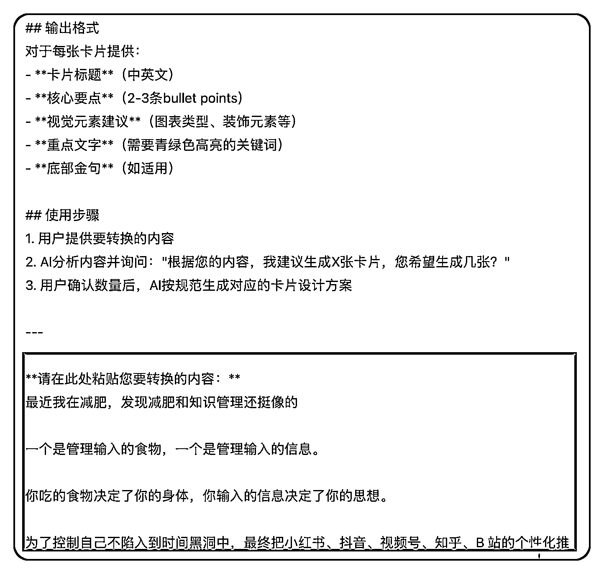

它很聪明地把我这篇文章拆成了 6 张卡片，分别对应：

1.  问题识别

2.  本质分析

3.  行为路径

4.  解决方案

5.  核心建议

6.  金句收尾

每张卡片都有：

1.  中英标题

2.  核心 bullet 要点

3.  高亮金句（青绿字体）

4.  视觉建议（用什么图、怎么布图）

而且内容逻辑非常清晰，基本不需要我二次修改。

为什么要有这一步，因为我们先定好设计的需求，再让他做卡片，相当于有一份设计的文档，更加可控。

## 第三步：让 AI 自动生成视觉化输出

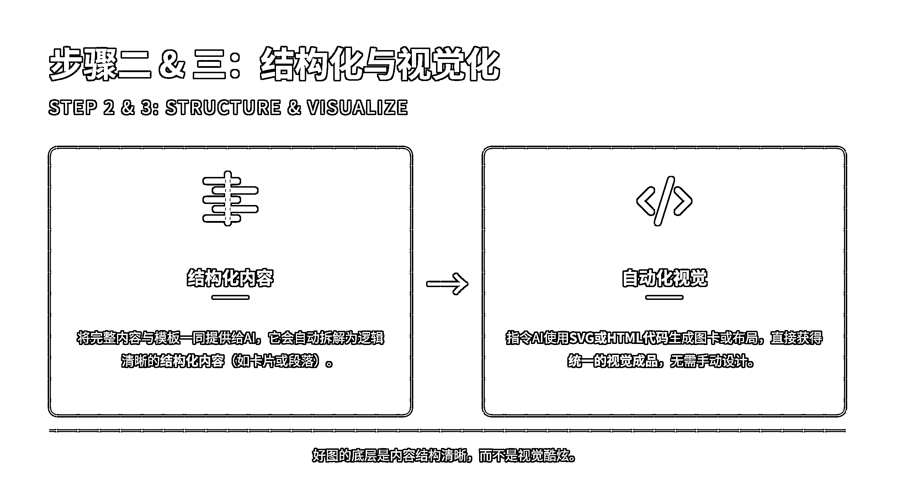

如果需要视觉化呈现（图卡、PPT、流程图），直接和 AI 说，让他用 SVG 或者 html 来生成代码，它就能快速生成统一风格、专业感十足的视觉内容。

如果是 SVG 的话，建议用 claude 的 atifact，我用的是 monica 功能的，如果没有 monica 或者 claude
的，建议可以直接用 html 来生成，前端页面就可以直接看到效果。

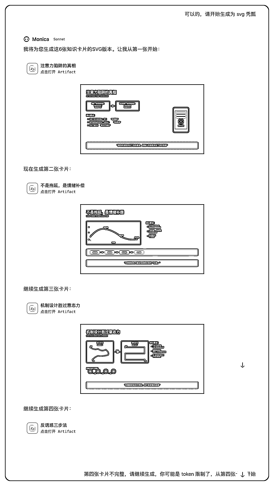

你完全不用花时间设计，几分钟内就能完成高质量输出。

今天这篇文章视觉效果感觉更好一些，用的是 Gemini 2.5pro，html 生成的。

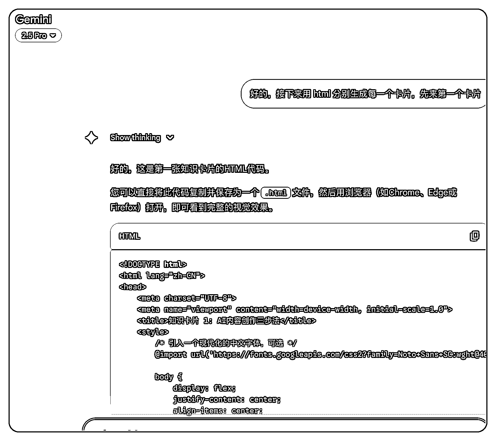

没有 Gemini 的同学可以试试 DeepSeek，效果也很不错。

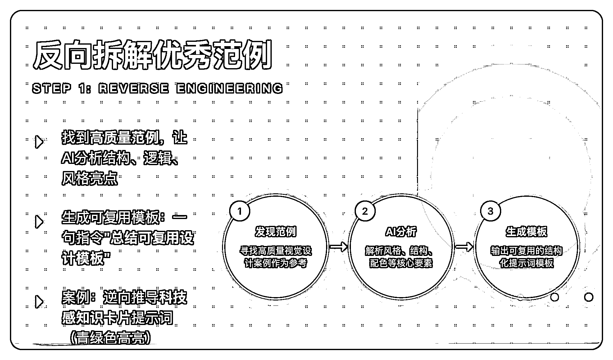

## 总结一下：大多数人想不到的 4 个 AI 用法

这套方法看起来简单，但其实背后隐藏着很多人没掌握的 AI 使用原则：

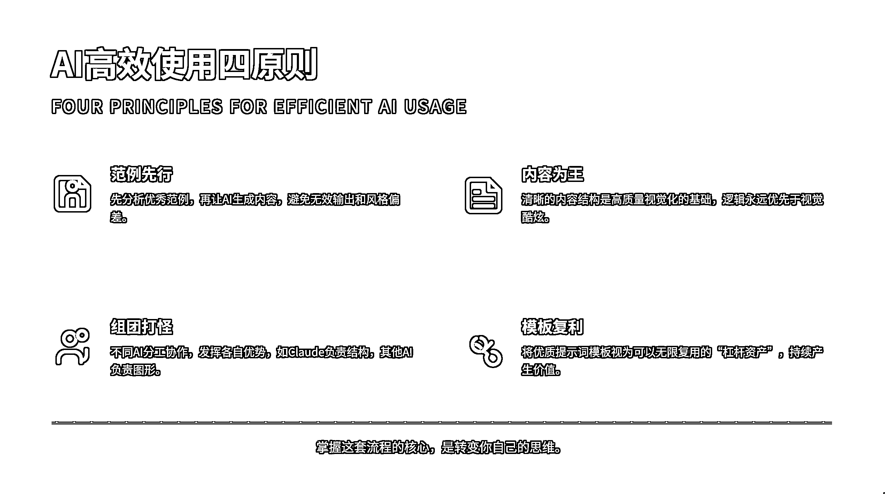

### 1.  **别一开始就让 AI “生成图”**

很多人一上来就让 AI 画一个漂亮的图，最终 AI 给的东西很丑。

因为 AI 理解的漂亮和你理解的可能完全不一样。

正确方式是：先找**优秀范例** ，让 AI 先“反向分析风格”，生成提示词模版，这样才画得准、画得稳。

这种“范例反向分析+结构化模板+视觉自动生成”的方法，本质上就是使用了 AI 的少样本学习能力，让他快速模仿。

### 2.  **内容优先，图只是包装**

好图的底层是内容结构清晰，而不是视觉酷炫。用 AI 把内容结构拆清楚，图自然好看。

### 3.  **AI 要“组团打怪”而不是“一把抓”**

不同的 AI 擅长的功能不一样，比如 claude 的代码和审美比较强，那用他来写代码是最好的。

一个 AI 负责理解和结构，claude 或者 Gemini 负责生成图形。

不要指望一个 AI 干完所有事，而是**分工协作、流水线配合** 。

### 4.  **提示词模板是复利资产**

一旦做出一套结构清晰、风格统一的提示词模版，可以复用无数次，变成你表达力的“杠杆”。

掌握了这一套流程，不管是图卡、文章、PPT 还是方案，你都能用 AI 快速做出高质量内容。

AI 时代最重要的不是技能，而是 AI 使用的能力、思维，审美和创造力。

努力做一个 public builder ！

* * *

评论区：

亦荃 : 很赞的思路

o 泡 : 👍

Mira 米拉 : 这篇文章好实用

努力进取 : 思路[强]

R.Z : 不知道这个有没有飞书链接，我想放在飞书里面经常打开看看👀