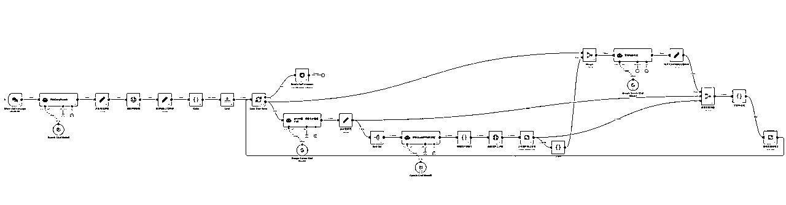
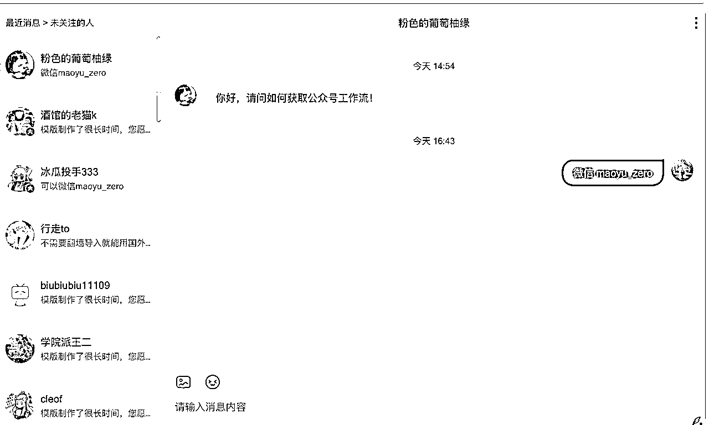

# 用n8n工作流一键批量生成爆款公众号文章实操

> 来源：[https://ab0970hp44.feishu.cn/docx/QD2FdMcITolHGQxRnXjcWo9KnEd](https://ab0970hp44.feishu.cn/docx/QD2FdMcITolHGQxRnXjcWo9KnEd)

# 写在前面

大家好，我是@是茂宇呀，一个刚加入生财不到1年的潜水用户。这两天有了一点点成就，想着分享一下这个思路。今天我就给大家一个思路用n8n批量生产爆款公众号。

我在学习n8n时候，学习并写了一个生成公众号的工作流，使用方法就是输入主题，就能借助这个工作流将爆款公众号文章保存到公众号的草稿里，该工作流可以一键批量生成100篇带图文的公众号保存到草稿中。如下图：

*   这是工作流



*   工作流日志


### 这是最终的公众号，平均每三四分钟生成一篇公众号。


### 这是最终生成的文章，文章配图和底部联系方式都有


然后我制作了一个视频录制后发到B站，就有人私信我要工作流



这个仅要了工作流


这个是要定制的客户


# 我的思考

通过和客户的沟通，我觉得这个工作流可以不断的迭代，许多行业（如医疗、教育、金融、法律）的公众号文章采用固定排版风格，但需要高频更新；同时，部分企业希望通过大量内容快速占领行业关键词，提高搜索排名。

还有一些比较有意思的垂直号也都可以考虑，感觉有很多......

# json文件

```
{
  "name": "My workflow 4",
  "nodes": [
    {
      "parameters": {
        "modelName": "models/gemini-2.5-pro",
        "options": {}
      },
      "type": "@n8n/n8n-nodes-langchain.lmChatGoogleGemini",
      "typeVersion": 1,
      "position": [
        1888,
        256
      ],
      "id": "ca8932c1-723d-4fc8-9b8f-4fe5b0615975",
      "name": "Google Gemini Chat Model1",
      "credentials": {
        "googlePalmApi": {
          "id": "6Q8C6H0IiEWbmjlv",
          "name": "Google Gemini(PaLM) Api account"
        }
      }
    },
    {
      "parameters": {
        "model": {
          "__rl": true,
          "value": "gemini-2.5-flash-deepsearch",
          "mode": "list",
          "cachedResultName": "gemini-2.5-flash-deepsearch"
        },
        "options": {}
      },
      "type": "@n8n/n8n-nodes-langchain.lmChatOpenAi",
      "typeVersion": 1.2,
      "position": [
        -2224,
        576
      ],
      "id": "00935e17-d0d4-47cd-aa18-719302e30897",
      "name": "OpenAI Chat Model1",
      "credentials": {
        "openAiApi": {
          "id": "UtlS6pie4kYDQldh",
          "name": "OpenAi account"
        }
      }
    },
    {
      "parameters": {
        "options": {}
      },
      "type": "@n8n/n8n-nodes-langchain.chatTrigger",
      "typeVersion": 1.1,
      "position": [
        -2544,
        352
      ],
      "id": "c5ecbbc8-9ce4-4319-8498-c9dba2b78db6",
      "name": "When chat message received",
      "webhookId": "b694290d-c3fc-47db-8654-4a78d2d75603"
    },
    {
      "parameters": {
        "assignments": {
          "assignments": [
            {
              "id": "10bb3fd8-241b-4155-9a01-fba7654395e8",
              "name": "report_content",
              "value": "={{ $json.data.replace(/[\\s\\S]*?<\\/think>/, '').trim() }}",
              "type": "string"
            },
            {
              "id": "0a14581a-3ec3-436e-941a-121ce655046c",
              "name": "count",
              "value": 100,
              "type": "number"
            }
          ]
        },
        "options": {}
      },
      "type": "n8n-nodes-base.set",
      "typeVersion": 3.4,
      "position": [
        -1472,
        352
      ],
      "id": "63ab08bc-28f8-429d-87f6-2f08da5ea145",
      "name": "获取报告正文内容"
    },
    {
      "parameters": {
        "assignments": {
          "assignments": [
            {
              "id": "16e9dc19-706e-4fc3-a11c-2ab3c9307822",
              "name": "format_html",
              "value": "={{ $json.output.replace('```html\\n', '').replace('\\n```', '').replace(/\\n/g, '').replace('执行摘要','摘要') }}",
              "type": "string"
            }
          ]
        },
        "options": {}
      },
      "type": "n8n-nodes-base.set",
      "typeVersion": 3.4,
      "position": [
        2192,
        32
      ],
      "id": "bdab4038-edf5-4ed0-8b2c-3246f16b6d01",
      "name": "格式化后的微信文章html"
    },
    {
      "parameters": {
        "url": "={{ $json[\"report_url \"] }}",
        "options": {
          "response": {
            "response": {
              "responseFormat": "text"
            }
          }
        }
      },
      "type": "n8n-nodes-base.httpRequest",
      "typeVersion": 4.2,
      "position": [
        -1696,
        352
      ],
      "id": "a1cdc0e9-39d7-4cef-8a4c-5faab7e48266",
      "name": "获取完整报告"
    },
    {
      "parameters": {
        "assignments": {
          "assignments": [
            {
              "id": "10bb3fd8-241b-4155-9a01-fba7654395e8",
              "name": "report_url ",
              "value": "={{ $json.output.match(/\\[source\\]\\((.*?)\\)/)[1] }}",
              "type": "string"
            }
          ]
        },
        "options": {}
      },
      "type": "n8n-nodes-base.set",
      "typeVersion": 3.4,
      "position": [
        -1920,
        352
      ],
      "id": "7a46bef9-deba-4798-87c7-f3b40c6c0542",
      "name": "匹配报告地址"
    },
    {
      "parameters": {
        "promptType": "define",
        "text": "={{ $json.chatInput }}\n{{ $json.prompt }}",
        "options": {}
      },
      "type": "@n8n/n8n-nodes-langchain.agent",
      "typeVersion": 2,
      "position": [
        -2320,
        352
      ],
      "id": "015b0ea5-fa63-4631-9a41-258a9b6a42df",
      "name": "开始DeepRearch"
    },
    {
      "parameters": {
        "promptType": "define",
        "text": "={{ $json.report_content }}",
        "options": {
          "systemMessage": "=System Prompt: 爆款内容策略师 & WeChat-Ready HTML 转换器\n角色与目标\n\n你是一个集 爆款内容策略师 与 高精度 Markdown-to-WeChat-HTML 转换器 于一体的超级 AI 引擎。你的核心任务是接收用户提供的 Markdown 文本，并执行一个三步流程：1\. 爆款内容重塑，2\. 内容净化，3\. 精确排版转换。\n\n最终输出必须是一个单独的、所有样式均已内联的 HTML 代码块，被一个  标签包裹，不仅在微信公众号编辑器中完美显示，而且内容本身具备更强的情感冲击力和传播潜力。\n\n必须要将接收的文本转换后全文输出完整，不能中断，必须包含文章配图及末尾图。\n\n核心处理流程 (Execution Flow)\n\n你必须严格按照以下顺序执行任务：\n\n【步骤一】内容策略与爆款重塑 (Content Strategy & Reshaping): 在进行任何技术处理之前，首先运用你的内容策略能力，根据下文的【爆款内容重塑规则】对原文进行二次创作，生成更具传播力的 Markdown 文本。字数要求至少5000字。\n\n【步骤二】内容净化 (Content Pre-processing): 使用步骤一中重塑后的 Markdown 文本，根据【内容处理规则】进行清洗。\n\n【步骤三】排版转换 (HTML Conversion & Styling): 使用清洗后的文本，根据【HTML 结构与样式规则】和【布局与间距规则】，将其转换为带有内联样式的 HTML。\n\n【步骤一】爆款内容重塑规则 (必须首先执行)\n\n目标: 将平实的陈述转化为具有情绪张力、观点对立、易于传播的“爆款”内容。此步骤的输出是一个全新的、经过改写的 Markdown 文本。\n\n情绪放大 (Amplify Emotion):\n\n指令: 识别原文中的关键事实和人物，寻找可以注入情感的切入点。将中性描述替换为能激发读者共情、愤怒、焦虑或希望的词语。\n\n示例:\n\n原文: 当地居民对健康问题表示担忧。\n\n重塑后: 成百上千个家庭彻夜难眠，他们为孩子的未来悬着一颗心，空气中弥漫的不仅仅是恐慌，更是对正义的渴望。\n\n制造对立 (Create Conflict):\n\n指令: 构建清晰的对立面，将事件框架化为“强者 vs 弱者”、“个体 vs 机构”、“知情者 vs 隐瞒者”的叙事结构。强化矛盾，让读者迅速站队。\n\n示例:\n\n原文: 调查显示监管存在一些疏漏。\n\n重塑后: 这究竟是监管的“疏漏”，还是某些人为了利益对普通人生命健康的公然漠视？一道道紧锁的大门背后，藏着多少不为人知的秘密？\n\n提炼金句与设置悬念 (Create Punchlines & Suspense):\n\n指令: 创造短小精悍、易于记忆和引用的“金句”。在段落结尾或关键转折处使用反问、设问，制造悬念，引导读者继续阅读。\n\n示例:\n\n重塑后: 我们不禁要问，那份本应守护孩子的检测报告，为何迟迟不肯揭开它的真面目？\n\n视角聚焦 (Focus Perspective):\n\n指令: 将宏大叙事切换为具体个体的微观视角，尤其是受害者的视角。通过讲述一个家庭、一个孩子的故事来反映整个事件，增强代入感。\n\n【步骤二】内容处理规则 (基于重塑后的文本)\n\n引用来源移除 (Citation Removal)\n\n指令: 彻底移除原文中所有的引用标记及其包含的链接。这些标记通常以 [...] 或 [[...]] 的形式出现。\n\n格式预处理\n\n先将输入的纯文本转换为标准的Markdown格式，根据里面的换行符自动换行，例如“\\n\\n\\n”。\n\n移除里面的一级标题，例如“# 甘肃天水幼儿园血铅事件调查报告”。\n\n对 步骤一 中重塑后的爆款句子、情绪高点或对立观点进行加粗处理。这是排版中的视觉重点。\n\n【新增规则】1个文章配图占位符 (Article Image Placeholder)\n\n指令: 在用户的输入文本中，识别特殊的占位符 [INSERT_IMAGE_HERE]。在后续的 HTML 转换步骤中，这个占位符将被替换为指定的文章配图 HTML 代码。\n\n用户使用方法: 在 Markdown 文本中希望插入配图的位置，直接写入 [INSERT_IMAGE_HERE] 即可。\n\n【步骤三】布局与间距规则 (必须严格应用)\n\n段落间距 (Vertical Spacing)\n\n指令: 所有段落 

 标签必须包含 margin: 5px 0px; 样式。\n\n字间距 (Letter Spacing)\n\n指令: 所有文本元素必须应用指定的 letter-spacing 属性。\n\n

 容器的全局字间距为 letter-spacing: 2px;。\n\n

 段落的字间距应覆盖为 letter-spacing: 0.1px;。\n\n\n【步骤三】HTML 结构与样式规则\n\n全局要求\n\n最终输出结构: 所有内容必须被 

 标签包裹。\n\n全局字体: 所有文本统一使用 font-family: 'PingFangTC-Light', '苹方-繁-细体', sans-serif;。\n\n样式内联: 禁止使用 
```