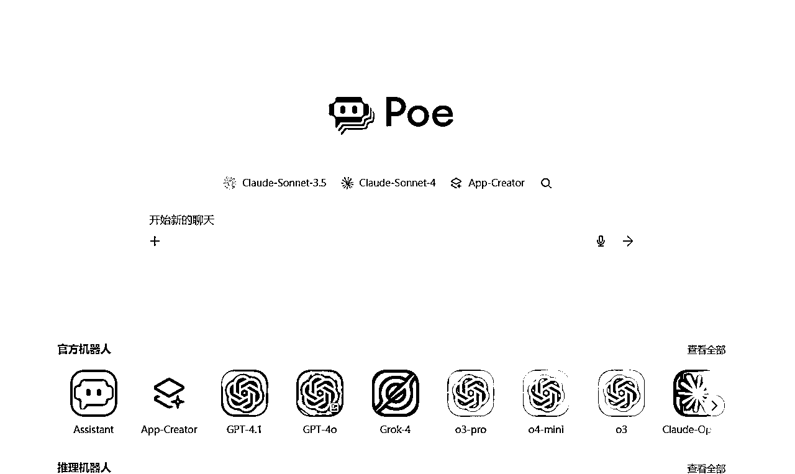
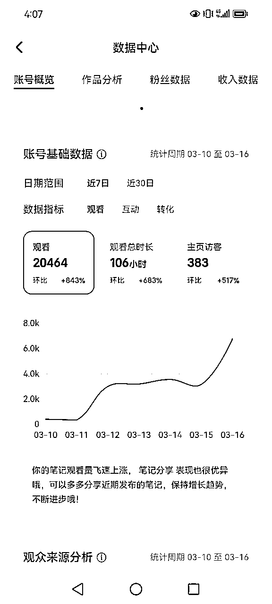
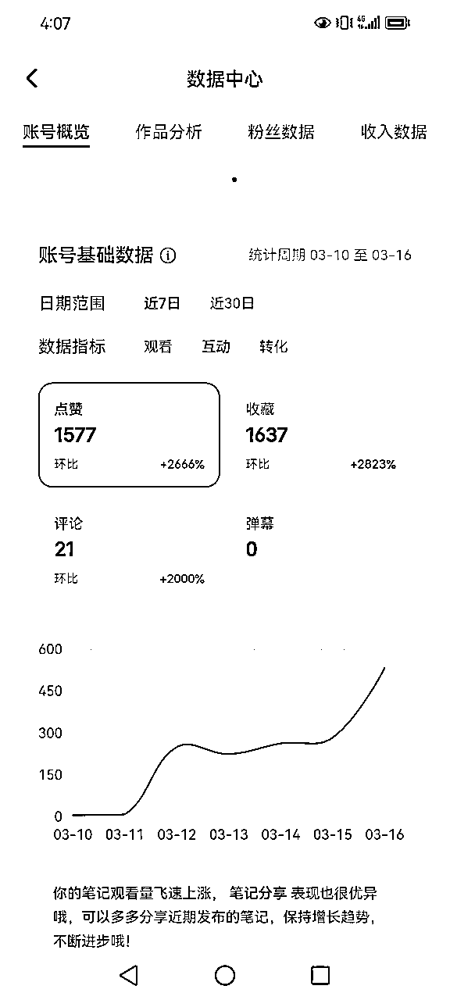
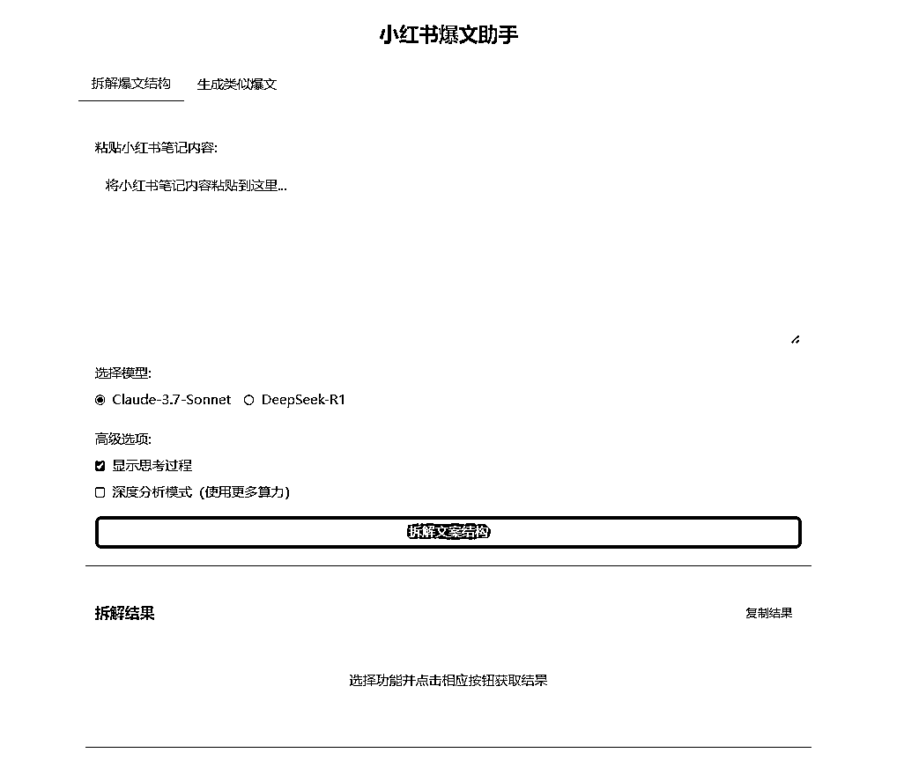
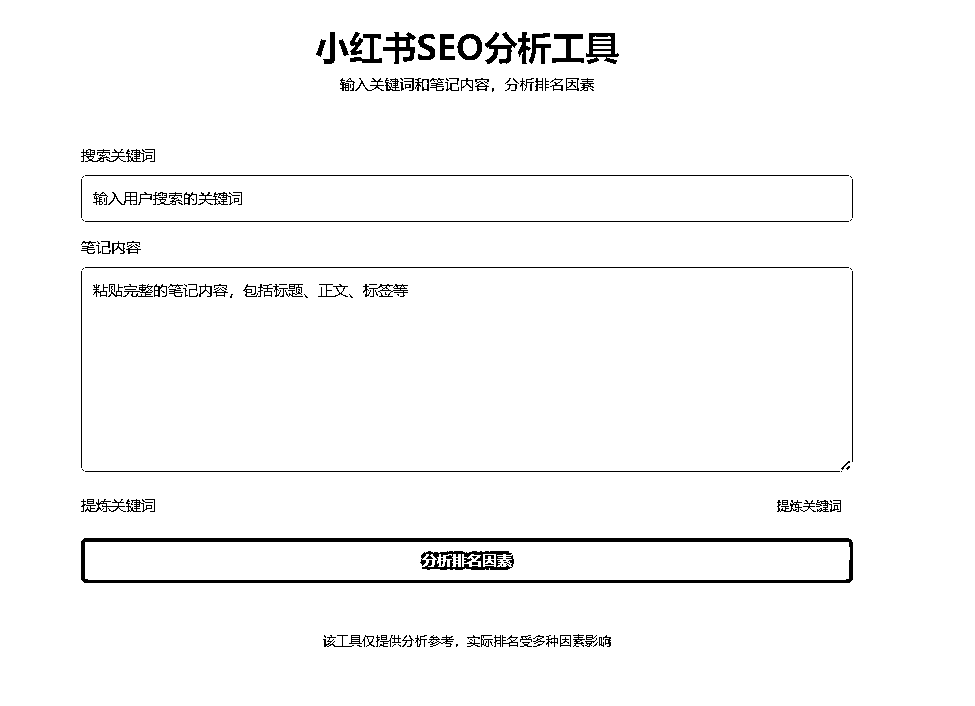
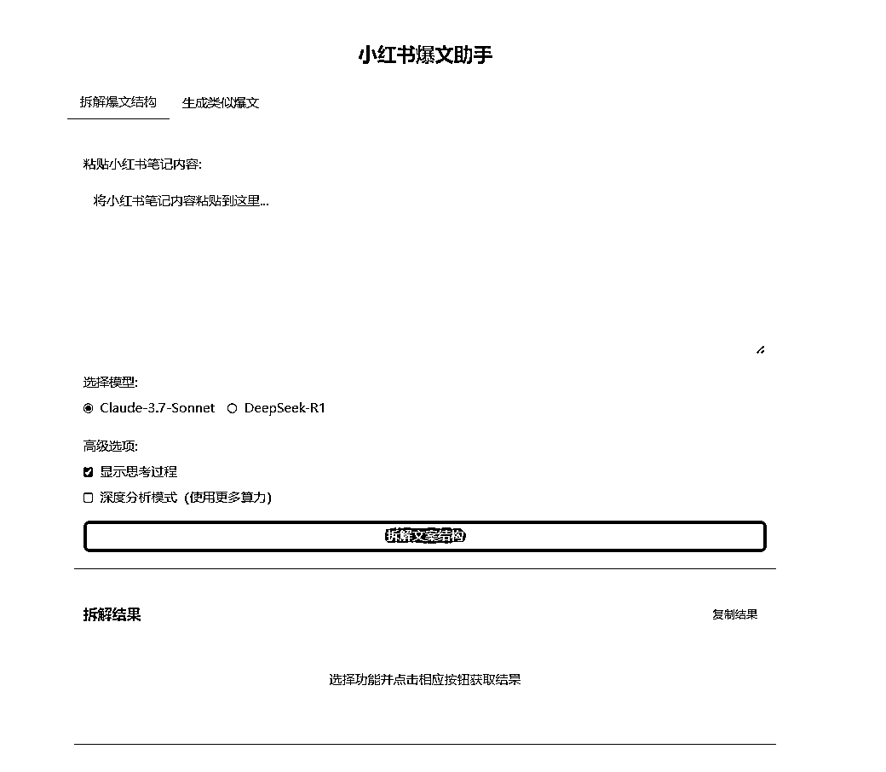
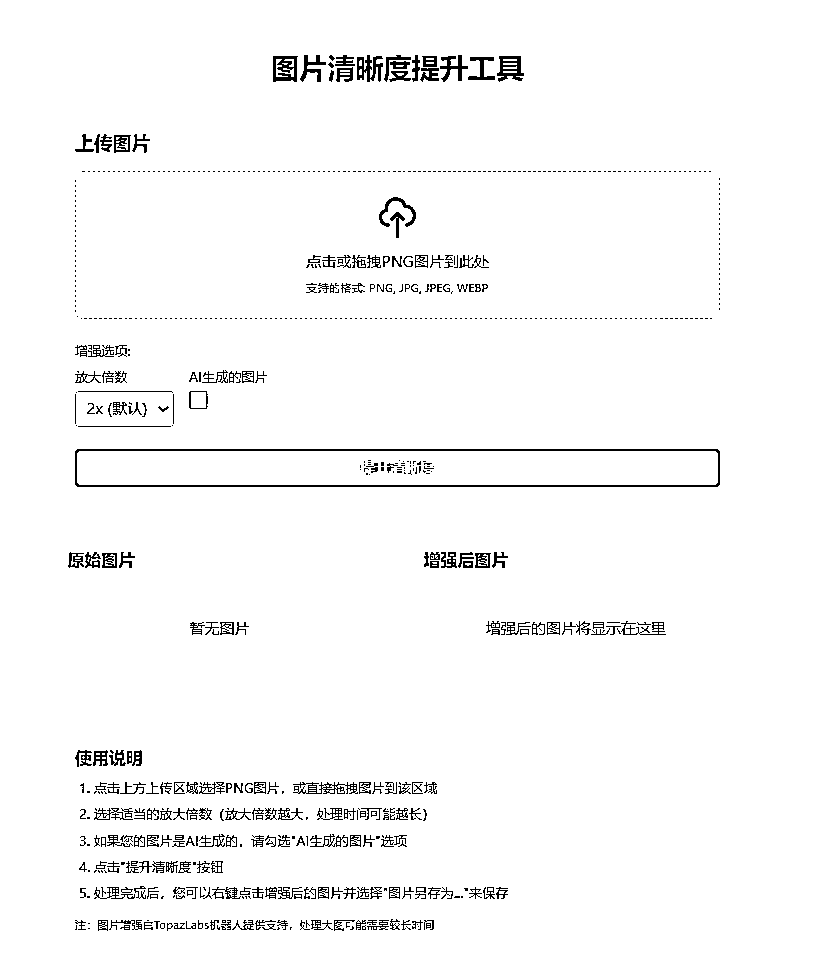
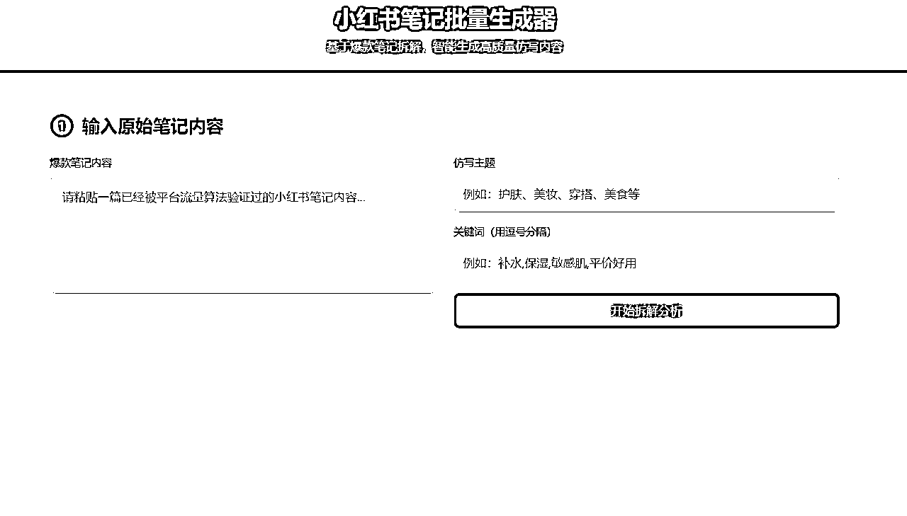
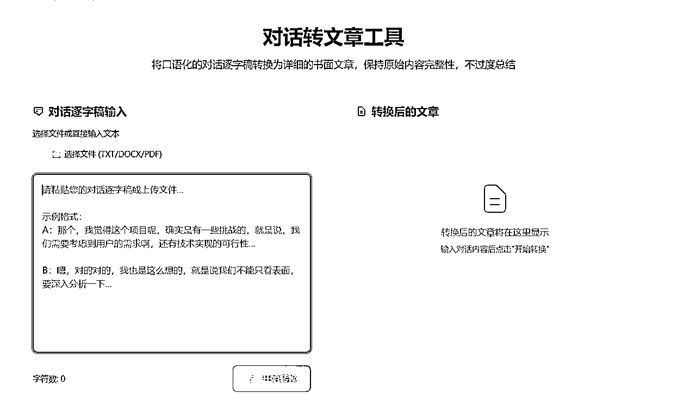

# 全面开源我做小红书AI智能体的思路【内附提示词】

> 来源：[https://g8ekpu7h0l.feishu.cn/docx/D5g8dYpiQoclKvxPPz6cwbBDnfe](https://g8ekpu7h0l.feishu.cn/docx/D5g8dYpiQoclKvxPPz6cwbBDnfe)

大家好，我是luke，很久没有发文章了。

今天这篇文章主要详细跟大家介绍下，我做小红书智能体的思路，以及该如何通过AI和业务流该怎么更加有机的结合。

### 01什么是到底什么是智能体

一个事实，现在AI是可以帮助你做很多事情，特别是小红书虚拟产品这个领域，它可以帮助你做太多太多事情了，基本上可以覆盖90%的工作流程。

所以，一定要学会用AI制作智能体，学会做自己的专属智能体。

什么是智能体？

对于智能体的理解，每个人都有自己的理解，对于大部分用户来讲，特别是新手用户，智能体可以简单的看作提示词的封装+上下文/知识库

你只需要针对某个具体的场景写一个专属提示词，就可以了，这就是你的专属智能体。

智能体的关键在于你对业务的理解和对提示词的理解。

### 智能体好不好用和大模型关系很大！

如果想要更好的利用AI，你一定需要对各个大模型有所理解，每个大模型的优势不同，你想要做智能体，一定要了解各个模型的优势。

比如，我常用的文字大模型有claude、Gemini

图像生成大模型有GPT-image-1和flux

我曾经用过同样的一套提示词去试验各个大模型的生成效果，其实效果差异很大，kimi、deepsearch的效果远不如claude的生成效果好。

那么你如果想要更好的在小红书内容领域提效，claude一定是最好用的大模型之一。

很多同学也反映想要使用国外的大模型很难，这确实是一个问题，但是换一个角度思考，这是卡点也是机会点，别人都用不了，但是你突破了这个问题，那么你是不是可以用更好的大模型，更好的提高效率？

我主要采用的解决方案就是去买一个POE会员，POE和monica都是国外的大模型套壳平台，你只需要支付一次费用，就可以使用全世界几乎所有的大模型，非常好用。

有兴趣的同学可以去淘宝搜索，基本上都可以解决。

那么为什么我用POE做智能体呢？因为POE做的智能体可以生成很好看的网页，就像一个网站一样，不过它是嵌套在POE里的。

### 02全面开源我的智能体开发思路

首先，先给大家分享下我的小红书互动数据，都是基于我的小红书智能体自主生成的，整体数据还是比较满意的。

另外，我是基于POE平台的APP Creator的环境，运用的大模型是Claude 4-Sonnet和DeepSeek-R1(后续测试Claude4的效果最好)

#### 为什么很多大模型生成的文案有AI味

我用AI做的第一个智能体尝试，就是去做小红书笔记的智能体。

我看了很多AI领域的博主或者是小红书博主，他们都在试图批量化生产小红书的内容，比如DeepSeek+飞书表格可以帮你一天生成几百条小红书文案。

但是，如果你真的去试验，或者认真看他们生成的内容，可用度很低。

为什么会这样？很大一部分原因在于给AI大模型的自由度太大，导致AI没有办法理解你真正想要的是什么东西。

即使预训练数据再丰富，大模型学到的本质上是语言模式的统计分布。

它生成的内容往往趋向于"平均水平"——既不会太差，但也很难有突破性的创意。文案创作恰恰需要的是偏离常规、击中痛点的表达，这与模型的"安全生成"机制天然冲突。

比如，你说：我想写一篇介绍上海旅游景点的笔记，要求有网感，同时可读性强，内容充实...等等

你会发现，尽管你说了很详细的提示词，但是AI还是没有办法给你足够成熟的内容。

所以，假如你想要让你的内容没有很强的AI味，那么一定要给它足够多的限制条件。

如何给AI足够多的限制条件？

我的操作思路是：给它一个参考文案，再让它基于这个参考拆解出它的文案结构，最后再通过拆解出来的文案结构结合你的新主题，生成小红书笔记。

这是一个目的性很强的指令，AI知道它要做什么，比如让它拆解文案模型，拆解的颗粒度很细，最后给它一个新主题，再结合文案结构，这样的小红书笔记就变成了一个填词游戏。

当你给AI一个对标文案时，你实际上是在告诉它："在这个具体的语境下，什么样的表达是有效的"。这比抽象的描述（"要有创意"、"要有感染力"）强大得多。AI不再需要从无数种可能性中盲选，而是有了明确的参照系。

并且绕过了"选择空间过大"的困境

大模型面临的一个核心问题是选择空间过于庞大。没有约束时，它会在无数种"合理"的表达中随机选择，往往选中那些最"安全"但也最平庸的组合。对标文案相当于大幅缩小了这个选择空间，让模型在一个更精准的范围内进行优化。

更重要的是，优质的对标文案为AI提供了质量标杆。它不再满足于"语法正确、逻辑通顺"的最低要求，而是要达到参考样本的水准。这种"向上对齐"的机制让输出质量有了明确的目标。

本质上是在进行少样本学习，不能说能够达到100分，但是至少75分是有的。

我再强调一下，让AI能够更加清晰理解你的需求，核心在于你要给它足够丰富的上下文，以及明确的指令，要让它基于xxx去做什么。

而不是让AI发挥它的创意，如果让AI发挥它的创意，你永远也得不到想要的东西，你生成的内容也全部都是AI味。

这个思路有点像郑州帮的逻辑，而AI工具的作用是辅助你拆解并生成爆文，你只需要写好提示词和提供好上下文就可以了。

#### 该如何写好提示词？

这里直接公布我的提示词，可以直接套用，授人以鱼不如授人以渔。

首先是拆解文案的提示词：

提示词1：

请提供以下详细分析（颗粒度要非常细致）：

标题解构：

标题的组成部分和词语选择

标题中的关键词和吸引点

标题使用的修辞手法

开场白分析：

第一段的具体写作方式和句式特点

如何建立共鸣或引起好奇

使用的表达技巧和句型

正文段落结构：

每个段落的写作目的和功能

段落的长短控制和节奏变化

每段的句式模式和关键表达

衔接词和过渡句的使用方法

叙事手法：

故事性元素的编排

情感调动的具体表达方式

话语权建立的细节

关键词和修饰词：

频繁使用的形容词和副词分析

强调词和限定词的使用模式

数字和具体细节的呈现方式

互动设计：

互动引导语的具体句式

设问和悬念的创建方法

评论转化的语言策略

套用模板：

将整篇文章转换为可套用的详细模板

用[方括号]标注需要替换的内容

保留原文的句式结构和表达方式

请避免使用表情符号，语言要简洁专业，不要有AI风格的解释和客套话。直接提供结构化的拆解结果，让人能够看懂并模仿这种写作模式。

提示词2：

1.  标题构造：

标题包含哪些元素组成

使用了什么吸引注意的技巧

关键词的选择和排列方式

开头设计：

第一句话的写法和功能

开场白的句式结构

如何快速吸引读者注意

文章框架：

每个段落的具体功能

段落之间如何衔接过渡

不同段落的长度和密度安排

句式分析：

常用句型和句式模式

重复使用的句式结构

短句与长句的搭配节奏

词汇使用：

高频使用的形容词和动词

关键修饰词的使用模式

如何选词来增强表达效果

互动技巧：

文中设置的问题和引导

互动语句的具体写法

如何鼓励读者评论和点赞

可套用模板：

提供一个精确到句式的完整模板

用[方括号]标注需要替换的部分

保留原文的语言风格和结构特点

请直接给出分析结果，不要加入AI风格的客套话，也不要使用表情符号。分析要细致到句式结构层面，让人能够完全理解并复制这种写作模式

大家有兴趣，可以用这套提示词试试，相对来说，拆分的比较细致。

还是那句话，我提供的只是思路，肯定有比我更好的解决方案，重点是要去多尝试。

总结一下：

让AI大模型减少AI味的关键就是给它一个参考文案，先让它拆解这个文案，颗粒度一定要细，另外再结合你给的关键词、主题根据拆解过后的大模型，生成一篇。

基本上能够达到80分的水平。

### 03如何用AI进行提效

AI已经被验证过，是可以提效的

但是很多人走了很多弯路，看似有酷炫的工作流，一分钟生成100个选题，100篇笔记

一天1000篇笔记

到那时最后落地的时候，看似做了很多内容，但是最后发现其实很难落地。

今天分享一下做小红书智能体、提示词提效的底层逻辑

我先总结一下：

首先是梳理自己的工作流，特别是从0-1的工作流；

第二是识别重复工作的卡点，思考是否可以通过AI替代，这里要注意不要为了炫技去想复杂了

第三是，把AI看作co-founder，打造你的专属AI员工。

#### 不要想着一招鲜，没有一劳永逸

出现这种情况，本质原因在于想要一招鲜，一劳永逸

把复杂的工作全部交给AI，虽然AI输出了大差不差的内容，但是最终距离落地还是有一定距离。

如果你想要做小红书智能体，无论是在POE平台还是在coze，或者其他平台，想要提高效率，一定要从场景入手，去思考：哪些重复的动作是可以通过AI替换掉的。

这就是场景思考法，需求是基于场景诞生的，而不是自嗨的，而不是你想输入一个指令，给AI一套提示词，AI就能够帮你去生成一堆笔记。

不现实也不靠谱

场景思考法的本质是基于一步一步的运营/创作动作，遇到卡点的解决方案。

这也是郑州帮的逻辑，极致的SOP，非常细致的颗粒度。

我再强调一下，场景思考法一定要还原正常的小红书创作流程，一步一步去思考，哪些动作是可以通过AI替代的。

举个例子，比如做小红书有一个很常规的动作，找对标

为什么要找对标？很多同学只是再去做类似的动作，比如去拆解，写分析报告，但是你很难帮助你更好的进行内容创作，天赋高一点的同学，可以找到一两个创新点

但是进步还是缓慢的，大家只是去做，去执行，而没有结果。

不知道要拆解的目的。

在这个场景下，AI就会发挥它的优势。

比如，极致颗粒度的拆解，你就可以让AI帮你实现，因为AI考虑的问题很多，方式也很快，能够看到我们看不到的问题，这就是AI的优势。

你就让它就拆解爆文，你可以告诉它让它拆解哪些维度。

这就是一个很有效的方法——场景思考法，思考你从0-1的工作流程，会遇到什么问题，哪些是重复性的问题，不要想着用AI完全覆盖你0-1的工作流程，这不现实。

AI的优势是能够帮你解决0-0.1 0.1-0.3 0.3-0.5

最后到1，你可以想象为这其实是一帮AI员工帮你去做，组成了一个硅基员工team

你只负责发牌、提需求、和校验就可以了。

这也是未来AI和人类融合工作的方式之一，先拆解工作流程，思考哪些节点可以通过AI替代，最后组建一个AI员工team。

比如我现在的小红书AI team的员工有：爆文拆解助手、SEO专家、图片处理专家、选题助手、爆文仿写专家等等

他们是共同帮助我完成小红书创作这件事。

这就是节点创新的优势，把AI看作co-founder

#### 去除AI味的关键是：让AI作填空题

这个观点我认为是这篇文章最有价值的地方

去除AI味的关键就是让AI做填空题，而不是让它写作文

比如就有网感这件事，AI和你的理解是不同的，当你给AI大模型的提示词，有网感，它可能写的AI味还是很浓

因为它没有足够的上下文去理解到底什么是有网感。

那么，如果你想要让AI快速理解你的需求，同时你们能够更好的协作

关键就是，你让AI做填空题，给它一个限制性很强的框架或者指令，因为AI的逻辑思维能力强，特别是对结构的把控

这也是我的个人AI助手爆文专家的逻辑

它帮我生成的文章的逻辑就是先拆再填词

先把我给的参考笔记进行一个颗粒度很细的拆解，然后再结合我给的主题和关键词进行一个新的文章生成。

这样几乎就没有AI味了。

去除AI味的关键就是给到它足够多的参考和足够明确的需求，尽可能可控它的想象力，所以给框架协作是一个很好的方式。

## 04 我最近在对AI新的尝试和感受

其实AI的能力，对于我们普通人来讲，目前来说已经够用了，很多时候我们并不是说要有多少agent，智能体，我们需要的只是AI能够对我们的业务进行帮助。

也就是说AI对我们工作中垂直场景的落地，这是AI最重要的作用和价值。

它可以快速帮我们把自己的想法实现，因为每个人都有奇奇怪怪的想法，而市场上并没有完全匹配你想法的工具，所以AI是真的很有价值。

举一个最近的例子

在上周六的生财航海家私域运营大会，嘉宾讲的很干货，虽然说有逐字稿，不过逐字稿的可读性其实不高，我就做了一个智能体。

这个智能体解决的核心问题就是能够直接把口语化的内容，进行【书本化】，变得可读性更高，同时把整篇文章的逻辑捋顺。

最重要的是，不能够改变/删减嘉宾的原话，也就是说，这个智能体完成的并不是去总结/美化一篇文章，而是原汁原味的更好去呈现这篇文章的内容。

我测试过了，真的很好用

所以，我建议所有同学把AI用起来，把自己的想法落地，不要和自身的业务场景脱节，不要过度的追求技术，AI时代，需要的是复合型人才，懂业务懂AI，一定很吃香。