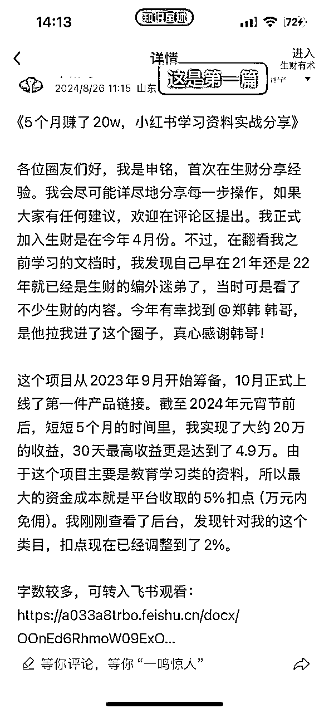
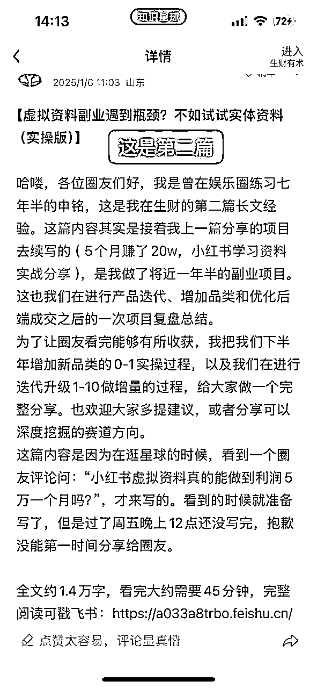
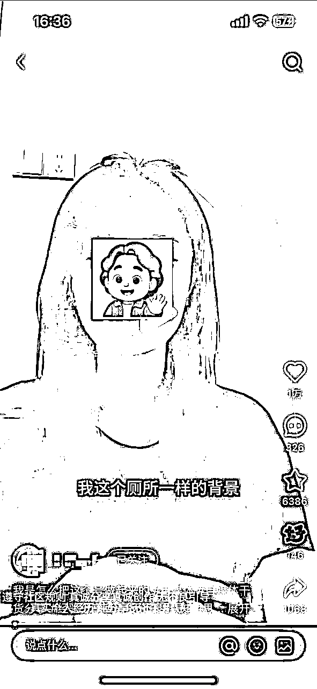
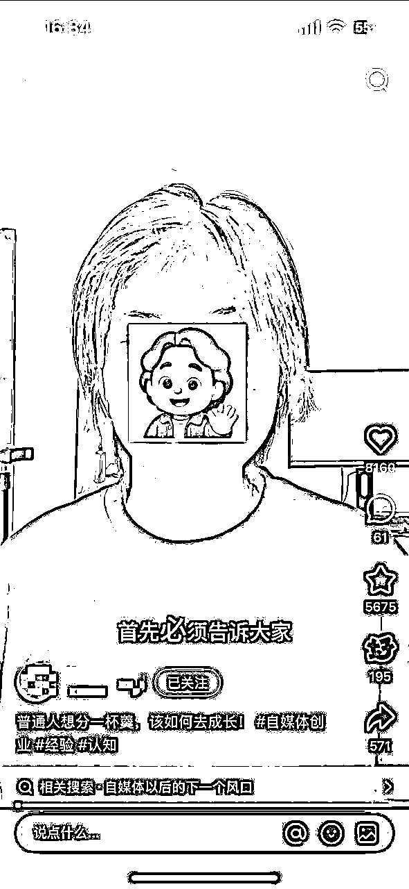

# 虚拟资料4.0：我从卖资料到卖人设，单店单月卖了20万+的实战总结

> 来源：[https://a033a8trbo.feishu.cn/docx/C5QydflVMono1zxVlAQchaWmnfq](https://a033a8trbo.feishu.cn/docx/C5QydflVMono1zxVlAQchaWmnfq)

（全文7000字左右，主要围绕我的虚拟资料4.0阶段关于人设部分的复盘）

# 一、前言

各位生财的圈友们好，我是在娱乐圈练习七年半的申铭。距离上一篇帖子分享已经过去4个月了，今天我又来分享了。原本以为那一篇已经是关于虚拟资料的最后一次复盘了，毕竟这是副业，而我主业这边也没闲着😂。但是没想到，做了一轮系统调整后，项目居然又有了新一轮爆发，于是我决定还是把这阶段性的优化和变化完整梳理出来，做一次版本级的复盘吧。

我们这轮迭代从3月底开始落地，期间我们小团队内部磨了差不多一周的方案，然后才去正式投入打磨执行。中间虽然经历了不少波折，但最终效果确实远超预期。特别是暑期暑假即将开始的时候，我们调整的新模式的账号就冲上来了，目前单个店铺单月销量稳定在20万+。

我们期间一共调整了3个账号，目前这个是我们手上3个账号中唯一一个能跑出相对稳定结果的。其余两个虽然也有增长，但还没有形成稳定，我们还在不断试错打磨中。

今天这条复盘的帖子主要是讲我这一轮在人设上的策略和复盘，和前几篇相比，我这次写得会相对轻一些，重点不是教如何从0起号、如何从0开始做虚拟资料，是想讲怎么通过人设构建，来突破虚拟资料赛道的增长瓶颈（我们目前阶段遇到的最大问题）。

前言和项目实操无关，如果时间比较紧张，可以直接略过看后面。这篇内容也是关于小红书虚拟资料（我把它叫学习资料，后面为了迭代我们内部把它升级叫学习资料，或者是实体资料）的分享，是继前三篇分享《5个月赚了20w，小红书学习资料实战分享-知识星球》、《虚拟资料副业遇到瓶颈？不如试试实体资料（实操版）》、《小红书学习资料项目：AI原创学习资料从0到1全流程》帖子的续集，建议按照顺序系列看，效果会更好。

在开始讲具体策略前，我想先交代一下我们这几个月遇到的几个关键问题，也就是说我们为什么必须转向做费劲和高成本的人设：

1、流量机制变了，老打法失效

如果你有看我之前帖子的打法拆解，你会知道我们最初的发笔记策略非常直接：干货图 + 干货文字、干货实拍图。但这招在现在的小红书环境里，有点不太好使了。

因为平台本身的机制变了。以前的爆款能吃半年以上，现在3个月前、半年前的爆款基本上不怎么给流量了，只能搓新的可能爆的笔记；以前靠搜索带货能走不少，现在也能走，但是搜索词排名却被压得死死的😂，真的绝了。用老一套内容模板去发，有数据但是转化真的很差劲。

2、低价同行 + 盗版增加，现在乱七八糟

原本以为我们要遇到的，是复购率低、产品生命周期短的问题，没想到最大挑战却是来自同行的，盗版滋生（小红书、闲鱼、淘宝、拼多多全被盗版上架）、同行乱价（每单价格不到10块），把市场价格弄的乱七八糟，产品质量也很差。

我们这边正常一级引流产品，客单在50~120元左右，结果一堆同行直接几块钱挂到闲鱼、小红书、淘宝。这些账号不打人设、也不做品牌，就是抄道资料、疯狂撒低价。我资料项目干了三年，真的是见惯了各种骚操作：抄选题的、抄标题的、复制我们赠品结构的、连我们资料前言都能抄得一字不落。

但也是因为这样，我越发意识：仅靠资料本身，已经没有长期的壁垒了。只有做出人设IP，才有定价权、复购率、有产品的护城河，和我现在主业在做的品牌逻辑一样，品牌定价就是独家的，而且生命周期更长。

3、新号起店难，稳定销量周期变长

下面这张照片是我们最近两个月起的新号之一，近期算勉强稳定住销量了，但是完全没有在一个月左右的时间去快速破万，且稳定每天销量的状态，所以也不得不加入人设去做起新号的操作。

3月底开始，我们是拿了3个不同赛道的老账号，做了类似的人设优化尝试。但效果吧，有点分化，在最后我会具体讲一下。所以我们意识到过去总结的那套简单粗暴的爆款机制的打法，能用但是不能持续用。所以必须转向更精细、更具人格粘性的打法，人设打法也是我们目前阶段必须做的了。

# 二、人设IP才是长期主义（不是选择题，是生存题）

说实话，我刚开始做虚拟资料的时候，想的还是搞钱就行，找爆款、发笔记、压选题，走的是最典型的流量思维。

但当跑进一个成熟品类、卷到一定阶段，会发现：流量不是问题本身，信任才是。

尤其是现在的小红书，slogan从你的生活指南变成你的生活兴趣社区，之前的那种密密麻麻看着信息密度很高的笔记，后续不如露脸、带人的转化效果好。内容发的也得越像一个真实可信的人发的，用户愿意点，平台也愿意给曝光。

所以，我们干脆拿几个账号尝试彻底转型，用人设IP来绑定资料账号，把账号从卖资料的变成有专业、有温度、有辨识度的人。

虽然现在资料项目不露脸也能做，那我为啥要搞得这么重？这么累？因为，不做人设可以起量，但绝对跑不长、也很难起高价。

下面我分享一下我们这轮转向人设的三个核心目标：

1、信任背书：用户买的不是资料，是懂他们的人

我们很清楚，我们目前产品的大部分用户买资料并不是为了立马就用。他们真正买的是我相信你做的这套资料靠谱、你应该知道我现在最需要什么。所以我们在做人设的时候，是为了把用户买资料的这个动作，转化成找个靠谱的老师带带我这个下意识心理（和带货直播间的话术逻辑一样）。

就像现在大家都在卖K12资料，但如果你直接卖一份高中语文押题合集，并且你告诉他这是张雪峰团队出的精编版，转化率是完全不一样的。

2、差异化定位：资料可以复制，但人无法复制

盗版最多的永远是内容，最难被模仿的永远是你是谁。最近在生财看帖子，发现很多圈友，爆款做某些考证、考验培训的圈友拿到了非常好的结果。说明大家都来做了，把这些机构和有足够多人的团队称为大厂，他们的人力、物力、流量能力会比我们这种个人或者小微团队要厉害很多，而且他们的产品要比我们更优质，一级产品引流品的价格更低（后端二次成交利润更高），所以也是不得不做差异化定位。

目前，很多同行做人设只会挂个昵称、写点自我介绍，甚至连头像都是ai生的。别看这些人设装模作样，其实一点辨识度都没有，用户看了不痛不痒，根本记不住。

而我们做的是“真人人设”，加个引号：

*   露脸；

*   讲故事；

*   内容全套配合人设定位；

*   还有具体的风格化语气和个人观点。

我们打造的人设不是那种很假、很自恋的IP，而是走当下小红书最流行的活人感人设，就很像你身边的同事、老师、朋友一样可信，很真实，甚至让女生直接素颜录口播。如下图，下图不是我们账号，是参考它的“活人感”。

3、情感链接与溢价：人设决定了能卖多少次、卖多贵

我们在做虚拟资料时，本质上还是在做知识服务产品。能不能持续复购、后端能不能卖更高价，全看内容有没有跟用户产生情感链接。

*   没有情感链接，卖一次就结束；

*   有人设加成，哪怕是小资料，都能复购3次以上。

而且我们做过非常明确的对比测试：在其他条件一致的情况下，有人设露脸和人格表达的账号，用户对于高客单价的转化率会更高和直接，尤其是我们定价在89、99、129这种阶段，用户几乎没有议价动作。所以人设溢价的价值感觉还挺大的。

做人设后，我们还做了两个配套强化动作：

一是内容上，坚持一个账号一类人设一垂产品，不混赛道。

*   比如我们有做考公的号，那整个账号从文案、头像到资料全围绕公务员教培老师去构建；

*   做高考艺考的号，就走“学姐+资料整合人”的设定，穿搭也偏艺术生的风格（因为本人艺术生，相对来说比较了解艺术生想要什么）；

*   甚至我们也会去做账号分拆，也要做到视觉+内容+角色一致。比如说，同样考公的，我们可以把公文写作、行测题分开两个账号去弄。

虽然多号确实更累，但因为更垂直最终的结果是：账号转化率提升明显，且用户单次停留时间更久，互动意愿更强。

二是内容形式上，转向视频为主打，图文主配合。

视频比图文更具人格感，这不是建议，是结论。因为小红书视频内容的流量池明显大于图文笔记（上下滑给视频曝光开了大口子），且平台在权重倾斜上越来越偏向真人表达类内容。所以我们在做人设后，直接把主要内容形态从图文换成了短视频（口播+故事+干货）。

# 三、人设定位：找专属标签

做人设的时候很容易做飘，就是会很空洞，而且后续的内容还很容易会跟人设无关。所以我们在做虚拟资料账号的人设的时候完全按照“资料属性+目标用户需求”这样的逻辑去强绑定的，给大家我们具体做人设的步骤。

第一步，分析我们目标用户画像，到底是谁在买我的资料？

*   年龄/职业：高中生、大学生、艺术生、失业人员；

*   核心需求：高中生想找到精准靠谱考点合集（包括文言文背诵、历年高考题型）、大学生考教师资格证不懂知识点、艺术生艺考文艺常识找不到最新版、失业人员想考公但没方向；

*   痛点：找不到渠道、懒、信息差、资料太杂不会用。

基于第一步的方法，假设我们的目标人群是想要考公的大学生，或者大学刚毕业几年的想要考公的人，他们的需求痛点就是考公没方向，不知道怎么具体学习、复习，而且还可能在公考的某个部分容易丢分，需要进行针对性训练。但基于前面这些痛点需求，他不太想花费太多去结构学习，想自己私下省钱学习。

第二步，挖掘我们自己优势点，我们比同行强在哪儿？（基于前面用户画像的人设）

*   经验：服务某考公机构5年+、公考首考上岸某某满分、前公务员辞职下海；

*   特长：擅长公文写作、擅长面试、能快速提取新闻时政要点且运用；

*   价值观：拒绝割韭菜，只做有用的资料。

这一步不一定是真人设，也就是你的经验背景可以是杜撰的，但是如果是杜撰的人设，就尽量不要让用户太能考察到，比如说你说你是考公满分或者是具体哪年上岸哪个考公岗位，这个很容易查到，人设就很容易崩塌。但是如果你说你是在某某考公培训机构呆了多少年，这个很难去查，因为他们这种大型的机构员工太多了，他们自己人都认不全。但是这个对于后续内容的要求就是，尽量不要在内容里提及太多关于机构内部的事儿，可以只当作是一个身份title去说。而且，我们本身选品都是非常垂直的，比如考公的项目就专注公文、精读解读和面试，其他一律不管。那我们人设上也尽可能的和我们垂直的资料做对应。做虚拟资料/知识付费，专才比全才转化率更高，站稳某片小市场就好了，而且还能解决人设同质化的问题。

第三步，确定人设关键词（3-5个核心标签）。

*   举个🌰：前xx考公一线老师、专注公文写作教学、迅速提分xx

如上面的标签，可以在小红书简介里写上，如果做视频，也可以在口播文案里去夹杂着去说，比如说“我能让我90%的学生，公文写作提分10以上，就是因为这套公式”，通过口播内容，给用户建立人设认知，而且用户成为粉丝之后会反复看你视频，那他对你的印象标签就会更明显。

# 四、怎么把人设做得更落地：视频上

很多人理解做人设，停留在起个名字、包装封面的阶段，实际操作时根本撑不起完整内容。这也是现在大部分在卖虚拟资料的账号的问题，我们踩过这个坑。

我们人设搭建的第一阶段，只是在内容和视觉层面做了调整，纯口播的效率也比较高。这两点调整，其实已经实现了比较明显的转化率提升。

## 1、内容上

我们在视频内容上，主攻三个方向：

#### a. 干货型：爆款选题+“怎么看/怎么做”的方法口播

干货，即是去寻找我们之前的内容，看哪些是爆款，以及同行最近半年的内容有哪些是爆款，然后基于这个爆款的选题去添加“怎么看”的提问。这类干货内容，能在侧面辅助我们人设专业的。举个例子，我们有个考公的号最近这几个月发“卤鹅哥”“labubu”“新闻联播”相关的内容很火，拿“卤鹅哥”来说，后面加上“怎么做/怎么看”就是：卤鹅哥怎么看？因为我们是考公账号，内容一定是围绕考公的，那可以延展的选题是“重庆卤鹅哥走红靠什么”“卤鹅哥给荣昌除了带来流量还有什么”。

这类这种选题方法真的天然适合做成短视频，特别是对公考人提供一些面试的参考。然后在口播里不能只输出结果，而是要把这个思考的结构给大家，比如说要告诉大家这类题型要按照a+b+c的逻辑回答，然后中间演示，最后部分引流我们卖的资料，说最新的时政问题、或者是其他的都在这份资料里，全部有前某考公机构的一线老师整理。

总结一个结构：

*   提观点：这是个典型的X类问题

*   拆逻辑：答题要用A-B-C三段法

*   举例子：套入时政背景（比如说卤鹅哥时间来回答演示）

*   引产品：详细资料已整理在文档里（链接/资料卡引流）

#### b. 故事型：用“我经历过”的口吻讲干货

很多知识类视频用户不爱看，是因为太干了，不能太干。在传术师群，5月下旬的时候，东山老师分享了一条视频，里面讲的很好，用户东山老师总结的就是“公域讲实操，讲干货，就是做公益，过嘴瘾，赚不到钱”。东山老师随后补充的“人，需要的不是干货，而是被理解”、“人，需要的不是方法，而是“希望””，这个内容一直在影响着我。所以后续我基本上一直应用在短视频上，就比如说这个部分说的故事型也是，这类资料账号的人设内容一旦用过来人的语气讲同样的内容，用户是会立刻有共鸣的。

举例：“我第一次考公失败的3个低级错误，你们别再踩坑了”“上岸前我每天复习12小时，但真正提分的，只有这3件事”

你会发现，这其实讲的还是“考公方法论”，但因为有“人+情绪+经历”（也就是故事），所以会更容易引发评论和点赞。而且你的人设，也会变得更有人味，就不再是个卖资料的，而是个走过弯路、现在愿意帮人的前辈。侧面的辅助了人设。

#### c. 共创型：从评论找选题

我们发现，只要某条视频爆了，评论区一定有几十条甚至上百条真实提问和互动，这就是我们目前最大的选题来源。

做法很简单：

*   找到点赞数靠前的评论（自己或者同行的笔记的评论都行）；

*   提取用户的核心问题；

*   用你问我答+人设口吻来做短视频内容。

这类视频不仅容易起量，而且互动率极高，用户也会觉得，你不是在卖，而是在陪着她一起成长、一起变好。

## 2、视觉上

小红书内容的视觉体系无非笔记封面、头像、视频里人物服饰和场景，我的建议是全改成所在赛道的风格。

举个例子，假设做医考资料相关，封面IP形象，还有视频的IP形象，我建议是穿白大褂，或者是网上特别火的精神病服，和他的具体职业相关，目标用户也会更信任。如果做考公，可以是穿体制内那种厅局风的衣服，通过这种穿搭形象去传递出知识点，大家会下意识觉得正确，愿意转化。头像也可以同步调整。

如果有条件的肯定建议是在那个场景去讲这个内容，或者是类似的场景，效果会更好。

是不是一定要这样？也不一定，其实什么风格视觉都能转化，只是相对贴合的视觉风格转化率会更高一些。但是这个视觉风格主要还是根据你的人设来的，如果你的人设不是着这个角色，那你换这套风格的服饰就会很奇怪。

# 五、怎么把人设做得更落地：产品上

前面是在内容呈现上去融合了人设，这一部分我讲一下我们怎么把人设融合到了产品上面。很多人卖虚拟资料，卖的是干货，但我们真正卖的是带人的解决方案。真实、有故事、讲方法、有情绪的人，这个是我们思考了很久之后，认为的它才是用户买单的真正理由。

## 1、资料设计本身就要体现人设

用户拿到资料的第一眼、第一句话，必须就能感受到“这是谁做的”、“他值不值得信任”。

我们现在每一套资料，从第一页开始，就在做人设的输入和信任建立。

### a. 前言 / 附录：400字人设故事+使用指南

在资料第一页加入一段 400-500 字的人设故事，我们标准化内容包含两个部分：

*   我为什么做这份资料 比如：

*   “这套资料本来是我给我弟整理的，现在拿出来分享”

*   “之前我踩了很多坑，不想让你也浪费时间”

*   “我教过200多个考公学生，这些是他们最常错的知识点汇总” 这类内容可以在用户打开第一页就产生好感，他觉得你是为他好，而不是为了卖。

*   怎么用这份资料 不只是目录，而是一种教学说明书：教他先看哪一章，怎么用，搭配哪些方法使用会更高效。这其实在强化一个潜台词：我在陪你一起学、我没有功利心，而不只是我给你扔一堆文件自己看。

这个内容放在第一页，因为是教使用方法的，所以大部分人都会认真看完。他们在看前言的内容的时候，后续再看其他的都会戴有色眼镜看，就算材料不好，也能理解了。

### b. 加赠品 = 提供“人格化的加餐”，而不是“无感文件”

之前我们也有赠品，但是无名无义做赠品，目标用户感知不到赠品的价值。我们现在把赠品都变成了“人设周边”，随这份资料赠送的人设周边，也是增加这份资料的分量。

比如：

*   “我现在还在用的XX复盘模版”（体现我还在做/实操有用）

*   “我整理的1000条爆文标题清单”（体现专业）

*   “人民时评7月最新精读分析”（体现实时更新、专业积累）

用户收到这些，就不会觉得是附赠，而会觉得是一个靠谱前辈的补充。

## 2、服务强化靠谱可信人设

我们现在其实做的很累，正常来说做虚拟资料是很轻松的事儿。但是我们为了增加我们的转化，所有一级产品都提供了服务，提升服务的转化率和复购率比没有提供的时候确实高很多，但具体多少百分点没有具体统计过。以下是我总结我们目前提供的和服务相关的分类：

*   售后保障：推出“资料不满意可退款”，退款不退货，用户需要在私域微信进行退款，在退款前需要把线上签收做了，且需要给我们提供五星好评+评论，因为我们是主动提供好评的图文，目前大部分申请退款都会评论带图文。提供免费的一对一答疑服务，基本上有啥问题都会进行回答，现在是有两个人是专门拿着手机等人来消息去回复的，因为她们俩也都不是对每个行业都懂，所以基本上是会借助ai，然后他们根据收集的内容，做偏中性的回答，但是我们重点业务跑的比较好的，肯定是专业回答，那边后端转化比较好，所以必须要专业一些的回答。这个售后保障虽然苦，但是传递的却是很靠谱的人设，现在虚拟资料/知识付费市场特别缺这种人设。

*   用户共创：部分产品（比如说考公、高考的内容）具有时效性，所以需要不定期更新，每次也都会和私域的用户收集“你觉得下一期资料需要加什么内容”或“你还想要什么内容”，这样的互动性导致群聊和单点私聊的粘性很高，也给后端的二级产品转化做了铺垫。

# 六、结语

现在是下午7点多，我写到结语又从前面读了一遍，前面是昨天夜里写的，感觉这篇帖子其实并不像是在教大家具体怎么做，而更像是我自己在叨叨复盘，为什么我为啥会这样调整，为什么从卖资料走向卖人设，开始慢慢要去打磨IP了。

所以如果你是第一次看到我的内容，建议你先去看一下我前面三篇帖子，然后再看来看这部分的内容会更容易理解。否则单独看人设这篇，可能会觉得为什么我上来就开始定位标签、做结构、配图配口播，节奏就跳得太快了。

这些选择，其实不是拍脑袋拍出来的，是因为我这三年一直在做虚拟资料的副业，做多了就会发现一个事儿：

流量会随着平台的规则调整而消失，但信任不会。

你今天蹭的是什么趋势、爆的是什么选题，明天可能就不灵了。账号短期靠爆款，但长期要做得稳定，真的必须要靠人设支撑（普通电商如果想做长期生意则需要靠品牌）。不然你会越做越累，越成交越焦虑。更别说我们这种副业小团队，想去和那些团队十几人、几十人、会搞投放搞矩阵的大厂去抢人，完全不现实。唯一能打穿的，就是人设+内容+产品，把这三个做绑定。

刚看的时候有个小事情没有补充，我在这里顺便补充一点我们团队现在在做人物IP的一些实际操作。我们目前已经在跑的三个号里，有一个是找自己人来录口播的，另外两个是找演员来录的因为青岛的地理优势原因和我之前也一直在做影视剧的原因，这块的资源比较丰富，找的演员基本上800-1000块钱一天，多大年龄的都有，为了能拿到最佳状态，基本上半天只能出25条左右。

但实操下来，也踩了不少坑。首先，专业演员虽然镜头感强，但表演痕迹太重了，真的绝了，容易显得假，念词不自然，很像ai，观众没代入感；其次，因为他们是演员，会到处接活儿，所以还可能在各种信息流广告、短剧看到他们，如果真的被目标用户看到，可能会影响这个号的信任度和转化。所以，我也是今天才复盘一下，我们另外两个号数据有增长但是不明显的原因。

后续关于露脸IP，我们还是打算用自己人，毕竟真实，而且不会丢失。但是因为账号很多，没办法给每个号都做人设，这又让我们陷入另一个麻烦了。等等我们调整吧，调整之后，有新进展，可以随时复盘给大家说。