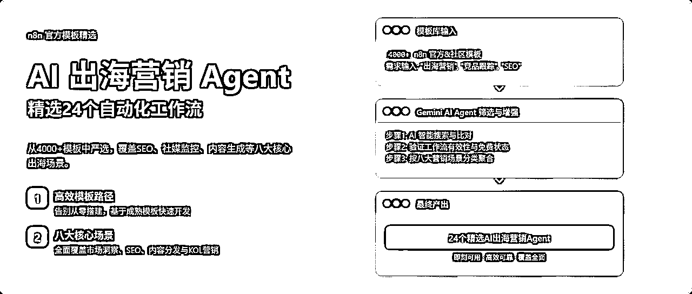
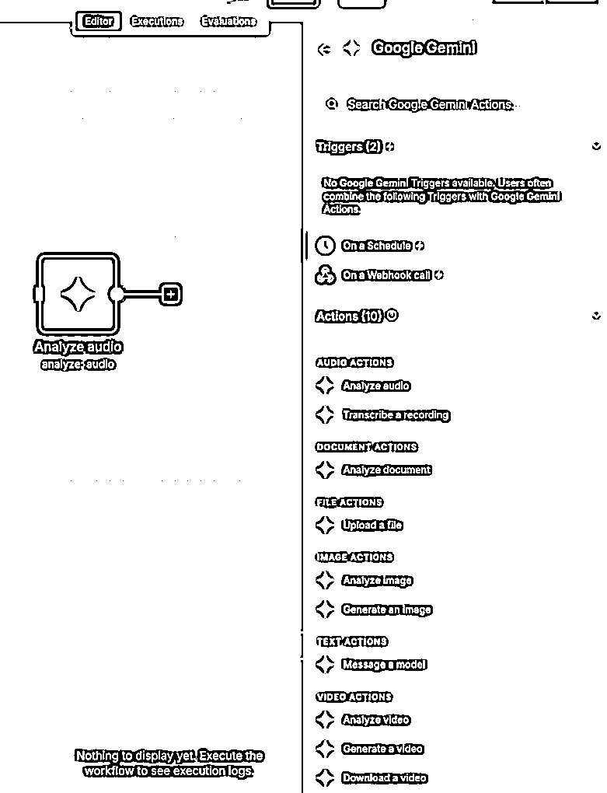
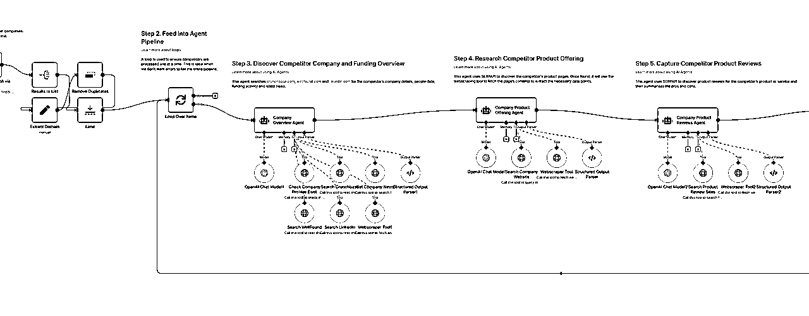
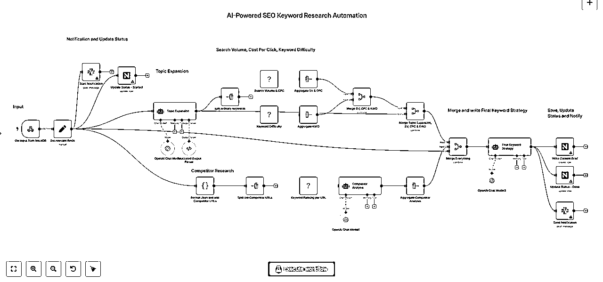
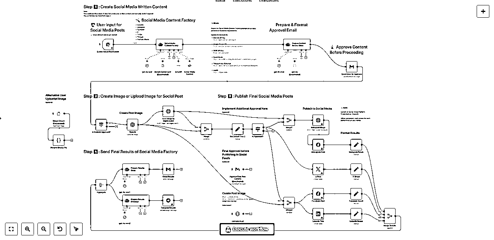

# 从4000+ n8n模板中，精选了24个「AI 出海营销Agent」涵盖SEO、竞品跟踪、Reddit等八大模块

> 来源：[https://ry6uq5vtyu.feishu.cn/docx/CmlYdW5P9oV01kxQsRtcVVQQnAb](https://ry6uq5vtyu.feishu.cn/docx/CmlYdW5P9oV01kxQsRtcVVQQnAb)

最近在创业，用AI帮助企业做出海营销。

比如，前阵子帮一个做DTC品牌的朋友，搭了一套工作流，能24小时监控竞品的社媒动态和价格调整，一旦有风吹草动，AI就会自动分析并生成报告，推送到他们的飞书群里。

这背后的核心工具，就是我经常在公众号推荐的 n8n。

我还分享过n8n和市面上其他AI Agent的区别：它的壁垒在于灵活自由编排的工作流，以及超过400个现成的官方接口，几乎囊括了所有你叫得上名字的全球化服务：Reddit、Instagram、Google、Shopify……你想得到的出海场景，它基本都覆盖了。

最近还更新了Gemini节点可以对视频内容进行理解、甚至是生成视频。

## 学n8n的坑

很多朋友看后都想学n8n，但说实话，这东西从0到1确实有门槛。我自己也踩过无数的坑，其中最大的一个，就是妄图用AI来直接生成n8n工作流。

这在目前来看，几乎是一个骗局。

你可能会在网上看到各种教程，教你用Claude 写一段提示词，然后“一键生成”复杂的工作流。但当你真的去试了，就会发现理想与现实的差距有多大：

你得花大量时间去跟AI描述你的需求细节，反复调试它生成的JSON代码，结果往往只能得到一个极其简单的流程，甚至很多时候根本跑不通。有这功夫，手搓一个都早就搞定了。

痛定思痛后，我发现了一个最高效的学习路径：找到别人已经验证过的、成熟的模板，在它的基础上做二次开发和调整， 这能让你最快地理解一个复杂流程的搭建逻辑。

这里，推荐两个网址：

*   n8n官方模板库，有超过4000个模板：https://n8n.io/workflows/

*   awesome-n8n-templates，GitHub网友收录了超过2000个模板：https://github.com/enescingoz/awesome-n8n-templates

此时，问题又来了，几千个模板，咋知道哪个适合我？

你可以试试 Gemini 的 DeepResearch 功能，或者是ChatGPT 的Agent，AI能根据你的简单需求，去搜索、逐个比对后，把最匹配的几个模板找给你。

例如，下面这一批就是我用Gemini 按我给的出海营销场景需求找的。

我筛选出来比较好的，确保是有效、且免费的工作流，供您享用：

### 一、市场、竞品与需求洞察

1.  自动化竞品研究（集成Exa.ai, Notion和AI Agents）

*   输入一个公司名，工作流会用Exa.ai找到竞品，再用多Agent 分头研究，最后将报告自动整理进Notion。

*   https://n8n.io/workflows/2354-automate-competitor-research-with-exaai-notion-and-ai-agents/

1.  监控竞争对手网站变化（集成OpenAI和Firecrawl）

*   通过Firecrawl每日抓取目标网站内容，并让AI对比新旧版本，自主判断内容变化的重要性后决定是否通过Gmail发送警报。

*   https://n8n.io/workflows/3101-monitor-competitors-websites-for-changes-with-openai-and-firecrawl/

1.  AI驱动的市场情报机器人（集成Firecrawl）

*   定期通过Firecrawl爬取指定新闻网站，用AI根据关键词筛选并生成三点式摘要，然后实时推送到团队的Slack频道。

*   https://n8n.io/workflows/4588-firecrawl-ai-powered-market-intelligence-bot-automated-news-insights-delivery/

### 二、SEO 场景

1.  全方位SEO关键词研究（集成OpenAI和DataForSEO）

*   将一个核心主题交由OpenAI扩展成长尾词和问题，再用DataForSEO获取搜索量和难度数据，最后由AI综合分析并生成包含竞品洞察的完整策略。

*   https://n8n.io/workflows/3908-comprehensive-seo-keyword-research-with-openai-and-dataforseo-analytics-to-nocodb/

1.  追踪并分析反向链接机会（集成Bright Data和GPT-4o）

*   利用Bright Data抓取竞争对手的反向链接数据，交由GPT-4o智能分析链接的质量与相关性，并将筛选出的高价值机会存入Google Sheets。

*   https://n8n.io/workflows/5958-track-and-analyze-backlink-opportunities-with-bright-data-mcp-and-gpt-4o/

1.  自动化SEO优化的WordPress文章发布

*   从Google Sheets读取主题后，驱动多个AI分别生成文章、图片和SEO元数据，然后自动在WordPress中创建文章、设置特色图片并填充Yoast字段。

*   https://n8n.io/workflows/3085-automate-seo-optimized-wordpress-posts-with-ai-and-google-sheets/

### 三、内容生产与分发

1.  AI驱动的多平台社交媒体内容创作与分发

*   根据Google Sheets中的创意，AI为超过7个社交平台定制帖子和图片，并通过一封带审批链接的邮件实现“人在环路”的审核与自动分发。

*   https://n8n.io/workflows/3066-automate-multi-platform-social-media-content-creation-with-ai/

1.  AI驱动的WordPress博客自动化（内容农场）

*   模拟一个包含策划、作者、编辑等AI角色的内容团队，自动完成从RSS源选题、撰写长文、生成配图到多平台发布的完整流程。

*   https://n8n.io/workflows/5230-content-farming-ai-powered-blog-automation-for-wordpress/

1.  全自动AI视频生成与多平台发布

*   从一个Google Sheet创意出发，协同多个AI服务自动生成脚本、视频片段和配音，再由Creatomate合成为最终短视频并分发到各大平台。

*   https://n8n.io/workflows/3442-fully-automated-ai-video-generation-and-multi-platform-publishing/

### 四、网红/KOL（Influencer）

1.  自动化网红活动管理（AI评分与Gmail外展）

*   通过API发现网红后，利用AI根据自定义标准进行智能评分排序，自动向高分者发送个性化合作邀约，并持续追踪活动ROI。

*   https://n8n.io/workflows/6073-manage-influencer-campaigns-across-social-media-with-ai-scoring-and-gmail-outreach/

1.  发现并分析TikTok网红（集成Bright Data和Claude AI）

*   使用Bright Data根据关键词搜索TikTok网红，再由Claude AI评估其与品牌的契合度并打分，最后自动向筛选出的高分网红发送合作邮件。

*   https://n8n.io/workflows/4774-discover-and-analyze-tiktok-influencers-with-bright-data-claude-ai-and-email-outreach/

1.  Instagram网红内容监控与ROI追踪

*   每日自动运行，使用ScrapeGraphAI提取合作网红的最新帖子，并通过AI分析互动数据、检测品牌提及并计算活动ROI。

*   https://n8n.io/workflows/6641-instagram-influencer-content-monitor-with-scrapegraphai-analysis-and-roi-tracking/

### 五、LinkedIn

1.  自动化发送LinkedIn连接请求（集成Airtop）

*   利用Airtop的浏览器自动化能力，安全地打开目标用户的LinkedIn主页，并根据是否已连接来自动执行发送连接请求的操作。

*   https://n8n.io/workflows/4253-send-linkedin-connection-request-with-airtop/

1.  AI驱动的LinkedIn潜在客户开发与沟通

*   AI将自然语言描述的客户画像转为LinkedIn搜索，自动丰富和评分潜在客户，然后对高分者自动发起连接请求和后续消息跟进。

*   https://n8n.io/workflows/3490-automated-linkedin-lead-generation-scoring-and-communication-with-ai-agent/

1.  AI生成LinkedIn帖子（含邮件审批流程）

*   从Google Sheet提取创意后，由OpenAI生成帖子草稿，再通过一封带审批按钮的邮件交由人工审核，实现发布流程的半自动化。

*   https://n8n.io/workflows/4005-ai-generated-linkedin-posts-with-openai-google-sheets-and-email-approval-workflow/

### 六、TikTok

1.  克隆热门TikTok视频并自动发布到9个平台

*   分析一个热门TikTok视频链接后，AI会自动重写脚本并用你的数字人形象生成一个新版本，再通过Blotato一键分发到9个平台。

*   https://n8n.io/workflows/4110-clone-viral-tiktoks-with-ai-avatars-and-auto-post-to-9-platforms-using-perplexity-and-blotato/

1.  AI生成病毒式视频并上传至TikTok、YouTube和Instagram

*   通过一条由多个AI服务串联而成的流水线，自动完成创意、提示词、视频片段和音效的生成，最终合成为视频并发布。

*   https://n8n.io/workflows/5338-generate-ai-viral-videos-with-seedance-and-upload-to-tiktok-youtube-and-instagram/

1.  利用Veo3和Blotato生成并自动发布AI视频

*   每日自动生成创意，并将其转化为为Google Veo3优化的提示词来生成电影级视频，最后通过Blotato服务实现全平台分发。

*   https://n8n.io/workflows/5035-generate-and-auto-post-ai-videos-to-social-media-with-veo3-and-blotato/

### 七、YouTube

1.  自动化YouTube视频排程与AI元数据生成

*   自动为频道中未发布的私有视频提取文字稿，再由AI根据内容生成优化的标题、描述和标签，并设置好预定发布时间。

*   https://n8n.io/workflows/3900-automated-youtube-video-scheduling-and-ai-metadata-generation/

1.  自动化YouTube Shorts创作工具

*   用户在聊天界面输入创意后，工作流会自动调用OpenAI、ElevenLabs和Replicate等服务，完成脚本、配音和视觉素材的生成与合成。

*   https://n8n.io/workflows/2941-youtube-shorts-automation-tool/

1.  全自动AI视频生成与多平台发布（含YouTube）

*   将Google Sheet中的创意通过一系列AI工具自动转化为带配音和字幕的成品视频，服务分发到YouTube等多个平台。

*   https://n8n.io/workflows/3442-fully-automated-ai-video-generation-and-multi-platform-publishing/

### 八、Reddit 场景

1.  AI驱动的Reddit内容摘要

*   定期抓取Reddit上包含特定关键词的帖子，用AI过滤并验证相关性，最后将所有相关讨论汇总成一份摘要报告推送到团队。

*   https://n8n.io/workflows/1895-reddit-ai-digest/

1.  利用AI分析Reddit帖子以发现商机

*   自动监控指定Reddit社区的热门讨论，让GPT-4分析其中蕴含的用户痛点和商业机会，并生成一份带评分的洞察报告。

*   https://n8n.io/workflows/2978-analyze-reddit-posts-with-ai-to-identify-business-opportunities/

1.  将网络文章自动发布为多平台社交帖子（含Reddit）

*   输入一个文章链接，Gemini AI会抓取内容并为Reddit等多个平台撰写定制化的帖子，再配上网页截图后自动分发。

*   https://n8n.io/workflows/5128-auto-publish-web-articles-as-social-posts-for-x-linkedin-reddit-and-threads-with-gemini-ai/