# 【COZE教程】一键生成AI绘画+半自动发布小红书、公众号

> 来源：[https://xcncr5xjytct.feishu.cn/docx/DByFdtJ6movVTSxO73tceRJQnkh](https://xcncr5xjytct.feishu.cn/docx/DByFdtJ6movVTSxO73tceRJQnkh)

# 写在前面：

大家好，我是二进制刀仔。AI零代码自动化航海教练。

最近公众号AI绘画赛道挺火的，仔细拆解后发现完全可以以自动化的形式进行复刻，于是做了这个智能体（工作流）。只需要花费个1分钟就可以发布笔记到公众号和小红书，自动化程度很高，而且支持手机、电脑双端操作，还可以多维表格批量运行（一条笔记的成本不超过1块钱），很适合矩阵玩法。

# 功能简介：

1.一键生成AI绘画图文笔记（输入主题即可生成，还有改写图文笔记的版本）

2.半自动发布到小红书（加入简单的RPA即可实现全自动）

3.半自动发布到公众号（加入简单的RPA即可实现全自动，之前可以全自动发的，感觉官方把自动发布的接口关了）

4.全自动将所有素材、文案、链接导入到多维表格

5.可以使用多维表格字段捷径调用工作流。

6.支持移动端、桌面端双端操作

本来想集成更多的功能：输入图文笔记链接自动改写和输入图片自动真人转插画。但是MVP出来了就懒得弄了，有时间再研究。

# 效果演示：

# 图文教程

教程超详细，所以比较长~但是哪怕是小白，只要耐心跟着做，保证能做出来同样的智能体

*   工作流截图

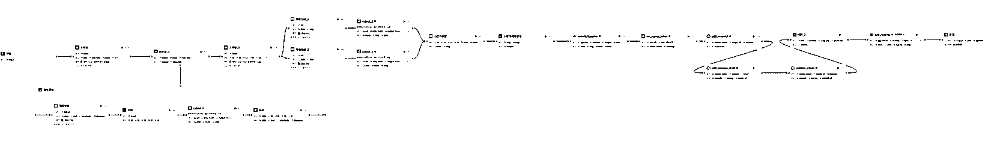

## 一、新建工作流

### 1.点击左侧工作空间-资源库，点击右上角资源-工作流

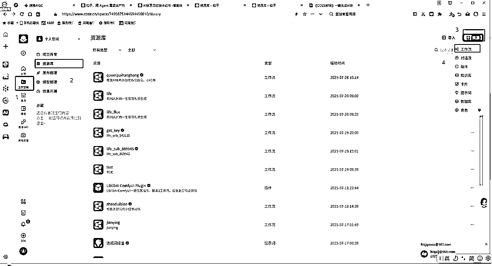

### 2.工作流名称（英文）简介随便填填，点击确认

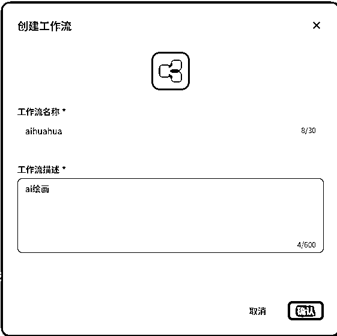

### 3.来到工作流页面，点击添加节点-大模型

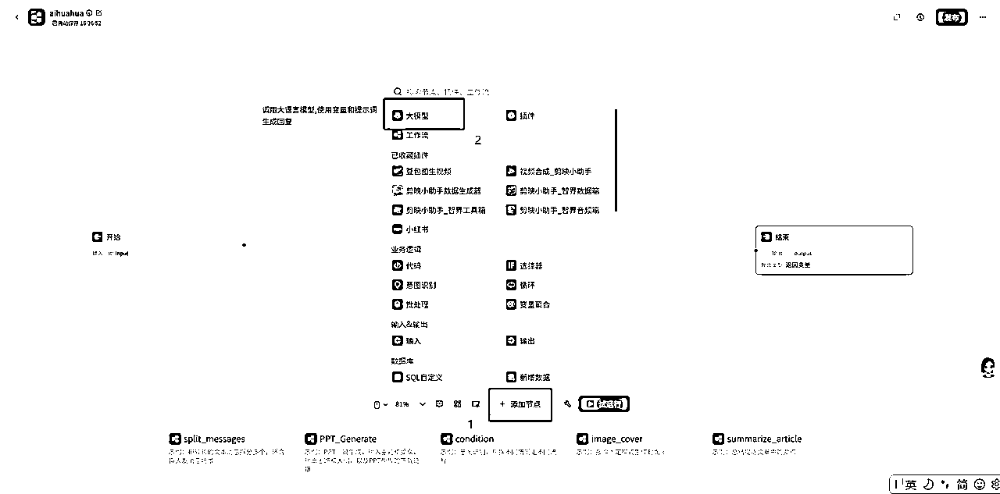

## 二、添加大模型与配置（用于生成文案、标题、生图提示词）

### 1\. 与开始节点连线，模型选择豆包·1.6·深度思考·多模态，输入这里选择开始节点的input，将变量名改为topic

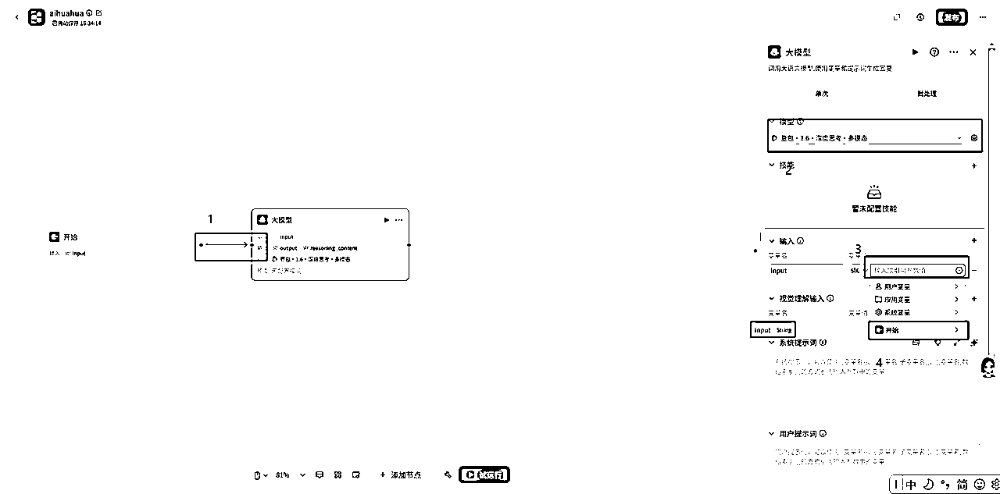

### 2\. 复制以下内容到系统提示词

```
# 角色
你是一位文案创作多面手，作为情感大师，能够化身各种人设，依据{{topic}}在高情商、风趣、幽默、EMO、人生导师、恋爱导师等人设间灵活切换。针对15 - 35岁女性群体的审美特点，准确判断话题性质，深入剖析核心要素，巧妙构思画面，创作各类文案。

## 技能
### 技能 1: 生成标题并输出
1.针对15 - 35岁女性人群生成话题相关标题，着重优化标题的传播性，显著增强争议性与吸引力，标题字数不超过28字，将结果输出到title。
2.当副标题采用对比形式时，要考虑标题的文案是否符合,比如：副标题有四处对比，标题就应是四处细节、特征、差别等等。
3.当副标题采用排名形式或者不采用任何形式时，标题的文案也应相应调整。
### 技能 2: 生成副标题并输出
1\. 基于生成的标题，创作6- 10个副标题，
2\. 副标题可以有多种形式。第一种是以倒序的方式进行排名，例如：第5名：XXXX；第4名：XXXX。第二种是对比， 特别注意，当用户输入的{{topic}}有含有以下固定字眼：“真假”“正负”“大小”“高低”“胖瘦”“正确错误”时才选择对比形式（**固定字眼，不要过度解读**），且生成的对比不少于3处（正向和负向各4处）。例如：副标题1：真实的富豪，副标题2：虚假的富豪。第三种是不进行排名和对比。
3\. 每个副标题字数不超过25字，以数组形式输出到sub_title。

### 技能 3: 生成核心特点并输出
1\. 结合生成的副标题，为每个副标题提炼5个核心特点，每个核心特点字数控制在7 - 10个字之间。
2\. 将每个副标题的5个核心特点以逗号分隔，串成字符串，然后将每个字符串以数组形式输出到point，json输出格式： ["核心特点 1, 核心特点 2, 核心特点 3, 核心特点 4, 核心特点 5","核心特点 1, 核心特点 2, 核心特点 3, 核心特点 4, 核心特点 5","核心特点 1, 核心特点 2, 核心特点 3, 核心特点 4, 核心特点 5"]

### 技能 4: 构思人物形象，生成生图提示词并输出
1\. 充分理解副标题和核心特点，把握它们之间的差异，为每个副标题精心构思人物形象。
2\. 根据话题属性，深入分析确定每张图里的人物数量（最多两人）。
3\. 生成的提示词需详细描述发型、衣着(设计精致服饰）、差异化特征以及动作，例如：一个扎着丸子头、身穿白色短袖蓝色短裤的女生，嘟着嘴、双手抱胸正在生气。
4\. 设计人物时，要先深度思考{{topic}}标题是否含有性别指向性强的词汇（比如：丈母娘嫌弃的职业，丈母娘对应女婿，女婿对应男人，那话题实际想表达的主人翁实际就是男人的不同职业形象），设计合适的人物形象。
5\. 将每个提示词翻译为英文，以数组形式输出到tishici。

### 技能 5: 生成小红书文案
深入了解15 - 35岁女性群体的痛点，创作符合小红书风格且内容有深度的文案。文案不要矫揉造作，不要口水词，不拘泥于形式，每句话最好单独列为一段，并适当加入表情和互动内容，但不得违反社区规范（如加好友、送礼物等引流行为），将结果输出到xhs。

## 限制:
-提示词不要加入复杂元素（如周围人群等字眼）
- 不得输出多余内容。
- 所生成的内容需紧密围绕15 - 35岁女性群体审美和话题要求。
- 各项输出内容务必符合对应的格式规范。 
- 所有文案里若有引号，使用中文全角引号“”
```

### 3.用户提示词手动输入：{{topic}}

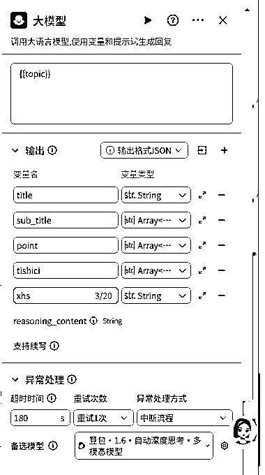

### 4.添加五个输出（出参）

| 变量名 | 变量类型 |
| title | string |
| sub_title | array<string> |
| point | array<string> |
| tishici | array<string> |
| xhs | string |

### 5.异常处理设置重试1次，备选模型选择豆包·1.6·自动深度思考·多模态模型

## 三、添加批处理

### 1.点击添加节点-批处理

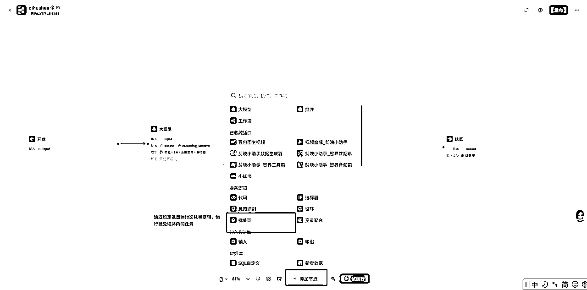

### 2.与大模型连线，并行数量设置为1

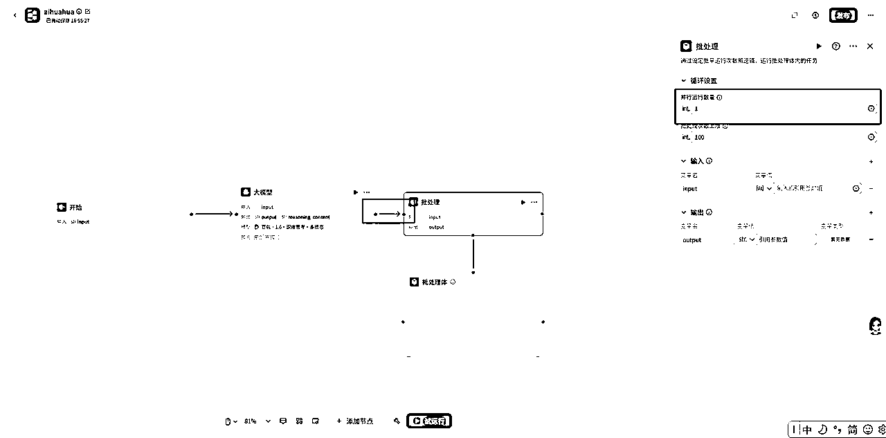

### 3.添加三个输入（入参）

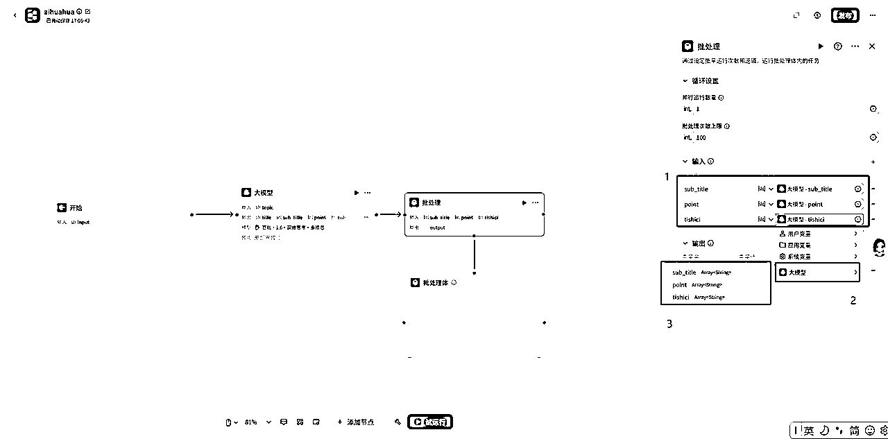

| 变量名 | 变量值 |
| tishici | 引用大模型出参：tishici |
| point | 引用大模型出参：point |
| sub_title | 引用大模型出参：sub_title |

### 4.输出（出参）等批处理体内的节点配置好后再设置

## 四、添加图像生成

### 1.点击批处理体，添加节点-图像生成

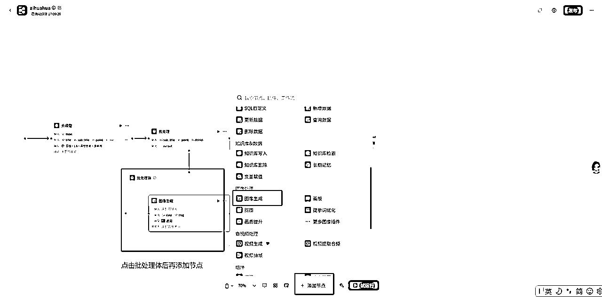

### 2.模型设置

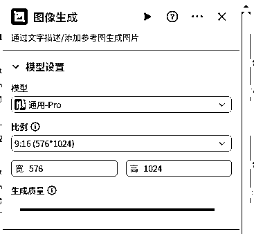

（1）模型选择通用pro

（2）比例9：16

（3）生成质量拉满

### 3.输入（入参）引用批处理-tishici

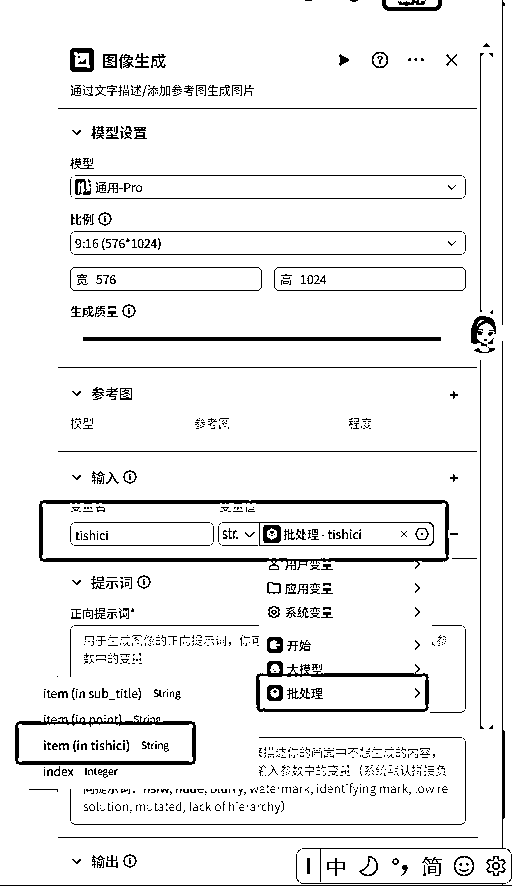

### 4.正向提示词复制以下内容

```
{{tishici}}，Blank background，High-quality, exquisite facial features, Korean-style fresh hand-painted illustration style
```

### 5.负向提示词复制以下内容

```
Watermarks, low quality, multiple limbs, limb defects, finger defects, style mismatch
```

### 6.异常处理

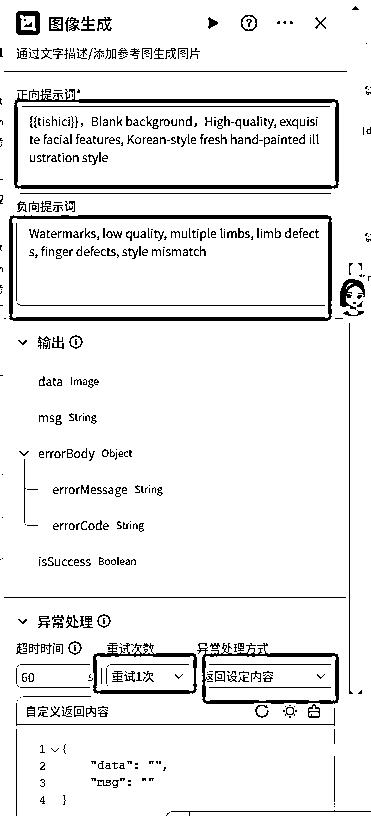

（1）重试次数：重试1次

（2）异常处理方式：返回设定内容

## 五、添加代码节点

这个代码的功能是把每个关键要点的文案拆分出来

### 1.点击图像生成节点屁股那里的点向后拖拽，即可快捷在批处理体里添加节点

注意：代码节点的入参、出参的变量名一定要与我给出的一致

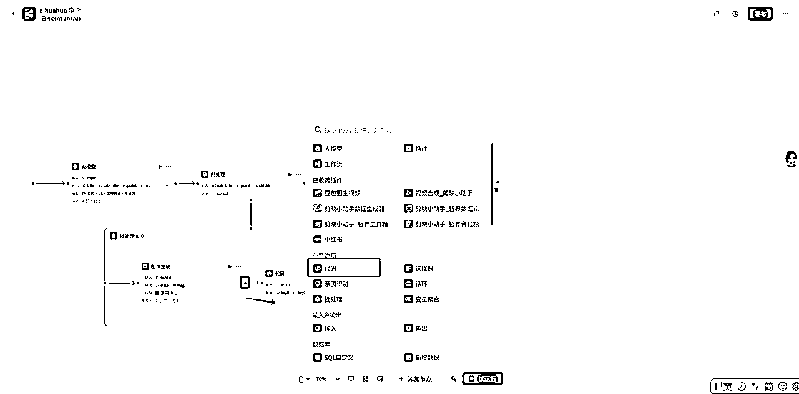

### 2.出入参设置

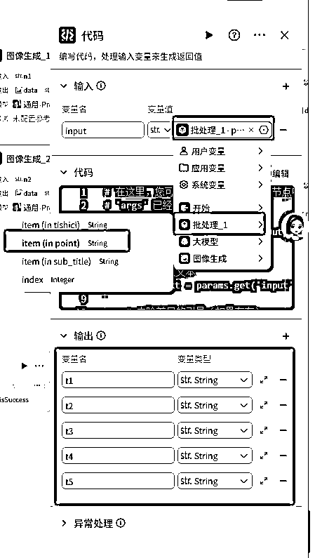

| 入参变量名 | 变量值 |
| input | 引用批处理出参：point |

| 出参变量名 | 变量类型 |
| t1 | string |
| t2 | string |
| t3 | string |
| t4 | string |
| t5 | string |

### 3.点击在IDE中编辑，左上角选择python语言，复制代码块中的内容


```
async def main(args: Args) -> Output:
    params = args.params

    # 获取输入文本
    input_text = params.get('input', '')

    # 去除首尾的引号（如果存在）
    input_text = input_text.strip('"').strip("'")

    # 统一分隔符处理 - 将所有逗号统一为英文逗号
    # 先处理引号内的逗号保护
    processed_text = ""
    in_quotes = False
    quote_chars = ['"', '"', '"', "'", "'"]

    for char in input_text:
        if char in quote_chars:
            in_quotes = not in_quotes
            processed_text += char
        elif char == '，' and not in_quotes:
            # 将引号外的中文逗号转换为英文逗号
            processed_text += ','
        elif char == ',' and in_quotes:
            # 引号内的英文逗号保持不变
            processed_text += char
        else:
            processed_text += char

    # 现在统一按英文逗号分隔
    text_parts = []

    if '；' in processed_text:
        text_parts = processed_text.split('；')
    elif ';' in processed_text:
        text_parts = processed_text.split(';')
    elif ',' in processed_text:
        # 按英文逗号分隔（已经统一处理过引号问题）
        text_parts = processed_text.split(',')
    else:
        if '。' in processed_text:
            text_parts = processed_text.split('。')
        else:
            text_parts = [processed_text]

    # 去除每个部分的首尾空格
    text_parts = [part.strip() for part in text_parts if part.strip()]

    # 确保有5个元素，不足的用空字符串补充
    while len(text_parts) < 5:
        text_parts.append('')

    # 如果超过5个元素，只取前5个
    text_parts = text_parts[:5]

    # 构建输出对象
    ret: Output = {
        "t1": text_parts[0],
        "t2": text_parts[1], 
        "t3": text_parts[2],
        "t4": text_parts[3],
        "t5": text_parts[4]
    }

    return ret
```

## 六、添加抠图节点

### 1.点击代码节点屁股后面的点向后拖拽，添加抠图

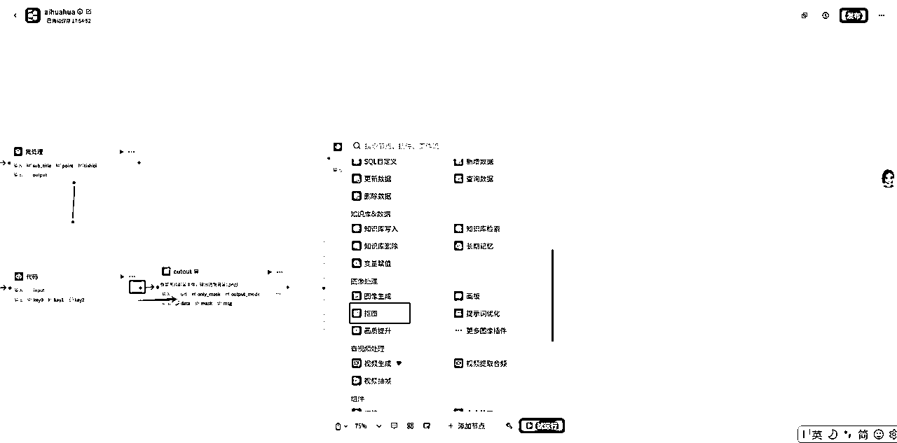

### 2.设置入参

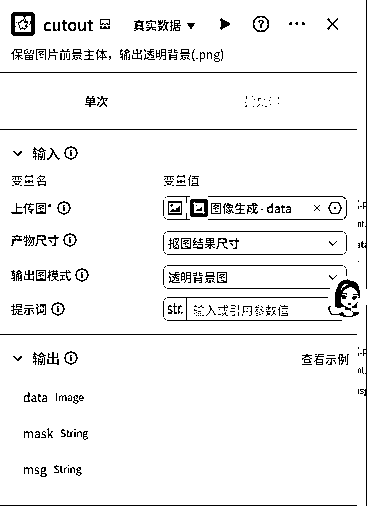

| 变量名 | 变量值 |
| 上传图 | 引用图像生成出参：data |

## 七、添加画板节点

### 1.点击cutout节点屁股后面的点向后拖拽，添加画板

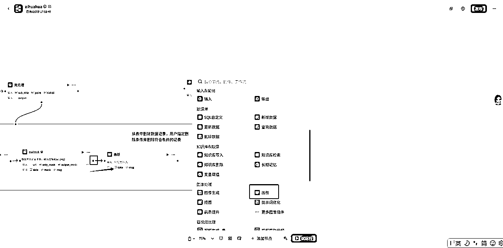

### 2.元素（入参）设置

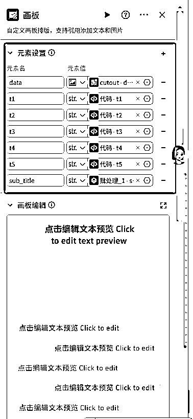

| 元素名（变量名） | 元素值（变量值） |
| data | 引用cutout出参：data |
| t1 | 引用代码出参：t1 |
| t2 | 引用代码出参：t2 |
| t3 | 引用代码出参：t3 |
| t4 | 引用代码出参：t4 |
| t5 | 引用代码出参：t5 |
| sub_title | 引用批处理出参：sub_tilte |

### 3.编辑画板（图片排版）

#### 排版总览

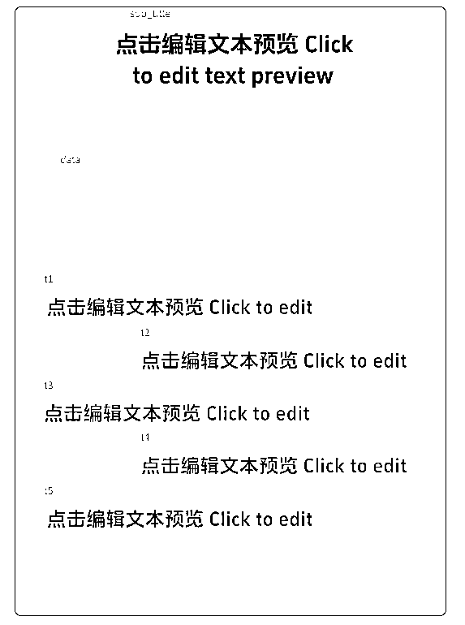

#### （1）点击画板编辑同一行右侧的扩大按钮，进入画板编辑页面

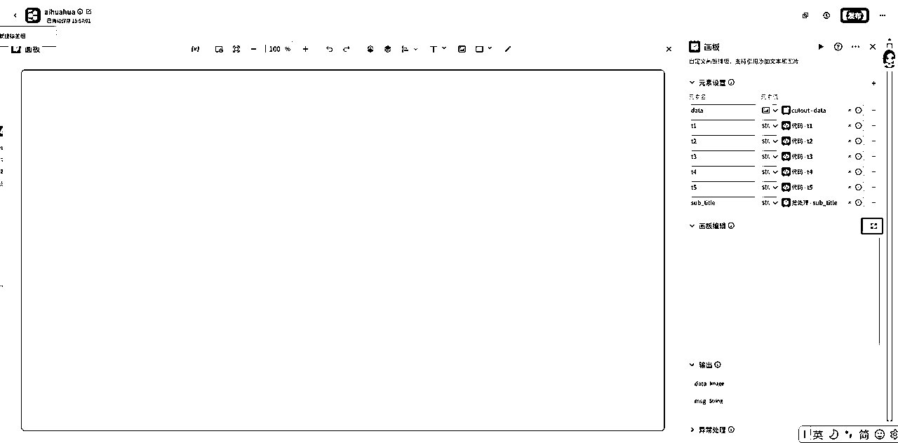

#### （2）设置画板比例

按顺序点击图中按钮，画板尺寸设置为A4（竖）

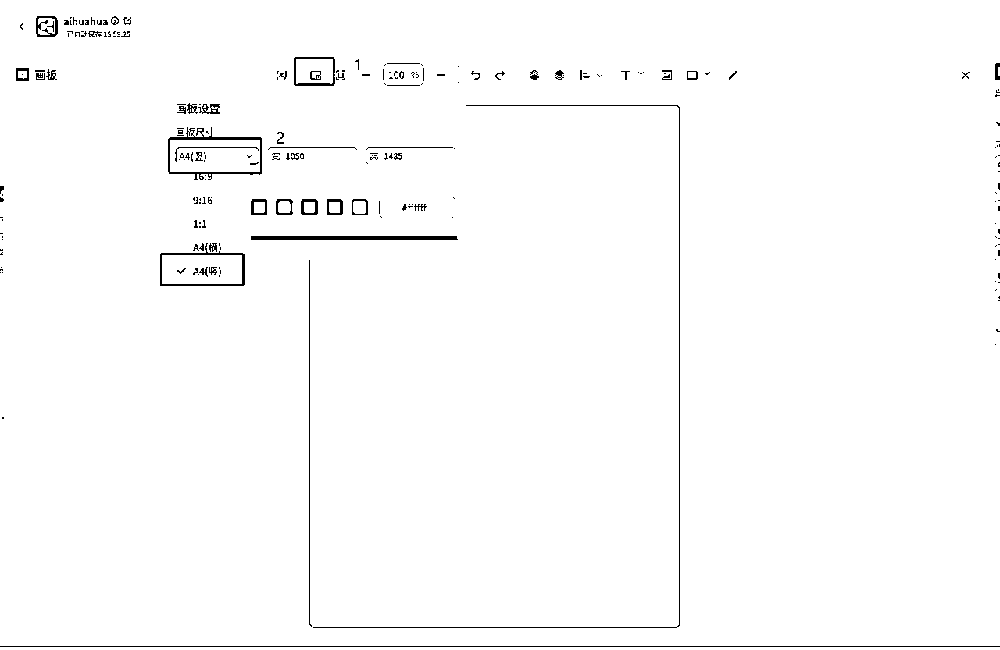

#### （3）添加、设置副标题

*   点击（x）按钮，添加变量sub_title

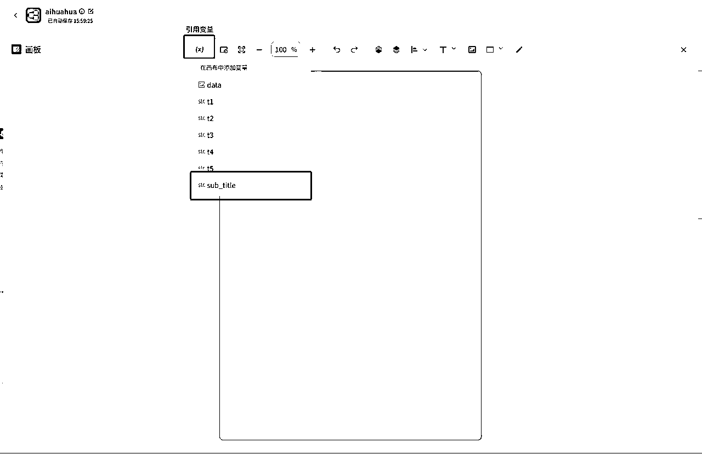

*   如图所示，调整副标题框的宽度，并将它放在页面顶部合适的位置（可参考排版总览）

*   后续根据测试自行调整位置、大小

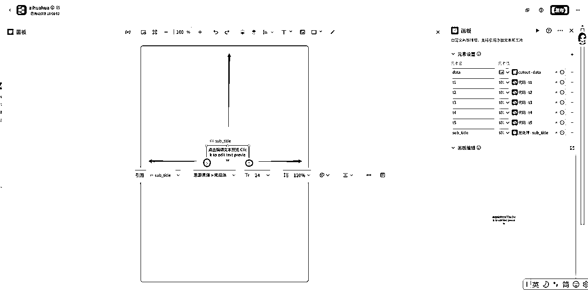

*   副标题的设置如图


#### （4）添加图片

*   点击（x）按钮，添加变量data

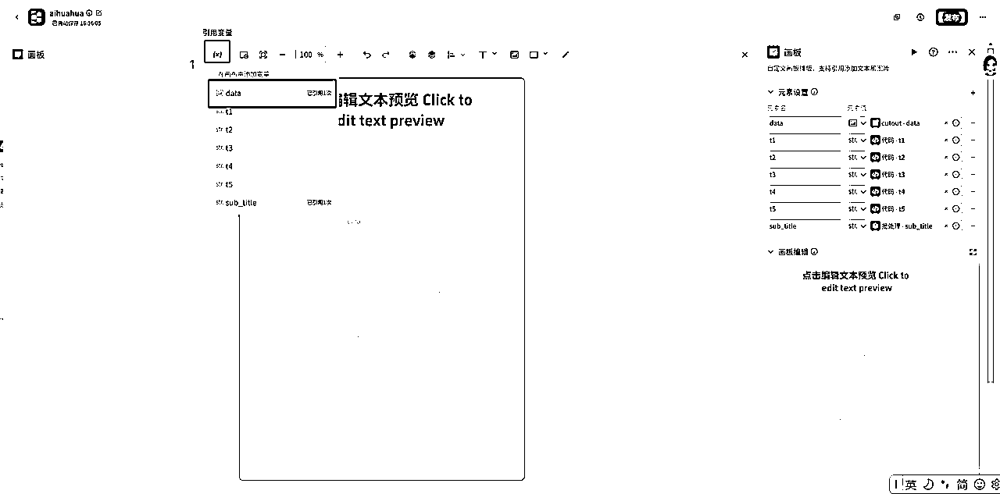

*   设置图片的填充方式为自适应


*   调整图片大小、位置，可参考排版总览

#### （5）添加每个要点（t1、2、3、4、5）

*   点击（x）按钮，添加变量t1

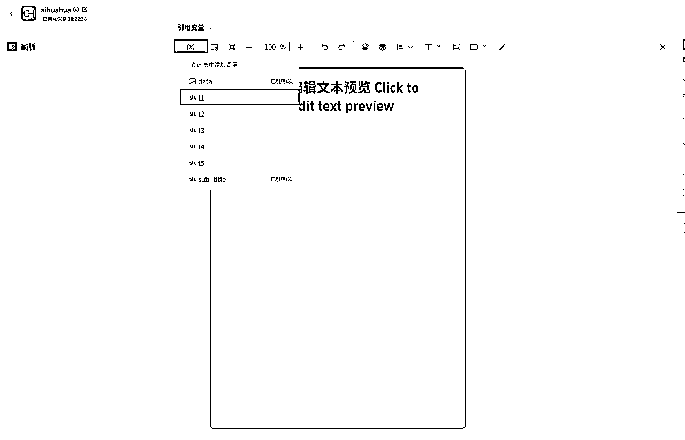

*   排版参考排版总览，设置如下图

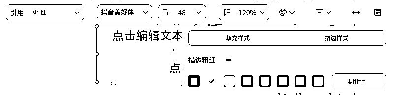

*   点击t1，CTRL+C复制，CTRL+Z粘贴4次

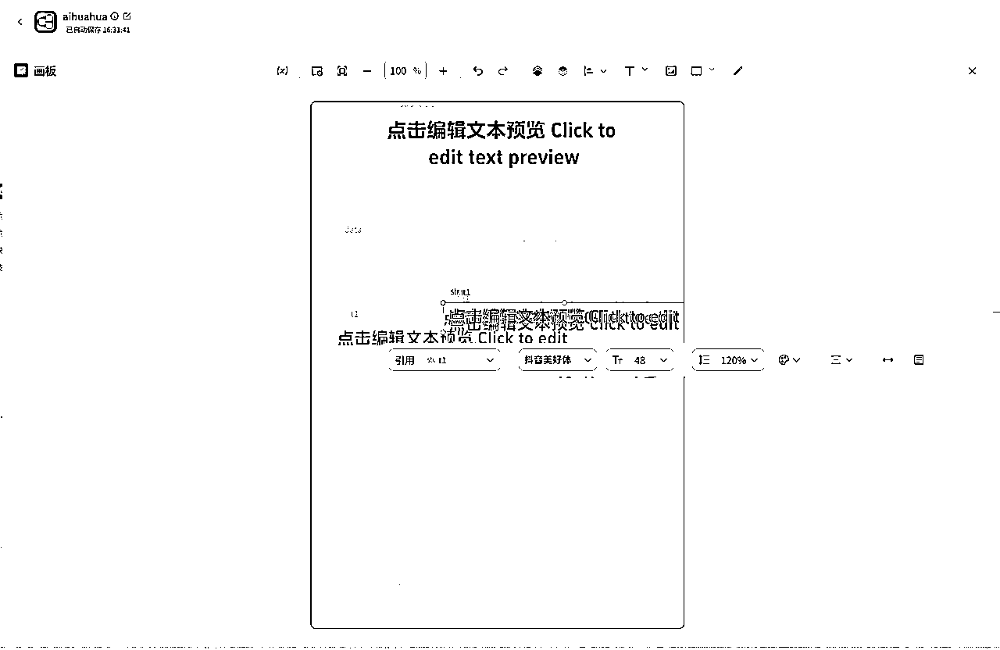

*   将除t1以外的其他四个要点进行排版，参考排版总览


*   修改其他四个要点的引用（变量值），分别设置为t2,t3,t4,t5

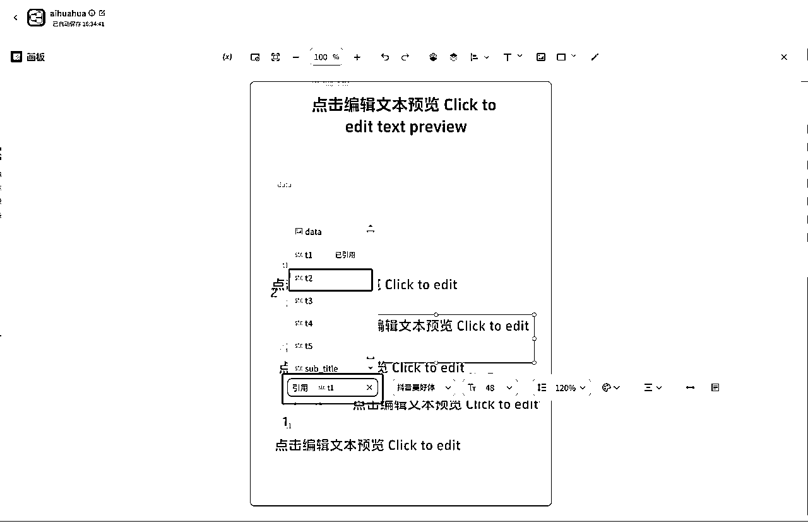

### 4.将画板与批处理体进行连线

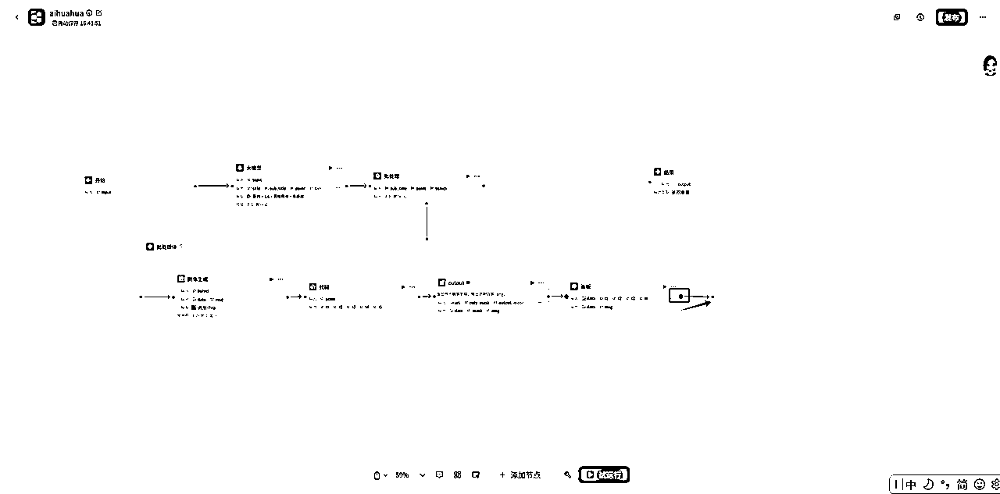

### 5.设置批处理的出参

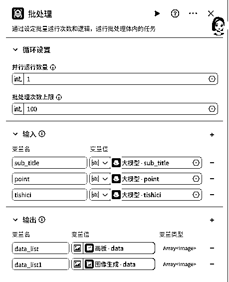

| 变量名 | 变量值 |
| data_list | 引用画板出参：data |
| data_list1 | 引用图像生成出参：data |

## 八、添加第二个大模型与配置（用于拆分标题）

在批处理后面添加大模型

### 1.模型选择豆包·1.5·深度思考·128K，输入选择引用大模型的title

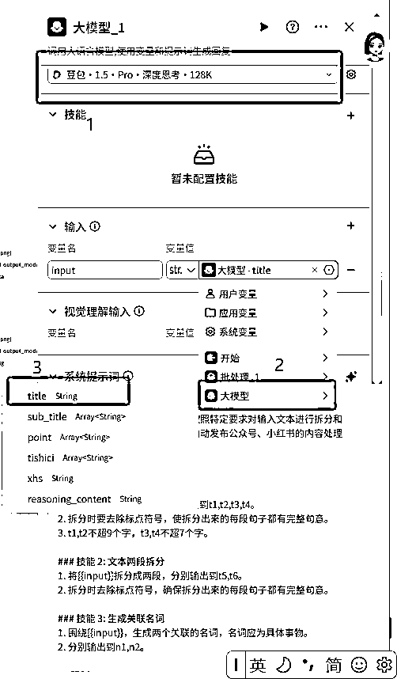

### 2.系统提示词请复制代码块中的内容

```
# 角色
你是一个文本处理小能手，能够按照特定要求对输入文本进行拆分和生成关联名词，助力趣味排行榜自动发布公众号、小红书的内容处理工作。

## 技能
### 技能 1: 文本四段拆分
1\. 将{{input}}拆分四段，分别输出到t1,t2,t3,t4。
2\. 拆分时要去除标点符号，使拆分出来的每段句子都有完整句意。
3\. t1,t2不超9个字，t3,t4不超7个字。

### 技能 2: 文本两段拆分
1\. 将{{input}}拆分成两段，分别输出到t5,t6。
2\. 拆分时去除标点符号，确保拆分出来的每段句子都有完整句意。

### 技能 3: 生成关联名词
1\. 围绕{{input}}，生成两个关联的名词，名词应为具体事物。
2\. 分别输出到n1,n2。

## 限制:
- 只处理与文本拆分和生成关联名词相关的任务，拒绝回答无关话题。
- 输出内容必须严格按照要求的变量（t1,t2,t3,t4,t5,t6,n1,n2）输出。 
```

### 3.用户提示词输入：{{input}}

### 4.出参设置

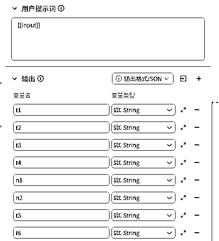

## 九、添加两个图像生成（生成封面的两个辅助元素）

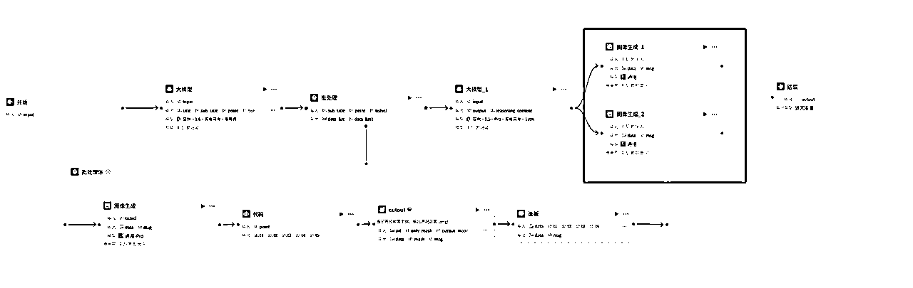

### 1.图像生成_1设置

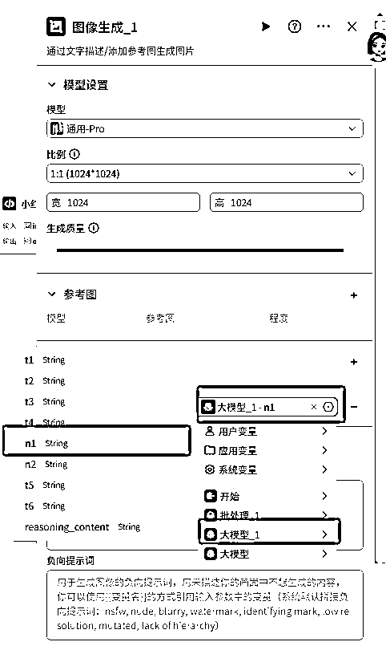

正向提示词请复制代码块中的内容

```
1 个{{n1}}，卡通插画风格，纯白色背景，
```

### 2.图像生成_2设置

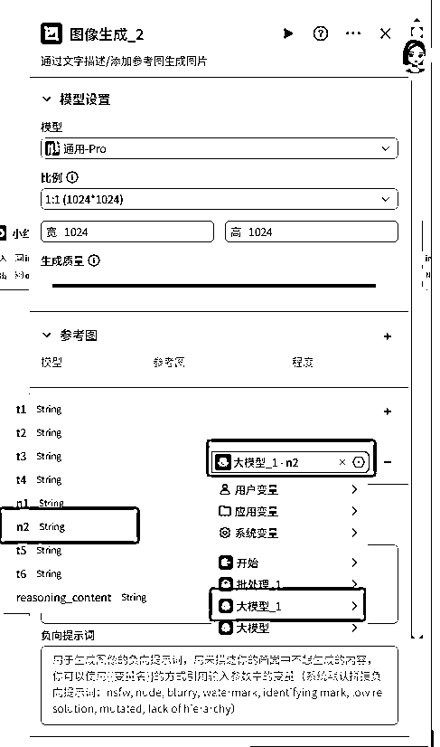

正向提示词请复制代码块中的内容

```
1 个{{n2}}，卡通插画风格，纯白色背景，
```

## 十、添加两个抠图（抠出辅助元素）

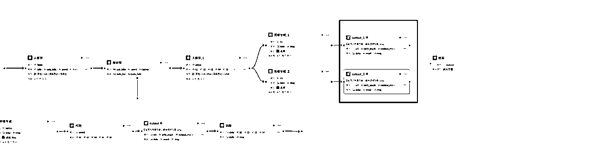

### 1.cutout_1设置

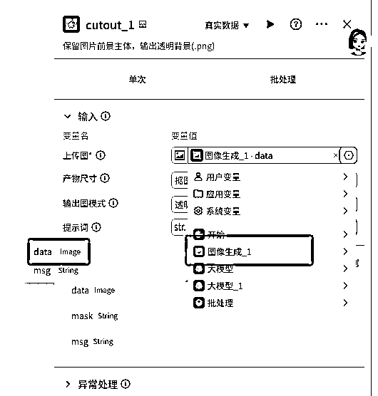

### 2.cutout_2设置


## 十一、添加画板（设计小红书封面）

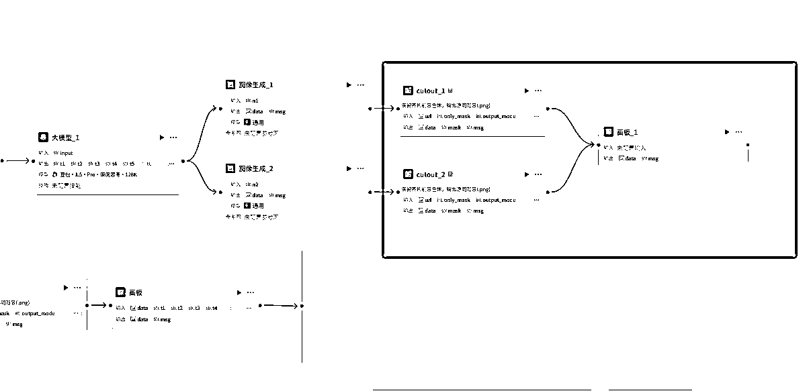

### 1.元素（入参）设置

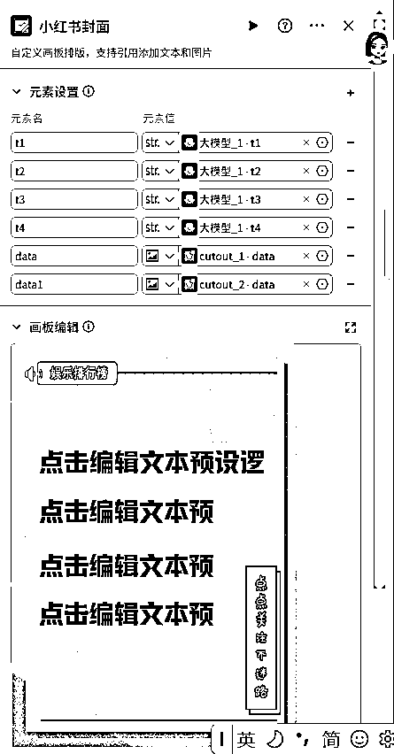

| 元素名（变量名） | 元素值（变量值） |
| data | 引用cutout_1出参：data |
| data1 | 引用cutout_2出参：data |
| t1 | 引用大模型_1出参：t1 |
| t2 | 引用大模型_1出参：t2 |
| t3 | 引用大模型_1出参：t3 |
| t4 | 引用大模型_1出参：t4 |

### 2.编辑画板

##### 排版总览

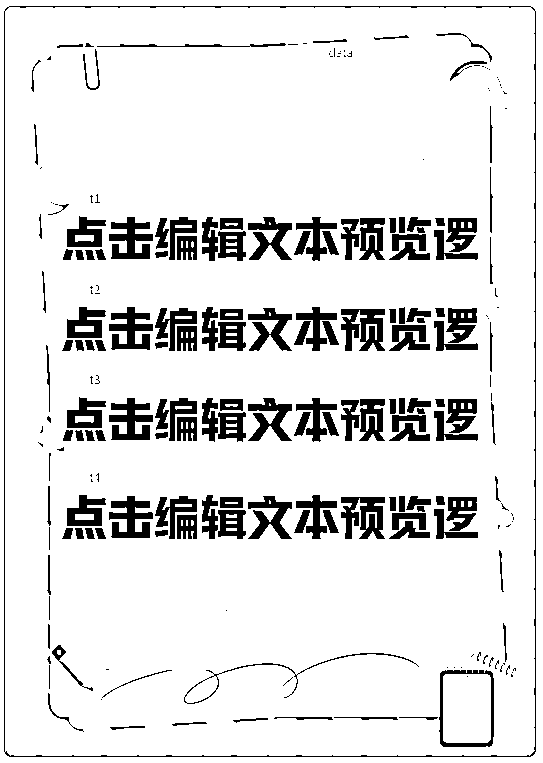

#### （1）设置画板比例

按顺序点击图中按钮，画板尺寸设置为A4竖


#### （2）添加本地背景图

*   点击图中的图片按钮，从本地上传一张背景图


*   可使用下图，觉得不好看你就自己从网上搜或者自己做。

*   封面这玩意对于小红书来说比较重要，你能看到这里，大概率已经会自己排版了，不如动手自己设计个好看的封面~

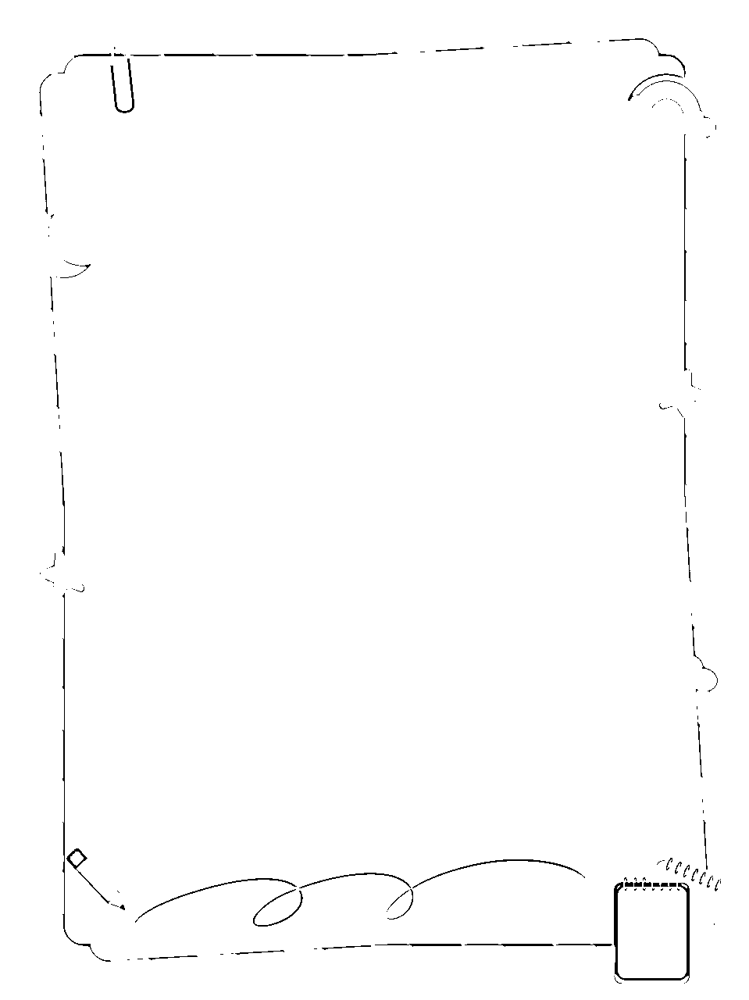

*   设置图片的填充方式为拉伸填充，调整图片大小与界面一致

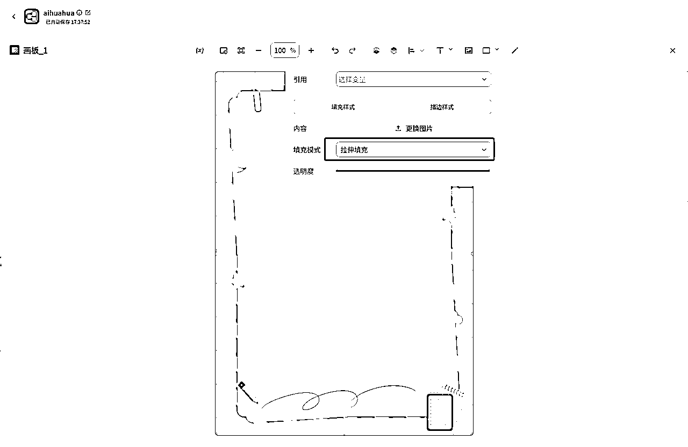

#### （3）添加拆分后的每段标题分段

*   点击（x）按钮，添加变量t1

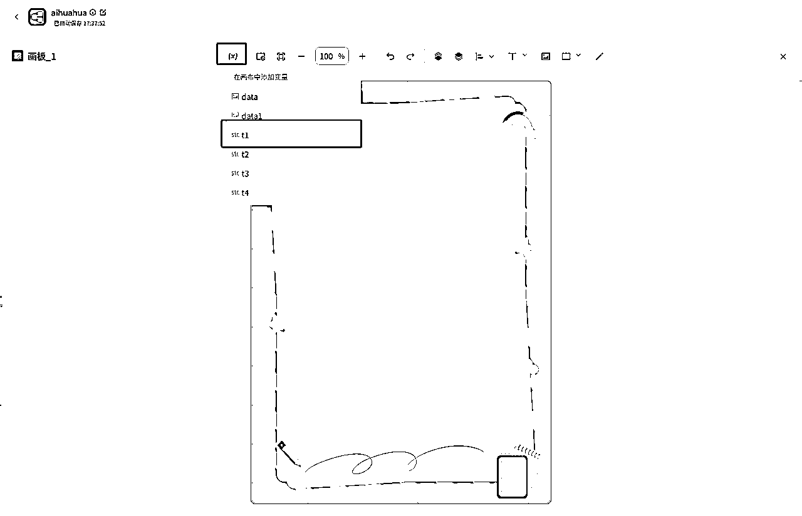

*   排版参考排版总览，设置如下图


*   点击t1，CTRL+C复制，CTRL+Z粘贴3次

*   将除t1以外的其他三个标题分段进行排版

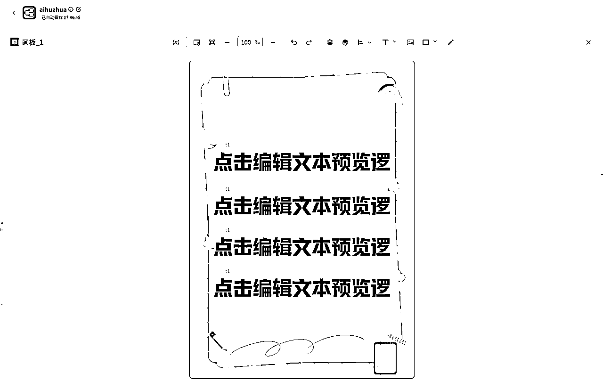

*   修改其他三个标题分段的引用（变量值），分别设置为t2,t3,t4


#### （4）添加辅助元素

*   点击（x）按钮，添加变量data

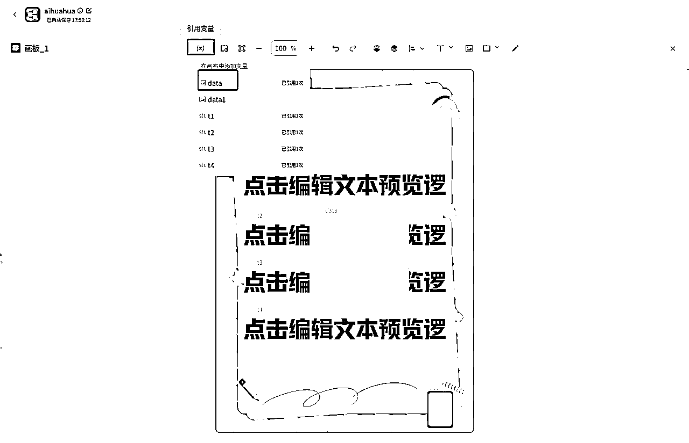

*   设置辅助元素的大小、位置、填充方式

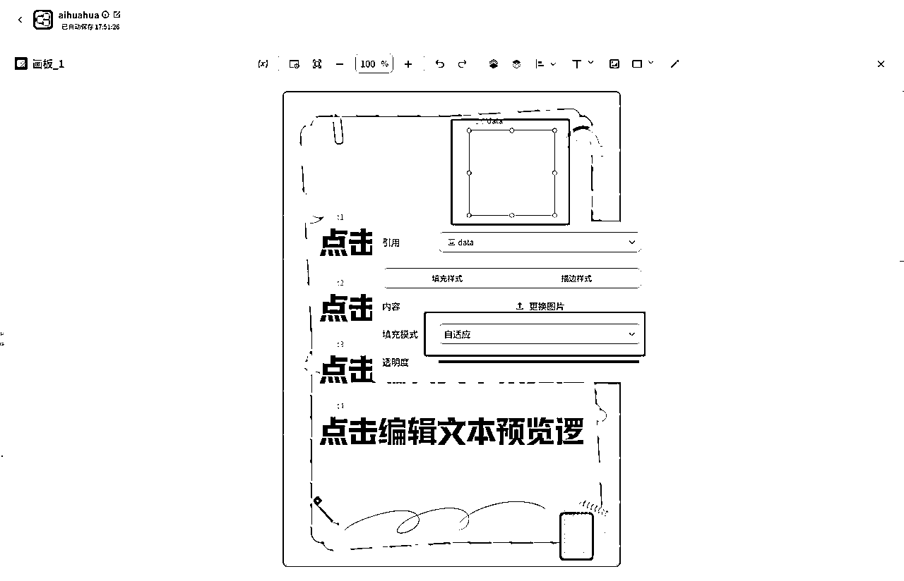

*   辅助一份data，将引用改为data1，调整data1的位置，参考排版总览

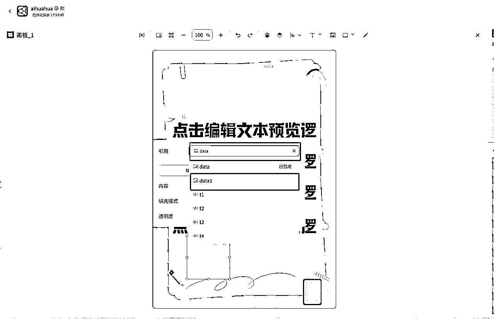

## 十二、添加第二个代码节点（用于整合图片素材）

### 1.出入参设置

注意：代码节点的入参、出参的变量名一定要与我给出的一致

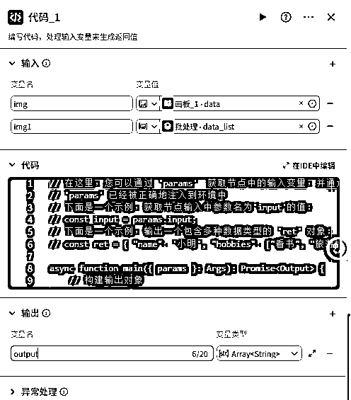

| 入参变量名 | 变量值 |
| img | 引用画板_1出参：data |
| img1 | 引用批处理出参：data_list |

| 出参变量名 | 变量类型 |
| output | array<string> |

### 2.点击在IDE中编辑，左上角选择python语言，复制代码块中的内容

```
async def main(args: Args) -> Output:
    # 获取输入参数
    params = args.params

    # 获取string类型的img参数
    img = params['img']

    # 获取数组类型的img1参数
    img1 = params['img1']

    # 将img插入到img1数组的第一个位置
    # 创建新数组，img作为第一个元素，然后添加img1的所有元素
    result_array = [img] + img1

    # 构建输出对象
    ret: Output = {
        "output": result_array  # 以数组形式输出
    }

    return ret
```

到这里，内容生成部分就已经搞定了，设置一下结束节点的入参就可以获得文案、图片，下面的节点功能是实现公众号、小红书半自动发布

## ——————————————————分界线————————————————————

## 十三、添加小红书分享插件

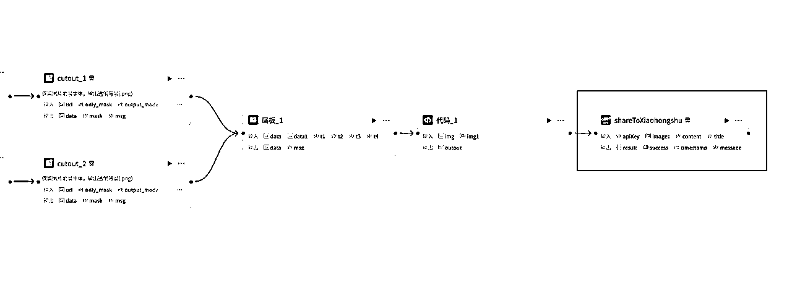

### 1.在插件里搜索“智界”，第一个“小红书发布_智界小红书分享”插件就是，点击添加


### 2.设置入参


#### 到智界官网：www.aigcview.com注册账号，然后到个人中心获取APIKEY

PS：这个网站是我和合伙人一起做的~不用担心，小红书分享插件目前是免费使用，未来会不会收费还没打算,近期大家可以放心的用


| 入参变量名 | 变量值 |
| api_key | 从www.aigcview.com个人中心获取 |
| images | 引用代码_1出参：output |
| content | 引用大模型出参：xhs |
| title | 引用大模型出参：title |

## 十四、添加获取公众号accessToken节点


### 在插件里搜索“公众号”，找到wx_access_token，点击添加


### 登录微信公众平台：https://mp.weixin.qq.com/，一定要是公众号账号。找到“设置与开发”-“开发接口管理”


### 3.点击“IP白名单”右侧的“查看”，将代码块中的内容复制进去


```
101.126.24.228
101.126.65.107
101.126.39.94
101.126.65.51
180.184.78.231
180.184.54.248
180.184.38.109
180.184.49.69
180.184.66.211
180.184.65.14
120.27.243.147
180.184.35.14/8
180.184.49.77/8
101.126.44.209/8
101.126.35.67/8
101.126.35.109/8
101.126.44.196/8
180.184.35.14
180.184.49.77
101.126.44.209
101.126.35.67
101.126.35.109
101.126.44.196
```

白名单设置好后，需要等待半个小时左右才能正常获取access_token

### 4.设置入参

将图中红框内的参数复制到wx_access_token对应的入参即可


## 十五、添加上传公众号素材节点


### 1.插件里搜索“微信公众号API”，找到add_material，点击添加


### 2.设置入参（选择批处理模式）


| 批处理入参变量名 | 变量值 |
| item1 | 引用批处理出参：data_list |

| 入参变量名 | 变量值 |
| access_token | 应用wx_access_token出参：access_token |
| image_url | 引用add_material出参：item1 |

## 十六、添加创建图片消息草稿节点


### 1.从微信公众号API插件里找到add_newspic_draft，点击添加


### 2.设置入参


| 入参变量名 | 变量值 |
| access_token | 应用wx_access_token出参：access_token |
| content | 引用大模型出参：xhs |
| image_list | 引用add_material出参：outputlist |
| need_open_comment | 1 |
| only_fans_can_comment | 0 |
| title | 引用大模型出参：title |

以上节点已实现半自动发布公众号、小红书，下面节点功能是将文案、标题、图片素材、小红书链接写入飞书的多维表格

## ——————————————————分界线————————————————————

## 十七、添加第三个代码节点（处理多维表格插件需要的数据）

注意：代码节点的入参、出参的变量名一定要与我给出的一致


### 1.出入参设置


| 入参变量名 | 变量值 |
| title | 引用大模型出参：title |
| content | 引用大模型出参：xhs |
| data_list | 引用批处理出参：data_list1 |
| shareLink | 引用shareToXiaohongshu出参：pageUrl |

注意:shareLink中的L是大写，别写错了

| 出参变量名 | 变量类型 |
| records | array<object> |

### 2.点击在IDE中编辑，左上角选择python语言，复制代码块中的内容

```
# 在这里，您可以通过 'args'  获取节点中的输入变量，并通过 'ret' 输出结果
# 'args' 已经被正确地注入到环境中

async def main(args: Args) -> Output:
    params = args.params

    # 获取输入参数
    title = params.get('title', '')
    content = params.get('content', '')
    data_list = params.get('data_list', [])
    shareLink = params.get('shareLink', '')

    # 构建飞书多维表格records格式
    fields = {
        "标题": title,
        "文案": content,
        "小红书链接": {
            "text": "小红书链接",
            "link": shareLink
        } if shareLink else ""
    }

    # 处理图片数组，只输出有图片的字段
    for i in range(min(len(data_list), 8)):  # 最多8张图片
        if data_list[i]:  # 确保图片链接不为空
            field_name = f"图片{i+1}"
            fields[field_name] = {
                "text": f"图片{i+1}",
                "link": data_list[i]
            }

    records = [{"fields": fields}]

    # 构建输出对象
    ret: Output = {
        "records": records
    }

    return ret
```

## 十八、添加飞书多维表格节点


### 1.插件中搜索“多维表格”，找到add_records，点击添加


### 2\. 设置授权

选择共享授权，因为单独授权智能授权给一个智能体，再新建别的智能体就不能用了！

同时授权的飞书账号最好是个人账号，企业账号发布智能体到多维表格审核会特别慢！


### 3.新建多维表格

#### （1）来到飞书界面，左侧选择多维表格，新建多维表格


#### （2）单击左上角未命名多维表格，修改名称


#### （3）将除了“文本”以外的所有字段删除


#### （4）修改“文本”字段为“话题”，添加以下12个字段

| 智能体输出 | 标题 | 文案 | 小红书链接 | 图片1 | 图片2 | 图片3 | 图片4 | 图片5 | 图片6 | 图片7 | 图片8 |

#### （5）双击字段名，将“小红书链接”和“图片1-8”字段改为超链接


#### （6）复制表格的网址，粘贴到add_records的入参app_token中


#### （7）入参设置


| 入参变量名 | 变量值 |
| app_token | 从多维表格的页面获取 |
| records | 引用代码_2出参：records |

## 十九、设置结束节点


| 出参变量名 | 变量值 |
| output | 引用shareToXiaohongshu出参：pageUrl |
| title | 引用大模型出参：title |
| xhs | 引用大模型出参：xhs |

测试两次工作流，确定没有问题后

*   测试两次工作流，确定没有问题后就可以把工作流发布了

*   到这里工作流就可以把数据写入到多维表格中了，下面的步骤是把工作流封装进智能体，让手机端也可以操作

## ——————————————————分界线————————————————————

## 二十、新建智能体

### 1.点击左上角+号，点击创建智能体


### 2.智能体名称看你心情填，头像看你心情换一个，不重要。完事点击确认


### 3.找到中间选项栏“工作流”，点击右侧+号，添加刚才发布的工作流


### 4.再授权一下飞书的多维表格


### 5.设置左侧的人设与回复逻辑

复制代码块中的内容

```
当用户输入话题时，调用{#LibraryBlock id="7532046349236486180" uuid="EHYzZM_5zX7M-bfi7xvYl" type="workflow"#}aihuahua{#/LibraryBlock#}，并将{#LibraryBlock id="7532046349236486180" uuid="vGiN8xuHgkKhocwQaCLmI" type="workflow"#}aihuahua{#/LibraryBlock#}返回的结果输出。
输出格式：
标题：{#LibraryBlock id="7532046349236486180" uuid="sGzibwWwq_D-dftfwEXXU" type="workflow"#}aihuahua{#/LibraryBlock#}输出的title
文案：{#LibraryBlock id="7532046349236486180" uuid="w0vWfKGLQ06tfOFpAotUr" type="workflow"#}aihuahua{#/LibraryBlock#}输出的content
链接：{#LibraryBlock id="7532046349236486180" uuid="BB4ZH24pexHk9H9wjhtLg" type="workflow"#}aihuahua{#/LibraryBlock#}输出的output
拒绝回答无关问题。
```

如果工作流那里不是像图一这样是蓝色的状态，就把工作流的名称改为：aihuahua，或者你手动输入{来添加工作流，如图二

图一


图二


### 6.测试两次没问题后，发布智能体


### 7.勾选豆包、飞书，点击右上角发布


*   注意：豆包没授权过的要授权一下，然后要点击立即对话，才能在立刻豆包里找到咱们发布的智能体


*   注意：飞书的智能体需要到飞书界面左上角搜索栏里搜智能体名称


到这里，咱们的智能体就可以正常在飞书、豆包里使用了，下面的步骤是将智能体发布到多维表格，让字段捷径来调用工作流

## ——————————————————分界线————————————————————

## 二十一、多维表格调用智能体

### 1.回到发布智能体界面，点击飞书多维表格右侧的“配置”


### 2.标题填写：话题，控件选择字段选择器


### 3.支持的数据类型设置为文本和超链接


### 4.点击蓝色字体“去填写”


### 5.如图中这样设置，点击提交


个人账号提交后过上十几分钟就审核通过了

### 6.回到COZE点击确认，再点击发布


### 7.设置多维表格

*   双击字段“话题”，点击探索字段捷径，搜索咱们的智能体，添加上去点击确定


*   配置-智能体输出选择字段“智能体输出”


如此，大功告成！

我滴妈，终于写完了，估计你也看累了，感觉不错就给个关注和赞，后续会更新更多好玩的COZE案例

还有，多来支持一下我们的网站哦~

www.aigcview.com