# 一键收集笔记：n8n工作流×快捷指令 ，秒存飞书表格

> 来源：[https://oet21ud8a2.feishu.cn/docx/DYrDd6QPooYWP2xTYmQcHqrZnTf](https://oet21ud8a2.feishu.cn/docx/DYrDd6QPooYWP2xTYmQcHqrZnTf)

大家好，我是富百，在生财联合办公，Youtube深海圈教练，擅长自动化工作流。不做低效重复的事情。

亦仁老大今天刚发n8n超级标，刚好我有个记笔记的需求，一直没被满足，场景如下

刷公众号看到金句，刷小红书、即刻、推特看到好文案，想存，要么切笔记app，要么回到微信界面发给自己

脑子突然冒出一些灵感，一会写在东边，一会写在西边，最后自己也不知道写在哪了

起初使用笔记软件，但要经常切换软件很麻烦，苹果又会杀后台，切换一下可能等十秒，记笔记的欲望刚上头就下头了。

后来发给自己的微信小群，但用着用着也发现，小群的笔记很难整理，没法编辑，没法打勾

但是我们都是创作者，我需要找到一个最小阻碍的方法，让我保持创作的热情

我不想折腾，又想留住它们。我只想 一个动作：复制一下，放进同一个我熟悉的地方。

我再定时集中整理，就好。

于是我用n8n搭建了一个不用切换窗口，秒存笔记进飞书表格的工作流

一键保存我的灵感笔记全进同一张表。

相当简单，但又十分好用，而且扩展性很强，也可以根据每个人喜好私人订制

## 效果展示

只需要框选复制，然后激活快捷指令，这段内容就会直接进到你的飞书多维表格，

任何软件都可以使用这一招，或者你自己写的，只要选中复制，一样可以到达，完全不用切换窗口，懒人的解决方法就是这么挑剔。

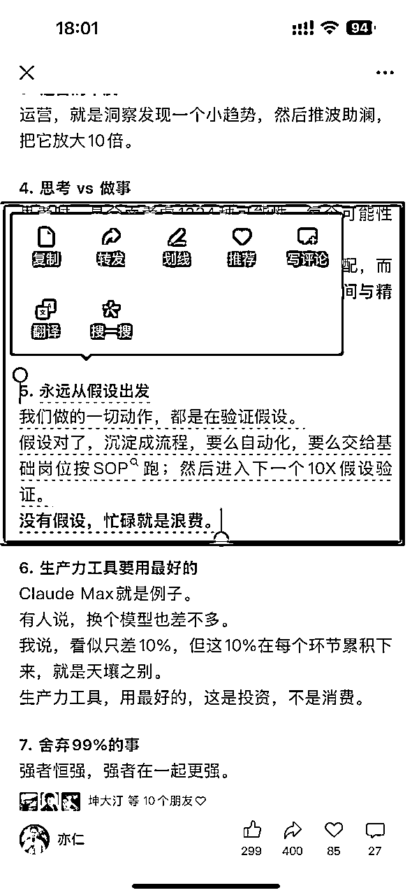

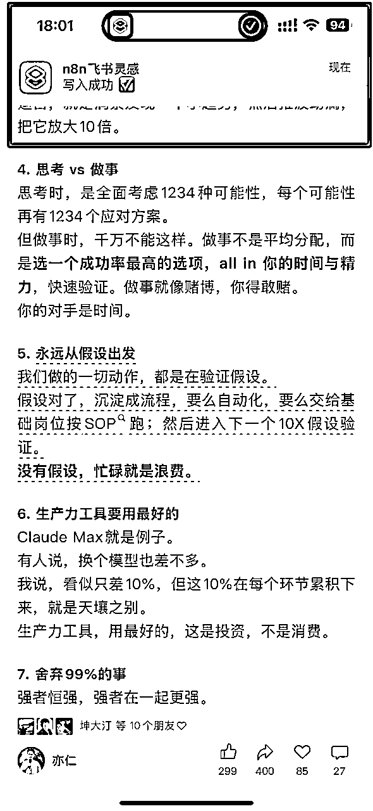

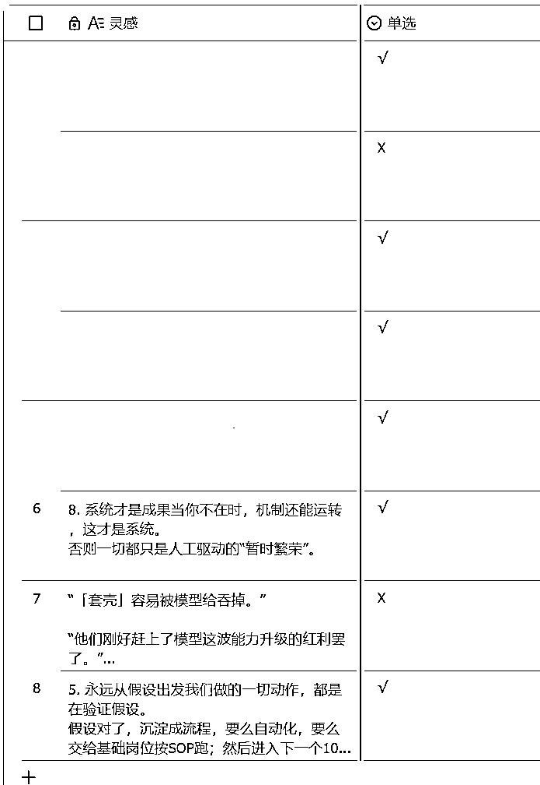

而且笔记放在飞书表格，手机，电脑打开都很方便，使用也很习惯，

多维表格还可以打勾，分类，打标签，拓展功能强大。

另一方面，飞书自带工作场域，一打开飞书，更容易进入工作状态，

有些人收集东西是复制后发给微信的自己，但只要打开聊天界面，可能收集两分钟，回复打断5分钟。

## 实操部分

### 工作流整体思路

手机端复制 → 激活快捷指令 -激活 n8n 工作流，整套流程非常简单，小白也可以轻松实现

### 实现准备

*   一个可访问的 n8n（云版或自建）

*   飞书应用：能拿到 app_id / app_secret，表格的 app_id / table_id，并给应用开写入权限

### 具体步骤

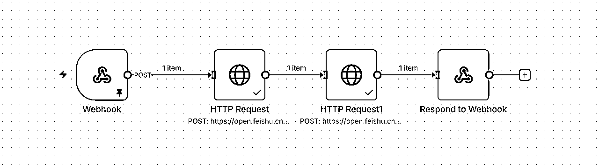

这个n8n工作流搭建起来非常简单，一共就四个节点，

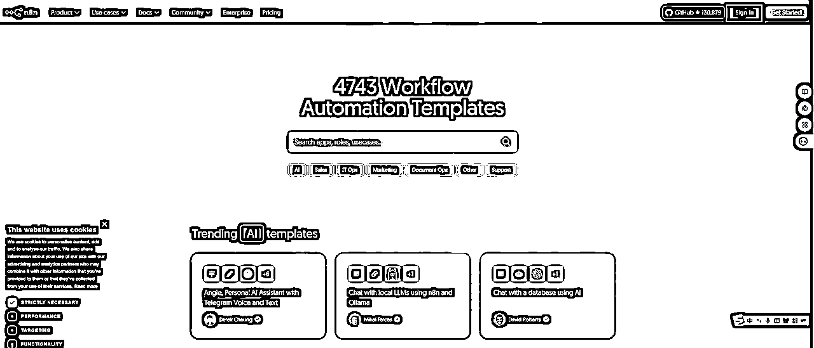

建议大家直接使用官方的云版本，可以免费体验15天，登录即可使用，没有环境配置问题，

验证了是否真满足自己需求，后面再迁移本地或其他云端就可以了（再学习一下后面n8n的航海手册即可）

https://n8n.io/workflows/

登录后就会来到下面主页


点击create workflow就跳转到搭建工作流页面

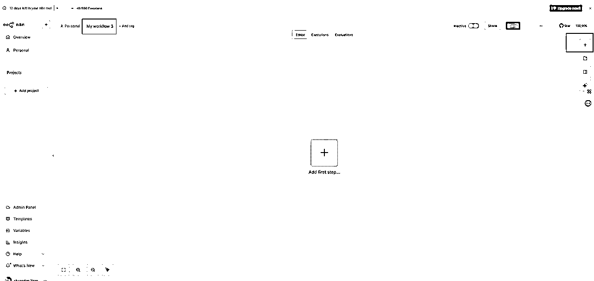

左上修改工作流名称，右上+号就可以搜索相关功能节点

### 第一个节点

创建Webhook，这是接受快捷指令的信号使用的，所以作为第一个启动节点

解释一下Webhook：

一种特殊的 API 使用方式。它允许一个软件在发生特定事件（比如收到新订单）时，自动“呼叫”并通知另一个软件（比如 n8n），相当于一个自动触发的信号。

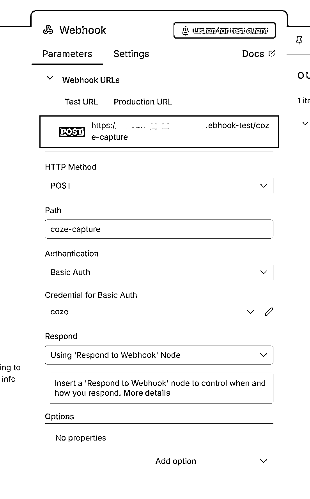

参数设置

记住上面post链接，后面修改快捷指令会使用到

HTTP Method:选择post

Path：可以自定义修改，这个参数会显示在链接里，方便识别webhook功能使用

Authentication：选择最简单的Basic Auth即可,选择之后按下图自己填写账号密码，做下记录后面快捷指令要用到

Respond: 选择 Using 'Respond to Webhook' Node 这个是配合最后一个节点，回传结果是否成功返回给快捷指令，这样手机才能看到最终结果，是否成功写入飞书表格，避免我们辛苦记录的内容，最后发现没写入飞书

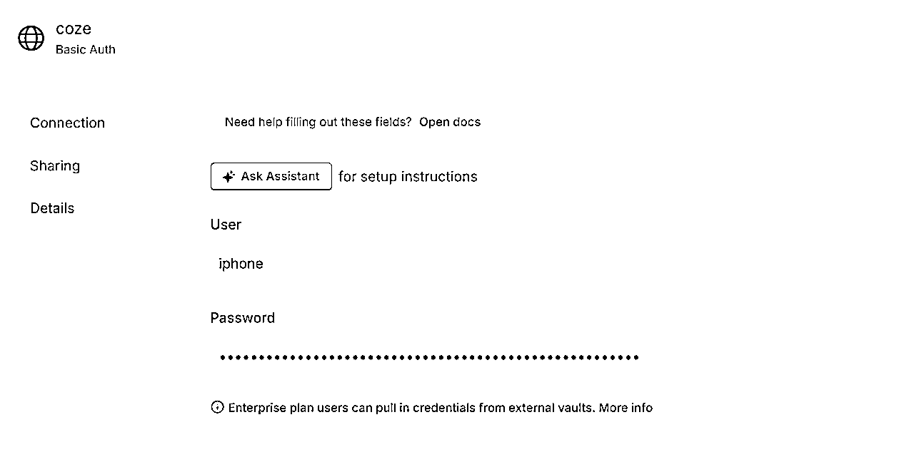

### 第二个节点

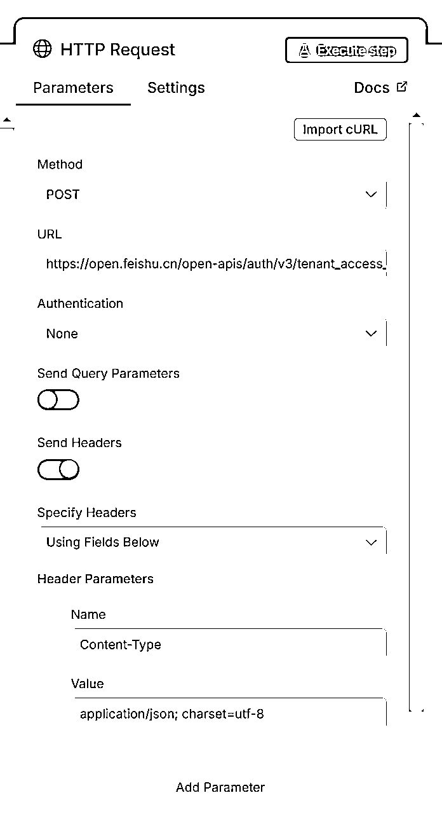

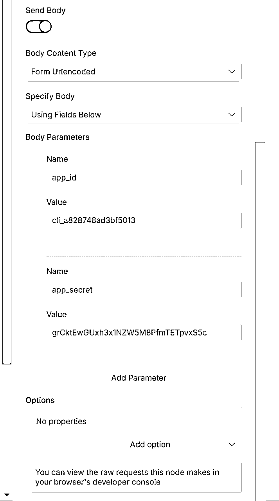

参数设置

Method:Post

url：https://open.feishu.cn/open-apis/auth/v3/tenant_access_token/internal

打开Send Headers

Specify Headers选择Using Fields Below

Header Parameters填写

Name:Content-Type

Value:application/json; charset=utf-8

打开Send Body

Body Content Type选择Form Urlencoded

Specify Body选择 Using Fileds Below

Body Parameters填写

Name:飞书应用的app_id

Value:飞书应用的app_secret

### 设置飞书应用和多维表格

如何获取飞书应用的app_id 和app_secret


1\. 打开网页https://open.feishu.cn/app?lang=zh-CN创建应用

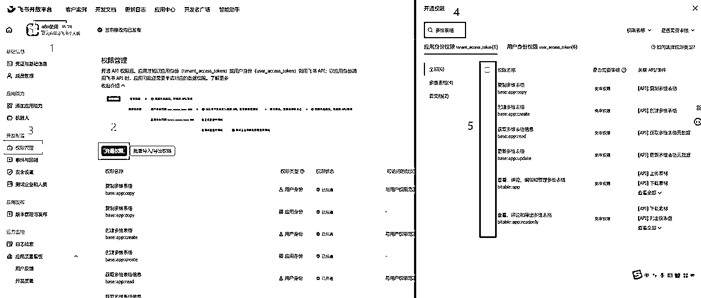

2 修改应用名称，这个名称要记下，后面多维表格要搜索这个应用

3 开通权限，根据截图标注顺序将多维表格相关权限全部打开

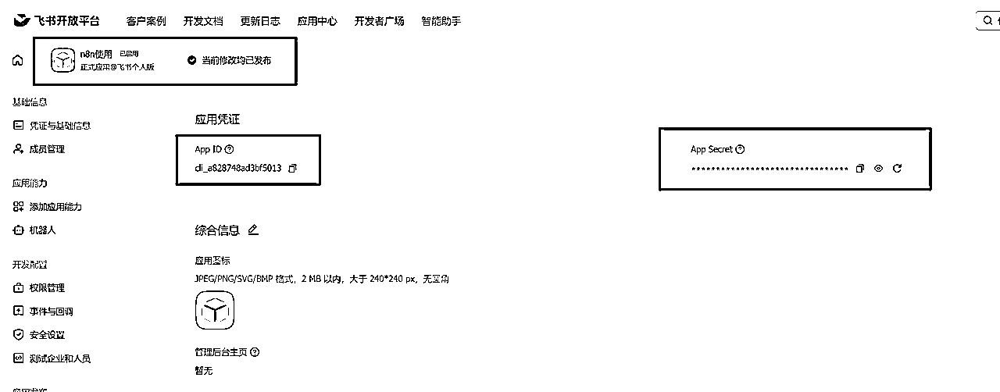

4 发布应用，并记下App_id 和App_secret，填进第二个节点

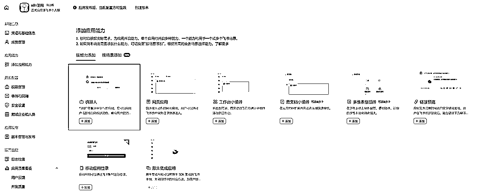

5 添加应用能力：机器人能力

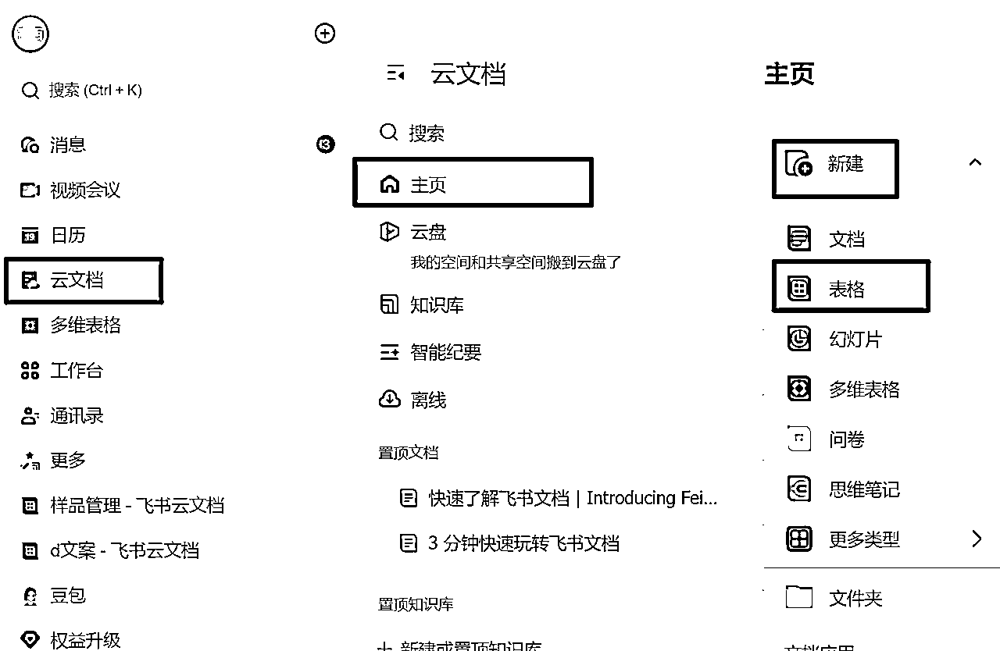

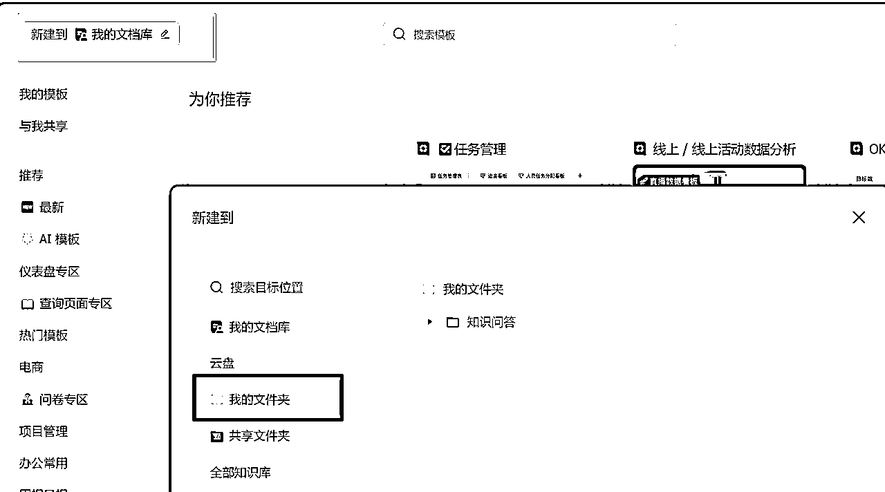


6 创建多维表格，要创建在我的文件夹路径，默认在我的文档库的是电子表格，链接格式不一样，调用方式也不一样

```
https://oet21ud8a2.feishu.cn/base/Z9Hpbss2bam09TsXmSJc75Uynk8?table=tblelis3dV08cUW8&view=veww29LK0a
```

确保你的链接格式如下，base后面值与table后面的值后面节点要用

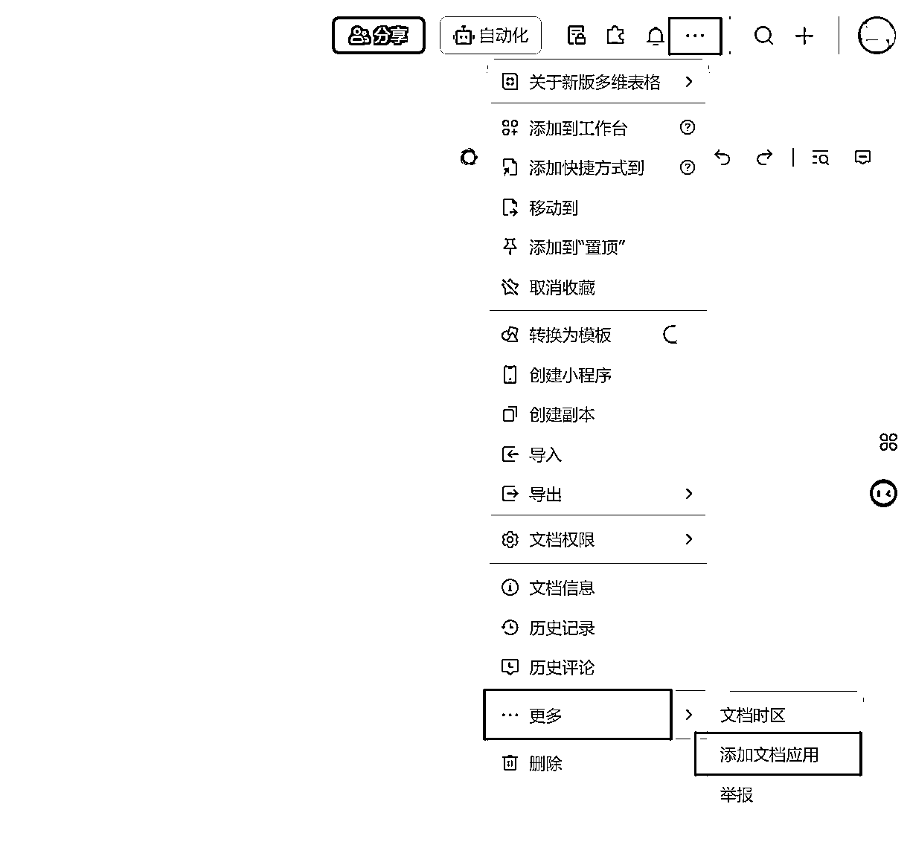

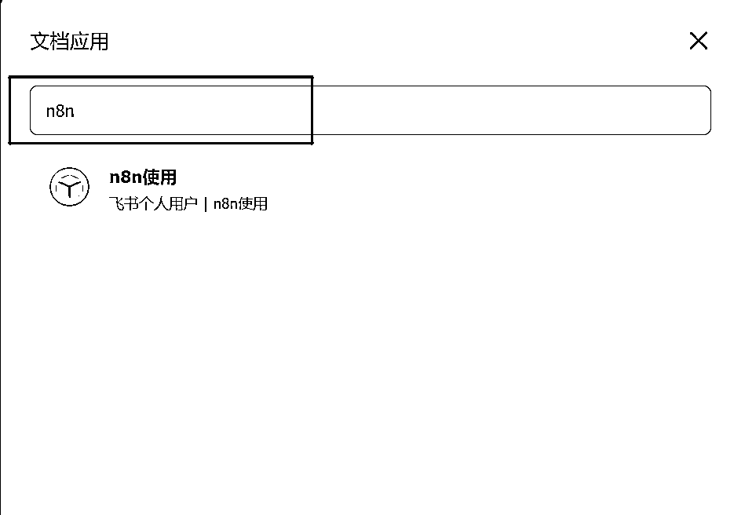

点击表格右上方的三个小点，添加刚刚创建的机器人，要搜索名称才能搜到

### 第三个节点

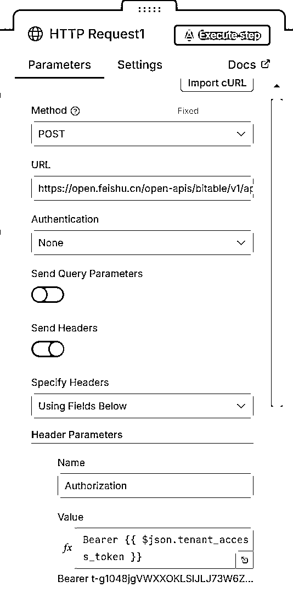

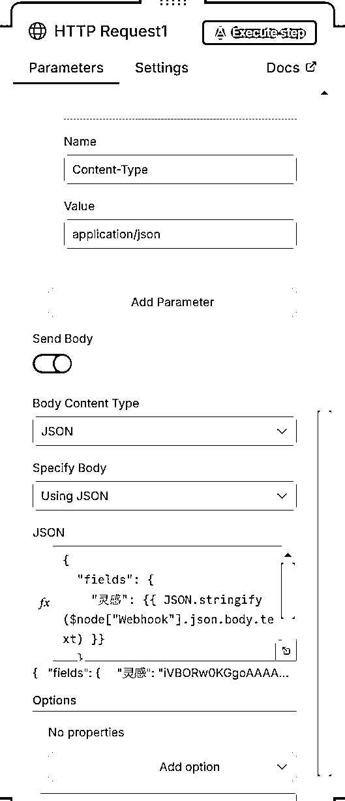

参数设置

Method:Post

url：https://open.feishu.cn/open-apis/bitable/v1/apps/KUJRbQmP7a5Sq0sQ1KKcLGQqnkf/tables/tbl3OYCpUshsPeZg/records

打开Send Headers

Specify Headers选择Using Fields Below

Header Parameters填写

Name:Authorization

Value:Bearer {{ $json.tenant_access_token }}

Add Parameter

Name:Content-Type

Value:application/json

打开Send Body

Body Content Type选择JSON

Specify Body选择 Using JSON

JSON 选择 Expression

```
{
  "fields": {
    "灵感": {{ JSON.stringify($node["Webhook"].json.body.text) }}
  }
}

```

### 第四个节点

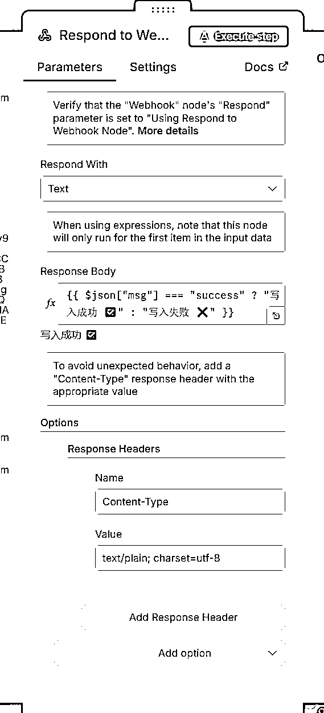

设置参数

Respond With选择text格式

Response Body 填入

```
{{ $json["msg"] === "success" ? "写入成功 ✅" : "写入失败 ❌" }}
```

这样n8n的工作流就搭建完成

### 搭建快捷指令

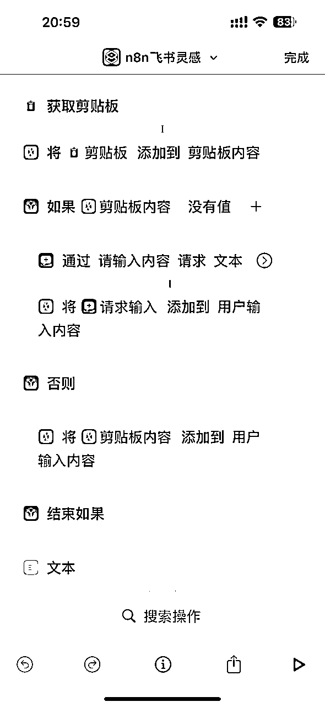

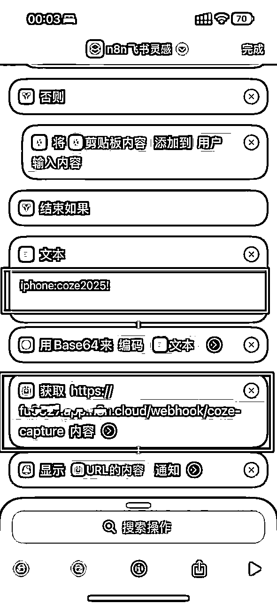

苹果手机可以直接手机打开链接，就可以复制快捷指令https://www.icloud.com/shortcuts/9a4c79cc43f44a349acc6445b2b087ae

这里需要修改快捷指令里面的文本，改成自己的账号密码，冒号隔开，如果上面设置跟我一样的账号密码可以不用修改

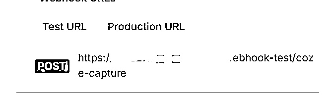

然后修改，下面的链接，改成第一个节点让你记住的那里链接

然后再设置-辅助功能-触控-轻点背面-点击两下或者三下触发

就完成了全部设置，拥有了自己的专属飞书笔记

而且可以配合多维表格的各种功能满足大家的各种定制化需求，

例如飞书里面利用大模型帮你的笔记自动分类，自动打标签等等。

## 写在最后

这是我根据自己的需求场景搭建的简易笔记工作流，但很实用，如果大家有一样的痛点，还有一些拓展的想法可以留言跟我交流，如果有共鸣，可以再迭代迭代

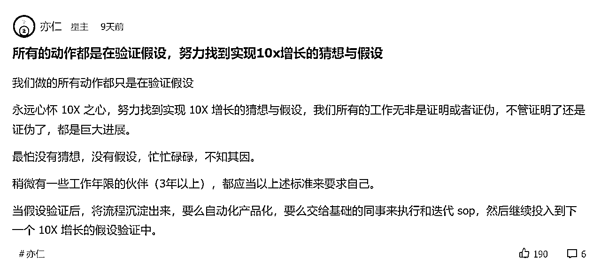

亦仁在多个地方说到，所有的动作都是在验证假设，

如果假设验证了，还没有成功，就要停止盲目努力了，我做过好几个项目，有成功也有失败，我觉得这句话对很多生财人很有用，尤其光拉满执行力，没抽出时间思考的圈友，每周都要抽出时间，重新思考一下自己所做的动作是否必要，是否在验证假设

这个n8n工作流，只完成了最核心的部分，后面我能坚持使用下来，就能验证我自己需求的假设，我会再扩展功能，

我更熟悉cursor,更熟悉coze,但我用n8n搭建，是因为最近n8n风很大，我在验证n8n是否好用的假设，

我发布这个帖子，是在验证大家是否也有这个需求的假设，