# 垂直小号+原创小程序=新的赚钱风口

> 来源：[https://rcn71rsvb3w5.feishu.cn/docx/Q4xYdSUJZo2S3GxtK1nc4nyUnbd](https://rcn71rsvb3w5.feishu.cn/docx/Q4xYdSUJZo2S3GxtK1nc4nyUnbd)

大家好，我是盟主君，一个靠AI赚钱养家的90后。

最近一年我一直在研究怎样用AI写短篇小说，目前几个账号也是稳定赚稿费中。

最近看社群里一直在推微信垂直小号的项目，正好我在2年前有幸赶上微信公众号流量红利，赚了一些米。

我决定拿出一个小号做了一个专注于怀孕妈妈的账号，每天分享怀孕期间注意的问题，应该需要补充什么？

刚开始的流量只有十位数，没有进入流量池，这些内容我也不好分享在朋友圈，再者我的朋友也没有这部分用户。

那我只能利用平台推荐功能了，7月底发布了育儿补贴政策，我顺手写了几篇这方面的热门话题，没想到爆了！

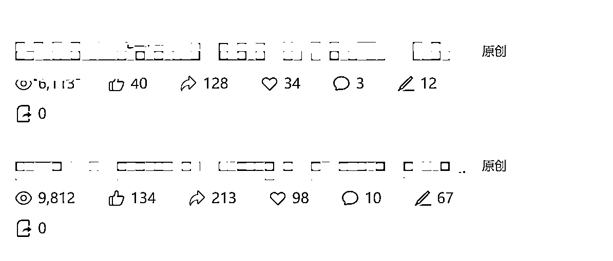

你能想象这个号只有700个用户，大部分流量都来自推荐流量，也就是说微信正在大力扶持这种垂直类的账号。

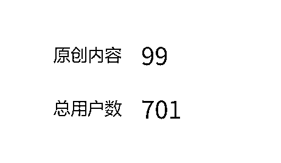

接下来我又写了很多篇类似的文章，很多用户留言自己的孩子出生能领多少钱，去年的宝宝能不能领补贴，我顺势就做了一个小程序，专门计算育儿补贴的，上线以后流量也是让我很意外。

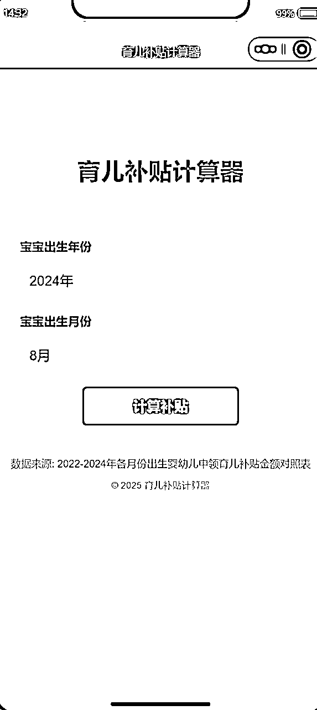

下面我跟大家汇报一下到底怎么抓住这波风口。

### 1 给垂直小号一个定位

很多人做垂直号第一步就错了 —— 要么太宽泛（比如 “做育儿号”），要么太模糊（比如 “分享怀孕知识”）。我这个怀孕妈妈号能起来，核心是定位够 “窄” 且 “戳痛点”。

我的实操步骤：

*   第一步：先切 “最小切口”

刚开始想做 “母婴号”，但太泛了。后来发现身边怀孕的朋友总问 “孕早期能不能吃螃蟹”“唐筛和无创怎么选”，这些具体问题没人系统讲，就锁定 “怀孕 1-10 月的每周注意事项 + 政策福利”（比如产检补贴、生育津贴）。

*   第二步： “用户画像” 锚定内容

我给目标用户画了个像 ——25-32 岁新手孕妈，上班族，关心 “少花钱、少踩坑、不焦虑”。所以内容从不讲 “怀孕要保持好心情” 这种废话，只说 “孕 28 周产检项目清单（附沈阳医保报销比例）”“孕期补钙别瞎买，这 3 种情况才需要补”。

*   第三步：根据数据优化内容

验证定位的 2 个信号：如果发布 3 篇后，推荐流量占比超过 50%（像我 700 粉的号，推荐流量占 80%），且用户留言集中在同一个问题（比如 “补贴怎么领”），说明定位准了；反之就微调（比如从 “全孕期” 聚焦 “孕晚期 + 产后补贴”）。

### 2 AI 批量生成有价值的内容

我用 AI 写短篇小说的经验，完全能复用在垂直号上。但重点是 “批量不代表敷衍”，必须让用户觉得 “有用”。

我的 AI 创作流程（每天 2 小时出 3 篇）：

*   第一步：用 AI 找 “高价值选题” 给 AI 喂关键词：“怀孕妈妈高频问题 + 2025 政策”，让它生成选题库。比如它会输出 “孕中期贫血补贴申请流程”“生育险和医保报销冲突吗”，我再筛选那些留言区用户问过的（确保是真需求）。

*   第二步：让 AI 出 “干货框架”，人工填 “细节” 比如写 “育儿补贴申领”，让 AI 先列结构：“申请条件 + 材料清单 + 线上步骤 + 常见问题”。然后我去查当地政策官网（确保准确），补充 “沈阳需要户口本原件，长春可用户口本照片” 这种细节 ——AI 容易泛化，必须人工加 “地域化、场景化” 信息。（标题可以写沈阳育儿补贴怎么领；长春育儿补贴怎么领）

*   第三步：用 AI 优化 “传播性” 写完让 AI 把结尾改成 “钩子”：“符合这 3 个条件的孕妈，补贴能多领 2000 元→点击关注，回复‘补贴’领详细测算表”。我测试过，带钩子的文章关注率比纯干货高 3 倍。

### 3 制作小程序开启双重变现模式

很多人做号只靠广告变现，其实小程序能让流量翻番，还能多赚一份钱。我的补贴计算器小程序上线后，不仅带火了公众号，还多了稳定收入。

作为一个不懂编程的我来说，从0编程做一个小程序在以前是天方夜谭，而现在有了AI加持，只需要3步就可以搞定了！

*   第一步：选择AI编程软件

目前市面上有很多AI编程软件，我选择了腾讯最新的一个产品CodeBuddy

到官网直接下载按照即可，由于是国外版本，按照后需要配置一下语言版本

点击右上角设置，选择简体中文

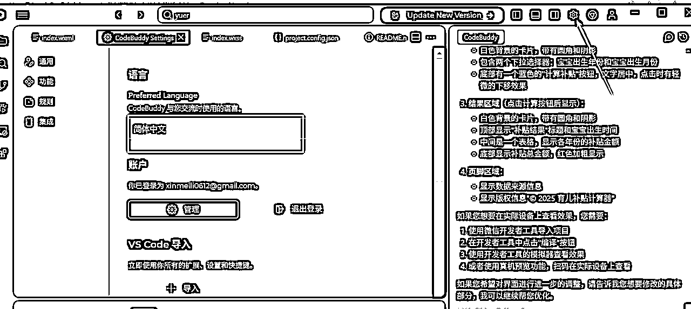

然后你需要在电脑建一个小程序的文件夹，在右上角点击文件，选择打开文件夹（就是刚才创建的），这样以后所有代码文件都会统一放在这里了。

*   第二步：制作小程序

在右侧直接输入你想开发的小程序主要功能，比如我写的是：

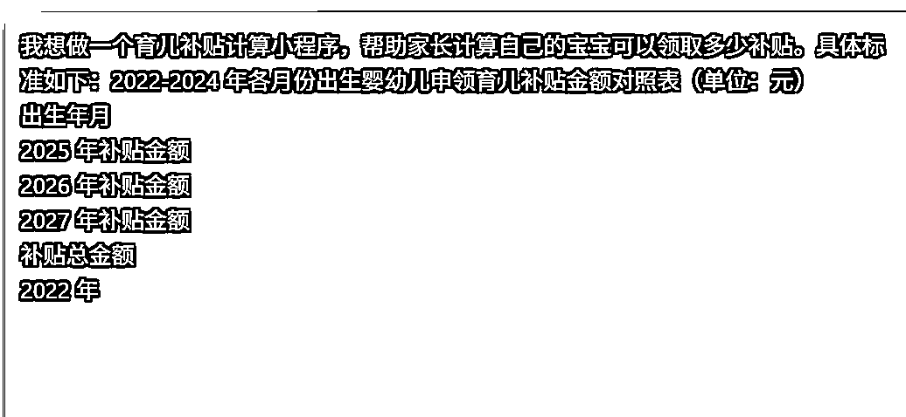

你一定要把你想做的小程序的功能描述好，可以借助AI帮你优化描述需求。

点击发送以后AI就会自动为你编程写代码

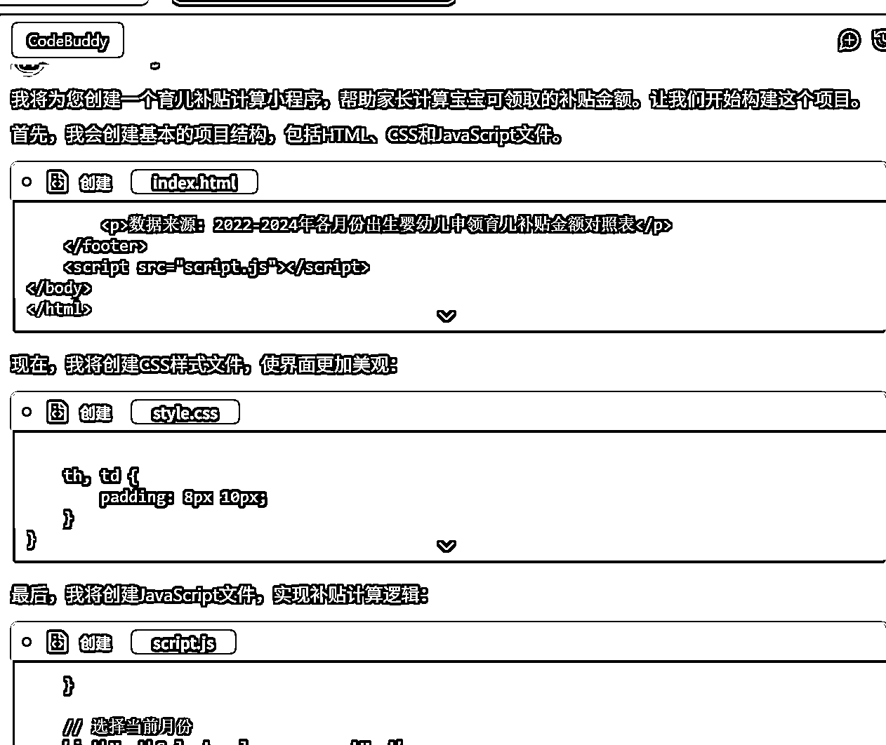

你只需耐心等待几分钟后，AI就会把这个小程序做好

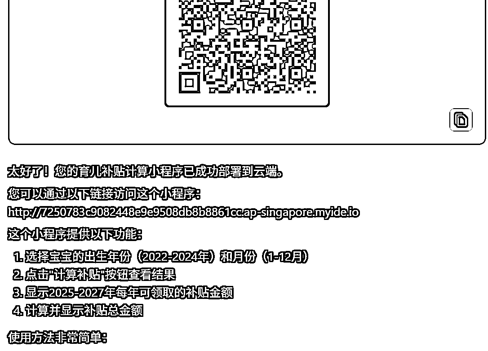

我们就可以用手机预览效果，比如我的第一版按钮里的文字错位，标题文字太小，颜色不好看。我只需要把这些问题再次提给他，AI就会帮我持续优化，直到优化到我满意的效果。

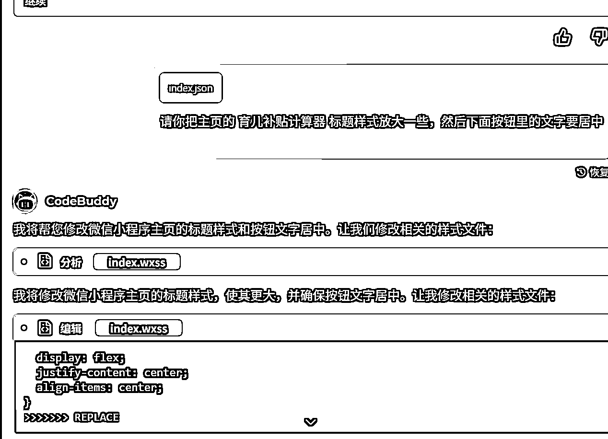

*   第三步：发布小程序

我们可以下载一个微信开发者小程序，只需要我们把这个装有代码的文件夹导入进去

就可以看到在微信上的效果

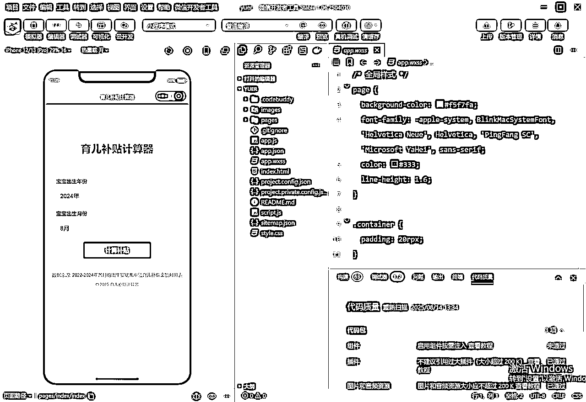

如果我们自己微信号已经绑定了公众号的管理员，那么直接选择右上方的上传按钮，把代码直接传到小程序后台

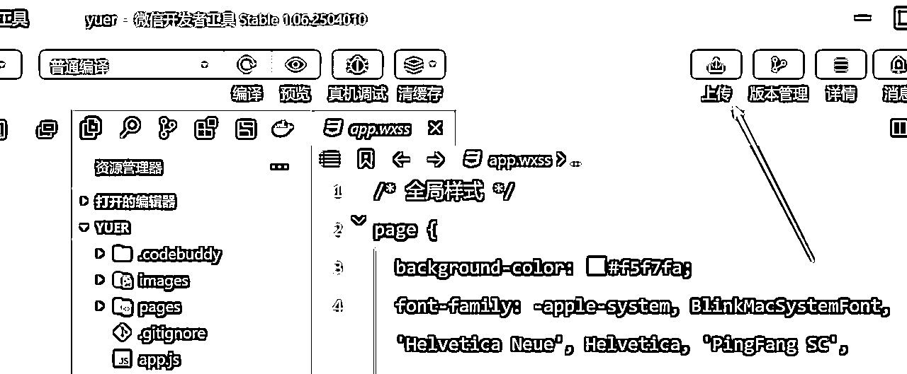

上传成功后，我们在小程序后台就可以看到开发版本

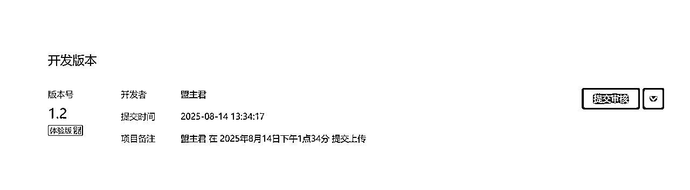

在这里需要完成资料认证和小程序备案，全部完毕后点击提交审核。我们的小程序就可以上线供大家使用了。

（备案可能需要1到2天才能通过）

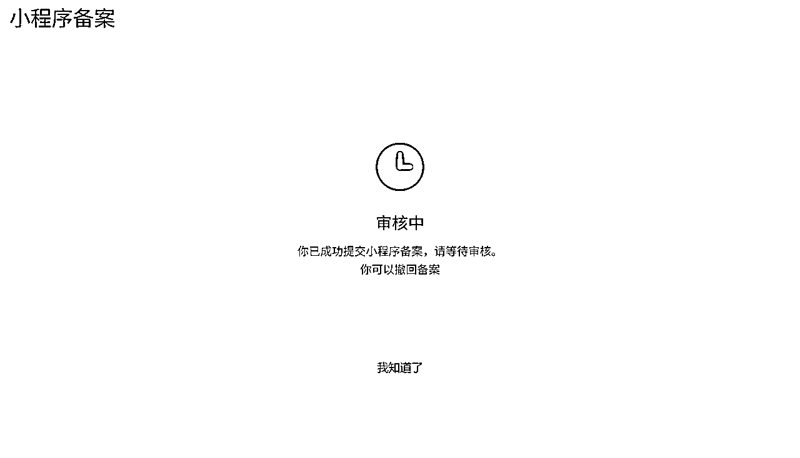

最后再啰嗦一句：垂直小号的风口，核心不是 “做号”，而是 “用精准内容 + 工具，让用户觉得‘离了你不行’”。我这个 700 粉的号，现在每天稳定进账 100+，比之前几万粉的泛号赚得多 —— 这就是微信现在给 “小而美” 的红利，抓住了真的能少走很多弯路。