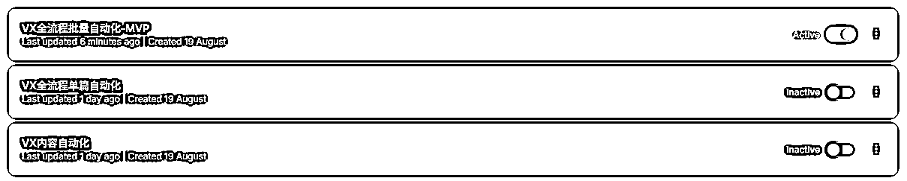
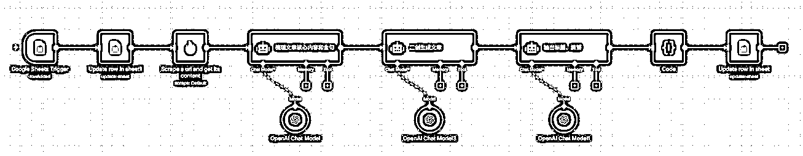
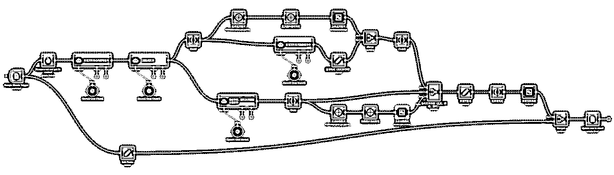
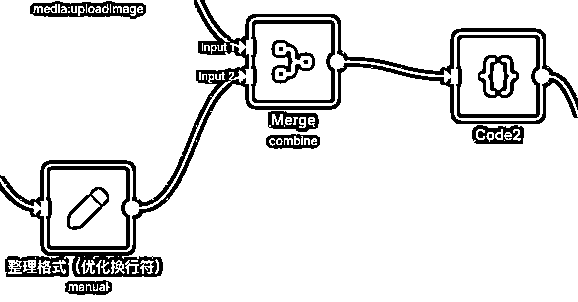
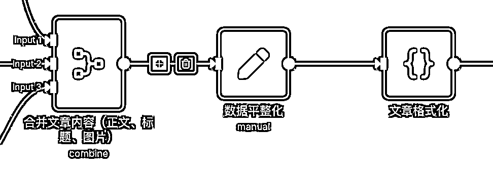
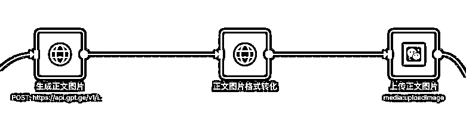
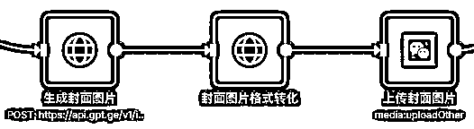
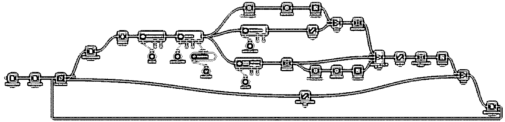
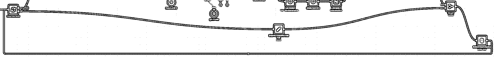
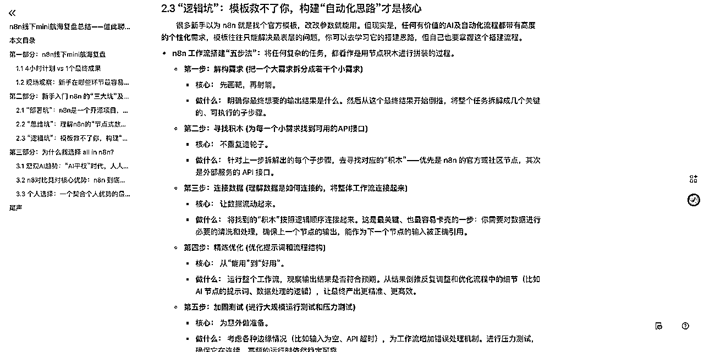

# n8n学习和搭建的核心方法论，用公众号文章批量二创与发布做一个详细拆解

> 来源：[https://yneq2bf840.feishu.cn/docx/Lh37dfb2Hoz52Lxnzmvcefzenpg](https://yneq2bf840.feishu.cn/docx/Lh37dfb2Hoz52Lxnzmvcefzenpg)

# 一、 引言：工作流成果展示与核心价值

## 1.1 工作流核心价值

*   hello大家好，我是KKKK，是本次n8n航海的教练，昨天写了我对于n8n的一些趋势判断和思考，今天分享一篇实操，用n8n+谷歌表格实现公众号批量二创和发布，极大提高公众号运营的效率

*   利用n8n与谷歌表格（Google Sheets）实现公众号爆文工作流的自动触发、批量二创与自动发布，大幅提升效率，实现“一天100篇”的产能。

## 1.2 本文主要结构

*   第二部分展示难度递进的三个工作流搭建的核心逻辑，最终实现公众号批量二创与生成

*   第三部分是本文的核心，用这个工作流拆解学习和搭建n8n的＂五步法＂，构建学习n8n的底层逻辑

*   第四部分展示这个工作流未来的可拓展性，如何用n8n赋能公众号垂直小号，把两个超级标结合起来

## 1.3 视频效果展示与工作流实操拆解（长视频拆解n8n方法论逻辑，强烈建议观看）

# 二、 工作流拆解：内容二创→自动发布→批量发布

## 2.1 文章内容自动化二创

*   目标：实现文章从获取到二次创作的自动化

*   流程节点：

*   Google Sheets Trigger：通过谷歌表格触发工作流。

*   Update row in sheet1：更新表格行状态（例如：标记为“进行中”）

*   Scrape a url and get its content：抓取目标文章链接的内容。

*   梳理文章核心内容和金句：提取原文精华。

*   二创生成文章：基于核心内容进行二次创作。

*   输出标题、摘要：生成新的标题和摘要。

*   Code：执行自定义代码（可简要说明用途）。

*   Update row in sheet：将生成的内容回写至表格。

## 2.2 整合公众号发布流程（主要讲解模块和搭建逻辑，节点细节见视频）

*   目标：在二创基础上，实现自动化上传与发布至微信公众号。

*   新增模块：

*   数据平整化和文章格式化：调整内容以适应公众号格式。

*   生成并上传正文图片：为文章自动生成并上传配图。

*   生成并上传封面图片：为文章自动生成并上传封面图。

## 2.3 实现规模化批量处理（主要讲解模块和搭建逻辑，节点细节见视频）

*   目标：将单个工作流扩展，实现多篇文章的批量、连续处理。

*   新增模块：

*   增加多数据串行处理逻辑：确保工作流可以按顺序、自动化地处理表格中的多篇文章链接。

# 三、 n8n配置方法论

授人与鱼不如授人以渔，这里讲解我拿到这个需求后是怎么搭建这个工作流的，这个方法论是学习n8n的基石。这部分会给出我平时进行 n8n 工作流搭建的“五步法”：将任何复杂的任务，都看作是用节点积木进行拼装的过程。

这三个工作流的难度也是逐步递增的，第一个工作流我2分钟就搞定了，第二个用了大概2-3个小时，第三个在第二个工作流的基础上只加了2个节点，但是debug调试也用了2-3个小时，大部分我花的时间都是在下面的第3-5步。

对于n8n来说，快速搭一个工作流套套模板就可以了，市面上有非常多模板，但是想要用起来，达到"知其所以然"的地步是有一定门槛的，我贴模板可能只需要5秒，但是debug找问题可能要用5小时乃至更久，培养这个思维和能力我觉得才是学习n8n最重要的地方，把这五步方法论理解透彻并且深入实践，n8n你就成功入门了。

五步法我第一次在n8n线下mini航海中提出

下面用这个工作流案例去拆解一下：

## 3.1 第一步：解构需求 (把一个大需求拆分成若干个小需求)

*   拆分： 最终要实现公众号内容自动二创和批量发布，实现输入多个文章链接，自动发布，可以把需求拆分为如下部分

*   读取文章链接：将链接转化为内容用于后续处理

*   文章二创：这里细分为，提取原文信息-重新二创原文-重新生成标题-重新生成摘要-重新生成封面图-重新生成正文图片

*   文章整理：我需要将生成的文章重新组合完整

*   文章上传：将组合好的文章上传到微信公众号

## 3.2 第二步：寻找积木 (为每一个小需求找到可用的API接口)

*   读取文章链接：寻找可以爬虫的节点，找到了Firecrawl这个社区节点

*   文章二创：这里涉及生图模型和文字大模型接口，我使用的是集合站

*   文章整理：这一步使用文字大模型+code节点解决

*   文章上传：微信官方提供API接口（https://developers.weixin.qq.com/doc/subscription/guide/），n8n中也有封装好的社区节点，我们使用n8n中的社区节点即可，但遇到配置问题可去微信官方文档溯源解决

## 3.3 第三步：连接数据 (理解数据是如何连接的，将整体工作流连接起来)

*   保证数据在整体工作流程中都是结构化的，上一个节点输出的数据格式和下一个节点的数据要求要匹配，这也是这个工作流搭建最难的地方，腾讯官方对于上传内容的格式有着非常严格的要求。

*   整体正文要是html格式

*   封面图要单独上传，使用永久素材功能

*   正文图要使用临时素材功能上传，还要以url的格式配置在正文中

*   最后整体上传的内容要包裹在一个格式固定的数组中

*   这个工作流中大量的数据处理就是为了满足腾讯官方API对于上传内容的数据格式要求

## 3.4 第四步：精炼优化 (优化提示词和流程结构)

*   内容优化：优化提示词和使用的大模型，这是AI输出内容的核心差异化来源，包括进行RAG给AI喂更多细节的语料，让AI输出的内容更加专业、更加个性化

*   流程优化：当前调用API的流程还是太复杂了，抗风险能力弱，中间每一个节点出问题都会影响整体工作流运行，后续可以考虑使用agent或者子工作流的形式进行流程优化，使整体更加稳定

## 3.5 第五步：加固测试 (进行大规模运行测试和压力测试)

*   提高稳定性：这一步和上述的流程优化类似，需要考虑各种边缘情况（比如输入为空、API 超时），为工作流增加错误处理机制。进行压力测试，确保它在连续、高频的运行时依然稳定可靠。

*   多元稳定性：这一步的稳定性不仅指你搭建的工作流本身，还包括你使用的服务器，你的IP地址，你调用的API接口，并行速率限制等等

# 四、 该工作流未来扩展方向

该工作流未来可适配“微信公众号垂直IP”超级标做精品内容，打造公众号整体运营系统

## 4.1 优化公众号自动排版

*   搭建适配自己的模板或者直接复制对标的排版

## 4.2 加入知识库RAG打造个性化 / 专业化输出

*   输入个人过去的输出内容，实现输出风格80-90%的模仿

*   输入行业专业资料，实现输出内容的高度准确性和专业性

## 4.3 爬取热点辅助选题：

*   爬取对标账号的最新内容，进行每日选题监控

*   爬取公众号相关榜单内容，进行热点内容监控

*   根据关键词筛选出高赞内容，辅助寻找'趋势上升内容'

## 4.4 连接微信机器人：

*   把刷到的文章链接发送给微信机器人会自动触发工作流进行二创和自动发布

*   这部分拓展也可以用于自己的知识库管理

## 4.5 采用并行处理方式提高效率：

*   当前批量处理工作流采用的是串行处理，主要是担心并发受限

*   后续可采用并行处理方式，在保证稳定性的情况下尽量提高效率