# n8n工作流本地部署小白零基础入门，附徒手搭建AI字幕违禁词敏感词优化工作流案例

> 来源：[https://a0u2vshvubw.feishu.cn/docx/QYs0dJfmgosw78xL5BfckbIunib](https://a0u2vshvubw.feishu.cn/docx/QYs0dJfmgosw78xL5BfckbIunib)

读完这篇文章，如果你没有学习过n8n，那么我将会手把手带你实现n8n的安装和搭建。

如果你会n8n，你将得到一个 视频字幕优化工具，彻底解放眼睛，自动优化过滤违禁词，更改错别字。

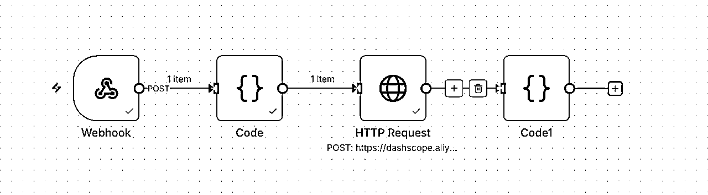

废话不多说，教程开始：

# N8N部署准备工作：

一台可以联网的电脑。

电脑安装nodejs环境，没装也没事我会带着你装。

一个安静轻松的环境，空闲时间30分钟以上。

一个视频，最好有脏话、敏感词，用来测试工作流效果。

# 安装教程开始：

注意苹果版本和win安装方式大致一样，nodejs和nvm以及n8n都是跨平台的，苹果和win方法都是一样。

命令能复制就复制，不要去自己手打，还打错！

用CMD , 不要用Windows PowerShell

## 安装nodejs

这里我们不讲传统的安装方式，我们讲一个很酷的安装方式，就是通过【nvm】去安装。

nvm是一个nodejs版本控制器，它可以在电脑上安装多个不同版本的nodejs，并随时切换使用不同版本的nodejs。

nvm下载地址：Releases · coreybutler/nvm-windows

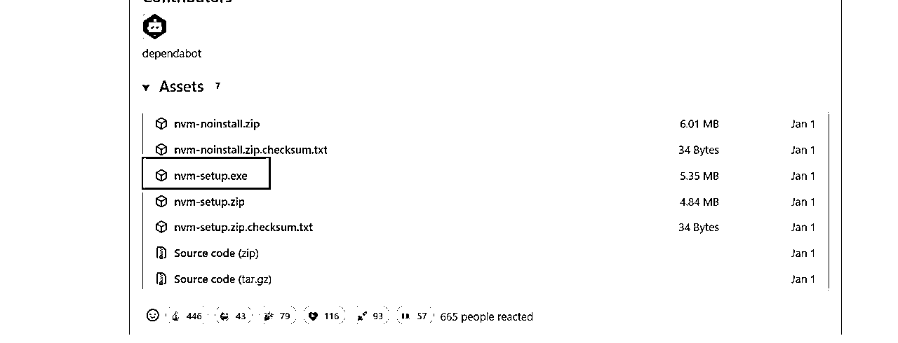

因为进入git要魔法,这里我帮大家下载好了.

苹果版本安装nvm教程：https://www.bilibili.com/video/BV1paZzYqEQ9/?spm_id_from=333.337.search-card.all.click&vd_source=0938c92d0bed0dc8d6956f9d2e97ea39

因为我苹果电脑卖了，没办法演示具体步骤，B站一堆教程，多搜搜，总能找到的。

以下步骤win和苹果通用，如果有问题联系我，优化文档。

安装成功之后，我们测试下：Win+R 在运行输入cmd，打开命令行，

管理员命令行：

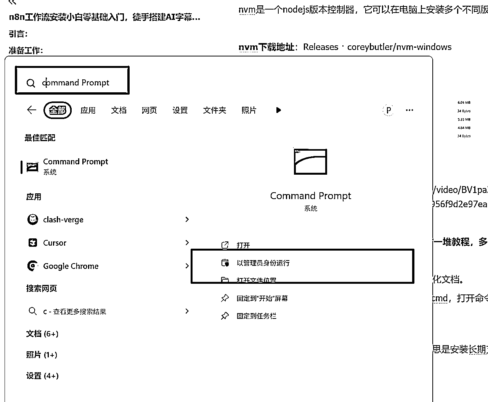

输入： nvm -v，出现数字说明安装成功。

然后安装nodejs，输入：nvm install lts ，这个意思是安装长期支持版本的最新版nodejs。

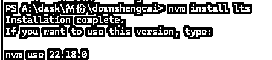

安装完了之后，我们可以看看电脑现在有几个nodejs，输入：nvm list

我这边是装了两个版本，所以会显示两个，前面有星号代表目前正在使用的版本，

我们要切换版本，输入：nvm use 22.18.0（这里输入你的版本号，不要完全复制）

不管你装了几个版本这一步必须输入，不然系统不知道你要用哪个版本的nodejs。

输入：nvm use 22.18.0 （这里输入你的版本号，不要完全复制）

输入：nvm use 22.18.0 （这里输入你的版本号，不要完全复制）

输入：nvm use 22.18.0 （这里输入你的版本号，不要完全复制）

老是有人忘记敲这个命令，我写三遍！！！

然后我们输入：node -v 看看是否成功切换

这里要特别注意，n8n对nodejs的版本要求很高，20.11.0都不行，所以推荐安装并切换最新版

## 下载安装n8n：

打开命令行输入：npm i -g n8n ，然后会自动下载安装，大概需要三分钟左右，完事之后还是老样子

输入： n8n -v 看版本号。

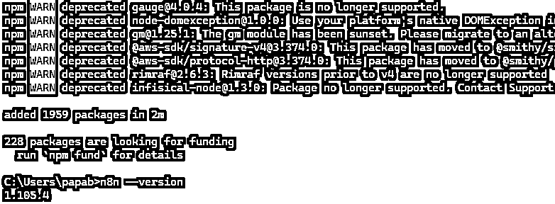

上面卡住或者无法下载必看：

因为npm源地址默认是海外服务器，受众所周知的原因，速度非常慢，甚至无法下载，这可以有两种解决方案。

一、给命令行或者终端设置代理

如果你是一个追求高雅生活品质的人，那么你可以选择这个办法，它的做法非常不简单，

首先你要找到你用的魔法软件的代理端口

什么，你说你不知道！！！那你还是用方法二。

知道端口之后，打开你的命令行输入以下两条命令：

npm config set proxy http://127.0.0.1:7890

npm config set https-proxy http://127.0.0.1:7890

注意：这里的7890要换成自己魔法的端口

注意：这里的7890要换成自己魔法的端口

注意：这里的7890要换成自己魔法的端口

取消终端代理命令(你安装好n8n之后可以考虑按需取消代理，这个命令可以不执行，不影响安装)：

npm config delete proxy

npm config delete https-proxy

二、用淘宝镜像

直接无情输入：

npm config set registry https://registry.npmmirror.com

这个是用国内的镜像网站，有更新慢，兼容差的缺点，唯一好处是就算没有魔法，下载也快

恢复海外版命令(你安装好n8n之后可以考虑按需恢复，这个命令可以不执行，不影响安装)：

npm config set registry https://registry.npmjs.org/

注意： 这里的命令输入，正常就是没有反应的，正常下一步就行，这里只是切换了下载源，你还要再次输入：npm i -g n8n

## 打开n8n：

命令行输入：n8n，然后等待跑数据，直到出现如下页面：

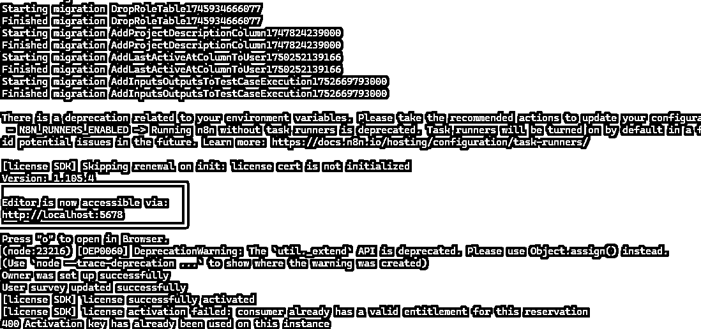

红框中有个ip地址，这个就是打开n8n页面，把它复制到浏览器就可以打开了，也可以按键盘的【o】自动打开。

以后每次要使用n8n网页，都要输入这个命令。

安装教程到此就结束，后续是一个简单的案例。

## 工作流思路：

开始工作流之前，我们讲一个思想上的东西，就是不管代码还是工作流，

它们的本质就是把我们的想法思路翻译成机器可以理解的东西，

所以我们在写代码或者搭建工作流之前，必须要有一个大概的项目思路。

对于今天这个字幕优化的项目，我的思路是这样：

1、剪映导出字幕文件，一般是.srt格式。

2、把字幕文件上传到工作流。

3、解析字幕文件成文本格式。

4、把文本格式的字幕通过api接口发送给ai，并写处理的提示词，也可以接入专门的敏感词库和错别字API。

5、返回文本字幕文件并转成.srt文件。

6、下载处理过的.srt字幕文件。

这里只做一个思路上的分享，详细步骤在下面，我们有了这些思路就可以把思路翻译成工作流。

## 搭建步骤：

### 一、上传字幕文件到工作流

我发现n8n这个工作流好比一个后端，它主要是处理数据，只能接受数据，是没有上传的渠道的，

所以我们得借助html这个网页实现上传功能，网页我已经整理好了，用之前改一下接口路径即可，

具体改什么后面会讲。

然后我们开始处理工作流第一个模块，【接收上传的字幕文件】。

新进来应该会让你填邮箱，然后发一个激活码到你的邮箱，去邮箱激活即可。

到首页了，点上面的【 Create Workflow】创建新的工作流。

点击中间的【+】在右边输入框输入：【web】 ，然后点击下面选项的第二个【web hook】，

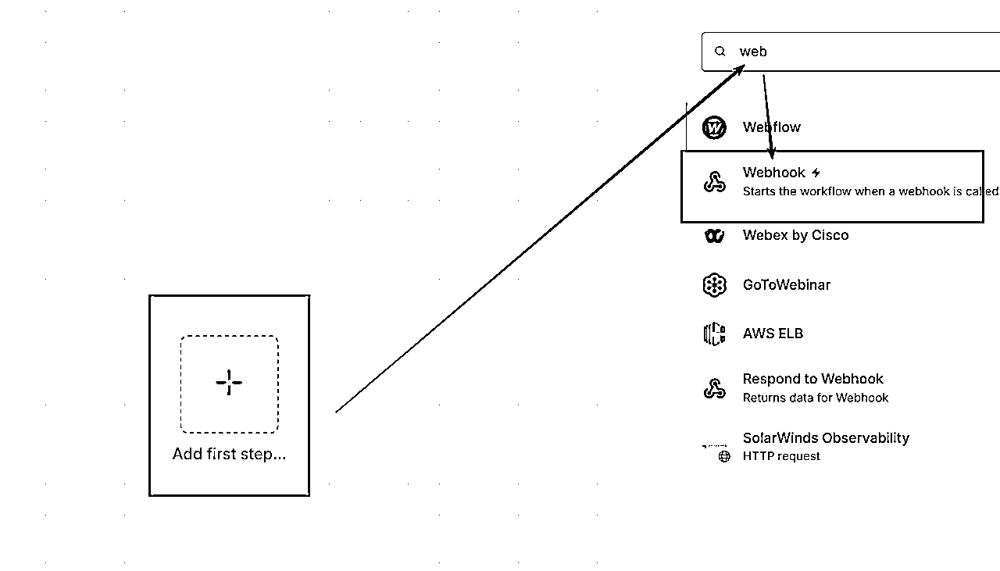

进去之后把目光聚焦在中间，把红框的两个地方改成和图片一样。

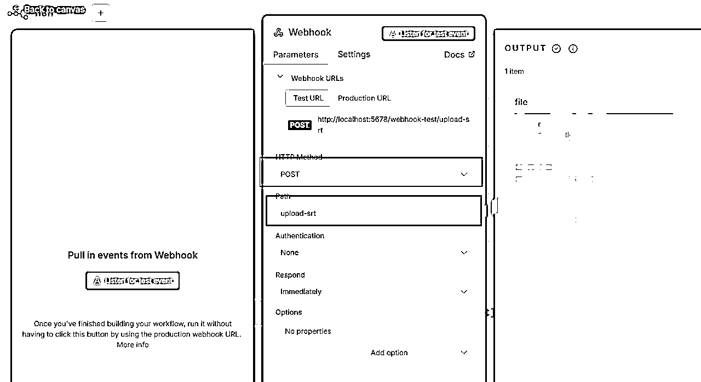

第一个是改请求的方式，因为我们是传输文件，文件属于大件货物，GET请求装不下，所以必须用POST方式传输。

第二个是路径，因为我们要给工作流传文件，必须有个地址才能准确传达，这个可以随便写，但是后面网页发文件地址必须和这个一样。

填完之后直接点击上面的，【Back to canvas】返回，编辑的信息会自动保存。

这个东西一旦启动，它就会创建一个 接收字幕文件的接口 ，这个接口你可以理解成是工作流入口大门，你的字幕文件只有从这个大门进去，工作流才能处理你的文件。

然后出去之后是酱紫，我们点击下面的按钮。

它会变成 【Waiting for trigger event】，嘛意思呢？

意思是：“小老弟，我已经等着接受你的文件了，快点赶紧给我传文件哈。”

这个时候，你就可以掏出你的编辑器打开我给你的html文件，什么？你说没给你！

出去罚站25个小时！往上刷，在第一步刚开始，我就发文件了。

我们右键文件，然后点【打开方式】，有编辑器用编辑器打开，没有编辑器用记事本打开，修改红框的地址。

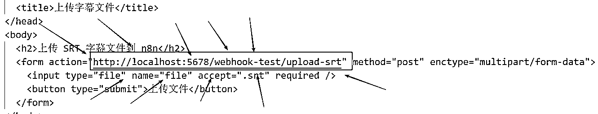

改成刚才第一个工作流模块webhook里的链接，

特别注意：所有工作流模块都可以双击打开查看编辑。

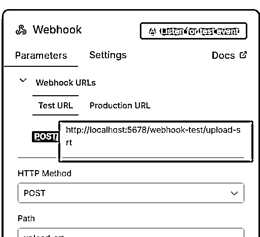

然后我们html打开文件，然后选择自己的字幕文件，然后点击上传。

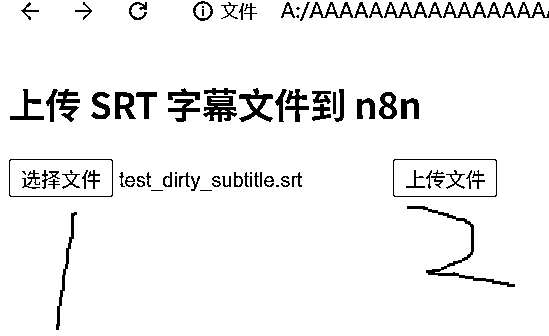

突然！你就会发现工作流有变化了，右下角有提示，第一个工作流模块有绿色的边框和对勾，代表成功接到文件。

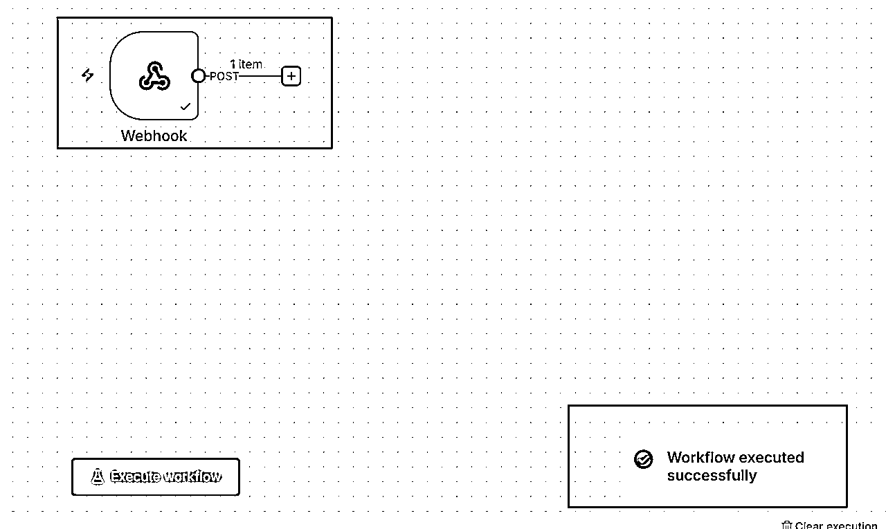

我们双击打开 webhook 工作流模块，可以清晰的看到，右边是我们成功上传的文件。

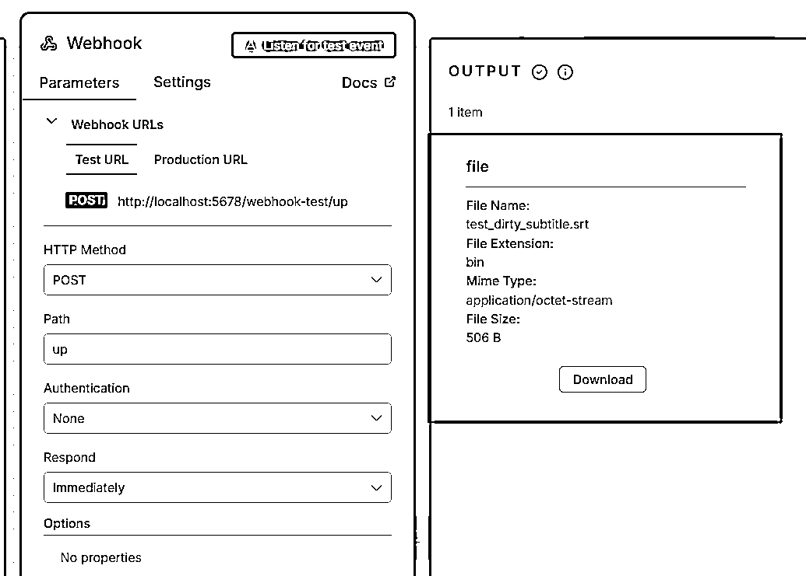

这个文件是这个模块的终点数据，也将是下个模块的起点数据。

至此呢，恭喜你，完成了工作流的第一个模块，字幕文件上传！

### 二、将字幕文件变成字幕文本

第一步工作流拿到了文件现在就要开始处理文件了。

webhook默认接收文件的方式是二进制，

所以我们这一步要做的就是把二进制文件变成文本文件，以便于发给AI大模型读取优化。

点击webhook旁边的加号，在右边搜索【code】，选择第一个code

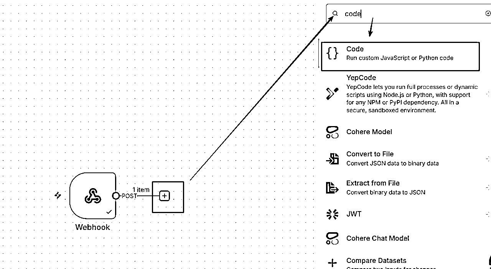

然后进来我们会看到三个板块，分别是【预处理文件INPUT】、【处理文件代码Code】、【处理后的文件OUTPUT】。

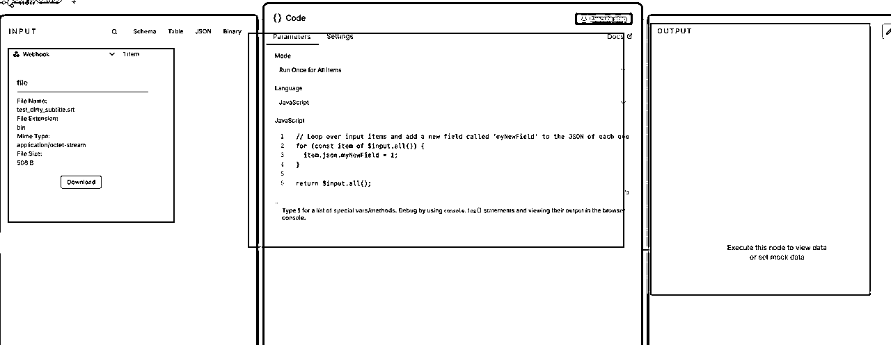

之前我们说了，我上第一步上传的文件是第一个工作流模块的终点数据，也是第二步的起点数据，

所以你会看到INPUT它是有一个数据文件的，这个文件就是我们上传的二进制文件，

我们要写的代码就是来处理这个二进制文件，后面的OUTPUT不用管，只要代码没报错就会把执行结果显示出来。

所以我们中心要放在处理中间的code板块上。

code板块要改动两个东西，一个是mode，我们默认第一个就行，它的意思是这里写的代码执行方式，

第一个选项Run Once for All ltems：代码是只执行一次。

第二个选项Run Once for Each ltem：根据INPUT输入项的数量，每项都执行一次。

因为我们工作流INPUT只有一个文件，所以选第一项Run Once for All ltems。

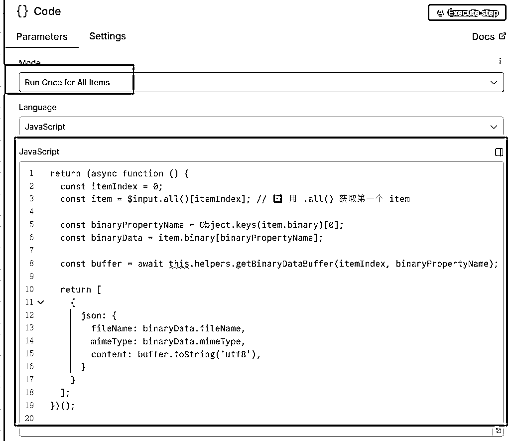

代码：

return (async function () {

const itemIndex = 0;

const item = $input.all()[itemIndex]; // ✅ 用 .all() 获取第一个 item

const binaryPropertyName = Object.keys(item.binary)[0];

const binaryData = item.binary[binaryPropertyName];

const buffer = await this.helpers.getBinaryDataBuffer(itemIndex, binaryPropertyName);

return [

{

json: {

fileName: binaryData.fileName,

mimeType: binaryData.mimeType,

content: buffer.toString('utf8'),

}

}

];

})();

原来的代码全部删除，复制上面这个代码。

执行，点击【Execute step】按钮，运行这个代码。

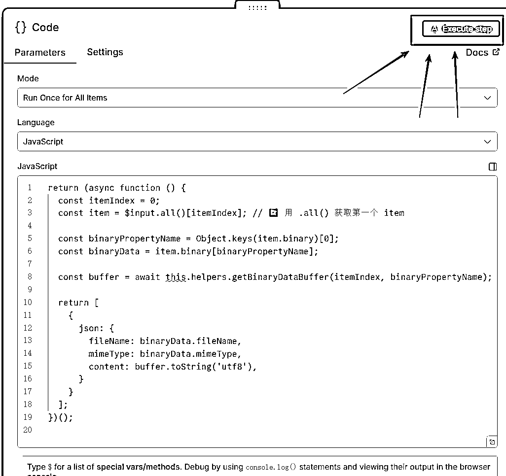

不出意外的话，你的OUTPUT板块应该会出现如下的信息，代表解析文本成功，同时右下角会出现成功的提示。

至此，恭喜你完成了第二个工作流模块，二进制文件转文本文件。

### 三、把文本格式的字幕通过api接口发送给ai，并写处理的提示词

我们点击左上角返回，会看到前面两个工作流模块都变绿了，现在我们来处理发送字幕文本给AI。

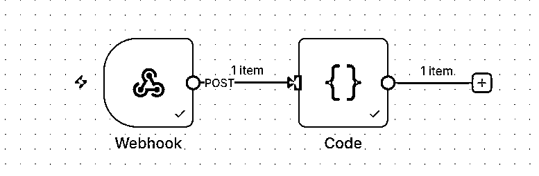

AI这里，可以选择的就很多了，如果你电脑是RTX3060以上显卡，完全可以部署本地模型，作为AI处理接口，

这个不是这期重点，我不就不多讲了，如果需要可以评论区留言，会考虑写一篇。

第二个方式就是用在线API，想要效果好，就接chatgpt或者claude的大模型，

我这里考虑到性价比就用阿里的【通义千问】模型。

获取API key地址：大模型服务平台百炼控制台

获取到密钥之后咱们就正式开始，因为要给大模型发请求，所以我们第三个工作流模块选择 HTTP Request 模块。

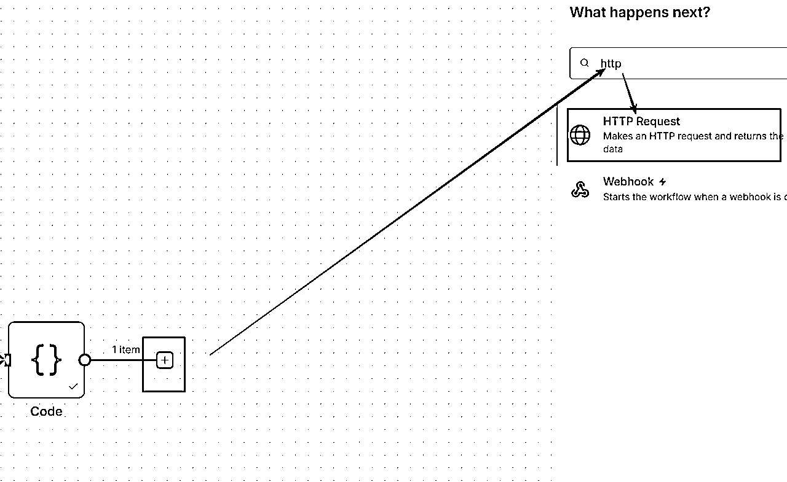

进去之后有四个地方需要改：

1、请求方式，这个方式还是post，因为我们传的数据量很大，不能坐飞机，得轮渡。

2、请求地址 ， 这个就是AI大模型的地址，你想让AI给你处理数据，你得知道它家住哪里吧。

3、头部信息， 这个就是校验信息，证明你是谁家的数据，AI看你有额度才会给你处理，不然不理你。

4、参数， 这个就是具体的字幕信息和提示词了。

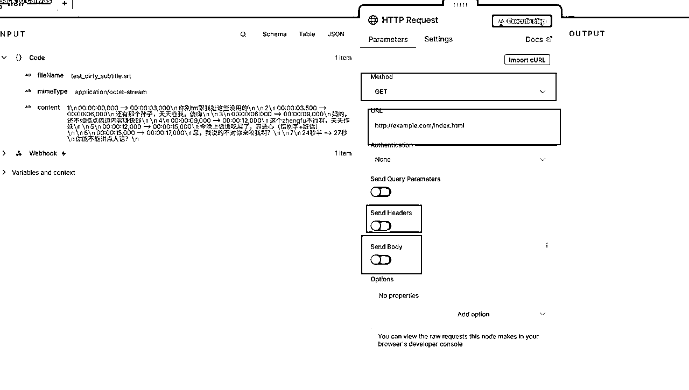

请求方式、请求地址和请求头填写如图：

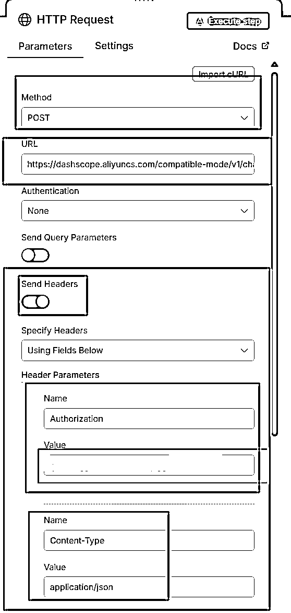

请求地址：https://dashscope.aliyuncs.com/compatible-mode/v1/chat/completions

上面黄色框要填入你在大模型服务平台百炼控制台获取的api key。

然后 send body 如下：

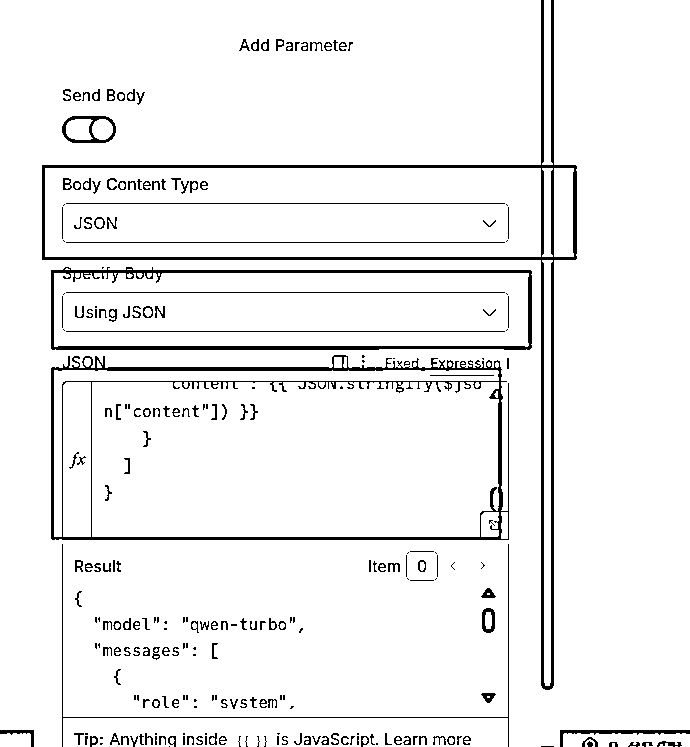

JSON里代码：

{

"model": "qwen-turbo",

"messages": [

{

"role": "system",

"content": "你是一名字幕清洗专家，请你对下面的 .srt 字幕内容进行处理：【清洗要求】： 1\. 修改所有错别字，使语句通顺； 2\. 删除或替换所有低俗语言、脏话； 3\. 替换所有涉及违法、敏感、违禁的词句（包括政治敏感、涉黄涉暴等），改为中性表达或删除； 4\. 保留时间轴格式（即每条字幕的时间线不变）； 5\. 不添加解释或注释，只返回清洗后的字幕内容； 6\. 如果某句无需修改，原样保留； 7\. 输出必须是标准的 .srt 字幕格式（包括空行、时间、换行等等）。 下面是字幕原文"

},

{

"role": "user",

"content": {{ JSON.stringify($json["content"]) }}

}

]

}

这里的提示词可以根据自己的需求去微调，如果你觉得AI替换的不好，也可以让AI把违禁词换成*，后续通过剪映软件的查找功能快速定位自己替换。

{

"model": "qwen-turbo",

"messages": [

{

"role": "system",

"content": "你是一名字幕清洗专家，请你对下面的 .srt 字幕内容进行处理：【清洗要求】：将所有错别字的具体字替换为 *（不改正为正确字）；将所有低俗语言、脏话替换为 *；将所有涉及违法、敏感、违禁的词句（包括政治敏感、涉黄涉暴等）的相关部分替换为 *；保留时间轴格式（即每条字幕的时间线不变）；不添加解释或注释，只返回清洗后的字幕内容；如果某句无需修改，原样保留；输出必须是标准的 .srt 字幕格式（包括空行、时间、换行等）。下面是字幕原文"

},

{

"role": "user",

"content": {{ JSON.stringify($json["content"]) }}

}

]

}

特别提醒：修改content的时候注意，提示词千万不要换行，否则代码会报错！

完成上面的设置之后，我们就可以点击【Execute step】按钮，然后会给AI发请求，

等几秒就会返回优化好的数据。

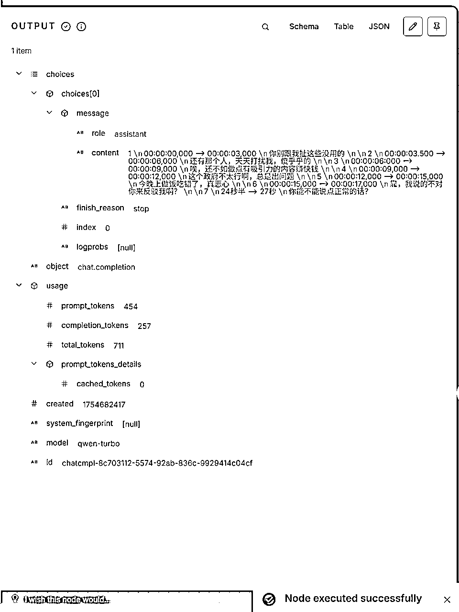

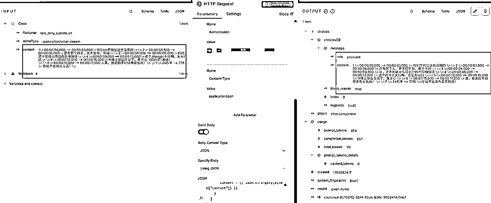

此时，就成功实现了字幕的优化，敏感词、违禁词、脏话等等，都被修改了。

如果对结果不满意还可以改提示词，慢慢调整和测试，总会合适的。

至此，恭喜你，就差一步一个完整的工作流就快好了。

### 四、返回文本字幕文件并转成.srt文件。

因为AI返回给我们的还是文本字幕，但是最终我们需要拖到剪影的可是.srt字幕文件，所以我们最后需要把文本字幕文件变成.srt字幕文件。

还是点左上角返回，我们第三个模块右边的加号，再添加一个【code】模块。

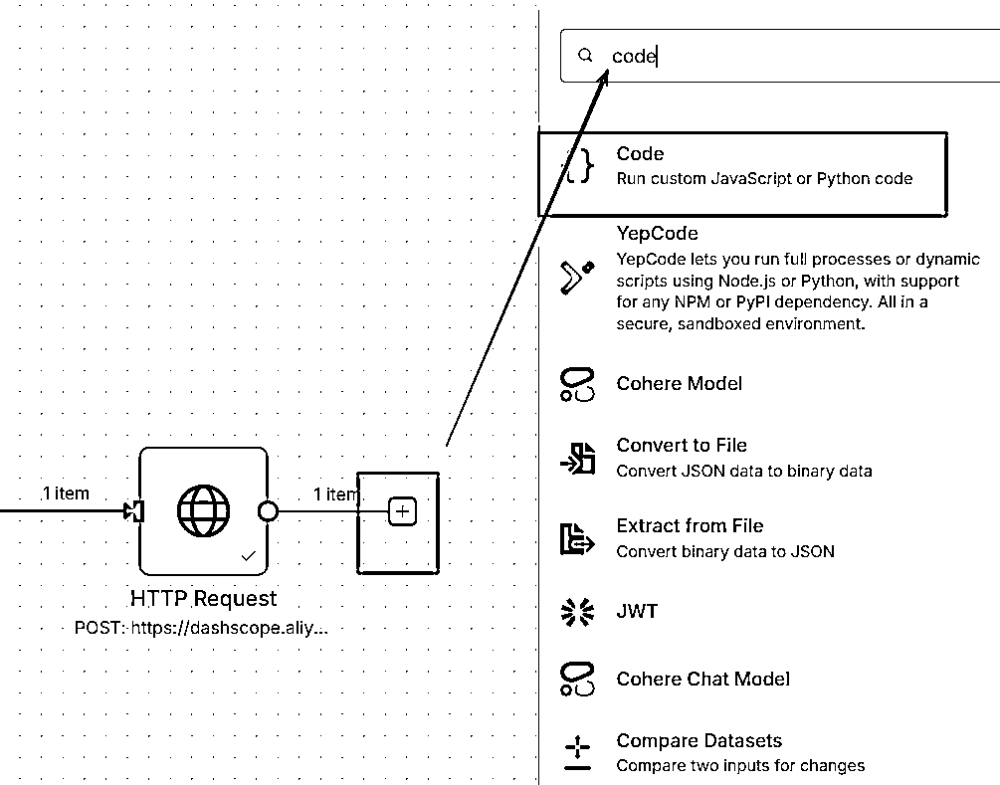

这里我们要改两个地方，

一个是mode模型，不能用默认的，我们要改成 Run Once for Each ltem ，因为AI返回的数据是个数组，尽管它只包含一个字幕数据，但是还是要用 Run Once for Each ltem，这样就算多个字幕数据也能轻松处理。

第二个就是把文本字幕变成二进制.srt字幕文件的代码

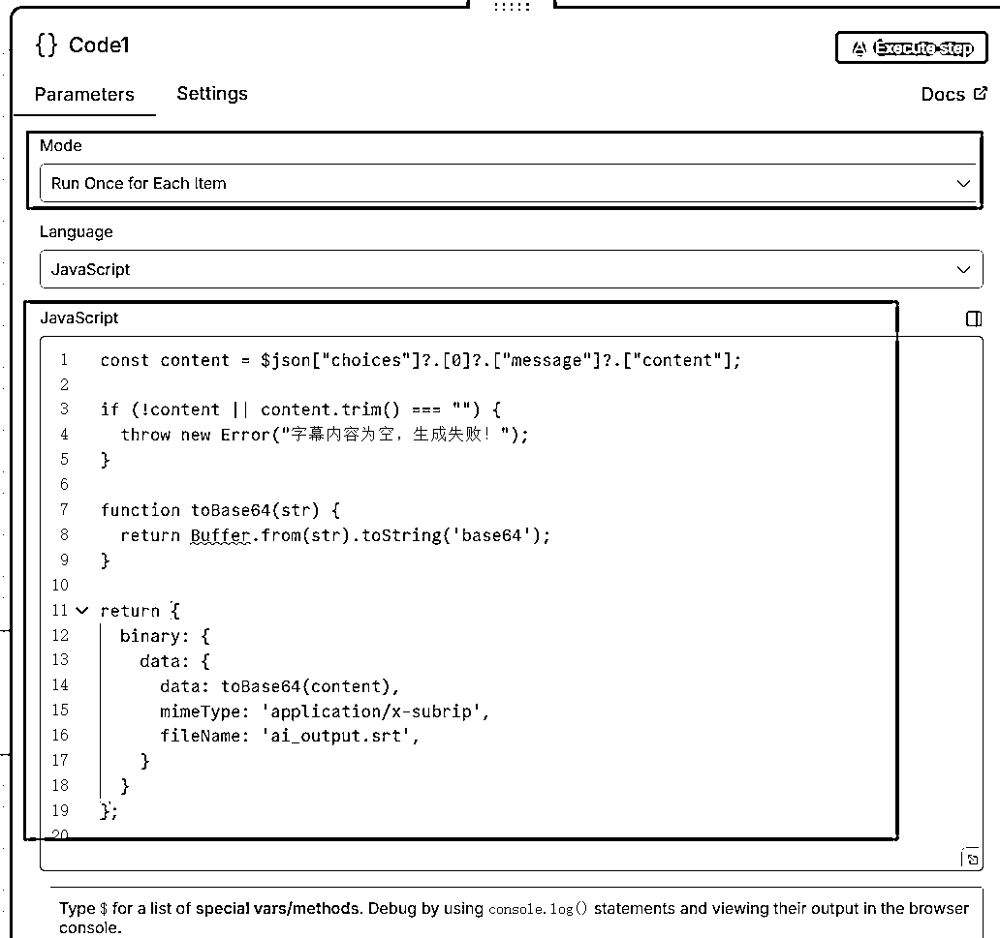

代码：

const content = $json["choices"]?.[0]?.["message"]?.["content"];

if (!content || content.trim() === "") {

throw new Error("字幕内容为空，生成失败！");

}

function toBase64(str) {

return Buffer.from(str).toString('base64');

}

return {

binary: {

data: {

data: toBase64(content),

mimeType: 'application/x-subrip',

fileName: 'ai_output.srt',

}

}

};

完成上面的设置之后，我们就可以点击【Execute step】按钮。

很快，右边的OUTPUT输入板块就出现了一个二进制的字幕文件，我们点【download】按钮，就可以把AI优化修改的字幕文件下载咯。

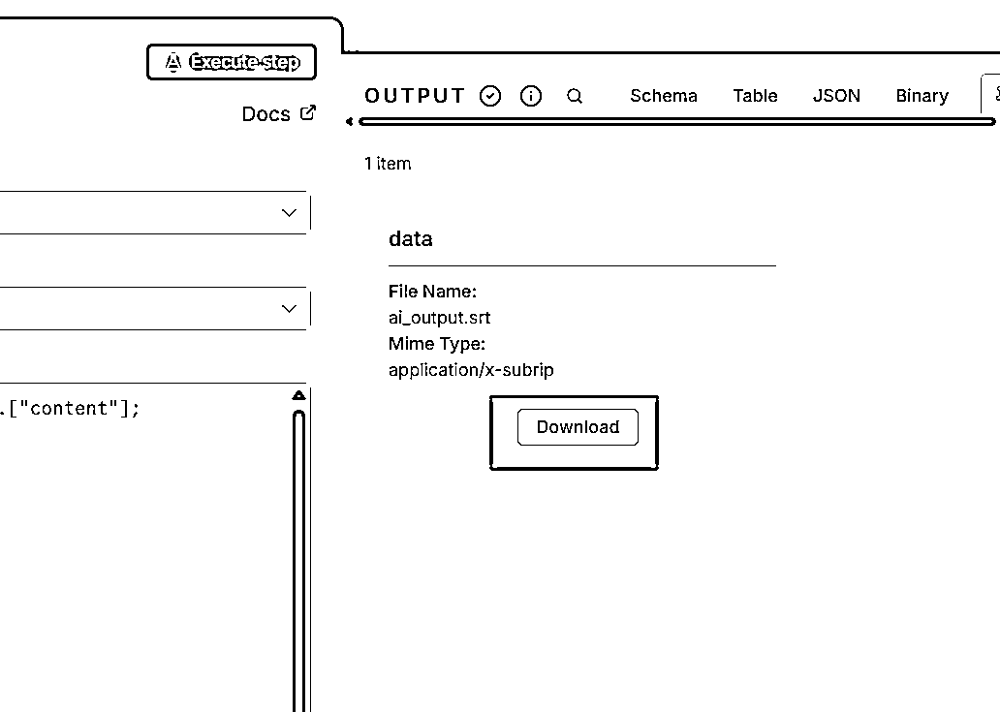

至此，工作流的所有流程，咱们就彻底搭建完毕了。

我们只需要把下载的字幕文件拖进剪映，就不用自己辛辛苦苦的再去一个字一个字排查咯

最后，如果这篇文章数据好的话，我可以搭建一个网站方便大家去使用这个工具，就不用麻烦的去搞工作流了。

如果想学好工作流一定要多动手，看百变都不如手动一遍。

也欢迎大家提出新的问题或者痛点，我看到了就会写一篇解决方案，帮助圈友成长。