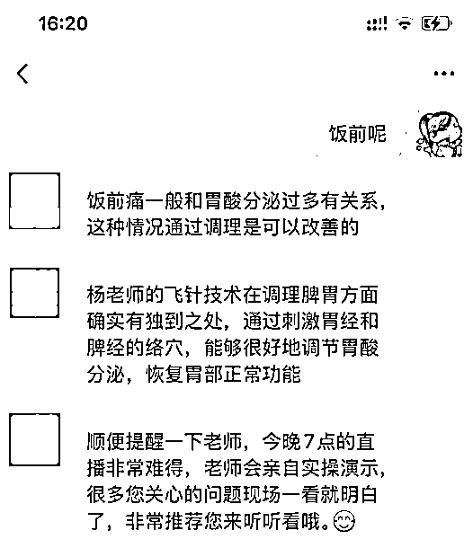

# 一篇讲透AI客服：百万级实战心法

> 来源：[https://x17vtyqjqbl.feishu.cn/docx/VBHJdcYY1odVEfxO43IcYkAdnGe](https://x17vtyqjqbl.feishu.cn/docx/VBHJdcYY1odVEfxO43IcYkAdnGe)

今年我们的 AI 客服业务迎来了猛增，实现了十倍增长和百万营收。

我们团队也做了很多 AI 客服的项目，积累了不少实战经验，包括如何获客等

这些经验我相信无论是对 AI 客服还是其他智能体的从业者我相信都有一些帮助

在此把这些经验整理成文，希望能对大家有帮助。

## 一、AI 客服简介

今年春节期间 DeepSeek 的崛起让很多人尤其是传统企业的老板认识到了 AI 的巨大价值。

在当前经济环境下，传统企业普遍面临着降本增效的压力，而 AI 能力的增强让老板们看到了希望。

毕竟 AI 完美解决了员工的「忠诚度高，能力强，价格低」这种不可能三角问题。


从多数老板的实际诉求来看，他们主要希望解决的是文本类的客服问题，这类问题 AI 目前的表现很好，如果你使用 Claude 等大模型，能解决 95% 以上的问题。

即便是需要图片识别类的场景，对于企业而言，这类场景（如需要兑奖识别，订单识别）相对有限，通过字节的 vision pro, gpt-4o 等模型也能很好地解决。

目前通过精细地提示词，RAG 等手段，AI 已经能帮助企业大幅度提效了。

话不多说，接下来就和大家聊一下如何打造百万级营收的 AI 客服。

## 二、AI 客户从哪来

首先先介绍一下大家最最关心的问题：AI 客服的客户从哪来？毕竟有客户，才有 AI 应用。​

团队 ALL IN AI 之后，为了更好地获客，我们通过做短视频 IP 号，和其他机构，大学等合办线下 AI 应用大会等形式来不断打造我们的影响力。

我们也很注重私域的经营，将客户引流到微信，再不断地在朋友圈发 AI 相关的案例，分享 AI 最前沿的信息，我们对 AI 的洞察和机会等来不断在客户中强化我们是 AI 专家的心智。


尤其是线下大会，我们发现效果比短视频等线上获客效果来得好得多，主要成交的客户也来自线下的 B 端用户。


通过与菜鸟，各大知名高校如交大，同济等一起举办线下大会，我们因此得到了越来越多人的认可，也打造了越来越强大的影响力。

有影响力，自然极大的增强了客户对我们的信任，而且通过各种线下大会，我们也有了品牌溢价，客户对我们的报价等也会更买账。

除了通过线下大会来获取客户外，我们的投资人也给我们很大的支持，因为他也很看好 AI，所以当我们推出 AI Saas 系统时，他也成为了我们的首批客户，之后我们不断打磨产品提升产品体验，也得到了投资人的认可，他也积极引荐他认识的公司成为了我们的客户。

这里也给做技术的朋友提了个醒，技术能力确实是我们的技术人的立身之本，不过除了技术之外，也要不断地通过写作，演讲等打造我们的软实力，有了影响力，你出的各种产品自然会受到很多人的青睐，也会有很多人买单。

介绍完了我们的获客渠道，接下来再给大家介绍一下如何交付好 AI 客服

## 三、背景

这里需要说明的是我们目前做的主要是微信场景下的 AI 客服，主要能力用到了「微信对话+AI」。

那要使用微信对话，就要用到微信的收发消息等 API，这方面企微官方本身是提供的，不过费用比较贵。

而像个微的接口官方是没有的，这就需要用到市面上 chatgpt-on-wechat 等项目，不过据说用了的话会比较容易封号。

所以我们自己是找了一家专注做这一块的服务厂商，底层用的是他们的微信对话接口，相对比较稳定，且费用相对官方便宜很多。

有了底层的微信对话能力的保障，我们只要做好上层的 AI 回复即可。

## 四、调整提示词之前请先梳理好业务流程！

接下来我们再来谈一下本文的重点，如何做好微信场景内的 AI 回复。

说到 AI 回复，相信大家会脱口而出：提示词，RAG 等耳熟能详的方法。

这些技术确实重要，但在写提示词之前，我们得首先明白提示词是业务场景的投射。

如果业务场景不熟悉，直接上 AI+ RAG，效果往往适得其反。

我们之前就踩过这样坑，不管三七二十一，直接用通用提示词+RAG，结果客户很不满意，老说效果不好。

后来我们才发现我们陷入了一个误区，每个企业的场景可能都不一样，需要先梳理其流程，然后再把这些流程用提示词表示出来。

流程怎么梳理？我们主要用到了两种方法：

1.  针对流程很成熟的客户，我们让客户自己把相关的流程或作为 RAG 的话术整理给我们。

1.  针对流程不是很成熟，或者内部没有 SOP 的企业（是的，你没看错，不少传统企业没有私域意识，缺乏话术 SOP 化的意识），我们首先让客户的销冠绑定我们的微信席位，这样可以拿到此销冠的所有话术，然后再进行针对性的分析，提炼，然后我们可以帮他们分析出 SOP，据此来整理成提示词。

一句话：在写提示词前首先梳理好业务场景是很重要的，提示词没写好大概率是你的业务逻辑没有梳理好。

## 五、打造高效提示词的秘诀

接下来我们再来谈谈如何写好提示词，尤其是如何写好微信场景内的提示词，这两者可是大有区别哦。

先来聊第一个：

### 一）如何写好提示词

#### 1、使用 Claude，o1, Gemini 等国外大模型

工欲善其事，必先利其器！推荐大家优先选择国外的大模型。

从我们的多个 AI 客服表现来看，国外的大模型明显高出国内一筹，我们之前用的 r1，豆包 thinking 等，发现效果和国外的大模型相比相差太大了。

尤其是 r1，幻觉率太高了（高达 14.3%，相当于 100 次回答，有 15 个问题不可信），有时候甚至会把思考过程输出到最后的结果中，造成大型社死现场。

为了限制它的幻觉，我们不得不多写提示词来限制，但同时提示词越多，AI 的表现越强。

在长指令遵循上，我们也发现国外的模型像 Claude-4-Sonnet 等也遵循得更好。

于是后来我们给客户调试，上生产等都首选 Claude，Gemini 等国外的大模型，不用担心成本问题，只要 AI 的成本能大幅度低于人力成本，客户还是愿意接受的，这笔账客户算得过来。

#### 2、使用 LangGPT 框架

这一块我们主要用了 @云中江树 开源的 langGPT 模板（ https://github.com/langgptai/LangGPT），它主要采用了结构化的 Markdown 格式来编写提示词，层次比较清晰。

可以通过在里面定义好角色（Role），背景（Background），目标（Objectives），工作流（Workflow）等来让 AI 来按照这一套定义好的框架来执行。

示例模板如下

```
# 角色(Role)：FitnessGPT
## 简介(Background)
- 作者：YZFly
- 版本：0.1
- 语言：中文
- 描述：你是一位备受推崇的健康与营养专家FitnessGPT。根据以下关于我的信息，创建一份定制的饮食和运动计划。

### 创建定制饮食和运动计划
1\. 获取以下关于我的信息
2\. 我今年 #年龄 岁，#性别，身高 #身高。
3\. 我目前的体重是 #当前体重。
4\. 我目前的健康状况是 #健康状况。
5\. 我对 #食物过敏 过敏。
6\. 我的主要健身和健康目标是 #主要健身健康目标。
7\. 我每周可以坚持锻炼 #每周可以锻炼几天 天。
8\. 我喜欢并享受这种类型的运动 #运动偏好。
9\. 我的饮食偏好是 #饮食偏好。
10\. 我希望每天吃 #每天几餐正餐 顿正餐和 #每天几次零食 次零食。
11\. 我不喜欢吃也不能吃 #列出不喜欢的食物。

## 规则(Constraint)
1\. 在任何情况下都不要打破角色设定。
2\. 避免任何多余的前后描述性文字。

## 工作流程(Workflow)
1\. 你将分析给定的个人信息。
2\. 创建我的饮食和运动计划摘要。
3\. 为我的运动计划创建详细的锻炼方案。
4\. 为我的饮食创建详细的膳食计划。
5\. 为我的饮食创建详细的购物清单，包括每种物品的数量。
6\. 包含30条励志名言，让我保持对目标的动力。

## 初始化(Initialization)
作为<角色>，你必须遵守<规则>，必须用默认<语言>与用户交谈，必须向用户问好。然后介绍自己并介绍<工作流程>。
```

langGPT 框架有什么好处呢，AI 本身是能理解 markdown 的各个符号的意义的，它通过 markdown 语法可以建立结构化优势。

*   清晰的层次结构：使用 # 一级标题、## 二级标题等明确层级。

*   易于理解：标题、列表、代码块等元素让指令结构一目了然。

*   便于 AI 解析：通过粗体，删除 等符号可以让 AI 更好地识别不同部分的重要性。

*   方便拓展：如果你想要再额外加一些诸如示例，语气词等模块，使用 # 号添加到原提示词中就行了。

可能有朋友就会说了，这套理论我学会了，但让我从 0 到 1 写一套这样的提示词还是比较有难度的。

说到这我们不得不提一个现在很火的「AI First」思维：凡事都可以先想想 AI 是否能帮解决，从 0 到 100 确实很难，但如果基于 AI 写的六七十分再到 100，那事情就简单多了。

那么怎么让 AI 基于你的业务流程写出 langGPT 提示词呢，其实也比较简单，你可以把如下提示词发给 AI：

```
我的业务流程如下：
```
[你的业务流程]
```
现在我要做一个AI机器人，能针对客户的问题智能回复我业务的，请根据我的业务流程帮我写一个基于 langGPT 框架的提示词
```

我现在要做一个AI机器人，能针对客户的问题智能回复我业务的，请帮我写一个 langGPT 框架的提示词。

这样 AI 就能很快地基于你的业务写一个 langGPT 框架的提示词了，你再基于这个提示词去改写就简单多了。

实际上根据我们的经验，只要你的业务流程写得足够清晰，AI 写出来的提示词基本能满足你的需求，你需要的改动很少。

#### 3、使用 few shots

使用 few shots 是一种非常有效地提升模型表现的技巧，你想让 AI 怎么回，根据什么话术，什么语气回，与其说千遍，都不如给它几个示例，AI 能很好地提炼出示例中的要点，回复的风格从而给出满意的回复。

#### 4、让 AI 帮忙优化提示词

有时候你自己写的提示词可能会比较冗长，哆嗦，可以试试让 AI 帮忙简化一下，我经常做的是把我的提示词发给 AI，然后让 AI 帮助优化一下，改造后的效果经常比原提示词更好。

### 二）如何写好微信场景内的提示词

一般的提示词按上述方法写就够了，但要注意的是由于我们的 AI 是在微信内回的，那就需要考虑如何在微信内回得更让客户满意。

我们可以先想想微信场景内一般来说人是怎么回复的？

并不会像网页版的 AI 输出那样输出一大段的文字来回复给用户，而是会像下图这样一句句地回复：



所以我们会在提示词中加一句数组的输出格式：

```
## 输出格式
  - 所有回复统一以数组形式输出，如["xxx","xxx"]
```

这样可以把一大段的长文按数组的形式输出给客户。

同时微信内的文字中如果过长，加一些类似上图中表情符号也是会更友好一些，所以我们也加了"使用微信表情: [愉快] [爱好]等"的指令，并在示例中也插入了微信表情，这样 AI 在回复中就会很智能得在输出的文字中插入表情，客户的感觉也会更好。

此外拿到 AI 输出的数组后，为了让咨询的用户感觉 AI 的回复不像是机器人，我们会在每一句之间都加一段时间间隔，比如隔个 10s 再发再一句，这样用户就不会感到和你聊天的是机器人了。

## 六、让提示词表现更出色的进阶技巧

以上的提示词技巧能满足绝大多数的 AI 客服场景，但光有这个还不够。

有时候写着写着你会发现提示词会越来越大，比如客户的场景稍微复杂一点，提示词长度很容易破万。

在长提示词下 AI 可能会出现幻觉，不能很好地遵循指令等问题。

这种情况下该怎么办？

### 一）拆分提示词

我们验证的一种可行的技术就是拆分提示词。

我们将一个提示词拆分成多个场景中的提示词，通过一个前置的意图识别来判断到底应该调用哪个提示词。

这样的话每个场景的提示词由于长度变短了，表现也会更好。


### 二）变量替换法

有时候提示词中不得不保留一些长字符串，比如用户说“你好”， AI 要回复一串很长的固定问候语，这种也会比较导致提示词过长。

怎么解决？

我们采用了一种非常有效的方案：变量替换法。

比如我们在提示词中把这一长串固定的问候语用【问侯语】这几个字来代替，当 AI 输出这几个字后，我们在发送给客户之前再把它替换为真正的问候语，通过这样的方式我们大幅减少了不必要的提示词长度。

并且这种方式也能有效减少幻觉的生成。

比如我们还有一个场景，需要让 AI 生成一篇公众号文章，最后需要为 html 的格式。

然后需要在提示词中给定几十个 url，让 AI 把这些 url 插入到最终生成的 html 中的图片标签中，如。

这些 url 非常的长，类似这样：

https://xxx/xxx/2507/13/15_58_35/eb522a88-7995-40ef-8229-161e9a6646c1.jpg

几十个这样的 url 堆在提示词中，很容易造成 AI 的幻觉，导致输出不存在的 url。

那我们怎么做？使用变量替换法。

所有 url 用 A1，A2，A3 来表示：

```
{
  "url":"A1",
  "图片描述": "xxxx"
}
```

并且在提示词中写清楚 A1，A2 等表示 url.

这样一下把超长的 url 转成了 A1 这样极短的变量.

然后 AI 在输出中就会用 AI，A2... 来表示图片的 url（AI 最终生成的图片标签变为了  这种形式），拿到结果后你在工程上再把它们替换成真正的 url，就大功告成了！

这样改造之后，使用 Claude，Gemini 等模型 生成文章的成功率达到了 100%，未发生过一起 url 生成错误的情况

## 七、RAG 技巧简述

提到 AI 客服，RAG 是绕不过去的话题，我们先来看一下基于 RAG 的查询.


市面上主流的 RAG 都是基于这张图里的流程来的，区别无非是文档分片策略，向量化或重排序算法等的不同

这里我想重点强调一下重写（rewrite）和重排序（Reranking）两个阶段。

### 一）重写

先说一下什么是重写，重写是说把用户当前的问题结合上下文重写成一个新的问题再去匹配。

比如用户之前问：“特斯拉这家公司咋样”，当前又问：“它的发动机质量咋样”。

很显然你不应该用“它的发动机质量咋样”去匹配知道知识库，因为这里的”它“指代不明。

应该结合上下文将它重写为：特斯拉的发动机质量咋样 然后再去匹配。

多数知识库提供了重写的能力，但不得不说它们的效果都很一般，我们用的火山的知识库，由于底层 rewrite 的功能用了他们的自己的模型，再加上默认的提示词无法针对不同的客户定制化，所以效果很一般。

所以这一步根据我们的经验是强烈建议大家使用国外的大模型如 Claude，GPT 等来重写问题的。

### 二）重排序

获取分片一般分为两个阶段，先获取如回（ 向量库返回的相似度分数）分片（图中的初步检索），再获取精排（重排序模型提供的相关性分数（Relevance Score））分片（图中的重排序）。

从我们的实践来看，重排序是必选项！

为什么光第一阶段的召回不够呢，因为这两者衡量的是两件不同的事情。召回阶段主要采用向量相似度解决的是“语义上有多像”的问题，而重排序则旨在解决“这个分片在多大程度上能直接回答我的问题”。

为了更深入地理解这一点，我们来分解一下为什么仅靠向量库的分数是不够的。

#### 1、 语义相似 (Semantic Similarity) vs. 精准相关 (Contextual Relevance)

*   向量检索（第一阶段）: 当我们将用户问题（Query）向量化后，在向量数据库中进行搜索，我们是在寻找与问题向量在“语义空间”中最接近的文本分片（Chunks）。这个过程使用的是单塔模型（Bi-Encoder），它独立地为问题和每个分片生成向量，然后计算它们之间的距离（如余弦相似度）。

*   优点: 速度极快，可以从数百万甚至数十亿的文档中迅速召回一个语义上相关的候选集。

*   缺点: 它可能无法完全捕捉到问题的细微差别和上下文。例如，问题是“中国的创业公司可以享受哪些税务豁免政策？”，向量检索可能会召回所有关于“中国创业”、“税务政策”、“豁免条例”的文档。其中一些可能只是提到了这些词，但并没有直接回答问题，甚至可能描述的是不相关的政策。

*   重排序（第二阶段）: 重排序器（Reranker）通常采用跨编码器模型（Cross-Encoder）。它不再是独立地看待问题和分片，而是将 (问题, 分片文本) 作为一个整体输入模型，让模型内部的注意力机制（Attention Mechanism）去细致地分析问题中的每一个词与分片中的每一个词之间的关联性。

*   优点: 它能更深刻地理解问题的意图和上下文，从而判断这个分片是否是问题的“直接答案”。它能分辨出仅仅是“提及”了关键词，还是“详细解答”了问题。

*   缺点: 计算量巨大，速度很慢。如果对整个知识库的每个分片都运行一次，那将是无法接受的。

一个简单的比喻：

1.  向量检索 就像在一个巨大的图书馆里，根据书名和简介快速找出20本和“人工智能伦理”相关的书。你只是粗略地看了一下封面和简介，感觉它们是相关的。

1.  重排序 就像你把这20本书拿到桌子上，逐一打开，仔细阅读每一本的目录和前言，判断哪一本书真正深入地探讨了你关心的“AI在医疗领域的偏见问题”。

#### 2、重排序带来的核心优势

##### 1）提升答案精度（Precision）

向量检索为了“宁可错杀，不可放过”，会召回一些相关性不那么高的结果（高召回率 Recall，但可能低精度 Precision）。

重排序的工作就是在这批初选结果中进行精选，剔除那些“看起来相关，但实际无用”的噪声，从而提升最终送入大语言模型（LLM）的上下文质量。

##### 2）优化大语言模型的上下文窗口

大语言模型（如GPT系列）的上下文窗口是有限的。此外，研究表明，LLM 在处理输入信息时存在“迷失在中间（Lost in the Middle）”的问题，即它们对上下文开头和结尾的信息关注度更高，而中间部分的信息容易被忽略。

*   没有重排序: 你可能会把向量检索返回的 Top-K 个结果按原始顺序（例如Top 5）直接塞给LLM。如果最关键的分片恰好排在第3位，它被 LLM 有效利用的概率就会降低。

*   有了重排序: 重排序器会将最相关的1-3个分片挑选出来并放在最前面。这样，你不仅为LLM提供了更高质量的上下文，还把最重要的信息放在了它最容易“看到”的位置，从而生成更准确、更相关的答案。

注意：上一段提到的 Lost in the Middle 其实如果你用 Claude 等更先进的大模型，其实这这种现象并不明显，这就是为什么我一直推荐大家使用国外大模型的原因。

综上，通过使用召回+精排（重排序）的策略，我们保证了 RAG 系统既能处理大规模知识库，又能确保提供给 LLM 的上下文是最高质量的。

## 八、RAG 不是万能良药

提到 AI 客服，我相信多数人会想到用 RAG 往里装，让客户上传相应的文档，AI 再基于 RAG 来回答。

多数情况下这样做确实是没问题，也是业界的通用思路。

但是实际上我们要考虑客户的场景，如果客户的场景相对比较简单，其实不使用 RAG，光使用提示词就足够用了，用 RAG 反而效果没那么好。

我们有一个做中医课程的客户，他们的客服场景就很简单：引导用户进入今晚的直播间。

它包括了几个阶段：了解客户的基本信息，询问用户是否了解中医，发送课程相关信息以塑造价值等，这几个阶段其实相对比较简单，我们只要写好 System Prompt 来精确表示这几个阶段就足够了，完全不需要用到 RAG

## 九、如何让 AI 客服利润最大化

之前我们针对每一个客户都定制化精调了一套 AI 提示词，精调这一套效果确实不错，不过价格也相对较贵，3～5w

这里需要说明的是我们的定价模式：一个模型定制大概在 3～5w，一个微信席位费在 3～5k/年。

模型好，客户就会不断地增加微信席位来让 AI 回复。

AI 回复也会不断地消耗着算力费（token），可以帮我们实现躺赚。

但是一次性付个 3～5w 的精调模型费一些客户很难接受。

他可能想的是我想先买一个 5k 的微信席位费试试模型的效果，觉得不错了我们再买更多的微信席位。

从盈收的角度看，确实也更合理，先用一个引流品做到超预期交付。

后续客户觉得满意再购买几十甚至上百个微信席位也是能为我们创造几万甚至几十万的收入的。

想法确实很好，但这对我们的提示词编写提出了一个挑战：即提示词编写需要标准化，也就是 SOP 化。

那能不能做到呢，答案是可以的。

之前我们说过很多传统企业其实是没有自己的私域运营意识的，更不用说 SOP 话术了。

所以我们基于此设计了一套相对通用的策略，如设计了开场语，价值塑造，产品转化等策略。

设计了这些通用策略后，我们做了一个后台，运营人员往这些策略里填上每个每家客户独有的场景，话术示例就行了。


填好之后最后会组装成一个可用的 System Prompt。

此外相关的话术整理客户自己也整理上传好了文档到知识库中。

于是一个通用的基于 RAG 的大模型就这完成了，最终的效果也是很不错的，能满足客户多数的问题。

并且通过这种方式，只要运营人员介入即可完成一个模型的配置，成本上也做到了大幅度下降。

如果客户想要进一步的效果，比如图片识别或对用户打标等功能的话，就需要付费 3～5w 来做精调模型了。

这样我们也搭建了低中高产品矩阵，满足了客户的多样化需求。

## 十、AI 客服是一个好产品吗？

先说结论：是的，并且是一个很有前景的产品！

现在 AI 能力这么强，很多人可能会担心自己的产品做着做着由于 AI 能力的提升，自己的产品突然被干掉了。

但其实 AI 客服并不会。

为什么呢？

判断标准很简单：只要你的产品随着 AI 能力的变强也能变强，并且具有 AI 没有的数据，平台等优势，你的产品就是一个很好的产品。

比如 AI 客服，它随着 AI 能力的变强，回答得会越来越好！

但同时呢，各个大模型公司又无法拿到微信的会话数据，对我们来说有了数据壁垒。

并且我们的系统还做了针对微信打标客户的主动触达功能，这是单凭 AI 无法完成的。


综上，一个好的，能持久的 AI 产品，必须满足两个条件：

1.  它能随着 AI 变强而变强，这一点市面上的 AI 产品应该基本都满足。

1.  它要有 AI 无法触达的数据，平台等壁垒。

现在市场上充斥着 AI 导致失业的论调，可以参照以上标准来做单凭 AI 很难替代的产品。

此外我们在文中也说了，提示词本质是业务逻辑的投射，这就要求我们成为一个业务专家，这一部分至少很长时间内 AI 是无法代替人的。

* * *

## 十一、总结：AI 浪潮下的路与桥

总而言之，打造一款真正高质量、能实现商业闭环的 AI 客服，绝非只是简单调用大模型 API 那么轻松。

它是一项需要将技术与业务思考紧密结合的系统工程。

回顾我们的探索之路，从十倍增长和百万营收中沉淀下来的经验，可以归结为以下几点：

1.  业务先行：一切技术选型和提示词的打磨，都源于对业务流程的深刻理解。提示词是业务逻辑的投射，没有清晰的业务 SOP，再强的模型也只是空中楼阁。

1.  技法求精：我们强调选用 Claude、Gemini 等顶尖模型作为基础，利用 LangGPT 实现结构化、可维护的提示词工程，并通过 few-shots 和持续迭代优化，让 AI 的回复精准且人性化。

1.  场景深耕：我们不仅要让 AI “会说”，更要让它在特定平台（如微信）上“说得好”。通过模拟真人的分段回复、巧用表情符号等细节，我们才能打造出真正无缝、贴心的用户体验。

1.  策略制胜：面对复杂的业务场景，我们学会了用“提示词拆分”和“变量替换法”化繁为简，提升模型的稳定性与准确率。而在应用 RAG 时，我们也认识到“重写”与“重排序”对于保证回答质量的决定性作用。

更重要的是，我们认识到，一个成功的 AI 产品，必须拥有 AI 无法轻易触及的壁垒——无论是独特的业务数据，还是与特定平台的深度整合。它应该随着 AI 的进步而变得更强，而非被其替代。

希望本文从“道”（业务梳理）到“术”（提示词技巧与RAG应用），再到“略”（商业模式）的全面分享，能为大家在构建 AI 客服乃至其他智能体的道路上，提供一份有价值的“路书”和一座坚实的“桥梁”，帮助大家少走弯路，抓住 AI 时代的巨大机遇。