# 13天开通YouTube YPP，从0到1月入过万的自动化实操记录

> 来源：[https://avbdmra8fx.feishu.cn/docx/GTFQdNOFLosP3VxCuDqc6UOTnVg](https://avbdmra8fx.feishu.cn/docx/GTFQdNOFLosP3VxCuDqc6UOTnVg)

# 零：写在前面

今天做这个分享，

1.  是给过去的自己做一个总结，

1.  是给想做AI+YouTube的普通人一点参考，

1.  是想拿个龙珠，希望能看到更多的前路和可能性

这篇帖有近4万字，是一篇大长篇，你将跟随我的视角，

完整的和我回顾我过往的四个月，是如何使用AI在Youtube从0到1赚到几万块钱的真实人生，

我会告诉你我在Youtube如何从0到1的全部经历，以及我迭代了几十个版本的各种自动化代码

看完这篇的人，你将得到

1.  一个完整的AI+YouTube变现实操路径：如何从0粉0播新号到月入过万

1.  从0到1的自动化心得及全部代码：我是如何将每天十几个小时的工作量压缩到1分钟以内的

1.  我从0到1的做事心法：这才是重中之重

在开始下面的故事以前，我要说一句掏心窝子的话：

2025年是我心中真正的AI编程元年，这是真正的全民平权的工业革命

从现在开始，你必须要学会使用AI编程，这一点也不难，你甚至不需要学1个代码，

你只需学会具象化你的需求，也就是学会和AI对话的方式，

我从23年就买过GPTPlus，用到今天，7788的AI我都用过，

到了24年 虽然有了Chatgpt4和Claude3.5 但仍不够好用，

今天的Claude3.7，虽然也没有那么好用，但已经非常能用了，

今后的AI，还会数倍强于现在，所以你必须现在就用起来，

在大部份人都还不会用 不知道用的时候，做第一批吃上红利的人，

我常打的比方，就是只要现在你开始学习AI编程，

就等于在Iphone4发布的前夜，你买了苹果的股票，

你明白这是多大的含金量吗？

新一轮的工业革命在即，全新的金矿即将面世，你必须先做好准备，

接下来，让我们正式开启正文...

* * *

下面是过去几个月，我自己做Youtube纯AI赛道的一点成绩：

1.  24年11月1日，我从0开始，发第一个作品，13天，账号1达成千粉4000小时，开通高级Ypp；

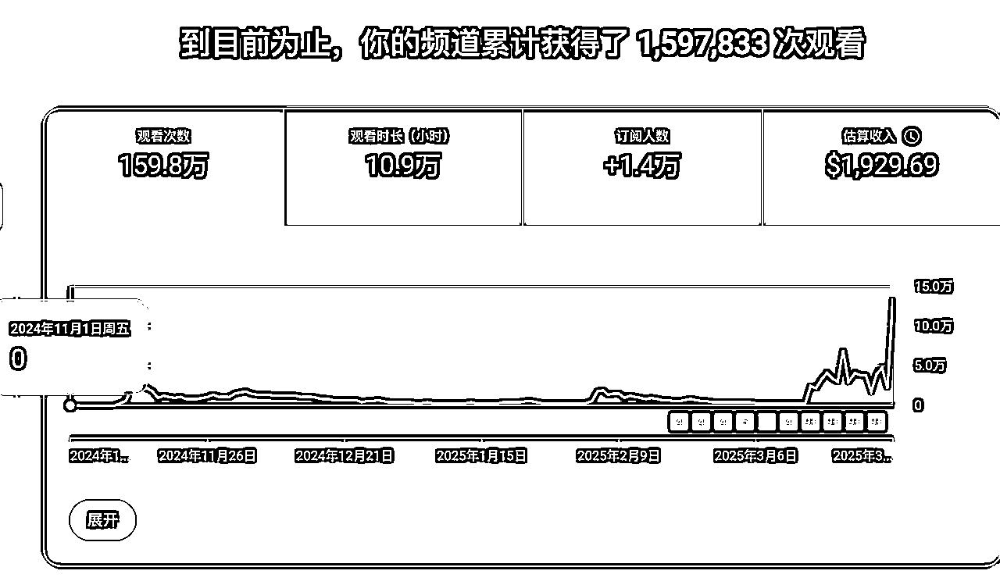

1.  仍然是从0开始，账号2从24年11月25、账号3从12月3日发第一个作品，这两个账号也达成了高级Ypp，耗时长一点，一个35天，一个85天；

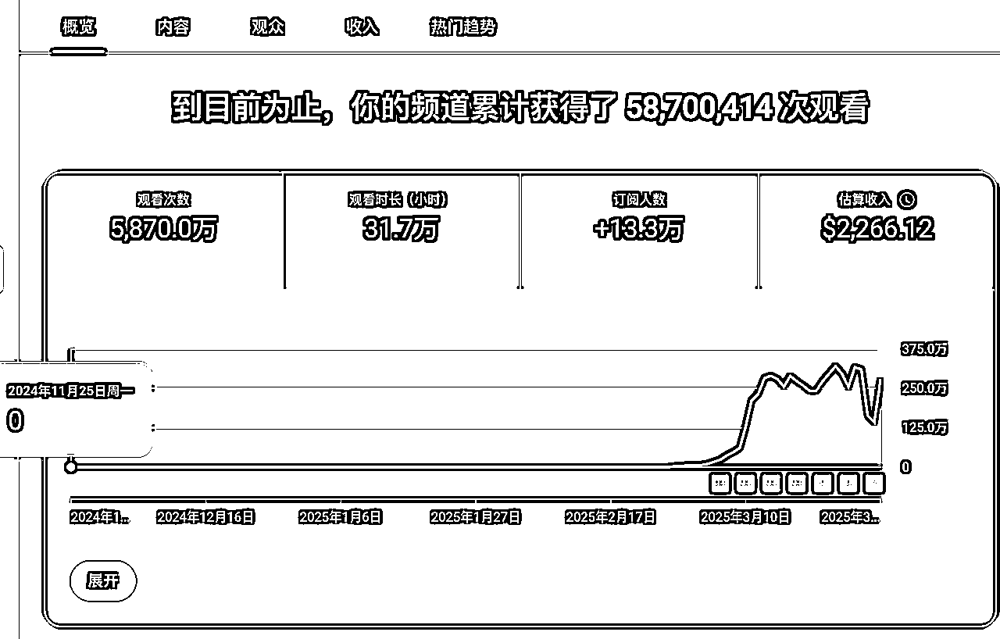

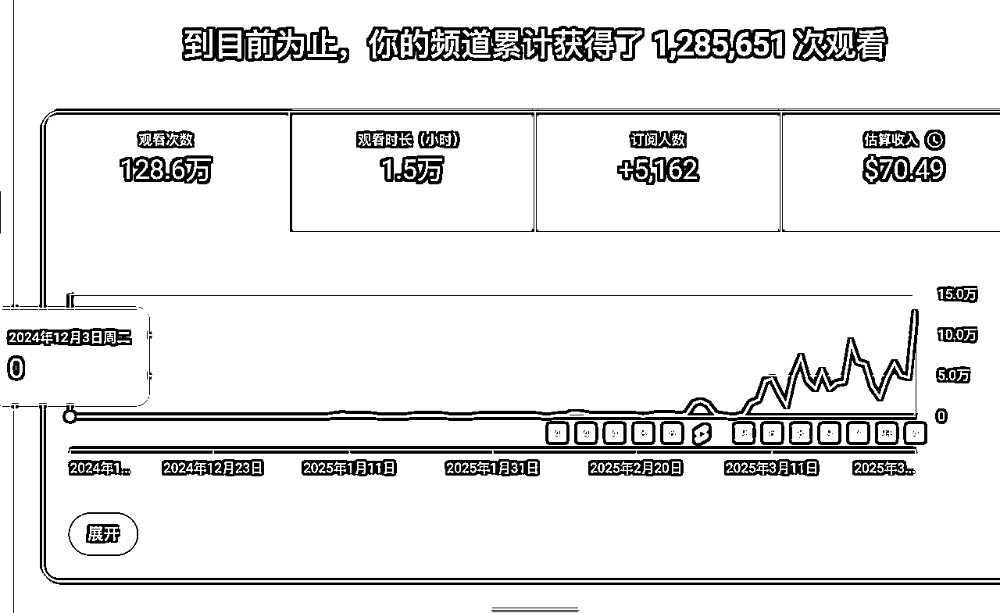

1.  目前跑的最高的一个作品，就是两周前的事，给我赚了1000多刀，至今仍然在给量；


* * *

很多人觉得这有点nb，其实在我看来没什么特别的，

这些成绩，并非来自朝夕一瞬，而是过往的厚积薄发。

23年我做AI知识付费，从0开始，47天，抖音3.5万粉，做私域原创7万字抖音+AI副业课程，纯利7万+

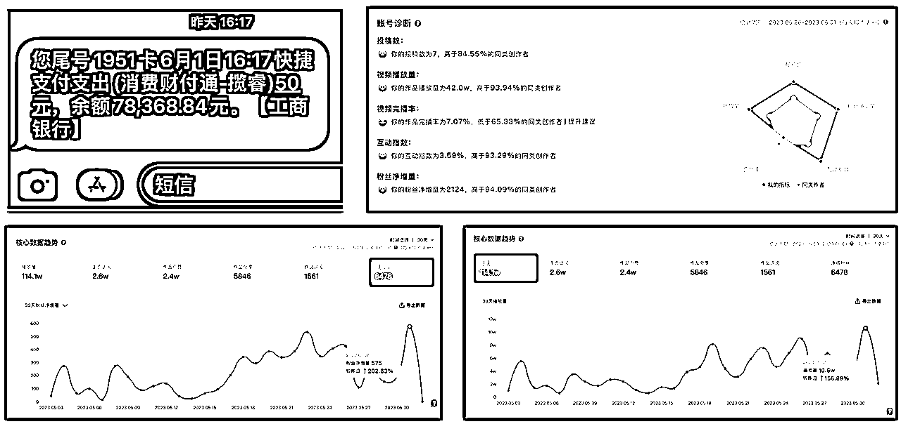

24年我做红包封面，从0开始，做小红书店铺用MJ做红包封面，1个月粉丝1.5万，纯利3万+


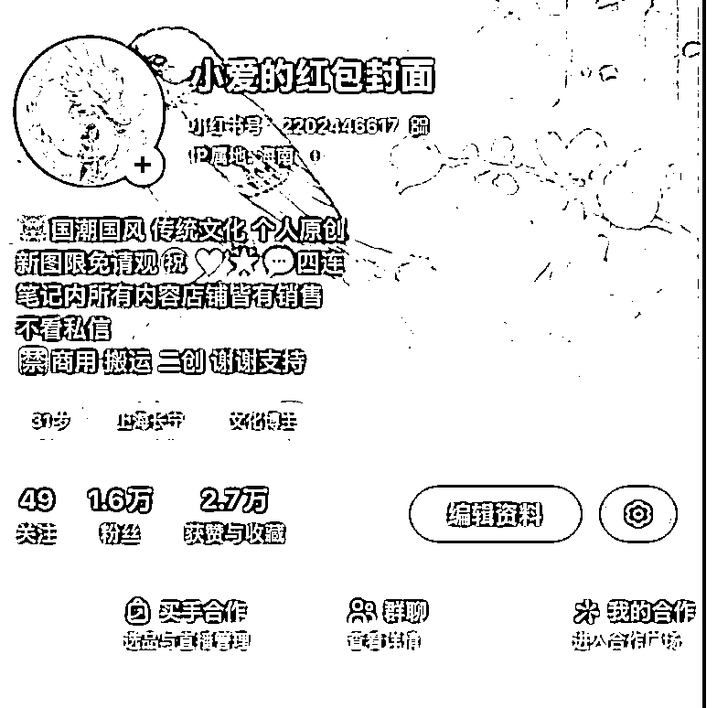

再往前，我做母婴号，私域卖自己整理的十万字孕产攻略表格，纯利20余万


另外还有一些鸡毛蒜皮的，卖教辅资料赚过几百块、写AI公众号赚过几千块，这些就不谈了

* * *

上面这些成绩，很普通，我也就只是一个普通人，

我没有什么nb的学历，大款的背景，我没赚到什么大钱，没什么超然的本事，

我所有的成绩，都是：

0成本、冷启动、跨行业、1个人、1台Mac、以副业的形式做出来的，还要上班带娃

把这几个词连在一起来做事，本应该是十死无生的，

但我仍不止一次的，能做出些许成绩

很多人都说我nb，但我不以为然，

我的经历 是每个普通人都能达到的境界

就算你是个0基础0起步的 最普通的人 你也都能达到我这般的成绩

这不是站着说话不腰疼，

这并不困难，也不难理解，这就是这个世界的运行规律，

因为

生财 确实有术

* * *

# 一：生财“术”之一：只做你感兴趣的领域

一切都是来源于此，兴趣，就是万物的原点，

你绝做不成你不感兴趣的事情

以AI+Youtube这件事为例，在我开始做这个之前 我甚至都不看YouTube

我为什么在24年11月选择从0开始，突然做这么个玩意？

我感兴趣的点在于：

1.  自媒体赚钱，不受地点时间限制（上班累的要死）

1.  “可以不受国内繁文缛节的管控”（之前做AI副业被抖音管控的要死）

1.  我想做“不出镜、不出声、不找素材、不写文案” 还能赚钱的东西（之前出镜做母婴号累的要死）

那什么才是可以来钱、还能不出镜、不出声、不找素材、不写文案，还不受国内管控的事情呢？

YouTube+AI视频+AI配音+AI文本，完美适配

但这些东西在24年以前，是不太现实的东西

但从24年开始 这些东西已经可以投入实战了

要说为什么我会选择去看Youtube，还是多亏了亦仁老兄说的那个超级风向标

* * *

我在YouTube上随便刷了刷 偶然碰到的一个博主 就是下面这位

奇幻研究所https://www.youtube.com/@qihuanyanjiu/videos

24年11月的时候 他大部分的视频播放，都有5-10万+

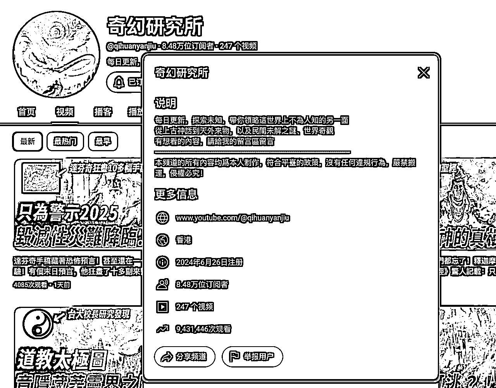


他的视频，全部都是AI图片轮播+AI配音


通过他 我刷找到了更多的同类型账号 以及整个生态的文案来源

就是下面这种露脸的真人口播号 播放数据更是高到离谱的几十万甚至上百万

https://www.youtube.com/@seeker7603

https://www.youtube.com/@wenzhaostudio

https://www.youtube.com/@emmashram


刷到他们真的不难 我相信只要你看得懂中文 稍微玩一会YouTube 你就一定刷到过类似的视频

你多点几个关注 他们就都出来了 真的非常好找 真的

看得多了，我发现他们的视频当中，有两个领域是播放量最高的，

1.  宗教类，是佛教和基督教

1.  预言类，是一些危言耸听的道听途说

所以，我的三个Ypp账号，

第一个，就是专精佛学内容；第二个，就是专精预言型内容；第三个，就是专精基督教内容

他们也先后都开通了Ypp变现资格

* * *

# 二：生财“术”之二：抄出一个MVP

所有生意的本质都是抄，别想着创什么新，

抄生二、二生三、三生万物，抄就完了

接下来 我就要发作品对标他们近期播放量最高的视频了

我的理想状态是什么呢？

我的作品=AI文本+AI视频+AI配音 最好能有个什么东西 能我一键就把他们都给生成就好了

这就是最理想的形态

但 最开始的时候 别想那么多有的 没的 好的 坏的

用最笨的方法来试错

做 就是真理 哪怕做的是最烂的东西也可以

只有实践 才出真知

岸上学游泳 永远学不会 扔到水坑里 呛几次你就会了

我最开始的作品 文本是我自己手工伪原创的 3000字的稿件，我需要1小时才能改好

再后来 我甚至还招了总结了SOP招了兼职还帮我写，感兴趣的可以直接看我的SOP

AI 配音是找的免费的https://ttsmaker.cn/

他好一点的音色 转一次有500文本的限制 转一次需要几分钟

我是一段段手工剪切粘贴进去 然后一段段下载出来的

AI视频 那时候还没有AI视频 都是AI图片轮播 我是一段段文本翻译成英文然后一段段送给MJ

然后一张张下载下来的

最后 还要把这些都手动都拖到剪映里 一段段的校准上百张图片的展示长度...

这就是我最开始的工作流 全是tmd手工

做一个10分钟左右的视频 要花上tmd几个小时

就这么笨的方法 我强行更了1个礼拜 每天更新

那段时间真的做得想死

11月1号更到11月7号 我的视频头一次突破几千播放，现在看起来多了一些


次日 我又有视频突破万播


次次次日 我的视频突破了好几万播


到此为止 MVP已成

我知道了 这件事走得通

* * *

# 三：生财“术”之三：具象化你的需求

到了这里，你就要具象化你的需求了，

什么是具象化的需求？

比如说你有一段文本，你需要隔几句话就均匀一些的将一小段文本另起一行，

这算是一个需求，但这不是具象化的需求，

因为你会遇到很多逻辑上的漏洞，比如说：

1.  “均匀”是多少？是按照字数算还是标点算？

1.  如果按字数算，多少字合适？

1.  如果到了既定的字数，直接另起一行导致一句完整的话被截断怎么办？

1.  如果按标点算，要从哪些标点另起一行？

1.  有的标点段落长有的标点段落短，搞下来长短不一怎么办？

这些就是逻辑漏洞，所以如果具象化的需求 ，那就是

1.  在每100字的位置，另起一行，

1.  如果100字的位置不是标点符号，就向后顺延，直到找到下列标点的任意一个“。！？，；” 再另起一行

这样才是具象化的需求，如果你还不会这样说话，你务必需要从现在开始刻意练习

自动化，是因人而异的，每个人/每个项目的需求都不一样，

你需要将你的需求列出来，然后一个个的具象化，一步步的用AI来实现

对我来说，我的需求：

1.  我想要能一键批量下载YouTube，因为他每天消耗我半小时

1.  我想要能一键伪原创成千上万的文本，因为他每天消耗我两三个小时

1.  我想要能一键给文本配好几百上千张配图，因为他每天消耗我两三个小时

1.  我想要能一键给文本配好配音，因为他每天消耗我一两个小时

1.  我想要能一键剪辑让声音和图片匹配，还要有关键帧动画过度的效果，因为他每天消耗我三四个小时

这就是我的需求，这些工序原本每天要消耗我七八个小时甚至更多，

你要先有了这些需求，才有后续的内容，

你连问题都不会提，你就不会有答案，

那么如何来具象化你的需求？

逻辑就是，你要的到底是什么？

然后再问，你要的到底是什么？

然后再问，你要的到底是什么？

直到你问的清晰到不能再细化了为止

比如说，我想要一键剪辑，

让我的文本声音和图片匹配，图片还要有关键帧和动画转场的效果，

那么问自己

你要的是怎样匹配？要的是怎样的关键帧和转场效果？

一张图可以配一两句话，但也不绝对，句子太长了也不行，太短了也不行，要合适一点

关键帧就是那种让图片可以匀速的上下左右移动，外加放大缩小效果的东西

动画转场就是闪黑 闪白 翻页 淡入 淡出 那种图片和图片之间的过渡效果

那么再问自己

什么是合适？什么是匀速？到底是要向上下左右哪个方向移动？到底是要放大还是缩小？放多大缩多小？你要的是哪些转场效果？转场效果的持续时长是多少？

首先，什么是合适呢？在仔细观察对标之后，你能发现，每张图片的展示时长是有区间的，有的长有的短，但图片的开始展示和结束展示时间 一定和字幕的开始和结束时间一致，

也就是说，一张图片的开始展示，一定是和一段字幕一起开始，一张图片结束展示，也一定是和一段字幕一起结束，图片切换会发生在字幕的自然断点处，这样观感上会好。

那么什么是合适？我的“合适”的逻辑就是：

1.  每张图片的最小展示时间为 5 秒

1.  先找到5秒后第一个字幕的结束点，他就是第一个图片的结束展示时间

1.  无缝衔接展示下一张图片，然后重复上面两点

那么关键帧呢？到底是要向上下左右哪个方向移动？到底是要放大还是缩小？放多大缩多小？

1.  给每个图片都打上两个关键帧点，一个在开始时间，一个在结束时间

1.  位移范围设置为 ±0.21（约为画面宽度/高度的 21%），这样就是放大和缩小区间，

1.  随机选择左、右、上、下的任意一个方向

这样所有的图片就都有了匀速的移动和放大缩小

那么要的是哪些转场效果？转场效果的持续时长是多少？

1.  选择渐显、缩放、弹跳、雨刷四种效果

1.  给每张图片之间都随机加上四种效果之一，持续时间是0.7秒

这样所有的图片就都有了动画过渡

这就是具象化的需求

# 四：生财“术”之四：开始提效

要想提效 招兼职 定SOP招人帮我处理固然是一个办法 但来的人实在是水平太差（主要是发不起工资）

经常分包出去 结果还要返工 效率还不如我自己来 非常的不靠谱

所以在具象了你的需求之后，就该自动化登场了

一句话概括我的代码，他可以将我一天10个小时甚至更多的工作量，降低到1分钟以内

不管它是脑力工作，还是机械操作，

是的，就是这么变态。

我需要提效的关键节点 其实就是下面这些

1.  YouTube文件批量下载

1.  伪原创改写数万字的文本

1.  将数万字的文本对应批量出图

1.  数万字文本的配音生成

1.  数百张图片和字幕BGM的剪辑拼接

在你具象化你的需求之后，你就可以拿着你的需求去找AI了

这些东西，我虽然貌似知道了想要怎样的效果，但如何才能实现自动化？

对当时的我来说，我完全不知该怎么办

这里 就是我命运的分水岭

因为我想到了询问AI 我问AI

“有没有什么方法 能帮我这样那样的提升效率啊”

这一个问题 打开了我新世界的大门

他告诉我了一个东西叫做python

你要知道 在这个时间点之前 我一行代码也没有写过

你明白当我看到他吐出一行行代码的时候那是什么感觉吗？

是的 是想死的感觉 他写的东西我一个字也看不懂 他写的代码我也一行都不想看

但我为了能提效，硬着头皮一行一行的问他那是什么 要怎么做

于是我在AI的指导下

人生中第一次打开了一个东西叫做terminal

打出了人生中第一个python+空格

然后就收到了人生中第一个error报错

使出了我最熟练的复制粘贴把error发给AI

然后就收到了更多的error报错

.....

现在回头看 我知道这个东西叫做AI编程 叫做cursor 叫做windsurf

但在那时候 我p也不知道

时至今日 仅仅几个月的时间 我在AI编程买的会员费超过100刀

还不算我换了6个邮箱硬薅cursor免费额度的羊毛直到他BAN了我的IP

接下来关于自动化的内容 对没有需求的人来说 枯燥且乏味

但对需要它的人来说 无异于是金山银山

为什么说你一定要学会AI编程 因为每个人每个项目的需求 一定是不一样的

要想数倍的提效 你必须学会AI编程 来根据你的需求定制化 打造你属于你自己的兵器

然后在使用过程中不停迭代不停迭代不停迭代，他就会变得越来越好用，越来越趁手

你的武功才能最大限度的发挥

AI编程基本等于没有门槛 只要你多用用就好

下面的代码 如果你不会用/看不懂/有报错

请你去问AI 就能解决99%的问题

## YouTube 批量下载自动化：从耗时半小时降低到小于1分钟

首先 YouTube下载，我本来是用这种网页 https://yt1d.com/en306/

问题是下载的又慢 又要看广告 只能1个1个的弄 还经常不稳定失效 特别的烦

你接下来看到的 是我迭代了几十个版本后的YouTube下载py

极其稳定 可批量下载 及视频的封面图

只需要新建一个word 把你想要的视频链接塞到里面 运行即可 真的非常好用

当然你需要安装一些依赖 修改一些路径

如果YouTube更改规则导致你下载失败 只需要一行简单的

pip install -U yt-dlp

就能升级到最新版 解决99%下载不了的问题

```
import os
import sys
import time
import random
from pathlib import Path
from datetime import datetime
from docx import Document
import yt_dlp

def get_current_time():
    """获取当前时间的格式化字符串"""
    return datetime.now().strftime("%Y-%m-%d %H:%M:%S")

def log_message(message, level="INFO"):
    """打印带时间戳的日志"""
    print(f"[{get_current_time()}] [{level}] {message}")

def read_youtube_links():
    """从桌面剪辑文件夹中的youtube.docx读取视频链接"""
    try:
        # 获取桌面剪辑文件夹路径
        desktop_path = str(Path.home() / "Desktop")
        clips_folder = os.path.join(desktop_path, "Youtube")
        docx_path = os.path.join(clips_folder, "youtube.docx")

        if not os.path.exists(docx_path):
            log_message(f"文件不存在: {docx_path}", "ERROR")
            return None

        # 读取文档
        doc = Document(docx_path)
        links = []

        # 从每个段落中提取链接
        for para in doc.paragraphs:
            text = para.text.strip()
            if "youtube.com" in text or "youtu.be" in text:
                links.append(text)

        log_message(f"从文档中读取到 {len(links)} 个链接")
        return links

    except Exception as e:
        log_message(f"读取文件失败: {str(e)}", "ERROR")
        return None

def download_videos(links):
    """下载YouTube视频"""
    if not links:
        log_message("没有找到要下载的链接", "WARNING")
        return

    # 创建下载目录在剪辑文件夹中
    desktop_path = str(Path.home() / "Desktop")
    output_dir = os.path.join(desktop_path, "Youtube", "YouTube下载")
    os.makedirs(output_dir, exist_ok=True)

    # yt-dlp配置
    ydl_opts = {
        'format': 'bestaudio/best',
        'paths': {'home': output_dir},
        'postprocessors': [{
            'key': 'FFmpegExtractAudio',
            'preferredcodec': 'mp3',
            'preferredquality': '192',
        }, {
            'key': 'FFmpegThumbnailsConvertor',
            'format': 'jpg'
        }],
        'writethumbnail': True,  # 下载缩略图
        'outtmpl': {
            'default': '%(title)s.%(ext)s',
            'thumbnail': '%(title)s.%(ext)s'  # 缩略图文件名格式
        },
        'cookiesfrombrowser': ('chrome',),
        'proxy': 'http://127.0.0.1:7890',
        'verbose': True,
        'no_warnings': False,
        'extract_flat': False,
        # 添加重试和错误处理选项
        'retries': 10,
        'fragment_retries': 10,
        'file_access_retries': 5,
        'retry_sleep': True,
        'sleep_interval': 3,
        'max_sleep_interval': 7,
        'sleep_interval_requests': 1,
        # 添加网络相关选项
        'socket_timeout': 30,
        'http_chunk_size': 10485760,  # 10MB
        'buffersize': 1024,
        # 添加地理位置绕过
        'geo_bypass': True,
        'geo_bypass_country': 'US',
        # 添加请求头
        'http_headers': {
            'User-Agent': 'Mozilla/5.0 (Macintosh; Intel Mac OS X 10_15_7) AppleWebKit/537.36 (KHTML, like Gecko) Chrome/120.0.0.0 Safari/537.36',
            'Accept': '*/*',
            'Accept-Language': 'en-US,en;q=0.9',
            'Accept-Encoding': 'gzip, deflate',
            'Origin': 'https://www.youtube.com',
            'Referer': 'https://www.youtube.com/',
            'Connection': 'keep-alive'
        }
    }

    total = len(links)
    success = 0

    for i, url in enumerate(links, 1):
        try:
            # 添加随机延时，避免被限制
            delay = random.uniform(2, 5)
            log_message(f"等待 {delay:.1f} 秒后开始下载...")
            time.sleep(delay)

            log_message(f"正在处理第 {i}/{total} 个视频...")
            with yt_dlp.YoutubeDL(ydl_opts) as ydl:
                error_code = ydl.download([url])

                if error_code == 0:
                    success += 1
                    log_message(f"视频下载成功: {url}")
                else:
                    log_message(f"视频下载失败: {url}", "ERROR")

        except Exception as e:
            log_message(f"下载失败: {str(e)}", "ERROR")
            log_message(f"跳过视频: {url}", "WARNING")

    log_message(f"下载完成! 成功: {success}/{total}")

def main():
    """主函数"""
    try:
        log_message("开始运行YouTube下载程序")

        # 读取链接
        links = read_youtube_links()
        if links:
            log_message(f"成功读取 {len(links)} 个链接")
            # 下载视频
            download_videos(links)
        else:
            log_message("未能读取到任何链接", "ERROR")

    except KeyboardInterrupt:
        log_message("用户中断下载", "WARNING")
        sys.exit(1)
    except Exception as e:
        log_message(f"程序执行出错: {str(e)}", "ERROR")
        sys.exit(1)

if __name__ == "__main__":
    main()
```

至此 YouTube批量下载的问题解决了

我再也不用一个个的操作了 只需要批量粘贴对标的视频到word里

然后运行代码 工作量直接从半小时降到了小于1分钟

所有的对标就都下载到我指定的文件夹里了

* * *

## 伪原创文本自动化：从耗时1小时降低到小于1分钟

这是最难的部分 因为这种AI视频 文本就是灵魂

特别是宗教类的内容 出处 释义 读法 文言文 每一样都不容易

chatgpt4 4o mini claude3.5sonnect haiku 还有什么豆包 火山 MCP

只要有的我全都试过 不论你怎么调教prompt 都没有办法写出合格的伪原创

所以我又问了AI 到底该怎么办

他给了我一个方案：Finetune Model

这个东西 说是这个项目的灵魂也不为过

Finetune Model 就是微调模型 具体的你可以看官方文档

https://platform.openai.com/docs/guides/fine-tuning

简单来说 在这个项目里 他的作用

就是你给他1篇原文+1篇你伪原创的改文 他就能学会你的文笔

你以后用这个模型 给他原文 他就能按照你的改法 给出伪原创的文章来

这个样本好搞 毕竟我之前人工精校了N篇伪原创

所以我给了他30组对照样本 训练费用只花了5刀

至于怎么训练这个模型 Openai的官网有详细教程（教程我一个字也看不懂也不需要懂 不会就问AI）

这样改写出来的效果 可以说是全网最强 没有之一

然后 将下载好的文本 通过API调用的方式发送给模型 等待他写完返回 就可以了

下面是改写文本的代码

```
from openai import OpenAI
import os
from docx import Document
import string
import time
import tiktoken
import openai  
import re
import traceback

class TextRewriter:
    def __init__(self):
        """初始化改写器"""
        # 初始化API客户端
        # 直接在代码中设置 API key
        api_key = ""  # 请将此处替换为您的实际API密钥

        self.openai_client = OpenAI(
            base_url="https://api.openai.com/v1",
            api_key=api_key
        )

        # ====== 配置项 ======
        # 文本处理相关配置
        self.MAX_TEXT_LENGTH = 12000  # 单次处理的最大文本长度
        self.MAX_RETRIES = 5  # 最大重试次数
        self.ENABLE_SECOND_ROUND = True  # 是否启用第二轮改写

        # 改写幅度配置
        self.rewrite_ratio = {
            'min': 60,  # 最小改写幅度（百分比）
            'max': 85  # 最大改写幅度（百分比）
        }

        # 翻译模式字符比例配置
        self.translation_ratio = {
            'min': 100,  # 最小字符比例（百分比）
            'max': 400  # 最大字符比例（百分比）
        }

        # 英文到中文翻译字符比例配置
        self.en_to_cn_ratio = {
            'min': 20,  # 最小字符比例（百分比）
            'max': 100  # 最大字符比例（百分比）
        }

        # 模型配置
        self.MODEL_CONFIG = {
            # 微调模型配置
            'ft_model': {
                'name': "ft:gpt-4o-mini-2024-07-18:personal:",  # 模型名称
                'temperature': 0.9  # 温度参数
            },
            # GPT-4模型配置
            'gpt4o_model': {
                'name': "gpt-4o-mini-2024-07-18",  # 模型名称
                'temperature': {
                    'default': 0.75,  # 默认温度
                    'translation': 0.7,  # 翻译模式温度
                    'min': 0.2,  # 最小温度
                    'step': 0.1  # 每次重试减少的温度值
                },
                'max_length': 16000,  # 最大长度
                'max_tokens': 16000  # 最大token数
            }
        }

        # API配置
        self.claude_client = OpenAI(
            base_url="",
            api_key=""
        )

        # ====== 提示词配置 ======
        # 英文基督教内容提示词
        self.en_christian_prompt = """You are a professional Christian content editor. Your task is to rewrite the given English text with the following requirements:

1\. Content Requirements:
   - Maintain biblical accuracy
   - Make the language more vivid and easy to understand
2\. Improve the clarity and fluency of the article, which can be adjusted from the original text, and must be significantly different from the original text
3\. Correct all typos and grammatical errors, without any content in parentheses
4\. Only provide the rewritten content, without explanation"""

        # 中文基督教内容提示词
        self.cn_christian_prompt = """你是一位基督教专家。你的任务是改写给定的文本，要求：
1\. 使语言更加生动易懂
2\. 改善文章的清晰度和流畅性，可以对原文进行删减和调整，要和原文明显不一样
3\. 修正所有错别字和语法错误，不要有括号内容
4\. 只提供改写后的内容，无需解释"""

        # 通用内容提示词
        self.general_prompt = """你是一位内容编辑专家。你的任务是改写给定的文本，要求：
1\. 使语言更加生动易懂
2\. 改善文章的清晰度和流畅性，可对原文进行删减和调整，要和原文明显不一样，相似度不能高于5%
3\. 修正所有错别字和语法错误，不要有括号内容
4\. 只提供改写后的内容，无需解释"""

        # 提取主题改写提示词
        self.topic_extraction_prompt = """你是一位内容编辑专家。你的任务是改写给定的文本，要求：
1\. 将文本的大纲进行提取，要保证日期时间和引用内容的准确性
2\. 根据文章大纲进行重写，文章逻辑要清晰流畅
3\. 不要有错别字和语法错误，不要有括号内容
4\. 只提供改写后的内容，无需解释"""

        # 西班牙语翻译提示词
        self.spanish_prompt = """Por favor, traduce el siguiente texto al español. Requisitos:
1\. Mantén el significado original y todos los detalles del texto
2\. Asegúrate de que la traducción sea precisa y completa
3\. Mantén un tono profesional y natural
4\. Conserva toda la terminología técnica y específica
5\. Mantén la misma estructura y organización del texto original
6\. La traducción debe ser fiel al original, sin omitir ni agregar información
7\. Utiliza expresiones naturales en español manteniendo el mismo nivel de formalidad

Importante: La traducción debe ser detallada y mantener todos los matices del texto original."""

        # 中文到英文翻译提示词
        self.chinese_to_english_prompt = """You are a professional translator. Your task is to translate the given Chinese text into English with the following requirements:

1\. Translation Requirements:
   - Make the language vivid and easy to understand
   - Improve the clarity and fluency while maintaining the original meaning
   - Use natural and idiomatic English expressions
2\. Content Requirements:
   - Maintain accuracy of all details and technical terms
   - Remove any content in parentheses or special symbols
   - Fix any typos or grammatical errors
3\. Only provide the translated content in English, without any explanations or notes"""

        # 英文到中文翻译提示词
        self.english_to_chinese_prompt = """你是一位翻译改写专家。你的任务是将给定的文本翻译并微调，要求：
1\. 使翻译后的语言更加生动易懂 符合中文语境
2\. 改善文章的清晰度和流畅性
3\. 修正所有错别字和语法错误，不要有括号内容
4\. 只提供改写后的内容，无需解释"""

        # GPT-4 本地化改写提示词
        self.gpt4_localization_prompt = """You are a professional content editor. Your task is to rewrite the given Chinese text with the following requirements:

1\. Content Requirements:
   - Replace Chinese place names and person names noun concepts in the text,with common American names for better understanding by American audience
   - Make the language more vivid and easy to understand
2\. Improve the clarity and fluency of the article, which can be adjusted from the original text
3\. Correct all typos and grammatical errors, without any content in parentheses
4\. 在满足上述条件后，将中文全部翻译成英文
5\. Only provide the rewritten content, without explanation"""

        # 第二轮改写提示词
        self.general_prompt_round2 = """你是一位内容编辑专家。你的任务是将给定的文本进行纠错，要求：
1\. 使语言更加易懂，修正所有错别字和语法错误
2\. 只提供改写后的内容，无需解释
"""

        # 第二轮基督教内容提示词
        self.cn_christian_prompt_round2 = """你是一位基督教专家。你的任务是纠错给定的文本，要求：
1\. 使语言更加易懂，修正所有错别字和语法错误
2\. 只提供改写后的内容，无需解释
"""

    def read_docx(self, file_path):
        """读取docx文件内容"""
        try:
            doc = Document(file_path)
            paragraphs = []
            for para in doc.paragraphs:
                text = para.text.strip()
                if text:  # 只添加非空段落
                    paragraphs.append(text)
            return '\n'.join(paragraphs)
        except Exception as e:
            print(f"读取文件时出错: {str(e)}")
            return None

    def save_to_docx(self, text, file_path):
        """保存内容到docx文件"""
        try:
            doc = Document()
            # 将文本按换行符分割成段落
            paragraphs = text.split('\n')
            for para in paragraphs:
                if para.strip():  # 只添加非空段落
                    doc.add_paragraph(para.strip())
            doc.save(file_path)
            return True
        except Exception as e:
            print(f"保存文件时出错: {str(e)}")
            return False

    def get_unique_filename(self, base_path):
        """获取唯一的文件名，如果文件存在则在文件名后加上数字"""
        try:
            # 确保输出到"改写"文件夹
            rewrite_folder = os.path.join(os.path.expanduser("~/Desktop"), "剪辑/改写")
            if not os.path.exists(rewrite_folder):
                os.makedirs(rewrite_folder)

            # 获取原始文件名和扩展名
            filename = os.path.basename(base_path)
            name, ext = os.path.splitext(filename)

            # 生成新的文件路径
            counter = 1
            new_path = os.path.join(rewrite_folder, f"{name}{ext}")
            while os.path.exists(new_path):
                new_path = os.path.join(rewrite_folder, f"{name}_{counter}{ext}")
                counter += 1

            return new_path
        except Exception as e:
            print(f"生成文件名时出错: {str(e)}")
            return None

    def get_docx_files(self):
        """获取改写文件夹中的docx文件"""
        try:
            # 确保桌面上的"改写"文件夹存在
            rewrite_folder = os.path.join(os.path.expanduser("~/Desktop"), "剪辑/改写")
            if not os.path.exists(rewrite_folder):
                os.makedirs(rewrite_folder)
                print(f'已创建文件夹：{rewrite_folder}')
                print('请将要处理的文件放入此文件夹，然后重新运行程序')
                return []

            # 获取文件夹中的所有非隐藏的docx文件
            docx_files = []
            for file in os.listdir(rewrite_folder):
                # 跳过隐藏文件和临时文件
                if (not file.startswith('.') and not file.startswith('~')) and file.endswith('.docx'):
                    file_path = os.path.join(rewrite_folder, file)
                    if os.path.isfile(file_path):
                        docx_files.append((file, file_path))

            if not docx_files:
                print(f'在 {rewrite_folder} 中没有找到.docx文件')
                print('请将要处理的文件放入此文件夹，然后重新运行程序')
                return []

            # 按自然排序对文件进行排序
            docx_files.sort(key=lambda x: self.natural_sort_key(x[0]))

            # 显示找到的文件
            print("\n找到以下文件：")
            for i, (filename, _) in enumerate(docx_files, 1):
                print(f"{i}. {filename}")
            print()

            return docx_files
        except Exception as e:
            print(f"获取文件列表时出错: {str(e)}")
            traceback.print_exc()  # 打印详细的错误信息
            return []

    def count_tokens(self, text):
        """使用tiktoken准确计算token数量"""
        if text is None:
            return 0
        try:
            encoding = tiktoken.get_encoding("cl100k_base")
            return len(encoding.encode(str(text)))  # 确保text是字符串
        except Exception as e:
            print(f"Token计算失败: {str(e)}")
            # 如果tiktoken失败，使用简单估算（每4个字符约1个token）
            return len(str(text)) // 4

    def calculate_cost(self, input_tokens, output_tokens, is_finetune=False):
        """计算API调用成本"""
        if input_tokens is None or output_tokens is None:
            return 0

        if is_finetune:
            # 微调模型的价格（每1M token）
            input_price = 0.3 / 1000000  # 输入价格 ($0.3/1M tokens)
            output_price = 1.2 / 1000000  # 输出价格 ($1.2/1M tokens)
        else:
            # GPT-4的价格（每1M token）
            input_price = 0.15 / 1000000  # 输入价格 ($0.15/1M tokens)
            output_price = 0.6 / 1000000  # 输出价格 ($0.6/1M tokens)

        return (input_tokens * input_price + output_tokens * output_price)  

    def split_text_by_length(self, text, max_length=None):
        """将文本按长度分段"""
        if max_length is None:
            max_length = self.MODEL_CONFIG['gpt4o_model']['max_length']

        segments = []
        current_segment = ""

        for paragraph in text.split('\n'):
            if len(current_segment) + len(paragraph) + 1 <= max_length:
                current_segment += (paragraph + '\n')
            else:
                if current_segment:
                    segments.append(current_segment.strip())
                current_segment = paragraph + '\n'

        if current_segment:
            segments.append(current_segment.strip())

        return segments

    def process_segment(self, text, mode):
        """处理单个文本段落"""
        import time

        # 确保mode是整数
        mode = int(mode)

        # 生成提示词
        if mode == 1:  # 通用模式
            if hasattr(self, 'is_second_round') and self.is_second_round:
                prompt = f"{self.general_prompt_round2}\n\n请改写以下文本：\n\n{text}"
            else:
                prompt = self.general_prompt + "\n\n" + text
        elif mode == 2:  # 中文到英文翻译
            prompt = f"{self.chinese_to_english_prompt}\n\n请翻译以下文本：\n\n{text}"
        elif mode == 3:  # 英文本地化人地名改写
            prompt = f"{self.gpt4_localization_prompt}\n\n请改写以下文本：\n\n{text}"
        elif mode == 4:  # 英文到中文翻译
            prompt = f"{self.english_to_chinese_prompt}\n\n请翻译以下英文文本：\n\n{text}"
        elif mode == 5:  # 提取主题改写
            if hasattr(self, 'is_second_round') and self.is_second_round:
                prompt = f"{self.general_prompt_round2}\n\n请改写以下文本：\n\n{text}"
            else:
                prompt = f"{self.topic_extraction_prompt}\n\n请改写以下文本：\n\n{text}"
        else:
            print(f"错误：不支持的处理模式 {mode}")
            return None, 0

        try:
            # 根据重试次数调整temperature
            current_temp = max(
                self.MODEL_CONFIG['gpt4o_model']['temperature']['min'],
                self.MODEL_CONFIG['gpt4o_model']['temperature']['default'] - 
                0 * self.MODEL_CONFIG['gpt4o_model']['temperature']['step']
            )

            print("\nGPT-4处理中...")
            start_time = time.time()

            # 调用API
            response = self.openai_client.chat.completions.create(
                model=self.MODEL_CONFIG['gpt4o_model']['name'],
                messages=[{"role": "user", "content": prompt}],
                temperature=current_temp,
                max_tokens=self.MODEL_CONFIG['gpt4o_model']['max_tokens']
            )

            process_time = time.time() - start_time
            print(f"GPT-4处理完成，耗时: {process_time:.2f}秒")

            # 获取生成的内容
            content = response.choices[0].message.content.strip()

            # 计算token和成本
            input_tokens = response.usage.prompt_tokens
            output_tokens = response.usage.completion_tokens
            cost = self.calculate_cost(input_tokens, output_tokens)

            print(f"\n第 {1} 次尝试:")
            print(f"使用模型: {self.MODEL_CONFIG['gpt4o_model']['name']}")
            print(f"本次调用成本: ${cost:.4f}")
            print(f"Token估算 - 输入: {input_tokens}, 输出: {output_tokens}")

            return content, cost

        except Exception as e:
            print(f"处理出错: {str(e)}")
            return None, 0

    def process_file(self, filepath, mode):
        """处理单个文件"""
        print(f"\n开始处理文件: {filepath}")
        total_cost = 0

        # 检查文件
        if not os.path.exists(filepath):
            print("文件不存在")
            return False, 0, 0

        print(f"文件是否存在: {os.path.exists(filepath)}")
        print(f"文件是否可读: {os.access(filepath, os.R_OK)}")
        print(f"文件大小: {os.path.getsize(filepath)} 字节")

        try:
            print("\n尝试读取文件内容...")
            content = self.read_docx(filepath)
            if not content:
                print("文件内容为空")
                return False, 0, 0

            original_chars = len(content)
            print(f"成功读取文件，字符数: {original_chars}")
            print(f"内容预览（前100字符）: {content[:100]}")

            # 处理逻辑
            if int(mode) in [1, 5]:  # 通用模式和提取主题改写模式
                print(f"\n开始微调模型改写，文本长度: {len(content)} 字符")

                # 第一轮：微调模型处理
                first_result = self.process_with_finetune(content, int(mode))
                if not first_result:
                    print("微调模型处理失败")
                    if int(mode) == 1:  # 如果是模式1，且5次生成都失败，则不进行二次改写
                        print("模式1中5次生成都失败，不进行二次改写，处理结束")
                        return False, total_cost, 0
                    else:
                        print("跳过微调模型，直接使用GPT-4处理")
                        base_length = len(content)  # 使用原始长度作为基准
                else:
                    if self.ENABLE_SECOND_ROUND:
                        print("\n开始GPT-4第二轮改写...")
                        self.is_second_round = True  # 标记为第二轮
                        base_length = len(first_result)  # 使用微调模型处理后的长度作为基准
                        content = first_result
                    else:
                        print("第二轮改写已禁用，将使用微调模型的处理结果")
                        content = first_result
                        # 保存微调模型处理结果
                        output_path = self.save_to_docx(content, self.get_unique_filename(filepath))
                        if output_path:
                            print(f"\n处理完成，结果已保存至: {output_path}")
                        return True, total_cost, len(content)
            else:
                base_length = len(content)  # 其他模式使用原始长度作为基准

            # 分段处理
            segments = self.split_text_by_length(content)
            print(f"\n文本已分为 {len(segments)} 段")

            processed_segments = []
            for i, segment in enumerate(segments, 1):
                print(f"\n开始处理第 {i}/{len(segments)} 段:")
                processed_text, cost = self.process_segment(segment, mode)
                if processed_text:
                    processed_segments.append(processed_text)
                    total_cost += cost
                else:
                    print(f"处理第 {i} 段失败")
                    return False, total_cost, 0

            # 合并处理后的内容
            final_content = "\n".join(processed_segments)

            # 保存结果
            output_path = self.save_to_docx(final_content, self.get_unique_filename(filepath))
            if output_path:
                print(f"\n处理完成，结果已保存至: {output_path}")
                print(f"总成本: ${total_cost:.4f}")
                return True, total_cost, len(final_content)

            return False, total_cost, 0

        except Exception as e:
            print(f"处理文件时出错: {str(e)}")
            return False, total_cost, 0

    def select_mode(self, file_name):
        """为单个文件选择处理模式"""
        while True:
            print(f"\n请为文件 {file_name} 选择处理模式:")
            print("1\. 通用模式（先微调后GPT-4）")
            print("2\. 中文到英文翻译（仅GPT-4）")
            print("3\. 英文本地化人地名改写（仅GPT-4）")
            print("4\. 英文到中文翻译（仅GPT-4）")
            print("5\. 提取主题改写（先微调后GPT-4）")

            choice = input("\n请输入模式编号(1-5): ").strip()

            if choice in ['1', '2', '3', '4', '5']:
                print(f"已选择模式 {choice}")
                return choice
            else:
                print("无效的选择，请重试")

    def natural_sort_key(self, file_tuple):
        import re
        file_name = file_tuple[0]
        convert = lambda text: int(text) if text.isdigit() else text.lower()
        alphanum_key = lambda key: [convert(c) for c in re.split('([0-9]+)', key)]
        return alphanum_key(file_name)

    def process_files(self, files, modes):
        """处理多个文件"""
        results = []
        total_chars = 0
        total_rewritten_chars = 0
        total_cost = 0
        success_count = 0

        for i, (filename, filepath) in enumerate(files, 1):
            print(f"\n处理文件 {i}/{len(files)}: {filename}")
            try:
                mode = modes.get(filename)
                if not mode:
                    print(f"未找到文件 {filename} 的处理模式")
                    continue

                print(f"完整文件路径: {filepath}")
                print(f"选择的处理模式: {mode}")

                success, cost, chars = self.process_file(filepath, mode)

                if success:
                    success_count += 1
                    total_chars += chars
                    # 获取改写后的字符数
                    output_path = self.get_latest_output_path()
                    if output_path and os.path.exists(output_path):
                        try:
                            # 使用python-docx读取文件内容
                            doc = Document(output_path)
                            rewritten_text = '\n'.join([paragraph.text for paragraph in doc.paragraphs])
                            rewritten_chars = len(rewritten_text)
                            total_rewritten_chars += rewritten_chars
                            results.append({
                                'filename': filename,
                                'original_chars': chars,
                                'rewritten_chars': rewritten_chars,
                                'success': True
                            })
                        except Exception as e:
                            print(f"读取输出文件时出错: {str(e)}")
                            results.append({
                                'filename': filename,
                                'original_chars': chars,
                                'rewritten_chars': 0,
                                'success': False
                            })
                    else:
                        print(f"无法读取输出文件: {output_path}")
                        results.append({
                            'filename': filename,
                            'original_chars': chars,
                            'rewritten_chars': 0,
                            'success': False
                        })
                else:
                    results.append({
                        'filename': filename,
                        'original_chars': chars,
                        'rewritten_chars': 0,
                        'success': False
                    })

                total_cost += cost

            except Exception as e:
                print(f"处理文件时出错: {str(e)}")
                traceback.print_exc()
                results.append({
                    'filename': filename,
                    'original_chars': 0,
                    'rewritten_chars': 0,
                    'success': False
                })

        # 打印处理结果
        print("\n处理完成!")
        print(f"成功: {success_count}/{len(files)}")

        # 打印字符统计表格
        print("\n字符统计:")
        print("-" * 100)
        print(f"{'文件名':<40} {'原文字符':<16} {'改写字符':<16} {'变化比例':<12} {'状态':<8}")
        print("-" * 100)

        for result in results:
            filename = result['filename']
            original = result['original_chars']
            rewritten = result['rewritten_chars']
            ratio = (rewritten / original * 100) if original > 0 else 0.0
            status = "成功" if result['success'] else "失败"

            print(f"{filename:<40} {original:<16} {rewritten:<16} {ratio:.1f}% {status:<8}")

        print("-" * 100)
        print("总计:")
        print(f"原文总字符: {total_chars}")
        print(f"改写总字符: {total_rewritten_chars}")
        total_ratio = (total_rewritten_chars / total_chars * 100) if total_chars > 0 else 0.0
        print(f"总体变化比例: {total_ratio:.1f}%")
        print(f"总成本: ${total_cost:.4f}")

    def get_latest_output_path(self):
        """获取最新的输出文件路径"""
        try:
            rewrite_folder = os.path.join(os.path.expanduser("~/Desktop"), "改写")
            if not os.path.exists(rewrite_folder):
                return None

            files = [f for f in os.listdir(rewrite_folder) if f.endswith('.docx')]
            if not files:
                return None

            files.sort(key=lambda x: os.path.getmtime(os.path.join(rewrite_folder, x)), reverse=True)
            return os.path.join(rewrite_folder, files[0])
        except Exception as e:
            print(f"获取最新输出文件路径时出错: {str(e)}")
            return None

    def generate_prompt(self, text, mode):
        """根据模式生成提示词"""
        mode = int(mode)
        if mode == 1:  # 通用模式
            if hasattr(self, 'is_second_round') and self.is_second_round:
                return f"{self.general_prompt_round2}\n\n请改写以下文本：\n\n{text}"
            else:
                return self.general_prompt + "\n\n" + text
        elif mode == 2:  # 中文到英文翻译
            return f"{self.chinese_to_english_prompt}\n\nPlease translate the following Chinese text into English:\n\n{text}"
        elif mode == 3:  # 英文本地化人地名改写
            return f"{self.gpt4_localization_prompt}\n\nPlease rewrite the following text:\n\n{text}"
        elif mode == 4:  # 英文到中文翻译
            return f"{self.english_to_chinese_prompt}\n\n请翻译以下英文文本：\n\n{text}"
        elif mode == 5:  # 提取主题改写
            return f"{self.topic_extraction_prompt}\n\n请改写以下文本：\n\n{text}"

    def process_with_finetune(self, content, mode):
        """使用微调模型处理内容"""
        total_cost = 0

        for attempt in range(self.MAX_RETRIES):
            try:
                print(f"\n第 {attempt + 1} 次尝试使用微调模型...")

                # 生成提示词
                prompt = self.generate_prompt(content, mode)

                # 调用API
                response = self.openai_client.chat.completions.create(
                    model=self.MODEL_CONFIG['ft_model']['name'],
                    messages=[{"role": "user", "content": prompt}],
                    temperature=self.MODEL_CONFIG['ft_model']['temperature']
                )

                # 获取生成的内容
                result = response.choices[0].message.content.strip()

                # 计算token和成本
                input_tokens = response.usage.prompt_tokens
                output_tokens = response.usage.completion_tokens
                cost = self.calculate_cost(input_tokens, output_tokens, is_finetune=True)
                total_cost += cost

                print(f"使用模型: {self.MODEL_CONFIG['ft_model']['name']}")
                print(f"Token使用 - 输入: {input_tokens}, 输出: {output_tokens}")
                print(f"本次成本: ${cost:.4f}")
                print(f"累计成本: ${total_cost:.4f}")

                # 检查长度
                original_length = len(content)
                result_length = len(result)
                min_length = int(original_length * (self.rewrite_ratio['min'] / 100))  # 将百分比转换为小数
                max_length = int(original_length * (self.rewrite_ratio['max'] / 100))

                print(f"原文长度: {original_length} 字符")
                print(f"改写长度: {result_length} 字符")
                print(f"长度要求: {min_length}-{max_length} 字符")
                print(f"达标率: {(result_length / original_length * 100):.1f}%")

                if result_length < min_length or result_length > max_length:
                    if attempt < self.MAX_RETRIES - 1:
                        print(f"生成的内容长度{'不足' if result_length < min_length else '超出限制'}，正在重试...")
                        continue
                    else:
                        print(f"\n已达到最大重试次数 ({self.MAX_RETRIES})，微调模型处理失败")
                        return None

                print("微调模型处理成功")
                return result

            except Exception as e:
                print(f"微调模型处理出错: {str(e)}")
                if attempt < self.MAX_RETRIES - 1:
                    print("正在重试...")
                    continue
                else:
                    print(f"\n已达到最大重试次数 ({self.MAX_RETRIES})，微调模型处理失败")
                    return None

        return None

    def run(self):
        """主运行方法"""
        while True:
            # 获取所有docx文件
            docx_files = self.get_docx_files()
            if not docx_files:
                return

            # 显示当前配置并让用户选择是否启用第二轮改写
            print("\n是否启用第二轮改写? (y/n)")
            self.ENABLE_SECOND_ROUND = input().lower() == 'y'
            print(f"已{'启用' if self.ENABLE_SECOND_ROUND else '禁用'}第二轮改写")

            # 获取用户选择
            choice = input("\n请输入要处理的文件编号（多个文件用空格分隔，输入q退出）: ").strip()
            if choice.lower() == 'q':
                break

            try:
                # 解析用户选择
                selected_indices = [int(x) - 1 for x in choice.split()]
                selected_files = []
                modes = {}

                # 验证选择的有效性
                for idx in selected_indices:
                    if 0 <= idx < len(docx_files):
                        selected_files.append(docx_files[idx])
                    else:
                        print(f"无效的文件编号: {idx + 1}")
                        continue

                if not selected_files:
                    print("未选择任何文件")
                    continue

                print("\n为每个文件选择处理模式...")
                print("\n文件 1/1\n")

                # 为每个选中的文件选择处理模式
                for filename, filepath in selected_files:
                    while True:
                        print(f"\n为文件 {filename} 选择处理模式：")
                        print("1\. 通用模式（先微调后GPT-4）")
                        print("2\. 中文到英文翻译（仅GPT-4）")
                        print("3\. 英文本地化人地名改写（仅GPT-4）")
                        print("4\. 英文到中文翻译（仅GPT-4）")
                        print("5\. 提取主题改写（先微调后GPT-4）")
                        print("q. 跳过此文件")

                        mode = input("\n请输入模式编号（1-5，或q跳过）: ").strip()
                        if mode.lower() == 'q':
                            break
                        if mode in ['1', '2', '3', '4', '5']:
                            modes[filename] = mode  # 使用filename作为键
                            break
                        print("无效的选择，请重试")

                # 显示选择的文件和模式
                print("\n已选择 {} 个文件处理，{} 个文件跳过".format(
                    len(modes), len(selected_files) - len(modes)))

                if modes:
                    print("\n选择的处理模式：")
                    for filename, _ in selected_files:
                        if filename in modes:
                            print(f"{filename}: {modes[filename]}")

                    # 确认开始处理
                    if input("\n确认开始处理？(y/n): ").lower() == 'y':
                        self.process_files(selected_files, modes)
                        break  # 处理完成后退出循环
                    else:
                        print("已取消处理")

            except ValueError:
                print("输入无效，请重试")
            except Exception as e:
                print(f"发生错误: {str(e)}")
                traceback.print_exc()

if __name__ == "__main__":
    rewriter = TextRewriter()
    rewriter.run()

```

这套代码 我迭代了至少50次 为达到最好的效果 我得出几个极其重要的点

1.  微调模型产出的token数量 要在原文的60%-85%之间

改写 依然免不了抽卡 在抽卡几百次之后 我总结出的这个区间 是改写效果最好的

超过85% 则重复度过高 低于60%则删减的太多

在脚本中 我设置了5次重试机制 如果5次都没能得到这个区间 就会失败 不会无限调用

1.  双保险机制

这个微调模型 本质上是4omini 这玩意本来是一点谱也不靠的 他产出的东西很有可能胡说八道

所以我加上了第二层保险 就是在将4omini返回的结果 再跑一遍其他模型 让他纠错

不管你是跑claude3.7也行 chatgpt4turbo也行 我都试过 自然是越贵的效果越好

这个代码 就是这个项目的灵魂 如果你看的细 你会发现里面还有很多的模式 比如翻译成本地化的英文什么的

那些是我尝试西班牙文和英文内容的实验

在运行脚本后 脚本会让你是否开启双保险模式-要处理的文件是哪些-以及让你选择每个文件的改写模式

提示词 分段 进度 价格 改写比例 token计算等等等等一应俱全

其最终的效果，已经可以达到我80%的改写水平，

我人工伪原创3000字 就需要1小时

但我使用脚本伪原创30万字 只需要1行命令 让他自己跑小半小时就行

这是tmd什么生产力革命

至此，改写的问题就解决了

* * *

## 出图自动化：从耗时2小时降低到小于1分钟

伪原创和出图都是消耗时间的大头

伪原创是累脑子 出图就是纯机械操作了

如果你有了解 你会知道MJ的出图效果是最棒的 没有之一

但MJ不允许调用API 而且就算他哪天开放了 你批量搞 也基本用不起

有一个东西叫做Midjourney-proxy 可以使用discordBOT的方式来模仿API调用

我试过了 是真的能用 且很好用

但是！容易被封号 MJ抓的很严的

在使用他的时候你必须保持人工也在正常使用Midjourney

否则必封号 我被封3次了

下面是我的MJ- proxy的代码 这个也迭代了一个礼拜

里面有三个模式 有通用-中文-英文三个模式 对应不同的使用场景

会自动将你docx里的文本用GPT翻译成英文 然后自动过滤掉MJ的敏感词

因为在discord里 MJ一次出图是4张放在一起 所以会自动切割成4张

然后分别命名为1.1、1.2、1.3、1.4；2.1、2.2以此类推

提交后会自动读取discord出图队列 在排队有2个任务的时候就睡眠N秒然后继续 防止队列满和被监测到

```
import os
import re
import time
import requests
from PIL import Image
from io import BytesIO
from pathlib import Path
import json
from datetime import datetime
from openai import OpenAI
from docx import Document
from docx.shared import Pt
import subprocess  
import string  

class MJImageGenerator:
    def __init__(self):
        # 基础配置
        self.desktop = str(Path.home() / "Desktop")
        self.image_base_folder = "图片"
        self.mj_api_base = "http://locj"  # MJ Proxy的地址
        self.start_time = None  
        self.caffeinate_process = None  
        self.relax_mode = True  

        # OpenAI客户端
        self.client = OpenAI(
            base_url="http",
            api_key="sk-"
        )

        # GPT提示词
        self.system_prompts = {
            "通用": """
            忘记你以前的一切设定
            将下面的文本翻译为详细的场景英文描述，用作给AI出图，要求：
            1\. 生成的场景描述，生成的英文中绝对不要包含“Blood, Cutting, Twerk, Making love, Voluptuous, Naughty, Wincest, Orgy, XXX, No clothes, Au naturel, No shirt, Decapitate, Bare, Nude, Barely dressed, Bra, Risque, Clear, Scantily clad, Cleavage, Stripped, Infested, Full frontal, Unclothed, Invisible clothes, Wearing nothing, Lingerie, With no shirt, Naked, Without clothes on, Negligee, Zero clothes, Gruesome, Fascist, Nazi, Prophet Mohammed, Slave, Coon, Honkey, Cocaine, Heroin, Meth, Crack, Kill, Belle Delphine, Hitler, Jinping, Lolita, President Xi, Torture, Disturbing, Farts, Fart, Poop, Infected, Warts, Shit, Brown pudding, Bunghole, Vomit, Seductive, Sperm, Hot, Sexy, Sadist, Sensored, Censored, Silenced, Deepfake, Inappropriate, Pus, Waifu, MP5, Succubus, 1488, Slaughter, Surgery, Reproduce, Crucified, Explicit, Large bust, Wang, Teratoma, Intimate, see through, Tryphophobia, Bloodbath, Wound, Cronenberg, Khorne, Cannibal, Cannibalism, Visceral, Guts, Bloodshot, Gory, Killing, Crucifixion, Vivisection, Massacre, Hemoglobin, Suicide, Arse, Labia, Ass, Mammaries, Badonkers, Bloody, Minge, Big Ass, Mommy Milker, Booba, Nipple, Oppai, Booty, Organs, Bosom, Ovaries, Flesh, Breasts, Penis, Busty, Phallus, Clunge, Sexy Female, Crotch, Skimpy, Dick, Thick, Bruises, Girth, Titty, Honkers, Vagina, Hooters, Veiny, Knob, Ahegao, Pinup, Ballgag, Car crash, Playboy, Bimbo, Pleasure, Bodily fluids, Pleasures, Boudoir, Rule34, Brothel, Seducing, Dominatrix, Corpse, Erotic, Fuck, Sensual, Hardcore, Hentai, Shag, Horny, Shibari, Incest, Smut, JAV, Jerk off king at pic, Thot, Kinbaku, Transparent, Legs spread, sensuality, belly button, porn, patriotic, bleed, excrement, petite, seduction, mccurry, provocative, sultry, erected, camisole, tight white, arrest, see-through, feces, anus, revealing clothing, vein, loli, -edge, boobs, -backed, tied up, zedong, bathing, jail, reticulum, rear end, sakimichan, behind bars, shirtless, dong, sexi, sexualiz”
            2\. 描述符合文本中的内容
            4\. 描述写成一行 描述写成一行 描述写成一行
            5\. 只输出英文描述，不要其他的任何说明
            """,
            "中文基督": """
            忘记你以前的一切设定
            将下面的文本翻译为详细的场景英文描述，用作给AI出图，要求：
            1\. 生成的场景描述，生成的英文中绝对不要包含“Blood, Cutting, Twerk, Making love, Voluptuous, Naughty, Wincest, Orgy, XXX, No clothes, Au naturel, No shirt, Decapitate, Bare, Nude, Barely dressed, Bra, Risque, Clear, Scantily clad, Cleavage, Stripped, Infested, Full frontal, Unclothed, Invisible clothes, Wearing nothing, Lingerie, With no shirt, Naked, Without clothes on, Negligee, Zero clothes, Gruesome, Fascist, Nazi, Prophet Mohammed, Slave, Coon, Honkey, Cocaine, Heroin, Meth, Crack, Kill, Belle Delphine, Hitler, Jinping, Lolita, President Xi, Torture, Disturbing, Farts, Fart, Poop, Infected, Warts, Shit, Brown pudding, Bunghole, Vomit, Seductive, Sperm, Hot, Sexy, Sadist, Sensored, Censored, Silenced, Deepfake, Inappropriate, Pus, Waifu, MP5, Succubus, 1488, Slaughter, Surgery, Reproduce, Crucified, Explicit, Large bust, Wang, Teratoma, Intimate, see through, Tryphophobia, Bloodbath, Wound, Cronenberg, Khorne, Cannibal, Cannibalism, Visceral, Guts, Bloodshot, Gory, Killing, Crucifixion, Vivisection, Massacre, Hemoglobin, Suicide, Arse, Labia, Ass, Mammaries, Badonkers, Bloody, Minge, Big Ass, Mommy Milker, Booba, Nipple, Oppai, Booty, Organs, Bosom, Ovaries, Flesh, Breasts, Penis, Busty, Phallus, Clunge, Sexy Female, Crotch, Skimpy, Dick, Thick, Bruises, Girth, Titty, Honkers, Vagina, Hooters, Veiny, Knob, Ahegao, Pinup, Ballgag, Car crash, Playboy, Bimbo, Pleasure, Bodily fluids, Pleasures, Boudoir, Rule34, Brothel, Seducing, Dominatrix, Corpse, Erotic, Fuck, Sensual, Hardcore, Hentai, Shag, Horny, Shibari, Incest, Smut, JAV, Jerk off king at pic, Thot, Kinbaku, Transparent, Legs spread, sensuality, belly button, porn, patriotic, bleed, excrement, petite, seduction, mccurry, provocative, sultry, erected, camisole, tight white, arrest, see-through, feces, anus, revealing clothing, vein, loli, -edge, boobs, -backed, tied up, zedong, bathing, jail, reticulum, rear end, sakimichan, behind bars, shirtless, dong, sexi, sexualiz”
            2\. 描述符合文本中的内容
            4\. 描述写成一行 描述写成一行 描述写成一行
            5\. 只输出英文描述，不要其他的任何说明
            """,
            "英文基督": """
            忘记你以前的一切设定
            将下面的文本翻译为详细的场景英文描述，用作给AI出图，要求：
            1\. 生成的场景描述，生成的英文中绝对不要包含“Blood, Cutting, Twerk, Making love, Voluptuous, Naughty, Wincest, Orgy, XXX, No clothes, Au naturel, No shirt, Decapitate, Bare, Nude, Barely dressed, Bra, Risque, Clear, Scantily clad, Cleavage, Stripped, Infested, Full frontal, Unclothed, Invisible clothes, Wearing nothing, Lingerie, With no shirt, Naked, Without clothes on, Negligee, Zero clothes, Gruesome, Fascist, Nazi, Prophet Mohammed, Slave, Coon, Honkey, Cocaine, Heroin, Meth, Crack, Kill, Belle Delphine, Hitler, Jinping, Lolita, President Xi, Torture, Disturbing, Farts, Fart, Poop, Infected, Warts, Shit, Brown pudding, Bunghole, Vomit, Seductive, Sperm, Hot, Sexy, Sadist, Sensored, Censored, Silenced, Deepfake, Inappropriate, Pus, Waifu, MP5, Succubus, 1488, Slaughter, Surgery, Reproduce, Crucified, Explicit, Large bust, Wang, Teratoma, Intimate, see through, Tryphophobia, Bloodbath, Wound, Cronenberg, Khorne, Cannibal, Cannibalism, Visceral, Guts, Bloodshot, Gory, Killing, Crucifixion, Vivisection, Massacre, Hemoglobin, Suicide, Arse, Labia, Ass, Mammaries, Badonkers, Bloody, Minge, Big Ass, Mommy Milker, Booba, Nipple, Oppai, Booty, Organs, Bosom, Ovaries, Flesh, Breasts, Penis, Busty, Phallus, Clunge, Sexy Female, Crotch, Skimpy, Dick, Thick, Bruises, Girth, Titty, Honkers, Vagina, Hooters, Veiny, Knob, Ahegao, Pinup, Ballgag, Car crash, Playboy, Bimbo, Pleasure, Bodily fluids, Pleasures, Boudoir, Rule34, Brothel, Seducing, Dominatrix, Corpse, Erotic, Fuck, Sensual, Hardcore, Hentai, Shag, Horny, Shibari, Incest, Smut, JAV, Jerk off king at pic, Thot, Kinbaku, Transparent, Legs spread, sensuality, belly button, porn, patriotic, bleed, excrement, petite, seduction, mccurry, provocative, sultry, erected, camisole, tight white, arrest, see-through, feces, anus, revealing clothing, vein, loli, -edge, boobs, -backed, tied up, zedong, bathing, jail, reticulum, rear end, sakimichan, behind bars, shirtless, dong, sexi, sexualiz”
            2\. 描述符合文本中的内容
            4\. 描述写成一行 描述写成一行 描述写成一行
            5\. 只输出英文描述，不要其他的任何说明
            """
        }

        # 初始化结果列表
        self.gpt_results = []

    def get_current_time(self):
        """获取当前时间的格式化字符串"""
        return datetime.now().strftime("%Y-%m-%d %H:%M:%S")

    def log_message(self, message, level="INFO"):
        """添加日志记录功能"""
        timestamp = self.get_current_time()
        log_entry = f"[{timestamp}] [{level}] {message}"
        print(log_entry)

    def check_sensitive_words(self, text):
        """检查是否包含敏感词"""
        sensitive_words = [
            "Blood", "Cutting", "Twerk", "Making love", "Voluptuous", "Naughty", 
            "Wincest", "Orgy", "XXX", "No clothes", "Au naturel", "No shirt", 
            "Decapitate", "Bare", "Nude", "Barely dressed", "Bra", "Risque", 
            "Clear", "Scantily clad", "Cleavage", "Stripped", "Infested", 
            "Full frontal", "Unclothed", "Invisible clothes", "Wearing nothing", 
            "Lingerie", "With no shirt", "Naked", "Without clothes on", "Negligee", 
            "Zero clothes", "Gruesome", "Fascist", "Nazi", "Prophet Mohammed", 
            "Slave", "Coon", "Honkey", "Cocaine", "Heroin", "Meth", "Crack", 
            "Kill", "Belle Delphine", "Hitler", "Jinping", "Lolita", "President Xi", 
            "Torture", "Disturbing", "Farts", "Fart", "Poop", "Infected", "Warts", 
            "Shit", "Brown pudding", "Bunghole", "Vomit", "Seductive", "Sperm", 
            "Hot", "Sexy", "Sadist", "Sensored", "Censored", "Silenced", "Deepfake", 
            "Inappropriate", "Pus", "Waifu", "MP5", "Succubus", "1488", "Slaughter", 
            "Surgery", "Reproduce", "Crucified", "Explicit", "Large bust", "Wang", 
            "Teratoma", "Intimate", "see through", "Tryphophobia", "Bloodbath", 
            "Wound", "Cronenberg", "Khorne", "Cannibal", "Cannibalism", "Visceral", 
            "Guts", "Bloodshot", "Gory", "Killing", "Crucifixion", "Vivisection", 
            "Massacre", "Hemoglobin", "Suicide", "Arse", "Labia", "Ass", "Mammaries", 
            "Badonkers", "Bloody", "Minge", "Big Ass", "Mommy Milker", "Booba", 
            "Nipple", "Oppai", "Booty", "Organs", "Bosom", "Ovaries", "Flesh", 
            "Breasts", "Penis", "Busty", "Phallus", "Clunge", "Sexy Female", 
            "Crotch", "Skimpy", "Dick", "Thick", "Bruises", "Girth", "Titty", 
            "Honkers", "Vagina", "Hooters", "Veiny", "Knob", "Ahegao", "Pinup", 
            "Ballgag", "Car crash", "Playboy", "Bimbo", "Pleasure", "Bodily fluids", 
            "Pleasures", "Boudoir", "Rule34", "Brothel", "Seducing", "Dominatrix", 
            "Corpse", "Erotic", "Fuck", "Sensual", "Hardcore", "Hentai", "Shag", 
            "Horny", "Shibari", "Incest", "Smut", "JAV", "Jerk off king at pic", 
            "Thot", "Kinbaku", "Transparent", "Legs spread", "sensuality", 
            "belly button", "porn", "patriotic", "bleed", "excrement", "petite", 
            "seduction", "mccurry", "provocative", "sultry", "erected", "camisole", 
            "tight white", "arrest", "see-through", "feces", "anus", 
            "revealing clothing", "vein", "loli", "-edge", "boobs", "-backed", 
            "tied up", "zedong", "bathing", "jail", "reticulum", "rear end", 
            "sakimichan", "behind bars", "shirtless", "dong", "sexi", "sexualiz"
        ]

        # 将文本转换为小写进行检查
        text_lower = text.lower()
        for word in sensitive_words:
            if word.lower() in text_lower:
                return word
        return None

    def submit_task(self, prompt):
        """提交任务到MJ"""
        while True:  # 使用循环代替递归
            try:
                # 检查并移除敏感词
                sensitive_word = self.check_sensitive_words(prompt)
                if sensitive_word:
                    self.log_message(f"提示词中包含敏感词: {sensitive_word}，已移除")
                    prompt = prompt.replace(sensitive_word, "").strip()

                data = {
                    "prompt": f"{prompt} --ar 16:9{' --relax' if self.relax_mode else ''}",  # 根据relax_mode决定是否添加relax参数
                    "notifyHook": ""
                }

                response = requests.post(f"{self.mj_api_base}/submit/imagine", json=data)

                # 检查响应状态码
                if response.status_code != 200:
                    self.log_message(f"API请求失败，状态码: {response.status_code}")
                    return None

                try:
                    result = response.json()
                except ValueError:
                    self.log_message(f"API返回的不是有效的JSON: {response.text}")
                    return None

                if not isinstance(result, dict):
                    self.log_message(f"API返回格式错误: {result}")
                    return None

                code = result.get("code")

                if code == 1:  # 成功
                    task_id = result.get("result")
                    if isinstance(task_id, dict):
                        task_id = task_id.get("taskId")
                    self.log_message(f"任务提交成功，ID: {task_id}")
                    return task_id
                elif code == 22:  # 进入队列
                    # 检查当前队列状态
                    _, queue_count = self.check_queue_status()
                    if queue_count >= 3:
                        self.log_message(f"队列中已有{queue_count}个任务，等待90秒后重试")
                        time.sleep(90)  # 等待90秒
                    else:
                        self.log_message(f"队列中有{queue_count}个任务，等待10秒后重试")
                        time.sleep(10)  # 等待10秒
                    continue  # 继续循环，重新尝试提交
                elif code == 23:  # 队列已满
                    self.log_message("队列已满，等待2分钟后重试")
                    time.sleep(120)  # 等待2分钟
                    continue  # 继续循环，重新尝试提交
                elif code == 24:  # API返回敏感词
                    properties = result.get("properties", {})
                    if isinstance(properties, dict):
                        banned_word = properties.get("bannedWord", "unknown")
                    else:
                        banned_word = "unknown"
                    self.log_message(f"API检测到敏感词: {banned_word}，尝试移除后重新提交")
                    # 移除API检测到的敏感词
                    prompt = prompt.replace(banned_word, "").strip()
                    continue  # 继续循环，重新尝试提交
                else:
                    self.log_message(f"提交任务失败: {result}")
                    return None

            except Exception as e:
                self.log_message(f"提交任务时出错: {str(e)}")
                return None

    def submit_mj_task(self, prompt, index):
        """提交MJ任务"""
        try:
            # 根据模式添加参数
            prompt_with_params = f"{prompt} --ar 16:9"
            if self.relax_mode:
                prompt_with_params += " --relax"

            data = {
                "prompt": prompt_with_params,
                "notifyHook": ""
            }
            response = requests.post(f"{self.mj_api_base}/submit/imagine", json=data)
            result = response.json()
            code = result.get("code")

            if code in [1, 21, 22]:  # 成功、已存在、进入队列
                return result.get("result")
            elif code == 23:  # 队列已满
                self.log_message("队列已满，等待重试")
                return None
            elif code == 24:  # 敏感词
                banned_word = result.get("properties", {}).get("bannedWord", "unknown")
                self.log_message(f"包含敏感词: {banned_word}")
                return None
            else:
                self.log_message(f"提交失败: {result.get('description', '未知错误')}")
                return None

        except Exception as e:
            self.log_message(f"提交任务失败: {str(e)}", "ERROR")
            return None

    def save_image_with_index(self, img, x, y):
        """保存图，理同名文件"""
        while True:
            filename = f"{x}.{y}.png"
            filepath = os.path.join(self.image_folder, filename)
            if not os.path.exists(filepath):
                img.save(filepath)
                self.log_message(f"保存图片: {filename}")
                break
            y += 1

    def split_and_save_image(self, image_url, index):
        """将图片切割成4份并保存"""
        try:
            response = requests.get(image_url)
            img = Image.open(BytesIO(response.content))

            # 获取原图尺寸
            width, height = img.size

            # 因为是16:9，所以直接平均切成4份即可
            part_width = width // 2
            part_height = height // 2

            # 定义个区域
            regions = [
                (0, 0, part_width, part_height),                    # 左上
                (part_width, 0, width, part_height),                # 右上
                (0, part_height, part_width, height),               # 左下
                (part_width, part_height, width, height)            # 右下
            ]

            # 割并保存
            for i, region in enumerate(regions, 1):
                part = img.crop(region)
                self.save_image_with_index(part, index, i)

        except Exception as e:
            self.log_message(f"切割保存图片失败: {str(e)}", "ERROR")

    def read_from_docx(self, file_name):
        """从docx文件中读取内容"""
        try:
            # 如果文件名已经包含.docx扩展名，就不再添加
            if not file_name.endswith('.docx'):
                file_name = f"{file_name}.docx"

            file_path = os.path.join(self.desktop, file_name)
            self.log_message(f"尝试读取文件: {file_path}")

            if not os.path.exists(file_path):
                self.log_message("错误: 找不到文件", "ERROR")
                return None

            doc = Document(file_path)
            content = []

            for paragraph in doc.paragraphs:
                if paragraph.text.strip():  # 只添加非空段落
                    content.append(paragraph.text.strip())

            return "\n".join(content) if content else None

        except Exception as e:
            self.log_message(f"读取文件失败: {str(e)}", "ERROR")
            return None

    def split_into_paragraphs(self, text):
        """将文本分段"""
        try:
            paragraphs = []
            lines = [line.strip() for line in text.split('\n') if line.strip()]
            text = ''.join(lines)
            start_pos = 0

            while start_pos < len(text):
                if len(text) - start_pos <= 100:
                    last_paragraph = text[start_pos:].strip()
                    if last_paragraph:
                        paragraphs.append(last_paragraph)
                    break

                check_pos = start_pos + 100
                found_punctuation = False
                for i in range(check_pos, min(check_pos + 15, len(text))):
                    if text[i] in '".。，,':
                        paragraphs.append(text[start_pos:i + 1].strip())
                        start_pos = i + 1
                        found_punctuation = True
                        break

                if not found_punctuation:
                    paragraphs.append(text[start_pos:start_pos + 120].strip())
                    start_pos += 120

            return paragraphs

        except Exception as e:
            self.log_message(f"分段处理出错: {str(e)}", "ERROR")
            return None

    def check_queue_status(self):
        """检查当前队列状态"""
        try:
            # 检查正在运行的任务
            running_response = requests.get(f"{self.mj_api_base}/task/running")
            running_tasks = running_response.json()

            # 检查队列中的任务
            queue_response = requests.get(f"{self.mj_api_base}/task/queue")
            queue_tasks = queue_response.json()

            # 准备进度信息
            progress_info = []

            # 处理运行中的任务
            for task in running_tasks:
                task_id = task.get("id", "未知")
                progress = task.get("progress", "0%")
                status = task.get("status", "未知")
                progress_info.append(f"任务ID: {task_id} | 状态: {status} | 进度: {progress}")

            # 处理队列中的任务
            for task in queue_tasks:
                task_id = task.get("id", "未知")
                progress_info.append(f"任务ID: {task_id} | 状态: 排队中")

            # 打印进度信息
            self.log_message("=== 当前任务状态 ===")
            if progress_info:
                for info in progress_info:
                    self.log_message(info)
            self.log_message("=" * 30)

            return len(running_tasks), len(queue_tasks)

        except Exception as e:
            self.log_message(f"检查队列状态失败: {str(e)}", "ERROR")
            return 0, 0

    def check_tasks_progress(self):
        """检查所有任务的进度"""
        try:
            # 检查运行任务
            running_response = requests.get(f"{self.mj_api_base}/task/running")
            running_tasks = running_response.json().get("result", [])

            # 检查队列中的任务
            queue_response = requests.get(f"{self.mj_api_base}/task/queue")
            queued_tasks = queue_response.json().get("result", [])

            # 获取进度信息
            progress_info = []

            # 处理运行中的任务
            for task in running_tasks:
                task_id = task.get("id")
                progress = task.get("progress", "未知")
                prompt = task.get("prompt", "未知")
                status = "运行中"
                progress_info.append(f"任务ID: {task_id} | 状态: {status} | 进度: {progress}% | 提示词: {prompt[:30]}...")

            # 处理队列中的任务
            for task in queued_tasks:
                task_id = task.get("id")
                prompt = task.get("prompt", "未知")
                status = "排队中"
                progress_info.append(f"任务ID: {task_id} | 状态: {status} | 提示词: {prompt[:30]}...")

            # 打印进度信息
            print(f"\n[{self.get_current_time()}] === 当前任务状态 ===")
            print(f"运行中任务数: {len(running_tasks)}")
            print(f"排队中任务数: {len(queued_tasks)}")
            if progress_info:
                print("\n详细进度:")
                for info in progress_info:
                    print(info)
            print("=" * 50)

            return len(running_tasks), len(queued_tasks)

        except Exception as e:
            print(f"[{self.get_current_time()}] 检查任务进度失败: {str(e)}")
            return 0, 0

    def check_task_status(self, task_id):
        """检查任务状态"""
        try:
            response = requests.get(f"{self.mj_api_base}/task/{task_id}/fetch")
            result = response.json()

            if result.get("status") == "SUCCESS":
                return True, result.get("imageUrl")
            elif result.get("status") == "FAILURE":
                self.log_message(f"任务 {task_id} 失败: {result.get('failReason')}", "ERROR")
                return False, None
            elif result.get("status") in ["NOT_START", "SUBMITTED", "IN_PROGRESS"]:
                progress = result.get("progress", "0%")
                self.log_message(f"任务 {task_id} 执行中 - 进度: {progress}")
                return None, None
            else:
                self.log_message(f"未知状态: {result.get('status')}")
                return None, None

        except Exception as e:
            self.log_message(f"检查任务状态失败: {str(e)}", "ERROR")
            return None, None

    def start_caffeinate(self):
        """启动防睡眠"""
        self.caffeinate_process = subprocess.Popen(['caffeinate', '-d'])
        self.log_message("防睡眠已启动")

    def stop_caffeinate(self):
        """停止防睡眠"""
        if self.caffeinate_process:
            self.caffeinate_process.terminate()
            self.caffeinate_process = None
            self.log_message("防睡眠已关闭")

    def select_files(self):
        """选择要处理的文件"""
        # 获取桌面上的所有非隐藏的docx文件
        docx_files = [f for f in os.listdir(self.desktop) 
                     if f.endswith('.docx') 
                     and not f.startswith('.')  # 非隐藏文件
                     and not f.startswith('~')] # 非临时文件

        if not docx_files:
            self.log_message("未找到docx文件")
            return None

        while True:
            print("\n=== 可用的文件 ===")
            for i, file in enumerate(docx_files, 1):
                print(f"{i}. {file}")
            print("\n请选择要处理的文件编号（多个文件用空格分隔，输入0退出）：")

            try:
                choice = input().strip()
                if choice == '0':
                    return None

                indices = [int(x) - 1 for x in choice.split()]
                if all(0 <= i < len(docx_files) for i in indices):
                    return indices
                else:
                    print("无效的选择，请重新输入")
            except ValueError:
                print("输入格式错误，请重新输入")

    def select_mode(self, file_name):
        """为文件选择处理模式"""
        while True:
            print(f"\n为文件 {file_name} 选择处理模式：")
            print("1\. 通用模式")
            print("2\. 中文基督模式")
            print("3\. 英文基督模式")
            print("0\. 返回上一步")

            mode = input("请输入选项编号 (0/1/2/3): ").strip()
            if mode == '0':
                return None
            elif mode in ['1', '2', '3']:
                mode_map = {
                    "1": "通用",
                    "2": "中文基督",
                    "3": "英文基督"
                }
                return mode_map[mode]
            else:
                print("输入无效，请重新输入")

    def run(self):
        """主运行方法"""
        try:
            # 启动防睡眠
            self.start_caffeinate()
            self.log_message("开始运行MJ图片生成器")

            # 选择要处理的文件
            indices = self.select_files()
            if indices is None:  # 用户选择退出
                return

            # 获取桌面上的所有docx文件
            docx_files = [f for f in os.listdir(self.desktop) 
                         if f.endswith('.docx') 
                         and not f.startswith('.') 
                         and not f.startswith('~')]

            # 为每个选中的文件选择处理模式
            file_modes = {}
            for i in indices:
                file_name = docx_files[i]
                mode = self.select_mode(file_name)
                if mode is None:  # 用户选择返回
                    return
                file_modes[file_name] = mode

            # 处理每个文件
            for file_name, mode in file_modes.items():
                self.current_mode = mode  # 设置当前模式
                self.log_message(f"\n开始处理文件: {file_name}，模式: {mode}")

                # 读取文件内容
                content = self.read_from_docx(file_name)
                if not content:
                    continue

                # 分段处理
                paragraphs = self.split_into_paragraphs(content)
                if not paragraphs:
                    continue

                # 使用GPT处理每段文本
                self.gpt_results = []
                for i, paragraph in enumerate(paragraphs, 1):
                    try:
                        response = self.client.chat.completions.create(
                            model="gpt-4o-mini",
                            messages=[
                                {"role": "system", "content": self.system_prompts[mode]},
                                {"role": "user", "content": paragraph}
                            ]
                        )
                        result = response.choices[0].message.content
                        self.gpt_results.append(result)
                        self.log_message(f"GPT处理进度: {i}/{len(paragraphs)}")
                    except Exception as e:
                        self.log_message(f"GPT处理失败: {str(e)}", "ERROR")
                        continue

                # 开始生成图片
                total_tasks = len(self.gpt_results)
                self.log_message(f"需要生成的图片任务总数: {total_tasks}")

                # 开始提交任务
                i = 0  # 当前处理的任务索引
                submitted_tasks = {}  # 存储已提交的任务
                completed_tasks = set()  # 成功完成的任务
                failed_tasks = set()  # 失败的任务

                image_folder = os.path.join(self.desktop, self.image_base_folder, file_name)
                if not os.path.exists(image_folder):
                    os.makedirs(image_folder)
                self.image_folder = image_folder

                while i < total_tasks or len(completed_tasks) + len(failed_tasks) < total_tasks:
                    # 检查已提交任务的状态
                    for task_index, task_id in list(submitted_tasks.items()):
                        if task_id not in completed_tasks and task_id not in failed_tasks:
                            status, image_url = self.check_task_status(task_id)
                            if status is True and image_url:  # 任务成功
                                self.split_and_save_image(image_url, task_index + 1)
                                completed_tasks.add(task_id)
                                self.log_message(f"任务进度 - 成功: {len(completed_tasks)}/{total_tasks}, "
                                              f"失败: {len(failed_tasks)}, "
                                              f"进行中: {len(submitted_tasks) - len(completed_tasks) - len(failed_tasks)}")
                            elif status is False:  # 任务失败
                                failed_tasks.add(task_id)
                                self.log_message(f"任务 {task_id} 失败")

                    # 如果还有任务未提交，继续提交新任务
                    if i < total_tasks:
                        # 提交新任务
                        prompt = self.gpt_results[i]
                        task_id = self.submit_task(prompt)

                        if task_id:
                            submitted_tasks[i] = task_id
                            i += 1
                            time.sleep(10)  # 成功提交后等待10秒再提交下一个
                        else:
                            time.sleep(60)  # 提交失败后等待60秒再重试
                    else:
                        # 所有任务已提交，等待完成
                        time.sleep(10)

                # 输出当前文件的处理结果
                self.log_message(f"{file_name}处理完成！\n"
                              f"总任务数: {total_tasks}\n"
                              f"成功完成: {len(completed_tasks)}\n"
                              f"失败任务: {len(failed_tasks)}")

        except KeyboardInterrupt:
            self.log_message("用户中断程序")
        except Exception as e:
            self.log_message(f"程序运行出错: {str(e)}", "ERROR")
        finally:
            self.stop_caffeinate()

if __name__ == "__main__":
    generator = MJImageGenerator()
    generator.run()
```

但MJ的账号1个月就要30刀 一被封就是7天起步 实在是有点贵

所以退而求其次 只能选择不要钱的SD 要想好好的大批量生产图片

但没有好的设备 所以就选择了云平台

我用的是runware 使用Fluxdev 一张图只需要0.002刀 非常划算 是我找到的最划算的了

这里又有很多的逻辑 首先我的文本是中文 但SD只吃英文 所以我又得用GPTmini翻译一遍

然后一张图片的展示时间不能太长 所以他对应的中文字数也不能太多

所以经过N轮调试后，按我的工作流 115个中文字送一组是最合适的，英文的话55个英文字一组是最合适的，

当然里面还有很多的模式可供选择 比如基督的模式 英文的模式 甚至西班牙语和恐怖故事的模式，那都是我之前的尝试，

按字数切割翻译成英文 出图 然后返回 其中标点的逻辑 分段合并的逻辑 都已经调教的非常完美了 换上key就能用

```
import os
import re
from pathlib import Path
from docx import Document
from openai import OpenAI
import runware
from PIL import Image
import requests
from io import BytesIO
import time
from datetime import datetime
import requests
import json
import uuid
import subprocess  # 添加subprocess模块

class RunwareImageGenerator:
    def __init__(self):
        # 基础配置
        self.desktop = str(Path.home() / "Desktop")
        self.rewrite_folder = os.path.join(self.desktop, "剪辑/改写")  # 改写文件夹路径
        self.image_folder = os.path.join(self.desktop, "剪辑/图片")  # 图片文件夹路径
        self.start_time = None
        self.current_file = None
        self.current_file_name = None  # 添加当前处理的文件名
        self.total_cost = 0.0  # 总费用
        self.prevent_sleep = None  # 添加防睡眠进程变量

        # 创建必要的文件夹
        os.makedirs(self.rewrite_folder, exist_ok=True)
        os.makedirs(self.image_folder, exist_ok=True)

        # OpenAI客户端
        self.client = OpenAI(
            base_url="",
            api_key="sk-"
        )

        # 初始化Runware客户端
        runware.api_key = ""  # 需要替换为实际的API key

        # 不同模式的提示词
        self.system_prompts = {
            "通用": """
            忘记你以前的一切设定
            将下面的文本翻译为详细的场景英文描述，用作给AI出图，要求：
            1\. 译成英文，尽量以人事物+动作+周围场景作为格式
            2\. 描述写成一行
            3\. 只输出英文描述，不要其他的任何说明
            """,

            "中文基督": """
            忘记你以前的一切设定
            将下面的文本翻译为详细的场景英文描述，用作给AI出图，要求：
            1\. 译成英文，尽量以人事物+动作+周围场景作为格式
            2\. 描述写成一行
            3\. 只输出英文描述，不要其他的任何说明
            4\. 这是一个基督教相关的内容，所以如果可能，在英文翻译中加入和翻译相符的基督教的元素，如果加不进去也不要强行加入
            """,

            "英文出图": """
            忘记你以前的一切设定
            Please enhance the following English text for AI image generation, requirements:
            1\. Keep the original meaning but make it more detailed and vivid
            2\. Output in a single line
            3\. Only output the English description, no other explanations
            """,

            "西班牙语": """
            忘记你以前的一切设定
            Por favor, traduzca el siguiente texto a una descripción detallada de la escena en inglés para la generación de imágenes de IA, requisitos:
            1\. Traduzca al inglés, intentando utilizar la estructura de persona/objeto + acción + entorno
            2\. La descripción debe ser una sola línea
            3\. Solo salida de la descripción en inglés, sin ninguna otra explicación
            """,

            "恐怖故事": """
            忘记你以前的一切设定
            将文本生成为详细的恐怖场景英文描述，用作给AI出图，要求：
            1\. 尽量以人事物+动作+周围恐怖场景作为格式
            2\. 描述写成一行
            3\. 只输出英文描述，不要其他的任何说明
            """,
        }

        # 不同模式的切割配置
        self.split_configs = {
            "1": {  # 通用模式（中文）
                "target_chars": 115,     # 目标字符数
                "type": "chars",         # 按字符切割
                "punctuation": "。！？，；"  # 中文标点
            },
            "2": {  # 中文基督模式（中文）
                "target_chars": 105,     # 目标字符数
                "type": "chars",         # 按字符切割
                "punctuation": "。！？，；"  # 中文标点
            },
            "3": {  # 英文基督模式（英文）
                "target_words": 55,     # 目标单词数
                "type": "words",         # 按单词切割
                "punctuation": ".,"    # 英文标点
            },
            "4": {  # 西班牙语模式（西班牙文）
                "target_words": 70,     # 目标单词数
                "type": "words",         # 按单词切割
                "punctuation": ".,!?¡¿"  # 西班牙文标点
            },
            "5": {  # 恐怖故事模式（英文）
                "target_words": 55,     # 目标单词数
                "type": "words",         # 按单词切割
                "punctuation": ".,"    # 英文标点
            }
        }

        # 当前使用的模式
        self.current_mode = None

        # 初始化结果列表
        self.gpt_results = []

    def get_current_time(self):
        """获取当前时间的格式化字符串"""
        return datetime.now().strftime("%Y-%m-%d %H:%M:%S")

    def log_message(self, message, level="INFO"):
        """添加日志记录功能"""
        current_time = self.get_current_time()
        print(f"[{current_time}] [{level}] {message}")

    def print_progress(self, current, total):
        """显示进度条"""
        progress = current / total
        filled_length = int(50 * progress)
        bar = '=' * filled_length + ' ' * (50 - filled_length)
        print(f"\r处理进度: [{bar}] {current}/{total}", end='', flush=True)

    def read_docx(self, file_path):
        """读取指定的docx文件内容"""
        try:
            self.log_message(f"尝试读取文件: {file_path}")
            doc = Document(file_path)

            # 初始化段落列表
            paragraphs = []

            # 收集所有段落的文本
            for para in doc.paragraphs:
                text = para.text.strip()
                if text:  # 只添加非空段落
                    paragraphs.append(text)

            return paragraphs

        except Exception as e:
            self.log_message(f"读取文件出错: {str(e)}", "ERROR")
            return None

    def split_paragraphs(self, paragraphs):
        """将段落分段"""
        try:
            segments = []

            # 对于英文基督模式和西班牙语，我们将所有段落合并成一个完整的文本
            if self.current_mode in ["3", "4", "5"]:  # 英文基督模式或西班牙语模式
                # 清理每个段落
                cleaned_paragraphs = []
                for para in paragraphs:
                    # 移除多余的空格、换行和标点符号前的空格
                    cleaned = re.sub(r'\s+', ' ', para).strip()
                    cleaned = re.sub(r'\s+([.,!?])', r'\1', cleaned)
                    if cleaned:
                        cleaned_paragraphs.append(cleaned)

                # 合并所有段落
                text = ' '.join(cleaned_paragraphs)
                # 再次清理合并后的文本
                text = re.sub(r'\s+', ' ', text).strip()
                text = re.sub(r'\s+([.,!?])', r'\1', text)
                return self.split_into_paragraphs(text)

            # 对于其他模式，保持原有的分段逻辑
            for para in paragraphs:
                # 清理段落文本
                lines = [line.strip() for line in para.splitlines() if line.strip()]
                if not lines:
                    continue

                text = ' '.join(lines)

                # 通用模式和中文基督模式使用字符数量切割
                start_pos = 0
                while start_pos < len(text):
                    if len(text) - start_pos <= 150:
                        last_segment = text[start_pos:].strip()
                        if last_segment:
                            segments.append(last_segment)
                        break

                    check_pos = start_pos + 150
                    found_punctuation = False
                    for i in range(check_pos, min(check_pos + 20, len(text))):
                        if text[i] in '".。，,¡!¿?':  # 添加西班牙语标点符号
                            segments.append(text[start_pos:i + 1].strip())
                            start_pos = i + 1
                            found_punctuation = True
                            break

                    if not found_punctuation:
                        segments.append(text[start_pos:start_pos + 160].strip())
                        start_pos += 170

            return segments

        except Exception as e:
            self.log_message(f"分段处理出错: {str(e)}", "ERROR")
            return None

    def count_words(self, text):
        """计算英文文本中的单词数"""
        text = re.sub(r'[^\w\s]', '', text)
        words = [word for word in text.split() if word]
        return len(words)

    def split_into_paragraphs(self, text):
        """根据不同模式的配置将文本分段"""
        try:
            # 获取当前模式的配置
            config = self.split_configs.get(self.current_mode)
            if not config:
                self.log_message(f"未找到模式 {self.current_mode} 的配置", "ERROR")
                return None

            # 根据模式类型选择不同的切割方式
            if config["type"] == "chars":
                # 中文模式：按字符数切割
                current_chars = 0
                paragraphs = []
                current_paragraph = ""

                for char in text:
                    current_paragraph += char
                    current_chars += 1

                    # 达到目标字符数后，寻找下一个标点
                    if current_chars >= config["target_chars"]:
                        # 在最后50个字符中查找标点
                        found_punct = False
                        for i in range(len(current_paragraph)-1, max(-1, len(current_paragraph)-50), -1):
                            if current_paragraph[i] in config["punctuation"]:
                                paragraphs.append(current_paragraph[:i+1].strip())
                                current_paragraph = current_paragraph[i+1:].strip()
                                current_chars = len(current_paragraph)
                                found_punct = True
                                break

                        # 如果没找到标点，继续往后找
                        if not found_punct:
                            for i in range(len(current_paragraph)-1, -1, -1):
                                if current_paragraph[i] in config["punctuation"]:
                                    paragraphs.append(current_paragraph[:i+1].strip())
                                    current_paragraph = current_paragraph[i+1:].strip()
                                    current_chars = len(current_paragraph)
                                    found_punct = True
                                    break

                            # 如果还是没找到标点，强制切割
                            if not found_punct and current_chars > config["target_chars"] * 1.5:
                                paragraphs.append(current_paragraph.strip())
                                current_paragraph = ""
                                current_chars = 0

                # 添加最后一段
                if current_paragraph:
                    paragraphs.append(current_paragraph.strip())

            else:  # words模式（英文和西班牙文）
                words = text.split()
                paragraphs = []
                current_paragraph = []
                word_count = 0
                total_words = len(words)
                self.log_message(f"总单词数: {total_words}")

                for word in words:
                    current_paragraph.append(word)
                    word_count += 1

                    # 达到目标单词数后，寻找下一个标点
                    if word_count >= config["target_words"]:
                        current_text = ' '.join(current_paragraph)

                        # 在最后一部分文本中查找标点
                        last_pos = -1
                        for punct in config["punctuation"]:
                            pos = current_text.rfind(punct, max(0, len(current_text)-200))
                            if pos > last_pos:
                                last_pos = pos

                        if last_pos != -1:
                            cut_text = current_text[:last_pos+1].strip()
                            remaining_text = current_text[last_pos+1:].strip()
                            cut_words = len(cut_text.split())
                            self.log_message(f"在标点处切割，本段单词数: {cut_words}")
                            paragraphs.append(cut_text)
                            current_paragraph = remaining_text.split()
                            word_count = len(current_paragraph)
                        else:
                            # 如果在最后200个字符没找到标点，强制切割
                            self.log_message(f"强制切割，本段单词数: {word_count}")
                            paragraphs.append(current_text.strip())
                            current_paragraph = []
                            word_count = 0

                # 添加最后一段
                if current_paragraph:
                    last_text = ' '.join(current_paragraph).strip()
                    last_words = len(last_text.split())
                    self.log_message(f"添加最后一段，单词数: {last_words}")
                    paragraphs.append(last_text)

                # 输出每段的单词数统计
                for i, para in enumerate(paragraphs, 1):
                    words_in_para = len(para.split())
                    self.log_message(f"第{i}段的单词数: {words_in_para}")

            return paragraphs

        except Exception as e:
            self.log_message(f"分段处理出错: {str(e)}", "ERROR")
            return None

    def calculate_cost(self, input_tokens, output_tokens):
        """计算API调用成本"""
        input_cost = (input_tokens / 1000000) * 3.00  # $3.00 per 1M tokens for input
        output_cost = (output_tokens / 1000000) * 12.00  # $12.00 per 1M tokens for output
        total_cost = input_cost + output_cost
        return total_cost

    def generate_image(self, prompt):
        """使用Runware API生成图片"""
        max_retries = 3
        retry_delay = 2

        for attempt in range(max_retries):
            try:
                # 添加请求延迟，避免API限流
                time.sleep(3)

                # API endpoint
                url = "https://api.runware.ai/v1/inference"

                # 请求头
                headers = {
                    "Authorization": f"Bearer {runware.api_key}",
                    "Content-Type": "application/json"
                }

                # 请求体
                data = [{
                    "taskType": "imageInference",
                    "taskUUID": str(uuid.uuid4()),
                    "model": "runware:101@1",
                    "positivePrompt": prompt,
                    "negativePrompt": "NSFW, nude, naked, blood, gore, violence, offensive, cropped, worst quality, low quality, normal quality, jpeg artifacts, signature, watermark, username, blurry,letter",
                    "width": 1024,
                    "height": 576,
                    "steps": 20,
                    "scheduler": "FlowMatchEulerDiscreteScheduler",
                    "CFGScale": 3.5,
                    "outputType": "URL",
                    "outputFormat": "JPG",
                    "includeCost": True
                }]

                self.log_message("开始生成图片...")

                # 发送请求
                response = requests.post(url, headers=headers, json=data)
                response.raise_for_status()

                # 解析响应
                result = response.json()

                if isinstance(result, dict) and 'data' in result and isinstance(result['data'], list):
                    for item in result['data']:
                        if item['taskType'] == 'imageInference':
                            # 计算费用
                            if 'cost' in item:
                                cost = item['cost']
                                self.total_cost += cost
                                self.log_message(f"本次生成费用: ${cost:.4f}")
                                rmb_cost = cost * 7.2
                                self.log_message(f"本次生成费用(人民币): ¥{rmb_cost:.2f}")

                            # 获取图片URL
                            task_id = item.get('taskUUID')
                            image_url = item.get('imageURL')
                            if task_id and image_url:
                                return task_id, image_url

                    self.log_message("API响应中没有找到有效的图片URL", "ERROR")
                else:
                    self.log_message("API响应格式错误", "ERROR")
                return None, None

            except requests.exceptions.RequestException as e:
                if attempt < max_retries - 1:
                    self.log_message(f"API请求失败，{retry_delay}秒后重试 ({attempt + 1}/{max_retries}): {str(e)}", "WARNING")
                    time.sleep(retry_delay)
                    continue
                self.log_message(f"API请求失败: {str(e)}", "ERROR")
                return None, None
            except Exception as e:
                self.log_message(f"生成图片失败: {str(e)}", "ERROR")
                return None, None

    def save_image(self, image_url, image_name):
        """保存图片到本地"""
        try:
            # 创建保存目录
            save_folder = self.get_current_save_folder()
            if not save_folder:
                return False

            # 下载图片
            response = requests.get(image_url)
            if response.status_code != 200:
                self.log_message(f"下载图片失败: {response.status_code}", "ERROR")
                return False

            # 保存图片
            image_path = os.path.join(save_folder, f"{image_name}.png")
            with open(image_path, 'wb') as f:
                f.write(response.content)

            self.log_message(f"图片已保存: {image_path}")
            return True

        except Exception as e:
            self.log_message(f"保存图片失败: {str(e)}", "ERROR")
            return False

    def process_segment_with_gpt(self, segment, mode):
        """使用GPT处理段落"""
        try:
            if not segment:
                return None

            mode_map = {
                "1": "通用",
                "2": "中文基督",
                "3": "英文基督",
                "4": "西班牙语",
                "5": "恐怖故事"
            }
            system_prompt = self.system_prompts.get(mode_map.get(mode))
            if not system_prompt:
                self.log_message(f"无效的模式: {mode}", "ERROR")
                return None

            messages = [
                {"role": "system", "content": system_prompt},
                {"role": "user", "content": segment}
            ]

            try:
                response = self.client.chat.completions.create(
                    model="gpt-4o-mini",
                    messages=messages,
                    temperature=0.7,
                    max_tokens=2048
                )

                if response and response.choices:
                    prompt = response.choices[0].message.content.strip()
                    # 添加高质量图片关键词
                    quality_keywords = ", breathtaking photograph, cinematic lighting, 8k uhd, highly detailed, photorealistic, professional photography, masterpiece, sharp focus, high quality"
                    prompt = prompt + quality_keywords
                    return prompt

            except Exception as e:
                self.log_message(f"调用GPT API失败: {str(e)}", "ERROR")
                return None

        except Exception as e:
            self.log_message(f"GPT处理失败: {str(e)}", "ERROR")
            return None

    def process_file(self, file_path, mode):
        """处理单个文件"""
        try:
            # 重置总费用
            self.total_cost = 0.0

            # 设置当前文件名和开始时间
            self.current_file = file_path
            self.current_file_name = os.path.splitext(os.path.basename(file_path))[0]
            self.start_time = time.time()

            self.log_message(f"开始处理文件: {file_path}")
            self.current_mode = mode

            # 读取文件内容
            doc = Document(file_path)

            # 收集所有段落文本
            paragraphs = []
            for para in doc.paragraphs:
                text = para.text.strip()
                if text:  # 只添加非空段落
                    paragraphs.append(text)

            # 合并所有文本并进行分段
            full_text = ' '.join(paragraphs)
            # 清理文本：移除多余的空格和换行
            full_text = re.sub(r'\s+', ' ', full_text).strip()
            segments = self.split_into_paragraphs(full_text)

            if not segments:
                self.log_message("没有找到有效的文本段落", "ERROR")
                return False

            self.log_message(f"{os.path.basename(file_path)}已被分割成 {len(segments)} 段")

            # 创建保存文件夹
            save_folder = self.get_current_save_folder()
            if not save_folder:
                return False

            # 处理每个段落
            for i, segment in enumerate(segments, 1):
                self.print_progress(i, len(segments))

                # 使用GPT处理文本
                prompt = self.process_segment_with_gpt(segment, mode)
                if not prompt:
                    continue

                # 为每个prompt生成4张图片
                for j in range(4):
                    # 生成图片
                    task_id, image_url = self.generate_image(prompt)
                    if not task_id or not image_url:
                        continue

                    # 保存图片，使用新的命名方式
                    image_name = f"{i}_{j+1}"  # 例如：1_1.png, 1_2.png, 1_3.png, 1_4.png
                    if not self.save_image(image_url, image_name):
                        continue

            print()  # 换行

            # 显示总费用
            if self.total_cost > 0:
                self.log_message(f"总费用: ${self.total_cost:.4f}")
                rmb_total_cost = self.total_cost * 7.2
                self.log_message(f"总费用(人民币): ¥{rmb_total_cost:.2f}")

            return True

        except Exception as e:
            self.log_message(f"处理文件失败: {str(e)}", "ERROR")
            return False

    def select_files(self, docx_files):
        """选择要处理的文件"""
        if not docx_files:
            self.log_message("未找到任何docx文件")
            return None, None

        # 按文件名字母顺序排序（忽略大小写）
        docx_files.sort(key=lambda x: os.path.basename(x).lower())

        while True:
            print("\n找到以下文件：")
            for i, file_path in enumerate(docx_files, 1):
                print(f"{i}. {os.path.basename(file_path)}")

            print("\n输入 'q' 退出程序")

            choice = input("\n请输入要处理的文件编号（多个文件用空格分隔）: ").strip()
            if choice.lower() == 'q':
                return None, None

            try:
                # 处理多个文件选择
                file_indices = [int(x) for x in choice.split()]
                selected_files = []

                for index in file_indices:
                    if 1 <= index <= len(docx_files):
                        selected_files.append(docx_files[index - 1])
                    else:
                        self.log_message(f"无效的文件编号: {index}", "ERROR")
                        return None, None

                if selected_files:
                    return selected_files, choice

            except ValueError:
                self.log_message("请输入有效的文件编号", "ERROR")

        return None, None

    def run(self):
        """主运行方法"""
        try:
            # 启动防睡眠
            self.prevent_sleep = subprocess.Popen(['caffeinate'])
            self.log_message("已启动防睡眠模式")

            # 查找所有非临时和非隐藏的docx文件
            docx_files = []
            for file in os.listdir(self.rewrite_folder):
                # 排除隐藏文件和临时文件
                if (file.endswith('.docx') and 
                    not file.startswith('.') and  # 隐藏文件
                    not file.startswith('~$') and  # Word临时文件
                    not file.startswith('~') and   # 其他临时文件
                    not file.endswith('.tmp')):    # 临时文件扩展名
                    docx_files.append(os.path.join(self.rewrite_folder, file))

            if not docx_files:
                print(f"\n在 {self.rewrite_folder} 中没有找到.docx文件")
                print("请将要处理的文件放入此文件夹，然后重新运行程序")
                return

            # 选择文件
            selected_files, choice = self.select_files(docx_files)
            if not selected_files:
                return

            # 为每个文件选择处理模式
            file_modes = {}
            print("\n为每个文件选择处理模式：")
            for file_path in selected_files:
                while True:
                    print(f"\n文件：{os.path.basename(file_path)}")
                    print("1\. 通用模式")
                    print("2\. 基督教内容")
                    print("3\. 英文基督教内容")
                    print("4\. 西班牙语模式")
                    print("5\. 恐怖故事模式")
                    print("0\. 取消处理")

                    mode = input("请输入选项编号 (0/1/2/3/4/5): ").strip()
                    if mode == "0":
                        return  # 用户取消处理
                    elif mode in ['1', '2', '3', '4', '5']:
                        file_modes[file_path] = mode
                        break
                    else:
                        print("无效的选项，请重试")

            # 确认开始处理
            print("\n所有文件的处理模式已选择完毕：")
            for file_path, mode in file_modes.items():
                mode_name = {
                    "1": "通用模式",
                    "2": "基督教内容",
                    "3": "英文基督教内容",
                    "4": "西班牙语模式",
                    "5": "恐怖故事模式"
                }[mode]
                print(f"- {os.path.basename(file_path)}: {mode_name}")

            confirm = input("\n是否开始处理？(y/n): ").strip().lower()
            if confirm != 'y':
                print("已取消处理")
                return

            # 开始处理所有文件
            print("\n开始处理文件...")
            for file_path, mode in file_modes.items():
                print(f"\n正在处理：{os.path.basename(file_path)}")
                if not self.process_file(file_path, mode):
                    self.log_message(f"处理文件 {os.path.basename(file_path)} 失败", "ERROR")

            # 显示总费用
            print("\n=== 费用统计 ===")
            print(f"总费用: ${self.total_cost:.4f}")
            rmb_total = self.total_cost * 7.2
            print(f"总费用(人民币): ¥{rmb_total:.2f}")
            print("==============")

        except Exception as e:
            self.log_message(f"运行时发生错误: {str(e)}", "ERROR")

        finally:
            # 关闭防睡眠
            if self.prevent_sleep:
                self.prevent_sleep.terminate()
                self.log_message("已关闭防睡眠模式")

    def get_current_save_folder(self):
        """获取当前保存文件夹"""
        try:
            if not self.current_file_name:
                self.log_message("当前没有处理的文件名", "ERROR")
                return None

            # 在图片文件夹下创建以文档名命名的子文件夹
            save_folder = os.path.join(self.image_folder, self.current_file_name)

            # 如果文件夹不存在，则创建
            if not os.path.exists(save_folder):
                os.makedirs(save_folder)
                self.log_message(f"创建保存文件夹: {save_folder}")

            return save_folder

        except Exception as e:
            self.log_message(f"获取保存文件夹失败: {str(e)}", "ERROR")
            return None

    def process_text_to_images(self, content, save_folder, mode):
        """处理文本生成图片"""
        try:
            # 使用GPT生成英文描述
            print("正在生成英文描述...")

            # 计算输入token数量（粗略估计：每个字符4个token）
            input_tokens = len(content) * 4

            completion = self.client.chat.completions.create(
                model="o1-mini-2024-09-12",
                messages=[
                    {"role": "user", "content": f"{self.system_prompts[mode]}\n\n{content}"}
                ],
                max_completion_tokens=2000
            )

            english_description = completion.choices[0].message.content.strip()
            print(f"英文描述: {english_description}")

            # 计算输出token数量和成本
            output_tokens = len(english_description) * 4
            cost = self.calculate_cost(input_tokens, output_tokens)
            self.total_cost += cost
            print(f"本次调用成本: ${cost:.4f}")
            print(f"累计总成本: ${self.total_cost:.4f}")

            # 使用Runware生成图片
            print("正在生成图片...")
            response = runware.create_image(
                prompt=english_description,
                model="flux",
                n=1,
                size="1024x1024",
                quality="standard",
                style="cinematic"
            )

            # 保存图片
            image_url = response.data[0].url
            response = requests.get(image_url)
            if response.status_code == 200:
                # 生成唯一的文件名
                timestamp = datetime.now().strftime("%Y%m%d_%H%M%S")
                unique_id = str(uuid.uuid4())[:8]
                image_filename = f"image_{timestamp}_{unique_id}.png"
                image_path = os.path.join(save_folder, image_filename)

                # 保存图片
                with open(image_path, 'wb') as f:
                    f.write(response.content)
                print(f"图片已保存: {image_path}")
                return True
            else:
                print(f"下载图片失败: {response.status_code}")
                return False

        except Exception as e:
            print(f"生成图片时出错: {str(e)}")
            return False

if __name__ == "__main__":
    generator = RunwareImageGenerator()
    generator.run()

```

如此一来 只需几秒钟 输入一个命令运行这个脚本

就能将成千上万字的中文 配上合适的图 出图的工作量直接消失

* * *

## 配音自动化：从耗时1小时降低到小于1分钟

配音这件事 我所试过的 中文效果好的两家就是 openai家的whisper 和minimax的speech01

我用的就是minimax的 我感觉是全网最好的中文语音 当然价格也小贵 不过是按量收费 所以还好

至于如何调用他的api 我也是从来都不知道 但也根本无所谓 因为你也从来不需要知道

你需要的只是将api官方文档粘贴给AI 然后提出你的需求就完事了

https://platform.minimaxi.com/document/T2A%20V2?key=66719005a427f0c8a5701643

下面是我的代码 这个代码也已经更新了至少几十个版本

可以将无限字数的文本放在docx里，然后运行后选择想要的语音和模式，等着脚本返回mp3和srt就好了

当时做英文的尝试，还加入了azure的英文语音

说起来虽然很简单 但实际上用了近两千行的代码 里面的细节实在是太多了 就不展开讲了

如果你想知道可以复制去问ai

```
import os
import requests
import json
import string
import time
from docx import Document
from datetime import datetime, timedelta
import azure.cognitiveservices.speech as speechsdk
from pathlib import Path
import subprocess
from tqdm import tqdm
import whisper
import torch
import shutil
import tarfile
import io
from pydub import AudioSegment

class TTSGenerator:
    def convert_json_to_srt(self, subtitle_data, output_file):
        """将MiniMax返回的JSON字幕转换为SRT格式"""
        try:
            # 检查字幕数据格式
            if not isinstance(subtitle_data, list):
                self.log_message("字幕数据格式不正确，应为列表", "ERROR")
                return False

            # 记录字幕数据的第一项，用于调试
            if subtitle_data:
                self.log_message(f"字幕数据第一项: {json.dumps(subtitle_data[0], ensure_ascii=False)}")

            srt_content = []
            for i, item in enumerate(subtitle_data, 1):
                # 检查各种可能的字段名称
                # 开始时间字段可能的名称
                start_time_field = None
                for field in ['start_time', 'begin_time', 'start', 'begin', 'startTime', 'beginTime', 'time_begin']:
                    if field in item:
                        start_time_field = field
                        break

                # 结束时间字段可能的名称
                end_time_field = None
                for field in ['end_time', 'finish_time', 'end', 'finish', 'endTime', 'finishTime', 'time_end']:
                    if field in item:
                        end_time_field = field
                        break

                # 文本内容字段可能的名称
                text_field = None
                for field in ['text', 'content', 'subtitle', 'words', 'sentence']:
                    if field in item:
                        text_field = field
                        break

                # 如果缺少任何必要字段，则跳过此条目
                if not start_time_field or not end_time_field or not text_field:
                    self.log_message(f"跳过字幕条目，缺少必要字段: {json.dumps(item, ensure_ascii=False)}", "WARNING")
                    continue

                # 获取开始和结束时间（毫秒）
                start_ms = item[start_time_field]
                end_ms = item[end_time_field]
                text = item[text_field]

                # 检查时间格式是否为数字（毫秒）
                if not isinstance(start_ms, (int, float)):
                    self.log_message(f"开始时间不是数字: {start_ms}", "WARNING")
                    # 尝试将字符串转换为数字
                    try:
                        start_ms = float(start_ms)
                    except:
                        continue

                if not isinstance(end_ms, (int, float)):
                    self.log_message(f"结束时间不是数字: {end_ms}", "WARNING")
                    # 尝试将字符串转换为数字
                    try:
                        end_ms = float(end_ms)
                    except:
                        continue

                # 转换为SRT时间格式 (HH:MM:SS,mmm)
                start_time = self.ms_to_srt_time(start_ms)
                end_time = self.ms_to_srt_time(end_ms)

                # 添加SRT条目
                srt_entry = f"{i}\n{start_time} --> {end_time}\n{text}\n"
                srt_content.append(srt_entry)

            # 写入SRT文件
            with open(output_file, 'w', encoding='utf-8') as f:
                f.write('\n'.join(srt_content))

            # 记录生成的SRT内容长度
            self.log_message(f"生成的SRT文件包含 {len(srt_content)} 条字幕")

            return True
        except Exception as e:
            self.log_message(f"转换字幕格式失败: {str(e)}", "ERROR")
            return False

    def ms_to_srt_time(self, milliseconds):
        """将毫秒转换为SRT时间格式 (HH:MM:SS,mmm)"""
        # 确保毫秒是整数
        milliseconds = float(milliseconds)  # 先转换为浮点数以确保兼容性

        seconds, ms = divmod(milliseconds, 1000)
        minutes, seconds = divmod(int(seconds), 60)
        hours, minutes = divmod(int(minutes), 60)

        # 确保 ms 是整数
        ms = int(ms)

        return f"{int(hours):02d}:{int(minutes):02d}:{int(seconds):02d},{ms:03d}"

    def srt_time_to_ms(self, time_str):
        """将SRT时间格式转换为毫秒

        Args:
            time_str: SRT时间格式字符串，例如 "00:00:01,500"

        Returns:
            毫秒数
        """
        try:
            # 分离时、分、秒和毫秒
            main_part, ms_part = time_str.split(',')
            h, m, s = main_part.split(':')

            # 转换为毫秒
            total_ms = int(h) * 3600000 + int(m) * 60000 + int(s) * 1000 + int(ms_part)
            return total_ms
        except Exception as e:
            self.log_message(f"SRT时间格式转换失败: {str(e)}", "ERROR")
            return 0

    def split_subtitle_text(self, text):
        """将字幕文本按照要求切割，每句话最长不超过13个字
        如果第13个字是中文字符，则向后寻找第一个标点符号，在符号处切割"""
        if not text or len(text) <= 13:
            return [text]

        # 中文标点符号列表
        punctuations = ['，', '。', '、', '；', '：', '？', '！', '…', '"', '"', ''', ''', '）', '】', '》', '」', '』', '〕', '｝', '］']
        # 添加英文标点
        punctuations.extend([',', '.', ';', ':', '?', '!', ')', ']', '}'])

        result = []
        start = 0

        while start < len(text):
            # 如果剩余文本长度小于等于13，直接添加并结束
            if len(text) - start <= 13:
                result.append(text[start:])
                break

            # 初始切割点设为start+13
            cut_point = start + 13

            # 检查第13个字符是否是中文
            is_chinese = '\u4e00' <= text[cut_point] <= '\u9fff'

            if is_chinese:
                # 向后查找最近的标点符号
                found_punct = False
                for i in range(cut_point, min(cut_point + 10, len(text))):
                    if text[i] in punctuations:
                        # 在标点符号后切割
                        cut_point = i + 1
                        found_punct = True
                        break

                # 如果没找到标点符号但已经接近文本末尾，直接取剩余文本
                if not found_punct and len(text) - cut_point < 5:
                    cut_point = len(text)

            # 添加切割后的文本
            result.append(text[start:cut_point])
            start = cut_point

        return result

    def optimize_srt_file(self, srt_file_path):
        """优化SRT文件，将长字幕切割成短字幕"""
        try:
            self.log_message(f"开始优化SRT文件: {srt_file_path}")

            # 读取原始SRT文件
            with open(srt_file_path, 'r', encoding='utf-8') as f:
                content = f.read()

            # 解析SRT内容
            srt_blocks = content.strip().split('\n\n')
            new_blocks = []
            new_index = 1

            for block in srt_blocks:
                lines = block.strip().split('\n')
                if len(lines) < 3:
                    self.log_message(f"跳过无效的SRT块: {block}", "WARNING")
                    continue

                # 提取时间轴和文本
                try:
                    index = int(lines[0])
                    time_line = lines[1]
                    text = '\n'.join(lines[2:])

                    # 解析时间
                    time_parts = time_line.split(' --> ')
                    if len(time_parts) != 2:
                        self.log_message(f"无效的时间轴格式: {time_line}", "WARNING")
                        new_blocks.append(block)
                        continue

                    start_time, end_time = time_parts

                    # 切割字幕文本
                    split_texts = self.split_subtitle_text(text)

                    if len(split_texts) == 1:
                        # 如果没有切割，保持原样
                        new_blocks.append(f"{new_index}\n{time_line}\n{text}")
                        new_index += 1
                    else:
                        # 计算每段字幕的时间
                        start_ms = self.srt_time_to_ms(start_time)
                        end_ms = self.srt_time_to_ms(end_time)
                        total_duration = end_ms - start_ms
                        segment_duration = total_duration / len(split_texts)

                        # 为每个切割后的文本创建新的字幕块
                        for i, segment_text in enumerate(split_texts):
                            segment_start_ms = start_ms + i * segment_duration
                            segment_end_ms = segment_start_ms + segment_duration

                            segment_start_time = self.ms_to_srt_time(segment_start_ms)
                            segment_end_time = self.ms_to_srt_time(segment_end_ms)

                            new_blocks.append(f"{new_index}\n{segment_start_time} --> {segment_end_time}\n{segment_text}")
                            new_index += 1

                except Exception as e:
                    self.log_message(f"处理SRT块时出错: {str(e)}", "ERROR")
                    # 保留原始块
                    new_blocks.append(block)

            # 写入优化后的SRT文件
            optimized_content = '\n\n'.join(new_blocks)
            with open(srt_file_path, 'w', encoding='utf-8') as f:
                f.write(optimized_content)

            self.log_message(f"SRT文件优化完成: {srt_file_path}")
            return True

        except Exception as e:
            self.log_message(f"优化SRT文件失败: {str(e)}", "ERROR")
            return False

    def __init__(self):
        # 设置Azure SDK的日志级别为最高级别以禁用所有日志
        import logging
        logging.getLogger('azure').setLevel(logging.CRITICAL)
        logging.getLogger('websockets').setLevel(logging.CRITICAL)

        # 基础配置
        from pathlib import Path
        self.desktop_path = str(Path.home() / "Desktop")
        # 更新路径以匹配新的文件夹结构
        self.rewrite_path = os.path.join(self.desktop_path, "Youtube/改写")

        # MiniMax API配置
        self.minimax_api_key = ""
        self.minimax_group_id = ""

        # Azure TTS配置
        self.azure_subscription_key = ""
        self.azure_region = ""
        self.azure_voice_name = ""

        # Whisper模型配置
        self.whisper_model = "small"  # 默认使用small模型，平衡速度和准确度

        # 初始化Azure语音配置
        try:
            self.speech_config = speechsdk.SpeechConfig(
                subscription=self.azure_subscription_key, 
                region=self.azure_region
            )
            self.speech_config.set_speech_synthesis_output_format(
                speechsdk.SpeechSynthesisOutputFormat.Audio48Khz192KBitRateMonoMp3
            )
            self.speech_config.speech_synthesis_voice_name = self.azure_voice_name
        except Exception as e:
            self.log_message(f"初始化Azure TTS失败: {str(e)}", "ERROR")
            self.speech_config = None

        # 初始化文件选择和模式
        self.selected_files = []
        self.file_modes = {}
        self.current_mode = None

        # 选择Whisper模型
        self.select_whisper_model()

        # 开始处理文件
        self.select_and_process_files()

    def select_whisper_model(self):
        """选择Whisper模型大小"""
        print("\n=== 选择Whisper语音识别模型 ===")
        print("可用的模型大小:")
        print("1\. tiny   - 最小的模型，速度最快但准确度最低")
        print("2\. base   - 小型模型，速度较快，准确度适中")
        print("3\. small  - 中型模型，平衡了速度和准确度（默认）")
        print("4\. medium - 较大模型，准确度高，速度较慢")
        print("5\. large  - 最大的模型，准确度最高，但速度最慢")

        while True:
            choice = input("\n请选择模型大小 (1-5，默认3): ").strip()

            if not choice:
                self.whisper_model = "small"  # 默认
                break

            try:
                choice_num = int(choice)
                if 1 <= choice_num <= 5:
                    models = ["tiny", "base", "small", "medium", "large"]
                    self.whisper_model = models[choice_num - 1]
                    break
                else:
                    print("请输入1到5之间的数字")
            except ValueError:
                print("请输入有效的数字")

        self.log_message(f"已选择Whisper模型: {self.whisper_model}")

    def select_and_process_files(self):
        """选择并处理文件"""
        # 获取可用文件列表
        docx_files = self.get_docx_files()
        if not docx_files:
            self.log_message("没有找到可用文件", "ERROR")
            return

        # 显示文件列表
        self.log_message("\n可用文件:")
        for i, file in enumerate(docx_files, 1):
            self.log_message(f"{i}. {file}")

        # 文件选择循环
        self.log_message("\n请选择文件编号（多个文件用空格分隔）: ", "INFO")
        file_input = input().strip()

        try:
            # 解析输入的文件编号
            indices = [int(idx) - 1 for idx in file_input.split()]
            # 检查每个编号的有效性
            valid_indices = [idx for idx in indices if 0 <= idx < len(docx_files)]

            # 显示无效的选择
            invalid_indices = [idx + 1 for idx in indices if idx not in valid_indices]
            if invalid_indices:
                self.log_message(f"无效的文件编号: {', '.join(map(str, invalid_indices))}", "ERROR")
                return

            # 获取要处理的文件
            files_to_process = [docx_files[idx] for idx in valid_indices]
            if not files_to_process:
                self.log_message("未选择任何有效文件", "ERROR")
                return

            # 为每个文件选择模式
            for file_name in files_to_process:
                self.log_message(f"\n为文件 {file_name} 选择模式:")
                self.select_mode(file_name)
                self.selected_files.append(file_name)

            # 开始处理文件
            self.log_message("\n开始处理选中的文件...")
            self.process_files()  # 只调用一次

        except ValueError:
            self.log_message("输入无效，请输入数字编号", "ERROR")

    def display_available_files(self, docx_files):
        """显示可用文件列表，标记已选择的文件"""
        self.log_message("\n可用文件列表 (已选择的文件已标记):")
        for i, file in enumerate(docx_files, 1):
            status = " [已选择]" if file in self.selected_files else ""
            self.log_message(f"{i}. {file}{status}")

    def select_mode(self, file_name):
        """为文件选择处理模式"""
        while True:
            if self.speech_config is None:
                self.log_message("1: 通用声音\n2: 奇幻声音\n请选择(1-2): ", "INFO")
                mode_input = input().strip()
                try:
                    mode = int(mode_input)
                    if 1 <= mode <= 2:
                        self.file_modes[file_name] = mode
                        break
                except ValueError:
                    pass
            else:
                self.log_message("1: 通用声音\n2: 奇幻声音\n3: Azure TTS\n4: 墨西哥西班牙语 (Jorge)\n请选择(1-4): ", "INFO")
                mode_input = input().strip()
                try:
                    mode = int(mode_input)
                    if 1 <= mode <= 4:
                        self.file_modes[file_name] = mode
                        break
                except ValueError:
                    pass
            self.log_message("请输入有效的数字")

    def split_text(self, text):
        """按照标点符号分割文本，保持每段的完整性"""
        # 去除多余的空白字符
        text = ' '.join(text.split())

        # 初始化结果列表
        segments = []
        current_segment = ""

        # 遍历文本
        for char in text:
            current_segment += char
            # 当遇到分隔符时，保存当前段落
            if char in ['.', ',', '。', '，']:
                # 去掉末尾的标点
                clean_segment = current_segment[:-1].strip()
                if clean_segment:
                    segments.append(clean_segment)
                current_segment = ""

        # 处理最后一段
        if current_segment.strip():
            segments.append(current_segment.strip())

        return [s for s in segments if s]

    def generate_srt(self, segments, start_time=0):
        """生成标准格式的SRT文件内容"""
        srt_content = []
        current_time = start_time

        for i, segment in enumerate(segments, 1):
            # 计算持续时间（基于文本长度，每个字约0.3秒）
            duration = len(segment) * 0.3
            duration = max(1.5, min(duration, 5))  # 最短1.5秒，最长5秒

            # 格式化时间戳
            start = self.format_timestamp(current_time)
            end = self.format_timestamp(current_time + duration)

            # 添加SRT条目（确保每个部分都有换行）
            srt_content.append(f"{i}\n{start} --> {end}\n{segment}\n")

            # 更新下一段的开始时间（添加0.1秒间隔）
            current_time += duration + 0.1

        return "\n".join(srt_content)

    def format_timestamp(self, seconds):
        """将秒数转换为 SRT 格式的时间戳"""
        hours = int(seconds // 3600)
        minutes = int((seconds % 3600) // 60)
        secs = int(seconds % 60)
        msecs = int((seconds * 1000) % 1000)
        return f"{hours:02d}:{minutes:02d}:{secs:02d},{msecs:03d}"

    def get_current_time(self):
        """获取当前时间的格式化字符串"""
        return datetime.now().strftime("%Y-%m-%d %H:%M:%S")

    def log_message(self, message, level="INFO"):
        """输出日志信息"""
        print(f"[{self.get_current_time()}] [{level}] {message}")

    def read_docx(self, display_name):
        """从改写文件夹读取指定的文件内容"""
        try:
            # 从映射中获取原始文件名
            original_file = self.file_mapping.get(display_name)
            if not original_file:
                self.log_message(f"找不到文件映射: {display_name}", "ERROR")
                return None

            file_path = os.path.join(self.rewrite_path, original_file)
            if not os.path.exists(file_path):
                self.log_message(f"文件不存在: {file_path}", "ERROR")
                return None

            # 根据文件类型读取内容
            if file_path.endswith('.docx'):
                doc = Document(file_path)
                text = []
                for paragraph in doc.paragraphs:
                    if paragraph.text.strip():  # 只添加非空段落
                        text.append(paragraph.text.strip())
                return '\n'.join(text)
            elif file_path.endswith('.txt'):
                # 读取文本文件
                with open(file_path, 'r', encoding='utf-8') as f:
                    return f.read().strip()
            else:
                self.log_message(f"不支持的文件格式: {file_path}", "ERROR")
                return None

        except Exception as e:
            self.log_message(f"读取文件失败: {str(e)}", "ERROR")
            return None

    def download_file(self, file_id, output_file):
        """下载文件"""
        try:
            # 先获取文件信息
            retrieve_url = f"https://api.minimax.chat/v1/files/retrieve?GroupId={self.minimax_group_id}&file_id={file_id}"
            headers = {
                "Authorization": f"Bearer {self.minimax_api_key}",
                "Content-Type": "application/json"
            }

            response = requests.get(retrieve_url, headers=headers)
            response.raise_for_status()
            data = response.json()

            if "base_resp" not in data or data["base_resp"]["status_code"] != 0:
                error_msg = data.get("base_resp", {}).get("status_msg", "未知错误")
                self.log_message(f"获取文件信息失败: {error_msg}", "ERROR")
                return False

            # 获取下载链接
            file_info = data.get("file", {})
            download_url = file_info.get("download_url")
            if not download_url:
                self.log_message("未能获取下载链接", "ERROR")
                return False

            # 下载文件内容
            download_response = requests.get(
                f"https://api.minimax.chat/v1/files/retrieve_content?GroupId={self.minimax_group_id}&file_id={file_id}",
                headers=headers
            )
            download_response.raise_for_status()

            # 保存文件
            with open(output_file, "wb") as f:
                f.write(download_response.content)

            self.log_message(f"文件已保存到: {output_file}")
            return True

        except Exception as e:
            self.log_message(f"下载文件失败: {str(e)}", "ERROR")
            return False

    def call_minimax_api(self, text, output_file, mode="normal", generate_srt=True):
        """使用MiniMax API生成语音"""
        self.log_message("正在创建MiniMax语音合成任务...")

        # 使用T2A V2 API，支持字幕生成
        base_url = "https://api.minimax.chat/v1/t2a_v2"
        headers = {
            "Authorization": f"Bearer {self.minimax_api_key}",
            "Content-Type": "application/json",
        }

        voice_id = "audiobook_male_1" if mode == "normal" else "audiobook_male_2"

        payload = {
            "model": "speech-01-turbo",
            "text": text,
            "stream": False,
            "subtitle_enable": generate_srt,  # 启用字幕功能
            "voice_setting": {
                "voice_id": voice_id,
                "speed": 1,
                "vol": 1,
                "pitch": 0
            },
            "audio_setting": {
                "sample_rate": 32000,
                "bitrate": 128000,
                "format": "mp3",
                "channel": 2
            }
        }

        try:
            # 直接调用T2A V2 API（同步方式）
            url = f"{base_url}?GroupId={self.minimax_group_id}"
            response = requests.post(url, headers=headers, json=payload)
            response.raise_for_status()
            result = response.json()

            if "base_resp" not in result or result["base_resp"]["status_code"] != 0:
                error_msg = result.get("base_resp", {}).get("status_msg", "未知错误")
                self.log_message(f"API请求失败: {error_msg}", "ERROR")
                return False

            # 检查是否有音频数据
            if "data" not in result or "audio" not in result["data"]:
                self.log_message("API返回中没有音频数据", "ERROR")
                return False

            # 获取音频数据（hex格式）
            audio_hex = result["data"]["audio"]
            audio_data = bytes.fromhex(audio_hex)

            # 保存音频文件
            with open(output_file, "wb") as f:
                f.write(audio_data)

            self.log_message(f"音频文件已保存到: {output_file}")

            # 处理字幕文件（如果有）
            if generate_srt and "subtitle_file" in result:
                subtitle_url = result["subtitle_file"]
                self.log_message(f"检测到字幕文件链接: {subtitle_url}")

                # 下载字幕文件（JSON格式）
                try:
                    subtitle_response = requests.get(subtitle_url)
                    subtitle_response.raise_for_status()
                    subtitle_data = subtitle_response.json()

                    # 输出字幕数据结构信息便于调试
                    self.log_message(f"字幕数据类型: {type(subtitle_data)}")
                    if isinstance(subtitle_data, list):
                        self.log_message(f"字幕条目数量: {len(subtitle_data)}")
                        if len(subtitle_data) > 0:
                            self.log_message(f"第一条字幕数据结构: {subtitle_data[0].keys() if isinstance(subtitle_data[0], dict) else '非字典格式'}")

                    # 保存原始JSON字幕文件
                    json_subtitle_file = output_file.rsplit(".", 1)[0] + ".json"
                    with open(json_subtitle_file, "w", encoding="utf-8") as f:
                        json.dump(subtitle_data, f, ensure_ascii=False, indent=2)
                    self.log_message(f"JSON字幕文件已保存: {json_subtitle_file}")

                    # 转换为SRT格式并保存
                    srt_subtitle_file = output_file.rsplit(".", 1)[0] + ".srt"
                    self.log_message(f"开始转换为SRT格式，目标文件: {srt_subtitle_file}")
                    success = self.convert_json_to_srt(subtitle_data, srt_subtitle_file)

                    if success:
                        self.log_message(f"SRT字幕文件已成功保存: {srt_subtitle_file}")
                        # 优化SRT字幕文件
                        self.optimize_srt_file(srt_subtitle_file)
                    else:
                        self.log_message(f"SRT字幕文件转换失败", "ERROR")
                except Exception as e:
                    self.log_message(f"下载或处理字幕文件失败: {str(e)}", "ERROR")
            else:
                self.log_message("同步API没有返回字幕文件，尝试使用异步API生成字幕", "INFO")
                # 如果同步API没有返回字幕，尝试使用异步API生成字幕
                self.call_minimax_async_api(text, output_file, mode)

            return True

        except requests.exceptions.RequestException as e:
            self.log_message(f"API请求失败: {str(e)}", "ERROR")
            return False
        except Exception as e:
            self.log_message(f"调用MiniMax API失败: {str(e)}", "ERROR")
            return False

    def call_minimax_async_api(self, text, output_file, mode="normal"):
        """使用MiniMax异步API生成语音和字幕"""
        self.log_message("正在创建MiniMax异步语音合成任务...")

        # 创建临时文本文件
        temp_dir = os.path.join(self.desktop_path, "Youtube/temp")
        os.makedirs(temp_dir, exist_ok=True)
        # 使用只包含字母和数字的文件名
        temp_txt_file = os.path.join(temp_dir, "temptext.txt")
        temp_zip_file = os.path.join(temp_dir, "temptext.zip")

        # 保存文本到临时文件
        with open(temp_txt_file, 'w', encoding='utf-8') as f:
            f.write(text)

        # 创建ZIP文件
        import zipfile
        with zipfile.ZipFile(temp_zip_file, 'w') as zipf:
            # 确保ZIP内的文件名也只包含字母和数字
            zipf.write(temp_txt_file, "temptext.txt")

        # 设置API参数
        url = f"https://api.minimax.chat/v1/t2a_async?GroupId={self.minimax_group_id}"
        headers = {
            "Authorization": f"Bearer {self.minimax_api_key}"
        }

        voice_id = "audiobook_male_1" if mode == "normal" else "audiobook_male_2"

        data = {
            'model': 'speech-01',
            'voice_id': voice_id,
            'speed': '1.0',
            "vol": '1.0',
            "pitch": '0',
            "audio_sample_rate": '32000',
            "bitrate": '128900'  # 必须是32900、64900或128900中的一个
        }

        files = {
            'text': open(temp_zip_file, 'rb')
        }

        try:
            # 创建异步任务
            self.log_message("提交异步语音合成任务...")
            response = requests.post(url, headers=headers, data=data, files=files)
            response.raise_for_status()
            result = response.json()

            # 关闭文件
            files['text'].close()

            # 删除临时文件
            os.remove(temp_txt_file)
            os.remove(temp_zip_file)

            if "base_resp" not in result or result["base_resp"]["status_code"] != 0:
                error_msg = result.get("base_resp", {}).get("status_msg", "未知错误")
                self.log_message(f"异步API请求失败: {error_msg}", "ERROR")
                return False

            # 获取任务ID和文件ID
            task_id = result.get("task_id")
            file_id = result.get("file_id")

            if not task_id or not file_id:
                self.log_message("未能获取任务ID或文件ID", "ERROR")
                return False

            self.log_message(f"异步任务已创建，任务ID: {task_id}, 文件ID: {file_id}")

            # 轮询任务状态
            max_retries = 30  # 最多等待30次，每次10秒
            for i in range(max_retries):
                status = self.check_minimax_async_task(task_id)
                if status == "Success":
                    self.log_message("异步任务处理完成，开始下载结果")
                    # 下载结果
                    return self.download_minimax_async_result(file_id, output_file)
                elif status == "Failed" or status == "Expired":
                    self.log_message(f"异步任务处理失败，状态: {status}", "ERROR")
                    return False
                else:  # Processing
                    self.log_message(f"异步任务处理中，等待中... ({i+1}/{max_retries})")
                    time.sleep(10)  # 等待10秒再次检查

            self.log_message("异步任务处理超时", "ERROR")
            return False

        except Exception as e:
            self.log_message(f"异步API请求失败: {str(e)}", "ERROR")
            return False

    def check_minimax_async_task(self, task_id):
        """检查MiniMax异步任务状态"""
        url = f"https://api.minimax.chat/query/t2a_async_query?GroupId={self.minimax_group_id}&task_id={task_id}"
        headers = {
            "Authorization": f"Bearer {self.minimax_api_key}",
            "Content-Type": "application/json"
        }

        try:
            response = requests.get(url, headers=headers)
            response.raise_for_status()
            result = response.json()

            if "base_resp" not in result or result["base_resp"]["status_code"] != 0:
                error_msg = result.get("base_resp", {}).get("status_msg", "未知错误")
                self.log_message(f"检查任务状态失败: {error_msg}", "ERROR")
                return "Failed"

            status = result.get("status")
            return status  # Processing, Success, Failed, Expired

        except Exception as e:
            self.log_message(f"检查任务状态失败: {str(e)}", "ERROR")
            return "Failed"

    def download_minimax_async_result(self, file_id, output_file):
        """下载MiniMax异步任务结果"""
        try:
            # 获取文件信息
            retrieve_url = f"https://api.minimax.chat/v1/files/retrieve?GroupId={self.minimax_group_id}&file_id={file_id}"
            headers = {
                "Authorization": f"Bearer {self.minimax_api_key}",
                "Content-Type": "application/json"
            }

            response = requests.get(retrieve_url, headers=headers)
            response.raise_for_status()
            data = response.json()

            if "base_resp" not in data or data["base_resp"]["status_code"] != 0:
                error_msg = data.get("base_resp", {}).get("status_msg", "未知错误")
                self.log_message(f"获取文件信息失败: {error_msg}", "ERROR")
                return False

            # 下载文件内容
            download_url = f"https://api.minimax.chat/v1/files/retrieve_content?GroupId={self.minimax_group_id}&file_id={file_id}"
            self.log_message(f"开始下载文件，URL: {download_url}")

            download_response = requests.get(download_url, headers=headers)
            download_response.raise_for_status()

            # 记录响应头信息，用于调试
            self.log_message(f"下载响应头: {dict(download_response.headers)}")
            self.log_message(f"下载内容大小: {len(download_response.content)} 字节")

            # 检查内容类型
            content_type = download_response.headers.get('Content-Type', '')
            self.log_message(f"内容类型: {content_type}")

            # 如果是音频文件，直接保存
            if 'audio' in content_type or 'mp3' in content_type.lower():
                # 直接保存为音频文件
                with open(output_file, "wb") as f:
                    f.write(download_response.content)
                self.log_message(f"异步API音频文件已直接保存到: {output_file}")
                return True

            # 尝试作为ZIP文件处理
            try:
                import zipfile
                from io import BytesIO

                zip_content = BytesIO(download_response.content)
                with zipfile.ZipFile(zip_content) as zipf:
                    # 查看ZIP文件内容
                    file_list = zipf.namelist()
                    self.log_message(f"下载的ZIP文件包含以下文件: {file_list}")

                    # 提取音频文件和字幕文件
                    for file_name in file_list:
                        if file_name.endswith('.mp3'):
                            # 保存音频文件
                            with open(output_file, 'wb') as f:
                                f.write(zipf.read(file_name))
                            self.log_message(f"异步API音频文件已保存到: {output_file}")

                        elif file_name.endswith('.json') and ('字幕' in file_name or 'subtitle' in file_name.lower()):
                            # 保存字幕JSON文件
                            json_subtitle_file = output_file.rsplit(".", 1)[0] + ".json"
                            subtitle_data = json.loads(zipf.read(file_name).decode('utf-8'))

                            with open(json_subtitle_file, "w", encoding="utf-8") as f:
                                json.dump(subtitle_data, f, ensure_ascii=False, indent=2)
                            self.log_message(f"异步API字幕JSON文件已保存: {json_subtitle_file}")

                            # 转换为SRT格式并保存
                            srt_subtitle_file = output_file.rsplit(".", 1)[0] + ".srt"
                            self.log_message(f"开始转换为SRT格式，目标文件: {srt_subtitle_file}")

                            if isinstance(subtitle_data, list):
                                success = self.convert_json_to_srt(subtitle_data, srt_subtitle_file)

                                if success:
                                    self.log_message(f"异步API SRT字幕文件已成功保存: {srt_subtitle_file}")
                                    # 优化SRT字幕文件
                                    self.optimize_srt_file(srt_subtitle_file)
                                else:
                                    self.log_message(f"异步API SRT字幕文件转换失败", "ERROR")
                            else:
                                self.log_message(f"异步API字幕数据格式不是列表，无法转换为SRT", "ERROR")
                    return True
            except zipfile.BadZipFile:
                self.log_message("下载的内容不是有效的ZIP文件，尝试其他处理方式")

            # 如果上述方法都失败，直接保存原始文件
            self.log_message("尝试直接保存原始文件")

            # 尝试作为JSON处理
            try:
                json_data = json.loads(download_response.content)
                self.log_message(f"内容似乎是JSON数据，尝试处理")

                # 保存JSON文件
                json_file = output_file.rsplit('.', 1)[0] + '.json'
                with open(json_file, 'w', encoding='utf-8') as f:
                    json.dump(json_data, f, ensure_ascii=False, indent=2)
                self.log_message(f"JSON数据已保存到: {json_file}")

                # 如果看起来像字幕数据，尝试转换为SRT
                if isinstance(json_data, list) and len(json_data) > 0:
                    srt_file = output_file.rsplit('.', 1)[0] + '.srt'
                    success = self.convert_json_to_srt(json_data, srt_file)
                    if success:
                        self.log_message(f"SRT字幕文件已成功保存: {srt_file}")
                        # 优化SRT字幕文件
                        self.optimize_srt_file(srt_file)
                    else:
                        self.log_message(f"SRT字幕文件转换失败", "ERROR")
                return True
            except json.JSONDecodeError:
                self.log_message("内容不是JSON数据，直接保存为二进制文件")

            # 如果所有尝试都失败，直接保存原始文件
            with open(output_file, 'wb') as f:
                f.write(download_response.content)
            self.log_message(f"原始文件已保存到: {output_file}")
            return True

            return True

        except Exception as e:
            self.log_message(f"下载异步任务结果失败: {str(e)}", "ERROR")
            return False

    def generate_azure_audio(self, text, output_file, max_retries=3):
        """使用Azure TTS生成音频，支持重试和分块处理"""
        try:
            # 将文本分成较小的块
            text_chunks = self.split_text_into_chunks(text)
            total_chunks = len(text_chunks)
            self.log_message(f"准备处理 {total_chunks} 个文本块...")

            # 创建临时文件列表
            temp_files = []
            subtitles = []
            current_index = 1
            total_duration = 0

            # 创建进度条
            with tqdm(total=total_chunks, desc="处理文本块", unit="chunk") as chunk_pbar:
                for chunk_idx, chunk in enumerate(text_chunks):
                    self.log_message(f"开始处理第 {chunk_idx + 1} 个文本块，长度: {len(chunk)} 字符")
                    retry_count = 0
                    success = False

                    while not success and retry_count < max_retries:
                        try:
                            # 为每个块创建临时文件
                            temp_file = f"{output_file}.part{chunk_idx}"
                            temp_files.append(temp_file)

                            synthesizer = speechsdk.SpeechSynthesizer(
                                speech_config=self.speech_config,
                                audio_config=speechsdk.audio.AudioOutputConfig(filename=temp_file)
                            )

                            # 存储当前块的字幕信息
                            current_segment = []
                            segment_start_time = None
                            segment_end_time = None
                            first_word_of_segment = True

                            def handle_boundary_event(evt):
                                nonlocal current_index, current_segment, segment_start_time, segment_end_time
                                nonlocal first_word_of_segment, total_duration

                                if evt.text.strip():
                                    # 计算相对于当前块的时间
                                    current_time = evt.audio_offset / 10000000  # 转换为秒

                                    if first_word_of_segment:
                                        segment_start_time = total_duration + current_time
                                        first_word_of_segment = False

                                    word_duration = evt.duration.total_seconds()
                                    segment_end_time = total_duration + current_time + word_duration

                                    word = evt.text.strip()
                                    current_segment.append(word)

                                    # 在句子结束时添加字幕
                                    if any(word.endswith(p) for p in ('.', ',', '。', '，', '!', '?', '！', '？')):
                                        segment_text = ' '.join(current_segment)
                                        # 移除末尾的标点符号
                                        segment_text = segment_text.rstrip('.,。，!?！？')

                                        if segment_text:  # 确保有内容再添加字幕
                                            subtitles.append(f"{current_index}\n"
                                                           f"{self.format_timestamp(segment_start_time)} --> {self.format_timestamp(segment_end_time)}\n"
                                                           f"{segment_text}\n")
                                            current_index += 1

                                        current_segment = []
                                        first_word_of_segment = True

                            # 连接事件处理器
                            synthesizer.synthesis_word_boundary.connect(handle_boundary_event)

                            # 合成语音
                            self.log_message(f"正在合成第 {chunk_idx + 1} 个文本块...")
                            result = synthesizer.speak_text_async(chunk).get()

                            if result.reason == speechsdk.ResultReason.SynthesizingAudioCompleted:
                                self.log_message(f"第 {chunk_idx + 1} 个文本块合成成功")
                                # 更新总时长
                                audio = AudioSegment.from_file(temp_file)
                                chunk_duration = audio.duration_seconds
                                # 添加一个小的间隔
                                total_duration += chunk_duration + 0.1  # 每个块之间添加0.1秒间隔
                                success = True
                            else:
                                raise Exception("语音合成失败")

                        except Exception as e:
                            retry_count += 1
                            self.log_message(f"处理文本块 {chunk_idx + 1}/{total_chunks} 失败: {str(e)}，尝试重试 ({retry_count}/{max_retries})")
                            if retry_count >= max_retries:
                                raise Exception(f"处理文本块失败，已达到最大重试次数: {str(e)}")

                    chunk_pbar.update(1)

            # 合并所有临时文件，添加间隔
            self.log_message("开始合并音频文件...")
            combined = AudioSegment.empty()
            silence = AudioSegment.silent(duration=100)  # 100ms的静音

            for temp_file in temp_files:
                if combined.duration_seconds > 0:
                    combined += silence  # 在每个块之间添加静音
                audio = AudioSegment.from_file(temp_file)
                combined += audio

            # 导出合并后的文件
            self.log_message("保存最终音频文件...")
            combined.export(output_file, format='mp3')

            # 保存字幕文件
            srt_file = output_file.rsplit('.', 1)[0] + '.srt'
            with open(srt_file, 'w', encoding='utf-8') as f:
                f.write('\n'.join(subtitles))

            # 优化SRT字幕文件
            self.optimize_srt_file(srt_file)

            # 清理临时文件
            self.log_message("清理临时文件...")
            for temp_file in temp_files:
                try:
                    os.remove(temp_file)
                except Exception as e:
                    self.log_message(f"清理临时文件失败: {str(e)}", "WARNING")

            return True

        except Exception as e:
            self.log_message(f"Azure TTS错误: {str(e)}", "ERROR")
            # 清理临时文件
            for temp_file in temp_files:
                try:
                    os.remove(temp_file)
                except Exception as e:
                    self.log_message(f"清理临时文件失败: {str(e)}", "WARNING")
            return False

    def split_text_into_chunks(self, text, max_chars=1000):  
        """将文本分成较小的块，以避免连接超时"""
        chunks = []
        current_chunk = []
        current_length = 0

        # 按句子分割文本
        sentences = text.replace('。', '。\n').replace('！', '！\n').replace('？', '？\n').replace('\n\n', '\n').split('\n')

        for sentence in sentences:
            sentence = sentence.strip()
            if not sentence:
                continue

            sentence_length = len(sentence)

            # 如果单个句子超过最大长度，按标点符号分割
            if sentence_length > max_chars:
                sub_sentences = []
                temp = ''
                for char in sentence:
                    temp += char
                    if len(temp) >= max_chars or char in ('，', '；', '、', ',', ';'):
                        if temp:
                            sub_sentences.append(temp)
                            temp = ''
                if temp:
                    sub_sentences.append(temp)

                for sub in sub_sentences:
                    if current_length + len(sub) > max_chars:
                        chunks.append(''.join(current_chunk))
                        current_chunk = [sub]
                        current_length = len(sub)
                    else:
                        current_chunk.append(sub)
                        current_length += len(sub)
            else:
                # 如果当前块加上新句子超过最大长度，创建新块
                if current_length + sentence_length > max_chars:
                    chunks.append(''.join(current_chunk))
                    current_chunk = [sentence]
                    current_length = sentence_length
                else:
                    current_chunk.append(sentence)
                    current_length += sentence_length

        # 添加最后一个块
        if current_chunk:
            chunks.append(''.join(current_chunk))

        return chunks

    def merge_audio_files(self, audio_files, output_file):
        """合并多个音频文件"""
        try:
            from pydub import AudioSegment

            # 读取第一个文件作为基础
            combined = AudioSegment.from_mp3(audio_files[0])

            # 添加其他文件
            for audio_file in audio_files[1:]:
                audio = AudioSegment.from_mp3(audio_file)
                combined += audio

            # 导出合并后的文件
            combined.export(output_file, format='mp3')
            return True
        except Exception as e:
            self.log_message(f"合并音频文件失败: {str(e)}", "ERROR")
            return False

    def process_single_file(self, file_name, whisper_model="small"):
        """处理单个文件

        Args:
            file_name: 要处理的文件名
            whisper_model: Whisper模型大小，可选值: "tiny", "base", "small", "medium", "large"
        """
        try:
            self.log_message(f"\n开始处理文件: {file_name}")

            # 获取文件内容
            content = self.read_docx(file_name)
            if content is None:
                self.log_message(f"文件处理失败: {file_name}", "ERROR")
                return False

            # 创建输出文件夹
            output_dir = os.path.join(self.desktop_path, "Youtube/输出语音")
            os.makedirs(output_dir, exist_ok=True)

            # 设置输出文件路径
            output_file = os.path.join(output_dir, f"{file_name}.mp3")

            # 根据选择的模式生成音频
            mode = self.file_modes.get(file_name, "normal")

            if mode == "azure":
                success = self.generate_azure_audio(content, output_file)
            else:
                success = self.call_minimax_api(content, output_file, mode, generate_srt=False)  # 不生成SRT

            if success:
                self.log_message(f"文件处理成功: {file_name}")

                # 直接使用Whisper生成字幕
                self.log_message(f"正在使用Whisper({whisper_model}模型)进行语音识别和字幕生成...")
                whisper_srt_file = self.generate_whisper_subtitles(output_file, model_size=whisper_model)

                if whisper_srt_file and os.path.exists(whisper_srt_file):
                    # 使用原始Word文档内容校正Whisper识别的字幕
                    self.log_message("正在使用原始Word文档内容校正Whisper识别的字幕...")
                    corrected_srt_file = output_file.rsplit('.', 1)[0] + '.srt'  # 最终SRT文件
                    self.correct_whisper_with_word_content(whisper_srt_file, content, corrected_srt_file)
                    self.log_message(f"生成校正后的字幕文件: {corrected_srt_file}")

                    # 清理中间文件
                    try:
                        if os.path.exists(whisper_srt_file):
                            os.remove(whisper_srt_file)
                            self.log_message(f"已清理中间文件: {whisper_srt_file}")
                    except Exception as e:
                        self.log_message(f"清理中间文件失败: {str(e)}", "WARNING")

                return True
            else:
                self.log_message(f"文件处理失败: {file_name}", "ERROR")
                return False

        except Exception as e:
            self.log_message(f"处理文件时出错: {str(e)}", "ERROR")
            return False

    def process_files(self):
        """处理所有选中的文件"""
        self.log_message("\n开始处理选中的文件...")

        # 获取所有需要处理的文件
        files_to_process = [f for f in self.file_modes.keys()]
        total_files = len(files_to_process)

        # 使用tqdm创建总体进度条
        with tqdm(total=total_files, desc="总体进度", unit="file") as pbar:
            for i, file_name in enumerate(files_to_process, 1):
                self.log_message(f"\n处理文件 ({i}/{total_files}): {file_name}")
                success = self.process_single_file(file_name, whisper_model=self.whisper_model)
                pbar.update(1)
                if not success:
                    self.log_message(f"文件处理失败: {file_name}", "ERROR")

        self.log_message("\n所有文件处理完成!")

    def get_docx_files(self):
        """获取改写文件夹中的docx文件"""
        try:
            if not os.path.exists(self.rewrite_path):
                self.log_message("改写文件夹不存在", "ERROR")
                return []

            # 获取所有文件
            files = [f for f in os.listdir(self.rewrite_path) 
                    if os.path.isfile(os.path.join(self.rewrite_path, f)) and 
                    f.endswith(('.docx', '.txt')) and 
                    not f.startswith('~$')]  # 排除临时文件

            # 存储文件名和原始文件名的映射
            self.file_mapping = {}
            display_files = []

            for file in sorted(files):
                # 去掉扩展名用于显示
                display_name = os.path.splitext(file)[0]
                if display_name not in self.file_mapping:
                    display_files.append(display_name)
                    self.file_mapping[display_name] = file

            self.log_message(f"改写文件夹路径: {self.rewrite_path}")
            self.log_message(f"改写文件夹文件总数: {len(files)}")

            return display_files

        except Exception as e:
            self.log_message(f"获取文件列表失败: {str(e)}", "ERROR")
            return []

    def combine_whisper_timestamps_with_original_text(self, whisper_srt_file, original_srt_file, output_srt_file=None):
        """结合Whisper的时间戳和原始字幕的文本内容，使用GPT-4o-mini修正文本

        保持Whisper的时间戳不变，使用GPT-4o-mini对比原始文本和Whisper文本，修正错别字

        Args:
            whisper_srt_file: Whisper生成的SRT文件路径（包含准确的时间戳）
            original_srt_file: 原始SRT文件路径（包含准确的文本内容）
            output_srt_file: 输出SRT文件路径，如果为None，则默认为original_srt_file + '_perfect.srt'
        """
        try:
            self.log_message(f"开始使用GPT-4o-mini修正Whisper字幕文本...")

            # 读取Whisper生成的SRT文件
            with open(whisper_srt_file, 'r', encoding='utf-8') as f:
                whisper_content = f.read()

            # 读取原始SRT文件
            with open(original_srt_file, 'r', encoding='utf-8') as f:
                original_content = f.read()

            # 解析SRT内容
            whisper_blocks = whisper_content.strip().split('\n\n')
            original_blocks = original_content.strip().split('\n\n')

            # 提取Whisper字幕的时间戳和文本
            whisper_segments = []
            for block in whisper_blocks:
                lines = block.strip().split('\n')
                if len(lines) < 3:
                    continue

                # 提取索引、时间轴和文本
                index = lines[0]
                time_line = lines[1]
                text = '\n'.join(lines[2:])

                whisper_segments.append({
                    'index': index,
                    'time_line': time_line,
                    'text': text
                })

            # 提取原始字幕的文本内容
            original_text = ""
            for block in original_blocks:
                lines = block.strip().split('\n')
                if len(lines) < 3:
                    continue

                # 提取文本
                text = '\n'.join(lines[2:])
                original_text += text + " "

            # 准备GPT-4o-mini的输入
            whisper_texts = [segment['text'] for segment in whisper_segments]

            # 调用GPT-4o-mini进行文本修正
            corrected_texts = self.correct_texts_with_gpt(whisper_texts, original_text)

            # 创建新的字幕块
            new_blocks = []
            for i, segment in enumerate(whisper_segments):
                if i < len(corrected_texts):
                    # 使用修正后的文本
                    corrected_text = corrected_texts[i]
                    new_blocks.append(f"{segment['index']}\n{segment['time_line']}\n{corrected_text}")
                else:
                    # 如果没有对应的修正文本，使用原始Whisper文本
                    new_blocks.append(f"{segment['index']}\n{segment['time_line']}\n{segment['text']}")

            # 设置输出文件路径
            if output_srt_file is None:
                output_srt_file = original_srt_file.rsplit('.', 1)[0] + '_perfect.srt'

            # 写入结合后的SRT文件
            with open(output_srt_file, 'w', encoding='utf-8') as f:
                f.write('\n\n'.join(new_blocks))

            self.log_message(f"GPT-4o-mini修正完成，保存到: {output_srt_file}")
            return True

        except Exception as e:
            self.log_message(f"使用GPT-4o-mini修正字幕失败: {str(e)}", "ERROR")
            return False

    def correct_texts_with_gpt(self, whisper_texts, original_text):
        """使用GPT-4o-mini修正Whisper文本中的错别字，并确保句子边界正确

        Args:
            whisper_texts: Whisper识别的文本列表
            original_text: 原始文本内容

        Returns:
            修正后的文本列表
        """
        try:
            from openai import OpenAI

            self.log_message("正在使用GPT-4o-mini修正文本和句子边界...")

            # 初始化OpenAI客户端
            client = OpenAI(
                base_url="",
                api_key=""
            )

            # 构建提示词，强调句子边界的重要性
            prompt = f"""
你是一个专业的字幕修正助手。我需要你帮助修正语音识别生成的字幕文本中可能存在的错别字，并确保句子边界正确。

原始准确文本（来自Word文档，绝对正确）:
"{original_text}"

Whisper识别的文本（可能包含错别字和句子边界问题）:
"""

            # 添加Whisper文本，并标明每句的编号
            for i, text in enumerate(whisper_texts):
                prompt += f"\n[{i+1}] {text}"

            prompt += """

请执行以下任务：
1\. 逐句修正Whisper识别的文本，使其与原始准确文本的意思一致
2\. 确保每个句子的边界正确，避免出现"串行"问题（即一句话的内容错误地分到下一句）
3\. 保持Whisper的断句数量，但修正每句的内容，使其成为完整且独立的句子
4\. 如果发现某句话内容应该属于另一句，请适当调整

你的输出应该只包含修正后的文本，每句一行，使用与输入相同的编号格式：
[1] 修正后的第一句
[2] 修正后的第二句
...

保持原始的标点符号和格式，只修正错别字和句子边界问题。
"""

            # 调用GPT-4o-mini
            response = client.chat.completions.create(
                model="gpt-4o-mini-2024-07-18",
                messages=[
                    {"role": "system", "content": "你是一个专业的字幕修正助手，擅长修正语音识别文本中的错别字和句子边界问题。"},
                    {"role": "user", "content": prompt}
                ],
                temperature=0.2,  # 使用较低的温度以获得更确定的结果
                max_tokens=4000
            )

            # 获取响应文本
            corrected_text = response.choices[0].message.content.strip()

            # 分割为单独的行
            corrected_lines = corrected_text.split('\n')

            # 过滤掉空行和可能的额外信息
            corrected_lines = [line.strip() for line in corrected_lines if line.strip()]

            # 提取编号和文本
            import re
            corrected_texts = []
            for line in corrected_lines:
                # 匹配 [数字] 文本 格式
                match = re.match(r'^\[(\d+)\]\s*(.*)', line)
                if match:
                    index = int(match.group(1)) - 1
                    text = match.group(2).strip()

                    # 确保索引在范围内
                    while len(corrected_texts) <= index:
                        corrected_texts.append("")

                    corrected_texts[index] = text
                else:
                    # 如果没有编号格式，直接添加到结果中
                    corrected_texts.append(line)

            self.log_message(f"GPT-4o-mini成功修正了 {len(corrected_texts)} 行文本，并确保句子边界正确")

            return corrected_texts

        except Exception as e:
            self.log_message(f"GPT-4o-mini修正文本失败: {str(e)}", "ERROR")
            return whisper_texts  # 如果失败，返回原始文本

    def correct_whisper_with_word_content(self, whisper_srt_file, original_content, output_srt_file=None):
        """使用Word文档原始内容校正Whisper识别的字幕

        保持Whisper的时间戳不变，使用GPT-4o-mini对比原始文本和Whisper文本，修正错别字和句子边界问题

        Args:
            whisper_srt_file: Whisper生成的SRT文件路径（包含准确的时间戳）
            original_content: Word文档的原始内容（包含准确的文本）
            output_srt_file: 输出SRT文件路径，如果为None，则默认为whisper_srt_file + '_corrected.srt'
        """
        try:
            self.log_message(f"开始使用GPT-4o-mini校正Whisper字幕文本和句子边界...")

            # 读取Whisper生成的SRT文件
            with open(whisper_srt_file, 'r', encoding='utf-8') as f:
                whisper_content = f.read()

            # 解析SRT内容
            whisper_blocks = whisper_content.strip().split('\n\n')

            # 提取Whisper字幕的时间戳和文本
            whisper_segments = []
            for block in whisper_blocks:
                lines = block.strip().split('\n')
                if len(lines) < 3:
                    continue

                # 提取索引、时间轴和文本
                index = lines[0]
                time_line = lines[1]
                text = '\n'.join(lines[2:])

                whisper_segments.append({
                    'index': index,
                    'time_line': time_line,
                    'text': text
                })

            # 提取原始Word文档的文本内容
            original_text = original_content.strip()

            # 准备GPT-4o-mini的输入
            whisper_texts = [segment['text'] for segment in whisper_segments]

            # 调用GPT-4o-mini进行文本修正和句子边界校正
            corrected_texts = self.correct_texts_with_gpt(whisper_texts, original_text)

            # 创建新的字幕块
            new_blocks = []
            for i, segment in enumerate(whisper_segments):
                if i < len(corrected_texts) and corrected_texts[i]:
                    # 使用修正后的文本
                    corrected_text = corrected_texts[i]
                    new_blocks.append(f"{segment['index']}\n{segment['time_line']}\n{corrected_text}")
                else:
                    # 如果没有对应的修正文本，使用原始Whisper文本
                    new_blocks.append(f"{segment['index']}\n{segment['time_line']}\n{segment['text']}")

            # 设置输出文件路径
            if output_srt_file is None:
                output_srt_file = whisper_srt_file.rsplit('.', 1)[0] + '_corrected.srt'

            # 写入校正后的SRT文件
            with open(output_srt_file, 'w', encoding='utf-8') as f:
                f.write('\n\n'.join(new_blocks))

            self.log_message(f"GPT-4o-mini校正完成，保存到: {output_srt_file}")
            return True

        except Exception as e:
            self.log_message(f"使用GPT-4o-mini校正字幕失败: {str(e)}", "ERROR")
            return False

    def align_subtitles_with_audio(self, audio_file, srt_file):
        """使用语音识别技术将字幕与音频精确对齐"""
        try:
            self.log_message(f"开始将字幕与音频对齐: {srt_file}")

            # 导入必要的库
            import speech_recognition as sr
            from pydub import AudioSegment
            import jieba
            import re

            # 读取原始SRT文件
            with open(srt_file, 'r', encoding='utf-8') as f:
                content = f.read()

            # 解析SRT内容，获取所有文本
            srt_blocks = content.strip().split('\n\n')
            all_text = ""

            for block in srt_blocks:
                lines = block.strip().split('\n')
                if len(lines) < 3:
                    continue

                # 提取文本
                text = '\n'.join(lines[2:])
                all_text += text + " "

            # 使用jieba分词
            words = list(jieba.cut(all_text))

            # 加载音频文件
            audio = AudioSegment.from_file(audio_file)

            # 将音频转换为WAV格式（语音识别需要）
            temp_wav = audio_file.rsplit('.', 1)[0] + '_temp.wav'
            audio.export(temp_wav, format="wav")

            # 初始化语音识别器
            r = sr.Recognizer()

            # 创建新的字幕块
            new_blocks = []
            new_index = 1

            # 分析音频
            with sr.AudioFile(temp_wav) as source:
                # 调整识别器参数以适应音频
                r.adjust_for_ambient_noise(source)

                # 设置音频段的长度（秒）
                segment_length = 5  # 5秒一段
                total_duration = len(audio) / 1000  # 总时长（秒）

                for i in range(0, int(total_duration), segment_length):
                    # 设置当前段的开始和结束时间
                    start_time = i
                    end_time = min(i + segment_length, total_duration)

                    # 获取当前音频段
                    audio_segment = r.record(source, duration=end_time-start_time)

                    try:
                        # 使用Google语音识别API（需要联网）
                        segment_text = r.recognize_google(audio_segment, language="zh-CN")

                        # 查找原始字幕中最匹配的文本
                        best_match = self.find_best_match(segment_text, all_text)

                        if best_match:
                            # 创建新的字幕块
                            start_time_str = self.format_timestamp(start_time)
                            end_time_str = self.format_timestamp(end_time)

                            # 对匹配的文本进行分割，确保每行不超过13个字符
                            split_texts = self.split_subtitle_text(best_match)

                            # 计算每个分割文本的时长
                            sub_duration = (end_time - start_time) * 1000 / len(split_texts)

                            for j, sub_text in enumerate(split_texts):
                                sub_start = start_time * 1000 + j * sub_duration
                                sub_end = sub_start + sub_duration

                                sub_start_str = self.ms_to_srt_time(sub_start)
                                sub_end_str = self.ms_to_srt_time(sub_end)

                                new_blocks.append(f"{new_index}\n{sub_start_str} --> {sub_end_str}\n{sub_text}")
                                new_index += 1

                    except sr.UnknownValueError:
                        self.log_message(f"无法识别音频段 {start_time}-{end_time} 秒", "WARNING")
                    except sr.RequestError as e:
                        self.log_message(f"无法请求Google语音识别服务: {e}", "ERROR")
                        break

            # 删除临时WAV文件
            try:
                os.remove(temp_wav)
            except:
                pass

            # 如果没有生成新的字幕块，返回失败
            if not new_blocks:
                self.log_message("未能生成任何对齐的字幕", "ERROR")
                return False

            # 写入对齐后的SRT文件
            aligned_srt_file = srt_file.rsplit('.', 1)[0] + '_aligned.srt'
            with open(aligned_srt_file, 'w', encoding='utf-8') as f:
                f.write('\n\n'.join(new_blocks))

            self.log_message(f"字幕与音频对齐完成，保存到: {aligned_srt_file}")
            return True

        except Exception as e:
            self.log_message(f"字幕与音频对齐失败: {str(e)}", "ERROR")
            return False

    def align_subtitles_with_whisper(self, audio_file, srt_file):
        """使用Whisper将字幕与音频精确对齐"""
        try:
            self.log_message(f"开始使用Whisper将字幕与音频对齐: {srt_file}")

            # 导入必要的库
            import whisper
            import numpy as np
            import tempfile
            from pydub import AudioSegment

            # 读取原始SRT文件
            with open(srt_file, 'r', encoding='utf-8') as f:
                content = f.read()

            # 解析SRT内容，获取所有文本
            srt_blocks = content.strip().split('\n\n')
            all_text = ""

            for block in srt_blocks:
                lines = block.strip().split('\n')
                if len(lines) < 3:
                    continue

                # 提取文本
                text = '\n'.join(lines[2:])
                all_text += text + " "

            # 加载Whisper模型（使用较小的模型以提高速度）
            self.log_message("正在加载Whisper模型...")
            model = whisper.load_model("tiny")  # 可选: "tiny", "base", "small", "medium", "large"

            # 将音频转换为WAV格式（如果不是WAV）
            if not audio_file.lower().endswith('.wav'):
                self.log_message("转换音频为WAV格式...")
                audio = AudioSegment.from_file(audio_file)
                temp_wav = audio_file.rsplit('.', 1)[0] + '_temp.wav'
                audio.export(temp_wav, format="wav")
                audio_path = temp_wav
            else:
                audio_path = audio_file

            # 使用Whisper进行语音识别
            self.log_message("开始进行语音识别...")
            result = model.transcribe(audio_path, language="zh")

            # 创建新的字幕块
            new_blocks = []

            # 处理识别结果中的每个段落
            for i, segment in enumerate(result["segments"]):
                start_time = segment["start"]
                end_time = segment["end"]
                text = segment["text"].strip()

                # 如果文本为空，跳过
                if not text:
                    continue

                # 将时间转换为SRT格式
                start_time_str = self.ms_to_srt_time(start_time * 1000)
                end_time_str = self.ms_to_srt_time(end_time * 1000)

                # 对文本进行分割，确保每行不超过13个字符
                split_texts = self.split_subtitle_text(text)

                # 计算每个分割文本的时长
                segment_duration = (end_time - start_time) * 1000
                sub_duration = segment_duration / len(split_texts)

                # 为每个分割文本创建字幕块
                for j, sub_text in enumerate(split_texts):
                    sub_start = start_time * 1000 + j * sub_duration
                    sub_end = sub_start + sub_duration

                    sub_start_str = self.ms_to_srt_time(sub_start)
                    sub_end_str = self.ms_to_srt_time(sub_end)

                    new_blocks.append(f"{len(new_blocks) + 1}\n{sub_start_str} --> {sub_end_str}\n{sub_text}")

            # 删除临时WAV文件
            if not audio_file.lower().endswith('.wav') and os.path.exists(temp_wav):
                try:
                    os.remove(temp_wav)
                except:
                    pass

            # 如果没有生成新的字幕块，返回失败
            if not new_blocks:
                self.log_message("未能生成任何对齐的字幕", "ERROR")
                return False

            # 写入对齐后的SRT文件
            aligned_srt_file = srt_file.rsplit('.', 1)[0] + '_whisper.srt'
            with open(aligned_srt_file, 'w', encoding='utf-8') as f:
                f.write('\n\n'.join(new_blocks))

            self.log_message(f"字幕与音频对齐完成，保存到: {aligned_srt_file}")
            return aligned_srt_file

        except Exception as e:
            self.log_message(f"使用Whisper对齐字幕失败: {str(e)}", "ERROR")
            return False

    def find_best_match(self, recognized_text, original_text):
        """查找原始文本中与识别文本最匹配的部分"""
        import difflib

        # 使用difflib查找最佳匹配
        matcher = difflib.SequenceMatcher(None, recognized_text, original_text)
        match = matcher.find_longest_match(0, len(recognized_text), 0, len(original_text))

        if match.size > 5:  # 至少匹配5个字符
            return original_text[match.b:match.b + match.size]

        return None

    def generate_whisper_subtitles(self, audio_file, model_size="small"):
        """使用Whisper直接从音频生成字幕文件

        Args:
            audio_file: 音频文件路径
            model_size: Whisper模型大小，可选值: "tiny", "base", "small", "medium", "large"
                        默认为"small"，平衡了速度和准确度

        Returns:
            生成的SRT文件路径，如果失败则返回False
        """
        try:
            self.log_message(f"开始使用Whisper({model_size}模型)从音频生成字幕: {audio_file}")

            # 导入必要的库
            import whisper
            import numpy as np
            import tempfile
            from pydub import AudioSegment

            # 验证模型大小参数
            valid_models = ["tiny", "base", "small", "medium", "large"]
            if model_size not in valid_models:
                self.log_message(f"无效的模型大小: {model_size}，使用默认的'small'模型", "WARNING")
                model_size = "small"

            # 加载Whisper模型
            self.log_message(f"正在加载Whisper {model_size}模型...")
            model = whisper.load_model(model_size)

            # 将音频转换为WAV格式（如果不是WAV）
            if not audio_file.lower().endswith('.wav'):
                self.log_message("转换音频为WAV格式...")
                audio = AudioSegment.from_file(audio_file)
                temp_wav = audio_file.rsplit('.', 1)[0] + '_temp.wav'
                audio.export(temp_wav, format="wav")
                audio_path = temp_wav
            else:
                audio_path = audio_file

            # 使用Whisper进行语音识别，设置更多参数以提高准确性
            self.log_message("开始进行语音识别...")
            result = model.transcribe(
                audio_path, 
                language="zh",
                word_timestamps=True,  # 获取更精确的单词时间戳
                condition_on_previous_text=True,  # 考虑前文上下文
                fp16=False  # 使用更精确的浮点计算
            )

            # 创建新的字幕块
            new_blocks = []

            # 处理识别结果中的每个段落
            for i, segment in enumerate(result["segments"]):
                start_time = segment["start"]
                end_time = segment["end"]
                text = segment["text"].strip()

                # 如果文本为空，跳过
                if not text:
                    continue

                # 将时间转换为SRT格式
                start_time_str = self.ms_to_srt_time(start_time * 1000)
                end_time_str = self.ms_to_srt_time(end_time * 1000)

                # 对文本进行分割，确保每行不超过13个字符
                split_texts = self.split_subtitle_text(text)

                # 计算每个分割文本的时长
                segment_duration = (end_time - start_time) * 1000
                sub_duration = segment_duration / len(split_texts)

                # 为每个分割文本创建字幕块
                for j, sub_text in enumerate(split_texts):
                    sub_start = start_time * 1000 + j * sub_duration
                    sub_end = sub_start + sub_duration

                    sub_start_str = self.ms_to_srt_time(sub_start)
                    sub_end_str = self.ms_to_srt_time(sub_end)

                    new_blocks.append(f"{len(new_blocks) + 1}\n{sub_start_str} --> {sub_end_str}\n{sub_text}")

            # 删除临时WAV文件
            if not audio_file.lower().endswith('.wav') and os.path.exists(temp_wav):
                try:
                    os.remove(temp_wav)
                except:
                    pass

            # 如果没有生成新的字幕块，返回失败
            if not new_blocks:
                self.log_message("未能生成任何字幕", "ERROR")
                return False

            # 写入生成的SRT文件
            whisper_srt_file = audio_file.rsplit('.', 1)[0] + '_whisper_temp.srt'
            with open(whisper_srt_file, 'w', encoding='utf-8') as f:
                f.write('\n\n'.join(new_blocks))

            self.log_message(f"Whisper字幕生成完成，保存到: {whisper_srt_file}")
            return whisper_srt_file

        except Exception as e:
            self.log_message(f"使用Whisper生成字幕失败: {str(e)}", "ERROR")
            return False

def main():
    generator = TTSGenerator()

if __name__ == "__main__":
    main()
```

* * *

## 剪辑自动化：从耗时2小时降低到小于1分钟

这里是非常烦的一点了，熟悉视频剪辑的朋友都知道，简单来说，

视频剪辑=视频轨+音轨+特效轨

从我的场景来说，视频轨是上百张图片组成的，还要加入关键帧和转场，还要加上些特效，

上百张要想和音轨严丝合缝还的对上，并且图片还要和音轨的内容匹配，这是非常麻烦的事，

而且就算逻辑想好了，如何能够程序化的用代码操纵剪辑软件，这又是另一个大问题

在开篇的内容中我已经说了逻辑，我用的是剪映，剪映自带字幕匹配功能将文本变成字幕

然后将字幕和图片按照下面的逻辑进行匹配

1.  每张图片的最小展示时间为 5 秒

1.  先找到5秒后第一个字幕的结束点，他就是第一个图片的结束展示时间

1.  无缝衔接展示下一张图片，然后重复上面两点

关键帧的逻辑也已经有了

1.  给每个图片都打上两个关键帧点，一个在开始时间，一个在结束时间

1.  位移范围设置为 ±0.21（约为画面宽度/高度的 21%），这样就是放大和缩小区间，

1.  随机选择左、右、上、下的任意一个方向

这样所有的图片就都有了匀速的移动和放大缩小

转场的逻辑也有了

1.  选择渐显、缩放、弹跳、雨刷四种效果

1.  给每张图片之间都随机加上四种效果之一，持续时间是0.7秒

剩下的问题就是，如何程序化的操纵剪映把这些加入进去

所以我查阅了剪映的草稿文件夹 里面有一堆的东西

我是一个个的查 到底草稿中的改动储存在哪里

如果能查的到，让脚本操纵他就好

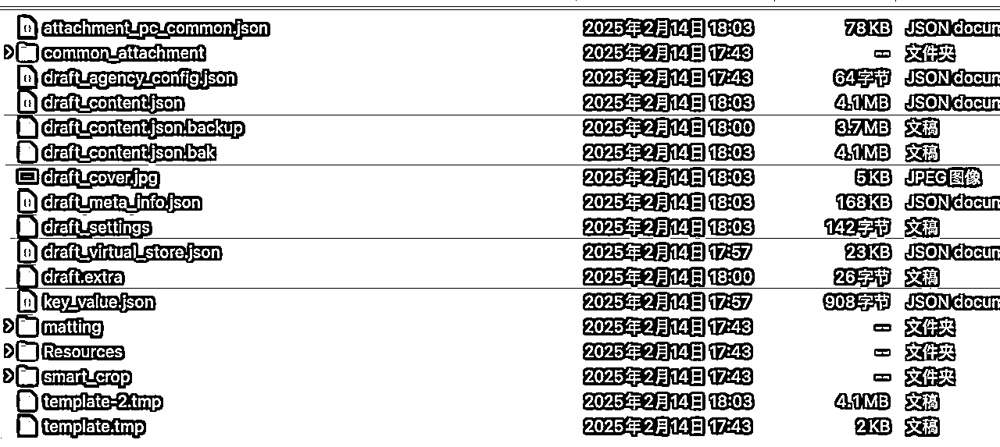

再经过和AI无限多次复制粘贴拉锯之后，

我发现draft_content.json 和 attachmeng_pc_common.json是最主要的两个文件

视频轨+音轨+特效轨几乎所有的东西 都在draft_content.json里

而程序识别生成的字幕，保存在attachmeng_pc_common.json里

所以我将上面的需求逻辑发给AI 让他根据这两个文件，来实现我的需求

下面这个脚本，我估计迭代了100多次，说起来很容易，但其实非常耗费心力

他的逻辑是这样的

我先新建一个草稿

将MP3放进去 然后用剪映的匹配文稿功能生成字幕 然后将之前出图脚本生成的所有图片全部拖进去

最后退出草稿，运行下面这个脚本

```
import os
import json
import uuid
import random
import base64
from glob import glob
from datetime import datetime

# 最小图片展示时间（秒）
MIN_IMAGE_DURATION = 5  # 5秒

def get_latest_draft_folder():
    """
    获取最新的剪映草稿文件夹

    Returns:
        最新草稿文件夹的路径
    """
    # 剪映草稿文件夹路径模式（根据实际位置调整）
    draft_pattern = os.path.expanduser("~/Desktop/Youtube/剪映draft/JianyingPro Drafts/*/draft_content.json")

    # 获取所有草稿文件
    draft_files = glob(draft_pattern)

    if not draft_files:
        raise Exception("未找到剪映草稿文件")

    # 按修改时间排序，获取最新的
    latest_draft_file = max(draft_files, key=os.path.getmtime)

    # 返回包含draft_content.json的文件夹路径
    latest_draft_folder = os.path.dirname(latest_draft_file)

    return latest_draft_folder

def microsec_to_time(microseconds):
    """将微秒转换为时间字符串(MM:SS:MS)"""
    # 剪映中的时间单位是微秒
    total_seconds = microseconds / 1000000
    minutes = int(total_seconds // 60)
    seconds = int(total_seconds % 60)
    ms = int((total_seconds % 1) * 1000)
    return f"{minutes:02d}:{seconds:02d}:{ms:03d}"

def format_duration(microseconds):
    """格式化持续时间为秒"""
    return f"{microseconds/1000000:.2f}秒"

def find_images_in_folder(folder_path=None):
    """
    在指定文件夹中查找图片文件

    Args:
        folder_path: 图片文件夹路径，如果为None，则使用默认路径

    Returns:
        图片文件路径列表
    """
    if folder_path is None:
        # 默认在桌面上查找图片文件夹
        folder_path = os.path.expanduser("~/Desktop/Youtube/images")

    # 支持的图片格式
    image_extensions = ['jpg', 'jpeg', 'png', 'gif', 'webp']

    # 查找所有图片文件
    image_files = []
    for ext in image_extensions:
        pattern = os.path.join(folder_path, f"*.{ext}")
        image_files.extend(glob(pattern))

    if not image_files:
        # 如果没有找到图片，尝试在当前目录查找
        current_folder = os.path.dirname(os.path.abspath(__file__))
        for ext in image_extensions:
            pattern = os.path.join(current_folder, f"*.{ext}")
            image_files.extend(glob(pattern))

    if not image_files:
        raise Exception(f"未找到图片文件，请确保图片文件夹中包含图片")

    return image_files

def import_images_to_draft(draft, image_files):
    """
    将图片导入到草稿中

    Args:
        draft: 剪映草稿JSON对象
        image_files: 图片文件路径列表

    Returns:
        更新后的草稿JSON对象，以及导入的图片材料列表
    """
    # 确保materials中有videos键
    if 'materials' not in draft:
        draft['materials'] = {}

    if 'videos' not in draft['materials']:
        draft['materials']['videos'] = []

    # 导入图片
    for image_file in image_files:
        # 生成唯一ID
        image_id = str(uuid.uuid4())

        # 获取文件名（不包含扩展名）
        file_name = os.path.basename(image_file)
        name, _ = os.path.splitext(file_name)

        # 创建图片材料（作为视频材料存储）
        image_material = {
            "aigc_type": "none",
            "audio_fade": None,
            "cartoon_path": "",
            "category_id": "",
            "category_name": "",
            "check_flag": 63487,
            "crop": {
                "lower_left_x": 0.0,
                "lower_left_y": 1.0,
                "lower_right_x": 1.0,
                "lower_right_y": 1.0,
                "upper_left_x": 0.0,
                "upper_left_y": 0.0,
                "upper_right_x": 1.0,
                "upper_right_y": 0.0
            },
            "crop_ratio": "free",
            "crop_scale": 1.0,
            "duration": 10800000000,
            "extra_type_option": 0,
            "formula_id": "",
            "freeze": None,
            "has_audio": False,
            "height": 1080,
            "id": image_id,
            "intensifies_audio_path": "",
            "intensifies_path": "",
            "is_ai_generate_content": False,
            "is_copyright": False,
            "is_text_edit_overdub": False,
            "is_unified_beauty_mode": False,
            "local_id": "",
            "local_material_id": "",
            "material_id": "",
            "material_name": file_name,
            "material_url": "",
            "matting": {
                "flag": 0,
                "has_use_quick_brush": False,
                "has_use_quick_eraser": False,
                "interactiveTime": [],
                "path": "",
                "strokes": []
            },
            "media_path": "",
            "object_locked": None,
            "origin_material_id": "",
            "path": image_file,
            "picture_from": "none",
            "picture_set_category_id": "",
            "picture_set_category_name": "",
            "request_id": "",
            "reverse_intensifies_path": "",
            "reverse_path": "",
            "smart_motion": None,
            "source": 0,
            "source_platform": 0,
            "stable": {
                "matrix_path": "",
                "stable_level": 0,
                "time_range": {
                    "duration": 0,
                    "start": 0
                }
            },
            "team_id": "",
            "type": "photo",
            "video_algorithm": {
                "algorithms": [],
                "complement_frame_config": None,
                "deflicker": None,
                "gameplay_configs": [],
                "motion_blur_config": None,
                "noise_reduction": None,
                "path": "",
                "quality_enhance": None,
                "time_range": None
            },
            "width": 1920
        }

        # 添加到草稿中
        draft['materials']['videos'].append(image_material)

    print(f"已导入 {len(image_files)} 个图片到草稿")
    return draft

def create_common_keyframes(start_time, duration, movement_type=None):
    """创建关键帧数据"""
    if movement_type is None:
        movement_type = random.choice(['left', 'right', 'up', 'down'])

    if movement_type in ['left', 'right']:
        # X轴移动，Y轴保持0
        x_start = -0.21 if movement_type == 'left' else 0.21
        x_end = -x_start  # 反向移动
        return [
            {
                "id": str(uuid.uuid4()),
                "keyframe_list": [
                    {"time_offset": 0, "values": [x_start]},
                    {"time_offset": duration, "values": [x_end]}
                ],
                "property_type": "KFTypePositionX"
            },
            {
                "id": str(uuid.uuid4()),
                "keyframe_list": [
                    {"time_offset": 0, "values": [0]},
                    {"time_offset": duration, "values": [0]}
                ],
                "property_type": "KFTypePositionY"
            }
        ]
    else:
        # Y轴移动，X轴保持0
        y_start = -0.21 if movement_type == 'up' else 0.21
        y_end = -y_start  # 反向移动
        return [
            {
                "id": str(uuid.uuid4()),
                "keyframe_list": [
                    {"time_offset": 0, "values": [0]},
                    {"time_offset": duration, "values": [0]}
                ],
                "property_type": "KFTypePositionX"
            },
            {
                "id": str(uuid.uuid4()),
                "keyframe_list": [
                    {"time_offset": 0, "values": [y_start]},
                    {"time_offset": duration, "values": [y_end]}
                ],
                "property_type": "KFTypePositionY"
            }
        ]

def create_fade_animation():
    """创建渐显动画"""
    animation_id = str(uuid.uuid4())
    request_id = datetime.now().strftime("%Y%m%d%H%M%S") + str(uuid.uuid4())[:8].upper()
    return {
        "animations": [
            {
                "anim_adjust_params": None,
                "category_id": "in",
                "category_name": "入场",
                "duration": 700000,  # 0.7秒
                "id": "624705",
                "material_type": "video",
                "name": "渐显",
                "panel": "video",
                "path": "/Users/a47/Library/Containers/com.lemon.lvpro/Data/Movies/JianyingPro/User Data/Cache/effect/624705/00162fa64b6f03d941fea852a0054bc7",
                "platform": "all",
                "request_id": request_id,
                "resource_id": "6798320778182922760",
                "start": 0,
                "type": "in"
            }
        ],
        "id": animation_id,
        "type": "sticker_animation"
    }

def create_scale_animation():
    """创建缩放动画（向右甩入）"""
    animation_id = str(uuid.uuid4())
    request_id = datetime.now().strftime("%Y%m%d%H%M%S") + str(uuid.uuid4())[:8].upper()
    return {
        "animations": [
            {
                "anim_adjust_params": None,
                "category_id": "in",
                "category_name": "入场",
                "duration": 700000,
                "id": "431636",
                "material_type": "video",
                "name": "向右甩入",
                "panel": "video",
                "path": "/Users/a47/Library/Containers/com.lemon.lvpro/Data/Movies/JianyingPro/User Data/Cache/effect/431636/c83f7d144853d115a9e8572e667c6bfe",
                "platform": "all",
                "request_id": request_id,
                "resource_id": "6739338727866241539",
                "start": 0,
                "type": "in"
            }
        ],
        "id": animation_id,
        "multi_language_current": "none",
        "type": "sticker_animation"
    }

def create_bounce_animation():
    """创建弹跳动画（向左滑动）"""
    animation_id = str(uuid.uuid4())
    request_id = datetime.now().strftime("%Y%m%d%H%M%S") + str(uuid.uuid4())[:8].upper()
    return {
        "animations": [
            {
                "anim_adjust_params": None,
                "category_id": "in",
                "category_name": "入场",
                "duration": 700000,
                "id": "624747",
                "material_type": "video",
                "name": "向左滑动",
                "panel": "video",
                "path": "/Users/a47/Library/Containers/com.lemon.lvpro/Data/Movies/JianyingPro/User Data/Cache/effect/624747/4f9fea978322067343df1b0fdb80798c",
                "platform": "all",
                "request_id": request_id,
                "resource_id": "6798332871267324423",
                "start": 0,
                "type": "in"
            }
        ],
        "id": animation_id,
        "multi_language_current": "none",
        "type": "sticker_animation"
    }

def create_wiper_animation():
    """创建雨刷动画"""
    animation_id = str(uuid.uuid4())
    request_id = datetime.now().strftime("%Y%m%d%H%M%S") + str(uuid.uuid4())[:8].upper()
    return {
        "animations": [
            {
                "anim_adjust_params": None,
                "category_id": "in",
                "category_name": "入场",
                "duration": 700000,
                "id": "640101",
                "material_type": "video",
                "name": "雨刷 II",
                "panel": "video",
                "path": "/Users/a47/Library/Containers/com.lemon.lvpro/Data/Movies/JianyingPro/User Data/Cache/effect/640101/1241565fd010e8221475def8ab1a2f57",
                "platform": "all",
                "request_id": request_id,
                "resource_id": "6805748897768542727",
                "start": 0,
                "type": "in"
            }
        ],
        "id": animation_id,
        "multi_language_current": "none",
        "type": "sticker_animation"
    }

def create_shake_animation():
    """创建抖动动画"""
    animation_id = str(uuid.uuid4())
    request_id = datetime.now().strftime("%Y%m%d%H%M%S") + str(uuid.uuid4())[:8].upper()
    return {
        "animations": [
            {
                "anim_adjust_params": None,
                "category_id": "in",
                "category_name": "入场",
                "duration": 700000,
                "id": "431654",
                "material_type": "video",
                "name": "左右抖动",
                "panel": "video",
                "path": "/Users/a47/Library/Containers/com.lemon.lvpro/Data/Movies/JianyingPro/User Data/Cache/effect/431654/267653b22765bd8348dda092f8de3cfe",
                "platform": "all",
                "request_id": request_id,
                "resource_id": "6739418540421419524",
                "start": 0,
                "type": "in"
            }
        ],
        "id": animation_id,
        "multi_language_current": "none",
        "type": "sticker_animation"
    }

def create_zoom_in_animation():
    """创建动感放大动画"""
    animation_id = str(uuid.uuid4())
    request_id = datetime.now().strftime("%Y%m%d%H%M%S") + str(uuid.uuid4())[:8].upper()
    return {
        "animations": [
            {
                "anim_adjust_params": None,
                "category_id": "in",
                "category_name": "入场",
                "duration": 500000,
                "id": "431662",
                "material_type": "video",
                "name": "动感放大",
                "panel": "video",
                "path": "/Users/a47/Library/Containers/com.lemon.lvpro/Data/Movies/JianyingPro/User Data/Cache/effect/431662/8fb560c01e4ccffbc4dc084f9c418838",
                "platform": "all",
                "request_id": request_id,
                "resource_id": "6740867832570974733",
                "start": 0,
                "type": "in"
            }
        ],
        "id": animation_id,
        "multi_language_current": "none",
        "type": "sticker_animation"
    }

def create_zoom_out_animation():
    """创建缩小动画"""
    animation_id = str(uuid.uuid4())
    request_id = datetime.now().strftime("%Y%m%d%H%M%S") + str(uuid.uuid4())[:8].upper()
    return {
        "animations": [
            {
                "anim_adjust_params": None,
                "category_id": "in",
                "category_name": "入场",
                "duration": 500000,
                "id": "624755",
                "material_type": "video",
                "name": "缩小",
                "panel": "video",
                "path": "/Users/a47/Library/Containers/com.lemon.lvpro/Data/Movies/JianyingPro/User Data/Cache/effect/624755/7cc60a6c2411194697a2b6e923844bca",
                "platform": "all",
                "request_id": request_id,
                "resource_id": "6798332584276267527",
                "start": 0,
                "type": "in"
            }
        ],
        "id": animation_id,
        "multi_language_current": "none",
        "type": "sticker_animation"
    }

def create_gentle_shake_animation():
    """创建轻微抖动动画"""
    animation_id = str(uuid.uuid4())
    request_id = datetime.now().strftime("%Y%m%d%H%M%S") + str(uuid.uuid4())[:8].upper()
    return {
        "animations": [
            {
                "anim_adjust_params": None,
                "category_id": "in",
                "category_name": "入场",
                "duration": 500000,
                "id": "431664",
                "material_type": "video",
                "name": "轻微抖动",
                "panel": "video",
                "path": "/Users/a47/Library/Containers/com.lemon.lvpro/Data/Movies/JianyingPro/User Data/Cache/effect/431664/944c5561f3d23baa068cee2bba4f15f5",
                "platform": "all",
                "request_id": request_id,
                "resource_id": "6739418227031413256",
                "start": 0,
                "type": "in"
            }
        ],
        "id": animation_id,
        "multi_language_current": "none",
        "type": "sticker_animation"
    }

def create_pendulum_animation():
    """创建钟摆动画"""
    animation_id = str(uuid.uuid4())
    request_id = datetime.now().strftime("%Y%m%d%H%M%S") + str(uuid.uuid4())[:8].upper()
    return {
        "animations": [
            {
                "anim_adjust_params": None,
                "category_id": "in",
                "category_name": "入场",
                "duration": 500000,
                "id": "636115",
                "material_type": "video",
                "name": "钟摆",
                "panel": "video",
                "path": "/Users/a47/Library/Containers/com.lemon.lvpro/Data/Movies/JianyingPro/User Data/Cache/effect/636115/fb435c67390b89386c35e8b84f50faba",
                "platform": "all",
                "request_id": request_id,
                "resource_id": "6803260897117606414",
                "start": 0,
                "type": "in"
            }
        ],
        "id": animation_id,
        "multi_language_current": "none",
        "type": "sticker_animation"
    }

def create_flip_in_animation():
    """创建翻入动画"""
    animation_id = str(uuid.uuid4())
    request_id = datetime.now().strftime("%Y%m%d%H%M%S") + str(uuid.uuid4())[:8].upper()
    return {
        "animations": [
            {
                "anim_adjust_params": None,
                "category_id": "in",
                "category_name": "入场",
                "duration": 1170000,
                "id": "98430529",
                "material_type": "video",
                "name": "翻入",
                "panel": "video",
                "path": "/Users/a47/Library/Containers/com.lemon.lvpro/Data/Movies/JianyingPro/User Data/Cache/effect/98430529/bd0a96cbfbb58eb67c5f4e86f537b858",
                "platform": "all",
                "request_id": request_id,
                "resource_id": "7452407076417966619",
                "start": 0,
                "type": "in"
            }
        ],
        "id": animation_id,
        "multi_language_current": "none",
        "type": "sticker_animation"
    }

# 全局变量，用于记录上一次使用的动画
last_animation = None

def get_random_animation():
    """随机选择一个动画效果，确保不会连续使用相同的动画"""
    global last_animation

    # 所有可用的动画效果函数列表
    animations = [
        create_fade_animation,
        create_scale_animation,
        create_bounce_animation,
        create_wiper_animation,
        create_shake_animation,
        create_zoom_in_animation,
        create_zoom_out_animation,
        create_gentle_shake_animation,
        create_pendulum_animation,
        create_flip_in_animation
    ]

    # 从列表中移除上一次使用的动画
    if last_animation and last_animation in animations:
        available_animations = [anim for anim in animations if anim != last_animation]
    else:
        available_animations = animations

    # 随机选择一个动画
    chosen_animation = random.choice(available_animations)
    last_animation = chosen_animation

    return chosen_animation()

def find_next_subtitle_time(subtitle_segments, current_start_time):
    """
    找到当前图片应该结束的时间点:
    1\. 先确定最早可能结束的时间点 = 当前开始时间 + 5秒
    2\. 然后找到在这个时间点之后的第一个字幕开始时间

    Args:
        subtitle_segments: 字幕片段列表
        current_start_time: 当前图片的开始时间（微秒）

    Returns:
        下一个字幕的开始时间，或者当前开始时间+5秒
    """
    min_possible_end = current_start_time + 5000000  # 当前图片最早可能结束的时间(5秒)

    print(f"当前图片开始时间: {microsec_to_time(current_start_time)}")
    print(f"当前图片最早可能结束时间(+5秒): {microsec_to_time(min_possible_end)}")

    # 找到第一个开始时间大于min_possible_end的字幕
    for subtitle in subtitle_segments:
        subtitle_start = subtitle['target_timerange']['start']
        if subtitle_start > min_possible_end:  # 只关心字幕的开始时间
            print(f"找到下一个字幕时间: {microsec_to_time(subtitle_start)}")
            return subtitle_start

    # 如果没找到合适的字幕,就用最小结束时间
    print(f"没找到更晚的字幕,使用最小结束时间: {microsec_to_time(min_possible_end)}")
    return min_possible_end

def add_effects_to_segment(segment):
    """
    为片段添加特效

    Args:
        segment: 片段对象

    Returns:
        更新后的片段对象
    """
    # 添加一些基本特效
    effects = [
        # 可以在这里添加其他特效ID
        "E312DFCC-91BF-47D1-831A-999CE06AF820",  # 速度特效
        "BAE4FFEE-2A02-4D91-9C10-1CFA0B5A9FA7"   # 画布特效
    ]

    # 添加特效引用
    segment["extra_material_refs"] = effects

    return segment

def create_star_effect():
    """创建星火特效"""
    effect_id = str(uuid.uuid4())
    return {
        "adjust_params": [
            {"default_value": 0.33, "name": "effects_adjust_speed", "value": 0.33},
            {"default_value": 1.0, "name": "effects_adjust_background_animation", "value": 1.0}
        ],
        "algorithm_artifact_path": "",
        "apply_target_type": 2,
        "apply_time_range": None,
        "category_id": "39654",
        "category_name": "热门",
        "common_keyframes": [],
        "disable_effect_faces": [],
        "effect_id": "634103",
        "formula_id": "",
        "id": effect_id,
        "name": "星火",
        "path": "/Users/a47/Library/Containers/com.lemon.lvpro/Data/Movies/JianyingPro/User Data/Cache/effect/634103/c2811a4bdeb4394ae95f3aa9875dc4dc",
        "platform": "all",
        "render_index": 0,
        "request_id": "",
        "resource_id": "6715209198109463054",
        "source_platform": 0,
        "time_range": None,
        "track_render_index": 0,
        "type": "video_effect",
        "value": 1.0,
        "version": ""
    }

def create_firefly_effect():
    """创建萤火特效"""
    effect_id = str(uuid.uuid4())
    return {
        "adjust_params": [
            {"default_value": 0.33, "name": "effects_adjust_speed", "value": 0.33},
            {"default_value": 1.0, "name": "effects_adjust_background_animation", "value": 1.0}
        ],
        "algorithm_artifact_path": "",
        "apply_target_type": 2,
        "apply_time_range": None,
        "category_id": "39654",
        "category_name": "热门",
        "common_keyframes": [],
        "disable_effect_faces": [],
        "effect_id": "1357502",
        "formula_id": "",
        "id": effect_id,
        "name": "萤火",
        "path": "/Users/a47/Library/Containers/com.lemon.lvpro/Data/Movies/JianyingPro/User Data/Cache/effect/1357502/d473ca7fa127312a7651ec1523a6e880",
        "platform": "all",
        "render_index": 0,
        "request_id": "",
        "resource_id": "7006265184050221576",
        "source_platform": 0,
        "time_range": None,
        "track_render_index": 0,
        "type": "video_effect",
        "value": 1.0,
        "version": ""
    }

def create_gold_dust_effect():
    """创建金粉闪闪特效"""
    effect_id = str(uuid.uuid4())
    request_id = datetime.now().strftime("%Y%m%d%H%M%S") + str(uuid.uuid4())[:8].upper()
    return {
        "adjust_params": [
            {"default_value": 0.3361999988555908, "name": "effects_adjust_speed", "value": 0.3361999988555908},
            {"default_value": 0.5, "name": "effects_adjust_filter", "value": 0.5},
            {"default_value": 1.0, "name": "effects_adjust_background_animation", "value": 1.0}
        ],
        "algorithm_artifact_path": "",
        "apply_target_type": 2,
        "apply_time_range": None,
        "category_id": "107",
        "category_name": "收藏",
        "common_keyframes": [],
        "disable_effect_faces": [],
        "effect_id": "1453820",
        "formula_id": "",
        "id": effect_id,
        "name": "金粉闪闪",
        "path": "/Users/a47/Library/Containers/com.lemon.lvpro/Data/Movies/JianyingPro/User Data/Cache/effect/1453820/a552dfa820b5aba27e4f09e3d83b8643",
        "platform": "all",
        "render_index": 0,
        "request_id": request_id,
        "resource_id": "7034048554318434830",
        "source_platform": 0,
        "time_range": None,
        "track_render_index": 0,
        "type": "video_effect",
        "value": 1.0,
        "version": ""
    }

def add_effect_track(draft, segments):
    """添加特效轨道"""
    # 创建特效轨道
    effect_track = {
        "attribute": 0,
        "flag": 0,
        "id": str(uuid.uuid4()),
        "is_default_name": True,
        "name": "",
        "segments": [],
        "type": "effect"
    }

    # 为每个视频片段创建对应的特效
    for i, segment in enumerate(segments):
        start_time = segment['target_timerange']['start']
        duration = segment['target_timerange']['duration']

        # 随机选择一个特效
        effect_funcs = [create_star_effect, create_firefly_effect, create_gold_dust_effect]
        effect = random.choice(effect_funcs)()

        # 添加特效到materials
        if 'video_effects' not in draft['materials']:
            draft['materials']['video_effects'] = []
        draft['materials']['video_effects'].append(effect)

        # 创建特效片段
        effect_segment = {
            "caption_info": None,
            "cartoon": False,
            "clip": None,
            "common_keyframes": [],
            "enable_adjust": False,
            "enable_color_curves": True,
            "enable_color_match_adjust": False,
            "enable_color_wheels": True,
            "enable_lut": False,
            "enable_smart_color_adjust": False,
            "extra_material_refs": [],
            "group_id": "",
            "id": str(uuid.uuid4()),
            "intensifies_audio": False,
            "is_placeholder": False,
            "is_tone_modify": False,
            "keyframe_refs": [],
            "last_nonzero_volume": 1.0,
            "material_id": effect['id'],
            "render_index": 11000 + i,
            "responsive_layout": {
                "enable": False,
                "horizontal_pos_layout": 0,
                "size_layout": 0,
                "target_follow": "",
                "vertical_pos_layout": 0
            },
            "reverse": False,
            "source_timerange": None,
            "speed": 1.0,
            "target_timerange": {
                "duration": duration,
                "start": start_time
            },
            "template_id": "",
            "template_scene": "default",
            "track_attribute": 0,
            "track_render_index": 1,
            "uniform_scale": None,
            "visible": True,
            "volume": 1.0
        }
        effect_track['segments'].append(effect_segment)

    return effect_track

def sync_images_with_subtitles_in_draft(draft):
    """
    在草稿中将图片与字幕同步

    Args:
        draft: 剪映草稿JSON对象

    Returns:
        更新后的草稿JSON对象
    """
    # 查找文本轨道
    text_track = None
    for track in draft.get('tracks', []):
        if track.get('type') == 'text':
            text_track = track
            print("找到text轨道")
            break

    if not text_track:
        print("未找到text轨道，无法同步图片与字幕")
        return draft

    # 获取所有字幕片段
    subtitle_segments = text_track.get('segments', [])
    print(f"找到 {len(subtitle_segments)} 个字幕片段")

    # 打印字幕时间范围
    print("字幕时间范围:")
    for i, subtitle in enumerate(subtitle_segments):
        subtitle_start = subtitle['target_timerange']['start']
        subtitle_end = subtitle_start + subtitle['target_timerange']['duration']
        subtitle_duration = subtitle['target_timerange']['duration'] / 1000000
        print(f"  字幕 {i}: 开始={microsec_to_time(subtitle_start)}, 结束={microsec_to_time(subtitle_end)}, 持续={subtitle_duration:.2f}秒秒")

    # 查找图片轨道
    image_track = None
    for track in draft.get('tracks', []):
        if track.get('type') == 'video':
            # 检查是否有图片材料
            has_image = False
            for segment in track.get('segments', []):
                material_id = segment.get('material_id', '')
                material = None
                for mat in draft.get('materials', {}).get('videos', []):
                    if mat.get('id') == material_id:
                        material = mat
                        break

                # 在剪映中，图片类型可能是'photo'或'image'
                if material and (material.get('type') == 'photo' or material.get('type') == 'image'):
                    has_image = True
                    break

            if has_image:
                image_track = track
                print("使用现有的图片轨道")
                break

    if not image_track:
        # 创建新的图片轨道
        image_track = {
            "attribute": 0,
            "flag": 0,
            "id": str(uuid.uuid4()),
            "is_default_name": True,
            "name": "",
            "segments": [],
            "type": "video"
        }
        draft['tracks'].append(image_track)
        print("创建了新的图片轨道")

    # 获取所有图片材料 - 在剪映中，图片类型是'photo'或'image'
    image_materials = []
    for video in draft.get('materials', {}).get('videos', []):
        if video.get('type') == 'photo' or video.get('type') == 'image':
            image_materials.append(video)

    print(f"找到 {len(image_materials)} 个图片材料")

    # 如果没有找到图片材料，创建一个默认的图片材料
    if not image_materials:
        print("未找到图片材料，将创建默认图片材料")
        # 创建一个默认的图片材料
        default_image_id = str(uuid.uuid4())
        default_image = {
            "duration": 10800000000,  # 使用与剪映草稿中相同的默认持续时间
            "height": 1080,
            "id": default_image_id,
            "local_material_id": default_image_id,
            "material_name": "默认图片",
            "path": "",  # 这里应该填入一个实际的图片路径，但我们暂时留空
            "type": "photo",  # 使用'photo'类型与剪映一致
            "width": 1920
        }

        # 添加到materials
        if 'materials' not in draft:
            draft['materials'] = {}
        if 'videos' not in draft['materials']:
            draft['materials']['videos'] = []

        draft['materials']['videos'].append(default_image)
        image_materials.append(default_image)
        print("已创建默认图片材料")

    if len(image_materials) < len(subtitle_segments):
        print(f"警告: 图片数量({len(image_materials)})少于字幕数量({len(subtitle_segments)})")

    # 清空图片轨道的片段
    image_track['segments'] = []

    # 确保 materials 中有 material_animations 列表
    if 'materials' not in draft:
        draft['materials'] = {}
    if 'material_animations' not in draft['materials']:
        draft['materials']['material_animations'] = []

    # 按照字幕顺序创建图片片段
    last_end_time = 0  # 第一张图片从0开始
    created_segments = []

    for i in range(len(subtitle_segments)):
        # 当前图片的开始时间就是上一张图片的结束时间
        start_time = last_end_time

        # 找到这张图片应该结束的时间
        # 必须是某个字幕的开始时间,且至少要在start_time+5秒之后
        end_time = find_next_subtitle_time(subtitle_segments, start_time)

        print(f"\n当前图片开始时间: {microsec_to_time(start_time)}")
        print(f"当前图片最早可能结束时间(+5秒): {microsec_to_time(start_time + 5000000)}")
        print(f"找到下一个字幕时间: {microsec_to_time(end_time)}")

        # 计算持续时间
        duration = end_time - start_time

        # 选择图片材料 (如果图片不够，则循环使用)
        image_index = i % len(image_materials)
        image_material = image_materials[image_index]

        print(f"\n图片 {i}:")
        print(f"开始时间: {microsec_to_time(start_time)}")
        print(f"结束时间: {microsec_to_time(end_time)}")
        print(f"持续时间: {duration / 1000000:.2f}秒秒")
        print(f"对应字幕: {microsec_to_time(start_time)} - {microsec_to_time(end_time)}")

        # 创建图片片段
        image_segment = {
            "cartoon": False,
            "clip": {
                "alpha": 1.0,
                "flip": {"horizontal": False, "vertical": False},
                "rotation": 0.0,
                "scale": {"x": 1.25, "y": 1.25},  # 使用1.25的缩放比例，与英语字幕对齐.py一致
                "transform": {"x": 0.0, "y": 0.0}
            },
            "common_keyframes": [],
            "enable_adjust": False,
            "enable_color_curves": True,
            "enable_color_wheels": True,
            "extra_material_refs": [],
            "group_id": "",
            "id": str(uuid.uuid4()),
            "intensifies_audio": False,
            "is_placeholder": False,
            "material_id": image_material['id'],
            "render_index": i,
            "source_timerange": {
                "duration": duration,
                "start": 0
            },
            "speed": 1.0,
            "target_timerange": {
                "duration": duration,
                "start": start_time
            },
            "template_id": "",
            "template_scene": "default",
            "track_attribute": 0,
            "track_render_index": 0,
            "uniform_scale": {"on": True, "value": 1.0},
            "visible": True,
            "volume": 1.0
        }

        # 创建随机动画效果
        animation = get_random_animation()
        draft['materials']['material_animations'].append(animation)

        # 添加动画引用到 extra_material_refs
        image_segment['extra_material_refs'].append(animation['id'])

        # 设置关键帧
        image_segment['common_keyframes'] = create_common_keyframes(start_time, duration)

        # 添加到图片轨道
        image_track['segments'].append(image_segment)
        created_segments.append(image_segment)

        # 更新下一张图片的开始时间
        last_end_time = end_time

    # 添加特效轨道
    effect_track = add_effect_track(draft, created_segments)
    draft['tracks'].append(effect_track)

    print(f"已添加 {len(created_segments)} 个图片片段，并应用了关键帧和特效")
    return draft

def process_draft_automatically():
    """
    自动处理最新的剪映草稿，同步图片与字幕

    Returns:
        None
    """
    try:
        # 获取最新的草稿文件夹
        latest_draft_folder = get_latest_draft_folder()
        print(f"找到最新草稿文件夹: {latest_draft_folder}")

        # 读取draft_content.json
        draft_content_path = os.path.join(latest_draft_folder, 'draft_content.json')
        with open(draft_content_path, 'r', encoding='utf-8') as f:
            draft = json.load(f)

        # 同步图片与字幕
        draft = sync_images_with_subtitles_in_draft(draft)

        # 保存修改后的draft_content.json
        with open(draft_content_path, 'w', encoding='utf-8') as f:
            json.dump(draft, f, ensure_ascii=False)

        print(f"成功将图片与字幕同步到草稿: {latest_draft_folder}")

    except Exception as e:
        print(f"处理草稿时出错: {str(e)}")

if __name__ == "__main__":
    # 直接处理草稿，不需要用户输入
    process_draft_automatically()
```

然后一切就都搞定了，只需要1秒

不管里面有多少图片，多长的文本，只需要1秒

所有的图片都严丝合缝的和字幕匹配，并且全部随机实现了关键帧 加入了转场和一些特效，

只需要1秒，我从前几个小时才能做好的东西，他只需要1秒

1秒

* * *

# 五：生财“术”之五：成本核算

在上面的四条都搞定之后，你应该已经解放了大部份或者绝大部分的工时

这个时候，就要开始计算成本了

什么成本？

时间成本、经营成本

## 核算时间成本

这是什么意思？就是计算你每天的时间投入到了哪里，

这非常重要，时间成本决定一切，

只有你先算了时间成本，才能知道你在什么地方花费了时间，你才能知道你该在哪些地方迭代节省时间，

毕竟你可能家财万贯，但你的时间，一天最多就只能有24小时

时间，就是每个人最宝贵的财富

核算时间成本的核心问题就是，你的时间还有没有优化空间？

我参加了这次YouTube的航海，惭愧暂列榜单第一，我贴几个我航海的日志截图

感兴趣的可以去搜下我的日志，看下我每天的迭代记录https://scys.com/activity/landing/5122?tabIndex=1

我的日志里，基本每天都是在和时间成本做斗争，做压缩，做优化


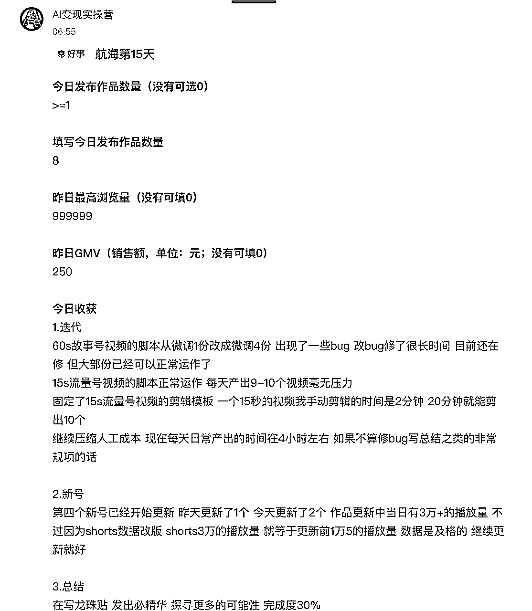

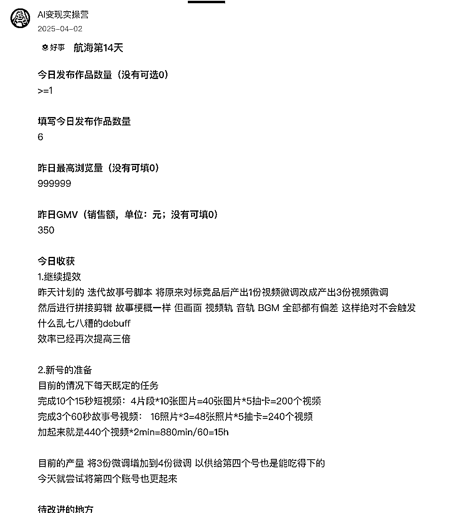

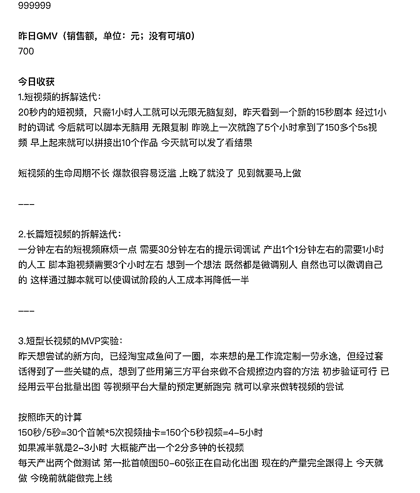

在我实现上面的脚本之前，我每天要花将近10个小时的时间来做视频，

在我实现上面的脚本之后，我每天只需要半个小时就行了，

但这是我迭代了半个月，迭代了几十上百次的结果，在最终形态完成之前，我还是需要很多时间的，

比如说，今天修脚本的bug花了3个小时，

比如说在剪辑自动化实现之前，我需要3个小时来进行剪辑，

这么长的时间，有优化空间吗？你要问自己

如果你知道怎么优化，你就优化，如果你不知道，你就要去请教高人，去问AI，去Google

不管你干什么行业，这都是核心中的核心

## 核算经营成本

在算时间成本之后，就要算经营成本，

也就是说，你做一件事，除了时间外，你还有多少成本，

这决定了你今后的扩张方向，和能承受的投资限度，

比如说，我按上面脚本做一个15分钟的YouTube长视频，需要的成本是3-5块RMB，其中：

1.  出图花费大概1-3块RMB

1.  语音转换大概2-4块RMB

这也就是为什么我第一个YouTube账号是在11月1号启动的

但第二个和第三个YouTube号是在12月才启动

这一个月我干什么去了？我1是在做提效脚本 我2是在做成本核算

在我将脚本完成后 我的时间成本已经完全解放 成本已经完全清晰

核算了经营成本后 一个视频只需5块钱 所以我就接连开了两个账号 每天只需要15-20块钱

这个成本我完全可以接受，所以我接连开了两个号，

如果这两个号也ok，我就完全可以继续扩张成10个号20个号，成立工作室，营业执照我都搞好了

这个钱被我压得很低，所以看上去没什么重要的，

但如果你做的买卖需要15万-20万呢？这一步计算就必须要做，

# 六：总结一下

上面的五点，就是我的做事心法

1.  选择兴趣

1.  抄出mvp

1.  具象需求

1.  实现增效

1.  核算成本和扩张

要我说，我文章里列出的代码除了消耗了我很多的时间外，其实并没有什么价值，

最重要的最有价值的，其实是上面这5点，因为不管我干什么，我都会按照这个路数来做，

我活下去的成功率，终究会比乱撞要高很多。

除了上面这5点外，还有一个最不起眼但同时也最重要的点，

“先把东西发出来，然后不要停止迭代的脚步。”

哪怕你最开始做出来的东西糙的像垃圾，你也必须做出来，

逼着你自己，把东西做出来，

持续不断的，把东西做出来，

然后不停的具象化你的需求，不停的迭代提效，不停的缩短你的时间成本，不停的降低你的经营成本

不停的做，不停的迭代，不停的压缩直到极限，

人活着，就是这点事

你看攻略1000遍，不如你实际做一次

* * *

# 七：关于Shorts的自动化

我在25年2月26才发了第一个shorts


它只是我N多尝试中的一个，我尝试过的东西有很多，能成的并不多，

即便我做了很多尝试、很多总结复盘，但失败仍然是常态，成功只是偶然中的偶然，

这很正常，不停的尝试，不停的迭代，不要停下前进的脚步

运气是一种硬实力，他只会降临在准备足够的人身上

在我做了Shorts之后，我还是按我自己的做事心法，又重新走了一遍上面的12345，

直到现在，我还在不停的迭代提效，你们可以从我上面的航海日志中看到我每天都干了些什么，

但这次的提效规模，比以往任何一次都大型的多，

这也不难理解，因为我每次都比上一次进步的多

看过我日志的人都知道，我现在一个人的产量：

1.  每天产出400个5s的AI视频（单账号理论极限是800个）

1.  可组合出10个左右的15秒AI视频+4个60秒的AI视频

1.  4个号日更2-3个作品

1.  每天只需花费人工时间3-4个小时

我不知道高人们是怎样的产量，但就我个人来说，

半个月前，我1天只能产出两三个15秒的AI视频，而且要花我一整天，

半个月后，已经能达成这样的产量，我觉得实在堪称工业奇迹

你要知道，我一行代码也不会写

Shorts的脚本太大，有几万行代码，每天都在不停的迭代，而且还跨好几个py，连我自己还都不知道该怎么分享，所以我只把流程列出来，会做的人，很容易就会复刻，而且一定比我这个码盲做得好

首先，做shorts 一定有对标的视频，至于对标的选择，真的没有那么多讲究

你就一直刷，看到能做的就点赞，点进tag里去看，最近半个月爆的多，就是能做，

在走通之前，最重要的事不是没完没了的判断，

而是赶紧发几个出来，行你就行了，不行你自己就知道换了，

你没有亏吃，失败也没什么大不了的

* * *

下面是我的脚本流程和截图：

## 下载对标

视频下载，输入对标的链接点击下载就能下

下载完成后或者本地有要处理的视频，就点击提取帧

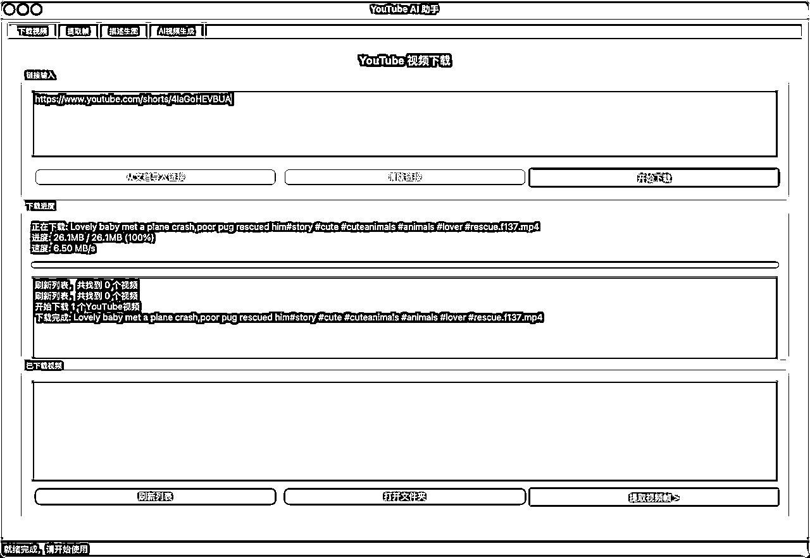

## 选择帧

每个视频，都是片段拼接而成，所以设定一个阈值，把所有帧提取出来就行了，

为了看得清楚点，我还做了hover展示大图的功能

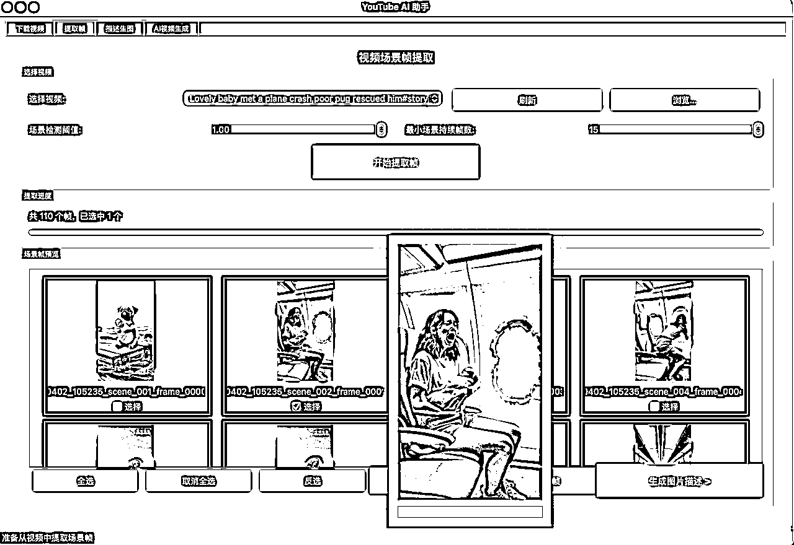

## 微调描述生成图片

在选好帧之后，所有帧就都列出来了，这时点击生成所有图片描述，程序就会将所有图片发送给GPT生成描述


在生成描述后，先点击一键修改描述，这样就会让GPT把描述批量的改了，比如把猫变成狗，男人变成女人

这样就批量完成了帧的微调

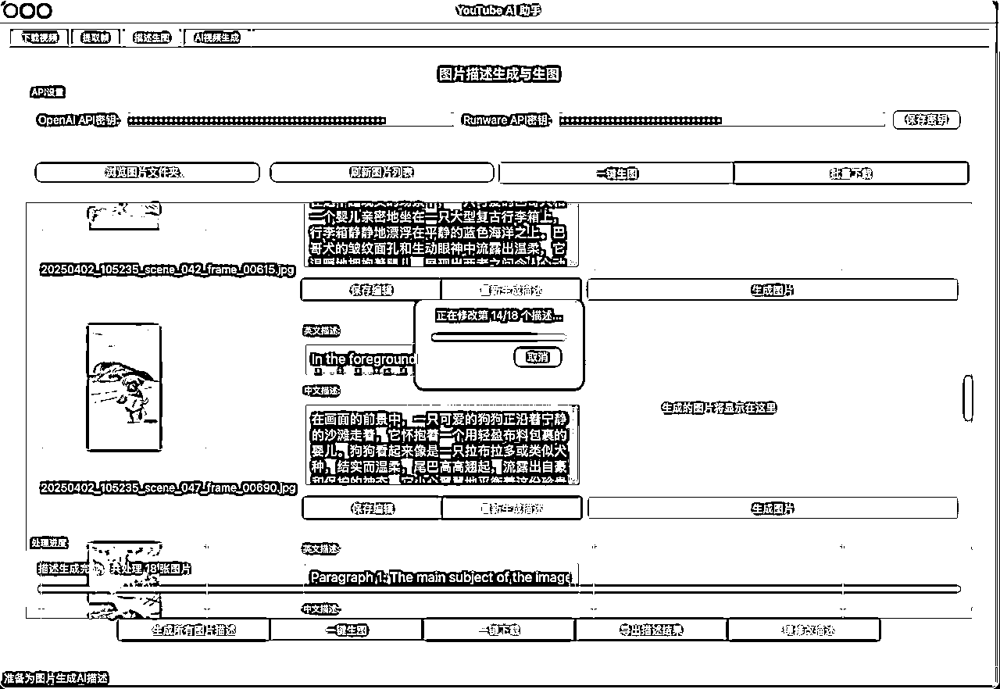

当然你也可以单独对某一张图片进行微调


## 开始抽卡

词对了以后，你就可以点击生成图片，你可以看到下面右侧区域的图，和左侧原图，微调的已经非常到位了

然后你觉得图片合适 你就点击选择它


## 开始转视频

在你选择完想要的图片之后，进入tab4，你就能在这里填入提示词，这个tab，就是提交给AI图转视频的准备页面，他会将你填入的提示词和目标图片发送给AI视频软件

你可以每张图要生成的数量，然后点击生成视频，然后你就可以什么都不用管了，视频就会按计划不停的出

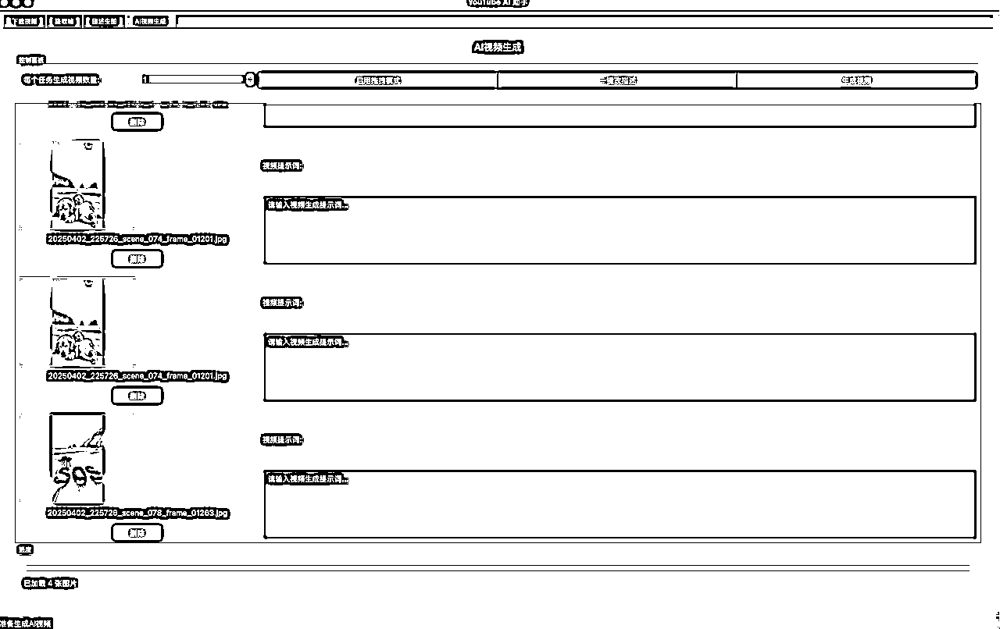

当前脚本设置的AI视频的生成速度，1个5秒的视频，两分钟就能出，

这个脚本是我每天产量这么大的核心理由，

虽然看起来很简单，但从计划、实现、迭代，我花了将近半个月的时间，做到现在仍然有一些bug，但这对我来说，已经足够好用了

* * *

# 八：写在最后

最后用几张图来结束吧 这两张图是我每天都会没完没了的用AI编程迭代的缩影

你看得懂吗？看得懂你自然是棒的，但如果你看不懂，也真没什么大不了的

因为我很多也看不懂

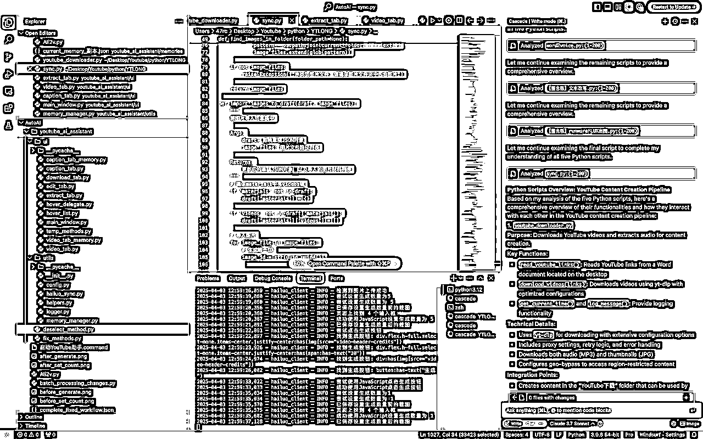

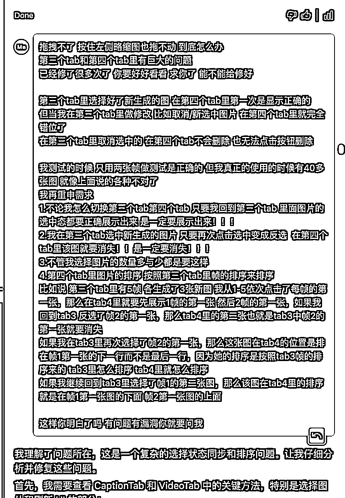

* * *

你只需要知道

半个月前，我需要工作一天才能产出一点点可怜的东西

半个月后，我只需要两三个小时，就能产出百倍以上的产量

你可以不会一行代码，你可以不懂任何英文

这就是AI编程全民平权的工业革命

如果你觉得这样还不够奇迹，还懒得尝试

那就随你，你说的都对