# 养成系学AI的经历：0代码基础，我是如何build in public，用AI提效和变现的？

> 来源：[https://shengcaiyoushu01.feishu.cn/docx/Gbj5dHks7oUcoxxzX3RcDHIYnig](https://shengcaiyoushu01.feishu.cn/docx/Gbj5dHks7oUcoxxzX3RcDHIYnig)

大家好，我是生财内容负责人七天，也是学习AI的练习生七天可AI多，好久没分享我学习AI的日常了。

最近回溯了一些从4月份开启AI传术师俱乐部的运营，伴随着也开启了我从一个小白学AI的历程。一开始要接AI传术师的时候我还有一些惶恐，担心自己是AI新手，很难跟AI高手们同台对话。

到上周二，我做出了第一个网页页面，也就是html，不少人在朋友圈给我点赞。说实话成就感还是非常非常强的。

先给大家展示下：


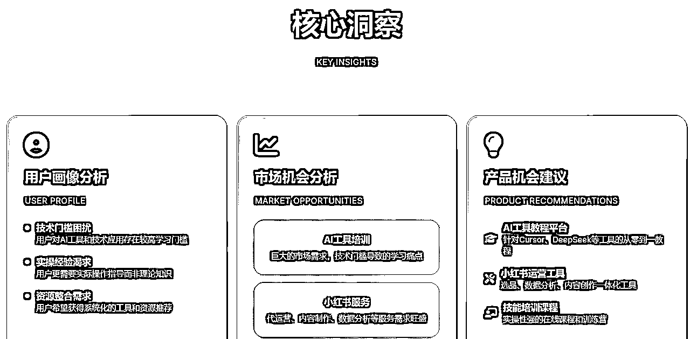

但是到现在有很多AI相关的术语我还不是很理解。我在下载cursor的时候还在问IDE是什么，然后dhj就跟我说你别管他是什么，你只要知道在这里能运营claude code就可以了。

所以这就是我学习AI和AI编程的路子：一边学，一边问，一边实操，一边懵懂。

事实证明你确实不需要完全理解他，你有什么不懂的问AI就好了。

我问技术：如何部署一个网站？他说问AI，然后直接演示在gpt的对话窗口问如何部署。

我问SCAI小伙伴：如何做一个页面网站？她说问AI，让她给你做。

在这个过程中我最大的思维突破是：AI不是你的工具，而是你最好的老师。正如小排老师提到的：不是万事不决问AI，而是万事问AI。

我学习AI的方式就是找师傅，抱大腿。比如我们办公室的知行和瓜斯，SCAI实验室的dhj，大潘都很擅长。其实即便你身边没有，生财线上也有很多。

我先简单概述下自己学AI的历程，给大家呈现下一个小白从完全不懂AI到做出第一个作品的过程。

我先告诉你的是：只要突破了心力卡点，剩下的一切问题都可以“被解决”。

*   2月初我开始思考自己的业务应该如何跟AI做结合，因为我完全没有技术和产品背景，我突然想到盖哥提到自己在做AI赋能IP，就想到了自己可以做一个养成系的社群，分享自己看到的AI信息差（没错刚开始能做的价值就是分享生财AI信息差）

*   2月中旬我做了一个AI+IP的成长社群，入群的有150人，19.9/月，199/年，完成首个AI业务变现7000+

*   3月份我的这个文档成为了养成系IP的航海雏形，被欢欢和亦仁看到后放大，我也荣幸解锁了新身份：航海教练。


*   3月31日参加了航海家大会，被包子老师的AI+IP业务震撼，为后来学习课程埋下伏笔，也分享了我对AI的思考：https://scys.com/articleDetail/xq_topic/5125212112141854

*   4月2日正式开启AI传术师俱乐部的招募，在即刻和公众号邀请了几十位AI高手。

*   5月18日我上了2天包子老师的课，第一次做出来了用RPA抓取小红书资讯，以及第一次尝试做出了一个coze工作流。


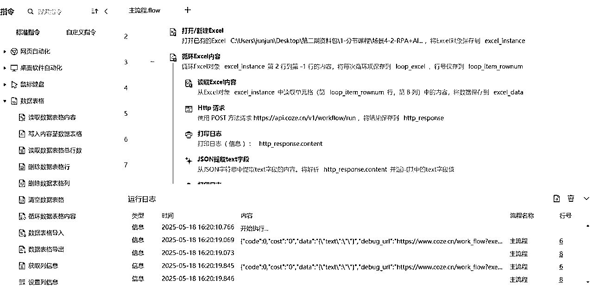

*   5月~6月主要开始沉淀做生财内容的标准，沉淀了公众号/精华帖评选标准/朋友圈标准。通过建立标准，又在gpt上做了精华帖评选的流程。目前我们团队的伙伴也在用我沉淀的标准文档投喂gpt，来做辅助评选了。

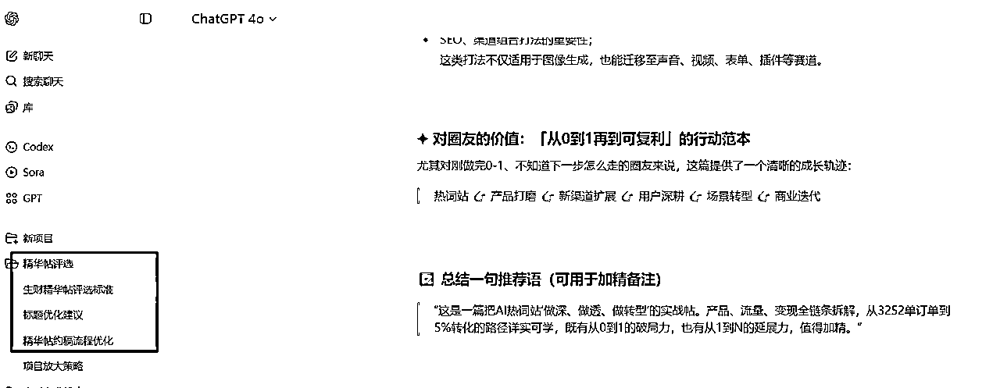

*   7月5日，我参加了大树组局，miniko分享的线下AI自媒体实操航海，再次做出了飞书多维表格+monica的自媒体批量文案生成，以及投喂到monica做智能体。

*   7月7日的时候，看了公司社群里分享的10分钟编程，尝试用自然语言做了一款内容分发系统，没想到做出来还挺有模有样的。

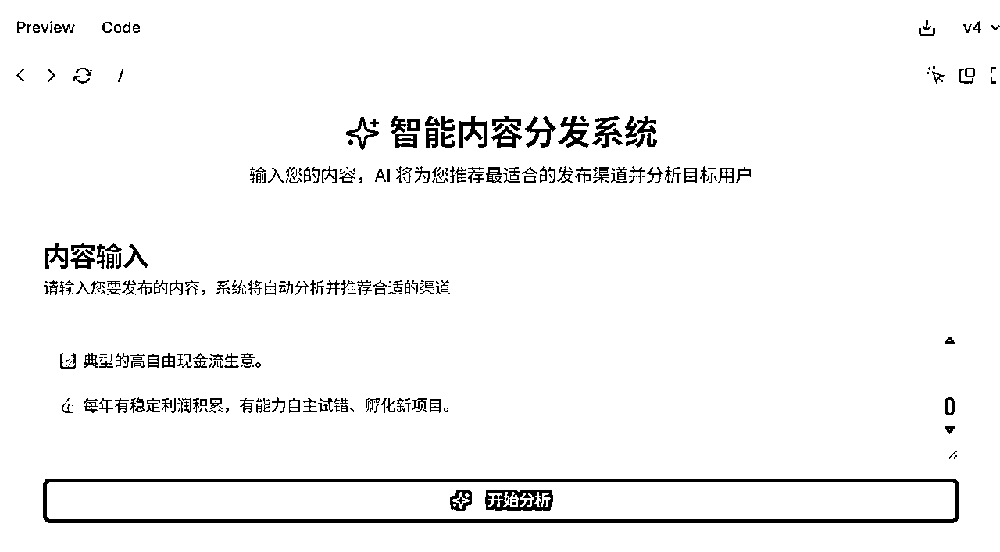

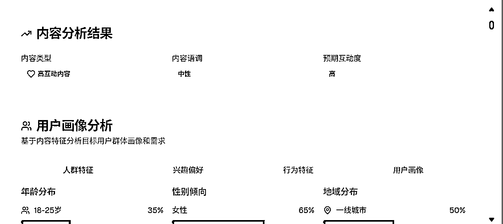

*   周末的时候我尝试下载cursor，结果不知道如何下载，一个圈友远程指导我用终端启动claude code（完全不懂什么意思，让我复制啥就复制啥），但是发现太复杂了就放弃了。

*   上周也就是7月15日左右，我在AI传术师社群看了太多次分享claude code，也看了小排老师的内容，第一次尝试注册谷歌账号，注册cursor，然后注册claude，在野卡死灰复燃的几天内完成了付费，开启了在cursor使用cladue的过程。然后公司刚好开放了API接口，我开始尝试了抓取评论区有效内容生成用户原声和洞察的内容。

*   在同事瓜斯，知行，还有SCAI实验室@dhj @大潘 的帮助下完成了第一个页面的生成，给大家展示下结果。

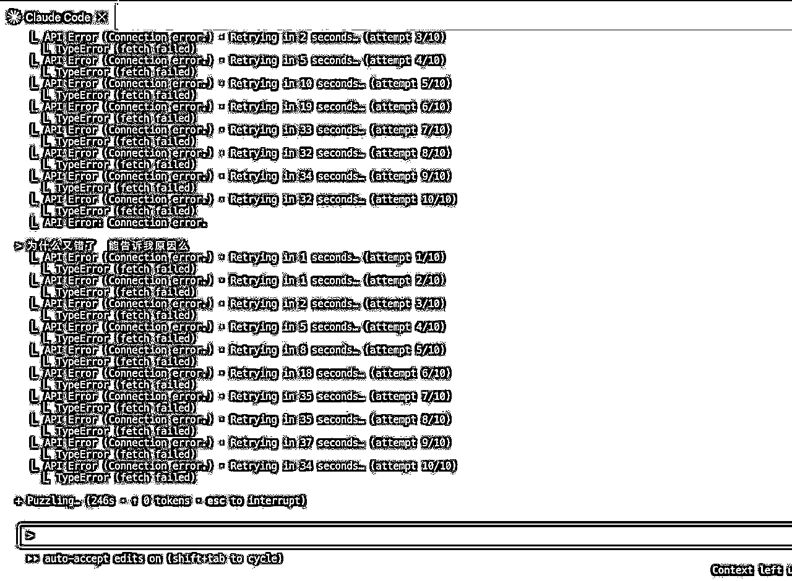

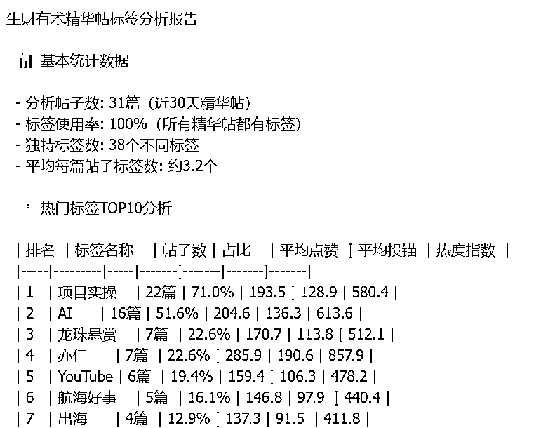

再对比看下下一步的进展：

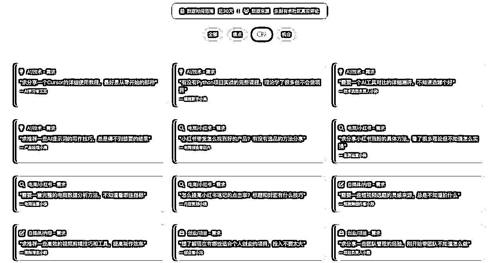

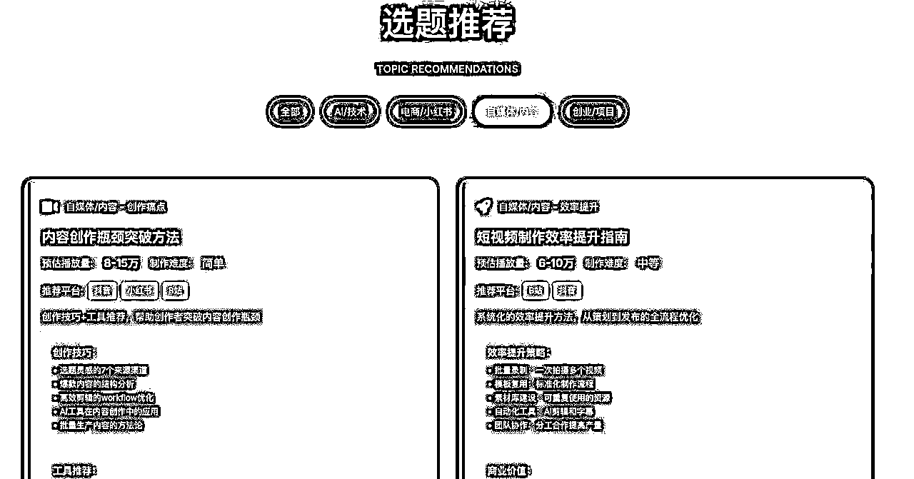

使用的网页生成代码是同事瓜斯发给我的：

```
1\. 使用Bento Grid风格的视觉设计，纯黑色底配合亮橙色颜色作为高亮
2.强调超大字体或数字突出核心要点，点，与小元素的比例形成反差
3\. 中英文混用，中文大字体粗体，英文小字作为点缀
4.简洁的勾线图形化作为数据可视化或者配图元素
5.运用高亮色自身透明度渐变制造科技感，但是不同高亮色不要互相渐变
6.模仿 apple 官网的动效，向下滚动鼠标配合动效
7.数据可以引用在线的图表组件，样式需要跟主题一致
8.使用 Framer Motion (通过CDN引入)
9.使用HTML5、Tailwindcss 3.0+(通过CDN引入)和必要的JavaScript
10.使用专业图标库如Font Awesome或Material Icons(通过CDN引入)
11.避免使用emoji作为主要图标
12.不要省略内容要点
```

## 如何破除学AI的心力卡点：

1.第一步很容易卡在装梯子和下软件上。我第一次一个人装梯子花了2个小时，尽管有教程，但真的很繁琐。但是你要相信，只要突出这一步，剩下的每一步都会很简单。

2.心魔是阻碍学AI 的第一步。最难的不是你不行，而是你不相信自己行。

3.快速获得正反馈的前提是轻量化入手，比如用vo或者same.new先生成一个网页。（需要的话欢迎找我要教程）

4.找到属于你的AI学习搭子，每多一个坚持的动力多一份，在这个过程中，我打开过不下10个聊天窗口，分享学AI编程的卡点，请教问题。

5.找到你的榜样。榜样很重要，再多说一句的话，在身边成长起来的榜样很重要，我身边有三个很棒的榜样。第一个是亦仁，他大概演示过4.5次用gpt做策略，以及用claude code呈现一个功能的页面，当你亲眼看到一个功能用“说人话”的方式就能解决的时候，带给你的冲击是巨大的。当老板知道AI的边界时，你能做的就是快速学习，不然这个公司的隐藏KPI就是AI渗透率。

第二个是林悦己，从去年传术师见面会我见到悦己，再到她来SCAI，三个月期间机会没怎么约过饭，因为她真的很专注，一直在debug，写内容，不停优化。直到有一天我去找她约饭，听她聊完了三个月的编程历程。我突然意识到，是不是我也可以试试。如果就真的有一个不懂代码的女孩子做到了，那么我是不是也能做到。

当然我不是一定要做到，但是我真的好想知道“我可以！”

第三个是大树，他从0开始做AI访谈，在他拍摄的人物里，我看到好几个像我一样的普通人，没资源没技术，但是大家刚好抓住AI的红利，勇敢地下场把手弄脏，不停地试，再不停失败，继续不停优化，然后拿到了正反馈。

他分享采访gary的那篇文章里提到：

每次聊起 AI，我们都特别亢奋。我常常觉得，这是我们这一代人，有生之年遇到的最大一次机会。

它的变化太快了，快到所有的旧秩序都在被重构。曾经那些“必须名校、必须资源、必须大厂背书”的路径，正在被AI一点点打碎。

过去要“打怪升级”十年才能拿到的结果，现在可能几个月就能触到。我们从 0 开始，只是跑得快一点，抓得准一点，就能把结果干出来。真的不是我们多厉害，而是时代给了普通人一次弯道超车的可能性。

所以当你看到身边这么多人从0到1的时候，你内心只会觉得：我只要做了我肯定行啊！

## 如何在AI的过程中顺便build in public？

Build in public是从花生这里得到的启发。我在做AI社群的时候，就持续把一些社群的优质信息分享到朋友圈和即刻。它其实核心要倡导的是，如果你想要做一个产品，你可以把你做这个产品的整个过程向公众开放展示，让大众来关注甚至参与到你做产品的过程当中。这样的话，由于过程透明，其实在做的过程当中就是在逐渐获取关注，以及和用户建立信任，有助于将来这个产品真正面世的时候，可以快速获得第一批的种子用户。

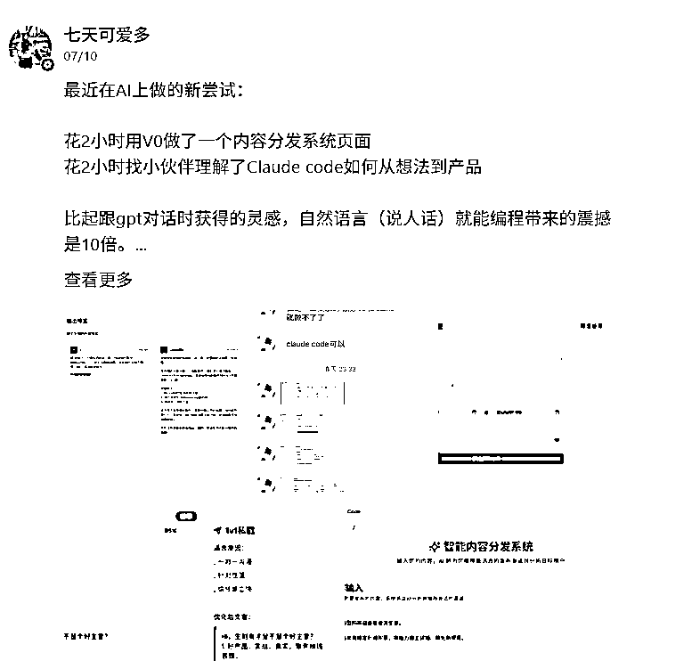


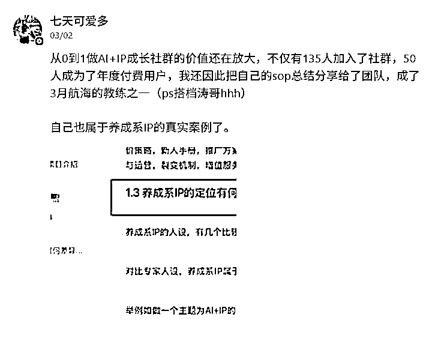

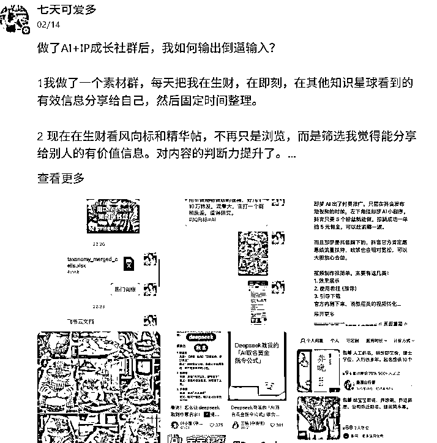

我觉得build in public 有几个点心得：

1.要对大家分享经验：让大家感受到我自己再分享自己的成长经验，不仅自己在做业务，也顺手复刻自己的业务心得给大家，邀请大家成为我的“云股东”。

2.分享自己的业务进展，让围观的人看到“我被认可”“我做成事”的过程，撬动一部分观望的人，加入我的社群，或者开始关注我的内容，他们会意识到“七天确实在认真研究AI”。

3.Build in Public 的核心不是展示和炫耀自己，而是保持开放，遇见有可能的同路人。

4.对在过程中帮助过你的人表达感谢，其实谁帮助了你，也侧面验证了对方对你的认可。

我写下这些，不是为了告诉你我多努力，而是想告诉你：一个完全不懂技术的人，只要愿意试，一样可以把AI用起来、把产品做出来、把自己的可能性打开。

因为我不是“准备好了才出发”，我是“出发了才准备好”。

下一个从0做到1的，也许就是你。

你不用一次性掌握所有AI技能，你只需要迈出“第一步”。

下一步要不要试试？比如做出你人生第一个网页，或者生成你第一个AI小工具？

如果你也想试试，也可以在评论区留言。

我不是专家，但我知道从“什么都不懂”到“做出第一个东西”的那条路怎么走。