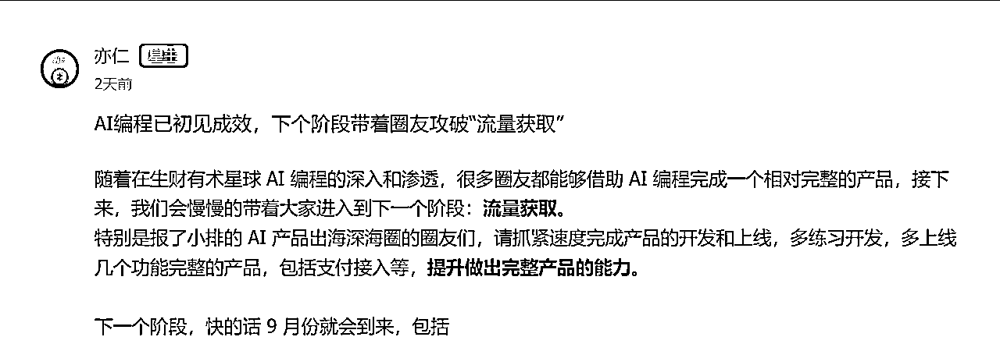
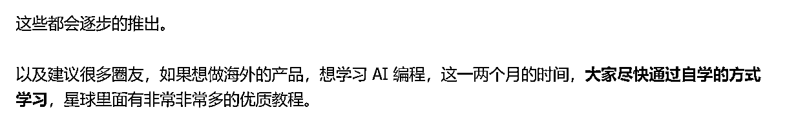
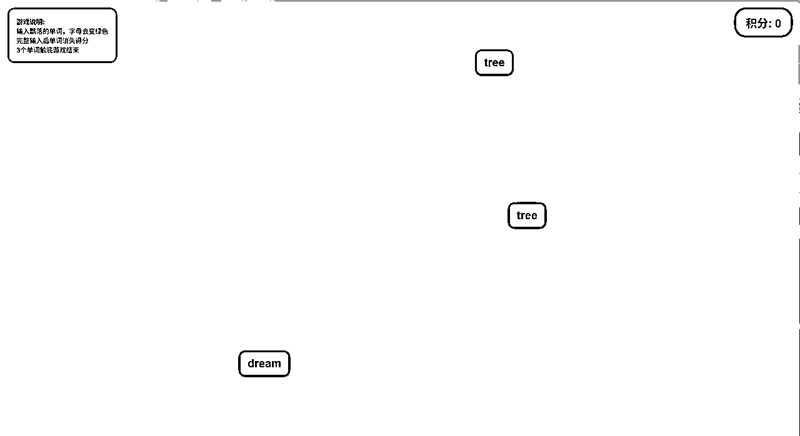
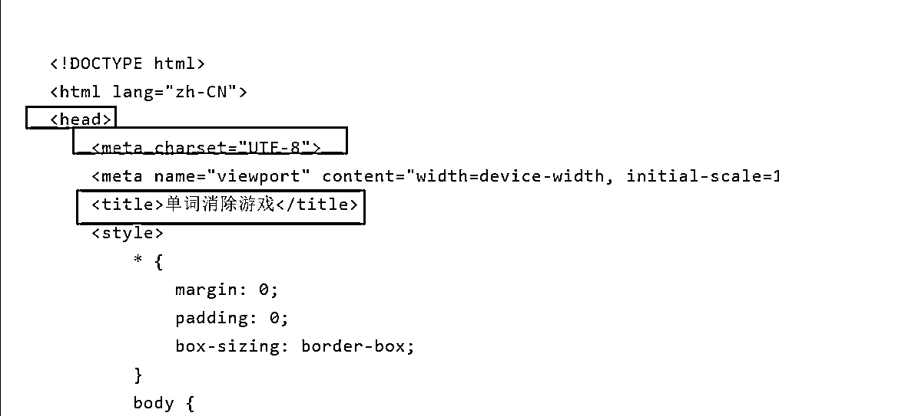
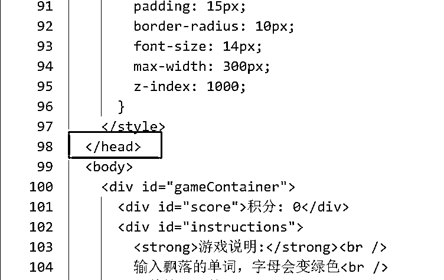
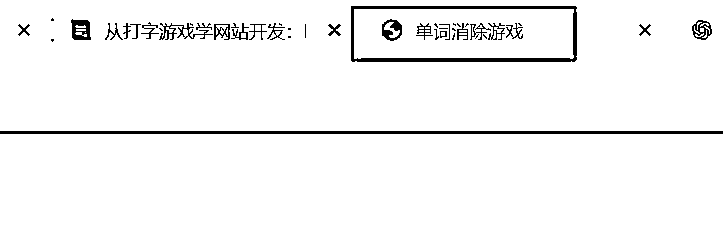
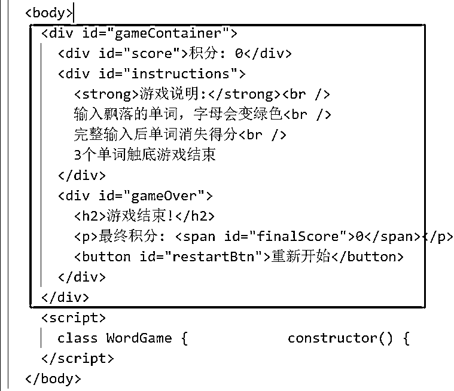
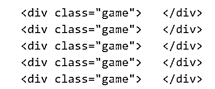
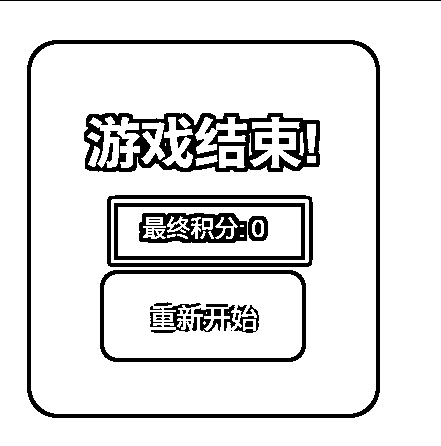

# 从打字游戏学网站开发：HTML小白0基础入门【一】

> 来源：[https://a0u2vshvubw.feishu.cn/docx/LN65dxcxwoArrtxQYAxcBld8n9c](https://a0u2vshvubw.feishu.cn/docx/LN65dxcxwoArrtxQYAxcBld8n9c)

考虑到市场上的代码教程已经烂大街，大多都是照本宣科的教学，

我决定每次的讲解，以一个小游戏为载体，帮助大家从0开始快速学习整个开发网站的体系。

这样面向产品的学习不仅不会学习迷茫，学完之后，还可以手搓一个同款出来，检验一下学习成果。

废话到此为止，下面进入正题。

# 游戏展示：

网址：https://game-2xj.pages.dev/

游戏截图：

# 游戏玩法：

这个游戏玩法非常简单，就是上面随机出现一些单词，你需要快速的在键盘输入，输入成功单词消失，累计三个单词落地，游戏失败！

# 游戏源码：

飞书这个编辑器也太难用了，大家可以下载用自己的编辑器打开。

编辑器无脑冲cursor：https://cursor.com/downloads

首先上面的源码分3大块，分别是html、css、js，它们三个构成了一个完整的网页。

这里我们先来学习，html。

# HTML:

学习html之前，先说下这个东西本质是什么，html的本质就是骨架，是网站所有信息的载体，也就是你看到的所有东西它都要写在html这个载体中，就好比一个没穿衣服没化妆纯天然的美女，美女有头、有脚，咱们html也有头和脚。

如下图：

上面一共有三种重要的标签：

【head】、【mete】、【title】

## 【head】标签

首先【head】它就是上面说的头部，它是一个双标签，也就是它是一对，而不是单独一个，往下翻翻代码，你就会看到 如下图，你把它可以理解成 括号 ，括号是成双成对，它们都可以包住其他的东西。

那么在这里的作用其实相当于美女的大脑，它里面包含标题、编码格式、是否适配移动端等等配置信息。

### 【mete】标签

其次【mete】其实就是【head】里的配置信息，它根据不同的属性，会有多种功能。

比如  这里，它的属性就是 charset="UTF-8" 。

那么它的意思就是这个网页采用的编码格式就是 UTF-8 ， 至于什么是 UTF-8 ，可以问GPT或者百度，这个不是重点。

那么你以为【mete】标签的用途就这么简单吗？那肯定不是的，它还有以下这些用法：

1、

2、

这个两个可是SEO必备的重要标签，可以很大程度上影响你的网站自然流的多少，所以必须学习。

我们先看第1个【meta】标签，它的name属性是description，那也就是说这个【meta】标签的作用就是描述这个网站是干什么的网站，那你就要把网站的描述写在 content= “（写描述的地方）” ，这样当搜索引擎爬取你的网站的时候，就知道你的网站是干嘛的。

第2个【meta】标签，它的name属性是keywords ，也就是关键词，这个也是非常重要的，你可以把那些搜索量高的关键词放在content里，当用户搜索这些词的时候，搜索引擎扫描到你的网站，发现关键词非常匹配，就会把你的网页排在前面。

### 【title】标签

这个东西就是标题，就像文章的标题，网站也需要一个标题，它不仅仅是给人看，让人知道你这个网站是做什么的，也是给搜索引擎看，并且它会显示在你网站的标签页上。

因为咱们的小游戏ttitle是这样：

<title>单词消除游戏</title> ，所以它的标签页显示的就是单词消除游戏。

【head】标签我们学习完毕之后，我看看【body】里的标签,【body】标签作用就装内容。

眼尖的朋友会发现，哎，【div】标签是不是大量出现，那就说明这个标签是咱们用的最多的。

## 【div】标签：

这个标签可以把它理解成是一个盒子，盒子可以装文字和其他的标签，它没有太多的特性，非常普通，所以用的很广泛。

这里可能不好理解，举个例子哈，比如你有没有想过为什么画板背景大部分都是白色的？为什么服装厂做衣服染色前会漂白？而不是漂黑、漂红。

答案其实就是因为白色是最“干净”的底色，可以被染成任意的颜色，是万能的底色。

那这里的染色，其实就是我们后面要讲的样式。

正因为【div】这个标签天然没有太多奇奇怪怪的样式，所以更方便我们自己去设置想要的样式。

比如【strong】标签，它天然自带一个加粗的样式，所有写在里面的文字都会被加粗，如果你不想文字加粗，你用这个标签还得写样式去掉加粗，才可以写你希望的样式，所以【strong】标签并不常用。

#### id：

我们可以看到 几乎每个【div】标签，它都带有一个属性，id="XXX", 这里的id就是指这个【div】标签的唯一编号，相当于身份证号码，给它写id的目的是方便后面，我们写样式或者写交互效果，方便定位到具体标签元素。

#### class:

与id相似的还有一个属性是class="xxx"，它是【div】标签的名字，一个名字可以被多个【div】标签使用，也是方便样式和交互取定位，不过因为一个 class 名称 可以被多个标签使用，所以当我们想批量改变多个标签的时候，我们就饿可以给他们起相同的class名字。

比如：

特别注意：id 和 class 这两个属性是通用的属性，任何标签都可以写这样的属性。

## 【h2】标签

这个标签是段落标题，它自带加粗和放大的属性，考虑到seo，能用尽量使用。

它还有几个兄弟姐妹，h1~h5，数字越小字体越大。

## 【p】标签

它是段落标签，主要放大段文字。

## 【span】标签

它是文字标，经常用于在段落标签中，对特定文字继续样式修改。

比如游戏中：

最终积分: 0

对应的界面就是如下图，这个时候你就可以单独改变 0 这个积分的样式，比如变、变大、变色等等。

那么为什么【span】可以这么用呢，就是因为这个标签有个特性，就是它不会独占一行。

上面我们讲的【div】、【h1~5】、【p】都是独占一行，他们不允许一行有其他的元素，所以不能像【span】一样使用。

## 【button】标签

这个标签是按钮，一般我们会把交互的点击放在这个标签上，它也不是独占一行。

## 【br】标签

文字换行

除了游戏中的这几个标签，还有几个重要的标签，我列出来，就作为作业大家自己探索哈，一定要手动敲一敲运行起来，感受下他们的效果。

不懂的标签可以在这里查询学习：https://www.runoob.com/html/html-tutorial.html。

## 【img】图片标签

## 【a】链接标签

## 【ul】列表标签

*   Coffee

*   Milk

## 【li】标签

*   Coffee*   Milk

以上就是学html必须掌握的标签，不要求死记硬背，多敲敲键盘，跑跑网页，熟练就好。