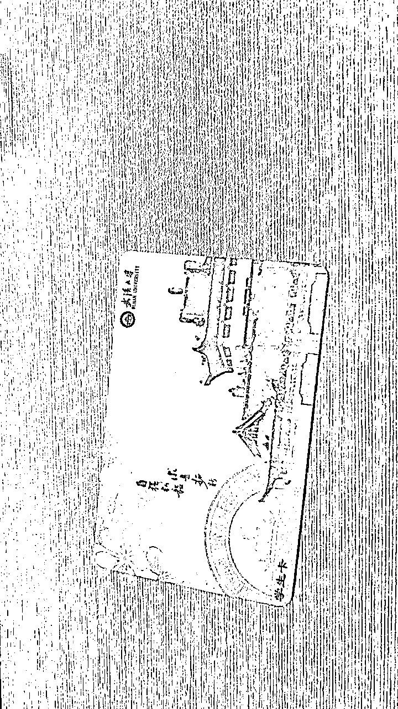
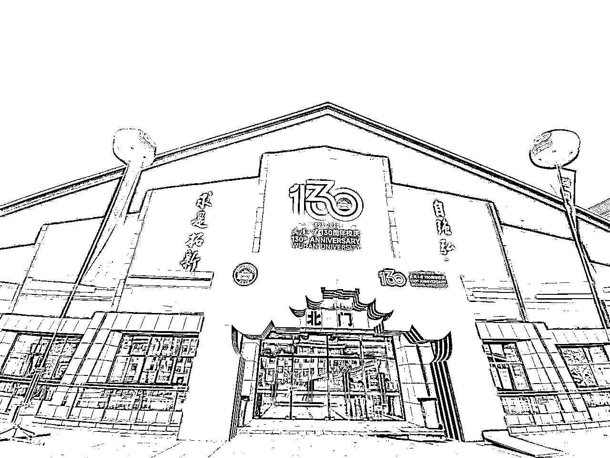
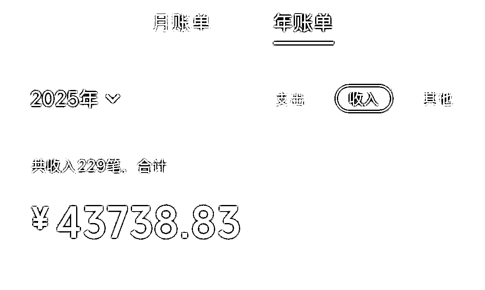
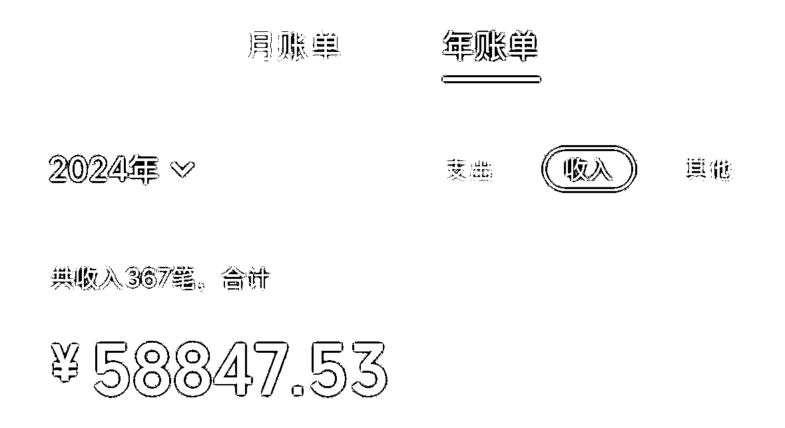
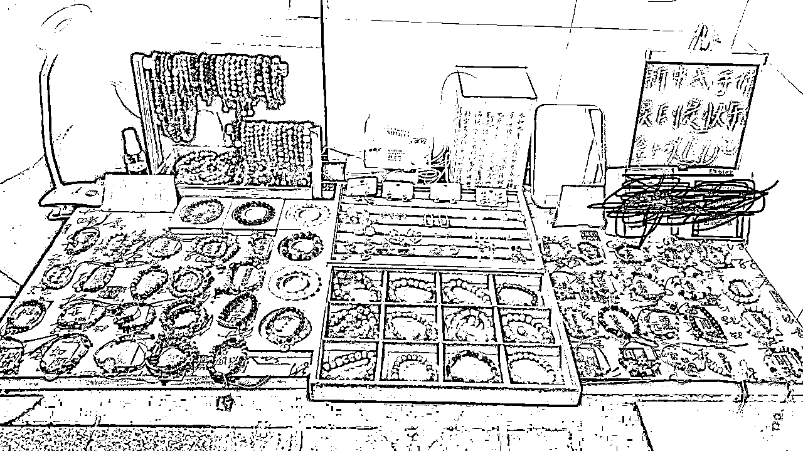
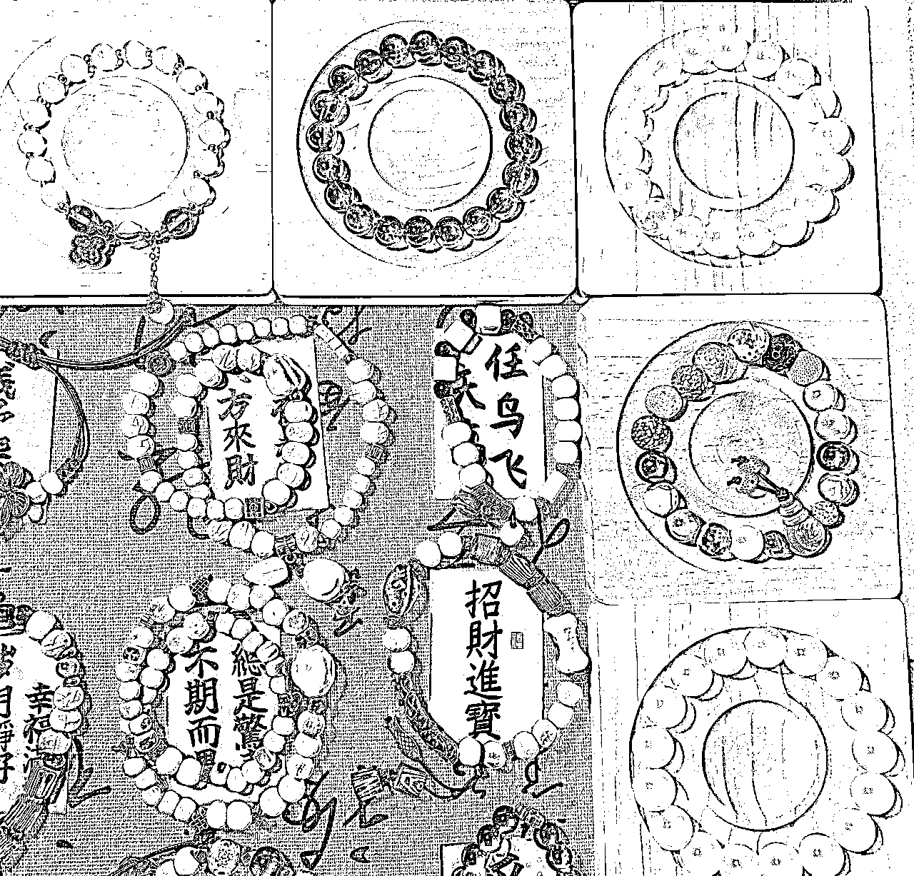
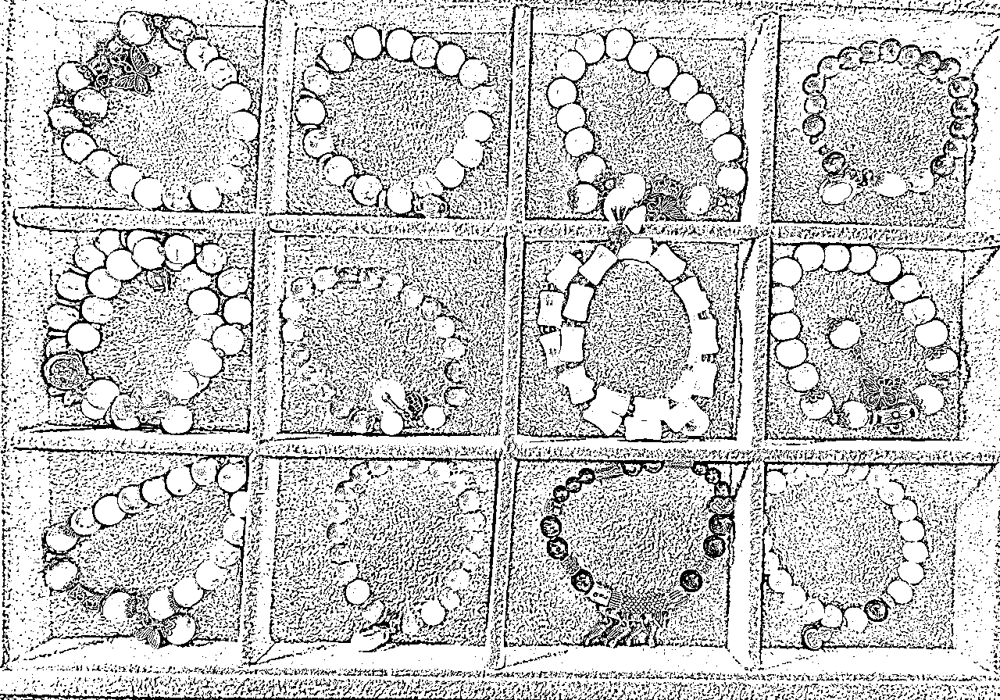
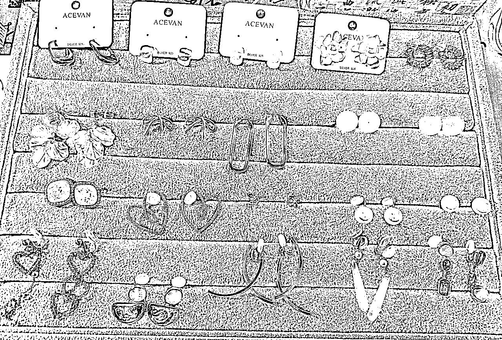

# 脱下孔乙己长衫，26岁大学老师摆摊卖手串，5天23小时赚了2000+

> 来源：[https://scn5imkjrs3a.feishu.cn/docx/Sa0admnkwo31wRxHtkucUzjVnCd](https://scn5imkjrs3a.feishu.cn/docx/Sa0admnkwo31wRxHtkucUzjVnCd)

特别感谢潇墨帮忙审核帖子，及时提醒我删掉违规链接，不然今天这篇可能就发不出来了 —— 效率超高，必须给个大赞！

还要谢谢李李，平时不管我问啥生财的问题都耐心解答，生财的鱼丸姐妹们是真的暖，每次找她们聊天都超热情～

说起来我是去年 10 月加入生财的，当时天天追《搞钱女孩》播客，后来多亏陈雪姐拉我进圈。这是我第一个付费星球，到现在也是唯一的一个。说出来有点不好意思，付费后忙着做播客、折腾副业，愣是没好好扒过精华帖。最近暑假闲下来补课，越看越心惊 —— 天呐，这一年错过多少搞钱信息差！眼看快到续费期了，明年还想赖在生财跟大家混，赶紧赶了篇帖子，要是能评上精华，说不定还能低价续费，想想就美滋滋～

第一篇帖子叫《脱下孔乙己长衫，26 岁大学老师摆摊卖手串，5 天 23 小时赚了 2000+》。跟生财的大佬们比，这点钱确实不够看，但对我来说意义不一样 —— 这是我第一次真刀真枪下场搞钱，踩的坑、攒的经验都在里面。大家要是看得还行，麻烦点个赞捧个场，后面我接着更。以前写小说时能一周肝出几万字，写帖子对我来说不算难，就是话有点多，怕你们嫌我啰嗦～

不多说啦，正文这就来！

武大法学院毕业的光环没困住我，反倒让我更敢 “折腾”：主业是大学老师，副业从播客主理人到资料销售，靠闲鱼、小红书低粉变现攒下六位数，24年被 1688 官方邀请参加拿货节。

今天不想聊那些 “高大上” 的，就想跟你掏掏心窝子：去年毕业季，我是怎么从义乌批发市场扛回一堆手串，在宿舍门口支起小摊，一边应付答辩一边卖货，最终用 23 小时赚够2000多的。

从选品砍价的 “野路子”，到把保洁阿姨变成 “大客户” 的销售技巧；从 9.9 元引流款的定价心机，到靠 “玄学” 话术让顾客快速掏钱的秘诀…… 全是我踩坑踩出来的实操干货。

如果你也想试试摆摊搞钱，又或是被 “孔乙己的长衫” 捆住了手脚，那这篇文你可得好好看 —— 毕竟，能靠自己双手赚来的底气，比任何头衔都值钱。

一、我是谁？

1.武大法学院毕业，主业大学老师

2.副业：干过挺多的，列举几个即将写成帖子的

（1）全网同名播客“搞钱姐妹养老院”主理人，24年8月开播，全网播放超30万，小宇宙订阅10000+（平均35天增加1000订阅量，不到一年小宇宙播客破1万订阅量，破10万播放量），跑通播客从搞流量到变现的闭环，接过B端广告，做过C端生意，ToB，ToC都有经验且拿到结果

（2）读书期间结合闲鱼、知乎、小红书低粉变现，赚了6位数

（3）毕业10个月，小红书自己写资料卖资料做咨询，赚了6位数

部分收款截图：

（4）毕业季摆摊卖手串，5天23小时赚了2000+，上过两次“搞钱女孩”播客，小红书“搞钱姐妹白白”几百粉丝就被1688官方邀请，参加24年台州拿货节活动，25年也在陆续参加阿里巴巴的官方活动

3.大家可以叫我白白，我是一名斜杠青年，ENFJ，高能量，执行力强，爱折腾，热衷搞钱，喜欢交朋友，没事儿就来唠唠嗑～

我的播客叫“搞钱姐妹养老院”，欢迎大家收听～

二、毕业季宿舍摆摊卖手串，5天23小时赚了2000+

说起来也是缘分，我当时在金华实习，离大名鼎鼎的义乌商贸城隔得不远。去年端午节，朋友们都出去耍了，我闲着也是闲着，就想着去批发市场逛逛，还特意跟 8 个朋友打招呼：“看中啥告诉我，我给你们带！”

一进商贸城，那些手串、耳环简直把我眼睛都晃花了 —— 亮晶晶的琉璃、温润的玛瑙、还有带着小坠子的耳环，每样都想拿点。可批发市场都是按 “打” 拿货的，12 个一串，朋友只要 8 个，剩下的 11 串手串、11 副耳环总不能砸手里吧？我这人最看重说话算数，既然说了帮朋友带，肯定不能反悔，咬咬牙全买了！但买完就犯愁了：剩下的咋清掉呢？

巧的是，那会儿正赶上毕业季，我得回学校参加毕业典礼。看着一袋子货，突然灵光一闪：要不借着毕业季在学校摆摊？说干就干！我连夜刷小红书看摆摊攻略，在淘宝、拼多多、1688 上比价格、选款式，听说摆摊得品类多才能吸引人，不知不觉就进了七八十种手串，一算账花了一千多 —— 当时我还是穷学生，手里没多少流动资金，还跟朋友借了一千才凑够。那一刻，囤货的压力噌地就上来了：必须把货全卖掉，不光要赚钱，还得还朋友钱呢！这事儿，没得退路了。

本来想去地铁口摆摊，毕竟人流量大。那天下午一点半，我把折叠桌、桌布、小台灯这些 “氛围感神器” 搬回宿舍，正琢磨着怎么摆才好看，突然瞅见宿舍门口有块空地。心想 “离地铁口人流高峰还早，不如先在这儿试试水？” 就支起桌子，铺好碎花桌布，把所有手串一溜儿摆开，再打开小台灯，别说，还真像那么回事儿！

刚摆好，对门同学就背着相机出来拍毕业照，路过时好奇地问：“你这是干啥呢？” 我赶紧招呼：“摆摊卖手串呀！都是网上少见的款，你看看有没有喜欢的？” 她凑过来一看，被一串蓝琉璃吸引了，听我叨叨半天 “这颜色配毕业照特上镜”，当场就买了一百多块的东西 —— 第一单成了！

更意外的是，第一个 “大客户” 居然是学校的保洁阿姨。我平时总跟打扫宿舍的阿姨唠嗑，那天见她路过，赶紧拉她来看：“阿姨，您试试这红玛瑙的，戴着手特显白，配您那件衬衫肯定好看！” 她一戴就摘不下来了，连说 “比外面店里便宜一半”，不光自己买了两串，还说 “我同事肯定也喜欢”，第二天直接带了好几个阿姨来 “团购”。

就这么着，我在宿舍门口摆了 5 天，加起来也就 23 个小时，居然赚了 2000 多！那阵子一边忙着答辩、拍毕业照，一边见缝插针地回宿舍盯摊，忙得脚不沾地，可每次听到微信到账的提示音，心里就甜滋滋的。尤其是把借朋友的钱还上时，那种 “靠自己搞定一切” 的感觉，比赚多少钱都爽！

三、摆摊卖手串如何选品？

选对品，生意就成了一半！我当时踩了不少坑才摸出规律，总结下来就 4 招：

1.  “借力” 选品：

第一天跟着朋友的喜好拿，但款式太少；第二天逛耳环摊时，直接问卖货的 00 后小姑娘 “你们年轻人现在爱戴啥”，你帮我多选选，选的好，我在你家多进点货，然后她帮我挑的很多手串后来成了爆款；第三天更直接，刷小红书搜 “摆摊爆款手串”，看别人哪款评论多、销量高，就找类似款但更便宜的；最后还把图片发给闺蜜们，说 “喜欢什么大胆挑，我免费送”，她们比我还积极，帮我筛掉了一堆 “土气款”。

1.  品类要 “杂” 且 “全”：

我前后在义乌商贸城进了 60 多种手串，从 9.9 块的陶瓷串到 100 多的水晶串（紫水晶、月光石这些），还顺带拿了耳环 —— 重点是要备 “无痛耳夹”，专门照顾没耳洞的姐妹，光这一项就多赚了不少。

1.  线下线上结合：

义乌商贸城我跑了 4 天，线下能摸到质感，还能跟老板砍价；线上就在1688找 “七天无理由退货” 的店，卖不掉能退，降低囤货风险。但记住，想卖高价就得靠线下独款，不然顾客一搜淘宝同款，你就没优势了，所以这个时候我会突出自己手串的差异化优势：手工制作➕独家，线上全网搜找不到同款，这时候配合一个心动价格，卖出去的手串可多了，销售的速度可快了。

4.兼顾不同人群：

虽然主要卖给学生，但我特意进了些红玛瑙、檀木串，想着 “万一有阿姨喜欢呢”。结果真被宿舍保洁阿姨们包圆了，她们说 “这红玛瑙戴着喜庆，比金店便宜多了”，还互相推荐 “你看李姐戴的那条多好看”。更妙的是，有女生买了串草莓晶，我说 “你妈戴红玛瑙肯定显气质，要不捎一条？” 好多人真就多带一串送妈妈，一个顾客变两个，生意自然越做越活。

其实选品没那么复杂，核心就是 “多听、多看、多琢磨”—— 别人觉得好的、市场认的、不同人都能戴的，凑到一块儿，想不卖好都难！

四、摆摊卖手串如何定价？

定价这事儿，核心就是既要让自己有钱赚，又得让顾客觉得 “值”。我当时摸索出一套法子，分了好几个价格档：9.9 块、15.9 块、19.9 块、25.9 块、29.9 块，还有 35 块和一百多的 —— 不同档次对应不同品质，这样不管是想随便买个玩玩的，还是想挑个好点的，都能找到合适的。

下面是几个实操技巧，亲测好用：

1.  让朋友帮你 “试水温”。把手串图片发给朋友，说 “猜猜这串值多少钱？猜对了送你”，大家一热闹就把心理价位说出来了。比如有串琉璃串，朋友们大多猜 15-20 块，我就定 15.9 块，既在他们预期内，又留了利润空间，这就是用用户思维定价。

1.  跟线上比价 “打埋伏”。把同款或类似款的图片发到淘宝、拼多多搜，看人家卖多少钱，我就定得比线上低个 3-5 块。顾客一搜发现 “线下买还更便宜”，根本不用多费口舌，直接就掏钱了。

3.“引流款 + 利润款” 组合拳。必须有个超低价的引流款，我选的是 9.9 块的陶瓷串，一摆出来就有人围过来问，人一多气氛就起来了；然后悄悄把 100 多的水晶串（紫水晶、粉水晶这些）摆在显眼处，有人买了便宜的，看到贵的也会好奇 “这贵在哪儿”，解释清楚 “这是天然水晶，质感不一样”，总有愿意为品质买单的。

说白了，定价不能拍脑袋，得摸透顾客的心理：既想占便宜，又想要好东西。把这两点兼顾到，赚钱就是顺理成章的事儿啦！

五、如何快速销售？

一开始我也以为，摆摊不就是把手串往那一摆嘛？有货就行！后来刷小红书才发现，那些爆火的摊位都特讲究 “氛围感”—— 评论区里全是 “摊位好看才想停下来”，我这才琢磨着：除了手串，还得备点 “加分项”。

（一）先说说必备的摆摊工具

1.桌子 / 露营车：我一开始买了张 120cm 长的折叠桌，看着挺能装，结果搬的时候差点累断手！后来在横店遇到个温州摆摊小姐姐，她给我安利了 “露营车 + 折叠桌面” 的组合 —— 下面装货，上面直接当摊位，推着就能走，简直是摆摊神器，强烈推荐！

2.货源渠道：别光盯着1688，虽然能七天无理由退货（新手必看！），但同款太多，顾客一搜就知道底价。最好去线下批发市场淘独款，比如义乌商贸城的手工串，回来就能说 “原创设计，网上找不到”，溢价卖都有人买。

3.氛围三件套：

（1）中式桌布 + 展示架：铺块写满书法的新中式的布，把手串分门别类，加上展示盘和装饰盒，瞬间比堆在盒子里好看 10 倍；

（2）亮灯！亮灯！亮灯！这是我跟老摊主偷学的：9.9 块的引流款故意少打光，显得普通；29.9 块以上的款直接用台灯照着，珠子的光泽感全出来了，晚上看特高级；

（3）小道具：酒精棉（试戴前擦一擦）、小镜子、花露水（夏天必备），细节到位了，顾客才觉得 “靠谱”。

（二）再聊聊超实用的销售技巧

1.价格牌 “小心机”：做个大字牌写 “9.9 元起”，然后用二维码把 “起” 字挡住 —— 顾客老远看到 “9.9” 就会过来，等走近了再解释 “高价款有更好的材质”，人留住了，就有戏！

2.款式要 “全” 到戳痛点：手串备了 60 多种，从 9.9 的陶瓷串到 100 多的水晶串都有；耳环特意进了 “无痛耳夹”，我自己戴了一年多，跟顾客说 “戴一天都不疼”，没耳洞的姐妹立马动心。

3.站着吆喝，别当 “低头族”：刚开始我总坐着玩手机，摊位前冷冷清清；后来学着主动打招呼 “来看串呀，刚到的新款”，有人驻足就赶紧递镜子 “试试这个，显手白”，人气立马上来了。

4.服务态度拉满：夏天看到顾客被蚊子咬，赶紧递花露水；试戴耳环前先擦酒精；哪怕买 9.9 的串，也帮人找个好看的袋子装 —— 有次一个女生说 “你比精品店还贴心”，当场又多买了两串。

5.快收摊时 “逼单”：每天收摊最后一小时喊一嗓子 “清货啦！买两串打 9 折，加 1 块再送一条”，利用 “再不买就没了” 的心理，最多一次靠这招卖掉 8 条同款，赚了一百多。

6.卖 “情绪” 比卖货更赚：

看到学生说 “要考试了”，就推 “节节高升” 竹节串，说 “戴这个逢考必过”；

阿姨们试戴红玛瑙，就夸 “显气质，配旗袍绝了”；

从不多推贵的，有次一个女生想买 19.9 的，我直接说 “你戴 9.9 的陶瓷串更清爽”，后来她成了回头客，还拉来闺蜜团。

加点 “玄学” 更吸睛：年轻人就吃 “寓意” 这一套 —— 紫水晶说 “招桃花”，月光石说 “助眠”，檀木串说 “防小人”。有次一个姑娘听完 “考试必过” 的说法，当场揣走两串，说 “给室友也带一个”。

其实摆摊没那么多套路，说白了就是 “把顾客当朋友”—— 你用心了，人家自然愿意为这份真诚买单。不光是手串，项链、小饰品都能这么玩，关键是让路过的人觉得 “这个摊有点意思”～

六、说在最后——摆摊搞钱碎碎念

后来我在县城摆摊卖手串时，发现了个特有意思的现象 —— 那条街上明明有四家卖鲜榨果汁的，按说竞争够激烈了吧？结果一到傍晚，每家摊前都围着人，尤其是最角落那家，排队能排很长。 我蹲了好久才看明白：人家卖的橙汁比西瓜汁火得多。老板说 “每天鲜榨 20 斤橙子，基本天黑前就卖完，西瓜汁反而剩得多”。这背后藏着个门道 —— 来的大多是带娃的家长，夏天怕孩子喝凉的闹肚子，西瓜性凉，家长总犹豫；但橙子不一样，一听 “维 C 多、不冰肚子”，掏钱特爽快。你看，哪怕是摆摊，选对品、摸透人群需求，再小的生意也能赚到钱。

除了摆摊，我真心劝大家试试自媒体。这玩意儿简直是 “轻创业” 的宝藏 —— 不用租门面，不用压货款，投入的无非是你刷手机的碎片时间。与其躺着划抖音、刷小红书，不如花点心思琢磨 “怎么把刷的内容变成钱”：你摆摊时拍个选品视频，进货时唠唠砍价技巧，收摊后算算赚了多少，慢慢就有粉丝跟着你学。等攒了人气，转私域卖摆摊配方和技巧、接个小广告，都是顺理成章的事。就算没做起来也不亏，至少练了怎么说话、怎么抓重点，总比纯刷手机强吧？

尤其你要是摆摊，更得把过程拍下来 —— 从进货时跟老板斗智斗勇，到摆摊时跟顾客唠嗑砍价，再到收摊后数钱算账，剪成视频发出去，这不就是现成的 “摆摊博主” 人设？摆摊是钩子，能勾来想看实操的人；自媒体是门槛，别人想学都得跟着你看。一件事既然要做，就得把它的价值榨干，这才叫会算账！

说到底，不管是摆摊还是做自媒体，最该放下的是 “孔乙己的长衫”。我一个985名校毕业的女生，都能在大热的夏天蹲在宿舍门口吆喝卖手串、喂蚊子；是大学生、研究生，发传单、做家教、摆个小摊又咋了？这些事看着 “土”，可教会你的本事实在 —— 怎么跟陌生人搭话，怎么把一块钱的利润算清楚，怎么在被拒绝时笑着再试一次。这些能耐，可比 “面子” 金贵多了。

人生哪有那么多 “必须”？没人规定读过书就得进大厂、考公考编。我试了十多种副业，踩了无数坑，才摸到自己擅长的路子，攒下六位数存款。很多时候不是事儿难，是我们自己先吓住了自己，总琢磨 “搞砸了咋办”“别人会不会笑我”。

可你细想：试错了最多浪费点时间，又不赔钱；可要是成了呢？说不定就撞开了一扇新大门，对于一无所有的普通人来说，勇敢去试这件事是个稳赚不亏的生意，光脚的不怕穿鞋的，失败了也就那样，本来就没啥好失去的了，还不如用力博一博。

所以啊，别想太多，先下场干起来。你会发现，那些 “放不下的身段”“怕丢人的顾虑”，在赚到第一笔钱的快乐面前，根本不值一提。人生是片旷野，不是轨道，敢折腾的人，才能跑出自己的路。

希望这篇文章对大家有所启发，欢迎大家和我交流搞钱经验和搞钱路子，也欢迎大家链接我成为播客嘉宾，一起做期节目，另外，这篇摆摊文字稿的相关内容可以收听我们的播客，播客链接就不放上面了，欢迎大家找鱼丸要我的联系方式呀！