# 理论结合实践-2个月从0到10跑通小红书虚拟资料

> 来源：[https://md8vbz6pkh.feishu.cn/docx/I2Mxdni5qoMfbrxBvUFcm6I9nfc](https://md8vbz6pkh.feishu.cn/docx/I2Mxdni5qoMfbrxBvUFcm6I9nfc)

# 前言

大家好，我是纸壳，前段时间写过一篇《一个长期稳定赚钱的项目是如何做出来的》，里面分享了我们团队做项目的方法和思路，最近一段时间，就用这个方法跑出来一个稳定赚钱的项目，今天就理论结合实践，分享一下这个项目从0到10的过程

先说项目，是一个大家都很熟悉的项目“小红书虚拟资料”，目前的数据是，30家店铺对应30个账号，平均单号月利润2400左右，每月增幅50%以上，预计下个月在不增加店铺的情况下，单月整体利润能突破10w。

项目是从5月份开始的，一开始搞了10个店，6月份20店，7月份30店，后面还会继续加店，附几张店铺最新数据截图，运营两个月以上的店数据基本都差不多这样

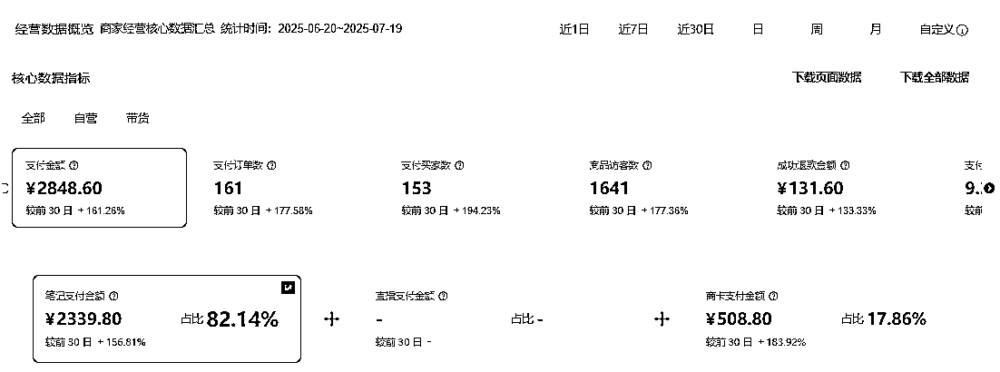

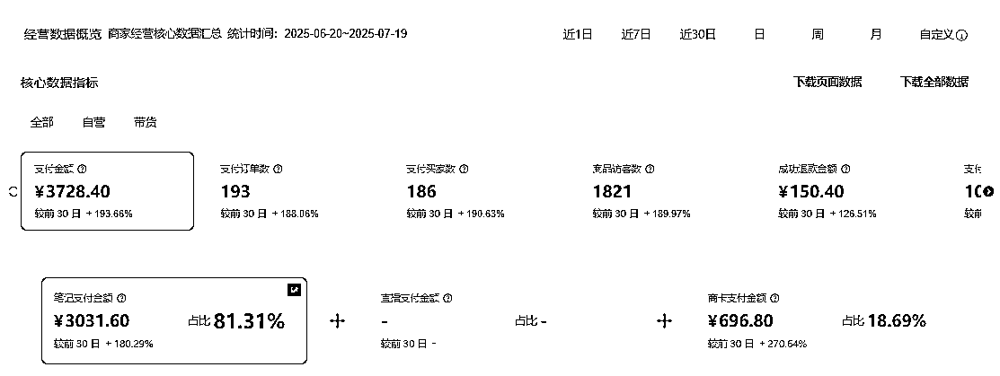

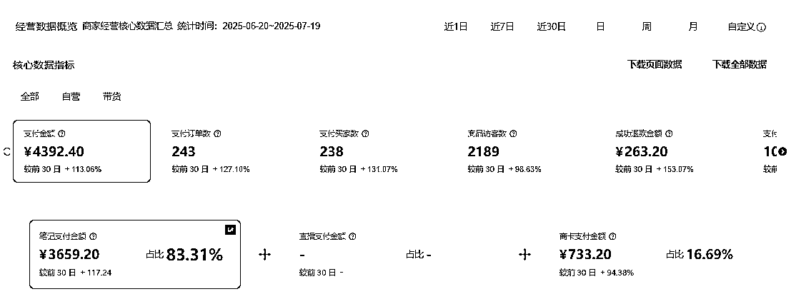

这篇帖子作为《一个长期稳定赚钱的项目是如何做出来的》的实践对照，会按前篇框架拆解每个环节的操作及背后逻辑，希望能对大家做项目有借鉴意义，建议先看上一篇再来看这篇，两篇搭配看效果更佳

首先回顾一下上一篇的主要内容，做好项目的四个步骤

一、筛选项目

标准：确定性强 、可批量复制 、稳定合规、有门槛

二、充分调研

观测同行、请教同行、多渠道交叉验证

三、测试项目

跑通完整闭环、确认真实成功率

四、放大项目

降难度、做复制、设止损

看完本帖你将收获到

1、小红书虚拟资料杂货铺模式的完整流程

2、新项目从选择到放大的全流程实战经验

3、我个人对于普通人创业的一些经验总结

# 筛选+调研

先说筛选项目，4 月底团队计划拓展新业务，用了20天左右，筛选调研了很多不同的项目，包括：小红书虚拟资料、小红书电商、小红书商单、AI自媒体、AI视频、AI绘画、闲鱼电商、闲鱼虚拟资料、公众号爆文、美团电商、视频号创作者收益等等

其中大部分项目都被筛选的四个标准卡掉了，这四个标准评判主要是根据我们团队的现状和能力，有一定的定制化，比如有的项目对于我们来说无法复制，但是对其他团队可复制

本帖主要以小红书虚拟为案例分享， 其他项目就不过多赘述了

## 判断“红虚”符合标准的几个点

1.  确定性

上文中讲到，确定性要通过成功案例和入场时机来判断

*   成功案例找到很多，圈友就有很多在做的，也做得很好的

*   入场时机是成功率+竞争度，通过航海的成功率能判断这个项目的成功率很高，包括后续的调研中得到的信息也是这个项目成功率很高，当然竞争度也很高，综合判断依然适合入场

1.  可批量复制

从项目难度和成功案例来看，可批量复制是毫无疑问的，尤其是在AI的辅助下，这一点是完全符合要求

1.  稳定合规

从调研的诸多案例中看到，同行对于这个点都很重视，原创笔记原创资料都符合平台规范，而且小红书平台有一个非常好的点，允许修改，违规后可以按提示修改对应内容，修改后会取消处罚，相当友好

1.  有门槛

关于这个点，一开始认为是没有门槛的，随着做的过程中发现，这个项目还是有一定的门槛，首先谁的号多品多笔记多，谁就赚钱，然后每个号每天发的笔记是有上限的，所以号越多、运营时间越长，竞争优势越明显

如下图，把对多项目的判断具象化，把抽象的选择，变成数学题，能做的尚不能完全判断，但是不能做的已经很明确了

## 进入第二步充分调研

调研方法：观测同行、请教同行、交叉验证

给大家看一下当时调研小红书虚拟资料的一些截图

*   这两张是当时观测同行账号的表，一共观察了15天左右，有一些列隐藏掉了，通过观测同行不同模式（垂直类、杂货铺类）出单情况、发笔记情况、起号周期、内容形式等等对项目有了深入的了解

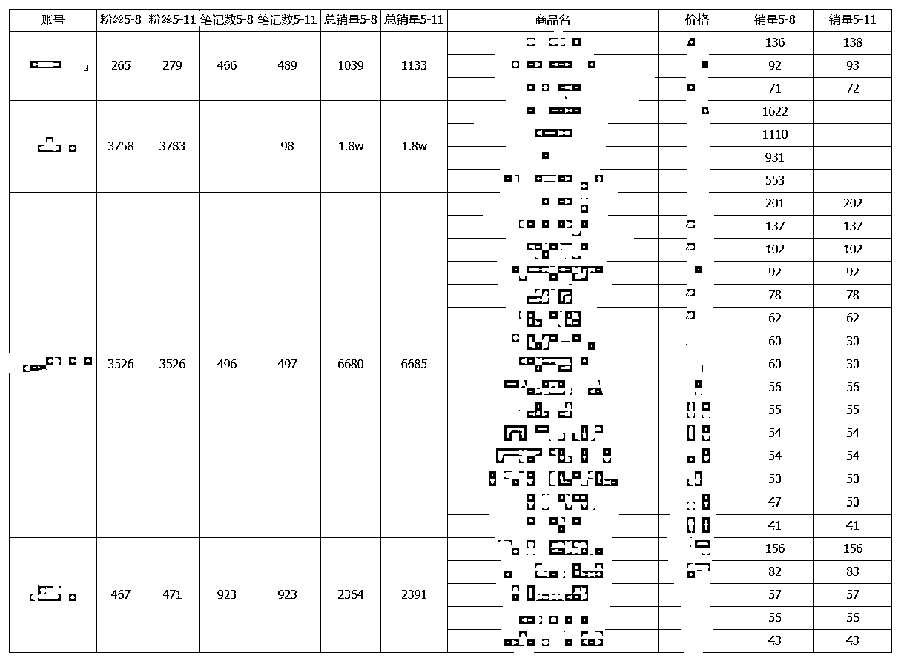

*   这几张是请教同行的聊天截图，左边是朋友介绍的，右边是做培训的同行。朋友和同行的反馈都是起号率100%，单号利润2000-1000，包括项目难点核心点也都有了充分的了解

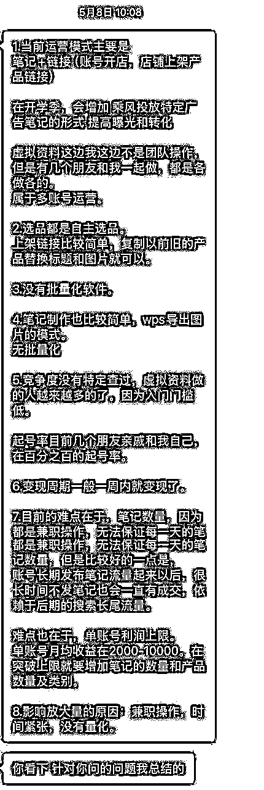

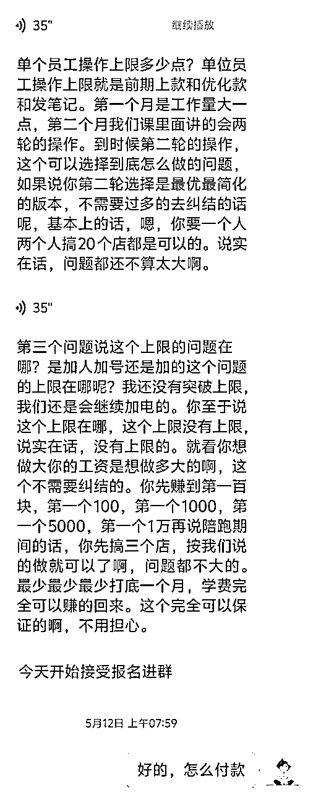

这个过程中也看了大量的帖子、航海资料等等

在数据观测、同行反馈、还有其他渠道的信息反馈，交叉验证下，判断该项目可以进入测试阶段

# 测试

回顾一下，测试的核心目的只有两个：跑通完整闭环、确认真实成功率

## “红虚”项目的两种模式

一种是垂直类（左一），一个账号只做某一类资料，甚至是只做某几个品，比如少儿教育、k12、考公考研等等。所有笔记反复围绕一类产品发布，塑造人设，加强信任，内容质量更高

*   优点是：更垂直、人群更精准、可以直接卖货也可以引流到私域、天花板更高

*   缺点是：起号率不高、吃爆款笔记、内容质量要求高、产出效率低，不适合大批量复制

另一种是杂货铺类（右一），这种账号什么类型的品都发，几乎不存在选品的概念，笔记也是每个品发1篇，账号没有人设，内容质量较低，靠数量堆概率

*   优点是：起号率高、不依赖爆款笔记、内容产出效率高，适合大批量复制

*   缺点是：单账号天花板不高、靠堆量需解决账号和实名问题、工作量极大

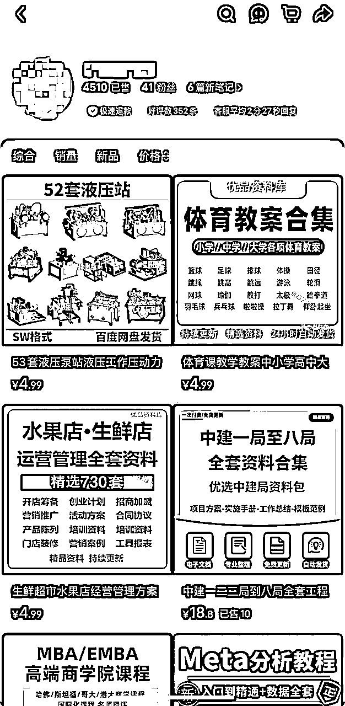

根据调研的反馈，垂直类账号遇到的问题有很多，比如笔记不爆、竞争度高、不停换内容、不好复制等等

而杂货铺类账号反馈的问题就一个，号不够多

结合我们 "批量复制" 的战略目标，毫无疑问选择了杂货铺模式，直接报名买了个课，报课之后，拿到老师的整套流程迅速搞了起来

这里还是要强调一下，这个阶段完成比完美更重要，不要搞创新，1:1复刻标准答案

## 杂货铺模式的具体玩法

项目非常非常简单，这张照片是当时梳理的流程，从注册账号到出单的全部操作基本都囊括在这里面了

### 1、开店及上品

首先注册一个淘宝店和小红书店铺，将别人淘宝店的商品搬运到自己的淘宝店，然后授权给小红书店铺，进行上品

上品环节几个要注意的点

*   产品不要选择带人名、机构名、明星、肖像、淘宝logo、二维码等侵权或违规的品

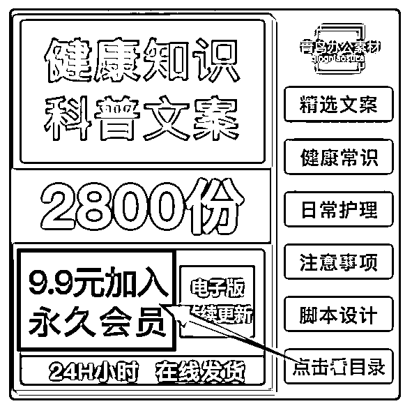

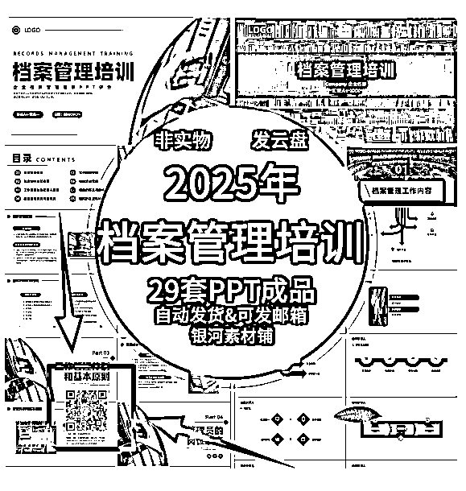

*   从淘宝上传到小红书产品类目选择“电子资料包”

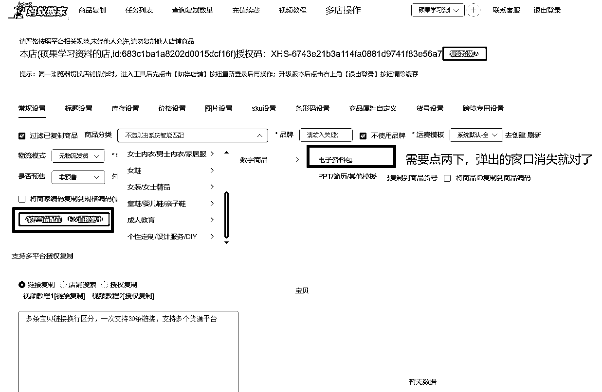

*   选出来的品在表格里做一次标题去重，相同标题的品删掉;选过的店铺找表格记录，防止后期重复上品，以及出单后找不到货源

### 2、发笔记

*   笔记的内容形式就是商品主图+商品标题+引导下单文案+相关话题

*   一轮笔记：每天每号发布30条笔记，创建产品数据库，下载的品和图片保存到数据库，方便上量后介入工作流

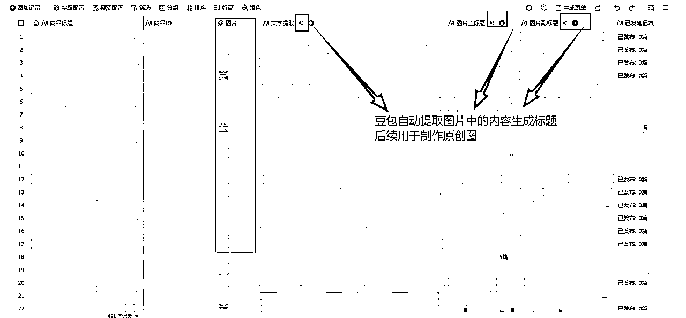

*   每周任务一定要完成，任务给的流量非常精准，极易出单

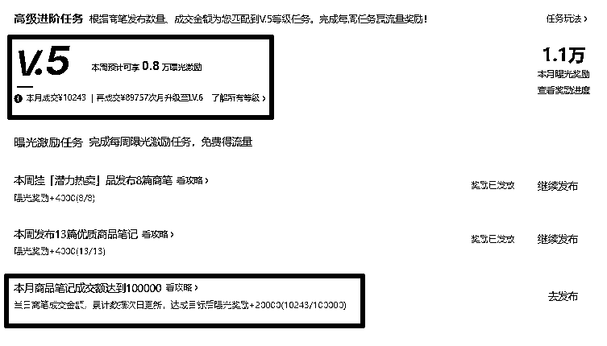

*   二轮笔记：创建自己的图片模版，将产品数据库中保存的图片数据，替换到自己的图片模版中，生成原创图片

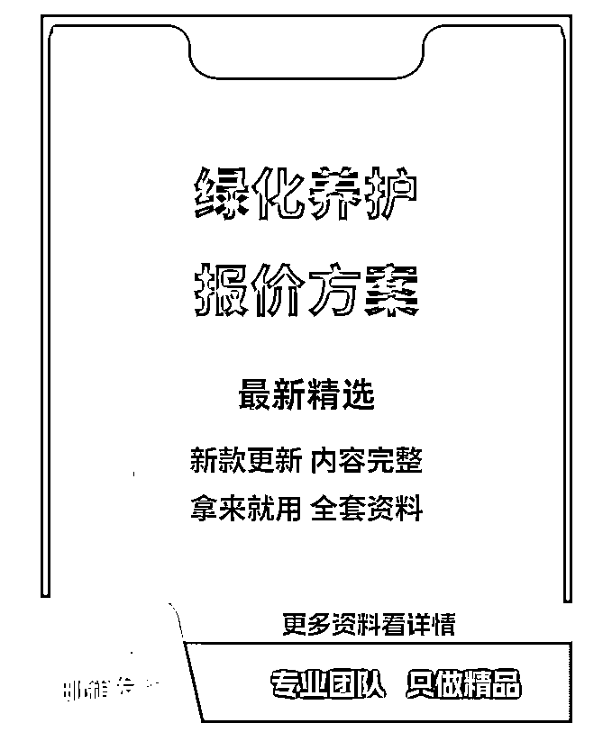

*   这类笔记的自然流观看很低，大概在十几到几百，不会出现几千上万的阅读，出单主要是走搜索流量，因为搜索来的流量都很精准，所以需要做的就是让用户能搜到我们的笔记，通过堆量、提高账号权重、提高内容相关度、提高转化率

*   这套流程测试的时候，完全是按照课程里讲的，没有做任何改动，唯一不同的是，按照流程跑了几天之后，把全流程做了非常细分的标准化动作，细分到鼠标第一下点哪里，第二下点哪里，先做哪一步后做哪一步效率最高，尽可能的标准化

*   我录了两条视频，给大家演示一下，发布笔记的整个流程

*   按照这套操作呢，基本一个账号每天发布30条视频，差不多耗时25分钟

### 3、出单及售后

*   出单后从淘宝采购资料，资料转存到自己的网盘中，发送给用户之前，注意打开看一下，有没有其他人留的钩子类内容，及时删掉

*   创建出单品数据库，记录出单品标题、ID、发货链接等，方便二次发布，以及后续出单能快速找到链接发货，同时统计出单次数，对于多次出单的品可以精细化运营

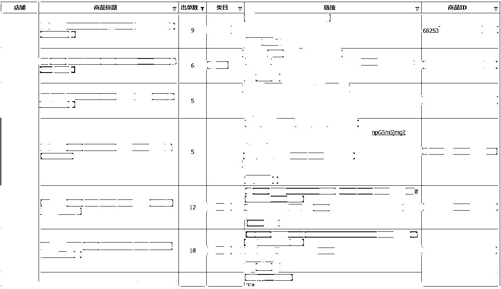

*   尽量用iPhone手机登录千帆app，出单有提醒，安卓手机没有提醒

*   用户咨询要在3分钟内回复，长时间不回复会扣店铺服务分，影响店铺权重

*   遇到用户退货，看用户选择什么原因，如果是货不对板之类，与用户协商，改成多拍或与商家协商一致等原因，货不对板会扣店铺分；或者协商线下退款，减少退货率，还能要个好评

*   店铺分高于4.6有流量加成、高于4.7提前3天结算

确定性强的项目，上手就有清晰体感：要么很快拿到正反馈，要么明确知道问题出在哪

项目正反馈来的很快，第一批上了4个号，基本都是发完笔记第二天就出单，然后陆续加到10个号，反馈都差不多，至此确定跑通闭环，也验证了真实成功率，进入到放大环节

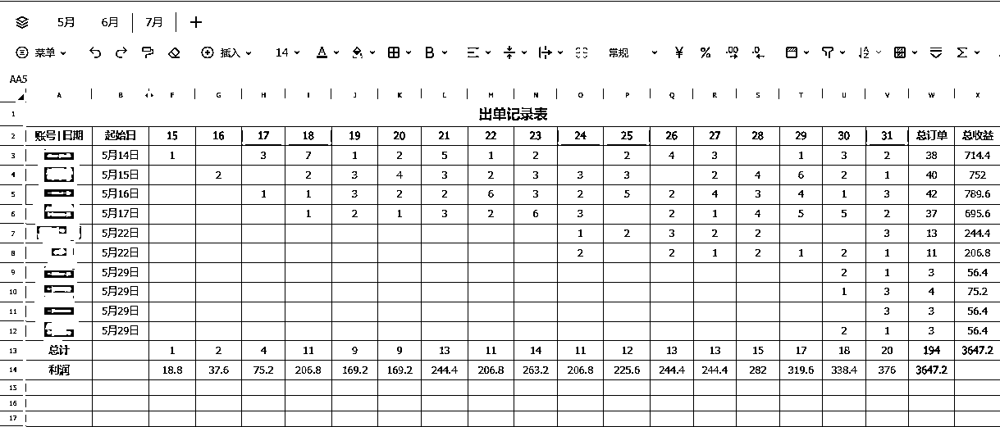

# 放大

## 一、面临的问题

6 月新增 10 个账号后，发现原有人工操作模式存在瓶颈，单人单日操作上限就是8-10个号，单纯加人加号的模式无法支撑规模化增长

按照上一篇放大项目的理论，先降难度再做复制

项目可拆分为三大块：

*   准备工作：注册账号、开店、选品、上品、处理违规

*   发布工作：下载素材、生成文案、发布笔记（重复性最高，最耗人力）

*   运营工作：处理违规笔记、投流、发货、售后

其中最耗费人力的就是发布工作，每个号每天发30篇，20个号就是600篇，都是批量重复性工作，计划用工作流来代替

然后就是违规笔记的问题，主要就是从淘宝搬的品，会出现其他人也搬过，笔记都用同一张图，涉及非原创的违规，本着不对抗平台的原则，这里决定用原创图，当然图片的制作也是用工作流

其他环节也有一些小问题，但都不是影响放大的问题，这里就不表述了

## 二、工作流解决方案

跟很多工作流大佬交流后，确定用影刀工作流的方案，开始学习影刀，因为之前有编程经验，影刀学起来很快，2天就搭好了一个发笔记的工作流

工作流介入后发现之前的流程是给人设计的，而按照自动化的逻辑很多动作是不必要的，需要对整个流程重新梳理，跳出人的视角，按机器的思维来进行设计

后面1个月的时间没有新增账号，所有时间和精力都用在拆解流程、优化环节、制定标准、搭建工作流

针对这个项目的重复性工作，我们搭建了多个工作流，实现80%的自动化，效果显著，从一个人最多管理8个号，提升到30个号还没到上限

下图是目前已有的部分工作流

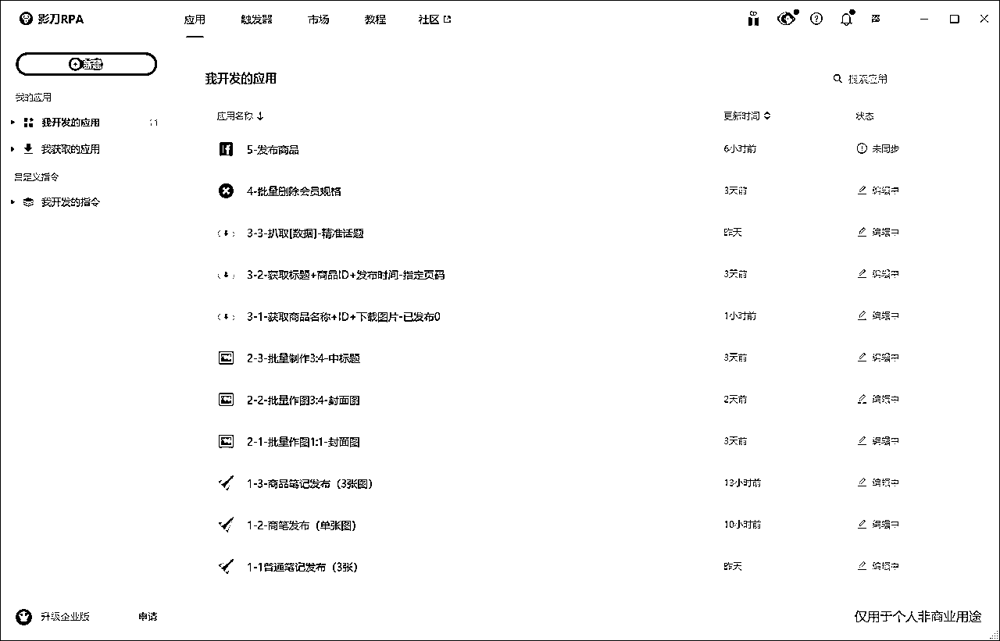

*   给大家演示一下，自动作图和自动发笔记、自动上品的工作流

*   注意：不要过度追求技术完美，70 分的解决方案足以支撑初期放大，避免陷入无限优化的陷阱

至此整个项目流程变成：自动上品--自动抓取数据到数据库--自动生成图片--自动发布，已具备可大批量复制的基础条件

## 三、设止损

算清投产才投钱，设好止损才放大

放大过程中，最重要的事情就是算好账，目前这个项目投入很低，主要成本

1.  资料采购，很多品购买就0.1、0.01，而且每个品只有第一次出单需要采购，后续出单成本为0，所以这块基本可以忽略

1.  各类软件，包括百度网盘会员、淘宝店、小红书上品软件、学费等，基本都是一次性支出，平摊到每一单上也可以忽略

1.  人员工资+房租水电，这块是固定支出，目前项目是2个人在做，合计薪资+房租水电成本大概1w/月，每加1个人成本4k

1.  投流费用，这块是非固定支出，最开始的时候，每个号上来就充值300，结果发现有时候系统抽风，1个展示就花几十上百，后来改成每号每天充值10块，花完看情况决定是否再充值，目前每月消耗1w左右

合计每月成本大概在2w左右，我们的止损线设置在连续两个月利润低于成本1.5倍，触发止损后关停投流和非优质账号，以及优化人员，后续观察项目数据决定是否彻底停止

目前的节奏是每月增加10-20个账号，同时投流费用逐步增加，这块之前优先级不高，后续会制定更合理的标准助力账号提效

以上就是关于这个项目从0到10的过程，当然还有大量的细节没法一一描述，但是本文主要想表达的观点是，用科学系统的方法做项目，可以更有效的拿到结果，希望能对大家有帮助

## 补充一些细节

1.  关于笔记内容：搜索来的用户大部分没有耐心看长篇文字，所以重图片轻文字，把重点信息放图片上，文案简洁明了，直接引导下单就可以了

1.  关于选品：当你开始选品的时候，不管怎么选，用任何方法和技术，都已经落入下乘，真正的爆品是可以自己长出来的

如下图：我们的理念是轻运营，尽量减少人为的干预，就像种地，耕地播种洒水施肥除草，做好必须要做的核心部分，剩下的保持耐心，让它自己长出来，万万不可拔苗助长

# 总结

1.  凡事标准先行！！！

用明确标准筛选项目、评估进展，避免凭感觉决策

1.  用科学方法做项目就是降维打击，别人凭经验摸索，你用系统化方法操作，成功率自然更高

目前还有两个在跑的项目也都是按这套思路做的，都也不错，暂时先保密，再跑几个月再来分享

1.  复杂问题最应该解决的不是执行力，而是找到不复杂的解决方案

尽可能去掉所有非标准化的操作，相同动作放在一起，用流水线模式能解决大部分问题

所有企业、团队、个人都要尽快把AI和工作流加入到业务中！！！

1.  重筛选轻培养，选人是这样，选项目是这样，选品也是这样

菩萨畏因众生畏果，很多事情能不能做成，从开始就注定了

把功夫下在根上，尊重规律顺应规律

1.  电商的核心只有两个，选品和动销，所有操作只需要围绕这两点去做到极致

执行力拉满，在能力范围内无限复制，赚1w还是赚10w，拼的只是谁店多谁品多而已

1.  普通人做不成事的几个原因

*   理想化，上来就想要做成完美，上来就开始扣细节，忽略真正能把事情做成的核心

*   无效努力，遭遇阻碍时，喜欢在那些不那么费力的地方努力，用无效努力麻痹自己

*   心太急，罗马不是一天建成的，先从最粗糙的开始，尊重时间尊重经验，十年完成的事不要强求两三年完成

最后想说，所有稳定盈利的项目都不是偶然，而是系统方法 + 执行力的必然结果。希望今天的分享能帮你少走弯路，早日找到自己的盈利项目

# 补充最新精华帖