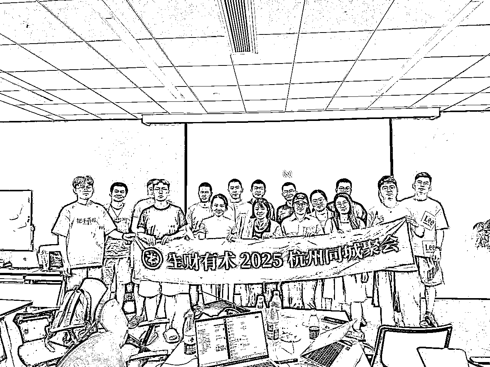
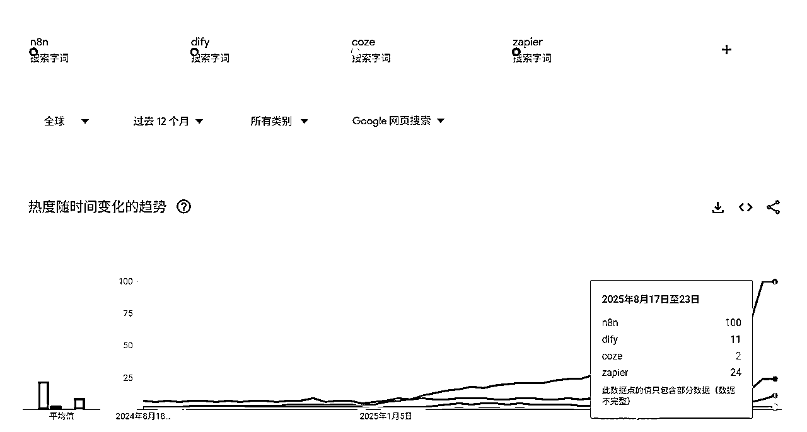
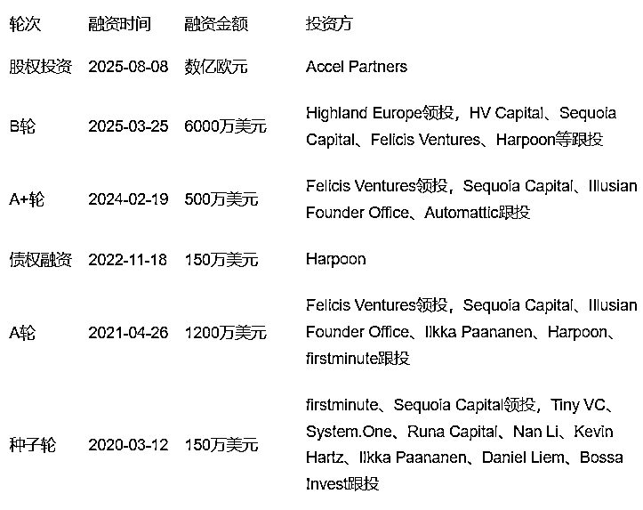

# n8n线下mini航海复盘总结——借此聊聊n8n的发展前景与未来趋势

> 来源：[https://yneq2bf840.feishu.cn/docx/LgvidgoaXoLRPrxwbY3cHzarnie](https://yneq2bf840.feishu.cn/docx/LgvidgoaXoLRPrxwbY3cHzarnie)

大家好，我是 KKKK，很多朋友认识我，是从我之前做的海外 AI Web 项目相关的精华帖。

但最近，我做了一个重要的决定：全面转向，All in n8n。这并不是说我放弃了做AI应用，而是我认为找到了一个更合适自己的产品形态和定位——专注“AI后端逻辑大脑”。

在探索 AI 应用落地的过程中我发现，产品最核心的是要满足用户需求，前端UI和流量获取是让产品脱颖而出的重要要素，但产品功能是用户进行选择的核心原因，而n8n刚好可以承担绝大多数AI产品“功能实现”这个角色。

同时n8n的使用恰好契合我的强项，我擅长逻辑思维和流程搭建，但是对技术、对流量都不太擅长，所以我选择不再“面面俱到”，放弃前端和UI，而是将所有精力投入到 n8n 这个“AI后端大脑”上，只交付最纯粹、最核心的产品功能。

本文并非一篇技术实操教程，而是基于上周日生财的线下n8n mini航海活动，深入复盘新手入门 n8n 的真实困境，并分享个人对 n8n 宏观趋势、价值判断的思考，为后来者提供一份“避坑指南”和认知参考。

# 本文目录

第一部分：线下mini航海复盘

*   1.1 航海计划与成果的差异，4小时计划 vs 1个最终成果

*   1.2 新手在哪些环节最容易“卡壳”？

第二部分：新手入门 n8n 的“三大坑”

*   2.1 “思维坑”：从“线性思维”到“节点式数据流”的转换

*   2.2 “技术坑”：API、JSON 与表达式，绕不开的基础三关

*   2.3 “思路坑”：为什么模板会失效？构建逻辑才是关键

第三部分：为什么我选择 All in n8n？

*   3.1 宏观趋势：AI平权时代，人人都可以做开发者

*   3.2 核心优势：n8n 到底强在哪？(开源、灵活、高性价比)

*   3.3 个人选择：一个契合个人优势的最佳杠杆

# 第一部分：n8n线下mini航海复盘

## 1.1 4小时计划 vs 1个最终成果

很荣幸受生财邀请，上周日在杭州组织了一场线下 n8n mini 航海。共15 位圈友参与，活动之前我的计划很丰满：在 4 小时内，由浅入深，带领大家认识n8n，并攻克 4 个精心设计、难度逐步递近的实战案例。

然而，现实给了我们一次深刻的“教训”。直到活动结束，我们仅磕磕绊绊地完成了第一个，也是最基础的一个案例。这个反差其实可以很明确地反映出对于绝大多数新手而言，n8n 的世界远非“拖拉拽”和“直接复制粘贴模板”那么简单，它是一个需要学习成本，有一定技术门槛的工具。

我们的第一个案例是一个简单的调用API，然后把结果自动化储存到指定位置的案例，但对新手来说会遇到VPN使用问题，界面熟悉问题，json请求头/请求体配置问题，API Key配置问题，变量值/变量名理解问题，API文档阅读问题，数据清洗和结构化问题等等。

## 1.2 现场观察：新手在哪些环节最容易“卡壳”？

在现场，我观察到新手的困惑问题高度集中。

*   第一个是数据流动和表达式不够理解：很多人现场照着操作可以完成拖动，但是不理解内在意思，换一个节点又两眼一抹黑了，这部分需要补充一些json的基础知识和对数据流动理解的认识。

*   第二个是API官方文档的阅读问题：在很多程序员和内行眼里，用MCP或者导入cURL可以很清晰快速的完成API配置，但实践会发现绝大多数小白连API的概念都不太了解，更别提阅读官方文档实现配置HTTP请求了，对于请求头/请求体的基本概念也需要时间成本去学习

*   第三个是缺乏逻辑设计和流程设计思维：这是我认为更核心的问题，虽然n8n有非常多的模板，但是永远不会有个性化的模板，你需要有自己的流程设计思维在模板的基础上去进行修改和完善。想要真的用n8n实现产品设计和解决方案，还是需要有完整的流程化思维，去对需求做拆分，然后再筛选不同的API节点或开源项目去匹配你的流程（当然一些简单可以直接套模板的任务除外）

# 第二部分：新手入门 n8n 的“三大坑”及解决方案

## 2.1 “部署坑”：n8n是一个开源项目，可以免费部署在本地

对于绝大多数新手朋友来说，第一个坑就是如何使用，实测发现n8n官网现在竟然不支持社区节点安装（猜测应该是短期bug，后续会修复），本地部署和云端部署都需要一定的时间和成本，支持大家想了解和学习n8n的先学习一下如何部署，这部分大概半小时就能入门

*   部署方式概述：官网、云托管、本地部署、服务器部署

| 部署方式 | 官网云托管 | 云托管平台 (PaaS)如 Zeabur, Clawcloud | 云服务器部署 (VPS) | 本地桌面部署 (Local) |
| 部署实体 | 官方提供的SaaS云服务 | 在第三方PaaS平台上通过代码仓库一键部署 | 在云服务器上通过Docker进行部署 | 在个人电脑(Windows/macOS)上运行 |
| 成本模型 | 按用量阶梯式付费，成本相对较高，最低24欧元/月 | 成本低，初期5美元/月，Clawcloud 可以免费薅（Github账号满180天） | 低，仅服务器固定月租 (性价比极高) | 免费 |
| 技术门槛 | 极低，注册账号即可使用 | 较低，无需服务器管理知识，按照流程部署即可 | 中等，需要基础的Docker知识和一定的服务器知识 | 中等，需要基础的Docker知识 |
| 数据主权 | 数据由官方平台托管 | 较高，应用和数据逻辑由用户控制，但运行环境由平台管理 | 完全私有，数据100%在自己的服务器 | 完全私有，数据100%在本地电脑 |
| 运行稳定性 | 高，由官方团队负责运维保障 | 高，平台通常提供自动扩缩容和故障恢复 | 高，可实现7x24小时不间断运行 | 低，依赖电脑开机和联网，无法7x24小时运行 |
| 限制 | 不同付费级别对应的并行数量有限制 | 主要是服务器算力限制，影响并行和用户数量 | 主要是服务器算力限制，影响并行和用户数量 | 无法直接接入公网，需要ngrok等工具 |
| 适用场景 | 快速体验、无技术背景，追求省心稳定，快速初期测试 | 追求部署简便与低成本自托管平衡的开发者、快速原型验证 | 所有生产环境、中小型企业、需要数据私有和低成本的严肃用户 | 学习、测试、开发调试、运行非关键性个人任务 |

## 2.2 “思维坑”：理解n8n的“节点式数据流”

许多新手在 n8n 面前的第一个障碍，并非技术，而是思维模型的转换。我们习惯于线性的、一步到位的思考方式，但在 n8n 的世界里，一切都需要被拆解。你需要将一个完整的业务需求，解构成一个个独立的、可执行的节点，并理解数据是如何在这些节点之间传递的。

*   核心比喻：多米诺骨牌。要理解n8n，你不需要成为一个程序员，你只需要理解多米诺骨牌是如何倒下的。n8n的整个工作逻辑，就是一个精心设计的、可视化的多米诺骨牌阵列。

*   节点 (Node)：构成阵列的每一块骨牌，代表一个具体动作，在n8n的画布上，你看到的每一个方块，都像是一块多米诺骨牌。它是构成整个自动化流程的最小、最基本的单元，代表着一个独立、具体的操作。例如，“读取一个表格”、“发送一封邮件”、“调用AI进行分析”。

*   触发器 (Trigger)：多米诺骨牌的起点，“每天早上8点”（定时触发）、“当我的网站收到一个新的表单提交时”（Webhook触发）、或者“当我手动点击‘执行’按钮时”（手动触发）。

*   执行器（Action）：n8n中执行数据实际操作的节点

*   数据流：骨牌依次倒下的过程，前一块骨牌的“能量”会传递给下一块。

*   JSON：本质是计算机语言的内容形式。

*   表达式入门 {{ }}：本质是计算机语言的承载形式，{{$node["获取天气"].json["城市"]}}

*   你可能会觉得上面那串表达式看起来很复杂。别担心！n8n最棒的一点是，你几乎永远不需要手动去写它。在n8n的编辑器里，你只需要用鼠标拖动你想要引用的上一节点的数据，n8n就会自动为你生成这个表达式和json数据。你需要学会的不是“写”，而是“拖动”！

## 2.3 “逻辑坑”：模板救不了你，构建“自动化思路”才是核心

很多新手以为 n8n 就是找个官方模板，改改参数就能用。但现实是，任何有价值的AI及自动化流程都带有高度的个性化需求，模板往往只能解决最表层的问题，你可以去学习它的搭建思路，但自己也要掌握这个搭建流程。

*   n8n 工作流搭建“五步法”：将任何复杂的任务，都看作是用节点积木进行拼装的过程。

*   第一步：解构需求 (把一个大需求拆分成若干个小需求)

*   核心： 先画靶，再射箭。

*   做什么： 明确你最终想要的输出结果是什么。然后从这个最终结果开始倒推，将整个任务拆解成几个关键的、可执行的子步骤。

*   第二步：寻找积木 (为每一个小需求找到可用的API接口)

*   核心： 不重复造轮子。

*   做什么： 针对上一步拆解出的每个子步骤，去寻找对应的“积木”——优先是 n8n 的官方或社区节点，其次是外部服务的 API 接口。

*   第三步：连接数据 (理解数据是如何连接的，将整体工作流连接起来)

*   核心： 让数据流动起来。

*   做什么： 将找到的“积木”按照逻辑顺序连接起来。这是最关键、也最容易卡壳的一步：你需要对数据进行必要的清洗和处理，确保上一个节点的输出，能作为下一个节点的输入被正确引用。

*   第四步：精炼优化 (优化提示词和流程结构)

*   核心： 从“能用”到“好用”。

*   做什么： 运行整个工作流，观察输出结果是否符合预期。从结果倒推反复调整和优化流程中的细节（比如 AI 节点的提示词、数据处理的逻辑），让最终产出更精准、更高效。

*   第五步：加固测试 (进行大规模运行测试和压力测试)

*   核心： 为意外做准备。

*   做什么： 考虑各种边缘情况（比如输入为空、API 超时），为工作流增加错误处理机制。进行压力测试，确保它在连续、高频的运行时依然稳定可靠。

# 第三部分：为什么我选择 all in n8n？

## 3.1 宏观AI趋势：“AI平权”时代，人人都是开发者

我们可以观察到一个有趣的变化，5年前只有程序员和从业人员在讨论AI，而今天讨论AI的普通人越来越多了，文字、图片、视频、编程，AI已经无声无息的浸润了我们的生活。

编程是其中最快落地，也是最深入的场景，cursor、windsurf、augment、claude code、trae、blot、same.new、lovable等等，0基础的人通过一段时间自学写软件写程序的案例比比皆是，但学习成本依然高昂。你需要理解前端、后端、架构、服务器、数据库，甚至还有登录和支付。

但如果我们不追求“大而全”，而是将精力聚焦于实现产品的核心功能呢？

这时，n8n 的优势就凸显出来了。它允许你暂时“放弃”其他部分，只专注于后端逻辑的极简快速实现。比如，一个图片套壳网站的核心功能，通过 n8n 几个节点的组合就能搭建完成。

你可以快速验证一系列产品想法：

*   搭建一个自动抓取热点、进行二次创作并分发到公众号的工作流。

*   构建一个监控竞品动态、自动分析数据的商业情报系统。

*   创造一个批量生成图文或视频，赋能内容创作的生产力工具。

先用 n8n 搭建起产品的“发动机”和“骨架”，验证核心功能，获取早期用户。 当你确认了市场需求后，再回头为它包装前端、进行推广。

简单来说，n8n 就是普通人实现 AI 产品 MVP (最小可行产品) 最快、成本最低的方式。

## 3.2 n8对比竞对核心优势：n8n 到底强在哪？

很多人会在这个地方有疑问，除了n8n，国内还有coze，海外还有dify/make/zapier，我们为什么要选n8n这个工作流平台，不选择其他的呢，我们做个简单的对比。

*   n8n vs Coze/Dify/Zapier的“一句话”对比：

*   n8n：定制化能力强，可拓展能力强，需要一定的学习成本和逻辑思维

*   Coze：适配国内平台，可拓展性差，国外业务适配度低，上手难度低

*   Dify：功能很多，也开源，各种功能都有，使用交互体验和能力上比n8n差一些

*   Zapier：老外的老牌工作流平台，业态成熟，AI领域支持度低于n8n

| 对比维度 | n8n | Coze | Dify | Zapier |
| 核心定位 | 通用型工作流自动化平台，连接万物的“数字粘合剂” | AI Bot（机器人）构建和发布平台 | 开源的LLM应用开发平台，专注于构建和运营AI原生应用 | 商业SaaS应用连接器，市场领导者 |
| 开源模式 | ✅ | ✅ | ✅ | ❌ |
| 集成广度 | 官方支持400+节点，通过HTTP节点可连接无限个应用，还有2000+社区节点 | 主要依赖于插件，大模型基本只有国内厂商的，适配国内生态强，国外很弱 | 专注于集成各种LLM、工具和知识库，而非通用SaaS应用 | 超过6,000个官方集成应用，生态最成熟 |
| 可扩展性 | 极高。支持JavaScript代码、自定义节点、复杂逻辑分支与循环 | 中等。图形化界面配置，主要依赖插件市场 | 高 (在AI应用层面)。允许自定义复杂的RAG流程和Agent逻辑 | 中等。提供代码执行器，但自由度受限 |
| 数据主权 | 完全拥有 | 数据托管于厂商 | 完全拥有 | 数据托管于厂商 |
| 使用场景 | 有一些进阶的复杂需求，涉及海外业务，有一定的技术能力和学习能力 | 纯新手小白，主要做国内市场，对于模型能力和复杂工作流程没有高要求 | - | - |

*   n8n核心优势：

*   免费开源： n8n的自托管版本是完全免费的，你可以解锁其所有核心功能，没有工作流数量、节点数量或逻辑复杂度的限制。

*   价格便宜：你唯一的成本是部署它的服务器费用，通常一台每月5-10美元的入门级云服务器(VPS)就足够运行大量工作流，云托管一般5美元/月足够初期使用

*   极度灵活：n8n能连接任何提供API的工具，n8n的HTTP节点可以连接任何提供了API接口的应用，这是Zapier等平台难以比拟的，从这点看上限远高于coze。

*   数据安全：n8n对于企业和注重隐私的个人来说最关键的优势。当你选择自托管部署时，你的所有工作流配置、API密钥、Oauth认证信息以及每次运行的日志数据，都只存在于你自己的服务器上，n8n的母公司完全无法访问。

*   AI产品后端：不仅是AI工作流，还可以用作产品后端，做API连接器，通过n8n的Webhook节点，你的每一个工作流都可以变成一个功能强大的API接口。当外部应用（如你的网站、App或小程序）向这个Webhook地址发送一个请求时，就会触发整个工作流的运行。

*   “用脚投票”，过去一年n8n的google搜索量显著大于其他对标平台，其中25年增长近10倍

*   资本市场情况：

*   25年n8n母公司累计融资数亿欧元，合计数十亿人民币，账上有充足的现金做产品研发和市场宣传

*   n8n最新的投资者Accel Partners是X的早期投资者，投资X收益超千倍（资本看好的平台趋势）

*   市场早期和蓝海：

*   海外市场：无论是日本、香港都存在着巨大的n8n需求，海外更是n8n的大本营，YouTube上的n8n博主从25年开始逐渐涌现，相对竞争也没那么大，但是头部已经变现约2kw，数字非常客观，海外对于n8n的认可度也非常的高，伴随n8n母公司扩大营销和推广，预计增长势头会持续下去。

*   国内市场：海外n8n普及度相当的高，而国内n8n的生态相对来说还非常早期，从这个角度来看这是一个正在快速增长的平台和极其蓝海竞争的领域，无疑是一个非常好的机会。从解决方案来看，n8n跟国内的coze对比门槛更高，但是上限也更高，可以触达的场景更多。

## 3.3 个人选择：一个契合个人优势的最佳杠杆

选择 All in n8n，除了看好赛道，更是我基于“个人优势”做出的理性判断。

我相信，最强大的工具，是能将个人优势发挥到极致的工具。对我而言，这项核心优势就是逻辑思维和流程设计能力。我做AI网站，缺乏前端审美和流量获取能力，而唯一有一点点的小优势就是快速搭建后端的能力。

这一点在我过往的实践中得到了清晰的验证。大家如果读过我之前的精华帖，应该会记得我用 7 天时间上线了第一个网站。其中，最核心的后端功能，我完全用 n8n 搭建，总耗时不到 8 小时。这个网站在上线的第一天给我带来了99刀的订阅收入，核心原因就是当时除了一些大品牌站之外，只有我上了功能，其他套壳站竞争对手都是只有前端页面而没有功能。

因此，掌握 n8n 对我而言，不仅是在学习一个工具，更是在构建一条属于我自己的、足够深的“护城河”。我相信，随着 n8n 社区生态的不断繁荣，它与 AI 的结合将创造出无限可能。

# 尾声

从杭州n8n线下mini航海的复盘活动，到这篇文章中对 n8n 宏观趋势、价值判断和我个人选择的思考，我希望已经可以为大家清晰地描绘出 n8n 的全貌：它有门槛，但这道门槛，正是我们普通人的护城河。

亦仁在今天发布的最新一条超级标正式“n8n”，已经指明了方向：

我认为未来对于普通人而言， AI 的最大机会，是在垂直领域的 AI Agent。通用大模型肯定和我们没关系，那是大厂之间的竞赛。但无数细分领域的需求，需要各种 Agent 来满足，那就是我们这帮蚂蚁雄兵的机会。

AI 的未来属于我们这些“蚂蚁雄兵”，机会就在于无数细分领域的 AI Agent。而通往 Agent 的第一步，也是最坚实的一步，就是搞定工作流。过去的工作流只有“手”，只能机械执行；AI 的出现，为它装上了“大脑”，让它能思考、能判断。而 n8n，就是那个能让你自由调用 ChatGPT、Claude 的最强大脑、连接万物的最佳载体。

不要被初期的困难吓退。你看到的每一个爆款内容、每一个自动化赚钱的案例，其内核都是一个可以被拆解、被复制的工作流。当你掌握了搭建工作流的能力，你便掌握了批量化创造价值的钥匙。