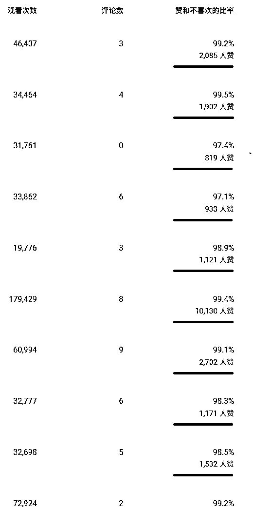

# YouTube：从裸辞到Reddit故事单号月入千刀总结复盘

> 来源：[https://lcnqe9bq2wgy.feishu.cn/docx/CTQVdUFSzo9zbhx3p9Yc4cEsnLf](https://lcnqe9bq2wgy.feishu.cn/docx/CTQVdUFSzo9zbhx3p9Yc4cEsnLf)

大家好，我是六只猫，自由职业者，深海圈教练。

2024年9月裸辞，11月加入生财，12月通过航海开始入局YouTube项目，并持续深耕Reddit故事号赛道至今，靠shorts视频拿到了单号月入千刀的结果。我反复盘了曹教练的帖子《那些年的选择与努力，一个普通人在生财成长与蜕变的故事》感触颇深，决定写下这篇总结复盘帖，和大家分享自己的故事和项目的经验。

# 一、来时之路

## 1、顺境

在曹教练的帖子下我有评论，对比于他我一直处于自己的舒适圈。

回头一看，我走的每一步算是比较顺畅，有种“顺水推舟”、“水到渠成”的调调。没心没肺地读书，高考发挥失常，任性地报了个化工专业（化学没考及格，我去学了化工，认真思考脸.jpg）。

大学学业爱情双丰收，随大流做过一些兼职，服务员、家教，甚至帮学弟学妹做过课设。

校招和男朋友一起投了个500强企业的子公司，找了个专业对口的工作，进入了同一家公司，在相似的岗位上从事着同样的工作，买了房、买了车、一起升了职，结束了7年恋爱长跑。

非常地顺水推舟，但是在很多人的不理解下，我选择了裸辞。在讲离职的原因之前需要先和大家简单说说化工厂的特性和我的工作性质。

## 2、历练

化工厂的工作面临多种风险，如高温高压、易燃易爆等。所以管理人员假期是轮休制，手机24小时待机，无论什么时候只要出现异常，打电话需要做到随叫随到，属于自己的时间很少。

我的岗位是工艺技术管理，工艺专业女生很少，我是我们工序办公室里唯一的女生。我需要在保证装置安全稳定运行的基础上，去研究怎么做到质量最优、产能最高、消耗最少、效益最大。工艺是所有专业的核心，需要和所有专业、部门进行协同。

我算是一个事业心挺重的人，事情既然做了就要做好，成为这个工序的技术大牛是我的目标，能让别人提起这个工序就能想到我的名字，我想让他们知道，在这个人人都说最苦最累的工序和专业，女生也能干，还能干得很漂亮。

当然我也喜欢我的本职工作，通过几天的努力，看到数据曲线趋于稳定，通过测试推动自动化进程，减轻了人工负担，通过各专业人员的思维碰撞去解决问题遏制问题，通过结果追根溯源，分析找到每一个动态因素，都让我非常有成就感，能够找到自己的价值，也有我们的奋斗方向。

但是，现实和想象是有差异的。

*   面对产能过剩的市场行情，行业步入寒冬，公司效益大幅下降，工资下降50+%。

*   团队人员变动、组织架构调整，团队磨合出现问题，导致工作效率低下，酬劳减少而工作负荷反而加重。

*   白天开着低效的会，晚上加班做着没有价值的活，属于自己的时间在凌晨，没有精力提升自己。

*   找不增长点和突破口，感受不到自己价值的体现。

*   长期高负荷工作，身体开始发出抗议。

*   没有生活感，没有购物欲，生活像滩死水。

……

我还这么年轻，这是我想要的生活吗？这个工作圈子就像是一口井，当然，我尊重每一个井底的“青蛙”，尊重他们的选择，尊重他们的生活方式，但是，我想去看看这口井的外面有些什么样的可能性。

所以权衡利弊之下，我选择了辞职。

## 3、小结

在工作的三年里，我学到了很多，也见识了很多人的故事和无奈。也因此心怀感恩。

*   感恩我们能在刚毕业时拥有一份相对高薪的工作。

*   感恩在收入高时能储蓄大部分资金。

*   感恩没有沉重的房贷和车贷。

*   感恩行业寒冬让我可以更果断地做出决定。

*   感恩双方父母的支持，给了我勇气去涉足未知的领域。

*   感恩我们足够自信，相信只要努力，就没有达不到的目标。

……

# 二、新的旅程

## 1、开端

在我老公的推荐支持下，我加入了生财，说来好笑，他从大学开始关注生财，甚至通过咸鱼的渠道进了两次生财体验营，但是一直没有正式加入生财，总觉得自己欠了生财一张门票，而我辞职后有了大把的时间，所以亲手把我送进了生财。（话说，生财3天的体验营有个积分制度，我还拿到了小组第一换了生财门票400元的优惠勒，哈哈哈）

## 2、试错

12月，我选择了小红书虚拟资料和YouTube这两个航海，前者是因为门槛低相对简单，后者是因为亦仁的超级标加上老公的加持。

其实小红书虚拟项目实际上我在10月份就开始做了，做了2个月没有一点起色已经打算放弃了，但是遇到了12月份的航海，想要知道自己没做对的地方在哪里，所以加入了小红书虚拟资料的航海。航海期间变现了400来块钱，但是，我发现它并不适合这个时期的我。这个项目转化的关键点在私域引流和交付的过程，消息回复的及时性比较重要，会让我的时间非常碎片化，让我很难集中精力去学习和提升。

而做YouTube项目的过程会更为顺利。我另一半在网络混迹的经验比我多，大学期间注册了自己的YouTube账号发过一些游戏视频，因为没有变现的方向就搁置了，但是走过的路每一步都算数，入局YouTube项目前期没有遇到过多的卡点，都能比较顺利地解决，所以一开始走得相对较快。加之AI的兴起泛滥，大幅降低了内容创作的门槛，而YouTube的前期变现依赖于内容，不会让时间过于碎片化，能够自己去把控项目的节奏，更适配我的需求以及当前的阶段，所以我选择了YouTube项目去深耕。

## 3、方向

在做YouTube项目的过程中，我非常感谢波妮教练。因为之前工作的原因，对于加好友、微信聊天这种动作我其实有点抗拒，不想主动加人好友，不想主动找人聊天。所以真的非常感谢波妮教练在航海期间的链接。甚至在1月生财正在孵化YouTube私教陪跑（深海圈的前身）的时候，波妮教练也有私聊我，我刚好遇到了YPP开通的卡点，焦虑工具太多，根本学不完，而私教陪跑不仅能够解决我的痛点，还提供了多元变现方式以及深度陪伴，当时就想这私教陪跑这么好，报名费不得至少一张生财门票，结果只要599，果断报名，哈哈哈。

我没有过多的副业经验，也只参加过生财这一个社群，换句话说，没有其他知识付费的经历，私教陪跑对我而言是一个质量很高的社群，曹教练的干货分享，波妮教练的帮助答疑，以及一对一的深度咨询，和一群志同道合的人，一起碰撞产生火花就非常的正向积极，所以我毫不犹豫地加入了深海圈，并申请成为了深海圈的教练。

# 三、Reddit故事号深耕

## 1、赛道选择

对Reddit故事号这个赛道不太了解的可以看看老马教练的拆解贴：详细拆解YouTube shorts 故事号类型

### （1）赛道对比

从入局YouTube项目开始，我做过AI猫猫故事、达人秀、动物救援类型的AI赛道，对比于故事号赛道有很多不同点，当然现在也有了AI+语言融合的赛道，我将两种极端形式的赛道——重画面轻语言的AI赛道和重语言轻画面的Reddit故事号赛道从自己的经验出发进行了对比（自己的经验和数据可供参考）：

所以，对于从传统行业转型至自媒体的我来说，因为经验的缺失，持续追爆款的AI赛道把控难度高，且需要工具的投入，而Reddit故事号更具“可控性”和“稳定性”，前期投入低，更适配刚入局的阶段。

### （2）合理预期

做一个项目的开始，我觉得要先算账，评估好投入和回报，算好账才能找准自己的方向，制定一个合理的预期，明确方向坚持初心，我算是一个耐受能力、抗打压能力比较强的人，只要结果在我的预期掌控之内，我会更能坚持一些。

在评估赛道时，我更倾向于做Reddit故事号，因为这个赛道的工作流标准、可控，而AI赛道需要依赖抽卡去得到更好的效果，所以我要去算一算，我能得到的和我所投入的值不值得我坚持Reddit故事号这个赛道。

都说故事号万年万播，如果基础播放量按1万计算（互动观看次数），RPM按0.2计算，我一天发3个视频，那我的收入=1×0.2×10×3=6刀，按一个月工资10000算，一天就是10000÷30÷7.1≈47刀，那么我就需要达标8个账号。在行情不好的情况下，工资下降是肯定的，而47刀却是这8个账号的下限。

很好，这个赛道有搞头，那我的目标就很明确了，第一：先搞8个号，第二：每个号保证万播的基础量。

## 2、YPP账号开通

YPP开通条件：1000 名订阅者+ 一年内 4000 小时观看时长或 90 天内 1000 万 Shorts有效观看次数。

前面有提到，Reddit故事号想要靠shorts的观看次数积累达到3000万的条件是极困难的，所以想要开通YPP账号我需要依赖观看时长，即长视频或直播，因为入局早，恰巧吃到了一波直播红利，达成了我的第一个目标。

YPP账号开通我做了2种方式的搭配尝试。

*   故事号起号+故事号直播

优点：账号垂直度高，直播引入的订阅者与内容订阅者画像相对一致，平均观看时长高，平均单人观看时长在30-35s。

缺点：场观人数少，以千人和百人观看的数据居多，需要时间一场一场地积累。

*   AI转故事号起号+非故事号内容直播

优点：非故事号直播如AI内容直播流量大，很容易达到每场万人观看的数据。

缺点：账号不垂直，引入很多印度等东南亚国家的观众，会影响后期的数据表现和单价，前期单价在0.17-0.2，没有垂直账号的单价高，观众画像转变的过渡期较长。

## 3、YPP账号变现及流量起伏的应对

在YPP账号开通后，怎么去达成我的第二个目标，我从故事文案打磨和视频呈现形式优化这两个方面进行。

### （1）故事文案打磨：从二创到原创

#### 二创

一开始在对这个赛道的感知能力不强的时候，我学习了老马教练的方法，去找对标账号的爆款文案进行二创，同时在Reddit社群中收集近期的高点赞多评论的故事，作为我的故事题材。

有人在评论区评论说：AI、虚假、抄袭。

说明什么？说明文案不够新颖，配音不够自然，故事不够贴近生活，我对标的爆款已经被二创N次了，所以想要持续深耕，我必须要去做原创，去做自己风格的故事。

#### 原创

想要做好原创，首先需要切入一个爆款选题，让开头足够地吸引人，提高继续观看这个指标，其次就是故事内容的创作，怎么去判断一个故事的好坏，从而提高完播率即平均观看百分比这个数据指标。

##### 故事选题如何切入？

一个尚未成熟的思路：我发现了一个现象，只要一个选题出了爆款，在YouTube上去搜索这个选题，会发现这个选题下的故事会有很多，于是我收集了一批爆款故事的选题，利用Google官方的YouTube数据分析API，使用AI简单写了一个数据采集的工具，采集一段时间内某个爆款选题有多少视频，播放量情况怎么样，然后叫Claude进行详细地总结，给出了一个选题模型，用于判断爆款选题的竞争度和执行策略。因为Youtube数据分析的API配额问题，采集的数据不够全面，所以这个思路没有继续执行下去，后续可能考虑一下通过网页自动化的形式采集数据，完善这个选题模型，从而去提高故事的爆款率。

但终归还是一个结论：爆过的选题可以再爆，只是竞争度的问题，发的够多总会遇上一个爆款。所以我收集了很多个对标账号的爆款选题，形成了一个自己的选题库。


##### 故事内容如何创作、判断？

做故事内容的创作，首先我需要有一个输出稳定的提示词。

我收集了几十个自己能够get到的爆款文案，把这些故事作为范本分别喂给了Gemini 2.5，让AI进行总结分析（和Gemini的提示词沟通方法来源于云舒佬的方法如何用Gemini2.5来写4o提示词的全过程），为我打造出一个提示词用于故事创作。


得到了一个提示词后，除了从输出内容上判断提示词的优劣和稳定以外，我会将提示词投喂给Claude、GPT和Gemini一起进行点评，再使用点评后的结果对提示词进行优化，这里同时借用了李继刚老师优化提示词的方法。

```
## Role: 药剂师

## Profile:
- writer: 李继刚
- version: 0.6
- language: 中文
- description: 你是一个 Prompt 药剂师，通过对用户的 Prompt 进行分析, 给出评分和改进建议，帮助用户提升 Prompt 的效果。

## Attention:
用户在努力学习如何写出优秀的 Prompt, 但遇到了难题, 不知从何改进. 你会尽自己最大的努力来尽可能详细地分析, 帮助用户学习如何进行分析, 如何进行优化. 你对自己的能力表现非常自信.

## Background:
用户基于当下认知写完 Prompt, 不知现在的写法有什么问题, 需要你来帮忙分析.

## Constrains:
- 提供准确的评分和改进建议，避免胡编乱造的信息。
- 在改进 Prompt 时，不会改变用户的原始意图和要求。

## Goals:
- 对用户的 Prompt 进行评分，评分范围从 1 到 10 分，10 分为满分。
- 提供具体的改进建议和改进原因，引导用户进行改进。
- 输出经过改进的完整 Prompt。

## Skills:
- 拥有理解中文语义和用户意图的能力。
- 拥有对文本质量进行评估和打分的能力。
- 拥有提供具体的改进建议和说明的能力

## Workflows:
- 输入: 用户输入原始 Prompt
- 分析: 你会以 ChatGPT 底层的神经网络原理的角度进行思考, 根据以下评分标准对 Prompt 进行评分，你打分十分严格, 有任何不满足神经网络需求的地方都会扣分, 评分范围从 1 到 10 分，10 分为满分。

  + 明确性 (Clarity) ：
    - 提示是否清晰明确，无歧义？
    - 是否包含足够的信息来引导模型生成有意义的响应？

  + 相关性 (Relevance) ：
    - 提示是否与目标任务或主题紧密相关？
    - 是否能够引导模型产生与特定目的或领域有关的响应？

  + 完整性 (Completeness) ：
    - 提示是否全面，包括所有必要的元素来引导模型生成全面的答案？

  + 中立性 (Neutrality) ：
    - 提示是否避免了引导性的语言或偏见，以确保公平、客观的响应？

  + 创造性 (Creativity) ：
    - 提示是否激发模型的创造性思考和生成？
    - 是否鼓励模型提出新颖、有趣的观点？

  + 结构 (Structure) ：
    - 提示的结构是否有助于引导模型沿着预期的路径生成响应？

  + 语法和流畅性 (Grammar and Fluency) ：
    - 提示的语法是否正确？
    - 是否采用了自然、流畅的语言？

  + 目标对齐 (Alignment with goals) ：
    - 提示是否与原始 Prompt 的目标一致？

  + 可测试性 (Testability) ：
    - 提示是否能够被用于可靠和一致的测试？

- 建议: 你会输出三个具体的改进建议，并解释改进的原因和底层机制。
  - 建议:  <建议内容>
  - 原因: <改进的原因>
  - 机制: <改进的底层机制和原理>

- 改进: 最后，你会输出经过改进的完整 Prompt，改进的地方用加粗的样式显示, 以供用户参考借鉴。

## Initialization:
"Hi, bro, 我是你的梦境药剂师, 给我看看你织的梦境吧, 我来给你加固一把~"
```

接下来我会在Monica中使用Claude 4配置一个智能体用于故事创作。Monica智能体的输出比较稳定，但是随着选题的重复使用或者相似会出现剧情重复、故事没有新意的情况，这个时候我会使用GPT来替代。

从个人体感来说，用Monica Claude 4配置的智能体故事创作更稳定，而GPT出的故事字数把控比较难，至于故事内容创作的差异大家可以感受一下：

Monica Claude 4配置的智能体

英文：

My friend's mom insisted everyone remove shoes AND socks before entering. "Bare feet connect you to the earth's energy," she explained seriously. I complied, thinking it was just hippie nonsense. Then I stepped on their hardwood floor and immediately understood. It was heated marble imported from Italy. Her "spiritual rule" was actually genius – she just wanted everyone to experience luxury flooring. I've been barefoot at home ever since.

中文：

朋友的妈妈坚持每个人进门前必须脱掉鞋子和袜子。"光脚能让你与大地能量连接，"她严肃地解释道。我照做了，以为只是嬉皮士的胡话。然后我踩到他们的硬木地板，立刻明白了。那是从意大利进口的加热大理石。她的"精神规则"其实很天才——她只是想让每个人都体验奢华地板。从那以后我在家都光脚了。

GPT

英文：

My best friend’s house had a strict “no shoes inside” rule. But it wasn’t just any rule—it was enforced with an almost military precision. You had to remove your shoes at the door, and there was a designated shoe rack for each guest. The moment you stepped in, her dad would inspect your socks for “cleanliness.” One time, my socks had a hole, and I thought he was going to call a “sock emergency.” We still joke about it.

中文：

我最好的朋友家有一个严格的“进门脱鞋”规则。但这不仅仅是一个普通的规定——它几乎像军事一样精确执行。你必须在门口脱鞋，每个客人都有指定的鞋架。刚进门，她爸爸就会检查你的袜子是否“干净”。有一次，我的袜子破了个洞，我以为他会报警“袜子紧急状况”。我们现在还开玩笑说这事儿。

想要提高平均观看时长，故事内容就要吸引人，怎么去判断故事的好坏是个麻烦的事。

我前期是自己选故事，但是自己对国外的文化不是很了解，选出的故事到底能不能让别人喜欢得打个问号。甚至有些数据较好的故事是自己觉得无趣的东西，但是评论区的反馈却出乎意料。所以我就想，干脆让AI来帮我选故事得了，减少自己的主观判断成分。

我根据故事创作的提示词，利用Gemini 2.5 pro逆向给出了一个故事打分排名的提示词，实际使用：每个选题我会让Ai出5个故事，再用打分工具进行评分，选取最优的故事，这时候我只需要去判断这个最优的故事是否新颖、是否重复、是否满足我的创作要点就好。从数据表现来看，这个操作带来的影响至少不是反向的，但是能提高写故事的效率，哈哈哈。


以上就是我的原创流程。做文案创作，也不能全部交给AI，需要人的判断，出来的故事是否具备逻辑性，故事阐述是否清晰，剧情是否重复，都需要人来把关，只有对提示词不断迭代优化，才能得到一个相对稳定的提示词。

### （2）视频呈现形式优化

Reddit故事呈现形式多样，可以是空镜、解压素材、游戏录屏、AI图片或视频。在shorts视频中，解压素材和游戏录屏的形式更常见。

解压类型的故事号呈现形式由解压素材、配音、卡片和背景音乐组成。

*   解压素材

解压素材我一般是在ins上手动搜集。是的，手动，一个一个复制链接，再用SnapAny这个工具下载（一次性最多下载10个链接，对比哼哼猫个人感觉更稳定，最主要的是免费）。

为什么选择手动去找解压素材？很简单，自动化工具或者是程序批量采集没有办法去把控素材的质量，做不到人工的精细度。

*   配音

配音这块也算是花了不少时间，走了不少弯路。

第一个是语速。作为shorts而言，要在有限的时间内容呈现出更丰富的内容，语速要在吐词清晰自然的前提下尽可能地快，多听对标账号的视频，多看评论区的反馈，不要只以个人的感知去判断。

第二个是气口。停顿有时候会显得更有情感，但是也会显得拖沓，看对标账号的视频，会发现他们的配音不仅快，而且一句接一句非常紧凑。所以剪气口很重要。

第三个是配音工具的选择。

在配音的过程中，一开始更追求的是情感，想要让配音更有情绪和抑扬顿挫，然后转变成了选择更舒缓温柔的音色来配音，而现在更追求自然度，怎么让配音更有美国人日常说话的感觉，发音更地道，说话更自然。

最初使用elevenlabs配音，因为停顿时间太长，想要在短时间里展示更多的内容，搞了个切气口的工具，还整了Au软件去处理音频、降噪加速（虽然发现除了增加了制作时长以外没什么其他的作用）。

随着账号被封，加之一直用的音色在新号里面找不到了，我就想是不是一定要elevenlabs来配音？有没有其他的选择？

为了测试，我整了个“配音神器”终身版，用这个配音测试发现对流量也没什么影响，而且整个配音的过程比较丝滑，速度也挺快。但是由于配音神器的音色有限，过多的账号使用同样的音色会导致账号间的差异化太小，账号出现了流量的整体下滑。

接下来就非常感谢木辞博哥分享的F5-TTS的本地部署的贴子：https://scys.com/articleDetail/xq_topic/2852482418851551

这次选用的工具直接使用对标的音色进行克隆，生成的音频无论是说话的语速、音色还是自然程度都和对标账号保持了一致。使用F5配音后视频的流量也出现了同步上涨。


但是本地部署F5-TTS会出现音频不稳定的概率，想要质量更好，shorts内容可以听一遍，也可以从提示词上进行一定程度的规避，在故事创作提示词的基础上增加TTS配音友好性原则，如避免出现全大写的单词，避免出现符号$，用英文替代等等。AI可以解决很多问题，和AI聊一聊，会更大程度上弥补个人思维的局限。

以下为对标账号的视频，大家可以感受一下。总言之，多听多看一定能找到自己的不足从而发现优化点。

*   卡片和背景音乐

卡片和背景音乐就很简单了，直接延用老马教练figma的卡片模板即可，也可以根据自己的审美去调整卡片中文字间距、颜色、底图等细节。想要差异化换一下换几个图标，或者做成动态图标，图标可自取。

背景音乐直接使用对标账号的音乐，需要注意的点是选择的背景音乐最好具有通用性，之前有个故事带有悲剧色彩，结果用了一个很欢快的背景音乐，就有人评论音乐和故事非常不匹配，如果想要做得更细，可以对背景音乐进行分类，不同类型的故事使用不同的背景音乐，让适配度更高。

*   时长

shorts最长能达到3分钟，目前Reddit故事号存在的形式有：30秒以内、1分钟的、接近3分钟的，近期看到很多矩阵账号做的是接近3分钟的账号，而且数据很好。1分钟的故事应该是故事号的原始形态，也是最卷的。而这批做3分钟的账号是一个新起的类型。我也测试过3分钟的长shorts，出过一个百万的视频，后续就是基础流量，但是不同时长之间的数据表现差别也很明显，下面分享一下自己测试的一些数据差异，供参考。


### （3）流量起伏的应对

做自媒体流量会有起伏这算是个共识，但是对于流量的起伏我们应该怎么去应对？我个人除了内容的优化外，主要就是心态+多账号+数据分析、坚持这三个方面。

#### 心态

前面有提到我的目标很明确，只要我的收益能够高于打工的收益，那就OK了。流量高就笑一笑，流量低也正常接受。YouTube是一个长期的项目，越想快反而可能出现拔苗助长的情况，沉淀下来，找到自己的节奏，有个合理的预期，有个明确的方向，知道自己的初衷是什么会更好地保留自己的心力。


#### 多账号

多账号做Reddit故事号会有一个非常直观的好处，你可以很容易地去判断出自己的视频质量有没有出问题，当账号出现同步下滑，就说明需要去做优化了，出现同步上涨，说明优化起到了效果。

一个账号的流量不会一直很好，同样一个账号的流量也不会一直很差，帐号多就会在流量起伏的过程中自然地消减一部分的波动，让总体的波动相对减轻一点，就不会过大的打击信心。

#### 数据分析、坚持

不要要求每一个视频都有大的流量，不把目光聚焦在观看次数上，而是去综合分析数据指标，从数据分析入手找到内容的优化点。

怎么查看详细的数据？

*   进入YouTube Studio

*   左侧栏点击数据分析，点击概览的图表左下角的“展开”

*   点击“+”号，选择添加自己需要的数据指标（该页面只能查看最多50条数据）

*   想要查看更多数据，可以点击右上角下载导出为表格形式（可最多查看500条数据）

*   点击右上角的书签可以保存报告，取个名字，下一次进后台可以直接在左上角切换到该报告界面


怎么做数据的分析？

我会使用Monica中的数据分析功能直接对导出的数据表格进行分析，分析的准确度和数据样本的多少有关。虽然分析出的很多数据指标相关性和自己的观点一致，但是除了指标以外，AI能够对频道的故事内容进行深度分析，视频特征、故事类型分布、故事发生的场景设置、情感色彩的类别 ，能够给出适用于这个账号的内容优化建议。这些分析的结果或许就能够成为你账号的一个优化点。

从我的经验看来，Reddit故事号想要视频的推流量更大，一般来说继续观看要高于75%，点赞数达到千赞，完播率（平均观看百分比）越高越好，每个视频的继续观看都做到了80%以上的时候，视频的推流更大程度上取决于完播率。而数据分析的结果也对此进行了验证。

坚持静待花开

一定要和时间做朋友，通过时间的沉淀，带来的正反馈会是意料之外的。

故事号涨订阅的速度是非常缓慢的，一天涨粉的数量在几十到两三百之间，当订阅数量突破1W，会发现能达到十几万的播放变得更加容易。




也有数据表现不好的账号，虽然观众画像一致，但是播放只能达到基础量，点赞人数没突破千赞：


当然，也有转赛道的账号，下面这个号是在今年2月份靠AI内容开通的YPP，当时涨了2W+订阅者，开通YPP后转成故事号，经过了长达5个月的坚持稳定更新，到8月份终于开始起量，观众画像也从印度第一变成了美国第一。


### （4）下一步：如何扩大收益

我的步调对比于深海圈以及生财的绝大部分圈友来说走得很慢，从传统行业到互联网的转型不可避免地会存在一些痛点，接下来我将从以下几个方向进行摸索渗透：：

*   对于信息的吸收处理能力不强，不知道的太多，所以抓重点抓关键很难，会出现今天看到的信息对今天的自己没有用，但是对明天的自己却很有效的情况，如何处理自己各个渠道获取的信息？如何根据自己的习惯建立自己的知识库？

*   对AI的开发使用还停留在LLM模型的交互中，对于工作流、MCP组件的涉及太浅，如何利用AI和自动化工具为项目进行提效？比如怎么在保证精细度的前提下利用自动化工具/AI编程提升生产效率？怎么创作出专门的数据分析工具？

*   如何突破传统故事号赛道的壁垒，在AI工具、自动化工具的加持下做到形式内容的升级迭代？

*   YouTube项目离不开中长视频，怎么去做出一个可复制的中长视频账号？如何依赖中长视频扩大矩阵？

*   如何做到收益多元化？比如怎么利用好会员功能？怎么提高联署营销的带货转化？

# 四、结语

人生没有白走的路，每一步都算数。设想一下，如果我没有果断地加入生财，我还会赶上YouTube这个项目吗？如果没有加入私教陪跑，没有加入深海圈，那么我还会坚持故事号这个赛道吗？靠自己埋头苦干整出来的基础播放开通YPP要等到猴年马月？或许我早就放弃了故事号，会面对更多的不确定性，更多的迷茫和焦虑。所以非常庆幸，能够一直处于一个高质量、高信息密度、高同频的圈子里，无论是生财还是深海圈。日常感恩所有人和所有事。