# 小红书虚拟店，冷门虚拟品方可速成（共4套方法）

> 来源：[https://tvwjtflpi4w.feishu.cn/docx/TCrxdLajPoj2eSxGDnicna29nMb](https://tvwjtflpi4w.feishu.cn/docx/TCrxdLajPoj2eSxGDnicna29nMb)

# 一：何为冷门虚拟品 ？

何为冷门虚拟品？

主要体现在两个层面：第一个竞争对手少，第二个容易出单。

但是我认为，既然是做小红书虚拟这个领域，那么还应该再加上一点，那就是利润高。

竞争对手少很容易理解，买家搜索同样的一个产品词以后，卖的商家非常少，如果此时买家想要买，他只能在你这店里买，这样就会很容易出单。

为什么我要加上第三点利润高？

因为利润低了去做，体现不出冷门产品的优势点。

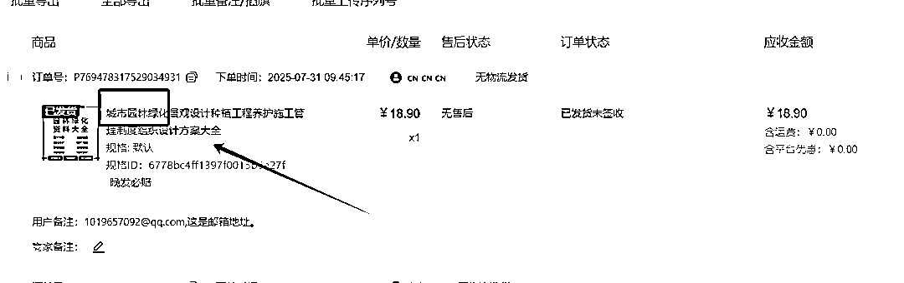

比如上方，我店出单的这个款：城市园林绿化景观设计。

这个款妥妥的冷门虚拟品，当时也是按照我内心选择冷门虚拟品的思路走的，选上后也没太在意，后来每天出单，有时候一天出两三单。

你们细想下，就这个品，你们按照常规的市面上的那些教你们选品的方法，你能选到这个吗？选不到的。

再加上既然叫做竞争对手少，买家要买有需求，他没得选，他只能在你店里买的。

既然这样为什么不卖高价呢？

其实有点类似于你买一件艺术品，艺术品为什么贵？因为很多东西都是全世界独一无二的，越是孤品越贵，原理就在这里。

再加上又是小红书这个平台，说到这来不得不对比一下小红书和淘宝，拼多多两个平台，不同的优势点。

为什么要做小红书的虚拟，而不是做淘宝、拼多多的虚拟？

拼多多虚拟，主要靠的是付费推广，同时价格也太低，卖一单可能也就几毛钱甚至几块钱。你的品如果选择不对，付费推广本身就会亏损很多。

淘宝虚拟，竞争太大，同行太多，你卖一个产品20，好不容易打出来一个爆款，同行你相信一定会出现十几的几块的几毛的，甚至有几分的都有。那作为买家他也不傻，同样的东西他为什么不买别人几毛的而买你？

但是小红书虚拟就不一样了，同样的品，小红书上可以卖高价，比如18.8 ，28.8。如果一些冷门产品，甚至可以买到100的。

# 二：选冷门品更容易出单

一谈到做小红书虚拟，很多人一上来就去做一些竞争比较大的。

比如说一些学科类，K12类的资料，还有教师资料，公务员资料，包括幼儿园的衔接资料，小学初中高中的资料等等这些。

不是说这些领域不能做，我们在做的时候保持一个原则：在红海当中选择蓝海。

这些都是热门的大类，就相当于你在一个菜市场，大家卖的都是萝卜白菜，你想想看这个时候开一个档口，你如果也是去卖萝卜白菜的话，你要问一下你自己，买家为什么要买你？

是你萝卜个头更大？还是你这个白菜价格更便宜？

所以我们站在用户的角度，来思考问题时就知道此，时我开一个档口专门卖淮山，长此以往，买家他有这个需要的时候，他首先考虑的是你这个，这就叫做品牌效应，做差异化。

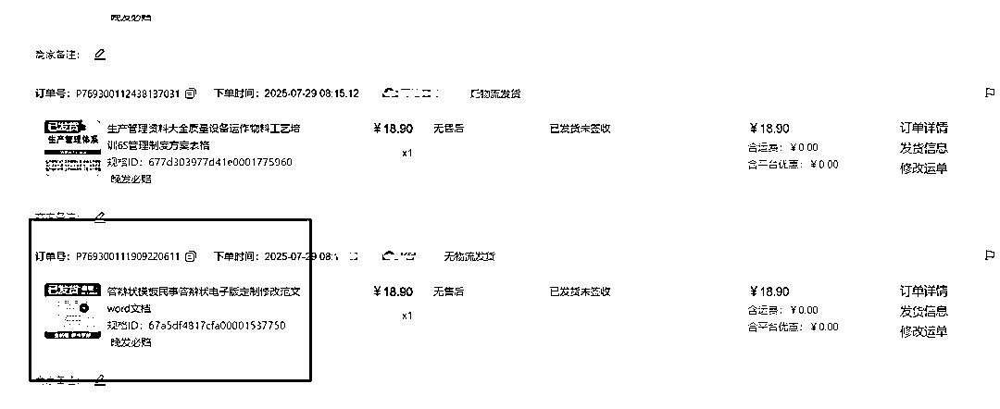

比如上方截图是我店出的一款：答辩状模板

这个款当时选的时候 ，我也是楞了一下的，我想这个品在小红书上会有人买吗？后来，现实狠狠地扇了我两巴掌，非常好出单的款，在0销量，0评价，又是卖18.9元高价的情况下，就持续出单了。

所以回到刚才的观点，冷门的虚拟品其实就是差异化选品。

而且选择冷门虚拟品，它还有一个优点，可以更容易的拿到成绩和结果，这样可以树立比较好的信心，信心才是干事业，能坚持下去的最好的动力。

所以选冷门虚拟产品其实有两个，第一个点：一开始就选冷门的类目，冷门的方向。

第二个侧重点：在红海的类目当中寻找一些蓝海的机会。

新手可能不理解我说的，我就牺牲下自己，拿我们的一个品来举例吧。

我给你们说1个我们在做的品（截图如下）

标题：对外汉语教学ppt课件HSK标准教程123456课件教师用书

这个品也是我店铺里500个品中的一个，当时上完款发完笔记后，乘风稍微带了一下，立马出单了，后续持续出单中。

# 三：商机中心选稀缺品（精准）

刚入行千万别碰教辅、教资这些镜争超激烈的赛道，大神云集，新人很难出头，还容易受挫放弃。

可以选小众的，比如特定小众领域的资料类，竞争小，更容易做出成绩。

如上截图，我店持续出单的一个款，当时就是从下面的商机中心选的。

这个地方选品的好处是，官方会根据当前市面上买家的搜索需求，和有卖这个品的链接数，做一个计算。

得出某个品是市场超级紧缺的品。

操作方法如下：在小红书店后台，有商机中心，在此处可以看到商品成长，然后点击机会类目，查看更多。

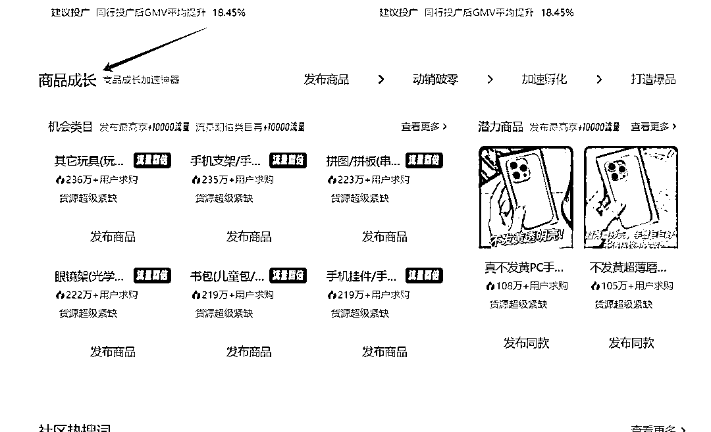

点击潜力商品，商品类目我们一般选择成人教育，或者搜索商机关键词。

可以看到很多超级稀缺的品。

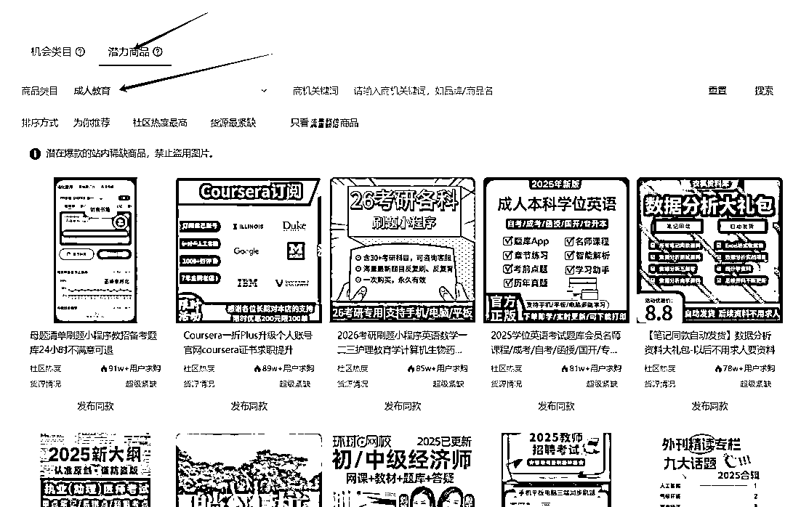

比如此处的教资笔试重点笔记，有68W+的用户求购。也有超级紧缺的红标。

如果此时，你稍微聪明一点，就可以截图去淘宝上搜同款上架了，或者搜关键词去淘宝上搜同款。

如果你是个有经验的人，就可以自己做图，照搬图上的文案即可。肤浅的是傻傻的直接搬，用原图。

聪明一点的，自己做图用原文案。

再鸡贼一点的就把整个宝贝的图，标题，文案等只保留其精髓，翻新一遍，成自己的。

# 四：差值法选冷门品（精细）

## 

方法①：淘宝上搜

就去淘宝上找，搜索主要的词，比如：模板资料，表格，文档，素材，协议，合同。。。。

就拿关键词“模板资料”举例：

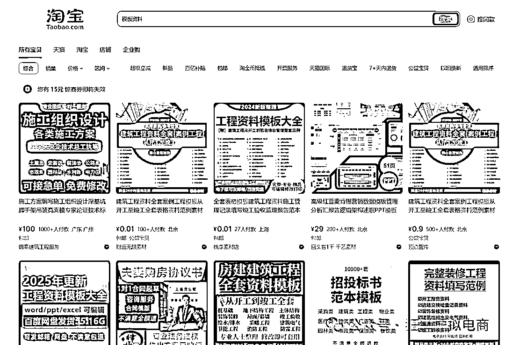

然后去分析，我认为冷门和非冷门是个相对概念，只要不是小红书上常见的几个大类的虚拟，比如K12，教师教辅，考公考学，儿童学生，英语语文等等，只要不是这几个大类的，都叫相对冷门。

比如上图中的，其实都是可以的，有人可能会疑惑为啥我搜的品，看起来都很不错，那是因为淘宝有千人千面的展现，我截图的就是我经常看的品。

因为我本身自己的店铺也要经常选品，所以会在淘宝上搜和点击收藏等。就会出现这样的，你们去搜同样的关键词测试下，肯定不是我截图的这些品。

方法②：淘宝的和小红书上的销量差值对比

### 

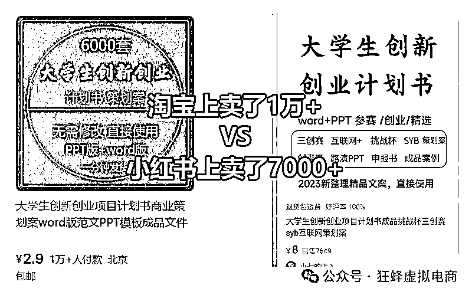

比如上方的这个品：大学生创新创业，淘宝上已卖1万+，小红书上也卖了7000+，说明了两个平台的市场已经饱和了，你才开始0销量0评价的去做这个品，很大可能要花费很大气力。

因为你已经没有了切入初期的市场红利了，小红书上同行的这个款能卖爆，要么是笔记很爆权重很高，要么是在商城端的排名权重很高，无论哪个角度看，你去做，大概率很费劲。

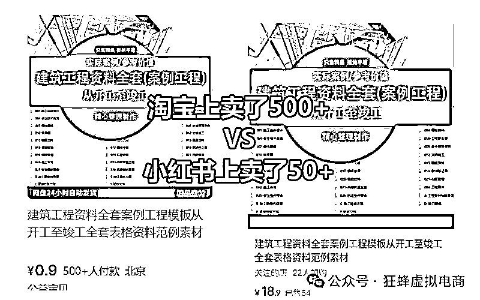

再比如上面这个品：建筑工程资料。淘宝上卖了500多，小红书上同款才卖了50多，这个差值很大，说明是有机会的，可以放心大胆上款，小红书上的标价可以定高，不要学淘宝定低价。

上完后，按照下方搞销量的方法，先把款的基础销量和评价搞好，然后铺笔记，往死里怼就行。基本上，很快就能出单。

# 五： 软件工具选品（很稀有）

这个软件不是我们开发的。所以为了避免打广告的嫌疑 ，我就马赛克下。

之前市面上还没有专门针对小红书虚拟，这个非常细分领域的选品软件。

所以，这里，我不得不佩服下这个软件的作者，还是很了不起的。因为在我看来这个软件能出来，最起码，这个作者要是个懂软件，懂编程和开发的，还要懂小红书，甚至小红书虚拟这个方向的。

会一个不难，多个都会就难了。在这个给他一个赞吧。

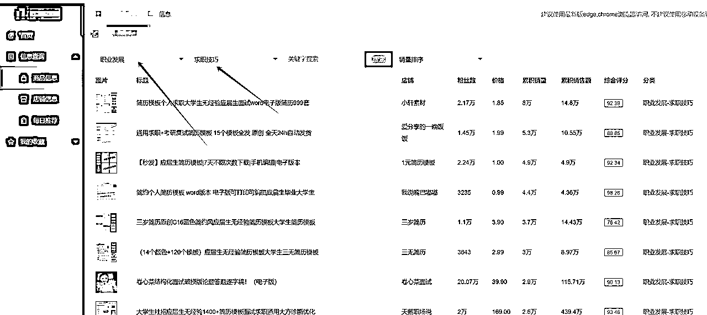

图文没办法详细演示这个软件的选品操作，只能分享个大概。

首先可以选择一级分类，比如你想知道职业方向，然后再二级分类里面的求职技巧，有哪些好款，筛选后，就可以看到很多维度。

哪个小红书店里的，哪个款，卖价多少，销量多少，销售额多少等。

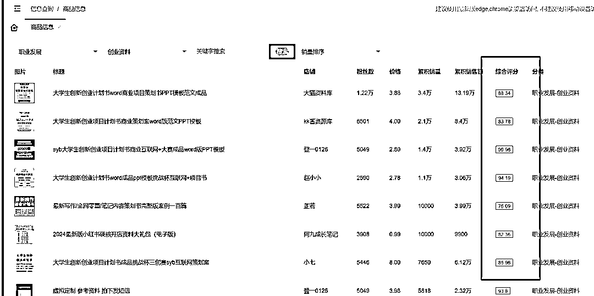

在选品的时候，如果不想太细致的看，就可以看后面的一个综合评分这个指标，这个还是不错的，评分越高越有优势。

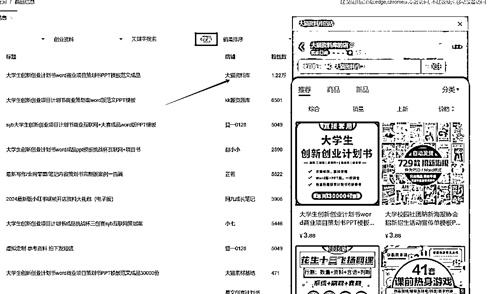

如果对某个店，某个品感兴趣，可以直接点击上面的店铺名跳转，这个很到位。

# 六：直接500个品解选品困扰

## 

但是，大家在实操的时候，又会遇到一个问题，那就是怎么选冷门品的问题，虽然上方已经将选品的方法说了，我相信在实操的时候，如果没有耐心和经验，还是会迷茫。

所以，我们自己做的时候，不会想那么多，而是直接一个店上300-500个相对冷门的品，这样即使一个不出单，也不会影响大局。

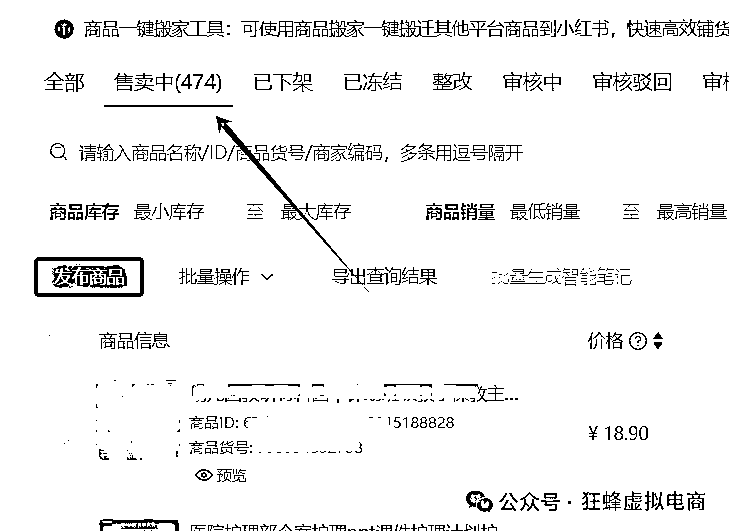

这样做的目的是提高选品成功的概率，然后后期，再把这样0销量0评价，又是卖高价的，都能自然出单的款，再去放大操作：怼销量，怼评价，怼笔记，怼乘风。

具体的，怎么搬500个品到小红书店，怎么选品，怎么一天一店发30篇笔记，怎么铺500个笔记一个店，用什么自动化软件，怎么推广，怎么优化等等。

可以翻开我之前的文章，演示的操作步骤非常的详细。

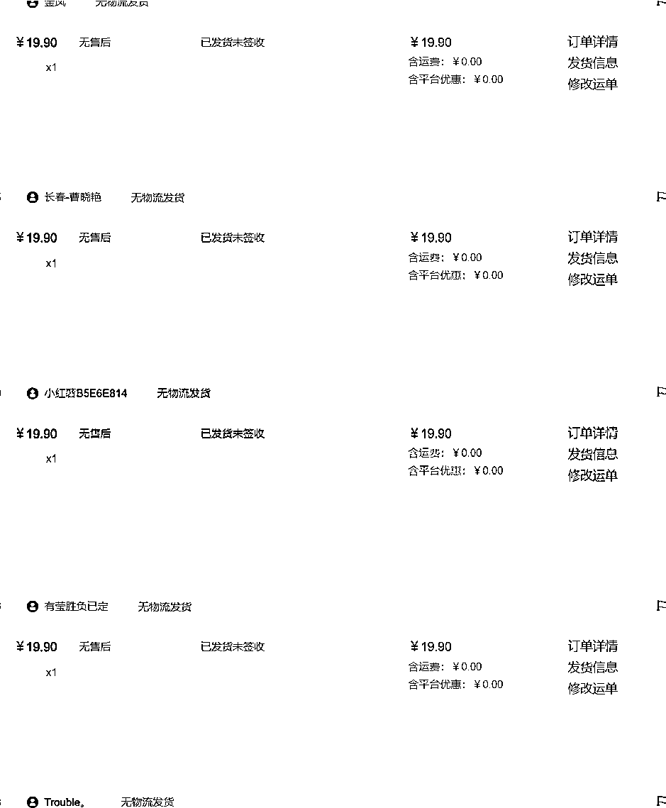

稍微有慧根的，看我之前的文章分享，可能就会做了。

做小红书虚拟店这个项目，是非常有搞头的，一是可以卖高价，二是操作会了，很快速的拿到结果。

这比你们做其他副业来说更适合。

好了，我是狂蜂，你们专注虚拟电商的蜂哥。今天的分享就到这里了。2025年与狂蜂会一起狂怼虚拟电商这个方向，咱们一起搞钱！