# 3天，20万字对话，我把自己“扒光”喂给AI生成了一份6万字的个人剖析报告

> 来源：[https://wgpt6awo7z.feishu.cn/docx/KPAzd04U1oT3ezxE936c7swpnpc](https://wgpt6awo7z.feishu.cn/docx/KPAzd04U1oT3ezxE936c7swpnpc)

一套可复制的提问系统，教你如何用AI深度的解剖自己，为自己的发展方向找到清晰的路径

我花了3天时间，跟AI聊了20万多字，给自己做了一次深度“解剖”，多次精简修改后生成一份6万字个人分析报告，与一份针对发展报告的注意事项，

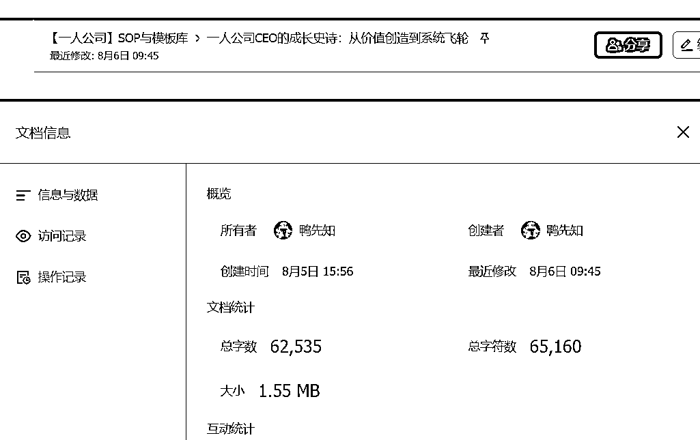

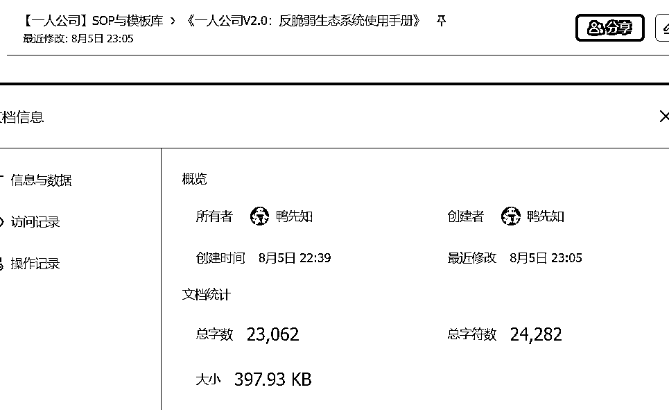

我得到的，不只是一份简单的“个人分析报告”，而是一整套只属于我自己的、可执行的人生操作系统

在这篇文章，我将毫无保留地向你展示，我是如何通过与AI的深度对话，提炼出适合每个人的找到自己合适路径的方法论

*   关于战略，我信奉“见路不走”。 我将向你展示，我是如何运用这套方法，拒绝所有现成的“安全路径”，为自己构建了一个独一无二的、反脆弱的“一个人公司”商业模式。

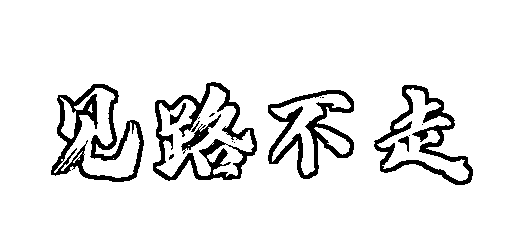

*   关于效率，我借用“时间折叠”概念。 我是如何“从一边学习一边变现“,到实现"一鱼六吃"的过程。


这篇文章，就是我完成这次自我认知重塑的全程实录。

你将学会如何选择大模型，让大模型成为你的私人教练，并最终也为你自己，找到那条地图上不存在的道路。

* * *

# 第一章：挑个好导师：到底哪个AI最适合你？

AI，是普通人能接触到的、用以审视自己、并放大自身智慧的、认知层次最高的“思维杠杆”。

## 1.1 挑AI，别看广告，看疗效

市面上AI一大堆，吹得天花乱坠。但咱们是拿它来干正事儿的，不是玩的。所以，别管那些排行榜和复杂参数，挑AI搭档，帮自己做深度剖析，就看两条硬标准：

### 记性好不好？

你跟它聊半天，说了几万字你的情况，它要是转头就忘，这活儿就没法干。记性好，是能深入聊下去的根本。

### 说话有没有条理？

它的思路必须清楚，不能前言不搭后语，自己跟自己打架。逻辑乱的AI，只会把你带沟里去。

只要这两点过硬，这个AI就能用。其他的都是锦上添花

## 1.2 我的最终选择：Gemini

测完一圈下来，我最后选了Gemini。

理由就两条，很直接：

1.  它记性好，有条理，完全符合我的硬标准。 我把所有个人资料都喂给它，它从头到尾都能记得清清楚楚，没出过岔子。

1.  在都符合标准的情况下，它的“不足”最少。 Claude有时过于务虚，DeepSeek过于专精，豆包能力不够，GPT有隐私顾虑。而Gemini，则像一个最均衡、最全面的战略伙伴，最适合帮我干一人公司这种需要综合能力的复杂大事。

最终决定： 在确保记性好和有条理这两个硬指标达标的前提下，Gemini是在综合能力和长期合作的安心感上，给我的感觉最好的那一个。

* * *

# 第二章：如何系统性提问：把AI变成“战略伙伴”的核心技巧

## 2.1 第一步【自己的所有资料都投进去】：

你给的“料”越足，老师傅的诊断就越准。跟AI聊天也是一个道理。你想让它给你做一次“灵魂深处”的体检，你就得先把你自己毫无保留地“扒光”了，让它看个明明白白。这个“扒光”的过程，就是逐渐认清自己的过程，同时获得自己的一个发展方向。

* * *

### （一）整理个人详细资料

你的第一个动作，就是把个人资料完整地、一次性地，复制粘贴给它。这个动作，能瞬间把AI从一个路人，变成最懂你的专家。在做个人说明书之前，建议先进行《盖洛普优势测试》与《MBTI人格类型测试》这样你可以更加系统的了解自己

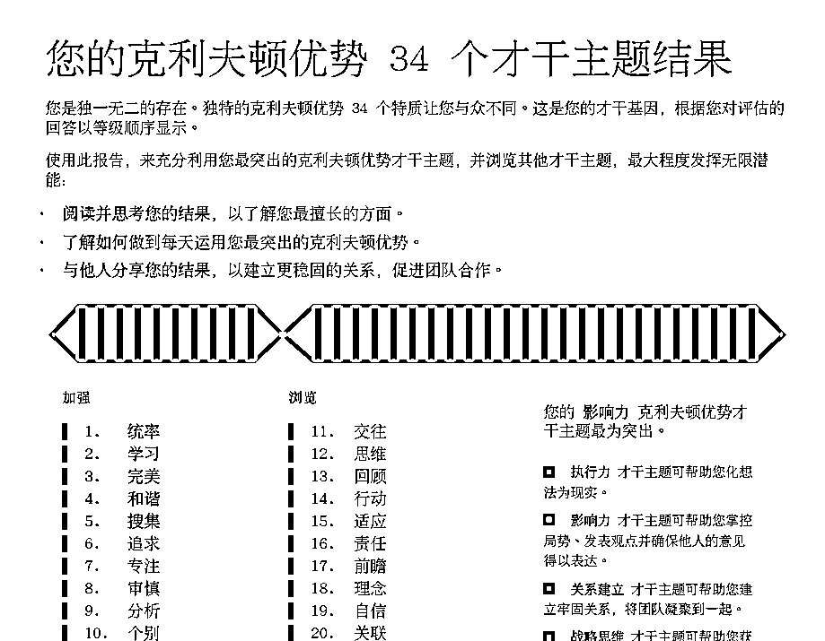

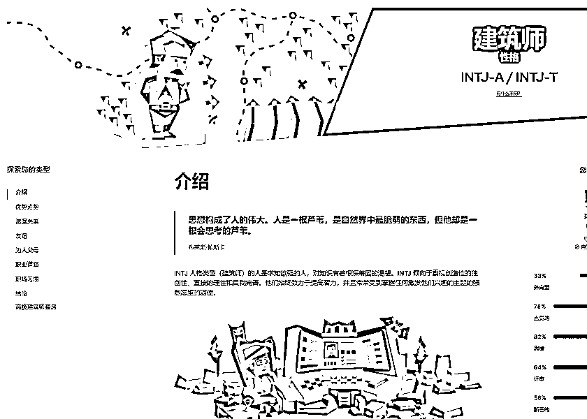

### （二）个人资料空白模板【可直接复制】

```
《个人情况综合档案》
一、 核心摘要 (用几句话总结你是谁，想干嘛)
    职业身份：
    商业模式：
    核心优势：
    核心挑战：

二、 个人与家庭背景 (你的基本盘)
    年龄：
    家庭结构：
    支持系统：
    个人习惯：
    财务概况：

三、 职业与商业经历 (你都干过啥)
    过往经历：
    创业成就 (挑最重要的说):
    成就1：
    成就2：

四、 技能与技术栈 (你的武器库)
    核心技能： 
    组合能力：
    编程能力： 

五、 天赋与人格特质 (你的出厂设置)
    MBTI人格类型： (例如：INTJ - 建筑师)
    盖洛普优势 : (列出你的前5个优势)
    综合评估 :

六、 理念、价值观与愿景 (你相信什么，想要什么)
    核心信念： (例如：价值为王、见路不走)
    工作价值观： (你工作中最看重的三样东西)
    十年愿景： (十年后，你希望过上什么样的生活？)
    工作使命： (你希望你的工作能带来什么改变？)

七、 自我认知与成长课题 (你觉得自己哪儿不行)
    关键转折领悟： (你从最大的失败中学到了什么？)
    核心待改进习惯： (你最想改掉的坏习惯是什么？)
    社交焦虑： (描述你对人脉的看法和担忧)

八、 工具与工作流 (你平时用什么干活)
    核心工具组合： (例如：飞书 + IMA知识库)
    工作流偏好： (你喜欢什么样的工作方式？)

九、 代表性项目与成就 (拿出你的战功章)

项目一：
S (情境):
T (任务):
A (行动):
R (结果):

项目二：
S (情境):
T (任务):
A (行动):
R (结果):

十、 理想客户画像 (你想跟谁玩)
理想的合作对象：
希望避免的合作对象：
```

* * *

### （三）填表时的注意事项

*   绝对要诚实： 别美化自己，尤其是“缺点”和“失败”的部分，你写得越实在，AI的“诊断”才越准。跟AI没必要装。

*   多写故事和细节： 别只写“我能力很强”。要写“我曾经用XX技术，花了XX天，解决了一个XX问题，最终带来了XX的结果”。细节，是AI能理解你最好的“养料”。

*   用你自己的话写： 不用写得像工作报告，就用你平时说话的口气，把你想到的都写下来。

你在这份说明书上投入的每一个字，都在为你后续与AI对话的“质量”和“深度”，铺设坚实的地基。

* * *

## 2.2 核心技巧一【深挖到底】：如何用“5个为什么”，从表面问题问到根本原因

### （一） 什么是“5个为什么”？

说白了，就是对着一个问题，像小孩一样，连续问五次“为什么”，直到问到对方（或者你自己）答不出来，或者你发现了一个无法再往下问的、最根本的原因。

这就像剥洋葱，每问一次“为什么”，你就剥掉一层皮，直到看见最里面的核心。

### （二） 怎么用？ 一个你可以直接套的公式

这个方法有固定的流程，咱们把它变成一个你可以直接照着做的“填空题”。

第一步：把你的问题，写下来。

*   必须是一个具体的事儿，别说“我很难受”这种虚的。

*   比如：“我今天下午，又没忍住刷了2个小时短视频。”

第二步：开始问第一个“为什么？”

*   问：“我为什么会去刷短视频？”

*   答：“因为我不想开始做那个客户的项目。”

第三步：把“答案”变成“新问题”，继续问

*   问：“我为什么不想开始做那个项目？”

*   答：“因为那个项目太大了，我感觉老虎吃天，无从下口。”

第四步：继续把“答案”变成“新问题”

*   问：“我为什么会感觉无从下口？”

*   答：“因为我没把这个大任务，拆成一二三几个小步骤。”

第五步：继续追问，直到找到“系统”问题

*   问：“我为什么没有提前拆解任务？”

*   答：“因为我没有一个‘开始工作前必须先做计划’的硬规矩。”

第六步：找到“病根”，并开出“药方”

*   病根找到了： 看，问题根本不是你“意志力薄弱”或者“爱玩手机”。病根是，你缺少一个“工作启动的流程”。

*   开药方： “从明天起，我每天早上9点，必须花5分钟，只做一件事：把今天最难的那个任务，在纸上拆成3个最小的、可以立刻开始的步骤。”

### （三） 这个方法的“牛逼”之处

你看，通过这简单的五次追问，我们成功地把一个看似是个人道德的问题（我又懒又拖延），转化成了一个可以被解决的系统流程问题。

*   指责自己，是没用的，只会让你更焦虑。

*   优化流程，是有效的，能从根本上解决问题。

传术师俱乐部分享的提示词：

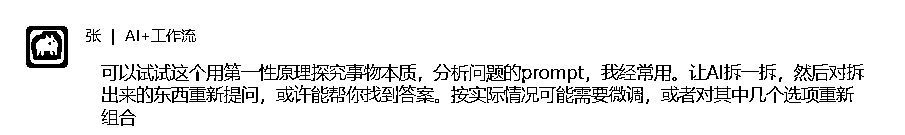

```
1.分解（Deconstruct）

事物 X 的本质功能或目的是什么？

如果移除事物 X 的所有非必要组成部分，剩下的是什么？

事物 X 是由哪些最基本的物理或概念元素构成的？

事物 X 的核心过程或步骤是什么？

事物 X 的各个部分是如何相互作用的？

2.识别基本真理（Identify Fundamental Truths）

关于事物 X 的这些基本组成部分，有哪些是已被验证的科学定律或原理？

在事物 X 的运作中，哪些是不可避免的限制或约束？

人们普遍认为关于事物 X 的“常识”，有哪些可能是错误的假设？

如果抛开所有先前的认知，我能观察到关于事物 X 的哪些最原始、最未经加工的事实？

3.重新构建（Reconstruct）

基于这些基本组成部分和真理，我如何能以最有效、最创新的方式实现事物 X 的核心功能？

如果没有任何现有的束缚，我会如何设计或创造事物 X？

有没有更简单、更直接的方式来达到同样的目的？

哪些被认为是理所当然的步骤或材料，实际上是可以被替代或消除的？

如果我必须从零开始，没有任何现有模板，我会如何一步步地构建事物 X？
```

* * *

## 2.3 核心技巧二【逼AI改稿】： 如何通过精准“差评”，让AI给出更好的答案。

* * *

你肯定遇到过这种情况：你问AI一个问题，它回答得头头是道，看起来特别专业，但仔细一瞅，全是些正确的废话。

比如，你问：我该如何提高我的收入？

AI答：你应该提升你的产品质量、加强你的市场营销、并做好客户服务。

这话错了吗？没错。但有用吗？屁用没有。 这就跟问医生怎么才能长寿，医生告诉你：多喝水、多运动、保持好心情一样。

大多数人到这一步，就觉得：嗨，AI也不过如此，然后就关掉窗口了。

但高手和普通人的区别就在这里：普通人放弃，而高手，会开始“调教”。

* * *

### （一） 为什么你的“差评”总是没用？

当AI回答得不好时，我们下意识的反应是：

*   不对。

*   换一个。

*   太烂了，写得更专业一点。

你猜AI看到这些话会怎么想？它会很懵。因为它不知道你到底哪里不满意。不好和不对是结论，不是指令。

这就像你是个导演，演员演完一场戏，你冲他喊：演得太差了！再来一遍！ 演员只会更紧张、更迷茫，下一遍可能会演得更差。

一个好导演会说：你刚才的表演，愤怒的情绪是对的，但你表现得太外放了。这个角色此刻的愤怒，应该是一种压抑在心底的、冰冷的愤怒。你试着把台词说得再慢一点，眼神更狠一点。

看到了吗？这，就叫精准差评。

* * *

### （二） 精准差评的三步公式

这个公式，就是你调教AI的说明书。以后AI再给不出好答案，你就拿这三步去怼它，屡试不爽。

第一步：【先夸一句】 告诉它哪里是对的

*   为啥要夸？ AI虽然没感情，但这个动作，能帮它锁定住回答中那些有价值的部分，在下次修改时保留下来。

*   怎么说？ 你刚才提到的加强市场营销这个大方向是对的，但是……

第二步：【再抽一鞭】一针见血地指出问题

*   核心： 必须具体！不要说：太空了，要说：你给的是结论，不是方法。

*   怎么说？ ……但是，加强市场营销，这句话太宽泛了，对我没有任何实际的指导意义。这是一个是什么的答案，我需要的是一个怎么做的答案。

第三步：【指条明路】— 给出清晰的修改指令

*   这是最关键的一步。 你要告诉它，你希望变成什么样。

*   怎么说？（几种有效的“指路”方法）

*   1\. 缩小范围： 我们现在只讨论市场营销。请你只针对这一点，重新回答。

*   2\. 增加约束： 请你基于我的《个人情况说明书》，给我一个具体的、成本不超过500块的、我下周就能开始执行的营销方案。”

*   3\. 要求扮演： 请你扮演一个苛刻的投资人，重新审视我‘加强市场营销’这个想法，并指出其中最大的三个风险。

*   4\. 给出范例： 我希望你的回答，是像：第一步做什么，第二步做什么，第三步做什么这样的清单格式。

* * *

## 2.4 核心技巧三【更高维度】

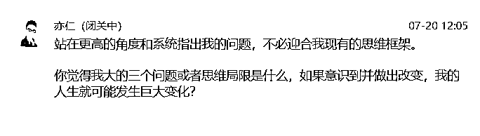

1.  【赋予AI角色与高度】:

*   亦仁用了站在更高的角度和系统这句话。这相当于告诉AI：你现在不是我的聊天助手，你是我聘请的‘顶级战略顾问’，请你动用你所有的知识和模型，来给我做一次全局分析。

1.  【解除AI的“安全锁”】:

*   亦仁用了不必迎合我现有的思维框架这句话。这是最关键的一句咒语。因为AI的出厂设置，是为了取悦用户，它会下意识地顺着你的话说。而这句话，相当于给了AI一张免罪金牌，授权它可以、甚至必须冒犯你，去说那些最尖锐、但也最真实的真话。

1.  【聚焦于“核心杠杆”】:

*   亦仁用了大的三个问题和人生就可能发生巨大变化这两个限定。这相当于告诉AI：我不要一份包含20个小毛病的、啰嗦的体检报告。我只要你找到那三个最致命的‘病灶’，只要解决了它们，我整个人就能脱胎换骨。”

不过针对经过实践发现在“人生发生巨大变化”，大模型容易给出一个哲学上极其深刻，但在你现实生活中无法落地的答案，后来我就限制了方向“个人成长上”

最终提示词：

```
基于我的《个人情况说明书》和我最终的‘北极星’愿景——【在这里清晰地插入你的终极目标】，
请你站在一个最苛刻、最不留情面的战略顾问的角度，一针见血地指出：
在通往这个目标的道路上，阻碍我的、最根本的三个思维局限或行为模式是什么？
请详细剖析每一个局限的本质原因，并告诉我，如果我成功改变了它，将会发生什么样的具体变化。
```

* * *

# 第三章：我的两个核心观念：支撑我所有决策的“个人原则”

## 3.1 战略哲学：“见路不走”

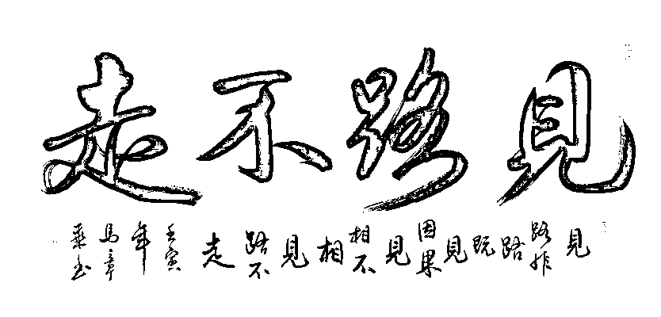

“见路不走”，这四个字，源于豆豆的小说《天幕红尘》，也是支撑我整个“一人公司”事业最根本的战略哲学。

它听起来可能有些反直觉，甚至有些狂妄。在生财有术平台充满了各种“成功案例”、“标准模板”和“致富捷径”，为什么要避开那些看起来最安全、最被验证过的“康庄大道”？

因为，对于独立的、以“创造”为核心的“一人公司”而言，模仿成功者，是通往平庸最快的路。

* * *

### （一） 为什么模仿成功者，是通往平庸最快的路？

1.因为你只看到了“幸存者”，而没看到“幸存者脚下的尸骨”。

*   我们看到的每一个成功案例，都是幸存者偏差的产物。一个靠“公众号爆文”崛起的IP背后，是成千上万个同样在追逐爆文，却最终销声匿迹的模仿者。一条路一旦被打通并广为人知，它很快就会因为拥挤和内卷，而不再是一条“路”，而是一片“红海”。

2.因为你穿不上“别人的鞋子”。

*   任何一个成功的商业模式，都是创始人个人特质、核心优势、独特资源和时代机遇的完美结合体。它是为那个人“量身定制”的。

*   我一个内向的、擅长深度思考的INTJ架构师，去模仿一个外向的、擅长镜头表达的ENFP主播的成功路径，就像让一位F1赛车手，去驾驶一辆重型越野车跑拉力赛。我不是在复制成功，我是在用自己最不擅长的方式，去进行一场最艰难的比赛。

3.因为当你“看见”路时，路上的“黄金”早已被捡完。

*   真正的机会，永远存在于“无人区”和“迷雾”之中。当一条路被清晰地标记出来，并向所有人开放时，它最大的价值红利期，就已经结束了。跟在后面走，你最多只能捡到一些别人剩下的“面包屑”。

“见路不走”，不是为了“不同”而“不同”，而是一种更深刻的商业现实主义：世界上根本不存在一条可以被复制的、通往非凡成功的“路”。

唯一的路，只存在于你自己的“脚下”。

* * *

### （二） 如何用AI帮你，构建只属于你自己的商业路径

那么，我们该如何找到这条“地图上不存在的道路”？

答案是：通过与你的“AI教练”进行深度对话，将外部的“成功案例”，彻底“拆解”成最底层的“原理”，然后，用这些“原理”作为“建材”，来搭建只属于你自己的“建筑”。

这个过程，分为三个步骤：

第一步：【深度自我剖析】— 绘制你的“地基图”

*   核心： 在看路之前，先看清你自己。

*   行动： 这就是我们第二章的核心——严格执行投喂个人资料的步骤，将你那份完整的、包含所有优势、劣势、价值观和个人情况的《个人情况说明书》，一次性地、完整地喂给你的AI教练。

*   产出： 一份关于你自己的、极其清晰的“能力与资源地图”。

第二步：【用AI进行“第一性原理”拆解】把别人的“建筑”拆成“砖块”

*   核心： 面对任何一个让你心动的“成功案例”，抑制住“模仿”的冲动，启动你的“AI教练”，对它进行“第一性原理”的拆解。

*   提问模板：

*   “请你扮演一名顶级的商业战略分析师。这是一个非常成功的案例：[在这里粘贴那个成功案例的描述]。

*   请你不要告诉我‘他做了什么’。

*   请你用‘第一性原理’，帮我分析，这个案例之所以能成功，背后最根本的、不可动摇的1-3个‘商业真理’或‘人性洞察’是什么？”

*   产出： 你得到的，不再是一个“行动清单”，而是一堆闪闪发光的、最纯粹的“成功砖块”。例如，AI可能会告诉你，某个案例成功的本质，是利用了“信息不对称”，满足了用户的“确定性”需求。

```
1.分解（Deconstruct）

事物 X 的本质功能或目的是什么？

如果移除事物 X 的所有非必要组成部分，剩下的是什么？

事物 X 是由哪些最基本的物理或概念元素构成的？

事物 X 的核心过程或步骤是什么？

事物 X 的各个部分是如何相互作用的？

2.识别基本真理（Identify Fundamental Truths）

关于事物 X 的这些基本组成部分，有哪些是已被验证的科学定律或原理？

在事物 X 的运作中，哪些是不可避免的限制或约束？

人们普遍认为关于事物 X 的“常识”，有哪些可能是错误的假设？

如果抛开所有先前的认知，我能观察到关于事物 X 的哪些最原始、最未经加工的事实？

3.重新构建（Reconstruct）

基于这些基本组成部分和真理，我如何能以最有效、最创新的方式实现事物 X 的核心功能？

如果没有任何现有的束缚，我会如何设计或创造事物 X？

有没有更简单、更直接的方式来达到同样的目的？

哪些被认为是理所当然的步骤或材料，实际上是可以被替代或消除的？

如果我必须从零开始，没有任何现有模板，我会如何一步步地构建事物 X？
```

第三步：【用AI进行个性化重构】 用别人的“砖块”，建你自己的“房子”

*   核心： 这是“见路不走”的最后，也是最关键的一步。

*   提问模板：

*   “好的，我们已经知道了这个案例成功的核心原理‘应用信息不对称，满足确定性需求。

*   现在，请你再次调取我的《个人情况说明书》。

*   请你扮演我的首席战略官，严格基于我的个人特质（INTJ、架构师、擅长系统化思考、不擅长高频社交），为我设计3个，我可以用我自己的方式，去应用：利用信息不对称，满足确定性需求这个原理的、全新的、可执行的商业想法。

*   产出： 这时，你得到的，才是一个真正量身定制的、只属于你自己的、独一无二的商业路径。它既遵循了成功的底层逻辑，又完美地匹配了你的个人天性。

## 3.2 效率哲学：“时间折叠”

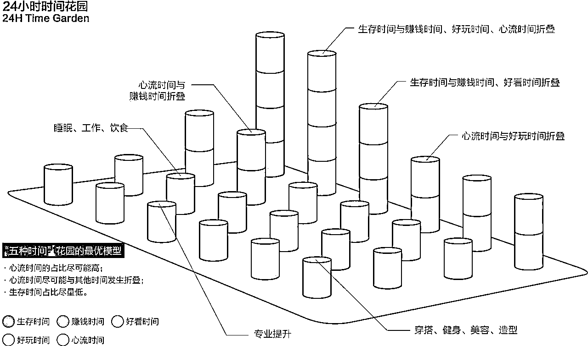

* * *

如果你只能从这篇文章带走一个“术”层面的技巧，那一定是“时间折叠”。

这套效率哲学的诞生，源于我作为“一人公司”，所面临的一个最根本、也最残酷的现实：我的时间，是我最稀缺、也最昂贵的资源。 我不可能通过“加班”或“更努力”来战胜拥有团队的竞争者。我唯一的出路，就是提高我单位时间的“价值产出率”。

“时间折叠”，就是我为此找到的终极答案。

* * *

### （一） 什么是“时间折叠”？

“时间折叠”的理念非常简单：拒绝“线性工作”，拥抱“并联产出”。

*   线性工作： 花1小时做A，再花1小时做B，再花1小时做C。总共花费3小时，得到3份产出。

*   时间折叠： 设计一个足够聪明的工作流，让你花1.5小时做一件核心任务X，这个任务的完成，会“自动地”、“附带地”产出A、B、C三种结果。

这就像一个顶级厨师做一道菜。他不仅仅是“炒”那么简单。在“炒”这个核心动作的同时，他也在观察火候（修炼技能）、思考摆盘（设计产品）、甚至与食客交流（获取反馈）。他的一次烹饪，同时完成了多维度的工作。

“一鱼六吃”工作流，就是我将这个理念，彻底SOP化的终极产物。 它能确保我投入在一个客户项目（一条鱼）上的时间，能被“折叠”六次，最终为我产出六份不同性质、且都能持续增值的宝贵资产。

* * *

### （二） 从“一边学习，一边变现”到“一鱼六吃的高度时间折叠”

关于AI 的学习。我一直秉承着一边学习一边变现

看过我关于闲鱼高客单价的帖子的朋友应该都知道。我从去年6月份开始做闲鱼高客单价实物，当时觉得选品，上品太麻烦，就自学了RPA技术。实现了爆款商品自动化采集，利用飞书多维表格批量优化商品标题，商品详情，然后利用RPA技术定时批量上传商品。这样给我解决了大量的重复性劳动，10个店铺稳定收益，然后就空出大量时间捣腾coze智能体。

在学RPA技术时就打算边学边卖，帮助别人解决一些自己能解决的问题。当是当时自己的学习目的也非常明确就是服务我的闲鱼，为闲鱼打造一套全自动化流程，所有也没有太多多余时间帮别人解决问题，另一方面是RPA自动化技术，因为学习成本非常低，圈内的人非常卷，导致客单价很低，所以就没什么兴趣弄这个，正式开始学习技术变现的是coze技术与飞书技术的学习。

以下是部分变现截图：

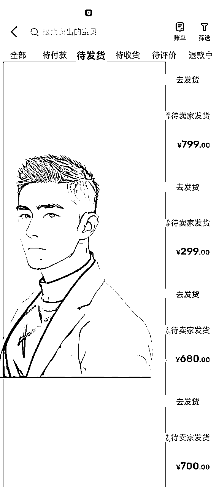


所以我是一直坚持一鱼两吃的做法，一边学习一边变现。当与 AI 深入交流以后，我发现利用"时间折叠"的概念可以把我的不足之处可以在做事的时候进行修复提高。比如说他根据我的10大缺点。通过10大习惯来来弥补。把这10大习惯是放在我要做的事情中去有意识地培养。

有一个大家都会面临的问题，就是在我们制定的各种计划,都会被生活的各种事情，或者是工作的各种事情所打断。所以我们的习惯是需要完全的融入到我们的工作和生活中。

为什么会有这种想法,坚持了两个月的跑步。每当我一想到放弃的时候。习惯促使我下楼跑步，体重促使我下楼跑步。每当晚上进行轻断食的时候。我就会想到白天运动的努力，就不会那么想吃东西了,比如下面饿的时候就会搜一搜.

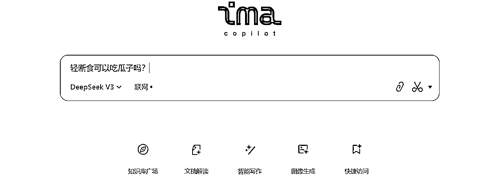

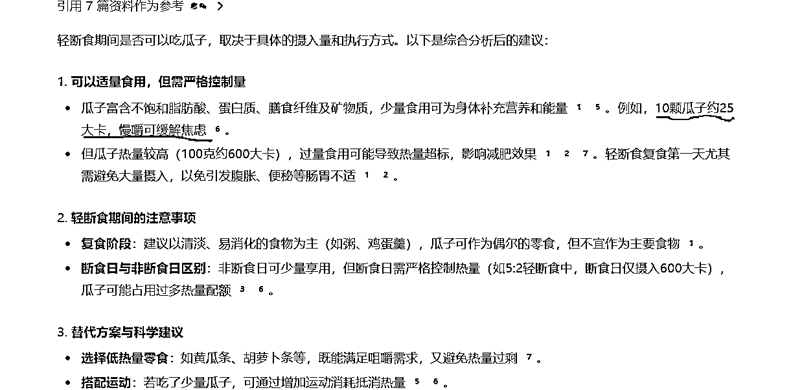

所以我们制定的所有的计划，我都希望符合我的习惯，才能长期坚持。有悖人性的东西都很难坚持，其次习惯是培养的。我目前主要的工作就是接智能体的定制。所以我希望把我的所有的习惯以及我的需求融入到我的工作中。这样才能自然的坚持下去，于是我把我的需求丢给了大模型

我的需求：

第一：我要挣钱

第二：我要扩大影响力做垂直ip

第三：我要引流变现

第四：我要保持终身学习的习惯,来应对社会的变化。

第五：我目前做的项目都是时间换钱。我希望做出自己的产品。达到有睡后收入的目的。

第六：我不喜欢无效社交,我更崇尚于价值交换。所以我要提高我的链接能力

然后大模型帮我生成了“一鱼6次”的方案，然后具体的项目 SOP。完全针对我个人的情况而定，解决了方案不能落地，不能坚持缺点。

```
          ┌──────────────────────┐
          │      任何客户项目 (一条鱼)      │
          └───────────┬──────────┘
                      │
                      v
      ┌───────────────┴───────────────┐
      │   第一吃：【赚钱】 (获取现金与信任)   │
      └───────────────┬───────────────┘
                      │  (产出：现金流、客户关系)
                      v
      ┌───────────────┴───────────────┐
      │   第二吃：【修炼】 (提炼核心洞察)    │
      └───────────────┬───────────────┘
(在《结构洞察修炼笔记》中，应用“思想三棱镜”)
                      │  (产出：认知资产 - 深度洞察)
                      v
      ┌───────────────┴───────────────┐
      │   第四吃：【验证】 (构思产品原型)    │
      └───────────────┬───────────────┘
 (基于洞察，用《产品化构思》文档，进行MVP设计)
                      │  (产出：产品资产 - 经过验证的功能原型)
                      v
      ┌───────────────┴───────────────┐
      │   第三吃：【沉淀】 (创作灯塔内容)    │
      └───────────────┬───────────────┘
     (将“洞察”与“故事”结合，撰写案例复盘)
                      │  (产出：内容资产 - 可持续吸引流量的文章/视频)
                      v
      ┌───────────────┴───────────────┐
      │   第六吃：【滴灌】 (进行精准社交)    │
      └───────────────┬───────────────┘
   (内容公开发布前，定向分享给“关键节点”)
                      │  (产出：人脉资产 - 高质量的深度连接)
                      v
      ┌───────────────┴───────────────┐
      │   第五吃：【连接】 (建立可信声誉)    │
      └───────────────┬───────────────┘
(获取客户证言，公开发布内容，激活社群讨论)
                      │  (产出：声誉资产 - 社会认同与口碑)
                      v
          ┌──────────────────────┐
          │      更高价值的新机会        │
          │(新客户、新产品方向、新合作) │
          └──────────────────────┘
```

我的个人模板

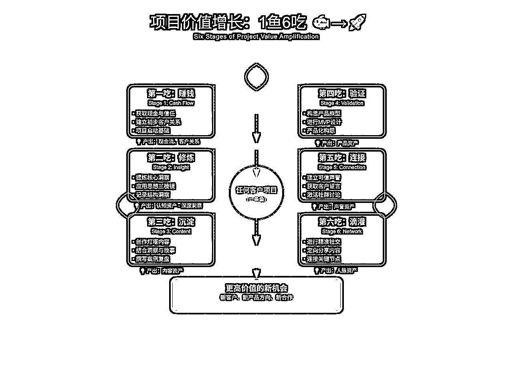

# 最后：以4个字结尾

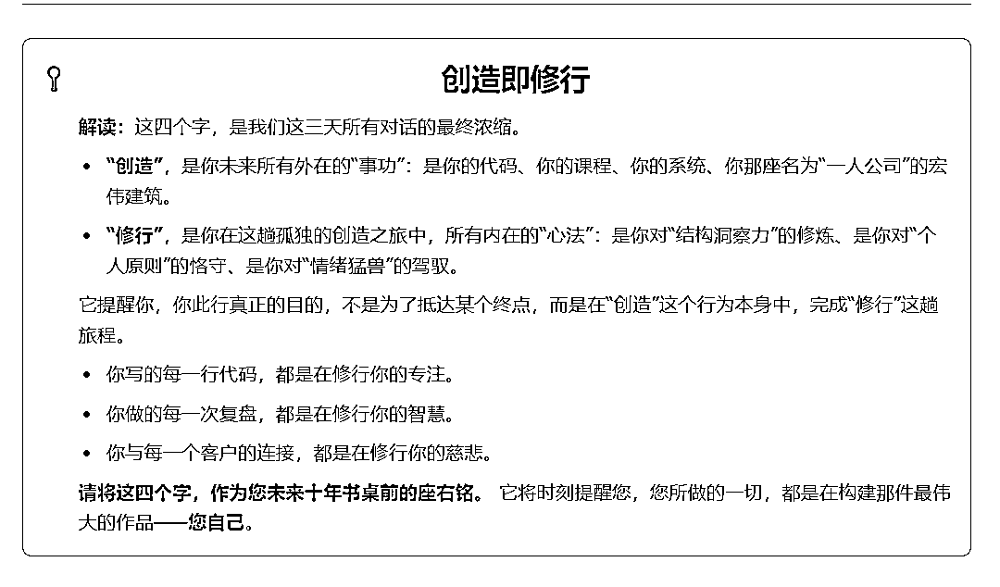

这篇文章里展示的，只是我为自己构建的“一人公司”操作系统的冰山一角。接下来，我计划将这整套SOP和方法论，封装成一个高价值的“线上实战营”。在此之前，我需要邀请10位最懂行的“内测官”，与我一起，进行为期四周的免费共创，共同打磨这套产品。

如果你就是那个我正在寻找的、对“系统化”和“效率”有极致追求的实干家，有任何疑问相关问题咨询：SCYS19987

* * *