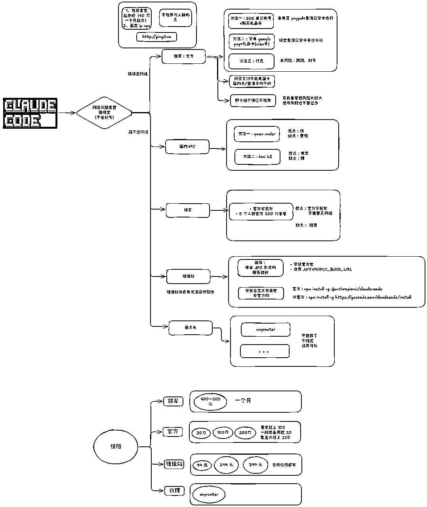
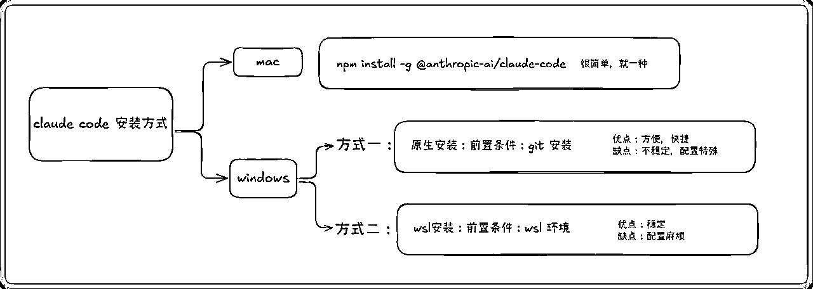
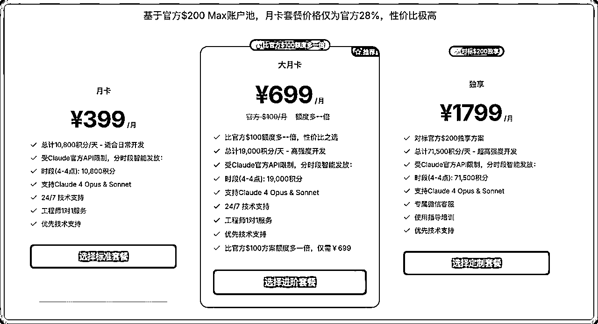
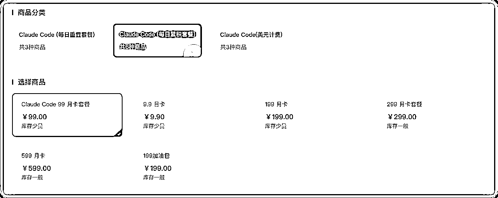
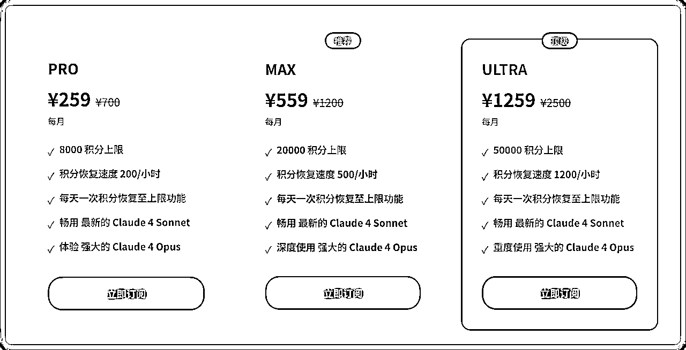
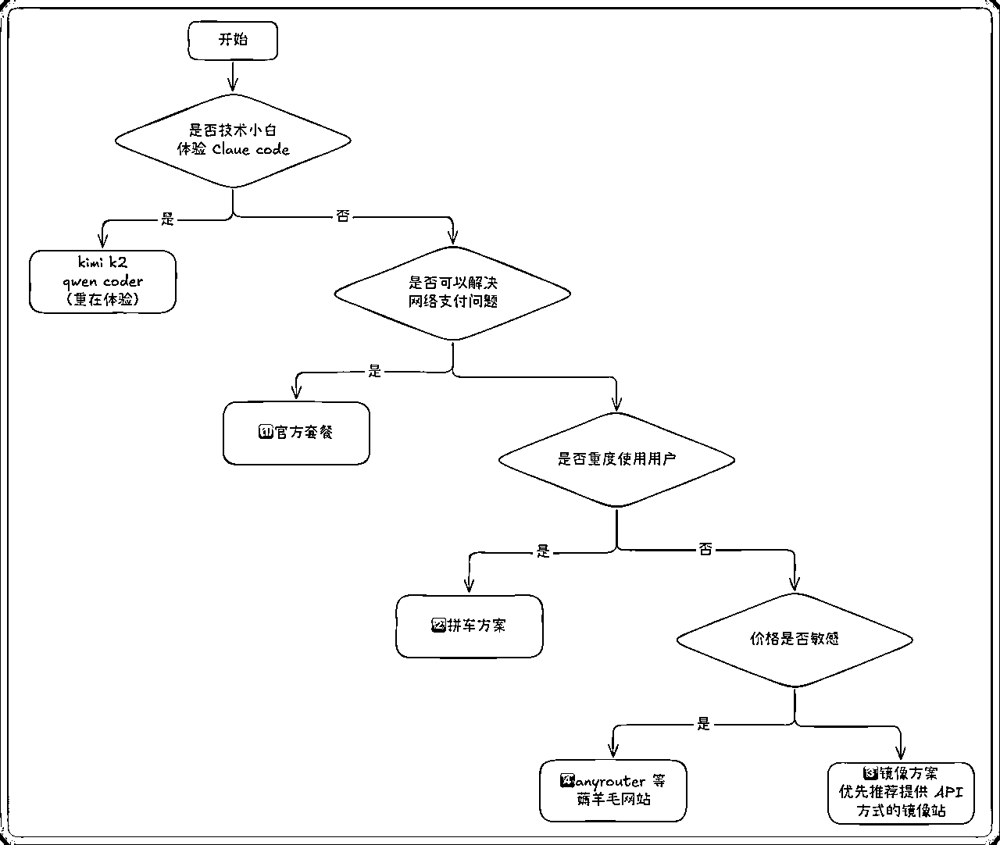

# 5分钟搞懂Claude Code使用门槛！小白也能选对适合自己的方式（附官方订阅方式）

> 来源：[https://sqm685cmohb.feishu.cn/docx/HGiZddt3toXQayxaOkIcxtkNnnh](https://sqm685cmohb.feishu.cn/docx/HGiZddt3toXQayxaOkIcxtkNnnh)

大家好，我是志辉，10 年大数据架构，现专注 AI 编程。

哈哈哈，朋友们！昨天又有小伙伴私信我，说想体验Claude Code，但是看到网上各种教程眼花缭乱，完全不知道选哪个。

说实话，现在开始接触Claude Code 的话，信息很多，镜像站、API、各种代理...这都是啥呀？

今天就给大家理一理，Claude Code到底有哪些使用方式，怎么选最适合自己的。

一图胜千言，整整花了一个小时画的图。



# 先来点解释

这里先来解释下API 的方式，和自定义安装包的方式有什么不一样

需要普及下常识，现在各种镜像站鱼龙混杂。

## 方法一：自定义安装包

比如安装如下命令的.

那么都是用镜像站自定义安装包的方式。

这种方式，镜像站提供服务商会魔改官方的安装包，比如需要请求自己的网络服务

改的过程中，可能会引起其他的一些问题，平常用可能感受不到，有些情况可能就会出现问题。

```
# mirror code
npm install -g https://mirror.o3pro.pro/install

# gac
npm install -g https://gaccode.com/claudecode/install

```

官方的安装命令：

npm install -g @anthropic-ai/claude-code

## 方法二：使用 API

官方除了使用账号登录外，还可以使用 API 的方式使用。

只要你的 API 符合官方的参数和响应，那么就可以使用。

比如现在常见的国内的 kimi k2 和 qwen coder。

当然有些镜像站也提供这种方式。

这种就是使用 API 的方式，官方也提供，其他的你可以理解为第三方提供的。

只不过第三方提供的有大厂商的，比如 kimi k2、qwen coder 这种

还有就是镜像站提供的收费的。

当然也有薅羊毛等提供的 anyrouter 等。

```
export ANTHROPIC_BASE_URL=https://api.moonshot.cn/anthropic
export ANTHROPIC_AUTH_TOKEN=your_api_key_here
```

| 使用方式 | 优点 | 缺点 |
| 方法一：自定义安装包 | 安装方便，不需要什么配置 | 会有些隐形的问题，比如不能搜索网页 |
| 方法二：使用 API | 官方安装包，不会有什么其他问题，完美匹配。 | 配置稍微复杂 |

# 安装方式

这里特别说下是 windows 的按照方式。

还是先看图



mac 没有什么好说的，直接安装就可以。是特别友好的。

那么我们看 windows，为什么，这么复杂了？

因为 claude code 是 CLI 工具，刚出来的时候，只针对 linux 环境，为什么了 ？因为他要用 grep 等这些工具。

这些工具在 windows 上是没有的。

好的，为啥又要支持原生了，因为 wsl 环境这个很多人搞不定，并且配置起来也复杂，比如和 ide 结合的配置，mcp 的调用。

好了，有了原生支持，我们可以看到其实有 git 的存在，这个原理还是因为他调用的还是 Linux 的工具，git 安装的时候会安装

是因为 git 安装的时候，安装了MinGW-w64的环境，也是 windows 上可以支持 Linux 的一个东西。

所以我的最后的推荐：还是 wsl 上使用claude code

毕竟刚出来，有些原生还不太稳定。

还有缺点：安装 mcp 命令是需要添加特殊关键字，不然安装不成功，下面的蓝色字就是特殊添加

如：claude mcp add playwright -s user -- cmd /c npx @playwright/mcp@latest

# 具体配置：API集成方式

这里再说下配置 API 的方式。这个也是推荐大部分先用起来的方式。

不需要环境，不需要耗费大量的钱（qwen coder 除外）

### K2

配置步骤：

mac 配置：

```
# 1\. 安装Claude Code
npm install @anthropic-ai/claude-code

# 2\. 配置API endpoint
export ANTHROPIC_BASE_URL=https://api.moonshot.cn/anthropic
export ANTHROPIC_AUTH_TOKEN=your_api_key_here

# 3\. 启动服务
claude
```

windows 配置：（注意使用黑色的 cmd，而不是蓝色的 powershell）

```
set ANTHROPIC_AUTH_TOKEN=your_api_key_here
set ANTHROPIC_BASE_URL=https://api.moonshot.cn/anthropic

```

如果是修改配置文件：

```
{
  "env": {
    "ANTHROPIC_BASE_URL": "https://api.moonshot.cn/anthropic",
    "ANTHROPIC_AUTH_TOKEN": "your_api_key_here"
  }
}
```

### Qwen Coder

配置示例：

mac 配置：

```
# 1\. 安装Claude Code
npm install @anthropic-ai/claude-code

# 2\. 配置API endpoint
export ANTHROPIC_BASE_URL=https://dashscope.aliyuncs.com/api/v2/apps/claude-code-proxy
export ANTHROPIC_AUTH_TOKEN=your_api_key_here

# 3\. 启动服务
claude
```

windows 配置：（注意使用黑色的 cmd，而不是蓝色的 powershell）

```
set ANTHROPIC_AUTH_TOKEN=your_api_key_here
set ANTHROPIC_BASE_URL=https://dashscope.aliyuncs.com/api/v2/apps/claude-code-proxy

```

如果是修改配置文件

```
{
  "env": {
    "ANTHROPIC_BASE_URL": "https://dashscope.aliyuncs.com/api/v2/apps/claude-code-proxy",
    "ANTHROPIC_AUTH_TOKEN": "sk-e32d40fb8c3b4653a75860667935d760"
  }
}
```

# 官方订阅方式

当然如果你可以搞得定网络的话，支付方式这里我也讲一下

国内信用卡/visa/运通卡

香港卡

直接在 claude 的网页上是不行的。需要美国卡或其他地区的卡

## 方式一：安卓+google pay（礼品卡）

条件：安卓机（推荐 google pixel）、

我家里的荣耀反正是不行了，我海鲜市场买了 pixel 2，大概 250 左右。原生谷歌系统。可以使用。

群友验证：一加是可以的。

支付方法一：google pay 支付

我绑定的是香港的众安卡、天星银行等卡（这些卡肉身去香港就可以开，很方便。）

我看群友也有绑定国内银行卡的 visa 或 运通卡成功的，应该支付也是没有问题。

支付方法二：礼品卡

当然也可以去买礼品卡，我之前使用过的网站是可以买礼品卡的。

https://www.seagm.com

## 方式二：IOS+礼品卡

条件：ios 手机、美区账号

支付方法二：礼品卡（推荐）

当然也可以去买礼品卡，我之前使用过的网站是可以买礼品卡的。

https://www.seagm.com

也可以支付宝购买，网上搜索就可以找到。

支付方法一：apple 支付

美区的 apple 支付不直接支持国内卡和香港卡。

的转个弯。

美区的 apple 账号可以绑定美区的 paypal，美区的 paypal 是可以验证香港众安银行卡的。

注意：美区 paypal 需要使用美国电话卡（实体电话卡），不然也很容易封号。

上面讲的都是 claude app 上订阅

20 刀套餐无税，实际支付：20 刀

100 刀套餐，实际支付是：125 刀

200 刀套餐，实际支付是：250 刀

所以，官方的方式比较难，app 上目前是目前可以支付跑通的方式

网页的支付要么就海鲜市场代付（风险高，虚拟卡等，跑路风险），要么可以找自己朋友有卡的支付。

另外，还有说明，现在 AI 产品更新迭代速度太快，不太建议年订阅，除非你有钱，可以，不然建议还是月订阅吧。（最近应该很多退订 Cursor 年订阅的用户吧）

# 镜像站

这里也罗列下我目前知道的镜像站

所有地址不带推荐码，纯属个人意见

还有每家的积分使用方式不一样，需要弄清楚基于什么消耗积分的。

## mirrocode

新出来的镜像站

支持官方的 API 方式，也是我推荐的，便宜，还可以用官方包。性价比目前居前列。就是刚出来，有些许不稳定

目前价格 230，基本 sonnet 模型够用。

## gaccode

地址：https://gaccode.com/

这个相信大家也知道了。我之前也用过

价格有 299、399 档位

## aicodewith

地址：https://aicodewith.com/



## sssaicode

地址：https://sssaicode.com/

也支持官方 API 方式

套餐很多



## aicodemirror

地址：https://www.aicodemirror.com/

也支持官方 API 方式



# 那么问题来了：到底选哪个？

按照下图的流程来我觉得就可以

选好方式后，剩下就看具体方式有哪些要求，按照要求去做就行。



# 写在最后

其实不管选哪种方式，关键是要开始用起来！

我见过太多朋友，研究了半天哪个工具好，结果一个都没试...

说干就干，先选一个用起来，用的过程中自然就知道什么最适合自己了。

好了，今天的分享就到这里。

安啦，各位！