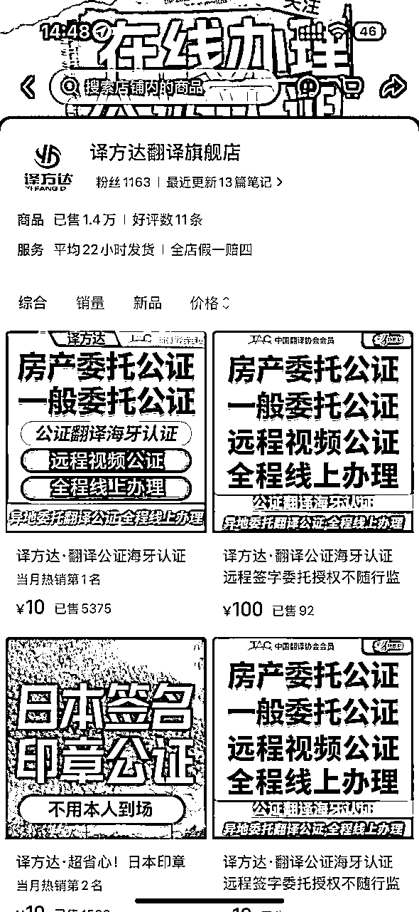
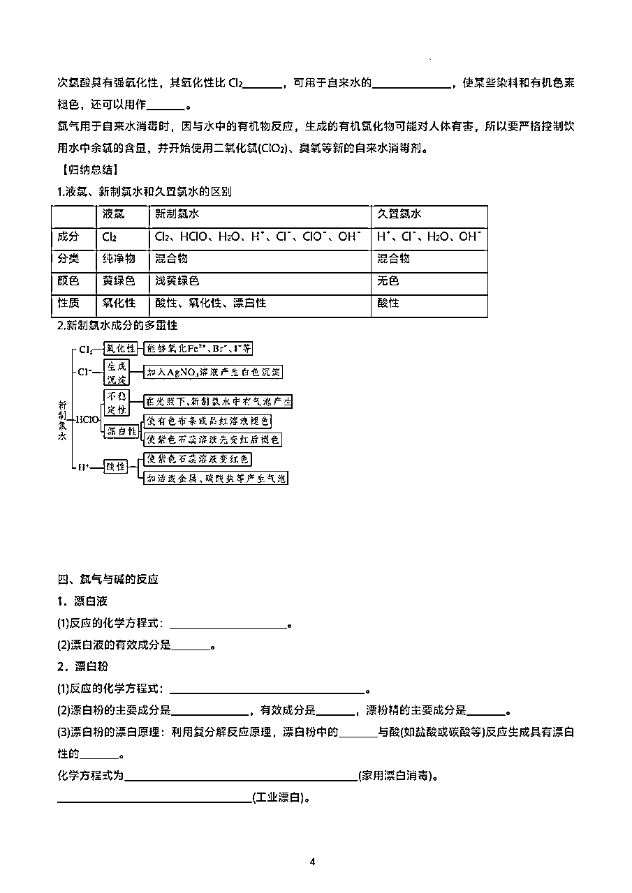
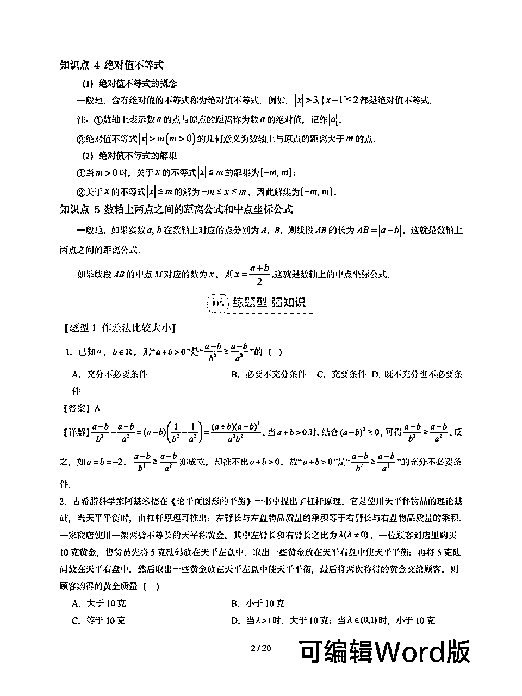
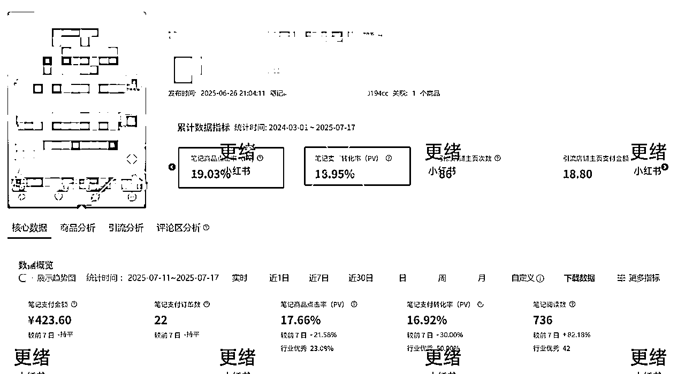
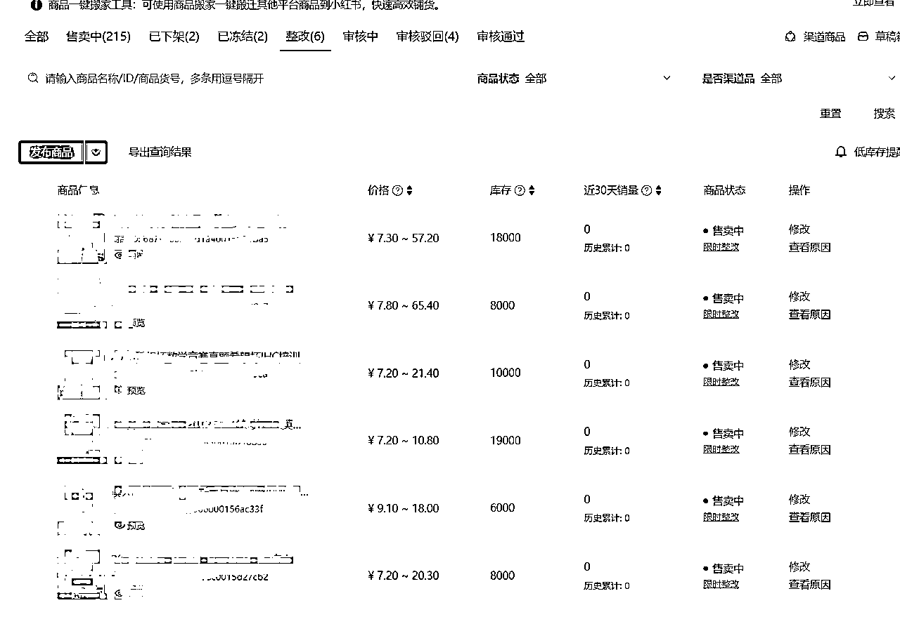
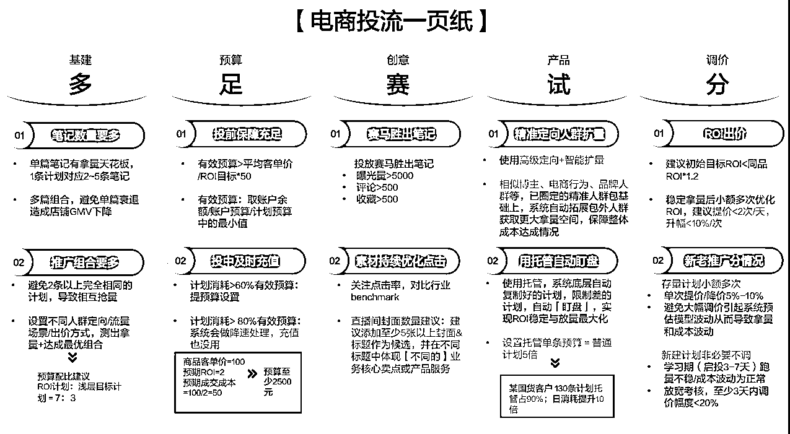

# 小红书虚拟电商，起单店，投放，规模化放大，干货纯享版

> 来源：[https://o7nsrridj4.feishu.cn/docx/APrCdsbuooFRasx7wjbcD4wSnXb](https://o7nsrridj4.feishu.cn/docx/APrCdsbuooFRasx7wjbcD4wSnXb)

哈喽各位，我是更绪，在成都这边创业，公司围绕小红书平台来做业务，做小红书虚拟电商，赚C端的钱，然后服务企业用户，赋能他们在小红书获客，赚B端的服务费和后端抽成。

之前分享过很多小红书虚拟电商的内容，有一段时间了。

随着实操的深入，思路越来越清晰，加之平台也在不断变化，所以今天来给大家更新一波玩法和思路。

本篇只讲最新实操和自己的最新理解，不讲理论、背景、以及一些基础的店铺上架之类的操作，相关内容可以查看往期我的精华帖。

本篇文章用于解决下面6个问题。

1.  怎么选品、确定品并找到资源？

1.  怎么发笔记测品？

1.  怎么确定方向&赛道？

1.  怎么做店铺&账号运营？

1.  怎么投流，以提高确定性？

1.  怎么规模化复制放大收益？

# 一、怎么选品，确定品并找到资源？

这是所有电商人的最大的痛点，没有之一。

看到这，请你在心里默读3遍：

品是测出来的，不是选出来的，选品只是粗筛选，没人能直接选出来好品。

品是测出来的，不是选出来的，选品只是粗筛选，没人能直接选出来好品。

品是测出来的，不是选出来的，选品只是粗筛选，没人能直接选出来好品。

然后再跟着读三遍，要发出声音：

品是测出来的，不是选出来的，选品只是粗筛选，没人能直接选出来好品。

品是测出来的，不是选出来的，选品只是粗筛选，没人能直接选出来好品。

品是测出来的，不是选出来的，选品只是粗筛选，没人能直接选出来好品。

## （1）素材不是很重要

很多新手总是想着怎么做出爆款笔记，想把笔记做得很精美，但其实你选对了产品，素材都不用太花哨。

为什么？因为用户本来就需要这个东西，你只要把产品讲清楚是什么，有什么，就行。

像下面这篇笔记，就靠这几张简单的图，一篇笔记就卖了上千块，就是因为品选对了，笔记压根不需要太精美，点赞也不需要多高。

所以，如果说卖得不好，不要老是纠结笔记不对了。

## （2）选品的2个大方向

### 方向一：痛点刚需 + 自己熟悉的领域

就像在闹市区开店，人流量大，但竞争也激烈。（常见赛道：k12、考公、留学、考研、教务...）

这条路看起来简单，其实最难。因为大家都知道这些赛道赚钱，所以竞争最激烈。但为什么还要选这条路？因为市场够大，容错率高。

为什么选择痛点刚需？

用户付费意愿强：不是"想要"，而是"必须要"，愿意为解决问题付出代价，转化率相对较高

市场需求稳定：需求节点相对好预测，不会因为流行趋势而消失，适合长期深耕

为什么选择自己熟悉的领域？

这条路的挑战： 人流量大，竞争激烈，你必须比别人更懂用户。同样是卖考研资料，为什么有人月销几万，有人连个订单都没有？差的就是对人群的理解。

在竞争激烈的市场中，成功的关键不是拼资源、拼投入，而是拼对市场的理解、对用户的洞察、对规律的把握。我一开始选择做中高考领域的资料，也是因为我们更熟悉中高考的用户群体。

我一直认为，任何领域都有做得好的人，关键不是选什么赛道，而是谁在操盘。

像这篇笔记的内页，排版就做得非常精细化，花了大功夫的，并不是简单把产品截图放上去，所以在相对红海的赛道厮杀，对运营能力的要求更高。

### 方向二：小众细分 + 蓝海领域

这条路的核心是"人无我有，人有我优"。哪怕这个领域很小，但你是第一个，早就是优势。

什么是真正的小众蓝海？

1.  需求真实存在：有人在搜索相关信息、有人在咨询相关问题

1.  供给明显不足：相关内容很少、质量普遍不高

1.  市场空间合理：虽然小众，但用户付费能力强

举例：海牙认证（国际文件认证制度，国内文件翻译成海外文件）

常见应用场景

*   教育文件 - 学历证书、成绩单等用于海外留学或工作

*   商业文件 - 公司注册证书、合同等用于国际贸易

*   个人文件 - 出生证明、婚姻证书、无犯罪记录等用于移民或海外居住

*   法律文件 - 授权书、遗嘱等需要在海外使用的法律文书

搜索量很大，内容+评论互动数据不错，代表有需求

小红书站内卖得不多，代表竞争不激烈

客单价较高，用户有付费意识

与前面提到的红海赛道需要较强的运营能力不同，小众细分+蓝海领域不需要太强的运营能力，不需要你把图做得多么精美。更加考验选赛道、选品的能力。

## （3）四种选品的具体方法

### 方式一：小红书千帆--市场行情

核心功能：用官方数据看市场真相，哪些商品真正在赚钱，哪些账号做得好

重点关注：核心关注数据异常值

*   账号粉丝数少，账号变现多

*   笔记质量一般，笔记变现多

### 方式二：野马数据--找黑马选手

这个工具貌似还是一个圈友开发的，具体是谁我也不知道，别人发我的，用下来感觉还不错。

https://yemashuju.com/web/

1.  核心关注数据异常值-低粉高销：

*   粉丝不多但销量好 = 产品击中了需求

*   没有强运营能力 = 门槛不高，可复制

*   往往有独特的选品眼光

1.  关注那些没听过，没见过但是销量数据好的品

### 方式三：淘宝拓品--从成熟市场找机会

为什么看淘宝？

*   淘宝是成熟的交易平台, 产品数据，成交数据更丰富，

*   看销量数据，可以验证需求大小（但是目前很多销量是假的，都是开直通车刷上去的）

第一步：找准选品赛道

1.  确定大方向：k12、大学教育、职场、兴趣、留学、公考、职考、公考

1.  细分具体品类：幼儿园公开课、考研资料、简历模板、PPT模板

1.  搜索：挨着去搜索内容

第二步：找好对标店铺

找到那些淘宝店铺，专门做这个垂直赛道的店铺

装修简洁但专业、产品描述详细实用

第三步：分析店铺产品

第四步：拓品

这家店全都是卖的幼教相关的虚拟产品，且销量都还不错，说明这家店铺的运营者，他对幼教的虚拟产品所服务的人群的需求特别了解，洞察很精准。所以它的店铺其他商品，也是值得我们去测试的。

1.  奥尔夫音乐资料集

1.  幼儿园自制玩教具

1.  幼儿园食谱

1.  幼儿园生活化课程

### 方式四：让AI帮你挖掘需求

选品嘛，无非就是挖掘用户需求，并验证用户需求的一个过程，只要问题提得好，AI完全可以帮我们挖掘出来很多用户的需求。

核心优势：AI的信息搜索、及数据洞察能力

AI能帮你做什么？——快速分析大量信息、提供不同角度思考、识别潜在机会、预测市场趋势

下面的提示词，大家可以参考一下。

我在小红书上卖XX相关的虚拟资料，现在时间是x月x号，我想选一些品来布局，根据我的经验，小红书的流量大概在笔记发出去的半个月后开始慢慢起来。能不能给我推荐至少20个品，符合现在这个时间点的xx虚拟资料，资料要给出具体是什么，再给出详细的推荐理由，告诉我这些品击中了用户的什么学习需求。

具体的提示词，大家也可以根据自己的实际情况进行改编。

做到下面2点即可：

*   问题要具体，不要太宽泛，多角度提问，获得全面分析，提供背景信息，让AI更好理解

*   用AI结果做参考，不要完全依赖

## （4）什么品好做？

### 方向一：去打有热度的产品，起店最快

什么是热度？大量用户在搜索，平台在大力推荐，相关内容互动率高，但做的人还不多

为什么热度产品好打？用户需求明确，不用教育市场，竞争对手还没反应过来，容易快速看到结果

#### 热度产品的两个特征

特征一：站内的低粉爆款

什么是低粉爆款？

*   粉丝不多（1万以下）

*   但某条内容爆了（10万+互动）

*   评论区购买意向强

为什么会出现低粉爆款？

*   踩中了用户真实需求，产品本身有吸引力

*   内容形式刚好匹配平台推荐

*   时机把握得好

特征二：站外的又新又爆

什么是又新又爆？

*   刚出现的概念或产品

*   在其他平台已经火起来

*   小红书还没有大量内容

*   搜索量开始上升

为什么要关注站外？

*   其他平台火了，小红书用户也会搜索

*   微博热搜带动全网关注

最佳进入时机：

*   导入期末期：少数人关注（1-4周），有苗头，还没爆发

*   爆发期初期：大量用户涌入（1-3个月），刚开始火，竞争不激烈

*   千万不要等到成熟期才进入

用热点做流量入口，用价值做长期生意

暑假衔接 -- 售卖期 （6月底，7月初） -- 上品/笔记制作（6月中上旬）

特岗教师 -- 售卖期 （6月底，7月初） -- 上品/笔记制作（6月中上旬）

三支一扶 -- 售卖期 （6月底） -- 上品/笔记制作（6月中上旬）

### 方向二：低粉高销量的品

典型特征：

*   粉丝数量不多（通常1万以下），但销量数据很好（月销1000+）

*   内容不一定很精美，但转化率很高

背后原因：

*   刚好踩中了真实需求，产品和需求匹配度高

*   没有太多运营技巧，但选品眼光好

*   用户购买是因为需要，不是因为被种草

往往不是能力很强的选手：

*   内容制作能力一般，运营技巧不够熟练

*   但产品选择很精准

美图秀秀永久会员

## （5）找虚拟资源“供应商”

### 虚拟资源类：

我们在实操下来，发现去淘宝/拼多多找“精品店”是一种很不错的方式，里边的产品整体质量都比较高，包括商品的主图、详情图也都很精美，方便我们直接搬运，省时省力。

而且，专注做精品店的店铺，说明运营者的选品能力很强，对垂直用户的需求洞察精准，相当于他已经帮我们选了很多好品了。

什么是精品店？

不是什么都卖的大杂烩，而是专门做某一类虚拟产品的店铺。

便宜没好货，好货不便宜。过分追求低价产品，最后坑的是自己的品和笔记内容。

精品店的三个特征：

*   只专注1-2个细分领域

*   产品更新频率高，跟得上时间节点

在哪里找精品店？

*   淘宝：搜索关键词，看店铺专业度

*   小红书：关注做垂直类目下资料分享的店铺

*   私域：微信搜一搜/私域群，观察谁在卖好资料

货比三家，试看为王

1.  先试看：要求看几页样品

1.  不合适就退：发现质量差立即退款

好资源的四个标准

1.  内容丰富：知识点覆盖全面，有基础有进阶，有知识讲解也有题型训练

1.  排版清晰：目录结构清晰，字体大小合适，段落间距舒服

1.  色彩区分度高：重点内容用醒目颜色标注，不要花花绿绿影响阅读

1.  内容更新快：教材版本是最新版的，案例题目是最新年份的

### 虚拟服务类：

找供应商的三个渠道

朋友推荐（首选）：朋友用过的供应商，质量和服务都有保障。或者在同行群里打听

咸鱼个体户（次选）：咸鱼上很多个体户，服务更灵活，价格更便宜，沟通更直接。

淘宝店铺（备选）：很多店铺不回复消息，不聊合作，客服不专业

先找客户，再找供应商

1.  为什么要先找客户？ 很多人反过来，先找了一堆供应商，结果发现没客户要。准备得充充分分，结果发现卖不出去。有需求才有供给，有订单才有价值。先有客户需求，再找供应商资源，这样才不会本末倒置。

1.  测试市场需求：发内容看用户反应，收集用户咨询，看用户具体要什么，有针对性地找资源

直接上品测试法

核心思路： 不要想太多，直接上架测试市场反应。

测试周期：1-2周观察数据表现，有咨询有下单说明有需求，数据不好及时调整或放弃

出单了再联系渠道方：客户问什么，你就去问什么，单子有了再去对接好渠道商

# 二、怎么发笔记测品？

看到这，请你在心里默读3遍：

品是测出来的，不是选出来的，选品只是粗筛选，没人能直接选出来好品。

品是测出来的，不是选出来的，选品只是粗筛选，没人能直接选出来好品。

品是测出来的，不是选出来的，选品只是粗筛选，没人能直接选出来好品。

然后再跟着读三遍，要发出声音：

品是测出来的，不是选出来的，选品只是粗筛选，没人能直接选出来好品。

品是测出来的，不是选出来的，选品只是粗筛选，没人能直接选出来好品。

品是测出来的，不是选出来的，选品只是粗筛选，没人能直接选出来好品。

当我们选好了一个品，需要针对这个品发笔记，然后再给以时间/投流，去让这个品产生很多数据，从而才能判断出来这个品好不好，这是唯一的判断标准。

接下来，请跟我一起从如何做笔记，如何做数据分析开始，掌握好测品的核心思路。

## （1）如何做笔记

### 网感积累：成功的基本功

为什么网感如此重要？

技巧可以学，套路可以抄，但网感只能靠日复一日的积累，真正的高手不是技巧有多牛，而是对用户需求的理解有多深。

刻意训练：每天半小时的去刷对标

*   看笔记拆解爆款逻辑：看相关笔记内容，拆解结构，分析账号运营思路

*   看评论区了解用户：反复出现的词就是用户痛点，带有强烈情感的表达最有价值

*   找到那些反复被人提及并且情绪浓度高的表达，作为内容优化的方向

这半小时，决定了你和竞争对手的差距。

公司员工运营的自媒体运营账号，发布第一条内容，就3k+点赞，都是积累的网感，发之前我就知道会爆

### 找好对标选手：站在巨人肩膀上

什么是好的对标？

两个标准：

*   垫垫脚，能够着：比你强一点，有学习价值

*   傻瓜在赚钱：你觉得他做得很一般，但是销量却很高，说明品选得好

对标选择策略

做内容看：低粉高赞

*   粉丝不多但点赞很高，说明内容击中了用户需求

*   值得学习他的做笔记套路

卖货看：低粉高转化

*   粉丝不多但销量很好，说明产品和转化做得好

*   值得学习他的选品思路

培养空白小号刷对标（最有效）

让系统信息流推荐，一定就是当下最新最热的内容

1.  操作方式：

1.  账号搜索/点赞/收藏目标领域内容（如“小学”），触发系统推荐机制

1.  账号只刷目标领域内容（如“小学”），出现其他内容全部点不感兴趣

1.  出现商品笔记，就点击购买商品（不要下单），从而给你推荐更多商品

1.  记录信息流中出现的优质对标账号与笔记

### 什么是好的商品笔记素材？

商品笔记的推流机制

1.  自动识别系统：挂载商品链接的笔记会触发平台广告检测机制

1.  初始流量池降权：商品笔记进入200-500曝光的冷启动池时，权重比普通笔记低。算法优先测试用户对内容的天然兴趣度（非商业目的互动）

1.  社区流量池 vs 商业流量池

1.  社区池：通过“发现页”分发，核心考核CES评分（公式：点赞×1 + 收藏×1 + 评论×4 + 转发×4 + 关注×8）

1.  商业池：绑定商品类目标签，主要出现在搜索页和商品专区，核心指标为种草转化率（阅读→商品点击率>1.2%）

1.  流量隔离首页推荐流量优先分配非商业内容，商品笔记更依赖搜索流量，商品笔记在社区池达成CES达标后，可突破隔离进入首页推荐

1.  商业流量池的晋级规则：

1.  商品笔记需满足 双重阈值 才能进入推荐流量池：

1.  CES评分达标：要封面点击，要干货输出，通俗点来说，就是你的笔记得做得好，用户喜欢看。

1.  种草转化率达标：要产品展示，要引导转化，通俗点来说，就是你的产品得卖得好。

爆款封面标题：戳中痛点要点击

A类素材：蹭热度

*   近期低粉爆款的封面风格

*   热门话题相关内容

B类素材：足够不一样

*   有一定的痛点或者是卖点

*   足够大或者足够小，足够不一样

*   好看不重要，漂亮不重要，重要的是特别小、特别大、特别丑、特别美、特别。才有点击率。

点击率靠"假"：

*   新奇特的东西吸引眼球，刺激用户需求和好奇心

*   假不是骗人，主要为了欺骗算法！

优质卖点表达：干货+转化并重

三个要素：

*   卡住产品痛点和目标人群

*   好的卖点表达就是：用户一看就懂，一懂就想要。

*   符合小红书调性：简单清晰，有代入感

转化率靠"真"：

*   直接清晰展示资料，不加太多营销话术

*   直接live图实拍，道具摆放随意

### 创作笔记的过程：从模仿到超越

#### 创作流程

找爆款：站内+站外全覆盖

寻找顺序： 先站内再站外，手刷>工具

三种方法：

*   工具使用：数据监控平台（灰豚、千瓜、聚光）

*   关键词搜索：直接搜索相关词汇（借助工具爬取：社媒助手）

*   刷信息流：日常手刷（最推荐）

筛选标准：低粉高赞的内容，数据异常值内容，好模仿的内容

网感积累是这个环节的核心。

拆爆款：

打碎内容，提取核心卖点，提取爆点

多去看看评论区，看用户在关注什么，在反馈什么问题

超爆款：基于网感的创新

三种优化策略：

*   1:1还原（新手）： 1:1复刻，把背景图层稍微换一换去重即可（即使封面一样，也不用担心被查重）

*   50%原创（进阶）： 封面标题模仿+层图正文改变，有自己的特色

*   自己实拍（高级）： 完全原创，建立个人风格

创新的本质是旧元素的新组合，也就是排列组合的抄。

#### 制作笔记

封面：

设计原则：

*   样式模仿小红书爆款，随时调整跟上热点

*   简单醒目或调动情绪

抓住近期有热度、能转化的封面样式。

目录展示/产品展示：让用户一眼看懂

核心要求： 产品清晰突出，一眼知道卖什么，里面有什么

资料包展示：

*   用百度网盘导出文件夹目录

*   下载到电脑直接截图

*   保证目录清晰易读

虚拟服务展示：

*   产品全览放第二页或最后

*   加上营销活动促销信息

内页展示：真实感是王道

多种资料类型： 详细展示每个卖点，挨个展示1-2页资料截图

单一资料类型： 直接展示其中一份，截图3-5张即可

核心说明：

*   不要直接网盘截图，要下载本地保证清晰度

*   以资料为核心，小字说明卖点，不过度遮挡

*   资料的清晰度，不要截图出来模模糊糊的，非常影响观感

标题/正文：SEO+真诚并重

两个要求：

*   带上核心关键词，匹配搜索需求

*   清晰表达资料内容，符合真诚分享原则

不要营销味过重，要像朋友推荐一样自然。

文案要简单干净，以免遮挡住商品组件

精细化做的好的笔记：

https://www.xiaohongshu.com/explore/686927da000000001100014d?xsec_token=ABAH3TAHbsoT_lUTVIfBS18nlX771dA4GC7oX8Szw7NaQ=&xsec_source=pc_search&source=web_explore_feed

https://www.xiaohongshu.com/explore/686b8be3000000000d0191af?xsec_token=ABXEISvNxHEewcMG6nyzXtdrPSRFpiOre4uU4lUHGhI44=&xsec_source=pc_search&source=web_search_result_notes

https://www.xiaohongshu.com/explore/66a4dc02000000002701f889?xsec_token=ABZ2cevI79jA7LKXEOtR8omsruRxOpOjCtJwVc_PEjPrs=&xsec_source=pc_user

做得差的笔记：

截图模糊，封面色彩杂乱：https://www.xiaohongshu.com/user/profile/644de044000000000f00615e?xsec_token=YBmcyr8QQzxf9c3Y6VZ3xQuEHyI0Fu1vjevHJ5BzzYFso=&xsec_source=app_share&xhsshare=WeixinSession&appuid=644de044000000000f00615e&apptime=1747637460&share_id=2785665cf6ec46ecb76a13ddcf96c7ce&share_channel=wechat&wechatWid=426d85f882f82463a69950266e5311cd&wechatOrigin=menu

自己diy封面：https://www.xiaohongshu.com/explore/683746c1000000002301fa42?xsec_token=ABdAjc_rQXMnoqx4eLCwwaYdR2zSOG0aFNuOI4XOvhh0c=&xsec_source=pc_user

内页大字排版，盖住资料：https://www.xiaohongshu.com/explore/67fa1cc5000000001b0382c5?xsec_token=ABTy6XK8nAX5S1I3xtGw9xtuW1bq3m1s1xNhqeVQ0DXlk=&xsec_source=pc_user

文案长篇大论，营销感满满：https://www.xiaohongshu.com/explore/68761ce90000000011001342?xsec_token=ABfSpGaKh5gr_0hFcpijv7aWm1pdyzP62UEKVy3aBlJSc=&xsec_source=pc_search&source=web_user_page

## （2）通过数据分析判断品好不好

### 测品：两步验证法

方式一：杂货店铺简单测验

杂货店铺测试标准：商品访客30+ 销量2+

结果判断：

*   能卖动：说明产品有市场，立即转到精品店铺大量铺开

*   不能卖动：别急着否定产品，可能是主图详情图有问题，不是产品有问题，换个主图详情图再试试。有时候不是产品不行，而是表达方式不对。

方式二：精品店铺验证

测试规模：5-10篇笔记 不管你有多少个SKU，就是10篇笔记测试。不要贪多，先把基础数据跑出来。

核心指标：商品支付转化率达标10% 测品阶段不是为了爆单，而是为了验证可行性。

### 测笔记：找到你的爆款公式

锁定测试要素：

*   多个不同的封面与标题

*   多个不同的转化链路

3个不同封面标题测点击率，2个不同转化层图+正文测试种草转化率

### 数据观测：每个指标都有标准

### 笔记内容数据

笔记阅读量及封面点击率

检验封面质量：封面点击率高，笔记小眼睛数多

*   8%达标：封面及格，能用

*   12%优秀：封面很棒，重点推广

笔记互动率

检验笔记的内容力：互动率高，笔记小眼睛数多

*   3%达标：内容有价值

*   5%优秀：内容很棒

### 商品数据（更关注转化情况）

种草转化率

笔记商品点击率：检验笔记的转化力

*   10%达标：笔记有带货能力

*   15%优秀：笔记转化力很强

商品转化率

商品访问及支付转化率：检验商品的转化力

*   10%达标：商品页面合格

*   20%优秀：商品转化力强

不要急于下结论，给数据一点时间，有一定数据量，数据稳定后再做决策。

这是很多人最容易犯的错，做数据分析的时候，老是喜欢把一点点偶然情况当作得出结论的依据...

好产品不是想出来的，而是测出来的，每一个转化率都有故事，每一个数据背后都有用户的真实选择。

# 三、怎么选择方向？

这是很多人在做这个项目时候经常会纠结的点。

我应该选择做什么方向的虚拟产品？选择什么赛道？是固定做一个赛道？还是什么都可以做？

其实这个需要结合自身情况去判断，没有好坏之分，只有适合不适合的区别，每个赛道，每种玩法都有卖得好的和卖得不好的。

宏观来看，只分为两种情况：

第一种，你有比较熟悉的赛道，比如你本身是一个老师，对K12特别熟悉，比如你考过公考过编，对考公考编特别熟悉，比如你从事过留学相关的工作，对留学赛道的用户特别熟悉。

那么你完全可以选择从你熟悉的人群，熟悉的赛道入手，这样你能很好的洞察用户的需求，选品的时候很容易选出好品，并且做笔记的时候也能很容易戳中用户。

第二种，没有任何熟悉的赛道，那么这个时候你就只能通过固定的方法论，在一个很大的池子里，去不断选品，然后发笔记测品，筛选出还不错的品。

在这个过程中，你可能也会慢慢找到一个，甚至多个熟悉的赛道，然后持续深耕下去。

这两种情况，我们对应到玩法上，就是2种玩法，第1种玩法，我把它叫做精品店玩法，第2种玩法，我把它叫做杂货铺玩法。

## （1）精品店玩法

### 适用范围：

你熟悉某个赛道方向的用户，能轻松洞察他们的需求，这个赛道是对虚拟产品是有刚需的，并且这个需求还是相对长期且稳定的。

你熟悉，意味着知道用户真正的痛点，有独特的资源或经验，虽然熟悉不等于有竞争力，但有竞争力一定要基于熟悉。

有刚需，就意味着有稳定的需求，值得深度投入，做刚需就是做确定性。

长期且稳定，投入的时间和精力不会白费，不会频繁换产品，店做起来了，越做越轻松。

下面是一些精品店铺的案例：

小红书上面有很多这样的店铺，只做某个特定方向的虚拟产品，店铺的品也不多，反反复复就那么几个，但是销量很高，其背后的运营者我推测大概率就是对相关类目很熟悉的人。

他们的店铺都越做越轻松，不需要一直不停地去选品，可以拿到很多长尾流量。

OK，介绍完了这个玩法，那么具体应该怎么去做呢？

### 第一步：选品选赛道

这部分的理论知识，具体操作前面选品已经讲到了，这里就给到具体的步骤，即你要操作的具体内容。

赛道分析、商品调研、选品、产品确定

1.  选品要求：

1.  选到5个自己觉得合适的品填到选品表格里，因为你熟悉这类人群，所以你自己主观就能很好地选选品

1.  一定要自己去多刷，自己去多选！卖得好的品都是自己一步步选出来的

选品完成后，需要基于该产品找到合适的对标优质商品笔记，并进行商品拆解和内容拆解，可以按照这个表格的信息去拆解，填完后，你对一个品的了解程度应该足够了。

### 第二步：内容制作

基础图文排版就用稿定（或者你熟悉的工具），这个没啥好说的，不会就得练，做小红书最基本的要求。

制作好5篇商品笔记后，上传笔记到笔记制作表格中，内容一定要填完整

笔记标题、正文内容、话题、封面、层图一定要填完整，并附上自己笔记的对标笔记

### 第三步：数据分析和投流测试

保持稳定的发布频率、监控数据表现（笔记及商品数据）、投流实操测试

1.  数据分析

查找到每条笔记和商品的数据后，将其填入表格中，每次至少分析5条笔记数据。

1.  投流测试（具体操作后面会将）

1.  至少搭建2个投流计划，roi从高往低设置

1.  投放roi为正及合格

### 第四步：迭代/放量

跑起来：

1.  找到稳定的爆款模板后，批量复制

1.  覆盖所有相关关键词，抢占搜索排版

1.  投放放大，但不要过多抢占自然流

没跑起来：

1.  分析原因，品的问题，还是笔记的问题

1.  继续迭代测试

### 全流程脑图

选对产品：有验证过的市场需求，不要选择过于小众或过于竞争激烈的产品。

找对笔记模板：分析现有爆款笔记，结合自己的产品特点，测试不同的内容形式

执行到位：保持发布频率和质量，及时跟踪数据并优化，不要急于求成，频繁调整策略。

## （2）杂货铺玩法

### 适用范围：

#### 场景一：不知道选什么品

什么情况下会迷茫？

*   刚进入一个新赛道，不知道哪个产品好卖

*   有多个产品选择，不确定市场反应

*   想验证自己的判断是否正确

杂货铺的价值： 用最小的成本，快速测试市场反应。与其纠结选哪个，不如都试试看市场怎么说。

#### 场景二：适合小众、细分、蓝海玩法

为什么杂货铺适合小众？

*   小众品类竞争不激烈，用户需求相对分散

*   竞争激烈的赛道或者品不适合，因为笔记质量较差，很难持续拿到流量

杂货铺 vs 精品店：

*   精品店：深度经营，适合竞争激烈的品类

*   杂货铺：广度覆盖，适合小众蓝海品类

记住：在竞争激烈的品中，杂货铺很难抢到大量。但在蓝海中，杂货铺可能意外发现好品。

### 第一阶段：从选赛道到出单

#### 第一步：选赛道

推荐四大赛道

公考类：

*   国考、省考、事业单位、教师招聘

*   用户群体庞大，需求刚性

*   每年都有固定的考试周期

教务类：

*   各种职业资格考试

*   各种老师上课教学备课

*   德育、党建、教研、家长会、公开课

海外类：

*   语言学习、文化适应

*   海外工作、国际考试

*   留学申请、移民咨询

软件类：

*   各种工具软件教程

*   游戏攻略、辅助工具

*   技术学习资料

为什么推荐这四个赛道？

需求稳定、用户付费意愿强、竞争相对分散。

#### 第二步：筛品

筛选标准：外观即正义

尽量去找精品店，筛出有销量的，直接全店产品搬运

主图要求：

*   画面清晰，没有水印

*   设计专业，有吸引力

*   信息明确，一眼看懂

详情图要求：

*   目录结构清晰

*   资料展示完整

#### 第三步：小红书上货

上货策略：

*   批量上架，不要一个一个来

*   价格参考同类产品：1.5倍+8元

上货节奏：

*   第一批：上架40个产品测试

*   三个子账号，每个账号10-15篇内容

我们这里用的是网上一个工具，可以直接从淘宝搬运商品到小红书，一个小时上传100个品都没有任何问题

这里避免广告嫌疑，就不放工具名称了。

#### 第四步：主图、详情图处理

上架后问题：

*   限时整改：提醒修改类目，或者站外导流

*   商品冻结：违禁产品，直接删除

优化处理：

*   手动编辑并整改内容

*   删除站外导流内容

#### 第五步：AI笔记制作

具体操作流程：

1.  导出小红书商品链接到本地

1.  通过商品链接下载商品主图（多张）到本地

1.  通过工具将主图第一张上传到飞书多维表格

1.  飞书多维表格调用大模型自动识别图片内容，生成标题、正文、话题的内容

我们这里用Claude code做了个插件去采集商品链接和商品主图，并且自动上传主图到飞书多维表格中，再通过AI自动生成对应的标题、文案、话题，这样我们整个制作笔记的流程就全自动化了。

#### 第六步：小红书笔记发布

1.  新账号每天发布10条内容，账号稳定后每天发布20条内容

1.  每条内容最好间隔10分钟以上再发布

1.  发布工具：小红书矩阵自动发布插件

1.  可以批量多账号调用飞书多维表格的接口自动完成发布（也是Claude code写的）

#### 投流测品讲解：用钱买确定性

投流计划设置

1.  30-50个笔记为一组

1.  roi设置为3，高了跑不动（可能会有一定亏损风险）

#### 出单

1.  若产品出单后，我们就上淘宝拍下该产品，把链接发给顾客

1.  若顾客问的问题遇到不懂的，直接复制问题上淘宝去问

1.  然后再配置上自动发货，还有把一些基础配置都弄上

### 第二阶段：测笔记

这个阶段我们要对能出单的商品进行优化，最好不要直接在杂货铺上优化产品，去换到精品店里

好好来做这个品，做这个笔记，同时测出爆款笔记模板，方便后续继续怼量

#### 内容运营：精细化发笔记

1.  找到买的这个资料，我们接下来需要精细化做内容

1.  针对该商品，我们去搜小红书同类型的商品笔记，找到优质笔记模板，后续进行模仿

1.  然后针对该商品做5-10条内容笔记（每条笔记封面有一定差异性，并且要避免查重）

1.  封面一定要不同样式，我们也可以通过投放测封面

1.  网盘内容截图+上面大字文案

1.  内容打印出来拍照

1.  直接用大字海报（白底/纯色边框）

1.  也可以直接用我们课程上教的笔记模板

#### 投放放大:测优质笔记（可选）

1.  上面第一轮投放测试主要是测款，这轮投放测试主要是测笔记及封面，找到一个优质笔记模板

1.  这个时候我们要去关注一下投放数据中的创意消耗

1.  投放数据，我们主要观测下面图片数据，看那条笔记内容消耗、封面点击率、转化情况好，找到那个爆款笔记模板

### 第三阶段：怼量

前面两个阶段我们找到了能快速出单的品，找到了能快速出单的笔记

接下来我们要怎么做？怼笔记！怼笔记！怼笔记！

我们可以结合之前笔记课程讲到的批量修改+自动发布高效的把笔记覆盖上

最终这个品的笔记数要覆盖到30条左右！最终实现搜索霸屏（笔记数视情况而定）

# 四、怎么做店铺&账号运营？

核心运营思路

先拉热度，再去拉转化，先要销量，再要利润

## 店铺运营的三个阶段

### （1）冷启阶段：摸索和验证

主要任务：测品+测模板

测品策略：大量上品，有节奏有周期

*   不要只测一个产品就下结论

*   批量测试，我们一般会测3-5个品，找到数据反馈最好的

*   市场比你聪明，让数据说话

测笔记模板：找到适合的内容模板

*   测试不同的封面风格

*   测试不同的内容结构

冷启阶段心态： 不要急于赚钱，这个阶段是测试哪个赛道好做，哪个品好做

### （2）起量阶段：重量不重利

核心策略：低价起量

*   拉升单量和链接权重，让平台算法认可你的产品，后续更容易获得流量

*   用户评价积累，转化率会更高

### （3）爆量阶段：规模化放大

策略一：自然流笔记怼量

找到高点击高转化模板，重复大量发

当你找到了爆款模板，，这时候要做的就是疯狂复制，批量生产。

怼量要点：

*   保持发布频率和节奏

*   微调内容避免重复

*   持续监控数据表现

策略二：微付费投流

用付费撬动一定自然流，而不是依赖付费解决问题。

投流策略：

*   设置高ROI，不要去压制自然流本身的流量

*   投流长尾蓝海词或者对标账号人群，不要去投核心关键词

策略三：抢占搜索排名

搜索流量是最精准的流量，用户主动搜索说明需求明确，转化率天然更高。

搜索排名优化：

*   关键词布局要精准

*   内容相关性要强

*   内容干货输出要多

店铺运营就像种树，先扎根，再长叶，最后结果，不要想着一口吃成胖子，每个阶段都有每个阶段的任务。

# 五、怎么投流，以提高确定性？

这个部分，我会做一些投流的科普，并把具体投放的步骤列举出来，之前的内容没有提到的，所以内容会相对多一点。

## 常见的两种玩法

微付费：

策略： 少量投流助推优质内容，主要靠自然流量

适合场景：

*   内容质量很好，只是需要初始流量

*   预算有限，追求ROI最大化

*   产品本身有很强的传播性

微付费的精髓：用最少的钱，撬动最大的免费流量。

纯付费：

策略： 大量投放，快速获得曝光和转化

适合场景：

*   产品利润充足，适合长期投放

*   竞争激烈，追求快速起量

纯付费与微付费打法的区别

|  | 纯付费 | 微付费 |
| 打法概述 | 不考虑自然流量，计算好投产比，追求正向ROI | 通过付费流量激活自然流量，实现自然流的持续出单 |
| 投流比例 | 高于70% | 初期高于50%逐渐降低 |
| 选品 | 中高客单品以支撑在低投产比的情况下仍然能赚钱 | 低客单品不至于支撑持续赚钱 |
| 利润 | 一般低于30% | 跑得好的roi接近3左右，自然流付费流五五开 |
| ROI | ROI为正，不会亏钱 | ROI为正，不会亏钱 |

## 投放的核心公式

核心公式：

ECPM = 点击率 × 转化率 × 出价 gvv

广告竞争力 = 点击率 × 转化率 × 出价 + 广告质量

公式拆解：

*   ECPM：每千次曝光成本 这个数值决定了你能获得多少流量。

*   点击率：内容吸引力，决定用户是否愿意点击

*   转化率：产品吸引力，决定用户是否愿意转化

*   出价：你的预算投入，决定竞争力

*   广告质量：反映用户对广告的认可程度，主要包括ctr、互动率指标等

付费投流并不是出钱就能花出去，计划能否消耗的底层逻辑是ecpm值。

ecpm越高，计划消耗越快。随着eCTR与eCVR的逐步提高，出价可以逐步降低。

## 投流基础操作

### 基础数据概念

必须掌握的几个指标：

*   价格:商品售价

*   成本:商品成本，除了进货成本外，还需要计算平台服务费，根据类目不同，一般为2%~5%不等。

*   利润:利润 三 价格-成本，我们能从这次销售活动中赚到的钱。

*   利润率:利润率 = 利润/售价，用来衡量利润在售价中的占比。利润越高，保本需要的ROI越低

*   ROI:投入产出比，产出/投入

*   保本ROI:ROI指的是投入产出比，保本ROI指的是当ROI数据为多少时，我们的投流可以保本。

*   保本ROI(不含退货)=1/利润率

*   保本ROI(含退货)=1/利润率/(1-退货率)

*   赔付后ROI:卡赔付后，将赔付券折算进入收入后的实际ROI

*   假设我们能卡到全额赔付，意味着我们拿出价买了一个成交，出价= 销售成本 = 投入，则:

*   赔付后ROI=售价/出价

*   退货率:商品退货比例。付费投流模式，由于商品会退货，但投流费用不退还，所以在计算ROI时要关注退货率，避免因退货导致的亏损。

### 乘风投放计划搭建

1.  计划名称

名称不同，目标不同，策略不同。

1.  营销方式

1.  商品推广-日常销售-通投广告-托管：适合日常投放销售

1.  商品推广-新客转化-通投广告-托管：适合复购率高的产品，转化新客

1.  商品推广-笔记加热-搜索广告-自定义：适合提高笔记自然流搜索权重（浅层目标，不负责转化，投放会亏损）

1.  投放笔记素材

*   使用店铺账号素材，还是主理人素材，还是授权素材，还是投放广告素材

*   投放笔记数量：

*   投放笔记数越多，模型探索越多，探索消耗越多

*   如果是单品（同一个品，不同笔记），10-20条笔记合理

*   如果是杂货测品（不同品，不同笔记），30-50条笔记合理

*   都需要关联上商品链接

1.  其他基础设置

1.  快投设置：直播快投关闭

1.  投放时间：默认7天时间，若通过学习期或roi跑得比较好的情况下，可以改为长期投放

1.  投放时段：过滤掉午夜时间段，人群比较垃圾

1.  日预算：300元（若计划单日消耗达日预算90%，则投放会降速处理

1.  投放速率：匀速投放，让预算均匀消耗，更利于探索优质人群

1.  一键起量：关闭

1.  设置技巧：

1.  控制预算和时长的本质，是通过这两个变量来控制投放流速达到我们的预期，投放时间越久，模型探索时间越久，探索人群越准

1.  理论上来说，相同预算，时长越短，消耗越快；相同预算，多笔小计划的消耗效果好于单笔大计划

1.  定向设置

*   人群定向：

*   智能定向：不想麻烦就选这个

*   高级定向：

*   电商行为人群：本店铺、相似店铺、店铺所在行业 的 所有行为

*   指定博主：可以指定某些博主的人群

*   行为兴趣人群：关键词兴趣，关键词行为都可以勾选上

*   人群包：可以自定义圈选人群的的属性或行为

定向越精准，流量越贵，转化越高。

前期希望找相对精准人群，可以定向圈定人群关键行为-性别-年龄段投放

想打对标博主，就投指定博主人群；害怕付费抢占自然流的量，就投非主力人群

大多数情况，就投智能定向。

计划搭建基础知识：

1.  学习期：4天内，转化10个订单。即为学习期成功。系统已经探索到一定数量的目标用户，投放基本稳定

1.  赔付期：7天内，出满6单。享受成本保障计划

1.  搭建完成后，计划会进行素材审核，审核通过后，则正式开始投放

## 投流的操作要点

### 测试期要点

*   核心目标：找到能跑量的素材和人群

*   平均一个计划10-20篇笔记，我平均分发一篇笔记，我平均分发100个曝光量。那哪一篇笔记的点击率更高，或者它的表现更好，它就会给到那些流量

*   重点关注点击率和转化率，看是哪条素材转化的，一个计划是否爆量，是素材优质与人群匹配的结果

*   新户冷启动较慢，即便优质计划，也会出现长时间不消耗，给到计划充足探索的时间。

*   先大胆放量测试(控制变量)再到精细化投放，有消耗绝对值的数据才有意义，没有绝对值的消耗就是无用功

*   一定要减少负向操作，计划创建后就不要随便乱动了（出价、定向、素材），影响人群探索，要改的话就新建其他计划

### 优化期要点

*   核心目标：放大盈利计划，淘汰劣质计划

*   通过学习期，模型跑出来之后，就长期投放，让计划持续地跑就行

*   超过七天的冷启动期，跑的不好，后面消耗很少或者出单很差的，直接果断删除

*   新户单条计划10条笔记以上有利于计划学习，模型跑出来后为了防止抢量，可只投放爆量素材5-6条。

*   只要计划不掉量，任何操作都是负向，同时针对跑量好的计划复制 2-3 条开启投放

*   爆款素材不要建太多计划，多的话可能就建个3到5个计划，超过3到5个计划的话，就会相互抢量。

### 放量期/衰退期要点

*   核心目标：规模化扩量不翻车

*   持续更新新的笔记模板，不断裂变素材，做到爆点价值最大化；

*   持续新建计划，扩大人群定向范围，持续投放，做到持续拿量；

*   计划挤压：计划之间做复制，必须作要素更改（定向、素材、出价）

*   跑量计划不做负向修改，最多改智能放量、预算

*   素材衰减：当我们内容迭代的速度很慢，就是新笔记出来的速度很慢的时候，访客成本大大增加，转化成本也大大增加，这个体感是很重的。

*   衰退期去迭代新的笔记（爆点保留，废点重置）。而不是去纠结他老笔记一直投就是你会搭几个计划

记住：投流是个技术活，需要边做边学边优化。结果：广告用付费方式截胡了本该属于自然流量的精准需求

下面是小红书官方出的两个关于乘风投放的手册，感兴趣的朋友可以去看看

乘风平台投放宝典1.0正式对外版

小红书电商推广投放宝典2.0（正式对外版）

# 六、怎么规模化复制放大收益？

要复制、要放大，就要意味着动作标准化，这是中央厨房，预制菜的逻辑。

所以问题的核心就变成了，我们需要把做这个项目的核心动作拆解出来，然后分析哪些动作是能标准化的，可以用工具提效、可以招人来代替你做的。

总结下来，分成下列四个步骤。

### 打磨你的单店模型：先做明白一个店铺

MVP思维，最老生常谈的话题，我也不再赘述。反正结论就是，先做好一个店铺，并通过这个店铺的成功经验，去提炼出来整个SOP流程。

四个"做"的标准：

*   做明白：知道为什么能赚钱

*   做透：挖掘所有盈利可能

*   做深：建立竞争壁垒

*   做精细：流程化标准化

为什么要先做好一个？一个账号都搞不定，10个账号只会10倍的亏损。单店不盈利，开再多店都是灾难。

为什么不把一个账号做到极致？一个账号想要单体规模非常大，需要突破的能力边际需要成倍增加。

单店模型成功的标志：

*   月利润稳定（至少得5000+），有清晰的做店逻辑

*   不依赖个人能力，流程可以被别人复制（方便招人）

### 提炼有效动作：做减法的艺术

80/20法则：最有效的动作永远只是20%

什么是有效动作？ 对结果产生直接影响的关键行为

记住：动作越多，出错越多。专注核心，忽略细枝末节

两个核心动作：

*   选对产品（决定天花板）

*   做好内容（决定流量）

这就是我在文章开头说的选品和发笔记测品，这俩才是核心动作。

无效动作举例：

*   对资料有洁癖，有水印先去水印半天

*   过度美化店铺装修，反复修改商品描述

*   上新品去补单刷好评

*   发笔记纠结字体大小，文案写成小作文

*   ...

为什么我要反复强调，电商的核心是选品和发笔记测品？就是为了避免让你出现上述这些情况，半天抓不住重点。

### 标准化、SOP化：让成功可复制

为什么要SOP化？

*   降低对个人能力的依赖，便于培训和管理

*   保证结果的一致性，提高执行效率和质量

SOP化的三个层次：

1.  流程化：明确每个步骤

1.  标准化：统一执行标准

1.  工具化：用工具固化流程

SOP手册要写到什么程度？

新手小白看了就能上手操作，老员工离职了新人能无缝衔接。

建议大家自己写，挨着挨着把选品、做笔记的流程写出来

如果实在不想写，也可以直接把我们的流程和培训文档搬过去用

### 拓店放大：从1到N的系统工程

招人/兼职：找对人比培养人重要

建立考核机制

入职前：试岗制度

*   给一个小任务测试能力，观察学习能力和执行力

*   不合适直接淘汰，不要心软

试岗的好处： 避免招错人的成本，试岗一天胜过面试一小时。

入职后：激励机制

*   底薪4000（有一定运营经验的） + 5%店铺提成（基础激励），成都郊区的水平，仅作参考

*   店铺GMV达1万，提成上浮到10%（超额激励）

分模块拆解任务

核心动作只有两个（再次洗脑式强调）：

1.  选品：找到能卖的产品

1.  做笔记测品：制作能转化的内容

为什么只拆这两个？

这是最核心的价值创造环节，其他都是辅助工作。

制作笔记的质量是可以通过培训提高上来的，但是选品需要长期的积累

我们甚至大部分时间选品还是由我们自己来，选品给他们方向或者具体明确的品，而不是让员工自己发挥

把80%的精力投入到20%的核心工作上。

工作安排如何协同

员工一：店铺运营（协同：选品调研）

*   产品上架，把控选品的方向

*   店铺日常运营

*   客服售后和用户维护

员工二：内容创作（协同：选品调研）

*   负责笔记模板创作，把控内容的质量

*   内容数据分析和优化

员工三：实习生

*   批量复制生产内容

*   每篇3元，每天40篇的量

不要想着一个账号刚有起色就想复制10个，复制的过程会遇到非常多的问题，做得越多，错得越多。单店不赚钱，多店只会多倍亏损。

一定要不断地梳理执行SOP，不断打磨执行流程。不要招了人就不用管，大概教教就行，具体看个人发挥，标准越清晰越好

# 七、最后

内容太多，没有结束语，建议点赞&收藏，反复阅读。