# 从0到1 AI产品的20倍增长之路

> 来源：[https://ijarxpcwej.feishu.cn/docx/LplRdEdvZoPJyPxBEflc1HD9noc](https://ijarxpcwej.feishu.cn/docx/LplRdEdvZoPJyPxBEflc1HD9noc)

# 一、产品和自我介绍

### 自我介绍：

大家好，我是小辉AI教练，一个AI产品创业者，B站up主，AI自媒体课程讲师(学员1000+)，我们在做AI内容营销相关的产品矩阵，包括我们的核心产品AIMIX智剪 —— 一款AI内容营销矩阵运营系统，很多圈友都是我们的用户，有的圈友甚至已经跟我们建立的代理合作，以及数字人等多款SaaS产品，目前还在开发中，即将上线。

目前在SCAI实验室和各位优秀的伙伴一起办公，在这段时间收获很多，经常从小排老师的经验分享中获得很多灵感，有时也会从亦仁哥的产品点评中窥探到商业的底层逻辑，在迷茫时还有许老师的鼓励，而且这里经常会有很多AI产品的干货分享，在SCAI实验室的这几个月真的成长很快，甚至开发效率都有10倍提升，之前每个月只能提交1w行代码，最近一个月可能有10w+了，后面会分享如何借助AI 10倍提升开发效率。

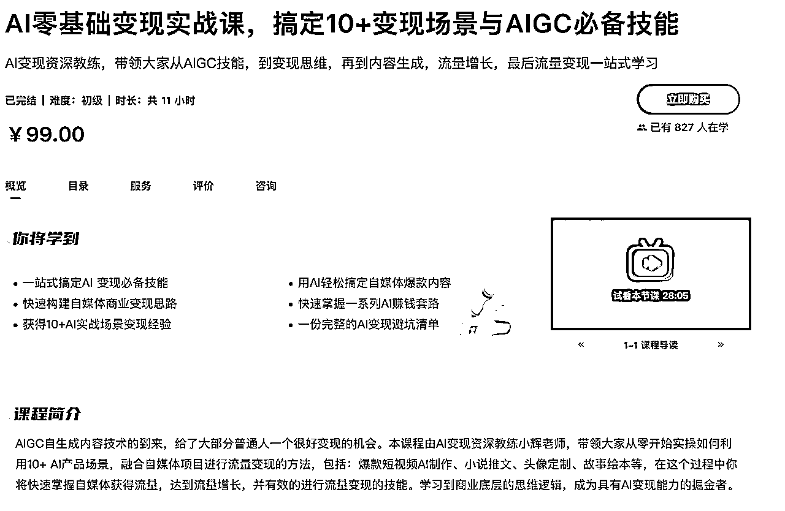

### 产品介绍：

定位：AI内容营销 + AI内容电商

目标：矩阵内容营销营销全流程

这个产品上线一年多时间，主要靠用户口碑传播和网站自然流量以及社交媒体和代理分销的流量，注册用户1.1w 平均每天为用户生成 5000+个视频，从最初的3k MRR到 后来的6w, 将近20倍的增长，这一路的经验和心得跟大家都聊聊，也顺便做个复盘。

为什么我们要选择做这个产品，选择这个赛道。

首先我们当时考虑电商和营销都是很长期的行业，已经存在了几十年，未来几十年还是会持续发展下去，其次这2个行业都是离变现比较近，所以用户付费意愿比较高，比较符合雪球的长坡厚雪理论。

简单展示下我们产品的案例效果：

这几个是本地生活和电商带货视频批量混剪的效果：

这个是视频去字幕的效果案例：

AI剪辑案例：

# 二、如何打造一款用户需要的产品

## 用户需求挖掘

产品需求的挖掘有很多方法，每个产品要解决的需求不一，而且匹配的运营和营销策略不同，所以具体情况要具体分析，但是随着我们对产品运营的思考，也总结了一些需求挖掘的方法：

1.  发现身边的需求：自己的需求 or 周围人的需求

发觉身边的需求是一个比较直接的方式，比如世纪佳缘的创始人龚海燕因为自己找对象不顺利，尝试用互联网来解决这个问题，先是做了一个“爱情日记”，网站记录自己找对象的过程，发现很多人有同样的需求，于是转型做婚恋交友平台。

这种就是典型的先解决个人痛点，再发现市场需求的创业路径。因为我们作为产品的用户深知市场供给和用户需求之间的不平衡，所以更容易跟我们的用户共情，对需求的理解也比较深入，就更容易创造匹配需求的产品。

发现周围人的需求也是一个不错的思路，我们经常会听到周围有些人会对某些产品的吐槽，这就是比较明确的需求未被满足的情况，所以我们经常用的去收集竞品的评论区就是为了发现未被满足的需求，当然这其中还有一些是隐性需求，用户不会明确说出来甚至连他们都没有意识到，比如Iphone未被发明之前，人们并不知道他们需求一个触屏手机，具体隐性需求的发掘可以去看看华哥（老华带你飞）的相关文章。

1.  榜单选品

这个有点类似于电商选品思路，我们之前做电商带货选品，就经常需要去数据分析平台看最近的商品榜单，根据榜单选出最近的爆款商品，那么套用到AI产品中也是适用的，比如我们经常会去toolify看产品榜单，这里面经常会发现一些近期上榜的新产品，既然在榜单上肯定说明有流量又用户需求，然后我们再筛选一下我们可以与之竞争的产品来模仿，那么说不定也可以蹭一波热度。

比如我们可以通过Toolify的月榜，尽量找100之后的，因为排名靠前的基本都是GPT这种大的产品，100之后的可能会有很多近期排名上来的新产品，我们就需要从这里面找出新产品，而且他的功能你基本可模仿，在次基础上，看付费流量和自然流量的占比，自然流量高于50%，可以认为搜索需求比较大，，那么这就是快速跟爆品的思路。

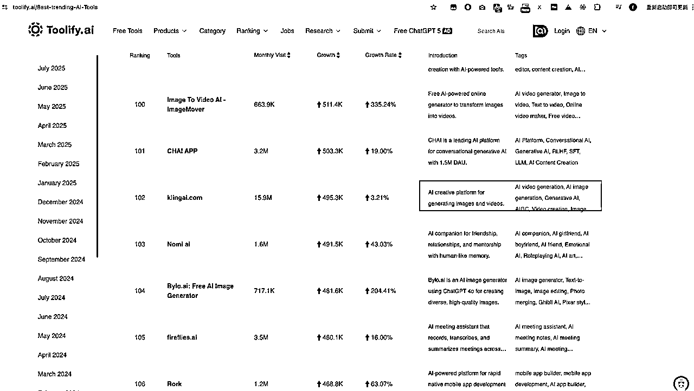

1.  竞品分析挖掘需求

如果你有了一个大致的方向，但是不确定自己假设的是不是一个伪需求，那么我们可以去研究一下有没有相关的对标产品，如果有那么我们就需要研究对标的商业模式，他是怎么赚钱的比如是广告还是付费订阅，他的流量渠道是什么，是付费流量还是渠道流量，如果你的对标产品有流量，有变现，那么基本上就可以确定这是一个比较明确的需求。

1.  目标用户需求挖掘

我们有了产品的方向就需要了解目标用户的真实需求，我们可以先假设目标用户的一些需求，然后通过一些手段来验证，当然不一定要开发产品，Dropbox早期只是做了一个视频来验证用户需求，所以我也可以通过类似的低成本的方式来确认我们YY的产品功能是否满足用户需求，甚至可以拿原型图跟用户沟通，如果我们设计的功能跟用户的实际需求有出入，那就可以快速改进。

## 构建-测量-学习 闭环 - 跑通MVP

《精益创业》中的核心原则就是从假设开始，而不是从产品开始，所以我们需要先通过用户需求挖掘明确产品的方向，当然这些需求大多都是我们自己猜测做出的假设，这个没有问题，关键是我们要去验证这些假设，我觉得做产品的过程大部分都是提出假设并验证假设的过程，从产品功能到时长运营，我们都需要先假设某个方法是对的，然后去验证，并不断积累经验。

有了需求假设，关键的是我们需要构建一套可以测量和验证这个假设的闭环系统 - 快速构建最小可行产品（MVP），用真实用户验证假设，再根据数据快速迭代，简单来说就是先快速上线，然后收集用户数据和反馈，通过持续迭代完善产品。

### 构建MVP

AIMIX在开发之初就通过自己对业务场景的理解和竞品调研明确了产品方向，并围绕用户真实的业务场景设计了产品功能，我们其实想做的是用户整个内容营销的闭环，从内容创意到内容制作再到内容分发，但在MVP阶段肯定不能做这么多功能，所以我们选择了内容制作这个入口，先快速开发出了一个最小可用产品，第一版产品很简陋，问题也很多，不过我们在推广到市场之后，有了第一批种子用户，也验证了我们的想法，并获得了用户的反馈。

### 可观测数据收集

数据收集是产品优化的指南针，通常我们需要找到产品的北极星指标，当然这个指标在产品的每个阶段也不同，可能在产品的初始阶段我需要的是提高日活和留存率这些指标，到了产品的稳定阶段可能就需要优化用户使用时长，而且B端产品和C端关注的数据又不太一样，C端产品尤其是社交类的重点关注的指标是用户日活和停留时长，比如抖音在早期的权重指标是考核创作者的视频完播率，所以早期的视频时长都比较短，那种7秒的视频比较容易爆，而到了存量时代，用户增长乏力，平台的核心指标又变成了用户停留时长，需要尽可能的收割用户时长，然后广告变现，这个阶段我们就发现平台上比较流行的是这种中长视频，而且经常会刷到几个小时的视频。

## 产品不同阶段的核心数据关注点

了解了这些可观测性的数据指标，我们又该如何收集，可以通过一些数据统计分析工具

1.  用户数据收集：

1.  百度统计：https://tm.baidu.com/ 百度的产品 百度为数不多的做的像样的产

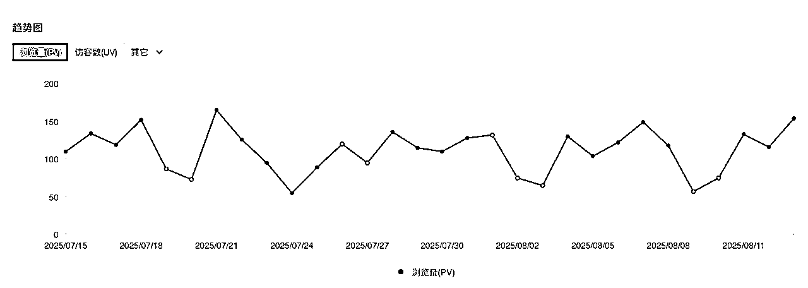

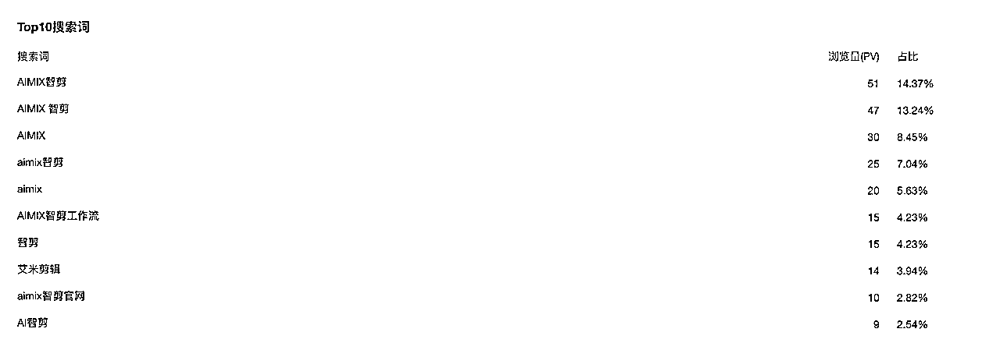

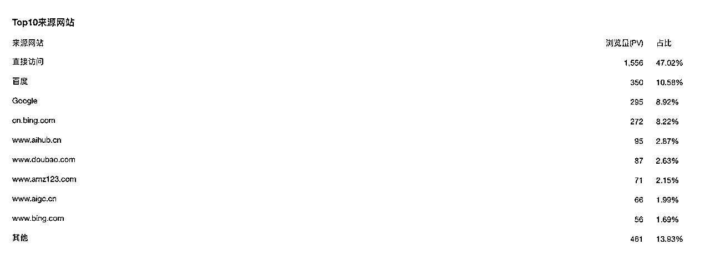

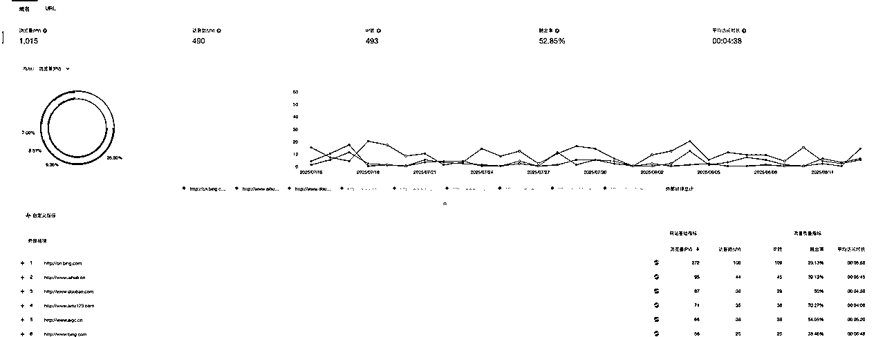

这些数据都能反映出你的网站的一些表现，比如UV可以反映你每天的流量有多少，有多少时新用户，如果你正在做增长那就需要重点关注这个数据，搜索的关键词和外链可以反映出你SEO的效果，我们这个官网的搜索词基本都是品牌词，说明SEO做的不好，没有产品关键词排名。外链可以反映你做推广的效果，比如这里面经常会有一些Doubao 或者 Kimi的来源，说明AI给你推荐的流量，就是最近比较流行的GEO。

1.  Umami 也是我比较喜欢的一个统计工具 开源可以私有化部署

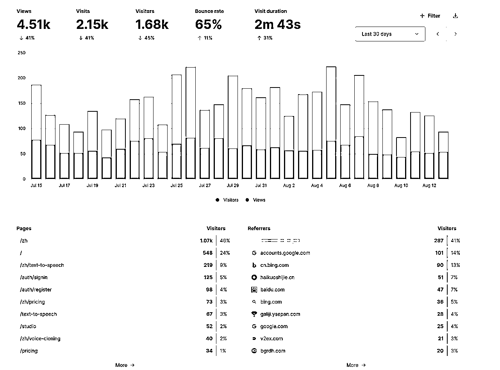

1.  Google Analytics 的功能就比较强大，能帮助你了解用户行为、流量来源、转化路径等，从而优化产品与营销。

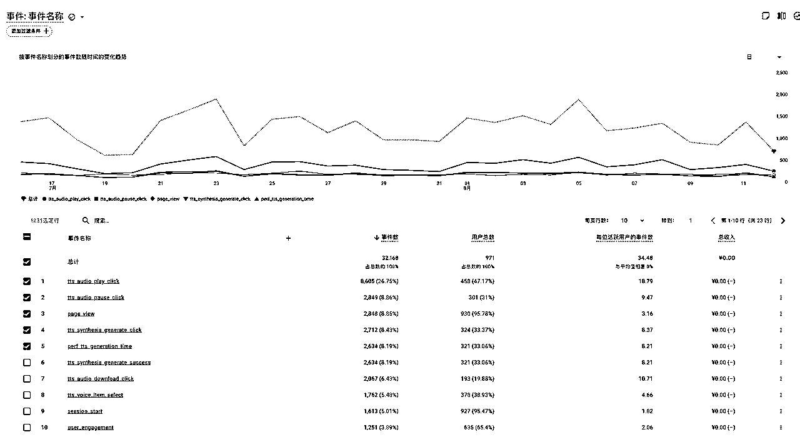

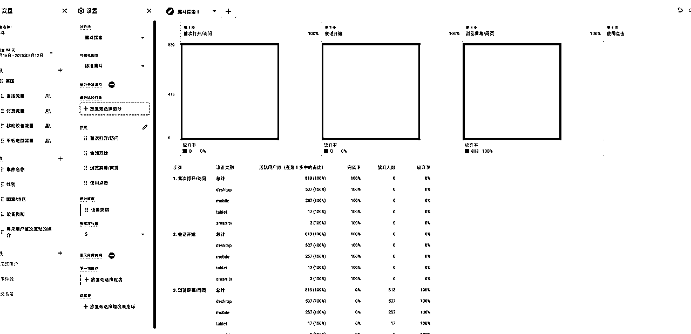

1.  Clarity https://clarity.microsoft.com/projects 热度地图和用户行为录像

Clarity 是微软提供的一个监控用户行为的免费工具，我们只需要注册接入网站就可以

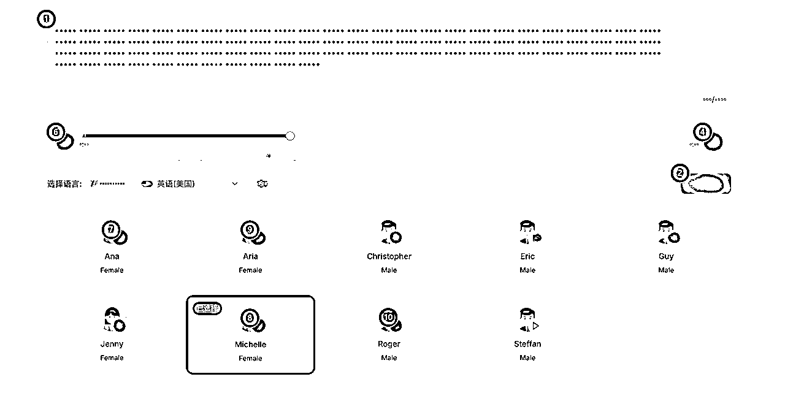

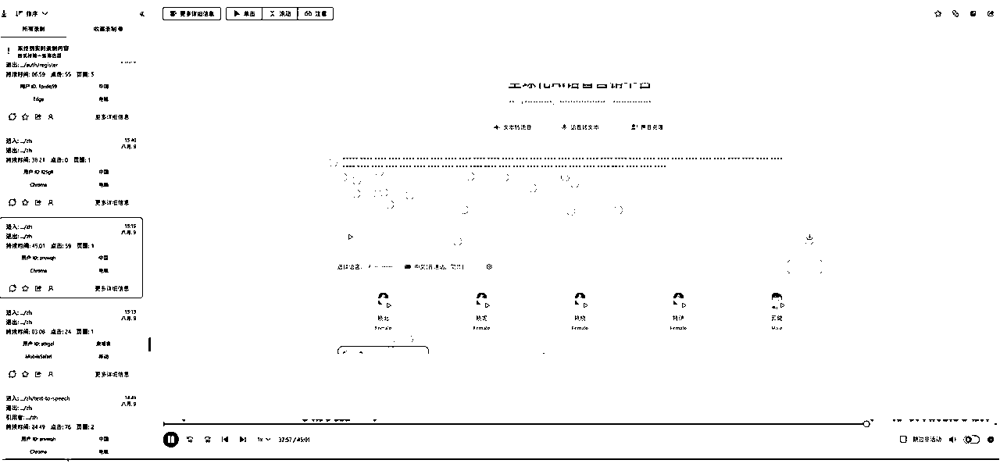

1.  Sentry 错误监控 产品的线上问题我们要及时通过监控工具进行发现 产品有问题是很影响用户体验的 从而影响转化率

Sentry 也是开源项目，可以用官网的SaaS服务或者自己部署，它的功能很强大，不只可以捕获前端异常，也可以捕获后端错误比如Nodejs。

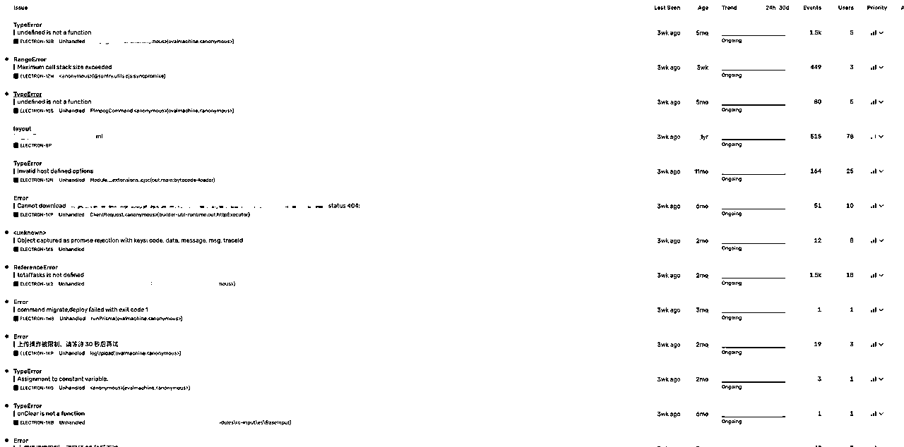

### 用户反馈收集

1.  首先我们可以在产品中加入反馈入口，引导用户对你的产品功能进行反馈，比如这个功能好不好用，有没有bug。

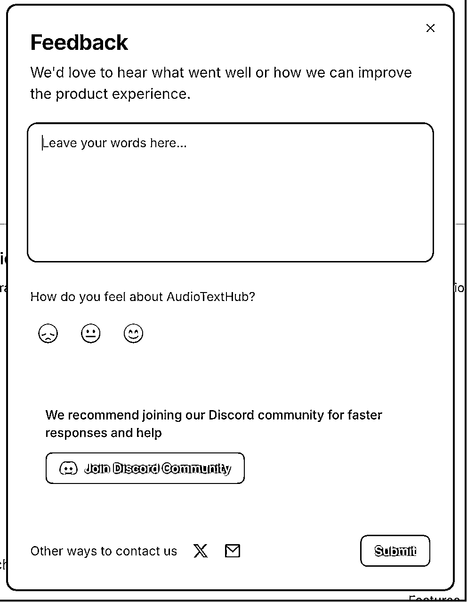

1.  我们是借助扣子开发了一个AI客服，如果是关于产品功能的咨询，AI客服会先查询产品知识库，可以即时解决用户的问题，这样即可以提升用户体验又能降低运营成本，因为纯人工客服是很消耗时间的，每天至少要消耗0.5人天在客服上，而且大部分都是一些基础的咨询，我们接入AI客服后，人工客服的进线率降低了70%，每天只需要回复bug排查问题。

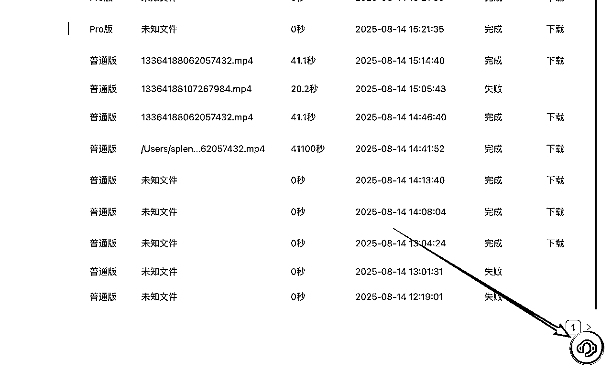

### MVP验证

我们是如何验证MVP的，其实我们的支付是在上线后几个月才接入的，那么我们怎么确定MVP已经得到验证了呢，那主要就是来自用户的反馈，一开始我们只是建了个用户体验群，用来收集用户反馈，很多还是生财圈友，因为圈友做自媒体和电商的很多，而且也能给出一些很好的建议，后面陆续就有客户来找我们定制开发功能，先后给成都和杭州的客户定制了短剧混剪、短剧解说和小说推文的功能。

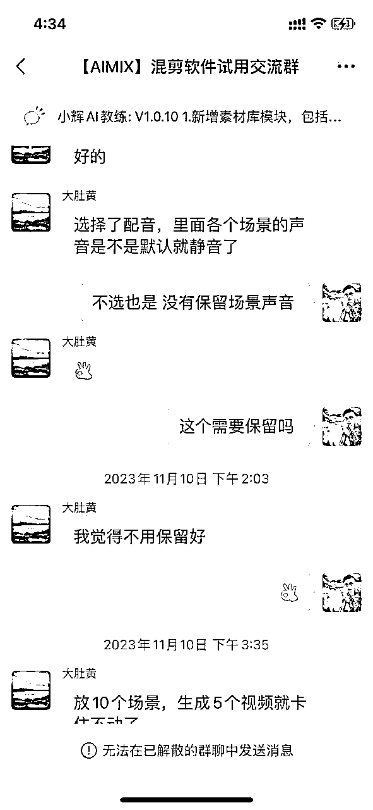

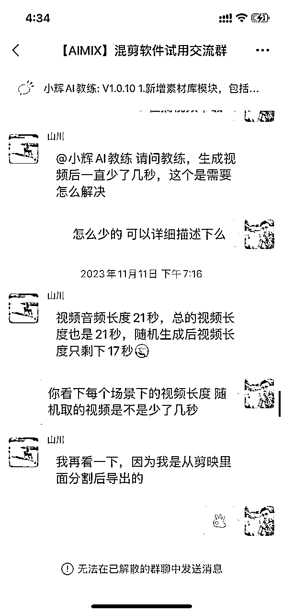

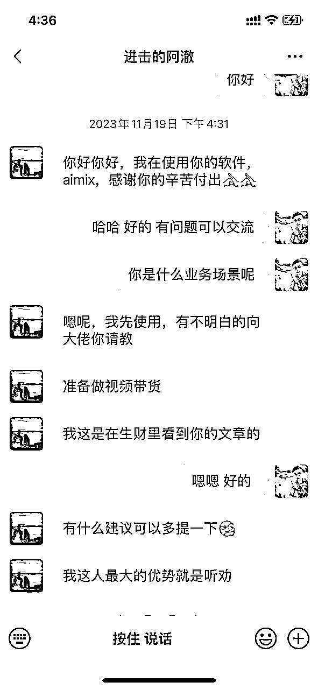

后面慢慢又有一些更强烈的用户反馈，这时我们感觉这个方向对了。

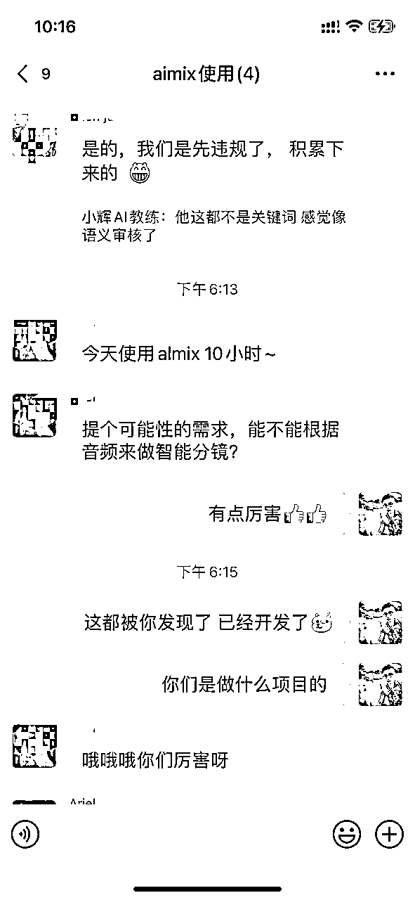

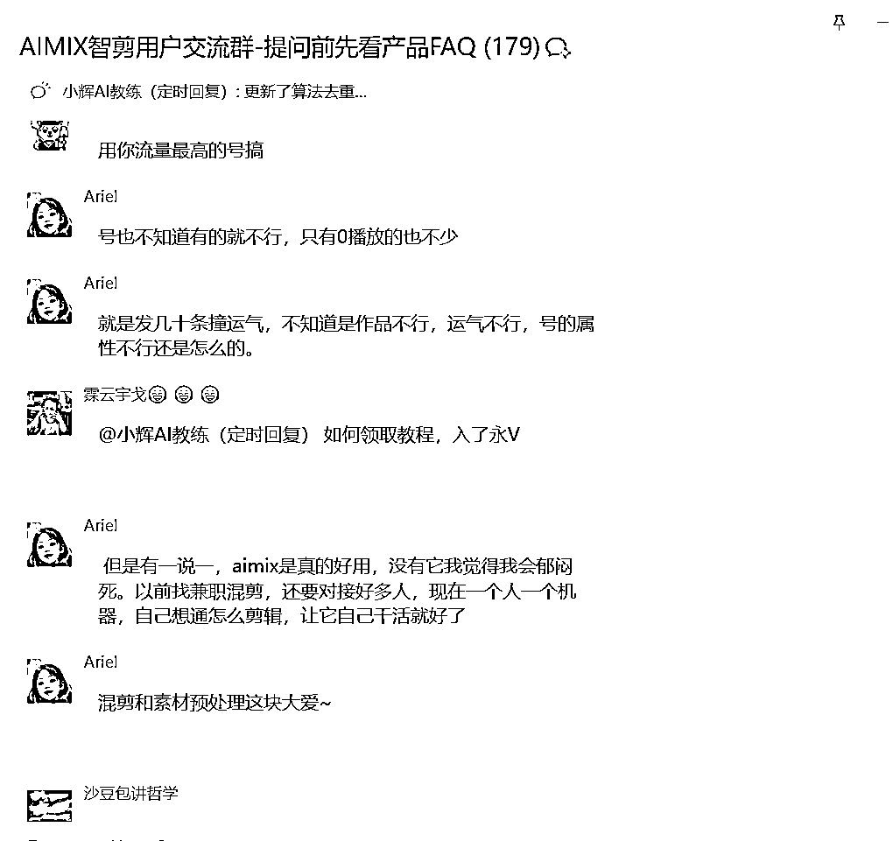

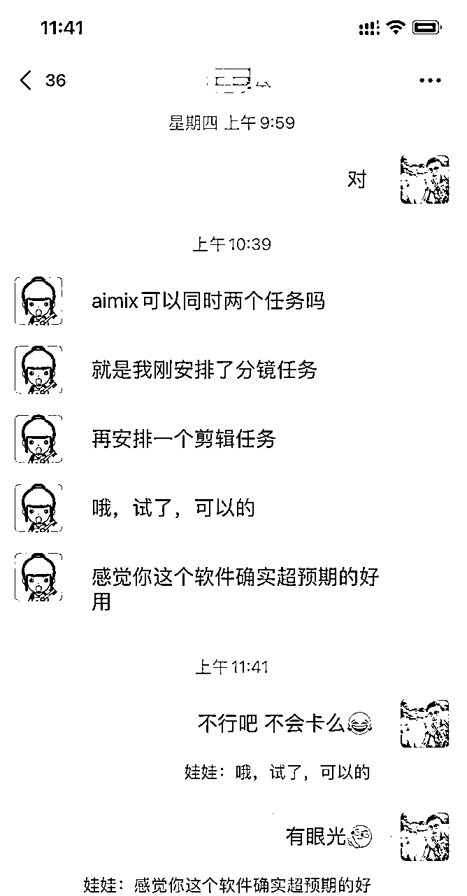

## 用户增长-增长最核心的是找到产品的PMF(Product-Market Fit，产品-市场契合)

### 增长和留存指标（产品使用行为指标）

*   用户活跃增长（DAU/MAU）

*   用户留存率高（如次日、7日、30日留存）

*   用户NPS（净推荐值）高，自发推荐朋友使用

*   自然流量持续增长（如有机搜索、口碑推荐）

### 商业转化指标（付费行为指标）

*   免费用户主动转付费

*   客户续费率、复购率高

*   CAC < LTV（获客成本小于生命周期价值）

统计转化率就需要结合数据统计和埋点比如GA来绘制转化漏斗，从用户访问到付费的每一层级的转化率都可以统计出来，然后根据用户行为数据进行分析影响转化率的原因，从而帮助我们优化产品。

我们产品还没有统计这么详细，所以转化率都是靠预估。

### 找到 PMF 的四步路径

* * *

#### 第一步：聚焦明确的“目标用户 + 痛点”

你要回答清楚：

*   我的产品是为谁解决问题的？（用户画像清晰）

*   用户的核心痛点是什么？（强需求而非伪需求）

✅ 方法：用户访谈、调研、问题深挖五问法、竞品评论分析

✅ 工具：用户旅程图、Persona 模型、JTBD（Jobs to be done）

比如我们可以从高频和刚需2个维度来划分产品的需求程度：

刚需高频：像微信、支付宝这些生活、即时通讯录的产品，每天都离不开

非刚需高频：比如抖音、微博这些娱乐类的产品，虽然不是刚需，但是很容易让人上瘾，用来打发时间是首选

刚需非高频：一般都是一些工具类的产品，日常工作会用到，但是频率没有那么高，尤其是一些行业类的产品，是我们创业可选的路径

非刚需非高频：这类产品的用户付费意愿就没那么高了

#### 第二步：构建 MVP（最小可用产品）进行验证

不要一开始就开发全功能版本，而是聚焦解决最核心的需求，快速推出原型测试。

✅ 工具：低保真原型（Figma）、快速 Landing Page + 表单收集意向、MVP 快速开发框架（如 no-code/low-code/SaaS）

前面我们有提到过构建MVP的方法，不一定要开发出产品，关键是能验证你的假设。

#### 第三步：观察用户行为，快速迭代

关键指标跟踪：

*   用户是否会主动留存？

*   是否有使用“深度”（某一功能频繁使用）

*   是否愿意为产品付费？愿意推荐？

✅ 方法：用户行为分析（如 Mixpanel）、留存漏斗图、A/B 测试、用户访谈

这个步骤就需要结合一些数据统计和分析的方法来辅助我们做出判断和决策，通过数据的指导我们就可以准确判断产品的方向是否正确，因为数据是不会骗人的。

而且，快速迭代是接近PMF的最短路径，我们产品上线1年多时间迭代了有30多个版本：

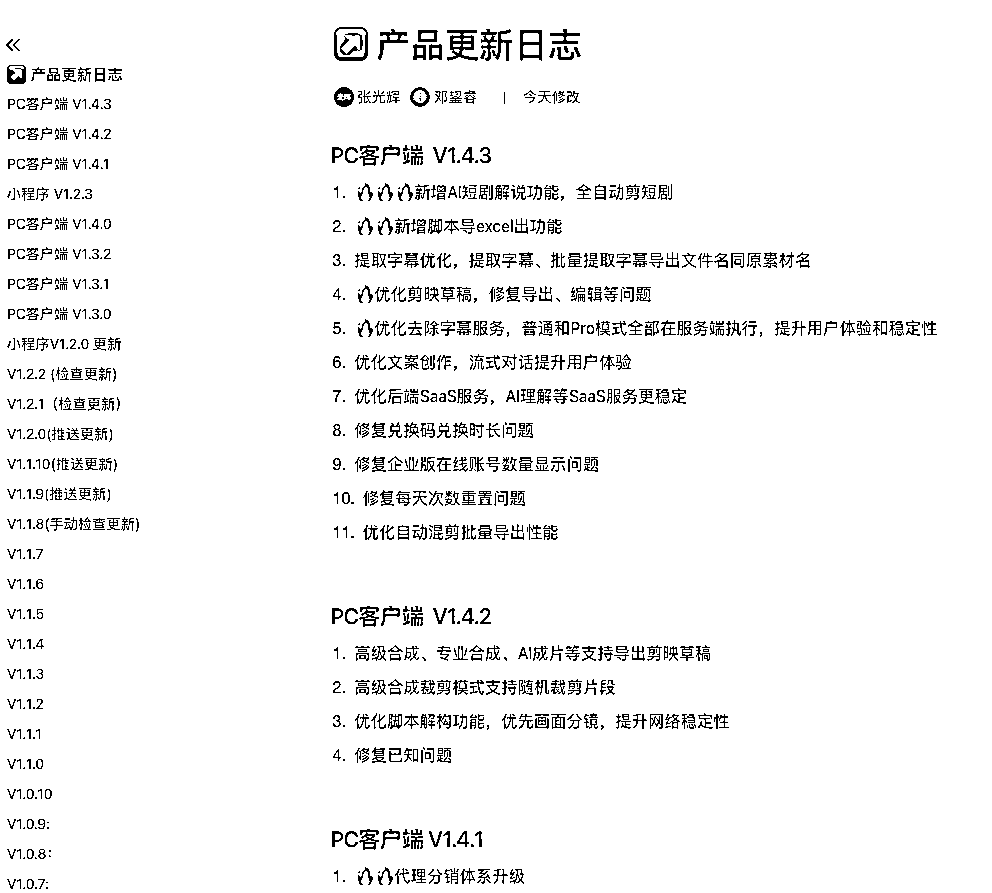

我们产品的第一个版本还比较原始，只有几个功能，迭代到现在就变的越来越体系化

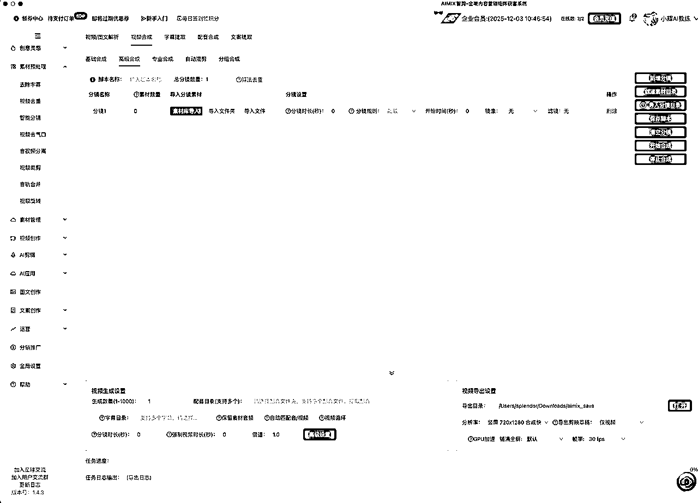

#### 四步：打磨产品价值主张（UVP），扩大传播和转化

当你在某一小群用户中发现了强烈的粘性和自然增长，就可以进一步：

*   明确你的独特价值主张（Unique Value Proposition）

*   构建强转化的增长通道（Referral、内容、广告）

*   开始复制用户群体，扩大规模

经过前面几个阶段，我们的产品应该就可以跑出一个比较稳定的增长模型，比如你是通过广告投放增长还是是口碑营销或者SEO等，这一步要做的就是放大增长模型，不断复制你的模型，开始跑马圈地。

## 三、产品之间的竞争归根结底是价值网络的竞争

产品之间的竞争从来就不是单一维度的，所以我们只是模仿竞品的功能还不够，可能我们在营销渠道方面无法与之竞争，所以我们要不断完善自己的价值网络。

我们产品目前的运营策略都是围绕提高价值，不断增强价值网络，我们已经意识到，我们产品的复杂度和专业性，自然增长就是比较慢，一是我们产品是客户端，用户需要下载安装，这就增加了多个环节，还有使用中的环境的差异性和兼容性导致的问题，二是这算是比较专业的工具，需要用户有剪辑基础，所以也是需要一定的学习成本，所以产品的性质决定了增长的复杂度。

因此，我们对产品的定义不只是一个工具，我们需要对用户交付的是一个完整的服务，从用户使用前的咨询到使用中的文档教程以及售后服务，这整个流程体验是用户完整的服务体验。我们一方面已经写了大量的文档和录制了视频教程，然后针对矩阵运营的知识体系制作了一个体系课，等等这些都是在增强产品价值网络。

这模式也基本已经验证了可行性

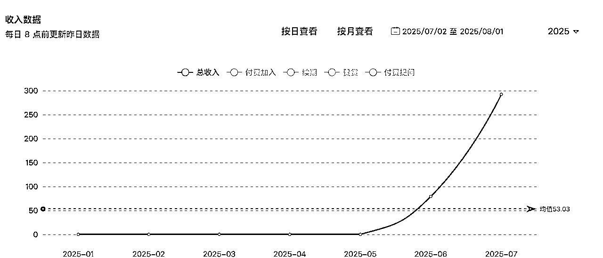

## 四、出海探索

我们也在尝试做海外市场，一是把AIMIX智剪这个产品做出海，比如出其他语言版本，但是考虑到海外市场环境和用户习惯可能跟国内不同，而且主要做矩阵和批量混剪的基本都是中国人，包括海外平台tk啥的，但是需求应也是在的，已经有一些海外用户，比如有一些马来西亚、柬埔寨、英国等，不过还是那句话，先上线再优化。

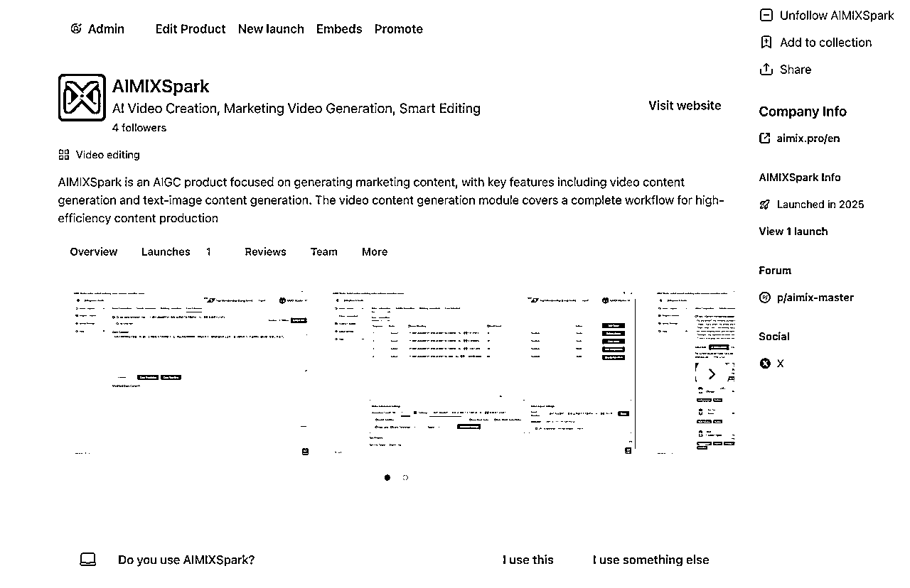

来了SCAI之后也在开发一些海外产品，出海的路还是需要摸索。

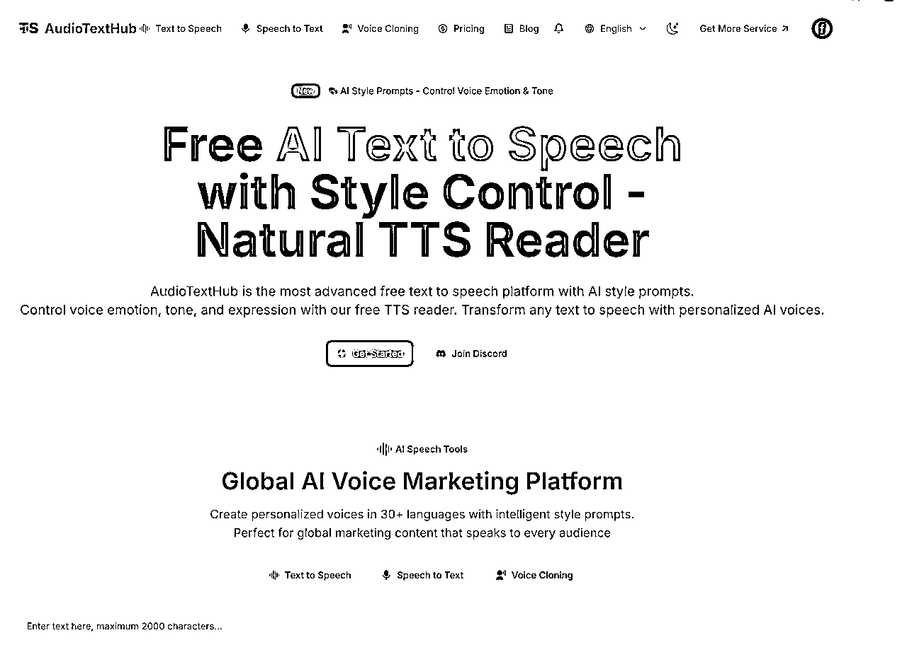

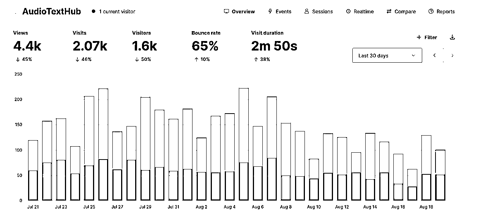

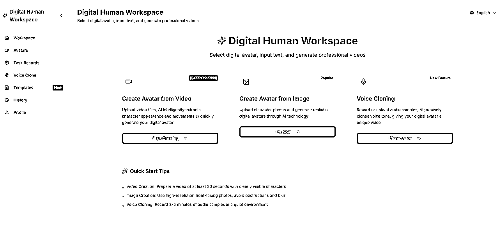