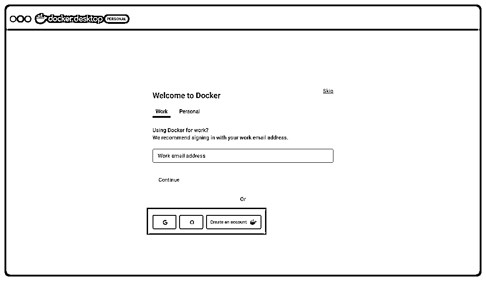
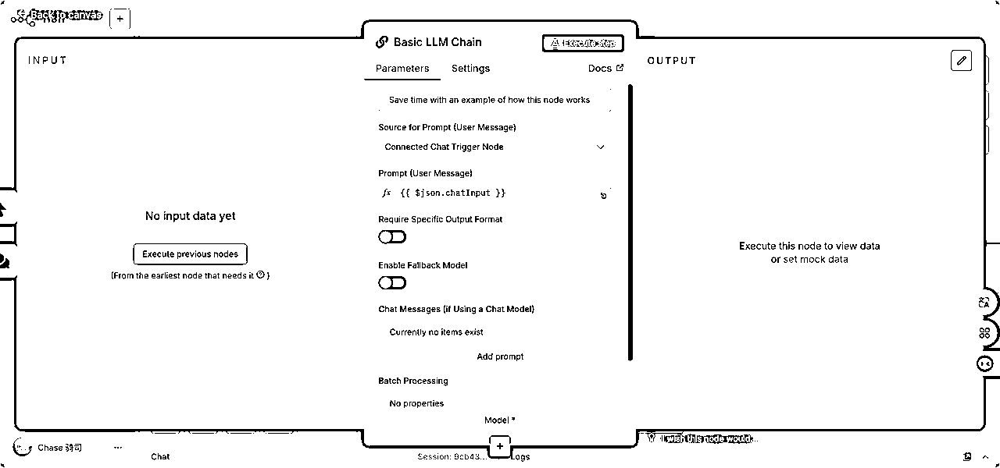

# n8n 保姆级万字指南-【认识-熟悉-实践】三板斧

> 来源：[https://rcnawx71yojy.feishu.cn/docx/HP9ZdhWOfoVvQRxdLgzc16bJnQf](https://rcnawx71yojy.feishu.cn/docx/HP9ZdhWOfoVvQRxdLgzc16bJnQf)

大家好，我是 骑司Chase

【越分享，越幸运】这篇文档，是我为 n8n 初学者准备的一份入门礼物。如果你能每天花一点点时间探索和实践n8n，就能解锁一项强大的能力：自动化你的工作流，甚至整合 AI 的力量。

如果一年前的我有看到这份指南，一定能省下十几个小时的摸索时间！能更快地上手，理解 n8n 自动化背后的逻辑，掌握这套可以被称之为「现代工作者魔法」的技能——用更少的精力，创造更高的产能。

先说一个暴论：掌握 n8n + 自动化工作流 = 现代人的魔法

n8n：属于你的【生产工具民主化】

如果说 3D 打印让生产工艺触手可及，那么 n8n 则为我们这些非程序员开启了「应用自由」的大门。不需要编程基础，我们就能根据自己的个性化需求，亲手构建独特的解决方案！

「自动化」的核心逻辑，其实很简单

当 [应用 A] 发生了 [事件 X]，则自动在 [应用 B] 执行 [动作 Y]。

把 [应用 A/B] 换成你日常的工具： 把 [事件 X/动作 Y] 换成具体的操作：数据库状态更新、内容生产、新数据录入、邮件发送、消息通知...

关键在于，当我们理清工作步骤，画出流程图时，就会发现：许多重复性任务，根本无需亲力亲为。 让工具成为我们的「自动化助手」，替你高效执行。

准备好开始了吗？在这篇指南中，我将带你从认知到实践，掌握n8n。从了解n8n的基础知识到亲手创建第一个自动化工作流，让你能够专注于真正重要的事情！

指南特点：

1.  由浅入深： 从基本概念、安装...开始，逐步过渡到复杂工作流和其他功能。

1.  模块化： 使用ctrl+F/cmd+F，可以根据自身需求跳读或精读特定部分。

1.  学习底层逻辑：指南的部分板块不会逐步教你每个服务的配置方法，而是会说明如何利用搜索引擎、ChatGPT等底层思考方式来自学。与其直接给出答案，骑司更希望教会你解决问题的方法。这些内容是n8n官方文档没有提到的，毕竟低代码平台只专注于解决不会写代码的问题，而关于如何配置各种应用板块并不在其职责范围内。

# 开始之前需要准备的工具

1.  网络环境🧙‍♀️

1.  沉浸式翻译：一款贴心的浏览器插件，对于英语不太好的同学，有了它，你可以更加轻松地浏览 n8n 官方文档和论坛，或者让你在官方论坛提问时更加便捷无忧。

1.  准备几个强大的AI对话工具，在操作 n8n 遇到任何问题时，你可以把截图、文字直接丢给AI，让他们帮你解答疑问。不建议使用国内AI工具，对 n8n 的数据训练比较少，容易出现幻觉。

1.  有问题需要解决（n8n问题请描述卡点、拍摄视频）、合作、交朋友，找鱼丸链接

# 一、认知篇

## 1.1 什么是 n8n？

简单来说：

n8n 是一个开源的、可视化的自动化平台。它让你无需写代码，就能像搭积木一样连接不同的应用和服务（如邮件、表格、文档、数据库、AI 模型、甚至你公司的内部系统），创建自动执行任务的「工作流」（Workflow）。


想象一下：每天在不同软件之间切换——在企业微信收到客户咨询，手动复制到飞书记录，再打开腾讯文档更新状态，最后还得提醒自己用钉钉通知同事……这些重复的琐事，不仅耗费精力，还容易出错。

而 n8n 就是为了终结这种「数字搬运工」生涯而生的强大工具！

一旦你设置好了工作流，n8n 就会24 小时监控触发条件。一旦条件满足，它会立刻启动，严格按照你的流程图，在后台高效完成所有串联的任务。

## 1.2 n8n 能做什么？

n8n 是一个理想的自动化工具，无论是日常流程还是结合 AI 的智能应用，都能轻松实现。

1.  客户管理自动化：新客户注册后，自动发送欢迎邮件，同时录入 CRM（如 Notion 或 Airtable），并通过 Slack 通知销售团队，让每个客户都受到及时关注。

1.  内容运营：订阅 RSS 获取最新文章后，自动生成摘要，并利用 AI 进行改写或翻译，最终发布到 Twitter 或 LinkedIn，让内容更高效传播。

1.  智能通知：实时监控商品价格、股票行情或天气变化，当低于预期或出现异常时，自动通过短信或邮件提醒你，确保重要信息不错过。

1.  数据桥梁：收集 Google Form 提交的数据后，自动同步到 Google Sheets 和 Notion 数据库，并生成详细的 PDF 报告，通过邮件发送，减少繁琐操作。

1.  AI 助手集成：收到特定邮件时，让 AI 分析内容并草拟回复建议，你只需审核后发送即可，提升沟通效率。

1.  内部流程自动化：审批流程、报告生成、数据备份以及跨部门数据同步等繁琐任务，n8n 帮助你轻松完成，减少手动操作的压力。

1.  ......

## 1.2 为什么说n8n强大且【有深度】？

1.  无代码，但绝不流于表面：

*   可视化 ≠ 简单：n8n 提供了友好的操作界面（拖拽连线），但它背后运行的是一个功能强大的工作流引擎，能够深度集成复杂的 API。它不仅支持条件判断 (if...else)、循环、数据转换和错误处理等核心编程概念，还通过图形化的方式展现，让你可以更专注于业务逻辑，不用研究繁琐的编程语法。

*   无限可能性：n8n 是个人开发者或小型企业中的全能王，内置了近千种常用应用节点（如 Google、Microsoft、Notion、Slack、OpenAI 等），同时还支持通过 HTTP 请求、Webhook（自动触发） 或自定义 JavaScript/Python 代码节点，连接几乎任何支持 API 的服务（包括私有系统）。它的扩展能力几乎没有边界，可以为我们的创意提供无限空间。

*   并且自部署版的 n8n 有着丰富的本地调用能力，比如对本地数据库、文件的增删改查，对服务器进行操作等等。这意味着，你可以在不改动现有业务系统的情况下，让 n8n 成为寄生系统，为原有的工作流增添自动化和 AI 功能。


1.  开源的力量：

*   自由掌控： 作为开源软件，你可以免费在自己的电脑或服务器上安装运行（自托管），支持 Docker 一键私有化部署，完全掌握自己的数据和自动化流程。

*   社区驱动： 全球开发者共同维护，不断贡献新节点和功能，如果我们遇到了问题，社区里很可能已经有解决方案了。


1.  拥抱 AI：

*   内置图形可视化的 LangChain 节点，对 AI 支持良好。原生集成ChatGPT、Claude等节点，轻松将 AI 能力融入你的工作流：自动回复邮件、总结文档、生成报告、分类数据……让 AI 成为你自动化流程中的贴心助手，真正为你节省时间、提升效率。


1.  兼顾低代码与代码：

*   与 Coze 和 Dify.ai 相比，n8n 在无代码与代码之间找到了一个难得的平衡点。对于已经包含在 n8n 节点库中的第三方服务，你只需通过简单的拖拽操作即可快速完成接入。而如果你需要的功能尚未在官方节点库中提供，n8n 同样支持通过 HTTP Request 接入几乎任何支持开放 API 的第三方服务，灵活性极高。

*   许多编程零基础的用户在使用 ChatGPT 时常会发现，ChatGPT 更擅长生成某个具体步骤的代码片段，而不擅长构建完整的工程。而 n8n 则恰好弥补了这一不足：它让你可以像搭积木一样，通过拖拽的方式快速构建工作流；当你发现缺少某块特定的“积木”时，又可以直接将 ChatGPT 生成的代码片段嵌入其中，完美结合两者的优势。


## 1.3 不会编程能不能学？

很多人一听到「自动化」就觉得那是程序员的专属，认为没有专业的编程背景就无法掌握。其实，这种想法真的不必要。

AI 的发展让学习、解读和生成代码变得异常轻松，无论你遇到任何问题，都可以先尝试交给AI解决。在构建自动化的过程中解决实际问题，这才是学习 n8n 的正确方式。

在这个时代，「不是某某专长，就不能做某某事」的观念已经逐渐过时。不管你是创业者、自由职业者，还是小型团队的一员，自动化工具都能帮你节省大量时间，释放更多生产力。相信自己，你就可以做到。


## 1.4 为什么低代码在当下越发值得学习？

从 ChatGPT 上线以来，流行着一句话：“AI 不会淘汰人，只会淘汰那些不会用 AI 的人。”这句话虽然简单，却道出了一个深刻的现实。

对于许多非技术背景的人来说，AI 的认知往往是模糊的——有时候觉得它无所不能，有时候又觉得它什么都做不了。这种矛盾的认知其实源于一个问题：他们无法区分 AI 作为一种技术和 AI 作为一种产品的能力与局限性。

比如，有同事问我：“为什么 ChatGPT 不能批量处理表格中的数据？”原因在于 ChatGPT 是一个产品，它的设计决定了它无法在对话过程中自我调用。这意味着，你无法直接让 ChatGPT根据 Excel 某一列的内容生成另一列的结果。

又比如，有人问我：“为什么用 OpenAI API 不能实时搜索互联网的信息？”这是因为 API 不是一个完整的产品，它仅仅提供了大模型的核心能力。如果你希望既能搜索资料，又能利用 API 的能力，就需要额外搭建工具，让 API 能读取互联网搜索到的信息。

我们可以用一个形象的比喻来理解：

AI 产品（如 ChatGPT、豆包）就像一个手里塞满固定工具的人，它除了对话和思考，还能使用厂商规定的功能完成任务。但由于成本和安全的限制，厂商通常会对它的能力和工具使用范围进行限制。

AI API 则像一个手中没有任何工具的人，它只能依靠自己的知识进行对话和思考，无法完成其他任务。但你可以为它提供工具，比如 Excel 或 Notion，让它能够按照你的需求行动。

实际使用时，我们会发现，ChatGPT 可以直接读取 PDF 文档，但受限于成本，PDF 的字数不能超过 10 万字。而 GPT-4 的 API 本身无法直接读取 PDF，但如果你搭建好工作流让它能够读取 PDF，它甚至可以处理 100 万字的文档，但成本需要由你来承担。

因此，为了最大化 AI 的价值，我们最好采用 API 的方式使用 AI。同时，为了让这个“双手自由”的 AI 能够使用得心应手的工具，我们需要为它设计一些工程，让它能够与现实世界互动。

那么问题来了：如果我不是技术人员，如何为 AI 打造工具呢？答案是 n8n。

n8n 是一个图形化的低代码自动化流程平台，最初它的用途是自动化日常工作流，比如那些“学会 Python 工作不愁”的场景。通过简单的拖拽操作，你就可以构建工作流。

对于个人用户来说，n8n 的工作流可以帮助节省时间；而对于 AI 来说，n8n 则像是打开了与赛博世界中其他事物互动的桥梁。

AI 作为一种程序，它与世界互动的方式其实和我们一样。以整理数据为例，我们会用鼠标打开 Excel，找到文件，修改数值并保存。而 AI 没有鼠标和眼睛，它需要 OpenFile 函数来打开文件，需要 EditFields 函数来定位单元格，还需要 SaveFile 函数来保存修改后的文件。

在不同编程语言中，这些函数的名字可能不同，但在 n8n 中，它们都变成了可视化的节点。通过这些节点，非技术人员也可以轻松构建工作流，让 AI 在赛博空间中发挥最大的潜能。

通过 n8n，你可以让 AI与超过1000种节点进行交互，几乎能够与赛博世界中的所有主体无缝连接。而且在整个过程中，你几乎不需要编写任何代码，只需简单地拖拽操作并设置一些参数即可完成。

至此，你真正迈出了成为“会用AI的人”的重要一步。


## 1.5 哪些工作情境，很适合、需要自动化？

1.  常重复、需要耐心的任务：数据抓取与整理、跨平台信息迁移、重复性文档编辑与格式调整、简单表格数据录入、批量生成二维码或条形码。

1.  执行步骤明确的工作：邮件批量发送、文件分类归档、标准化合作邀约回复、固定模板的报告生成、定期备份系统数据。

1.  耗时且繁琐的任务：行政审批流程（如请假、报销）、月度财务数据分析与汇总、长时间的会议记录整理、合同条款逐一核对、复杂表格公式校验与调整。

## 1.6 核心概念自查

1.  开源：软件的源代码是公开、免费的，任何人都可以查看、使用、修改和分享它。就像菜谱公开了，大家都能照着做菜或者改良菜谱。

1.  可视化：指用看得见的方式（比如拖拽图形、画线连接）来操作，而不是写复杂的代码文字。就像用拼图或积木搭建东西。

1.  自动化平台：一种软件工具，帮助你设置规则，让电脑自动完成重复性的任务，代替人工操作。

1.  工作流：指完成一项任务需要经过的一系列步骤。在 n8n 里，就是把多个步骤（比如收邮件、存数据、发通知）像流程图一样连接起来，让电脑自动执行这一整套动作。

1.  应用和服务：这里指各种软件工具，比如微信、邮件系统、在线文档（如腾讯文档）、数据库（存数据的地方）、AI模型（如ChatGPT）、公司内部使用的软件系统等。

1.  节点：在工作流图中代表一个具体动作或步骤的小模块（图形块）。比如“读取邮件”是一个节点，“发送通知”是另一个节点。把它们连接起来就构成了工作流。

1.  触发条件：启动一个自动化工作流的“开关”或“信号”。比如“当收到新邮件时”、“当时间到达早上9点时”。

1.  CRM：客户关系管理系统的缩写。是一种用来管理和跟踪与客户互动、信息的软件或系统（比如记录客户联系方式、购买历史等）。

1.  RSS：一种获取网站更新（如新闻、博客文章）的技术。订阅 RSS 就像订阅杂志，网站一有新内容就会推送给你。

1.  API：应用程序编程接口的缩写。简单理解就是不同软件之间互相沟通、交换数据和功能的“桥梁”或“约定好的传话筒”。n8n 就是通过调用各种服务的 API 来实现自动化的。

1.  Webhook：一种特殊的 API 使用方式。它允许一个软件在发生特定事件（比如收到新订单）时，自动“呼叫”并通知另一个软件（比如 n8n），相当于一个自动触发的信号。

1.  部署：指将软件安装并运行在某个地方（比如你自己的电脑或服务器上）的过程。

1.  本地调用：指软件（n8n）直接操作你电脑（或服务器）上的资源，比如读取电脑上的文件、访问安装在同一台机器上的数据库。

1.  数据库：一种电子化存储、管理大量数据的系统，就像一个结构化的电子文件柜或表格集合。

1.  私有系统：指公司或组织内部自己开发或使用的、不对外公开的软件系统。

1.  条件判断 (if...else)：编程中的基本逻辑，意思是“如果满足某个条件，就做A事；否则（不满足条件），就做B事”。例如“如果订单金额大于100元，则免运费；否则，运费10元”。

1.  循环：编程中的基本逻辑，意思是重复执行某些操作，直到达到某个条件才停止。例如“给名单上的每个人发送一封邮件”。

1.  数据转换：将数据从一种格式或形式改变成另一种格式或形式的过程。比如把日期“2023-08-17”转换成“2023年8月17日”。

1.  错误处理：指在程序运行过程中预料到可能出错的地方，并提前设置好应对措施（比如记录错误信息、尝试重试、发送警报），防止整个流程崩溃。

1.  扩展能力：指软件能够通过添加新功能（如支持更多应用、使用自定义代码）来增强其原本的能力，满足更多需求。

1.  Slack, Notion, Airtable, Google Sheets, Twitter, LinkedIn, 企业微信, 飞书, 钉钉, OpenAI 这些都是具体的应用或服务名称。对于零基础用户，可以简单理解为“聊天软件”、“在线文档工具”、“社交媒体”、“AI公司”等，不需要深入解释其具体功能，知道它们是 n8n 可以连接的对象即可。

1.  审批流程、财务数据分析、会议记录整理、合同条款核对、表格公式校验 这些是具体的工作任务描述，其含义相对直观，可以理解为“各种需要花时间手动处理的办公室工作”。

# 二、准备篇

## 2.1 n8n 本地部署（后续维护升级无忧版）

### Step1 下载docker，注册并登录docker

▼打开docker官网链接🔗 https://www.docker.com/ 如下图示，下载设备对应的docker版本


▼安装后注册（如有账号忽略）并登录docker，给了三种登录方式，都可以选择



### Step3 使用docker安装n8n，并进行配置

▼左侧找到Docker Hub，搜索n8n，点击第一个


▼点击右上角的Pull


▼再点击左侧image栏，等待下载完毕后，运行


▼在电脑中创建一个n8n文件夹用来放数据，并复制他的路径


▼将复制的路径粘贴到volumes中的第一格中（host path）


```
n8n
5678
你创建的文件路径
/home/node/.n8n/
```

### Step4 等待运行完毕，点击链接，大功告成🎉🎉


## 2.2 熟悉n8n界面和功能

n8n 的创始人是设计师不是程序员，这也让这个产品的 UI 界面设计达到了非常高的水平。界面中运用了大量“拖拽”式的交互设计，对于不太熟悉这种交互方式的人来说，可能会显得有些复杂和不直观。但其实只要多尝试点击、拖动等操作，往往能发现一些意想不到的惊喜。

熟悉之后，你会发现 n8n 的用户体验确实非常出色。

### 2.2.1 左侧栏：工作流、凭证和执行记录

点击左侧的 Overview（概览），就会进入你的 Workflow（工作流） 页面，上方的页面分别为：

*   Credentials（凭据）：统一存放、查看每一个凭证的地方。

*   Executions（执行）：也就是全部工作流的「执行记录」，记录自动化工作流程每一次运行过程、结果和可能出现的问题。若有发生错误，则会出现 Error，可以借此查看错误发生在哪一个节点。


### 2.2.2 顶部工具栏：工作流的管理、设置、导入导出

包含工作流名称、开启关闭工作流、保存工作流、共享和导入导出……等功能按钮。


### 2.2.3 中央工作区：白板工作区

绘制、建立工作流的主要区域，可以在此放置和连接不同的节点，还有利用便利贴（Sticky Notes）撰写备注。


#### 2.2.3.1 编写工作流操作说明书

在建立和测试自动化工作流时，往往需要不断点击 Execute step，反复验证流程是否正确运作。

但是工作流启动正常运行，我们一般并不会常回来检查——除非发生错误。

记录工作流的思考逻辑和步骤，其实是在为未来的自己或他人写一本操作指南，这也是一种深刻的复盘过程。复盘不仅仅是简单地回顾，更是为了未来能够进行真正有效的学习。

养成记录的习惯，不只是为了方便自己快速理解工作流，更是在关键时刻为问题诊断提供可靠依据，让自动化工作流变得更容易维护。

你可以使用 n8n 的「便利贴」功能来记录工作流的思路与步骤：

1.  打开工作流：进入 n8n 界面，找到并打开你要记录的工作流

1.  添加便利贴：点击工作区右侧的便签按钮

1.  开始记录思考逻辑、步骤记录：Sticky Note 支持 Markdown 格式，所以也可以加入不同标题大小、粗体、链接等等。


#### 2.2.3.2 Executions介绍

在画布的最上方选择切换到 Executions 可以看到本工作流历次运行的记录。

这个功能非常实用，因为 n8n 的画布不支持自动保存，如果我们想要翻找历史上设计的一些逻辑，就可以通过这个方式进行找回，甚至把他们复制到画布当中去。

Executions 界面中的每个节点都是可以点击的，你可以找到其中的详细配置与 Log。


#### 2.2.3.3 操作技巧说明

1.  画布在支持用触控板和界面左下角的缩放按钮进行缩放。

1.  画布上的每一个节点都支持鼠标拖拽，当鼠标悬浮到特定节点上时，每个节点自身也有一个➡️，这个代表的是单步执行，也就是只有这个环节的跑一下程序，这个在 Debug 的时候会非常有用。


1.  注意：n8n 的 workflow 画布不支持自动保存，记得随时【ctrl+s】进行保存。

### 2.2.4 右侧面板：node 节点功能面板


点击“+”后，会列出所有可用的节点（Nodes），可以按照类别、名称搜索节点。当选中某个节点时，就会自动新增到中央工作区，可开始拖拉进行工作流的构建。

#### 2.2.4.1 自动化核心概念：触发器和操作

自动化工作流通常由 2 种节点组成：触发（Trigger）和动作（Action）。

举一个生活常见的例子：「当 08:00 的闹钟响了，就起床刷牙。」

闹钟的「触发点」就是早上八点；起床刷牙则是要执行的「动作」。

触发节点：何时执行工作流程？

这个节点就是告诉 n8n：「嘿，开始执行动作了！」

例如：当收到有人填写 Notion 表单时、发布了一则脸书帖子或特定时间到时。

在添加节点时，只要在节点后看到「闪电符号」，就代表它可以作为触发节点。


动作节点：需要执行哪些操作？

当上面的触发节点被启动时，动作节点就会开始执行特定操作。

例如：09:00 开始发送电子邮件摘要，或是当有新订单时，自动更新 Notion 数据库数据……等等。

提示：在一个工作流里，通常会包含多个动作节点。

动作节点越多，要进行的测试就越多，如果工作流出错的话，要检查的地方也越多。建议初学者一开始先从简单的工作流开始练习，再慢慢递增！

自动化的数据存储？

当你决定触发点以及要执行哪些操作后，还有一件很重要的事情，就是决定“数据存储、输出”的地方。

比如我常用的 Notion、Discord、Telegram（设置方便、快速且功能齐全），或者到 Google Sheets，都可以作为数据记录（输入和输出）的地方。

#### 2.2.4.2 节点详情页界面介绍

n8n 的所有节点都分为 3 大块，分别是入参区域，处理逻辑与设置区域，出参区域。他们分别位于节点详情的左中右三个位置。


入参，代表的是当前节点从上一个节点中接收到的数据。

处理逻辑与设置，代表的是设置当前节点的处理逻辑，以及出参，展示的是入参的数据在经过处理之的结果，以及对应的处理日志。

入参和出参区域有3个选项，分别是 Schema，Table 和 Json。


当查看 Schema 时，界面展示上一个节点输出结果的元数据（可以理解为字段或者表头）和样例数据。

当查看 Table 时，界面会以表格的形式展现上一个节点输出的所有数据。

当查看 Json 时，界面会以 Josn 的形式展现上一个节点输出的所有数据。

当你在任何一个模式下，都可以拖动入参区域的变量名到处理逻辑与设置区域的文本框当中去，通过这样的方式实现对上一个节点产出的数据来进行处理。

同时，在选择入参区域的变量时，不仅仅可以选择上一个节点的变量，也可以选择上上个，上上上个等所有前序节点的变量。这些复数个数据之间经过多个程序处理传递，但是 n8n 会在系统内部自动把他们关联起来，确保他们内部是唯一关联的，所以你不需要担心数据会不会“串错”。这就是 n8n 内部很重要的隐式传递的设计思路。

在设置好逻辑之后，就可以点击 Execute step 的按钮，在上一个节点有处理结果的数据缓存的情况下，系统会开始进行单步调试，也就是仅执行当前节点的任务。

### 2.2.5 n8n界面菜单区


在 n8n 界面菜单的还提供了几个功能，由上至下分别是

*   模板（Templates）：会跳转到官网的模板页面去；

*   变量（Variables）：Variables 是全局变量，支持你在 Workflow 外存储一些经常要用到的变量，你可以在这个页面里添加、编辑和删除变量，所有引用这个变量的 Workflow 都会按照新变量执行。（但这个功能要求付费企业版才能用）。如果没有付费，可以无视这个页面；

*   见解（Insights）：查看工作流数据的页面；

*   帮助（Help）：官网文档、论坛、视频的超链接；

*   最新内容（What's New）：更新改动简介

*   「…」的设置（Settings）：常规的设置；

#### 2.2.5.1 设置-打开二次验证

在账号右边的「…」点击后可以进入设置区，建议部署好 n8n 后就可以一起设置 2FA 双重验证，保障你的数据。


## 2.3 实践学前班-n8n AI节点完整指南（选修）

### 前言

n8n内置了可视化的Langchain节点，帮你快速接入各种大语言模型。不过在上手之前，需要先搞清楚几个基本概念。

### 2.3.1 基础概念扫盲

#### 2.3.1.1 什么是大语言模型

大语言模型是一种深度学习模型，主要任务是理解和生成人类语言。这些模型吞下了海量文本数据——网页、书籍、论文等等，从中学习语言的规律和结构。

你可以给它输入问题，它会尝试给出相关回答；输入半句话，它能帮你补完。更进一步，你甚至可以让它根据自然语言描述生成代码，或者分析文本中的情感倾向。

#### 2.3.1.2 ChatGPT Plus够用吗

很多人以为有了ChatGPT Plus就万事大吉，这是个误区。

ChatGPT Plus确实证明你能访问海外网络，这很重要。但这只是第一步，你还需要注册开发者账号才能使用GPT-4、Gemini Pro或Claude 3的API。

简单来说：

*   ChatGPT是给人用的界面

*   GPT-4 API是给程序用的接口

*   n8n需要的是后者

API就是应用程序接口，定义了软件组件之间交互的规则。n8n作为自动化程序，必须通过API才能调用AI能力。

各家AI厂商的开发者账号注册方式不同，涉及比较敏感的话题，这里就不展开了。

#### 2.3.1.3 LangChain是什么

LangChain是一个专门为接入大语言模型设计的框架。它最大的价值是统一了各种模型的API接口——不管是GPT-4、Gemini Pro还是Claude 3，在LangChain眼中都是一样的调用方式。

这意味着什么？你在调试工作流时，可以随意切换不同的AI模型，而不用重新配置所有参数。LangChain就像是AI和程序员之间的"翻译官"。

在n8n中，LangChain以节点的形式存在，包含多个子节点。这种设计大大提高了调试效率。

### 2.3.2 节点总览

n8n的Advanced AI是一个专门的节点分类，包含多种AI节点类型。每个节点的介绍里都写明了用途，你还可以通过AI Templates下载社区贡献的现成方案。

本文重点介绍两个最常用的节点：Basic LLM Chain和AI Agent。

### Basic LLM Chain详解

Basic LLM Chain是最简单的AI节点，特别适合一次性的文本处理任务——文本总结、语法纠错、内容分类等等。

它的逻辑很直接：接收上游数据 → 将Prompt和数据提交给AI → 返回结果。



Model（必填）

这是一个子节点，需要在工作流画布上单独添加。n8n目前支持这些模型：

*   Google PaLM/Gemini Chat Model

*   Groq Chat Model

*   Mistral Cloud Chat Model

*   Ollama Chat/Model

*   OpenAI Chat Model/Model

*   Cohere Model

*   Hugging Face Inference Model

*   Azure OpenAI Model

*   AWS Bedrock Chat Model

*   Anthropic Chat Model

每种模型的参数设置会略有不同，具体可查看官方文档。

### Chat Trigger说明

Chat Trigger是一个特殊的触发器，能通过聊天窗口启动工作流。

几个要点：

*   无需参数设置，创建即生效

*   每发送一条消息就完整触发一次工作流

*   默认情况下不记录对话历史，每次都是"全新开始"

*   虽然系统建议与AI节点连接，但你完全可以把它当作普通输入触发器使用


## AI Agent深度解析

AI Agent是Basic LLM Chain的升级版，完全释放了LangChain的潜力。从外观就能看出区别——它有更多插槽，可以连接更多子节点。


### Agent类型详解

Conversational Agent

*   专为对话设计

*   支持Memory（记忆）和Tool（工具）

*   可以添加上下文记忆，还能接入搜索、天气等外部工具

Tools Agent

*   用自然语言操作工具

*   典型应用：让AI进行精确计算（因为计算器对AI来说就是一个工具）

*   不支持上下文记忆

OpenAI Functions Agent

*   专门用于Function Call

*   适合需要调用特定函数的场景

Plan and Execute Agent

*   通过自然语言调用多个工具

*   AI会自主决定使用哪些工具以及如何组合使用

ReAct Agent

*   Plan and Execute的进阶版

*   类似ChatGPT Plus的工作模式

*   AI会根据任务选择工具，检查结果，如果不满意会尝试其他方法

*   可能发起多次AI请求

SQL Agent

*   直接与SQL数据库对话

*   支持Memory功能

### Memory子节点选择

AI Agent支持多种记忆服务：

Window Buffer Memory

*   浏览器窗口缓存记忆

*   优点：无需额外部署

*   缺点：刷新就消失

Redis Chat Memory

*   存储在Redis缓存服务器

*   刷新后仍可找回记忆

*   属于短时记忆，会按时清空

Motorhead

*   专为AI设计的开源记忆服务

*   支持存储、向量化和检索记忆

Xata

*   AI专用的无服务器数据检索系统

*   付费服务，无需部署

*   相当于在云端买了个即插即用的数据库

Zep

*   另一个AI长期记忆服务商

*   付费使用，免部署

### Tool子节点功能

Tool子节点让AI能够执行特定的非AI任务：

Calculator

*   传统数字计算

*   避免AI出现"1+1=8"的智障表现

Custom Code Tool

*   自定义JavaScript或Python代码

*   让AI调用你写的工具

SerpAPI

*   Google搜索API

*   让AI具备联网查资料的能力

Wikipedia

*   从维基百科获取信息

*   减少AI的"幻觉"问题

Wolfram Alpha

*   学术型问答搜索引擎

*   信息质量更高，支持高级数学问题

Custom n8n Workflow Tool

*   将其他n8n工作流作为工具调用

*   这是个大杀器

对于中文用户，Custom n8n Workflow Tool特别有用。原版n8n缺少连接国内平台的能力，但通过这个工具，你可以先制作一个"向飞书发消息"的工作流，再把它当作工具接入AI节点。这样就实现了AI完成任务后自动推送通知到飞书。

## 扩展应用

掌握了Basic LLM Chain和AI Agent后，其他AI节点基本都是举一反三。比如OpenAI节点支持绘画和文件上传，Question and Answer Chain专门优化了知识库问答——但核心逻辑都是：输入数据 → 规定AI行为 → 接入合适工具 → 获取结果。

n8n官方社区有个模板市场，通过Advanced AI > AI Templates进入。里面有很多现成的AI功能模板，一键复制就能用。

如果所有预制节点都满足不了你的需求，还有LangChain Code节点。顾名思义，你可以直接写LangChain代码来定制AI的行为。

n8n的AI节点体系设计得很巧妙，从简单的Basic LLM Chain到复杂的AI Agent，再到完全自定义的Code节点，基本覆盖了所有应用场景。

关键是理解每种节点的适用场景：

*   一次性文本处理用Basic LLM Chain

*   需要工具调用和记忆功能用AI Agent

*   有特殊需求就写自定义代码

# 三、实践篇

## 3.1 完成你的第一个n8n工作流（AI Agent）

接下来，我会带你一步步完成你的第一个工作流，重点在于跑通工作流，体验成功的感觉。后续你可以调用任何AI模型的API来进行对话，或者添加任何工具来达成你想要的效果。

### Step1 添加触发器和AI节点

创建一个新的工作流面板，根据下图先添加触发器和AI节点。整个操作过程中，如果英语不好，就使用【沉浸式翻译插件】任何看不懂的东西，用工具去解决，任何看懂了，但是还没有必要去处理的功能，先不要管。学习的过程中不用给自己徒增烦恼，能保持持续的正反馈，学习下去才是最重要的。


### Step2 配置新凭证

这里我们用DeepSeek模型，先创建新凭证。


打开DeepSeek官网，点击右上角的API开发平台，可以先充个10r测试。你想接入任何大模型，基本上都是找到他的开发平台页面，找到API调用板块，创建一个key，然后复制到n8n中。


创建API key，进行复制。


把密钥粘贴进去，凭证就创建好了，这个时候我们就顺利的接通了DeepSeek模型到n8n中。


### Step3 添加【记忆】让AI能够根据上下文回答


### Step4 配置RSS，让AI助手能够访问指定网络

RSS（Really Simple Syndication）是一种用于订阅网站内容的技术。它允许用户方便地获取和阅读他们感兴趣的网站的最新更新，而无需逐个访问这些网站。

我们创建一个RSS读取工具，然后进行配置。


获取任何 RSS 订阅源的最新博客文章。

使用以下之一：​

•

https://feeds.bbci.co.uk/news/world/rss.xml（BBC 世界 – 全球头条新闻）

•

https://www.aljazeera.com/xml/rss/all.xml（半岛电视台英语 – 全球深度报道）

•

http://rss.cnn.com/rss/edition_world.rss（CNN World – 全球突发新闻）

•

https://techcrunch.com/feed/（TechCrunch – 全球科技和创业新闻）

•

http://news.ycombinator.com/rss（黑客新闻 – 技术社区头条新闻）

•

https://n8n.io/blog/rss （n8n 博客 – 更新和教程）

•

https://www.bonappetit.com/feed/recipes-rss-feed/rss（Bon Appétit – 最近的食谱列表）

•

https://www.endsreport.com/rss/news-and-analysis（ENDS 报告 – 环境法律和政策新闻）

•

https://medlineplus.gov/groupfeeds/new.xml（MedlinePlus – 健康主题和健康更新）

全部配置完成之后，我们在下方点击【打开聊天】测试一下。

我让这个Agent给我一些近期的科技类新闻，可以看到没有问题，调用DeepSeek和RSS联网后，输出了新闻标题+简介+新闻链接。

至此，我们创建的第一个工作流就顺利跑通了！


如果你想要设置内置提示词，可以打开AI Agent板块，调整提示来源，输入你的提示词。

在n8n中，任何功能、按键都可以点一点、拖一拖，多尝试，会给你带来很多惊喜。


## 3.2 如何找到自动化的需求？

### 3.3.1 重复 + 耗时 + 固定流程

哪些工作场景适合自动化？

*   那些频繁重复、无需思考的任务：比如捞数据、复制粘贴。

*   固定模式的工作：比如发送兑换码邮件、文件归档与备份、合作邀请等。

*   耗时且冗长的任务：比如回复邮件、处理请假或报销等行政流程，以及分析每月的收入支出报表。

凡是重复性强、耗费大量时间且流程固定（可标准化）的任务，都可以通过自动化来节省时间。

你可以开始思考看看，生活或工作上有哪些事情，符合上述的条件？

# 四、其他

## 4.1 如何升级n8n？

如果你是按照我的方式安装的n8n的话，那么只需要在image中找到n8n，重新pull一次就可以了


# 四、附录与资源

*   n8n 官网链接

*   n8n条款说明书

*   上千个 json 模版：GitHub 上的n8n 模板：

*   油管 n8n 赛道头部作者

*   谷歌全家桶配置（Gmail 、Gdrive 、表格、文档等）

*   油管n8n赛道博主分析结果

*   Github上的免费模版