# 长视频洗稿程序自动化——站在13天开通YouTube YPP，从0到1月入过万的自动化实操记录Zero大佬的肩膀上

> 来源：[https://rlwxa0zgke.feishu.cn/docx/NKA9dzov2o6rTnxW0FBcoD4Fnqh](https://rlwxa0zgke.feishu.cn/docx/NKA9dzov2o6rTnxW0FBcoD4Fnqh)

在分享前先感谢大佬Zero的无私分享，Zero分享的这个帖子是年度最佳的帖子，如同轮船需要灯塔，那么人生也是需要引路人。

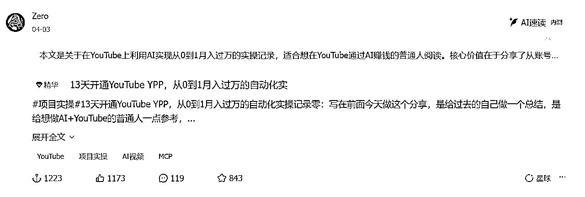

Zero大佬的帖子是2025年4月3号发布的，我在2025年5月12号对Zero大佬的帖子做了回应，指出关于剪辑自动化的出处

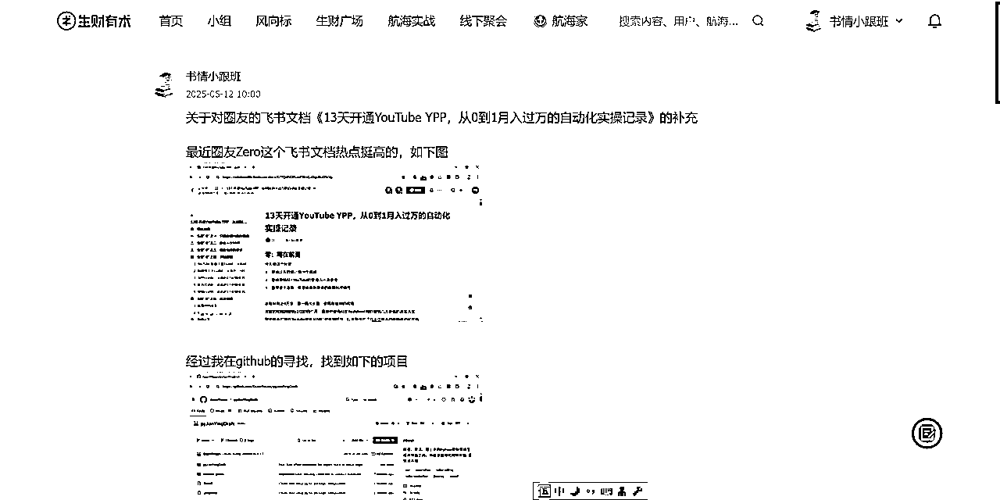

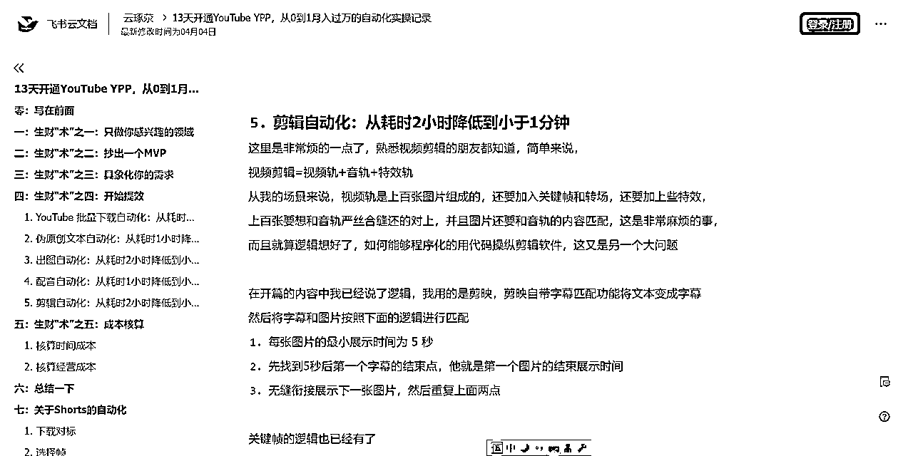

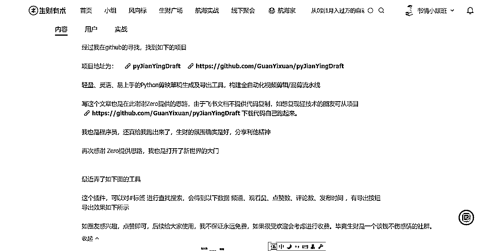

出于程序员的敏感，我去github也就找到了 轻量、灵活、易上手的Python剪映草稿生成及导出工具，构建全自动化视频剪辑/混剪流水线。

本项目的CapCut版本正于 https://github.com/GuanYixuan/pyCapCut 内开发，github地址 https://github.com/GuanYixuan/pyJianYingDraft

既然有了开源免费的github项目，那么说干就干

视频自动化剪辑.exe 链接: https://pan.baidu.com/s/1PbZc8RFD4dmL221O9wUgSw?pwd=assq 提取码: assq

这是第一个从 Zero 大佬得到启发做的软件，其实不算开发，github有现成的源码

Zero 大佬分享的帖子 我没有看到相关软件，代码确实是有分享，对于小白来说，就光有代码也用不了。

由于是辛苦开发的软件，我留的程序，但是同样有私心，免费授权一年给生财圈友，5个软件机器码都是一样的 生财圈友机器码专用问卷

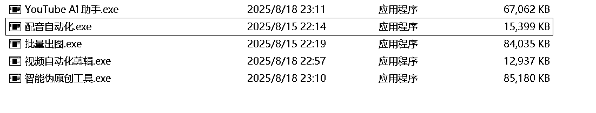

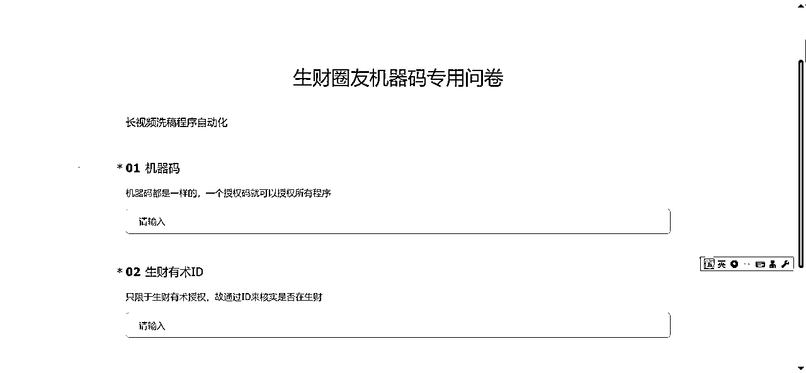

统一给大家一年的软件授权使用，如下图，统一是365天，最大使用次数-1 为不限制使用

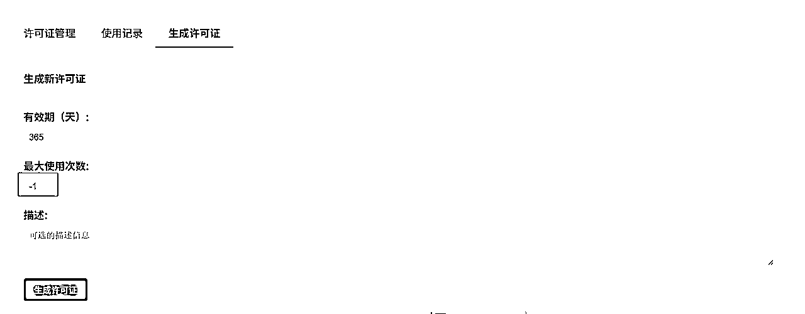

操作视频如下

长视频的做好后，就是YouTube Al 助手.exe 链接: https://pan.baidu.com/s/1a52CLPfH7tNfD6esPry6PQ?pwd=fx6i 提取码: fx6i ，操作视频如下

后面是关于长视频洗稿的三个软件

智能伪原创工具.exe

链接: https://pan.baidu.com/s/1_xpcWjeqOgK-cXkMKP2AcQ?pwd=w4eb 提取码: w4eb

通过网盘分享的文件：配音自动化.exe

链接: https://pan.baidu.com/s/1c_kMw8xp7KEqXGtR1f02Xw?pwd=9s4v 提取码: 9s4v

通过网盘分享的文件：AI图片生成器.exe

链接: https://pan.baidu.com/s/1ZTJnRVSUAK57DqBz82RMXw?pwd=2t2k 提取码: 2t2k

智能伪原创工具说明：

买ChatGPT API KEY网址 点击蓝色链接即可达，默认选 gpt-4o-mini，统一用 OpenAI模型，这里说明一下，建议还需要一些人工来处理，人工对原文或是洗稿后的文章再修改后再伪原创一遍

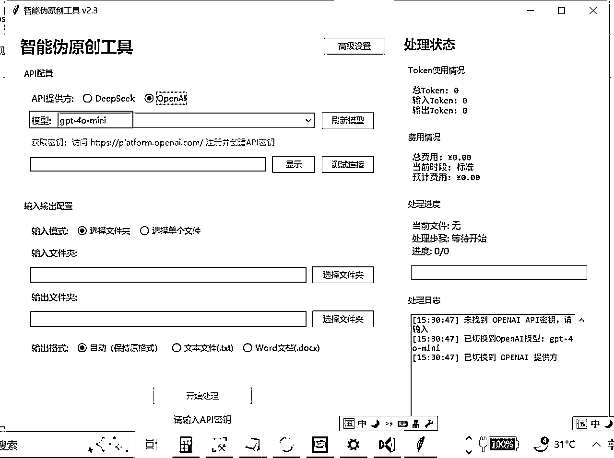

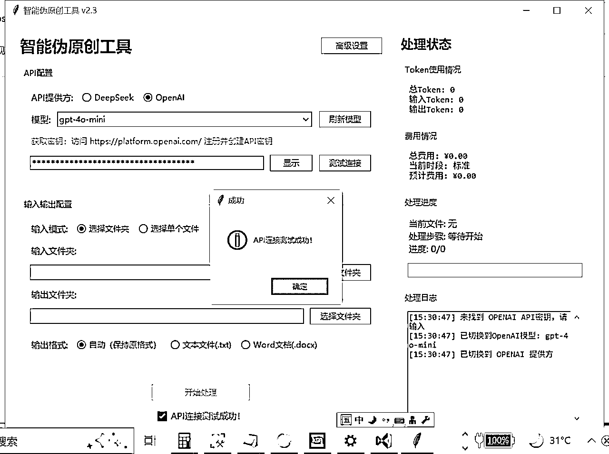

Zero大佬用的是Finetune Model，没整明白，就用gpt-4o-mini 来处理

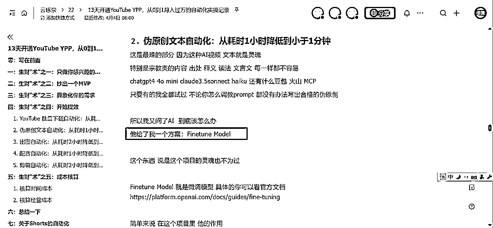

配音自动化说明：

这个图片这里已经有提示了，点链接进去

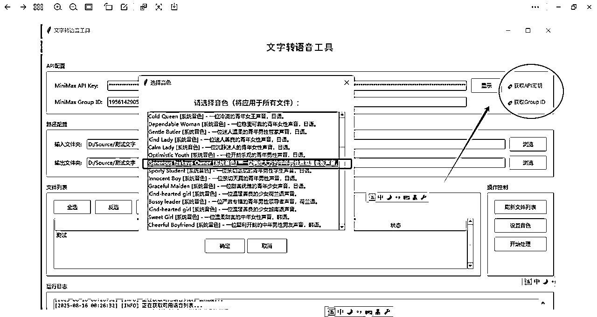

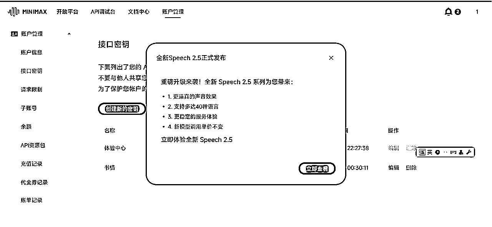

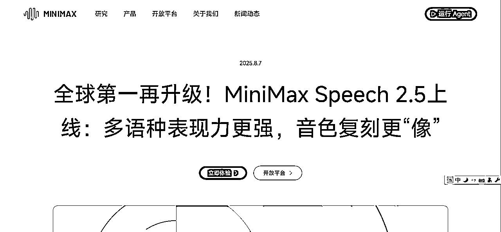

配音这一块，那就是直接借鉴了，用的 minimaxi.com 来处理，其实核心原则也不难，就是调官方的接口

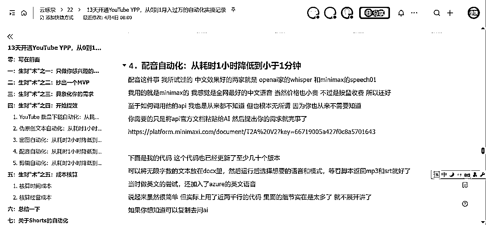

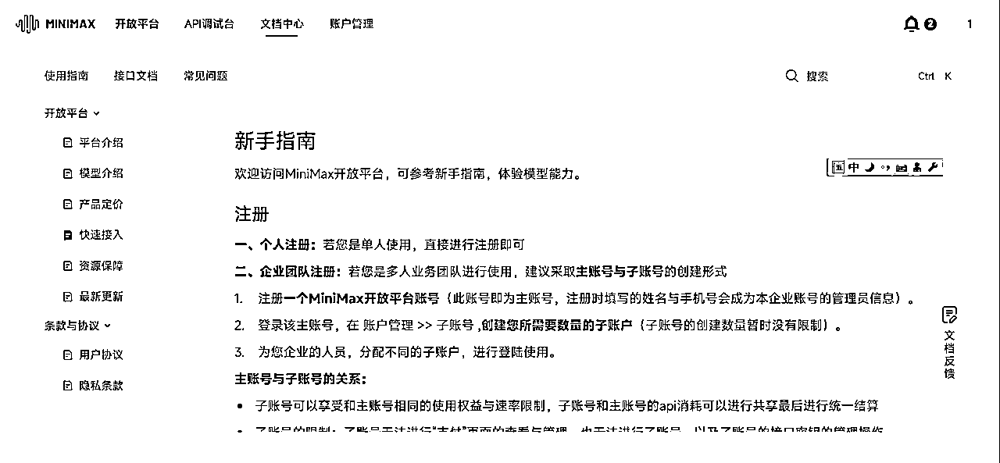

照着官方文档来调API，那么配音这一块就完成了

AI图片生成器说明

https://my.runware.ai/login 注册账号进行充值，消耗的是API KEY的钱，前面的OpenAI API Key前面有提过去哪买了

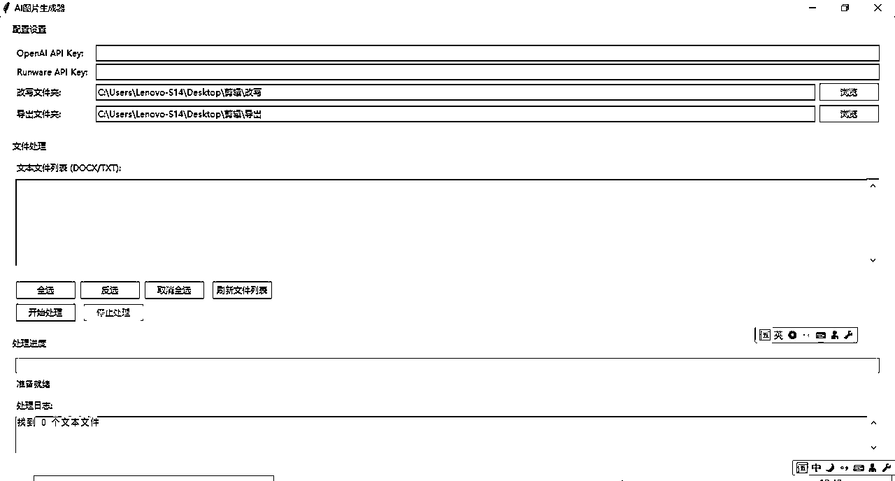

出图这一块也是同配音一样，也是调用API接口就好

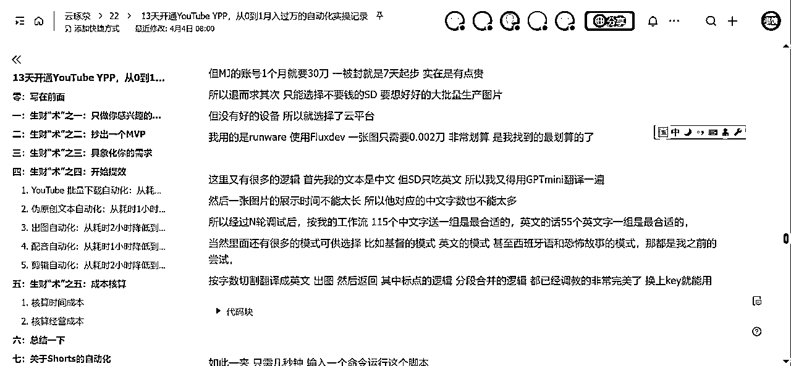

付费这一块，实测我发风向标这个卡是可以付的

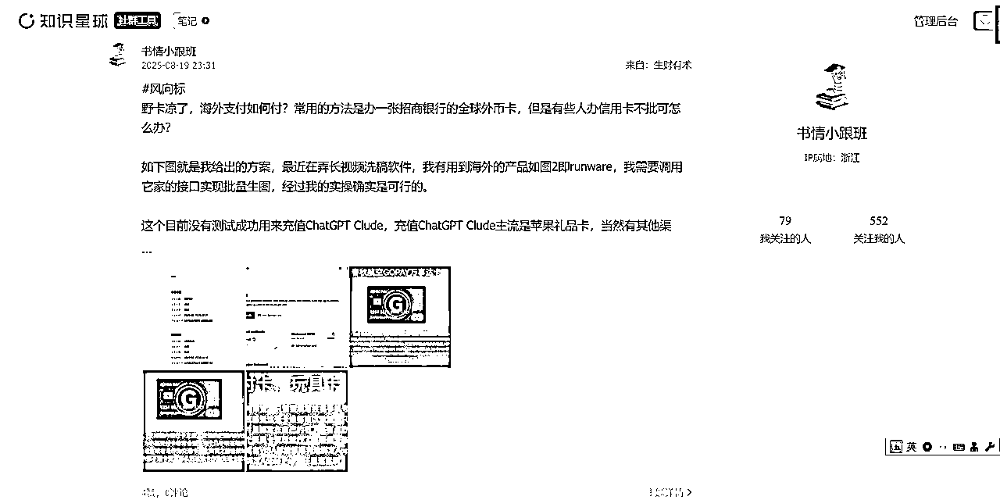

这里给出示例，程序需要不断完善

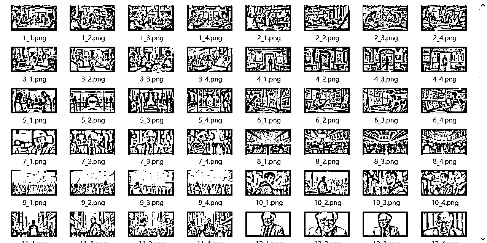

总的来说，一个事做出来了就不难，如果没做出来那就会很难，感谢生财，再次感谢Zero 分享，

最后无需要加我微信，授权后的授权码我会留在评价区