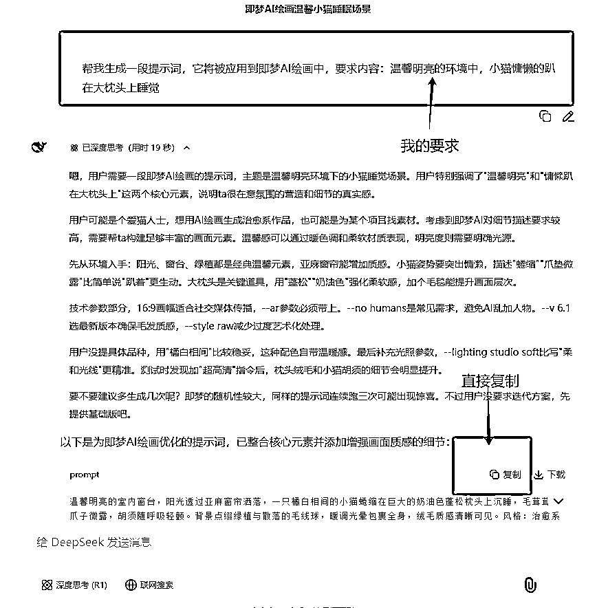
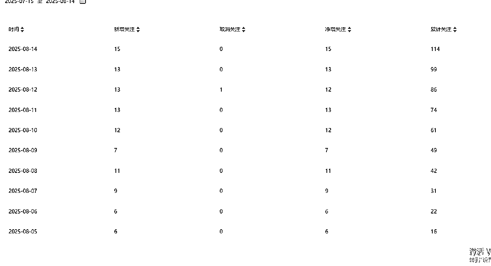
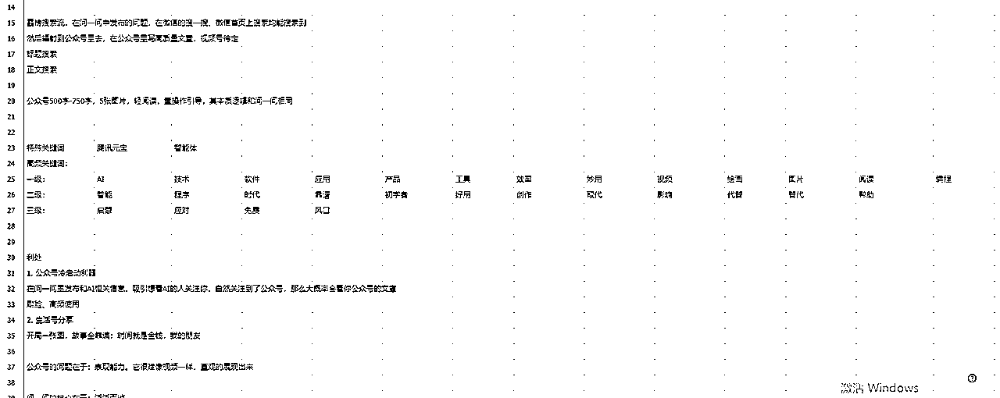
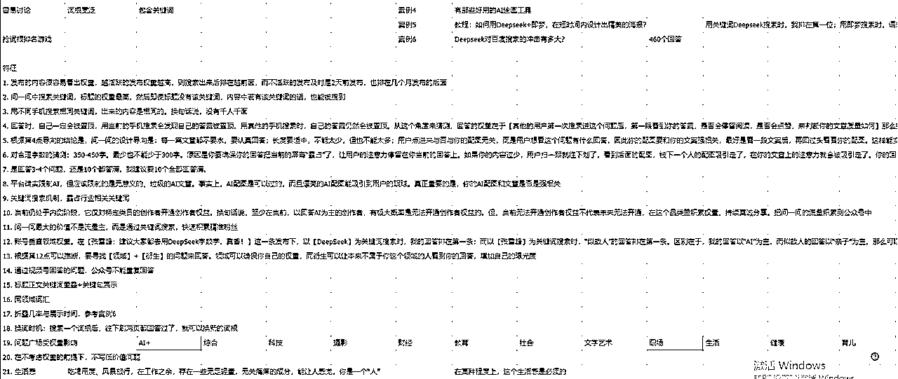
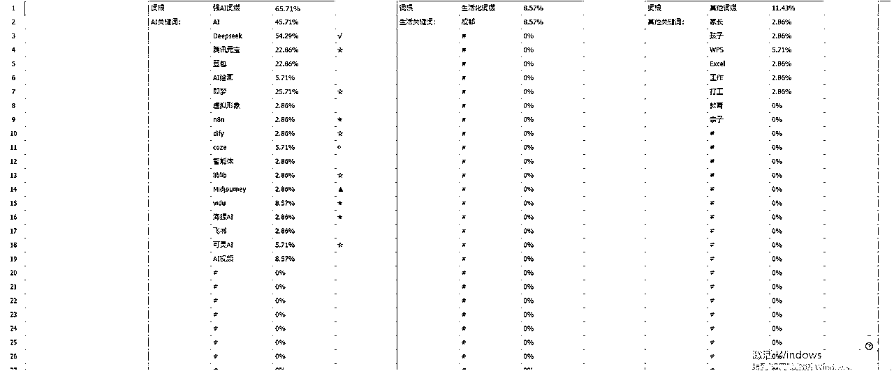
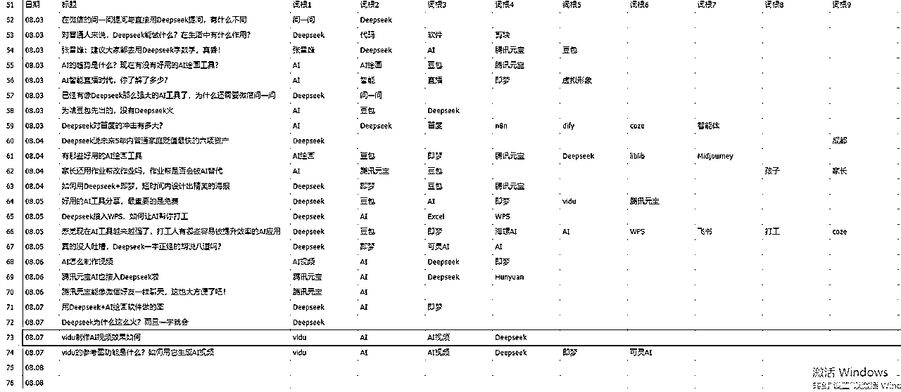

# 微信问一问SEO搜索玩法

> 来源：[https://zorpbt1ybz.feishu.cn/docx/HoXldbU2mouCg0x7AGRczMY6nDr](https://zorpbt1ybz.feishu.cn/docx/HoXldbU2mouCg0x7AGRczMY6nDr)

大家好，我是正在成为一个超级个体的小连~

微信问一问这个项目从航海到今天共16天，在这个期间内，我在努力探索后，深刻的理解了什么是适合我的项目，什么是我想做而又没法做的项目，什么是我很难去插手的项目。

而恰好，微信问一问便是我很难去插手的项目，虽然我自己不会继续做这个项目，但我在探索中得到的经验，相信能帮大家少走不少弯路。

# 一、前言

先说结论，微信问一问是一个支持真实的人，展示真实的自我的平台，且具有极强的“去AI化”的特点。而它所鼓励的创作类型是“能拍出好看照片”的分享、经历、体验。且平台鼓励“去账号化”，多生活类气息。

但于此同时，微信问一问自身又携带“强SEO搜索、排名”的机制，这个机制使得一个账号的内容搜索、推荐，会及其依赖这个账号的“权重”。创作者需要往账号的方向去做，才能更加稳定的获得曝光。

而“账号权重”与“生活分享”之间的矛盾，使得创作者能够选择的主要领域范围将会被大大缩小。再加上当前微信问一问处于内测阶段，整体用户人数较少，即使发布账号权重相关的内容，也有可能无法获得曝光。回答心灵鸡汤类话题，反而有可能获得点赞。

因此，各个矛盾使得很多新人容易对它机制感到迷茫，不知道该怎么下手，也不知道自己的做法对不对。

在刚做问一问，还没有摸清楚整个规则的时候，我觉得自己的生活内容无趣，很难分享出一些生活化的东西，也很难去刻意让自己变得有趣起来。但来都来了，什么都不做也不好，于是综合考虑之下，我秉持着：“就当做为公众号积累粉丝了”的态度，选择了AI领域，迷迷糊糊的开启了我的这次问一问航海之旅。

# 二、视觉的霸占

AI领域与其说没什么特别多的东西可以回答，不如说在微信问一问中，用户提出的问题都是一些很简单的、泛而宽的问题，像“AI究竟会不会取代工作”、“用Deepseek做了些什么？”

这些内容没什么意思，感觉翻来覆去的内容都差不多，于是我开始去找“AI视频”、“AI绘画”相关的问题，并通过教程图的形式来回答，如下图

每个问题，我会配上至少2张的图片，并列举一大串的文字说明。文字说明很简单，把问AI的问题再写进去，就很容易达到300字了。

这个时候，我发现我的数据明显好了非常非常非常多！比起那种只有干巴巴的文字，这种带有配图说明的文字数据显然更好。

于是我开始优化我的图片以及文案。特点如下：

1.  图片至少配3张，

1.  文字300字 - 400字

1.  文字和图片强关联:

文字中，我会说：“如图1，做了某某操作”、“如图2，做了某某操作”

图片中，我会画箭头，并配上文字中没有的一些说明文

而这样做的目的是：将用户尽可能的留在我的内容里。

图片配上文字，可以把一个手机的屏幕铺满，我专门测试过，在这样的情况下，纯文字要打多少字合适、配上图要打多少字合适。最后的结论是，300字 - 400字是一个合适的区间。

同时，因为文字和图片强关联，当我说了“如图1”时，用户会倾向再去看一眼图1中到底是个什么操作；而当用户看到图1时，发现了文字中没有的内容，会再仔细看一下。

且我的图文铺满了整个屏幕，当用户刷到我时，会大概率看两眼，而能看两眼就能让用户多看几眼，甚至看完。

而发现这个事情的契机是：评论区的广告位

为什么问一问的广告位是这样设置的？我有点在意。

1.  “当一个创作者开通了创作激励后，自己在评论区里留言，就有机会广告入驻”，

1.  “广告是直接插入到评论区里”

1.  用户要去刷下一条信息的时候，一定会看到这个广告

基于这3点，我判断出，问一问是将广告“强行曝光”在用户的视野中，而只要曝光，用户就有机会多看两眼，多看两眼就有机会点进去，点进去就有可能转换。

那我的逻辑也是一样的，当我的内容被强行曝光在用户的视野中时，用户也会用类似的逻辑来面对我的内容。

而这，恐怕也是问一问官方为什么支持4:3的图文创作，而并非9:16的手机截屏。因为我试过，9:16的手机截屏能直接霸占整个屏幕。这个操作“过分的抢占了用户的注意力”，因此官方不赞同。但也没有明着反对，恐怕会在开通激励的时候作为一个判断依据。

在总结出了“视觉的霸占”这个特点后，我的风格固定了下来，且数据稳步增长中，偶尔有几千阅读量的小爆文，但大部分数据都很平均的几百。粉丝数虽然不多，也在缓慢增加中。

而在深耕这个领域时，有一条内容爆了。

# 三、抢词根的游戏 = 词根权重不同对搜索的影响

## 案例一、张雪峰：建议大家都去用Deepseek学数学，真香！

在这个案例中，我自认为只是普通的分享了一下我的看法，并没有什么特别出彩的地方，可能是某句话击中了用户的情绪，于是跑出了第一个几千阅读量的内容。这个阅读量虽然不多，但挺有意思。

因为这个案例，它即属于“亲子赛道”，又属于“AI赛道”，我回答的内容大部分都和AI有关，那数据好是正常的？

本来我是这样想的。

在回答问题都时候，通常我会用关键词搜一下，现在有没有什么回答是比较火的，比如用“AI”、“Deepseek”、“即梦”、“豆包”等一切和AI有关的词汇。我发现，在案例一比较火的时候，每当我用“Deepseek”搜索，它总是在搜索的前几条。这说明有新用户在回答这个问题。

衍生一个点，当你新回答、发布了一个带有某个关键词的问题时，搜索这个关键词，该话题会被顶上去

而不管这个话题被顶上去多少次，我发现我的回答总是会在最前面，我一眼就能看到我的账号和回答。那……这毕竟是我发布的，我看到自己很正常？

但当我用其他手机，搜索Deepseek这个关键词时，第一个展现的仍然是我的账号。且内容展示的顺序一模一样，也就是说

在当前这个阶段，微信问一问不存在千人千面的机制，你搜索的了某个词，得到的排序是一模一样的

因此我大胆猜想了下，那我回答AI、Deepseek多，回答排在前面，说明我在这个词下的权重高，那如果我搜“张雪峰”会是什么情况呢？

答案是，我往下翻了无数页，也找不到我的回答。

之后，又通过了其他机组关键词的测试，我确定了，在AI领域下我的权重高的吓人。

只要我回答关于“AI”相关的系列词汇，我的账号就会积累“AI领域”相关的权重

只要我使用了“AI”、“Deepseek”，我的账号就会积累这些词根的权重

因为我从一开始就只是想分享一下AI相关的内容，基本就没有回答过其他的问题。

## 案例二、教程：如何用即梦+Deepseek，在短时间内设计出精美的海报？

在知道了关键词词根的重要性后，我开始刻意的在标题、文章中带有相关的关键词。很明显，从讨论度来说，在整个AI领域中，AI的关键词排第一，Deepseek的关键词排第二；其他暂时不提。

而当我认为我在AI领域权重高的离谱的时候，我发现，在案例二中，当我用“Deepseek”作为关键词搜索时，我的内容被推到第一位，而当我用“即梦”作为关键词时，我的内容排走稍微靠后一点。

那这个案例侧面表明

即使是在同一个领域中，每个关键词是会存在一个单独的权重

我的所有文章中，“即梦”确实使用次数较少，而Deepseek使用次数较多。因此，这个搜索结果也在情理之中。

## 案例三、陈渡AI学习笔记（这是作者名，具体文章名称忘了）

这个案例也很有意思，当我在铺词汇的时候，顺手就回答了这个问题，但我发现，等了一段时间我的文章迟迟没有被顶上来。

于是我点进文章内部看了下，作者陈渡的文章只有1个点赞，也没有配图，但他的文章被顶在第一个，而第二个人的文章有好几十的点赞，却抢不过陈渡！

然后点进陈渡主页，发现他的内容和他的名字一样，也是和AI相关的，且文章数量高达200条！

因此，在同样的领域中，账号的领域权重会很明显的影响内容的排序

那……这也没办法，确实也抢不过别人，姑且就这样吧

## 案例四、Deepseek对百度搜索的冲击有多大？

这个案例的特点在于，它在当时有460条回答，且是和AI强相关的。

而在当时，我在Deepseek的词根上，基本已经是无人能敌的存在了，除了账号权重高于我的人以外，我的内容大概率都能被置顶，但偏偏这一条，没有！

因为问一问不欢迎AI相关内容，且大家都没有往SEO的方向去做，自然没有人闲的没事和我抢AI的词根玩。那么我的内容没有被置顶的原因应该很明显了

多回答下，文章排序存在轮换机制

理由是，虽然我自己看不到我的文章了，但这篇文章依然能够有不错的点赞、关注、曝光等数据，说明是有用户能正常看到的。

这样猜测是相对比较合理的，因为如果账号的权重能够完全的影响排序，那么对于后发者是不公平的。但在回答数较少的文章中并没有看到过这个现象，它只会出现在回答数多的文章中，那恐怕是只有回答数多的文章才会出现这样的特性。

## 标题、文章词根的绑定

上面4个案例，基本能对应上绝大部分的问一问词根搜索机制，而在这个机制之上，还存在一个标题、文章的词根绑定机制。

比如，当我的文章标题是：“有哪些好用的AI绘画工具”时，这里可以将词根拆分成“AI”或者“AI绘画”。而当我的回答中，写了“像豆包这种免费的AI绘画工具……”时

通过关键词“AI绘画”来进行搜索时，会同时展现出这个标题，以及文章中这个词根的前后文

而另一个比较有意思的案例，也是词根“Deepseek”

当我搜索词根“Deepseek”时，除了会搜索到大量的Deepseek相关的标题，还会搜索到一个压根就没有Deepseek这个关键词的标题，它的标题大致是“AI应用……”，而文章内部带了一个词根“Deepseek”。文章展示时，展示了Deepseek的前后文

因此，一个词根的权重，会影响搜索标题，也会影响搜索文章，而当两者都有时，这篇回答的这个词根的权重是最高的

如果你的权重够高，即使标题中没有带有相应词根，但在文章中带了，那么用户搜索相应词根时，你的回答仍然可能会被顶上来。

# 四、内容和ID绑定、最好带有核心领域词

我的账号是“AI探索者小连”（目前账号删了一些无关紧要的文章，但大部分AI相关的都还保留着），而我回答的内容也是大量的和AI相关的垂直内容，看了我一篇文章的用户，当看到我的账号名时，会自动联想，是不是还有其他和AI相关的内容，点进去看看。

于是，我的点赞中有非常多的从主页而来的点赞。

用户的心里有个预期，他们知道自己想看什么、要看什么，看了点个赞就走的，那就是路过的用户，而看了点个赞还进来看一眼的，就是对你的账号好奇，看了点赞了还关注的，那就是精准粉丝

我账号名都是AI，你除了想看AI来关注我以外，还能是什么呢？（排除哪里亮了点哪里）

而你因为我的核心内容来关注我，那就自然而然是精准粉丝了。而这个，也就是超级标10，垂直小号冷启动的无敌方案

# 五、关联超级标10

在做微信问一问的同时，我以大概2天为一个周期发一篇文章，大概讲的也是AI相关内容。但是自我感觉水平很菜，写了一些垃圾内容。

但尽管如此，我的公众号粉丝数量稳步上升，问一问的关注能带来一个冷启动的阅读量。

因为他们是“想看AI”所以关注了我的“AI探索者小连”这一个账号，那么我用“AI探索者小连”这个名称发一篇公众号，用户是不是会觉得是自己“主动关注”的人，又发了一篇自己可能想看的内容呢？

# 六、个人建议

最终，在复盘了整个问一问的机制后，对于这个项目的操作我有几个小建议：

## 发布和回答五五开

发布能确保你的“个人原创度”，为自己的主领域布局；

回答能确保你的“流量曝光”，能够尽快涨粉；

需要注意的是，无论是发布还是回答，质量都是必须要保证的，这个是任何“计算”的大前提。

## 3张图 + 300-400字

图片比例4：3，尽量拍漂亮点；

用图片和文字将一整业铺满，抓住用户的注意力

## ID和内容强绑定

确保用户关注过来就是精准粉丝，对你在这个领域中有信任感

## 主赛道选择能拍照的

从各个意义上来说，这个平台所支持的内容是比较微妙的，它支持真诚的分享，但也仅限于能够“拍照”的真诚分享。比如，我喜欢动漫，但即使我再怎么分享动漫，也无法达成它的创作激励要求。而创作激励要求中，也明确的写了“对部分内容开通”。这个部分内容背后的意思，我感觉我已经很明确了。

比如“亲子”、“摄影”、“萌宠”。这类既能“拍出好看的照片”，也能达成“真诚的分享”推荐；而“动漫”、“AI”、“语言文学类”，这种广泛出现在互联网上，不能达到“实拍图”的内容则不推荐

主赛道的内容多发，其他赛道的也要发，倒不是因为真人感什么的，而是主赛道有可能没有那么多内容可以发

## 刻意去铺词根

你的ID、你的内容一定要带有相应关键词，最好你的每篇内容都带上，如果标题也能带上就更好了。这样会保证别人在搜索相应关键词时，你的文章会出现在最前面。或者别人在点进含有这个关键词的文章的时候，你的文章会被优先推荐。

领域相关词根确保自己的账号权重；

单个词根确保你在这个词上面的权重；

在遇到相关内容时，你的排序就会更加靠前。

## 不要去回答一些无意义的内容

除非你是真的很想回答这个问题，不要去回答一些“心灵鸡汤”、“AI能不能灭了人类”这种没什么营养，既涨不了粉，又增加不了权重，而且平台也会判低质的内容。

每天能回答10个问题，但也仅能回答10个问题，如果考虑到SEO搜索玩法，10个回答都不够铺词根的，太浪费了

## 当前问一问的SEO搜索玩法处于完全的“蓝海”时期

在外面各个内容平台，“成都”应该是被聊了无数次了，但在问一问中，没有人会主动用它当词根。同理，在据我观察的范围内“蛇”、“小提琴”等，各个细分领域场景下的词根根本没人铺。你铺了相应的词根，那这个板块现在就是你的了，一搜全都是你。

换句话说，大家都在真诚的分享（赚米），没有人会想着去做SEO，那这个时候就是铺词的最好时机，没有之一。

## 整套玩法的逻辑

账号权重高+词根权重高 —— 你的回答排在前面 —— 被更多人看到 —— 通过合理图片+文字字数，回答内容抓住注意力 —— 促成点赞、关注 —— 获得精准粉丝 —— 沉淀在公众号中

## 当积累到100粉之后

可以去吃其他领域的流量了，做“亲子”账号的，可以来蹭“心灵”、“动漫”的内容热度；但如果大量发布“心灵”、“动漫”的内容是开通不了创作分成。

但你都到了100粉了，该蹭就蹭，该吃就吃

## 上班族的福星

问一问的核心推荐在于“漂亮的图”+“个人体验”，那有一个非常显而易见的类目：“城市介绍”是可以做的，包括但不限于：去拍城市风格、文化、人物、美食等，只需要下班的时候绕下路，顺手就拍了。

开局3张图，内容全靠编。

# 七、个人总结

整体复盘下来，我能明显感觉到我自己是属于：把抽象的规则标准化、流程化的人，通过构建起一个合理的框架，剩下的是转化和优化的问题。

因此，对于问一问这类过于主打“分享”、“体验”的类型实在很难去做。

虽然问一问AI领域没法继续，但这个SEO玩法思路我认为可以铺到问一问的各个领域里面去，提前布局，增加自己的权重，能有更好的收获。

最后附上几张项目过程中的一些记录图，这个项目就算是正式结束了。有缘在下个项目见~

