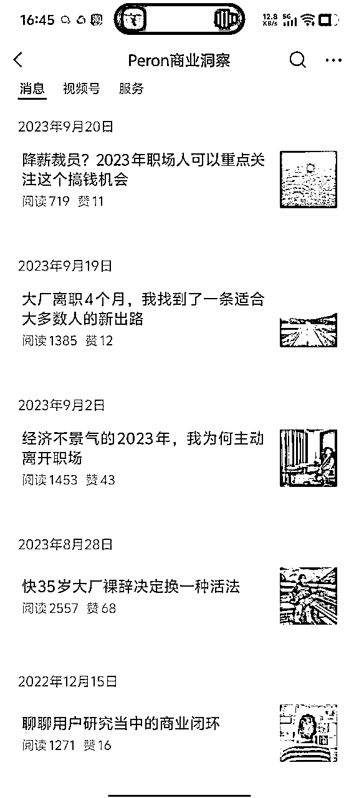
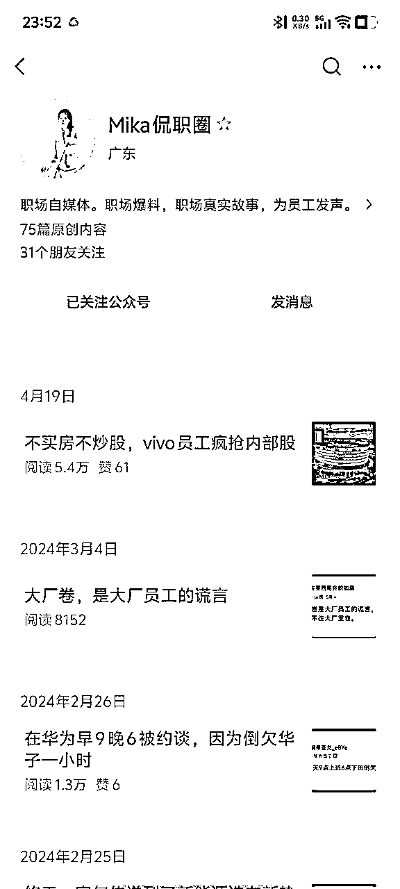

# 公众号细分垂直领域的专家IP打造与变现经验分享

> 来源：[https://rcnm43d7lghx.feishu.cn/docx/SDdcd4dcdooXF5xeyFqcfy8BnDb](https://rcnm43d7lghx.feishu.cn/docx/SDdcd4dcdooXF5xeyFqcfy8BnDb)

昨晚，亦仁发布了第10条超级标，这正好是我过去两年多在做的事情，所以今天在星巴克写下了这篇文章，全文接近万字，纯手打，敲了一天的键盘。

首先，让我介绍下自己。

Peron佩龙，2011年中国人民大学本科毕业，然后进入一个非常小众的行业-市场调研，从事市场与用户研究工作。

先后在本土和全球头部市场研究公司博睿胜伦、Kantar（凯度）、尼尔森（Nielsen）工作超过6年时间，随后在2017年转到甲方互联网、智能硬件公司同程艺龙、vivo开展用户研究（简称用研）工作6年。

2023年，被甩出职场的赛道，另谋新出路，开始探索人生的第二曲线，那一年我34岁，正是中年危机的时刻。

我一开始，想着从自己的兴趣爱好着手，转行去做男士素人/形象改造。为此我报了健身房私教课，报了形象管理培训班，系统学习营养学，改造自己的饮食……但半年后，我一无所获。

就在此时，一个朋友听说我离职了，找到我来接外包项目，简单来说就是给他们公司（一个大公司）做消费者/用户调研项目的研究外包，具体包括对接客户、研究设计、数据分析、写报告，那个单子费用6w。

随着需求变多，收入也还行，我就干脆注册了公司，相当于创业了。

就这样，我又重新回到了市场调研这个行业，重新干起了老本行——这个我积累了超过12年的专业细分领域。

# 一、IP的1.0阶段-探路

接了一段时间这个公司的项目外包，很快我面临两个问题：

*   需求不稳定，有时候特别忙，有时候没单子，不够支撑我组建团队。并不是这个公司的外包需求不够多，而是从他们的角度，不愿意把单子都给某一个或几个供应商，这样会形成供应商的议价能力。

*   外包项目利润低，处于食物链的底层，赚的其实就是辛苦钱。一个月就算满负荷运作最多收入5万，甚至比不上在大厂上班收入，操的心还多，性价比低，何况不是一直能有单子做。

怎么办？只能拓展客源和业务：

*   寻找更多的客户，接更多的一手的或者二手的调研项目单子，这是TO B的逻辑

*   拓展知识付费，考虑到我们这个行业极其狭窄小众（全国从业者估计就几千人），大多数人甚至都没听说过，所以我那会想的是不卖几百元的课，也不做几千元的线下培训，只做高客单价的1对1的陪跑，收费1w/年，这是TO C的逻辑

但是过去十来年，我在职场这个赛道并不成功，最高只做到高级研究经理，没有做过负责人，没有带过团队，行业里也没有积累什么客户资源。

好在，2020年左右，我就开始有意识的在互联网上输出专业领域的内容。在人人都是产品经理平台开设了账号，积累了一些粉丝；2022年1月注册了一个自己的公众号“用研那些事儿”，积累了大约有2000+垂直粉丝（基本都是同行）。

于是，我2023年8月，重新捡起了断更半年的公众号。

我发布了回归后的一系列文章：

*   《快35岁大厂裸辞决定换一种活法》，告诉大家我离开职场了，阅读量直接破万（后来删除重发，仍然有2500+阅读量）

*   《经济不景气的2023年，我为何主动离开职场》，进一步解释我为什么离开职场

*   《大厂离职4个月，我找到了一条适合大多数人的新出路》，宣告我的转型，介绍我的业务

于此同时，2023年9月我把公众号名称“用研那些事儿”改成了“佩龙Peron “，原因如下：

*   “用研那些事儿”是一个纯干货分享的工具人账号定位，不利于涨粉和变现

*   “佩龙Peron “，除了分享专业领域的干货，还会分享我的转型与创业成长故事，有IP，有真实人设，更容易建立信任。

从一个工具人账号，到 “用研人大厂离职，35岁探索新出路”的人设，这就是我第一阶段的思考和实践。

当我以“佩龙Peron “的IP运营了一段时间，确实带来了一些效果：

拓展了几个新的B端小客户，都是低价值客户，一个单子几千，高的一两万；收到了第一个高客单陪跑学员，验证了TO C的需求。

但远没有达到预期效果。

为了生产“高质量“内容，我每篇文章字数都在5000字以上，纯手打，一篇文章要写好几天，点灯熬油，发出来阅读就几百到一千多，投入产出极低。（如今，已经借助AI解放了内容生产力）

我那会儿把问题归根于流量，我需要进一步破圈。

于是，我去蹭热点，从我们专业视角去解读热点，没想到流量挺好：

第1篇，《一个市场与用户研究人眼，如何看待刘润翻车事件》，阅读破了5000

第2篇，《靠自媒体测评喜提400万跑车迈凯伦的王自如为什么去格力了》，阅读量直接破了10万+

第3篇，《字节跳动跳不动了，几千人的游戏部门即将全部裁员背后的真相》，阅读7000+

……

但很快，我意识到一个问题：流量是很好，但实际没有太多涨粉和客资，都是泛流量，不精准，也正是那一刻，我对流量祛魅了。

# 二、IP的2.0阶段-聚焦TO C

2023年12月，我把公众号“Peron佩龙”改为“Peron用户研究”，加上了行业属性。

我意识到，当下这个阶段，我的资源、能力只能支持我在垂直领域深耕，走精准获客的路。我的知名度、影响力、内容产能支撑不起来“Peron佩龙”这个大IP。

到这里，我其实陷入了困境：做垂直内容，没有大流量，没有业务规模；做泛内容，人群不精准，没有转化。

然后，我去研究了跟我性质一样的专家型IP公众号是如何做的，包括刘润和小马宋。

以下内容，我写进了《同样是咨询服务业，刘润、小马宋分别是如何破圈的？》发表在公众号，阅读量破了1.8万，小马宋老师还特地来加了我。

刘润，最早是一个职业经理人，在微软工作了16年，后来2014年自己出来创办了咨询公司润米，主要做战略咨询。

刘润的IP公众号怎么做的：

首先他的公众号定位是个人IP而不是机构，为什么是IP而不是机构？因为个人IP通过输出价值观、理念、生活方式等，能更好地与粉丝构建起信任，降低获客、成交成本。

为了塑造个人IP，他的号会分享很多刘润个人相关的内容，这些内容大多是他工作、生活经历的所思所想，并且都会带上“刘润”二字开头，例如《刘润独家参访圣农：再不好好学习，我连养鸡都不会了》、《刘润：我是个社恐》等。

除此外，还有这么几类：一类是商业观察，例如《京东，开卷》、《宗庆后留下的，不止娃哈哈》；第二类是职场技能提升干货类，例如《你不是没有重点，你是没有结构；如何有效分析问题？》、《请让年终汇报PPT，对得起你一年的努力》；第三类是个人成长&鸡汤类，例如《所谓自律，就是去对抗那些廉价的快乐》、《做难而正确的事情》。

这三类内容都会紧贴热点，蹭热点流量。例如商业观察类，最近娃哈哈老板宗庆后去世，他马上就写了一篇《宗庆后留下的，不止哇哈哈》；例如职场技能类，在金三银四招聘来临之际，它写《招不到人，背后的问题》；例如个人成长&鸡汤类，春节过年了，它写《春节前最后20个锦囊》。

第一类内容主打商业粉，是它的核心目标人群，也是最有价值的人群；第二类打职场人群，人群体量更大；第三类打泛人群，人群覆盖最广，这是一个金字塔结构。

从数据来看，这三类内容都有很好的流量，在日更的情况下，头条文章能做到篇篇10万+，次头条内容也能做到平均几万的阅读，这在公众号打开率大幅下滑的今天是很难的。

这三类内容都是团队在运作，而且其中相当部分内容是借助了AI产出。

刘润做内容并没有瞄着他的B端业务——怎么做战略咨询、战略咨询职业规划、战略咨询案例展示这个思路来做，而是选择围绕商业认知来创作内容，分析商业现象，然后在此基础上进一步拓宽内容，为目标人群提供职场技能干货，也就是实用价值，然后再提供个人成长&鸡汤，也就是情绪价值。

刘润做战略咨询为什么要大搞知识付费？

刘润的知识付费产品包括商业课程，年度演讲，商业付费社群，出书等多种形式。

课程《5分钟商学院》卖出了超过50万份，累计获得超过5800万课程收入；2021年开始每年10月举办“进化的力量·年度演讲”，连续三年每次都带来上亿级流量，门票和广告植入收益也是超过千万级；社群“进化岛“收费是365元/一年，有超过1.8w人加入，获得超过600万收入；出版了包括《每个人的商学院》在内的多本书籍，收入不详。

可见，刘润做C端知识付费真的赚了不少钱，既然这么赚钱，那当然要大搞特搞。

再就是，他C端业务和B端业务有很好的互补关系。

C端业务能触达大量的商业小白或者说普通大众商业粉，这些商业粉后续有可能变成他B端业务的客户；B端业务的企业战略咨询实践，反过来能为他提供源源不断的商业思考和内容。

本来是一个很好的闭环，然而在一次年会演讲上翻了车，原因是涉嫌数据夸大、歪曲事实，而且被贴上了不懂行业、纸上谈兵的标签。

当然，这并不是说刘润做C端业务的思路有问题，只能说他这种课程、演讲、社群由于服务深度有限，并不能让所有人都满意，不满意的人多了就会被反噬。

接下来，我们看下小马宋怎么做IP公众号的。

小马宋最早是广告公司出身，中间有过几段不算成功的创业经历，直到2016年重新出发，创办了“几件事“（小马宋营销咨询公司的前身），差不多到了40岁才开始走上正轨。

小马宋一开始也是公众号起家，靠着公众号红利和低客单价做品牌营销咨询（华与华一个项目要600万，又不讲价，他收费3万），结果客户爆满；于是赶紧把钱投进营销，开始出书，《朋友圈的尖子生》、《营销笔记》等，进一步提升势能，同时通过公众号营销案例展示来获取更多客户。

后来价格也越来越高，直到现在，小马宋品牌营销咨询费160万起，关键是他坚持不比稿，只做筛选，不做迎合，只做适合他们的客户。

所以，小马宋能起来离不开两个关键点：一个是会做内容（自媒体、出书等），一个是专业能力、经典案例带来的口碑。

以公众号为例，我们重点看看小马宋怎么做内容的。

和“刘润“公众号一样，”小马宋“也是个人IP号的定位，为了打造可信任的成交IP人设，有相当一部分的内容是小马宋的个人成长经历及过程中的思考，例如创业故事《创办一家小公司，并且活下来》、《我创业三次，这次已经活了八年》；个人思考，如《最近对市场的一些感受|小马宋》、《新年换了一台电脑，这里反映出几个营销问题》。

除此外，就是对商业热点的观察和思考。例如《长文回顾：宗庆后的天命》、《热辣滚烫票房破30亿，聊一聊我对减肥的12点认知》。这部分内容是为了打泛人群，进行破圈的。

有一部分就是咨询案例的展示。例如《小马宋2023年度营销咨询案例大合集》、《破局护肤品红海市场，绽妍x小马宋案例复盘》，这块明显是给B端企业咨询业务导流的。

还有一小部分是营销相关的知识、方法论。例如《怎么才能提高营销能力》、《营销的终极难题：回到用户视角》，这块主要给C端业务（得到的课程、出书等）导流。

区别于刘润，小马宋的内容更加聚焦商业和营销领域，他的文章流量要比刘润低一个等级，平均阅读量2-3万的样子，但人群更加精准，粉丝价值更高。

这其实是由业务逻辑决定的。

小马宋的营销咨询业务做到了行业头部，以B端业务为重心，所以在内容上更多以为B端业务导流、赋能为目的；刘润在知识付费领域做到了头部，以C端业务为重心，所以在内容上更多向C端业务倾斜。

研究完刘润和小马宋，我有几个启发：

1.B端和C端业务都要做，C端知识付费业务，一定程度上可以帮助B端业务获客。

2.B端和C端业务要有侧重和取舍，就算是刘润、小马宋，也没法同时做好B端和C端的业务，而只能根据自己的优势选择其一。

3\. 做好内容的1+3法则。“1“是1个IP，不要做只分享干货内容的工具人账号，而是做有血有肉的个人IP。“3“是内容框架，包括专业领域的知识、干货；基于人群破圈内容的构建；围绕个人IP内容的构建。

2024年3月，我做出决定，重心转向TO C知识付费业务，TO B业务甲方大客户看中品牌、资质、专家人设背书，不愿意承担风险找我们这种小工作室合作，哪怕性价比更高，反正花的是公司的钱对吧，所以短时间内难以攻克。

所以，我想走一条“曲线救国”的路。

我打破了我之前只做1w的高客单价的设想，建设了体系化的知识付费产品：

1.“用户研究成长圈”知识星球，最开始定价50元/年，逐步涨价到99元/年，直到现在的199元/年，定位入门级产品

2.大厂用户研究训练营，第一期定价3980元/人，然后做成了系列课，第二期开始涨价到4980元/人，定位中端产品

3.1V1年度陪跑咨询，收费9999元/年，现在涨价到15999元/年

除了这三个核心产品，2024年我还上线了“和君商学·战略用户研究班”（收费15000/年，与和君商学院合作教学），瞄准行业内的用研一号位；“出海调研VIP会员俱乐部（收费2980元/人）”，主打出海调研人群。

这样一个产品体系，基本把行业里的人全部覆盖了。

可以说，整个2024年，我绝大部分时间精力都在研发课程，卖课，交付。

然后我的内容全都围绕TO C知识付费产品转化服务构建：

例如，我推知识星球产品时，我会写一些入门的、比较基础性的内容，例如《应届毕业生入门用户研究必看攻略（6000字干货）》，《10年+用户研究专家，给0-3年初阶用户研究人员的建议》，《用户研究入门必看：定量研究方法大全》阅读量都能有1-2k。

例如，我推我第一期的“大厂用户研究训练营”，我做了3场“大厂用户研究职业发展&求职攻略”直播，并且记录了自己搭建直播间直播分享全过程发布在公众号，最终直接转化30个付费学员，6-8个陪跑学员，单月收入直接接近15w。（我写了篇《做用户研究知识付费第一个月，月收入15w+，我是如何做到的》，也是生财精华文章）

例如，我推“和君商学·战略用户研究班”，我会提前产出和君商学相关的内容，以及战略用户研究相关的内容，最终15个学员面试，5位付费学员，如果和君商学的入学门槛再低一点，转化效果能高一倍。

例如，我推“出海调研VIP会员俱乐部”这个产品，我会邀请出海调研的从业者，来做直播访谈分享，大概做了6-8期，叠加公众号文字稿内容输出，最后收了10几个付费学员。

当然，这些内容要尽量建立在利他的基础上，不能是纯推销，这样容易引起反感，过不了多久就没流量了。

这里列举一个反面案例，一个大数据分析师朋友，通过公众号加了我，她也是跟我一样做IP，所以她经常找我交流经验，她2024年下半年开始学我搞知识付费，天天推课程，搞得现在公众号完全没流量了。

不是说不能变现，而是要控制好度，始终不能忘了利他的初心。

2024年3月到2025年3月，对我来说，是ALL in知识付费的一年，公众号文字内容输出以外，我尝试了直播、小红书，从结果而言，如下：

*   知识星球收入：累计435会员，约5w

*   大厂用户训练营：60个学员，收入25w

*   1V1年度陪跑：15个学员，收入15w

*   战略用户研究班：5个学员，收入7.5w

*   出海调研VIP会员俱乐部：15个学员，约4.5w

上面的数据，全是基于我一个人居家办公情况下做出来的，执行力没有拉满（大概全年2/3时间在工作）、没有上团队的情况。

基本上靠的就是一个公众号，加上5千人不到的私域。

TO B的业务，则陷入了停滞，没有增长，接到的项目都转手外包出去了，我有一个兼职团队，全年到手利润大概在20w-30w。

说实话，面对这样一份成绩单，我是不满意的，没迈过去百万年收入的门槛，比星球里的很多00后差多了。

我开始反思，0-1这个阶段，我躬身入局跑通了商业闭环，那么从1-100呢？

# 三、IP的3.0阶段-转向TO B

一年过去了，我的公众号粉丝来了11000人，人人都是产品经理平台粉丝8500人，小红书平台粉丝2500人，视频号粉丝接近2000人。

在我们这个细分的领域，绝对算得上KOL，TO C知识付费能做到我这个程度和影响力的，没有几个。

同时，过去一年的TO C知识付费实践，也让我认清了一个客观现实，那就是用户研究这个领域的知识付费天花板不高，无法做起来规模。

这个赛道极其狭窄，行业势能还在走低，大环境对知识付费充满了“割韭菜”的质疑，招生越来越难。

反而是TO B，在今年的5月份迎来了爆发。

在原有的项目外包基本盘之外，接连拿下了几个十几万接近20万的一手客户订单，虽然都是中小企业客户，但非常有希望能长期跟客户陪跑，一下就超越了知识付费全年的收入。

这几个项目，要么是公众号粉丝（产品经理）主动找上门来，要么是公众号粉丝（在大厂的用研同行）介绍。

这证明了做TO C的同时能带来TO B的转化，但更大程度说明，我们这个行业的大钱在TO B里。

于是，我做出了第三次的业务重心战略调整：2025年开始全面转向TO B，服务企业客户，赋能产业，这才是每一个专业人才应该且最终的归宿。

为此，我做了哪些事情？

## 首先，我带领我的公司，正式加盟了一家中国本土的大型管理咨询公司，这叫借势。

*   这样，我有了靠山和品牌背书，能部分解决与客户平等对话的问题，以及信任问题。

*   除此外，还能共享北京、上海、深圳、香港的顶级办公场地，这意味着，我终于可以邀请客户来我的“主场”喝杯咖啡，也可以为我的付费学员，提供一个有温度、有质感的线下学习社区

*   再就是我将有机会把市场调研与咨询相结合，提供差异化的解决方案。

## 其次，在IP和内容策略上，我做了两件事：

### 1.IP升维——做企业决策者的“第二大脑”

我将公众号IP“Peron用户研究”，升维为「Peron商业洞察」（部分平台，如视频号、小红书会保留这个IP，主要交由团队代运营）。

不再输出入门级的“术”，而全是面向商业决策的“道”。

我的核心沟通对象，不再是市场与用户研究的同行，而是企业的决策者——企业家、产品负责人和投资人。

我刚完成了第一篇转型的商业洞察文章，《别在红海里内卷了：这家“健身管理”公司如何找到被资本忽视的蓝海》，数据并不好，但我不会回头了。

### 2\. 全新媒体矩阵——用一手数据，重塑产品评测

我计划打造一个全新的媒体矩阵“Peron用户说”，这是一个全新的、“重工业”模式的媒体产品。

我们常见的产品测评，依赖于KOL的主观体验，我的想法是用严谨、科学、可量化的一手用户调研，去评测每一个热门的智能硬件产品。

「Peron用户说」的每一篇报告，都将成为：

*   消费者的“避坑指南”：用真实用户的声音，告诉你一款产品到底值不值得买。

*   从业者的“竞品情报”：深度剖析竞品的优劣势，直指用户痛点。

*   我们公司的“能力名片”：它完美地展示了我能为B端客户提供怎样高质量的一手洞察服务。

这个模式很重，成本很高，但它构建的，是无人可以轻易模仿的专业壁垒。而我现在的正向现金流，以及加盟公司提供的资源，足以支撑我走通这条“难而正确”的道路。

## 最后，为了实现3.0的华丽转身，我构建了团队。

这个想法，在年初就开始蠢蠢欲动。

直到6月底，参加了一场广州线下的生财有数交流活动，《团队规模化：我是如何3个月做到百万》，彻底坚定了我招人搭建团队的决心，这里特别感谢@瑾糖@阿星。

现在特别流行“1人公司”，“超级个体”的说法，我过去2年的亲身体会来说，觉得这是陷阱，如果你真的信了，你本质还是贩卖时间的大号牛马。

创业的本质就是要冒更大的风险，要用劳动力杠杆，要去培养更多像自己的人，才能把盘子做大。

## 重心全面转向TO B并不意味着，我不做TO C了。

我必须承认，我对知识付费的理解，经历了一次“死亡”与“重生”。

我曾以为，知识付费是一门低成本高利润的好生意。但两年下来我才明白，在“用户研究”这个小众赛道里，指望它快速变现，无异于缘木求鱼。

它的天花板太低了。

但它的价值，又比我想象中深远得多。

它真正的价值，不在于那几千块的学费，而在于关系和“信任”的构建。

*   当我看到我的学员，从一个对行业懵懵懂懂的小白，成长为能独当一面的研究经理；

*   当他们拿到心仪的Offer时，第一时间向我报喜；

*   当我在线下与我的“陪跑学徒”面对面，为他梳理职业道路直到深夜……

*   我体会到了一种前所未有的、超越金钱的满足感。

我突然顿悟：教育，本质上是一件回报周期极长，但可能极其丰厚的事情。它需要真正的长期主义。

所以，我决定调整To C业务的定位——我将它视为一件半公益的事业，TO B获客的流量入口。

*   我的知识星球“市场与用户洞察实验室”，定价199元/年，聘请全职运营，不再追求盈利，目标是做大用户规模和“喇叭口”

*   我的“大厂用户研究实操课”，每一期一半课酬分给授课老师，不再自己亲自做交付，我主要做流量。

*   我的“年度陪跑”服务，将正式涨价至15999元/年，并严格筛选，每年限收10名真正有潜力的学徒，为行业的未来培育优秀人才。

*   暂时砍掉“战略用户研究班”和“出海调研VIP俱乐部”这两个产品，收缩战线做聚焦

我不再指望它为我带来多少收入。

我只希望，在未来的十年，我的这些学员，能占据这个行业的半壁江山。

到那时，桃李满天下，才是我迎来丰收的时刻。

在经过了一年的摸索实践，TO C这套流程已经被我标准化了，如今我只需要投入非常少的人力成本、时间精力就能完成去年同样的工作量和任务目标。

# 四、结语

回到这次的超级标的，细分领域+专家IP+术相关分享=小号大流量，我的数据完美验证了。

从今年1月，我的公众号迎来了一波爆发，几个月迅速从5000粉丝涨到如今的11000粉丝，这还是每个月只更新5-6篇文章的情况下。

每篇文章的流量，确实也涨了不少，很多专业文章都能到3000-10000的阅读，这在去年、前年平均只能拿到几百到1千的阅读量。

但在此，我希望大家可以多思考下：拿到流量后，你的变现模式到底是什么？是广告变现，还是像我一样，通过服务变现。

我在2023年底，参与了生财公众号爆文的项目。

我没有像同行那样用AI批量生成，走矩阵批量废号流，而是每天花半小时选题，半小时手写1000来字，结合AI适当扩充。

所以不到5天，从0起了一个职场号（也是走的IP人设），很多10万+，流量很好（不稳定），但单号月收益平均只有3k+（跟赛道选择有关）。

这成为我测试这个项目天花板样本，我算了下，假设我同时开10个号，一天8-10小时，一个月顶多能做到3-5w。

这就是这个项目，普通人的天花板，所以我放弃了这个项目。

但这个账号和流量有其它方面的价值，我通过这个账号引流了几千人到私域社群，而且现在正重启这个账号，利用它的流量给我的B端调研业务赋能（问卷调研样本收集）。

（停更一年，今年4月测试了1次，仍然有流量，关键还在于选题和内容的原创性）

所以，在做流量之前，首先该想清楚的是流量如何利用。

流量不在于大小，在于你的应用场景。