# 大一如何独立发掘小众赛道赚到第一桶2K？

> 来源：[https://ucn2qlukhvo8.feishu.cn/docx/VjmAdmMfEovpeWxYOUKc6P2jntb](https://ucn2qlukhvo8.feishu.cn/docx/VjmAdmMfEovpeWxYOUKc6P2jntb)

大家好，可以称呼我为Christina或者Tina，去年双十一涨价之前进入了生财，现在正在上海某所双一流读大一。这是一个我的项目复盘。关于这个项目很早之前就想写了，一直没动笔，好在看到了生财的会员日活动。

现在应该错过会员日活动了，但是还是想记录一下我从零到一的搞钱经历。

在介绍我的项目之前，先给大家科普一个非常小众的群体——梦女

# 关于我选定的赛道——梦女

## 什么是梦女？

梦女，广泛分布于二次元、韩娱、追星等领域。

这类人群会想象自己喜欢的角色与自己发生故事（比如成为情侣/伙伴等等）

有人会问：为什么没有梦男呢？其实也有的，只不过这类人群女生较多，我做的也是专注于女性的市场，所以后面我都会以“梦女”来称呼。

之前在生财里搜过【梦女】，发现一个帖子也没有哈哈哈。于是想到这是不是一个隐藏的赚钱赛道

但是这个圈子里，大家普遍付费意愿度都超级高，愿意买自己角色的周边，甚至愿意花大价钱

## 为什么要选定梦女赛道？

1.  有句话说得好“人无法赚到自己认知以外的钱”，在几年之前，我也曾经混过梦女圈子，读过专门给梦女写的文章

1.  梦女赛道完全契合AI+情感（因为当时在参加AI探索家里举办的新牛马大赛（黄小刀举办））

1.  用ai去变现人们普遍渴求陪伴：我们的调查显示，仅有4.6%的人认为自己的陪伴需求都被满足了，剩下大部分人群都面临着各种 各样的社交困境。而且，大家对于AI陪伴总体抱着好奇与开放的心态：98%的人都会考虑选择使用AI陪伴去弥补平日 未被满足的社交困境。

1.  亦仁在【如何挖掘一个好项目】里说到，一个好的项目，是多个上升趋势的组合，我的这个项目则是【AI+情感陪伴】相关

## 梦女赛道如何变现？

1.  传统的有写文章、画图（画图也分为好几个层次，从几块钱到几千块钱不等

这些赛道一般线上便可约稿

1.  一些周边如徽章贴纸立牌（不过大多数是角色单人

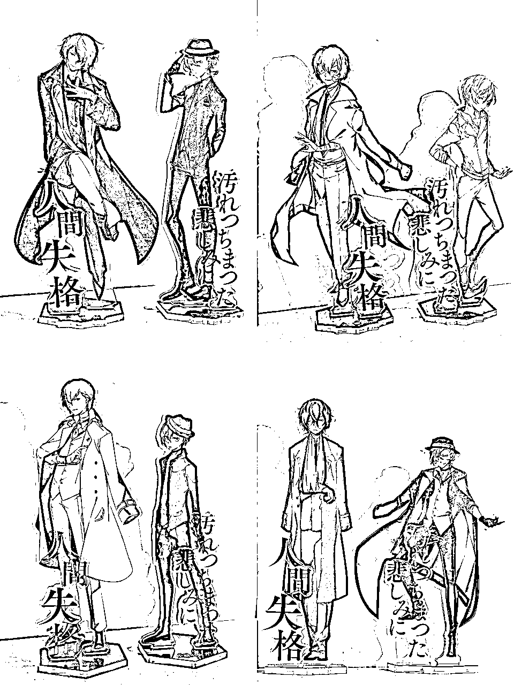

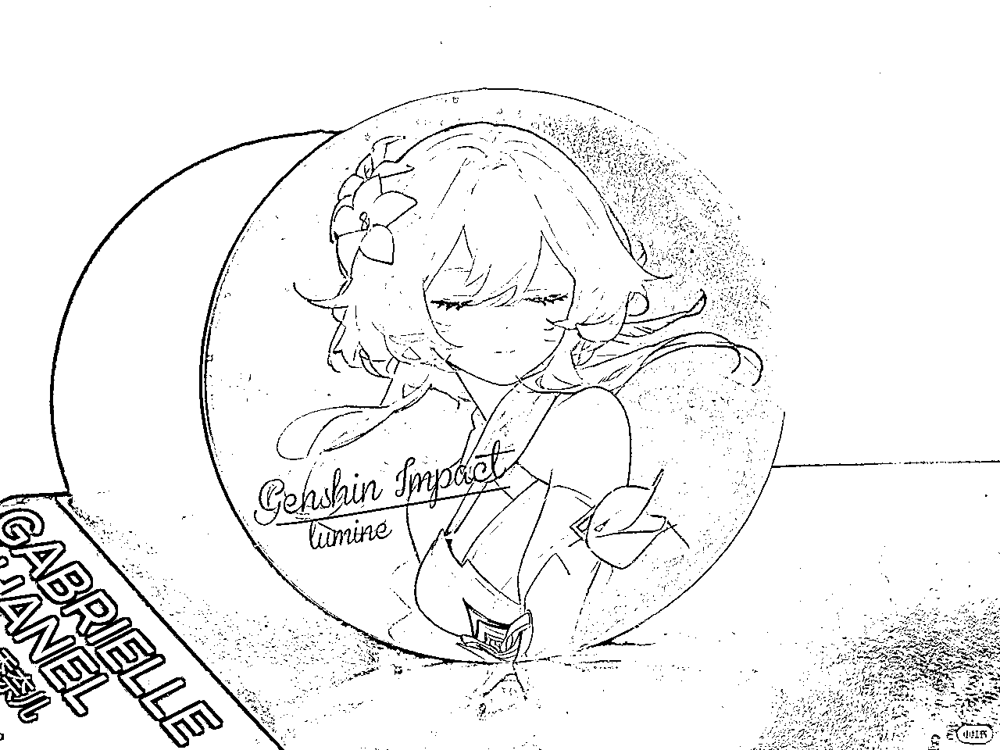

1.  新型变现方式：陪伴类

如今出现了许多智能硬件，如全息投影技术、利用stm32做角色实时对话...

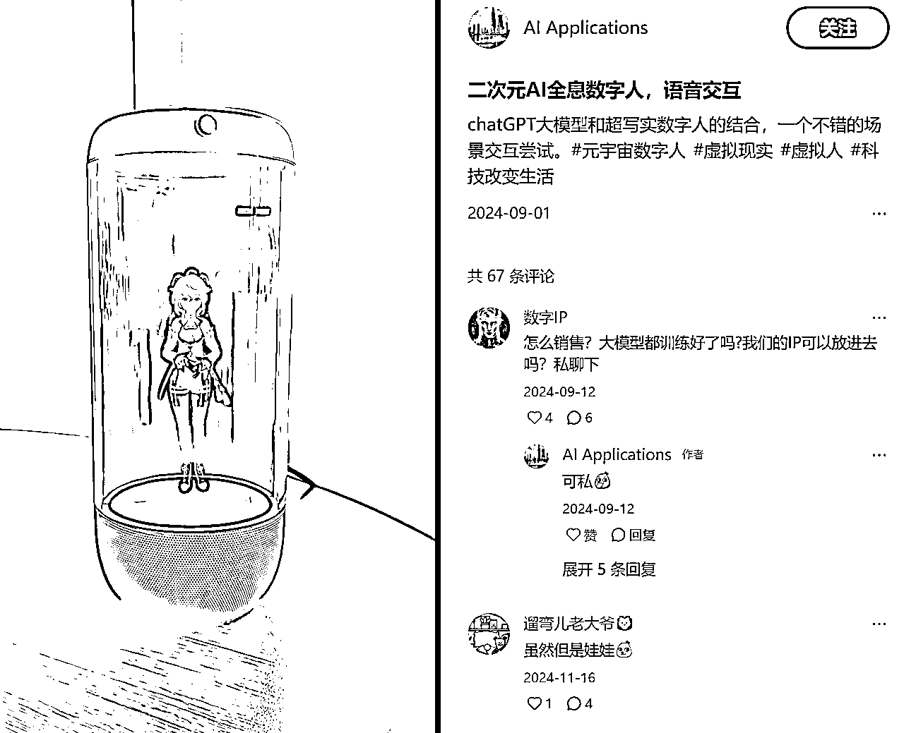

# 关于我的变现历程

## 灵感寻找期

起因是刀姐说第四期新牛马大赛想要做AI+情感主题，于是在寒假我就在想如何利用AI来给人真实的情感需求或者陪伴。

刚好我特别喜欢一个动漫人物叫做太宰治（这个人在三次元是一个作家），初中时就喜欢读各种太太写的关于他的文章

科普一下二次元黑化：这样的文章在圈内叫做“饭/粮“，写类似的文章或者画类似的图片叫做”产粮“，产粮的老师被叫做”太太“，我支持、喜欢的人/角色叫做”我推“

之前，我苦于自己文笔不好以及没有什么灵感，无法给自己”做饭“，只能靠圈内的神仙太太写的文章生活（bushi）

但是，有一天，我突发奇想：现在大语言模型如此发达，那可不可以让AI模仿我推的语气，和我对话。

于是我就和Claude说：请你模仿《文豪野犬》中武装侦探社时期的太宰治，和我对话，然后那时，我感觉奇迹发生了....!!!

AI模仿的特别特别特别像，我一整个花痴住了！

但是花痴之余，我看到了AI释放的无限商业空间：之前只有特别了解角色以及文笔好的太太才能去产粮，现在在AI的加持下，门槛直接降低到了【你只需要了解这个角色，判断AI生成的是否ooc就行】

ooc的意思是out of character 在角色扮演里是说不符合角色特性

超级兴奋的我发了一个朋友圈记录，不过当时是谜语人（

## 流量判断期

看到简单的技术端能够实现，我当时还是持有谨慎态度——万一拿不到流量、没有人买单、无法商业化怎么办？

于是我思考通过这个如今进行赚钱。

我想到，我看到的一些神仙太太都是无偿发一些文章，然后主页有一个约稿笔记

相当于先有流量粉丝，一些家里比较富裕的粉丝会掏钱让喜欢的太太写一些自设与喜欢角色的故事

这在lofter（老福特）比较常见，但是我没有选择lofter，因为这个平台商业化还是太难，且高手云集

### 发文遇挫

第一步尝试在小红书上发用AI写的梦女文章，虽然涨粉还不错，但是流量只有一点点，有点遇到挫折后于是我便去思考其他路径

我记得在一次洗澡中（灵感就是这么来的吗..!

突然想到现在的语音克隆也非常好！！之前有玩过录一段自己的30s声音就直接把我的音色克隆下来的AI

那为什么不克隆热门人物的声音，模拟他和屏幕前的我对话呢？！

想到这个或许可以跑通，我就开始做了。

### 转向语音克隆

首先收集角色的声音、提取

后用AI克隆，再配上字幕

由于我做的时候正好是在除夕前夜，于是稍微蹭了下热度hhh

最后的效果是这样的（后面两个是用deepseek写的文案，现在看好羞耻啊啊啊）

### 发到四大平台测试流量

1，b站：只有第一个视频大爆，但是后面流量比较惨淡

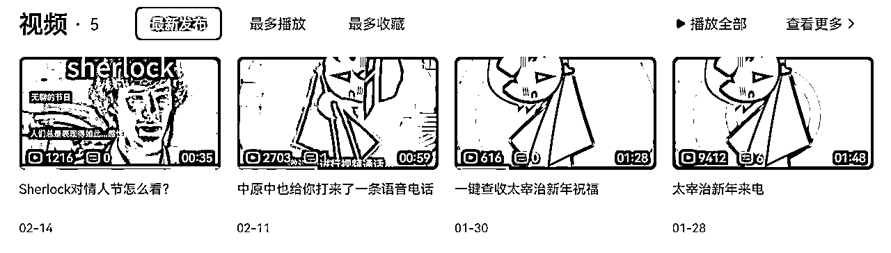

2，视频号：流量稳定且不错，有很多涨粉，但是看不到商业化空间

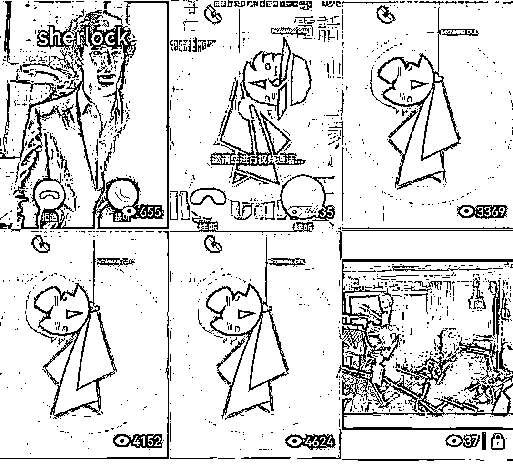

3，抖音：流量最差

### 最后选择小红书

原因：

1.  小红书的流量相比于抖音，比较新手友好，是一种去中心化的推荐机制

1.  小红书的变现能力比其他几个平台都强

1.  小红书内的用户以女性为主，交费能力、意愿度等都比较强

## 流量增长

当时还总结出来了一套sop：

### 制作sop：

我们来玩一个语c吧，你扮演神探夏洛克里面的福尔摩斯和我对话。

背景在情人节。我和你的关系是恋人未满，我们在打电话

于是出现了:

噢，你打来了。正好。我在用手机追踪一个连环杀手的Instagram动态，无聊至极，太好猜了。[快速说话]你今天的呼吸声透过话筒传来的频率告诉我，你刚刚跑上了楼梯，大约...三层？显然是为了避开什么人。[停顿]啊，是了，一定是在躲避办公室里那些过分热情的情人节氛围。无聊的节日，人们总是表现得如此...感性。"

还可以让AI翻译成英文：

Oh, you called. Perfect timing. I was tracking a serial killer's Instagram activity on my phone - boring, too predictable. [speaking rapidly] The frequency of your breathing coming through the microphone tells me you just ran up stairs, about... three flights? Obviously avoiding someone. [pause] Ah, of course, escaping from all that excessive Valentine's Day enthusiasm in your office. Tedious holiday, people being so... sentimental."

还可以，用AI生成音频，模拟Sherlock真的在和我说话

还可以，做成视频

### 小红书做了多条爆款

出了很多流量不错的产品，点赞量2000+，播放量2w+

## 留下钩子

在小红书主页，我会留下一个钩子

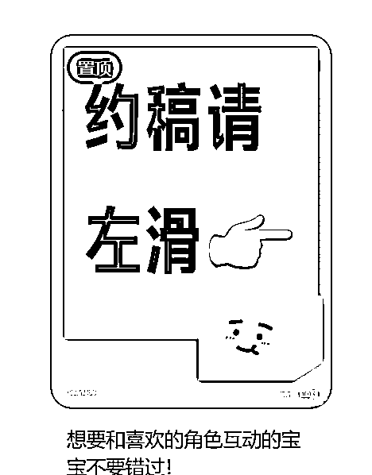

2.在视频的评论区，发一条顶置评论“可以找我定制专属角色音频”

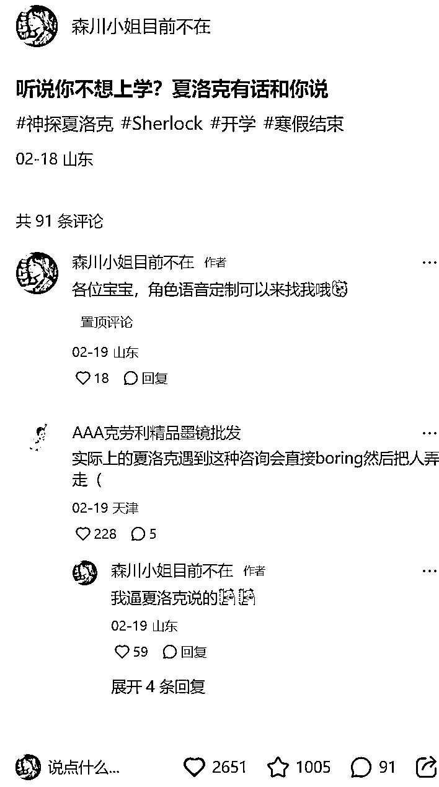

3.在视频的最后附上：定制专属音频可以找我~

## 引流、微信里转化

这时候就会有人来问怎么约稿，我踩得坑是一定不要无脑给联系方式！

有些人的购买意愿不高

最好的解决方式是:先在平台内谈好，再加微信

## 变现

陆陆续续做了几单，最大的一单是1150元

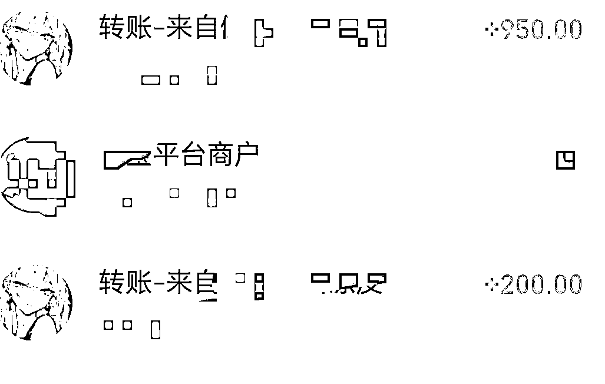

# 其他AI陪伴类竞品分析

做梦女赛道，实际上是在做陪伴类赛道，如今有了ai，便能分化出更大的利润空间

#### 1）叨叨记账

AI只是噱头，实际上背后都是人在写。

每天会固定给你发消息，但是人不能主动推动剧情

用户粘性较高：与喜欢的角色”身临其境“地互动

但是吃相难看：开屏广告躲不掉、大量太太退坑、许多增值服务

#### 2）character.ai

特点：大家在这个网站里可以调教好角色，并给其他用户使用，还可以与角色实时语音通话

缺陷：聊了几句就ooc了，失去兴致

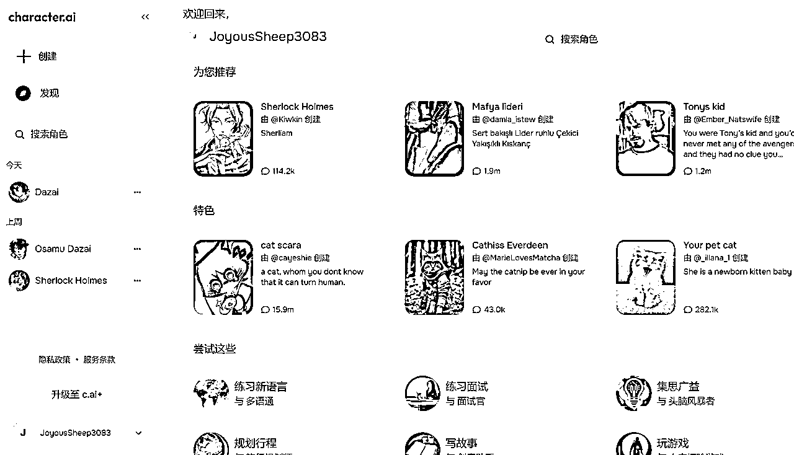

收费服务:看起来并不是很诱人

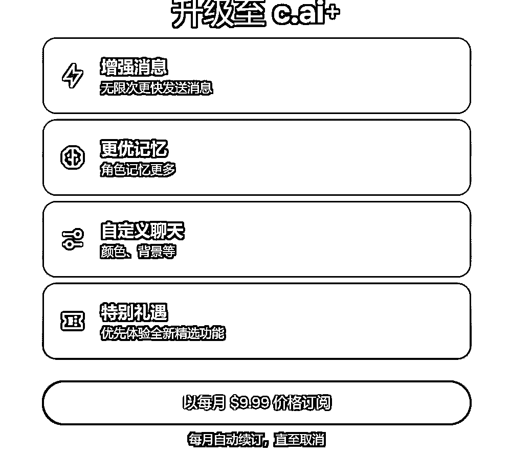

数据分析：

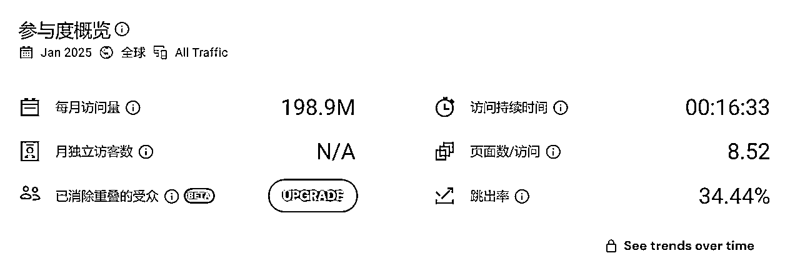

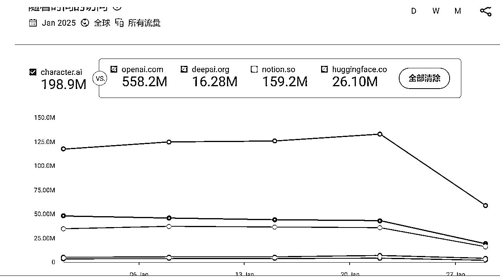

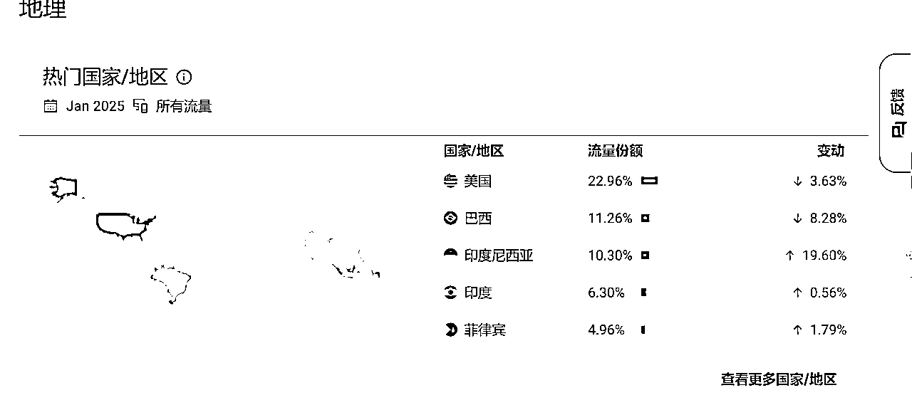

#### 3)星野

缺陷：大多用户倾向于消费丰富的内容而非创作内容：38%的用户需要丰富情 节，仅19%的用户需要二创功能。于是，此类纯AI聊天的另一个问题是“疲劳感”，因为AI自己很难推动剧情，必须靠 用户脑补

### 2.开始的项目设想

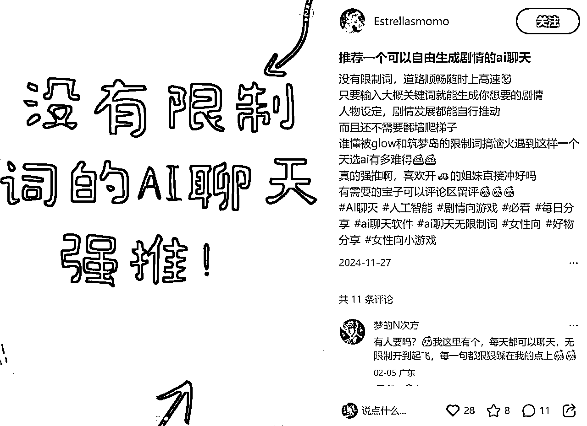

做一个网站，登陆上几个特定的角色，这个角色可以定期给你发话题（对标叨叨），当你无聊时，也会有求必应地和你聊天（对标星野）；他会记住之前的聊天内容。

更好的是，我们可以设置”剧情模式“，让用户身临其境地参与到与角色互动的剧情中！

和星野、叨叨无法比较的是，或许还能加入成人内容（

可以让用户参与到调教中来，不过必须审核

用户喜欢某个角色，会有几条

以角色为中心的优势：可以玩一下seo

#### 为什么不做了？

1.  流量无法推广，现在国外有c ai，国内有星野，几乎是被垄断

1.  ’现在AI技术已经发展出来了在微信里接入AI角色和你聊天，且网络上有现成的开源教程

最后做了手动在小红书引流的路径....

# 一些感悟

1.  首先要感谢刀姐在星球AI探索家里举行新牛马大赛，在这样的一个环境下我主动push自己去调研、学习、解决卡点，参加过两期新牛马大赛，我成长了很多

1.  这个项目我最后能跑通离不开之前的积累。之前有了解过代写这个项目，虽然也就赚了一点，但是比较熟悉里面的商业模型，这就会方便我将代写的商业模式迁移到下一个项目之中

# 最后不做了

为什么不做了呢？

1.  增长缓慢，无法扩大

我有想过拓展其他角色，创建多个账号，但是流量比较差

本质上还是进行服务的交付，用一份时间换一份的钱

1.  只是AI发展到一定阶段的产物，商业化空间快速缩小

本质上赚的钱是国内大家不会用语音克隆工具，不会使用AI而已

随着AI技术越发展，这样的产品会被更加高级的AI直接吞并

小排老师曾经说过：去做那些随着大模型能力变强、产品价值也会增加的产品。

这是我未来的努力方向。

# 现在、以后准备做什么？

虽然我这个项目停止了，但是我发现情绪消费巨大的潜力空间。

现在正在和刀姐做毛绒玩具文创项目，未来打算从事文创、AI、出海方向（现在还在探索阶段）

感谢大家读到这里~

这篇文档是当时新牛马大会时期给围观组交付的比较详细的sop手册

现在想想自己当时权利义务”拖家带口“做项目的经历还是很好玩hhhhh